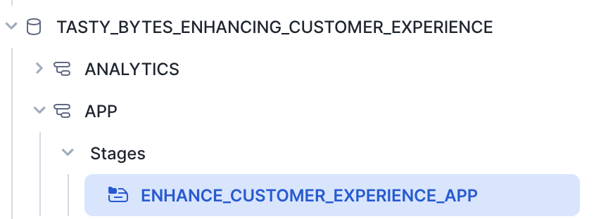
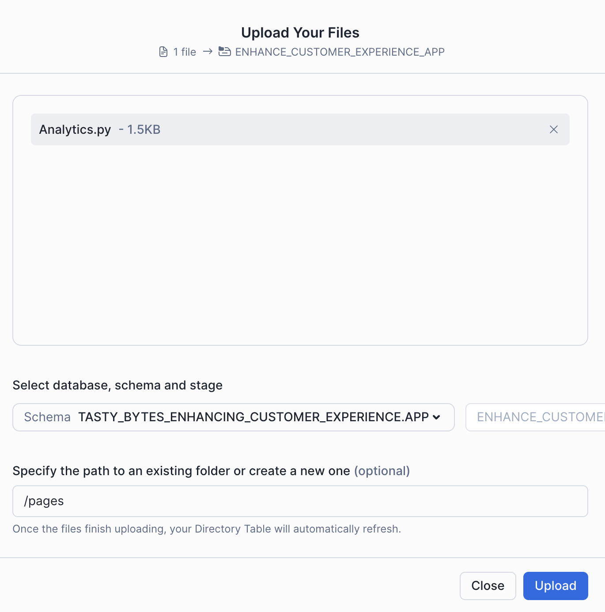
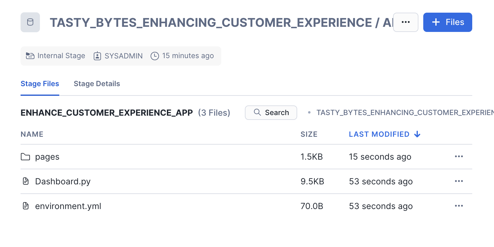
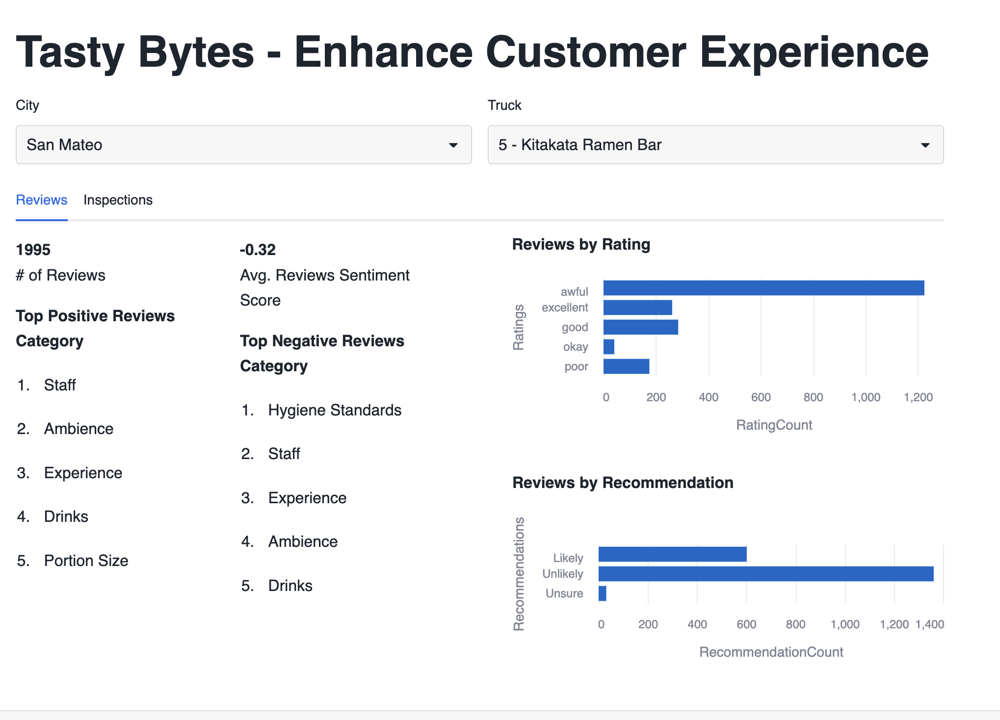
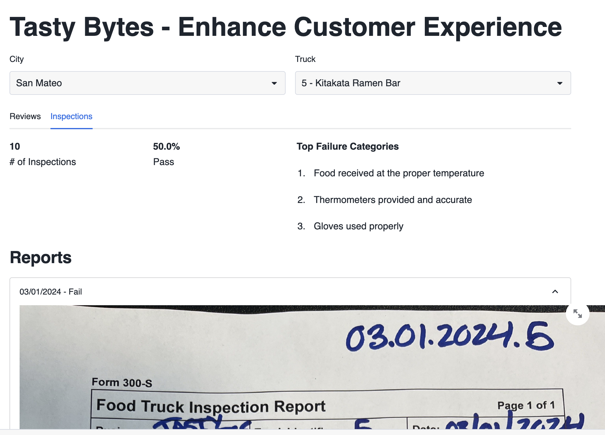
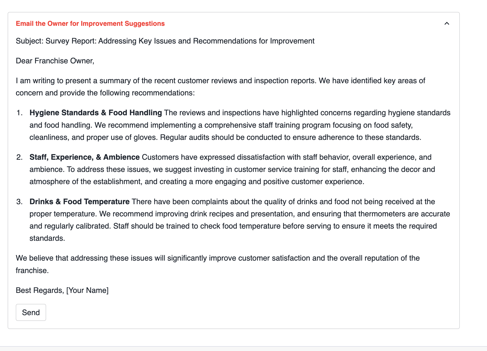
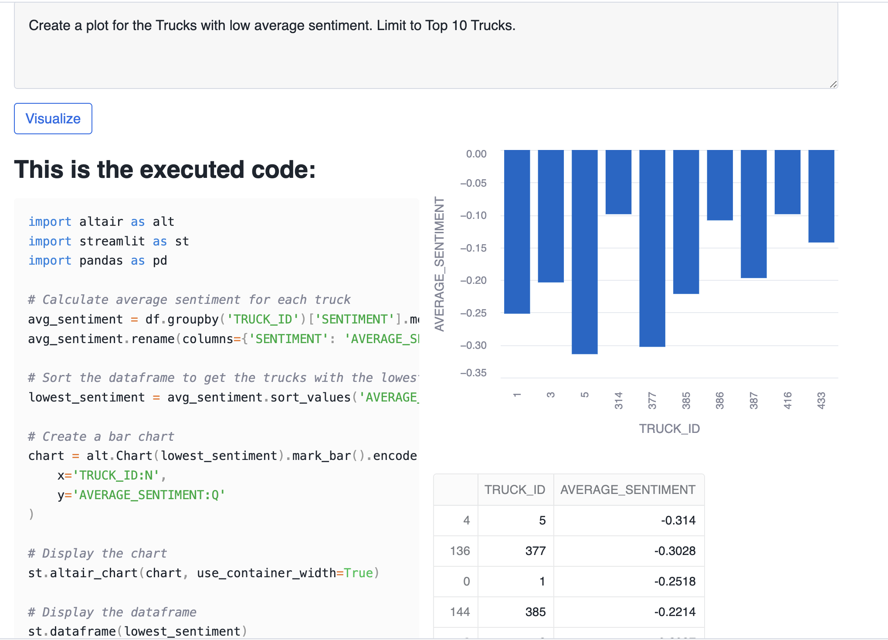

author: Charlie Hammond
id: tasty-bytes-customer-experience-app
categories: snowflake-site:taxonomy/solution-center/certification/quickstart, snowflake-site:taxonomy/product/data-engineering
language: en
summary: This application supports Tasty Bytes management by analyzing both customer reviews and food truck inspections, streamlining communication with truck owners to improve the overall customer experience. 
environments: web
status: Published 
feedback link: https://github.com/Snowflake-Labs/sfguides/issues

# Tasty Bytes - Enhance Customer Experience Using Unstructured Data
<!-- ------------------------ -->
## Overview 


Welcome to the Powered by Tasty Bytes - Enhance Customer Experience Using Unstructured Data Quickstart!

This application supports Tasty Bytes management by analyzing both customer reviews and food truck inspections, streamlining communication with truck owners to improve the overall customer experience. By leveraging Cortex functions, it conducts sentiment analysis to assist in drafting emails for owners. Moreover, it includes built-in analytics for users to interact with review data and generate plots using LLM capabilities. Additionally, the integration of Document AI enhances its analytical prowess by extracting insights from handwritten, unstructured inspection documents.

### What You’ll Learn 
- How to build a Streamlit app in Snowflake
- How to build a multi-page Streamlit app in Snowflake
- How to use Cortex LLMs in your application
- How DocumentAI can be used to create analytics from unstructured data

### What You’ll Need 
- Snowflake account 

### What You’ll Build 
- A Streamlit application using Cortex and DocumentAI to provide insights into truck operations

<!-- ------------------------ -->
## Setup

### Step 1 - Accessing hosted Setup SQL in GitHub
- Click the button below which will direct you to our Tasty Bytes SQL Setup file that is hosted on GitHub.

<button>[setup.sql](https://github.com/Snowflake-Labs/sfguide-tasty-bytes-enhancing-customer-experience/blob/main/customer-experience-app/setup/setup.sql)</button>

### Step 2 - Run the contents of setup.sql

Open a new Snowsight worksheet and run all commands from setup.sql.

### Step 3 - Load Streamlit Files

- Download all files from the [app directory](https://github.com/Snowflake-Labs/sfguide-tasty-bytes-enhancing-customer-experience/tree/main/customer-experience-app/app). This includes the file in the pages subdirectory.
- In Snowsight, change role to sysadmin
- open the tasty_bytes_customer_support_email.app.customer_support_email_app stage



- Click + Files in the top right of the stage
- Upload all files that you downloaded from GitHub into the stage. The contents should match the app directory
  - Dashboard.py and environment.yml are at the top level
  - Analytics.py is in the pages folder. 





### Step 4 - Create the Streamlit App

Run the code below in a Snowsight worksheet to build the Streamlit app.

```sql
USE ROLE sysadmin;

CREATE OR REPLACE STREAMLIT tasty_bytes_enhancing_customer_experience.app.enhancing_customer_experience_app
ROOT_LOCATION = '@tasty_bytes_enhancing_customer_experience.app.enhance_customer_experience_app'
MAIN_FILE = 'Dashboard.py'
QUERY_WAREHOUSE = 'tasty_bytes_enhancing_customer_experience_wh'
COMMENT = '{"origin":"sf_sit-is", "name":"voc", "version":{"major":1, "minor":0}, "attributes":{"is_quickstart":1, "source":"streamlit", "vignette":"cust_exp_app"}}';

GRANT USAGE ON STREAMLIT tasty_bytes_enhancing_customer_experience.app.enhancing_customer_experience_app TO ROLE enhancing_customer_expereience_role;
```

### Step 5 - Open the Streamlit App

- From Snowsight, ensure you are using the enhancing_customer_experience_role role.
- Under Projects, click Streamlit
- Open ENHANCE_CUSTOMER_EXPERIENCE_APP from the list of apps

<!-- ------------------------ -->
## Running the Enhancing Customer Experiences Using Unstructured Data App

This application consists of two sections. The dashboard presents reviews and inspection details for each truck, while the analytics section offers the ability to generate plots based on review data.

- To begin, navigate to the dashboard and select Truck 5 - Kitakata Ramen Bar. Once selected, you'll gain access to insights about the truck's reviews. 



- Navigate to the inspections tab to view insights derived from inspections. If you wish to enhance the customer experience, you can opt to contact the owner.



- Expand the Email the Owner for Improvement Suggestions section, which provides suggested emails to the truck owner, highlighting the top three issues and recommendations for improvement.



- In the analytics section, you have the option to draw plots based on your specific requirements. For instance, you can identify trucks with low review sentiment by requesting a plot for Create a plot for the Trucks with low average sentiment. Limit to Top 10 Trucks.



### Troubleshooting

If you are getting an error related to model availability, you can enable [cross region inference](https://docs.snowflake.com/en/user-guide/snowflake-cortex/cross-region-inference). To do that run the following sql `ALTER ACCOUNT SET CORTEX_ENABLED_CROSS_REGION = 'ANY_REGION';`

<!-- ------------------------ -->
## Understanding the Enhancing Customer Experiences Using Unstructured Data App

### Cortex Complete

Cortex complete generates a response (completion) to a prompt using your choice of supported language model. In the Enhancing Customer Experience App, we use Cortex Complete to generate emails and build custom analytics graphs. You can read more [documentation here](https://docs.snowflake.com/en/sql-reference/functions/complete-snowflake-cortex).

#### Generate Email Responses

We generate emails to truck owners using Cortex Complete. We pass the prompt and model (mistral-large) to Cortex complete to automatically generate an email based on inspection issues at their truck.  

```python
prompt =f"""[INST]### Write me survey report email to the franchise owner summarizing the issues mentioned in following 
            aggregated customer reviews and inspections with three concise bullet points under 50 words each such that each bullet 
            point also has a heading along with recommendations to remedy those issues. Negative Reviews Category:
            {negative_review_categories}. Inspection Reports Category: {negative_inspection_categories}[/INST]"""
email_suggestion = Complete('mistral-large', prompt.replace("'", "''"))
```

#### Create Analytics Graphs

We again use Cortex Complete to create custom analytics graphs. We later use **code** to build analytics based on our own Tasty Bytes data. 

```python
prompt = f'You are a python developer that writes code using altair and streamlit to visualize data. \
            Your data input is a pandas dataframe that you can access with df. \
            The pandas dataframe has the following columns: {column_specifications}.\
            {prompt}\
            If you are asked to return a list, create a dataframe and use st.dataframe() to display the dataframe.'
code = Complete('mistral-large', prompt.replace("'", "''"))
```

### DocumentAI

Unstructured inspection documents are used in the app. We have previously used DocumentAI to structure the contents of inspection reports and use that data for insights. Check out the [Extracting Insights from Unstructured Data with Document AI](/en/developers/guides/tasty-bytes-extracting-insights-with-docai/) Quickstart for details on that process. 

<!-- ------------------------ -->
## Conclusion And Resources

Congratulations, you have built an application in Streamlit using Cortex LLMs to enhance Tasty Bytes customer experience. This powerful application helps Tasty Bytes owners quickly understand truck metrics, including unstructured inspection data. We also used Cortex LLMs to generate emails to truck owners based on that unstructured data.

If you want to learn more about Enhancing Customer Experience with Tasty Bytes, check out the quickstarts in the resources section. 

### What You Learned
- How to build a Streamlit in Snowflake App
- How to build a multi-page Streamlit in Snowflake App
- How to use Cortex LLMs in your application including
- How DocumentAI can be used to create analytics from unstructured data

### Related Resources
- [Extracting Insights from Unstructured Data with Document AI](/en/developers/guides/tasty-bytes-extracting-insights-with-docai/) 
- [Streamlit in Snowflake Documentation](https://docs.snowflake.com/en/developer-guide/streamlit/about-streamlit)
- [Cortex LLM Functions](https://docs.snowflake.com/en/user-guide/snowflake-cortex/llm-functions)
- [Tasty Bytes - RAG Chatbot Using Cortex and Streamlit](/en/developers/guides/tasty-bytes-customer-experience-app/)
- [Tasty Bytes - Customer Support Streamlit App](/en/developers/guides/tasty-bytes-customer-support-email-app/)
