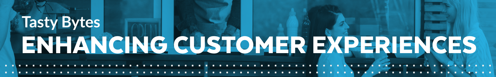
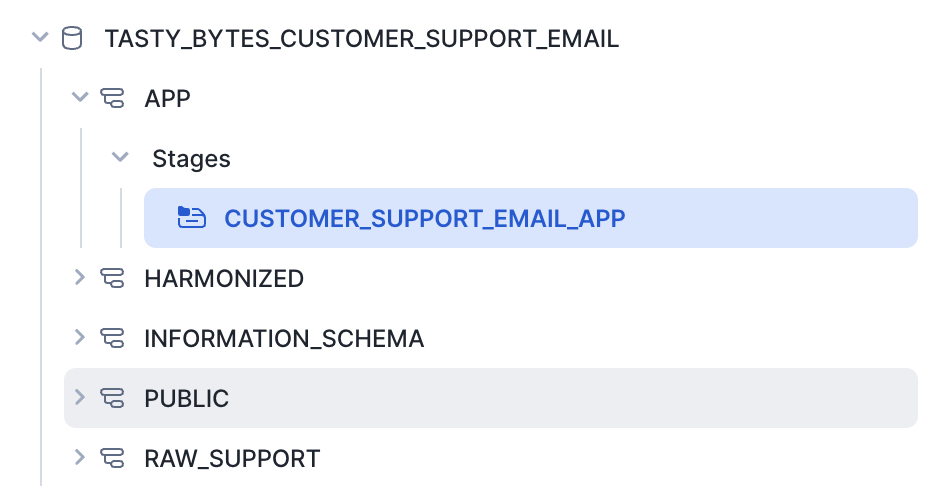
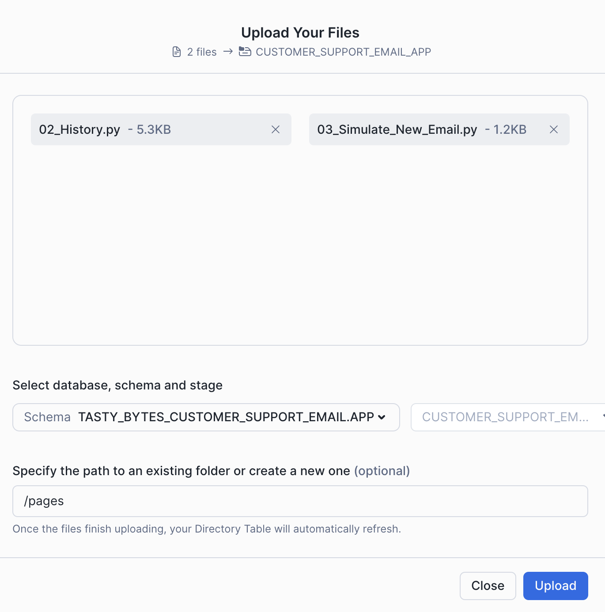
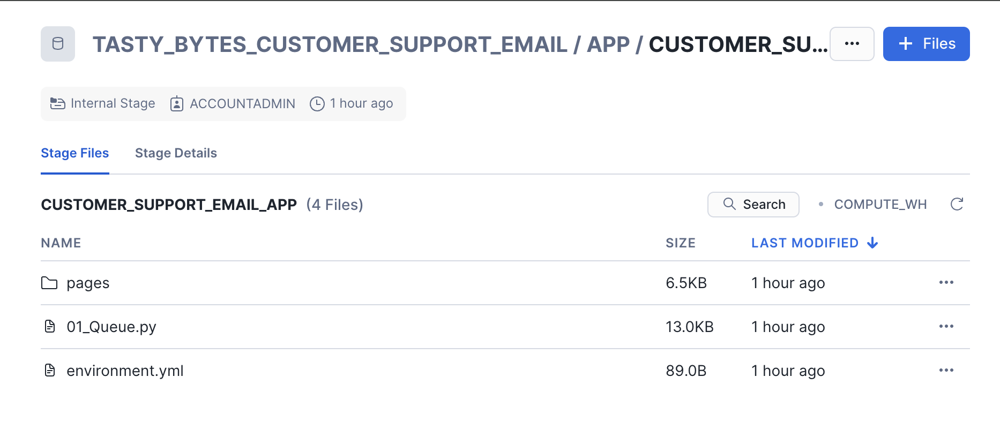
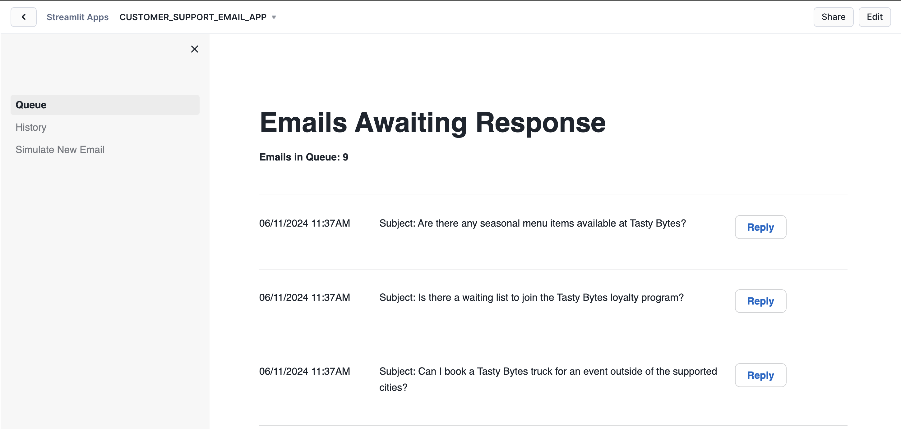
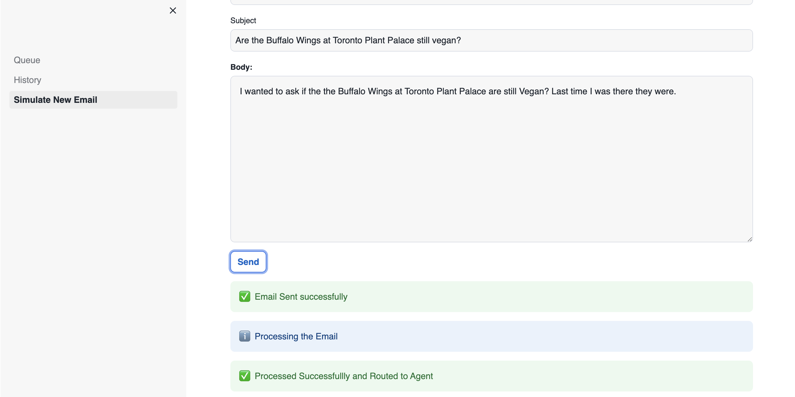
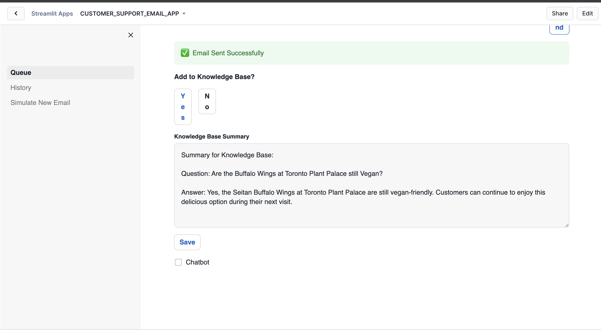

author: Charlie Hammond
id: tasty-bytes-customer-support-email-app
categories: snowflake-site:taxonomy/solution-center/certification/quickstart, snowflake-site:taxonomy/product/ai, snowflake-site:taxonomy/snowflake-feature/ingestion/conversational-assistants, snowflake-site:taxonomy/snowflake-feature/cortex-llm-functions
language: en
summary: This quickstart builds a customer support email application in Streamlit using Cortex LLM features to help agents quickly and effectively answer customer questions. 
environments: web
status: Published 
feedback link: https://github.com/Snowflake-Labs/sfguides/issues

# Tasty Bytes - Customer Support Streamlit Application Powered by Cortex
<!-- ------------------------ -->
## Overview 



Welcome to the Powered by Tasty Bytes - Customer Support Email App!

This application streamlines the workload of call center agents by automating responses to customer emails using a knowledge base. When an email arrives, a Cortex LLM determines if it can address the customer query using the knowledge base. If it can, an automatic response is sent; if not, the email is directed to an agent. Agents have the choice to reply to customer emails, with a Cortex LLM offering suggested responses.

Additionally, agents can contribute responses to the knowledge base, enabling the LLM to address similar queries automatically in the future. Sentiment scores are generated from both agent and auto-responses for further analysis. Moreover, there's an option to simulate a new email for demo purposes.

### What You’ll Learn 
- How Snowflake tools can build a full email support application using powerful LLM functionality
- How to build a multi-page Streamlit in Snowflake App
- How to use Cortex LLMs in your application, including:
  - [Cortex Complete](https://docs.snowflake.com/en/sql-reference/functions/complete-snowflake-cortex)
  - [Cortex Sentiment Analysis](https://docs.snowflake.com/en/sql-reference/functions/sentiment-snowflake-cortex)

### What You’ll Need 
- Snowflake account 

### What You’ll Build 
- A customer support Streamlit application powered by Cortex LLMs

<!-- ------------------------ -->
## Setup

### Step 1 - Accessing hosted Setup SQL in GitHub
- Click the button below which will direct you to our Tasty Bytes SQL Setup file that is hosted on GitHub.

<button>[setup.sql](https://github.com/Snowflake-Labs/sfguide-tasty-bytes-enhancing-customer-experience/blob/main/customer-support-email-app/setup/setup.sql)</button>

### Step 2 - Run the contents of setup.sql

Open a new Snowsight worksheet and run all commands from setup.sql.

### Step 3 - Load Streamlit Files

- Download all files from the [app directory](https://github.com/Snowflake-Labs/sfguide-tasty-bytes-enhancing-customer-experience/tree/main/customer-support-email-app/app). This includes all files in the pages subdirectory.
- In Snowsight, change the role to **sysadmin**
- open the **tasty_bytes_customer_support_email.app.customer_support_email_app** stage



- Click + Files in the top right of the stage
- Upload all files that you downloaded from GitHub into the stage. The contents should match the app directory
  - 01_Queue.py and environment.yml are at the top level
  - 02_History.py and 03_Simulate_New_Email.py and in the pages folder. 





### Step 4 - Create the Streamlit App

Run the code below in a Snowsight worksheet to build the Streamlit app.

```sql
USE ROLE sysadmin;

CREATE OR REPLACE STREAMLIT tasty_bytes_customer_support_email.app.customer_support_email_app
ROOT_LOCATION = '@tasty_bytes_customer_support_email.app.customer_support_email_app'
MAIN_FILE = '01_Queue.py'
QUERY_WAREHOUSE = 'tasty_bytes_customer_support_email_wh'
COMMENT='{"origin":"sf_sit-is", "name":"voc", "version":{"major":1, "minor":0}, "attributes":{"is_quickstart":1, "source":"streamlit", "vignette":"customer_email_app"}}';

GRANT USAGE ON STREAMLIT tasty_bytes_customer_support_email.app.customer_support_email_app TO ROLE customer_support_email_role;
```

### Step 5 - Open the Streamlit App

- From Snowsight, ensure you are using the **customer_support_email_role** role.
- Under Projects, click Streamlit
- Open **CUSTOMER_SUPPORT_EMAIL_APP** from the list of apps



<!-- ------------------------ -->
## Running the Customer Support Email App

This application is divided into three sections.

- Queue displays a list of emails awaiting responses to customers.
- History showcases emails previously addressed by agents and auto-responses from LLM.
- Additionally, there's an option to Simulate a New Email, acting as a customer for demonstration purposes.
The primary objective of this demonstration is to illustrate how the app utilizes the knowledge base in real-time.

Let's simulate a scenario where we first act as a customer, sending an email that the LLM cannot answer. Then, we will act as a Customer Support Agent to respond, adding the summarized response to our knowledge base or corpus, and resend a similar email to trigger an auto-response from LLM.

To do this, please follow the steps below:

- Click on Simulate New Email
- Send a new email with the following information:
  - **Body:** I wanted to ask if the the Buffalo Wings at Toronto Plant Palace are still Vegan? Last time I was there they were.
  - **Email Address:** Use your email or a fake email address
  - **Subject:** Are the Buffalo Wings at Toronto Plant Palace still vegan?
- Click Send to dispatch the email, which the LLM will process. Since the auto-response Knowledge Base lacks information about this query, it will be routed to an agent.



- Navigate to the Queue to view the list of emails to be addressed.
- Scroll to the bottom and click Reply next to the email sent. This action reveals the full email and a suggested response generated by LLM for sending to the customer.


- Click Send to dispatch the email. You will then be prompted to add the response to the knowledge base.
- Choose Yes to add it, which will provide a summary for addition.
- Click Save to store the response in the knowledge base. Additionally, you have the option to interact with the chatbot for further assistance.



- Now that the response is saved to the knowledge base, you can pose the same or a similar question again to observe the auto-response.
- Once the auto-response is received, navigate to the History section to view the response.

If you prefer not to find something new to add to the knowledge base for each demo, you can simply delete the ones you added by executing the commands below:
```sql
delete from tasty_bytes_customer_support_email.harmonized.chunk_text
where source = 'EMAIL';

delete from tasty_bytes_customer_support_email.harmonized.vector_store
where source = 'EMAIL';
```

<!-- ------------------------ -->
## Understanding the Customer Support Email App

The following features are used in the customer support email app.

### Auto Response with Cortex Complete

Cortex complete generates a response (completion) to a prompt using your choice of supported language model. In the application, we pass the prompt and model (mistral-large) to Cortex complete to generate a response to the customer's email. You can read more [documentation here](https://docs.snowflake.com/en/sql-reference/functions/complete-snowflake-cortex). 

We add additional information to the prompt to ensure the email is answered accurately.
- **get_context** uses RAG to find the most similar support case and passes the text into our prompt.
- **background_info** is a document explaining many high-level details of Tasty Bytes. This add Tasty Bytes specific data to the prompt.  

```python
def generate_email_response(email):
  prompt = f"""Generate an email response to send to {email['sender']} 
                who is a customer of A Tasty Bytes Food Truck. Do not inlude Subject and use Tasty Bytes Support Team for Best Regards. Provide response to this customer question sent to our support agent 
                at Tasty Bytes Food Truck Company. Use the background information and provided context taken from the 
                most relevant corporate documents or previous support chat logs with other customers. Be concise and only answer 
                the latest question.
                Email Subject from Customer: <Subject> {email['subject']} </Subject>.
                Customer Email Address: <Email_Address> {email['sender']} </Email_Address>.
                Email body is: <EMAIL_BODY> {email['body']} </EMAIL_BODY>.
                Context: <context> {get_context(email['body'], DOC_TABLE)} </context>.
                Background Info: <background_info> {st.session_state.background_info} </background_info>."""
  response = Complete('mistral-large', prompt.replace("'", "''"))
  return response.strip()
```

### Summarize Emails with Cortex Complete

We again leverage Cortex Complete to generate a summary of emails manually sent by agents. The email summaries are then added to our knowlege base so agents don't need to answer the question again. 

```python
prompt = f"""Generate a summary to add to the call center knowledge base. If the bot can't answer a customer's 
          question, it should be transferred to an agent. The agent answers the question, and if it's a 
          recurring query, the summary should be stored in the knowledge base. This way, the bot can utilize 
          the knowledge base for future similar inquiries. Create a summary that includes the question and 
          its corresponding answer for storage in the knowledge base. Question is: 
          {st.session_state.current_record['body']} and answer is:
          {st.session_state.email_response}"""
response = Complete('mistral-large', prompt.replace("'", "''"))
```

### Cortex Sentiment

[Cortex Sentiment Analysis](https://docs.snowflake.com/en/sql-reference/functions/sentiment-snowflake-cortex) is used to determine the sentiment of customer emails. You can use SNOWFLAKE.CORTEX.SENTIMENT in a standard query to determine the sentiment of text. In the code below, the single line is added to our query returning emails to collect the sentiment. 

```python
agent_history = session.sql("""SELECT 
                                  es.email_id,
                                  es.email_object AS Email_Request,
                                  er.email_response AS Email_Response,
                                  er.sent_ts,
                                  SNOWFLAKE.CORTEX.SENTIMENT(CONCAT('Email from Customer is: ', TO_VARCHAR(es.email_object), ', Response from Company is: ', TO_VARCHAR(er.email_response))) AS sentiment_score
                                FROM 
                                  raw_support.email_status_app es
                                JOIN 
                                  raw_support.email_response_app er ON es.email_id = er.email_id
                                WHERE 
                                  1=1
                                  AND es.responded_flag = TRUE
                                  AND es.email_status_code = 3
                                  and er.email_response is not null
                                ORDER BY 
                                er.sent_ts DESC;""").to_pandas()
```

### RAG Chatbot

The app has an embedded RAG chatbot for agents to ask more questions of the knowlege base. Check out the [Tasty Bytes - RAG Chatbot Using Cortex and Streamlit](/en/developers/guides/tasty-bytes-rag-chatbot-using-cortex-and-streamlit/) quickstart for more details on building RAG chatbots. 

<!-- ------------------------ -->
## Conclusion And Resources

Congratulations! You have built a customer support email application in Streamlit using Cortex LLMs. This powerful application helps Tasty Bytes customer support agents quickly and accurately answer customer emails, including automatic responses. 

Check out several the [Tasty Bytes - RAG Chatbot Using Cortex and Streamlit](/en/developers/guides/tasty-bytes-customer-experience-app/) and [Tasty Bytes - Enhance Customer Experience Streamlit App](/en/developers/guides/tasty-bytes-rag-chatbot-using-cortex-and-streamlit/) to learn more about how Streamlit and Cortex helps Tasty Bytes improve customer experience. 

### What You Learned
- How Snowflake tools can build a full email support application using powerful LLM functionality
- How to build a multi-page Streamlit in Snowflake App
- Learn how to use Cortex LLMs in your application including:
  - [Cortex Complete](https://docs.snowflake.com/en/sql-reference/functions/complete-snowflake-cortex)
  - [Cortex Sentiment Analysis](https://docs.snowflake.com/en/sql-reference/functions/sentiment-snowflake-cortex)

### Related Resources
- [Streamlit in Snowflake Documentation](https://docs.snowflake.com/en/developer-guide/streamlit/about-streamlit)
- [Cortex LLM Functions](https://docs.snowflake.com/en/user-guide/snowflake-cortex/llm-functions)
- [Tasty Bytes - RAG Chatbot Using Cortex and Streamlit](/en/developers/guides/tasty-bytes-customer-experience-app/)
- [Tasty Bytes - Enhance Customer Experience Streamlit App](/en/developers/guides/tasty-bytes-rag-chatbot-using-cortex-and-streamlit/)
