author: Jacob Kranzler
id: tasty-bytes-extracting-insights-with-docai
categories: snowflake-site:taxonomy/solution-center/certification/quickstart, snowflake-site:taxonomy/product/data-engineering, snowflake-site:taxonomy/snowflake-feature/transformation, snowflake-site:taxonomy/snowflake-feature/document-ai
language: en
summary: Walkthrough extracting data from PDF Inspection Reports using Document AI 
environments: web
status: Published 
feedback link: https://github.com/Snowflake-Labs/sfguides/issues


# Extracting Insights from Unstructured Data with Document AI
<!-- ------------------------ -->

## Overview


### Overview
Within this Quickstart, we will walk through how to train and leverage a Document Extraction Model using Document AI. We will use this model to convert unstructured Inspection Reports into structured, easy-to-analyze rows and columns all within the Snowflake AI Data Cloud.

- [Document AI Documentation](https://docs.snowflake.com/en/user-guide/snowflake-cortex/document-ai/overview)

- [Snowflake's Artic-TILT LLM for Document AI Documentation](/blog/arctic-tilt-compact-llm-advanced-document-ai/)

### Prerequisites
- A Supported Snowflake [Browser](https://docs.snowflake.com/en/user-guide/setup#browser-requirements)
- A Snowflake Account
    - If you do not have a Snowflake Account, please [**sign up for a Free 30 Day Trial Account**](https://signup.snowflake.com/?utm_source=snowflake-devrel&utm_medium=developer-guides&utm_cta=developer-guides). When signing up, please make sure to select **Enterprise** edition. You can choose any AWS or Azure [Snowflake Region](https://docs.snowflake.com/en/user-guide/intro-regions).
    - After registering, you will receive an email with an activation link and your Snowflake Account URL.
    
### What You Will Learn 
- How to Upload Files to a Stage
- How to Train a Data Extraction Model using Document AI
- How to Extract Data from Unstructured Documents
- How to Flatten Semi-Structured Data

## Database, Warehouse, Role and Privileges

### Overview
For this section, please create a new Snowflake SQL Worksheet by Navigating to Projects -> Worksheets and clicking the **+** button. 

Once your Worksheet is created, rename the Worksheet to **DocumentAI Quickstart Setup** before moving on.

### Step 1 - Setting up our Account
Please copy the following SQL and paste it in your Worksheet. Once pasted, run all of the queries at once using **Run All** which will deploy the following within your account:

- Database: `tb_doc_ai`
- Schema: `raw_doc`
- Stages: `doc_ai`, `inspection_reports`
- Warehouse: `doc_ai`
- Role: `tb_doc_ai`
- Grants and Privileges


```
-- assume the accountadmin role
USE ROLE accountadmin;

-- create the tb_doc_ai database
CREATE OR REPLACE DATABASE tb_doc_ai;

-- create the raw_doc schema
CREATE OR REPLACE SCHEMA tb_doc_ai.raw_doc;

-- create the doc_ai stage
CREATE OR REPLACE STAGE tb_doc_ai.raw_doc.doc_ai
    DIRECTORY = (ENABLE = TRUE)
    ENCRYPTION =  (TYPE = 'SNOWFLAKE_SSE');

-- create the inspection_reports stage
CREATE OR REPLACE STAGE tb_doc_ai.raw_doc.inspection_reports
    DIRECTORY = (ENABLE = TRUE)
    ENCRYPTION =  (TYPE = 'SNOWFLAKE_SSE');

-- create the doc_ai warehouse
CREATE OR REPLACE WAREHOUSE doc_ai
    WAREHOUSE_SIZE = 'small'
    WAREHOUSE_TYPE = 'standard'
    AUTO_SUSPEND = 60
    AUTO_RESUME = TRUE
    INITIALLY_SUSPENDED = TRUE
COMMENT = 'document ai warehouse';

-- create the tb_doc_ai role
CREATE OR REPLACE ROLE tb_doc_ai;

-- grant document ai privileges
GRANT DATABASE ROLE SNOWFLAKE.DOCUMENT_INTELLIGENCE_CREATOR TO ROLE tb_doc_ai;

-- grant doc_ai warehouse privileges
GRANT USAGE, OPERATE ON WAREHOUSE doc_ai TO ROLE tb_doc_ai;

-- grant tb_doc_ai database privileges
GRANT ALL ON DATABASE tb_doc_ai TO ROLE tb_doc_ai;
GRANT ALL ON SCHEMA tb_doc_ai.raw_doc TO ROLE tb_doc_ai;
GRANT CREATE STAGE ON SCHEMA tb_doc_ai.raw_doc TO ROLE tb_doc_ai;
GRANT CREATE SNOWFLAKE.ML.DOCUMENT_INTELLIGENCE ON SCHEMA tb_doc_ai.raw_doc TO ROLE tb_doc_ai;
GRANT ALL ON ALL STAGES IN SCHEMA tb_doc_ai.raw_doc TO ROLE tb_doc_ai;

-- set my_user_var variable to equal the logged-in user
SET my_user_var = (SELECT  '"' || CURRENT_USER() || '"' );

-- grant the logged in user the doc_ai_role
GRANT ROLE tb_doc_ai TO USER identifier($my_user_var);
```

### Step 2 - Downloading and Unzipping our Inspection Reports
For use in a future step, we will need to download 2 separate .zip files that contain a **Train** (5 PDFs) and **Full** (11 PDFs) set of Inspection Reports. 

Please leverage the two buttons below to download these .zip files. Once downloaded please unzip the files into a location that can easily be accessed in our next steps.

- [Training Set ZIP](https://github.com/Snowflake-Labs/sfquickstarts/blob/master/site/sfguides/src/tasty_bytes_extracting_insights_with_docai/assets/inspection_reports_train.zip)

- [Full Set ZIP](https://github.com/Snowflake-Labs/sfquickstarts/blob/master/site/sfguides/src/tasty_bytes_extracting_insights_with_docai/assets/inspection_reports_full.zip)


### Step 3 - Click Next -->

## Uploading our Inspection Reports to our Stage

### Overview

### Step 1 - Navigating to our Stage
Within the Snowsight interface, navigate to Data -> Databases and then search for `TB_DOC_AI`. From there navigate to the `RAW_DOC` schema and the `INSPECTION_REPORTS` stage.

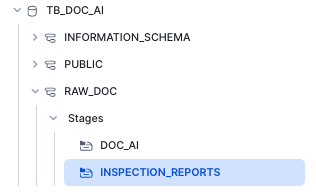

### Step 2 - Uploading our Inspection Reports
In the top-right corner, click the **+Files** button and either drop or browse to the unzipped Inspection Reports Full from Step 1. From there click **Upload**.

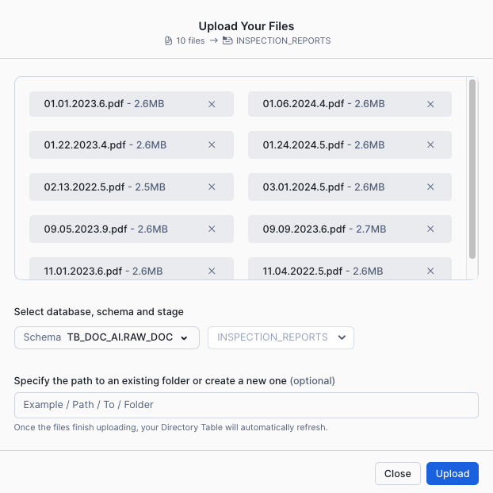

This will kick off our file upload and you will eventually see our Inspection Report PDF's within the Stage.

### Step 3 - Click Next -->

## Training our Document AI Model

### Overview

### Step 1 - Creating our Document AI Build
Within the Snowsight interface please switch your role to `TB_DOC_AI` and, navigate to AI & ML -> Document AI. From there click the **+ Build** button.

Within the New Build screen, enter the following:
- **Build Name:** INSPECTION_REPORT_EXTRACTION
- **Choose Database:** TB_DOC_AI
- **Choose Schema:** RAW_DOC

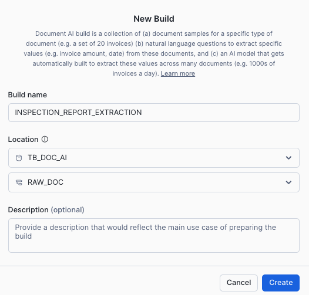

### Step 2 - Uploading our Training Documents
After the build creation is successful, we will land in our Document AI Build Details window, where we can begin our document upload by clicking the **Upload documents** button. 

Within the Upload documents screen drop or browse to the unzipped Training Inspection Reports from Step 1. From there click **Upload**.

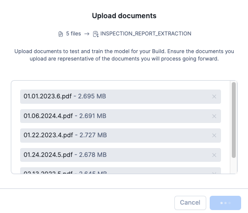


### Step 3 - Specifying our Values and Questions
Once the upload process is complete, please click **Define value** so we can begin to specify value names and questions we want to ask the model.

To begin defining our values to extract from our documents, click the **Add value** button in the right-hand window. 

From here please enter the following set of Values and Questions one by one that are documented below. For each pair, please complete the following before clicking **Add value** to enter the next pair:

**Did the Model extract the Value correctly?**
- If **Yes** - Click the check-box to indicate this value was extracted correctly.
- If **No** - Delete the provided value and enter the correct value.

**Value | Question**
- **TRUCK_ID:** What is the Truck Identifier?
- **DATE:** What is the Date?
- **PIC_PRESENT:** Was the Person in charge present (Y or N)?
- **FOOD_PROPER_TEMP:** Was the Food received at the proper temperature (Y or N)?
- **VEHICLE_RUNS_WELL:** Did the Vehicle run and was it in well maintained condition?

> 
> For demonstration purposes, we are only extracting 5 values however please feel free to add more.
> 
> Please see [Question optimization for extracting information with Document AI](https://docs.snowflake.com/en/user-guide/snowflake-cortex/document-ai/optimizing-questions) for best practices.
>

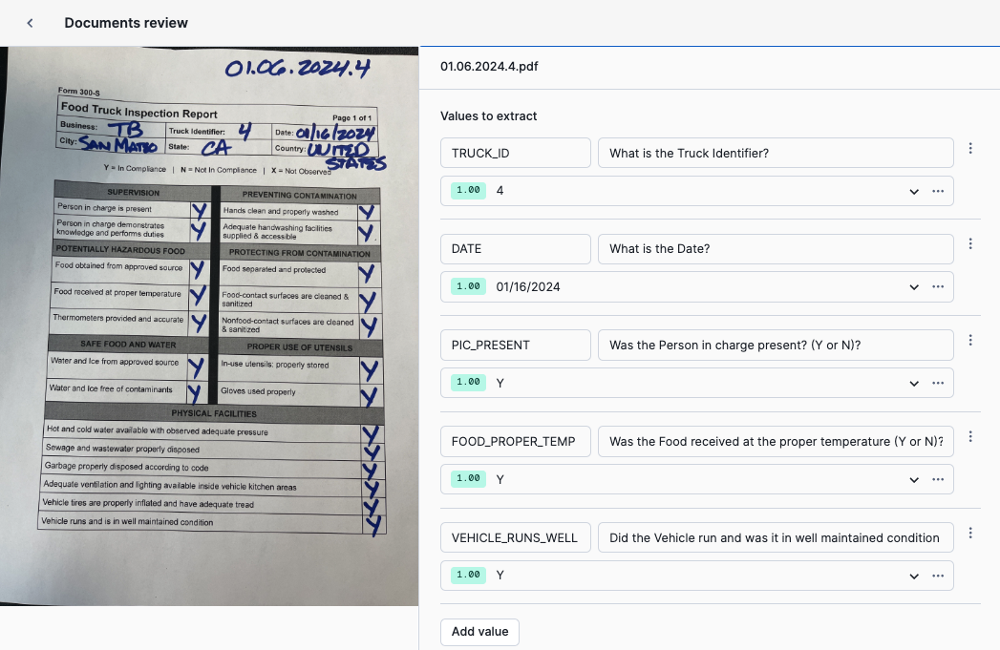

### Step 4 - Reviewing our Test Documents
After completing our initial document review in the previous step, we will now review the models' initial extraction results for our remaining test documents.

To begin, please move on to the second document by clicking the arrow at the bottom of the screen.


Once the next document appears, please again conduct the following steps for each Value and Question pair.

**Did the Model extract the Value correctly?**
- If **Yes** - Click the check-box to indicate this value was extracted correctly.
- If **No** - Delete the provided value and enter the correct value.

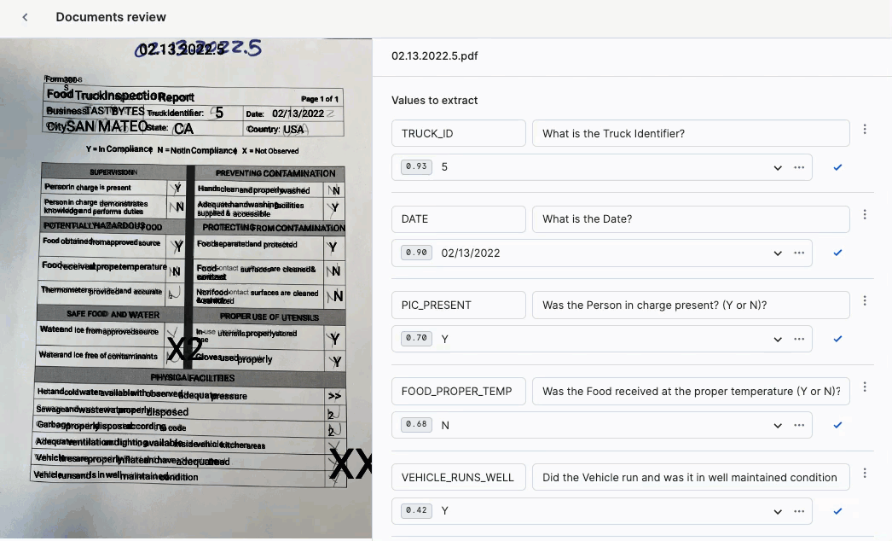

After completing review of all documents, please navigate back to the Document AI UI by click the arrow next to **Documents review**

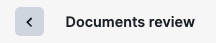

Next navigate to the Build Details tab.

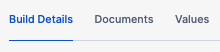

### Step 5 - Training our Model
Using the **Model accuracy** tile, we will now train our model by clicking the **Train model** button. Within the **Start training** pop-up click **Start Training** which will take around 20 minutes.

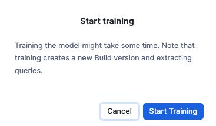

- For more on Document AI training time estimation please visit our [Document AI documentation](https://docs.snowflake.com/en/user-guide/snowflake-cortex/document-ai/prepare-model-build#training-time-estimation).

When training is complete, you will see **Trained** next to the model name indicating it is ready to be leveraged.


### Step 6 - Click Next -->

## Using our Document AI Model against our Inspection Reports

### Overview
In the last section, we walked through training our Inspection Report Extraction model in Snowflake. We will now use that model to extract our values from the full set of documents we uploaded to our stage earlier.

Please create a new Snowflake SQL Worksheet by Navigating to Projects -> Worksheets and clicking the **+** button.

Once your Worksheet is created, rename the Worksheet to **DocumentAI Quickstart SQL** before moving on.

### Step 1 - Setting our Context
Within our fresh SQL Worksheet, please execute the following three queries below to set our Role, Warehouse, Database and Schema context. Each of these will result in a `Statement executed successfully message.`

```
USE ROLE tb_doc_ai;
USE WAREHOUSE doc_ai;
USE DATABASE tb_doc_ai;
USE SCHEMA raw_doc;
```

### Step 2 - Listing our Staged Inspection Reports
Using a [LIST](https://docs.snowflake.com/en/sql-reference/sql/list) command, let's first take a look at the files that we staged earlier and want to use our extraction model against.

```
LIST @inspection_reports;
```

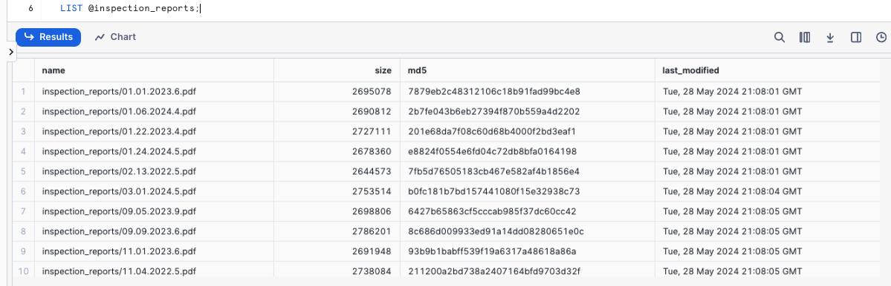


### Step 3 - Extraction for a single Document
To begin our extraction, let's use our model and the [PREDICT](https://docs.snowflake.com/en/sql-reference/classes/classification/methods/predict) method against one of those staged files by executing the next query.

```
SELECT inspection_report_extraction!PREDICT(GET_PRESIGNED_URL(@inspection_reports, '02.13.2022.5.pdf'));
```

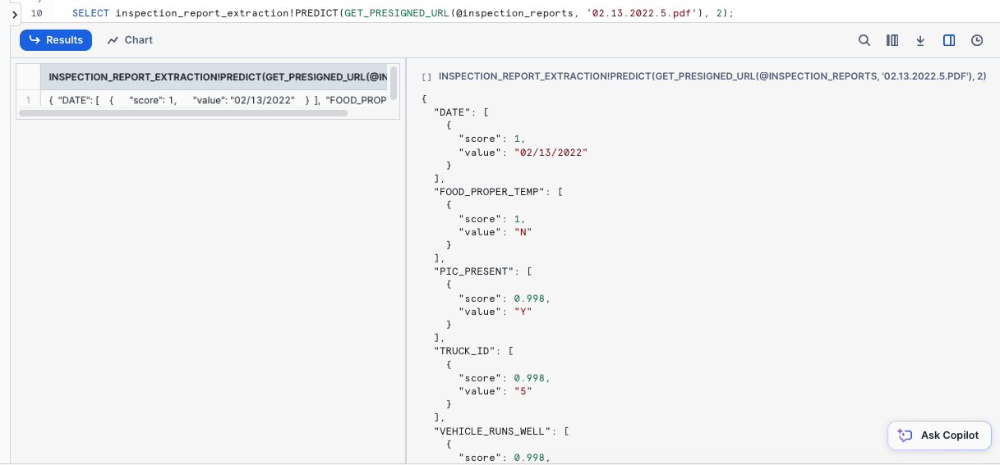


### Step 4 - Extraction for all Documents
Our extracted object looks great, but before we begin to flatten this out let's create a raw table based on extraction from all our staged documents. Please execute the next query which may take around 2 minutes and result in a `Table IR_RAW successfully created.` message.

```
CREATE OR REPLACE TABLE ir_raw
COMMENT = '{"origin":"sf_sit-is", "name":"voc", "version":{"major":1, "minor":0}, "attributes":{"is_quickstart":1, "source":"sql", "vignette":"docai"}}'
AS
SELECT inspection_report_extraction!PREDICT(GET_PRESIGNED_URL(@inspection_reports, RELATIVE_PATH)) AS ir_object
FROM DIRECTORY(@inspection_reports);
```

Before moving on let's take a look at our raw, extracted results.

```
SELECT * FROM ir_raw;
```

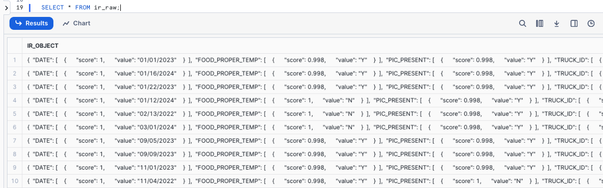


### Step 5 - Flattening our Extracted Object
Everything that was extracted for each document is present in the `ir_object` column. To make analysis easier, let's complete the Quickstart by using Snowflake's Semi-Structured Data Support to show how we can extract columns from our object. 

In production, a Data Engineer would typically flatten and promote this data downstream through our Medallion Architecture using objects like Dynamic Tables or Views.

Please execute the next query in which we will use [Dot Notation](https://docs.snowflake.com/en/user-guide/querying-semistructured#dot-notation) to:
    - Extract and normalize Date to a consistent format
    - Extract TRUCK_ID
    - Extract PIC_PRESENT and FOOD_PROPER_TEMP and convert Y to Pass, N to Fail and X to Not Observed

```
SELECT
    TO_DATE(REPLACE(ir_object:"DATE"[0].value::varchar,'-','/')) AS date,
    ir_object:"TRUCK_ID"[0].value::varchar AS truck_id, 
    CASE
        WHEN ir_object:"PIC_PRESENT"[0].value::varchar = 'Y' THEN 'Pass' -- convert Y to Pass
        WHEN ir_object:"PIC_PRESENT"[0].value::varchar = 'N' THEN 'Fail' -- convert N to Fail
        WHEN ir_object:"PIC_PRESENT"[0].value::varchar = 'X' THEN 'Not Observed' -- convert X to Not Observed
        ELSE 'Not Observed'
    END AS person_in_charge_present,
    CASE
        WHEN ir_object:"FOOD_PROPER_TEMP"[0].value::varchar = 'Y' THEN 'Pass' -- convert Y to Pass
        WHEN ir_object:"FOOD_PROPER_TEMP"[0].value::varchar = 'N' THEN 'Fail' -- convert N to Fail
        WHEN ir_object:"FOOD_PROPER_TEMP"[0].value::varchar = 'X' THEN 'Not Observed' -- convert X to Not Observed
        ELSE 'Not Observed'
    END AS food_proper_temp
FROM ir_raw
ORDER BY truck_id;
```

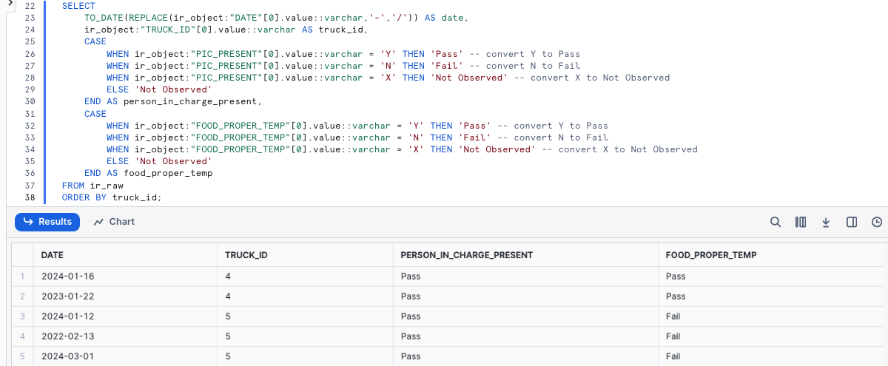

**Amazing!** Exactly as desired we have moved from Unstructured PDF to easy to digest tabular results in the matter of minutes all within the Snowflake AI Data Cloud.

### Step 6 - Click Next -->

## Conclusion and Resources

**Fantastic work!** You have successfully completed the Extracting Insights with Document AI Quickstart walking through the process of moving PDF to tabular result. 

### What you Learned
- How to Upload Files to a Stage
- How to Train a Data Extraction Model using Document AI
- How to Extract Data from Unstructured Documents
- How to Flatten Semi-Structured Data

### Related Resources
- [Source Code on GitHub](https://github.com/Snowflake-Labs/sfguide-tasty-bytes-extract-insights-from-unstructured-data-using-document-ai)
- [Powered by Tasty Bytes - Quickstarts Table of Contents](/en/developers/guides/tasty-bytes-introduction/)
- [Document AI](https://docs.snowflake.com/en/user-guide/snowflake-cortex/document-ai/overview)
- [Snowflake's Artic-TILT LLM for Document AI Documentation]((/blog/arctic-tilt-compact-llm-advanced-document-ai/))

  
