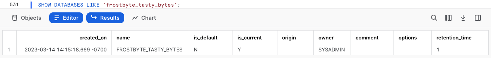
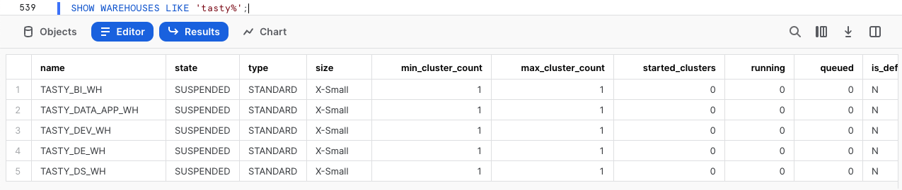

author: Jacob Kranzler
id: tasty-bytes-introduction-fr
categories: snowflake-site:taxonomy/solution-center/certification/quickstart, snowflake-site:taxonomy/product/data-engineering
language: fr
summary: Présentation de Tasty Bytes 
environments: web
status: Published 
feedback link: https://github.com/Snowflake-Labs/sfguides/issues


# Présentation de Tasty Bytes
<!-- ------------------------ -->

## Présentation de Tasty Bytes 

### Présentation
Dans ce guide Quickstart Présentation de Tasty Bytes, vous allez tout d’abord découvrir la marque fictive de food trucks Tasty Bytes, créée par l’équipe frosbyte chez Snowflake.

Ensuite, nous allons configurer le modèle de données de base de Tasty Bytes, les rôles et entrepôts spécifiques aux workloads, ainsi que tout contrôle d’accès basé sur les rôles (RBAC) requis. 

À la fin de ce guide Quickstart, vous aurez déployé tous les éléments de base requis pour exécuter les guides Quickstart figurant dans notre section [Guides Quickstart Powered by Tasty Bytes](/fr/developers/guides/tasty-bytes-introduction-fr/).

### Qu’est-ce que Tasty Bytes ?


### Conditions préalables
- Un [navigateur](https://docs.snowflake.com/fr/user-guide/setup#browser-requirements) Snowflake pris en charge
- Un compte Snowflake Enterprise ou Business Critical
    - Si vous n’avez pas de compte Snowflake, [**créez un compte d’essai gratuit de 30 jours**](https://signup.snowflake.com/?utm_source=snowflake-devrel&utm_medium=developer-guides&utm_cta=developer-guides). Lors de votre inscription, assurez-vous de sélectionner l’édition **Enterprise**. Vous pouvez sélectionner [le cloud/la région Snowflake](https://docs.snowflake.com/fr/user-guide/intro-regions) de votre choix.
    - Une fois inscrit, vous recevrez un e-mail avec un lien d’activation et une URL pour accéder à votre compte Snowflake.
    - 
    
### Vous allez apprendre : 
- Comment créer une feuille de calcul Snowflake
- Comment exécuter toutes les requêtes dans une feuille de calcul Snowflake de manière synchrone
- Comment explorer des bases de données, schémas, tables, rôles et entrepôts via des commandes SQL dans une feuille de calcul Snowflake

### Vous allez créer :
- Les éléments de base Tasty Bytes nécessaires à l’exécution des guides Quickstart Powered by Tasty Bytes 
    - Une base de données Snowflake
    - Des schémas bruts, harmonisés et d’analyse comprenant des tables et des vues
    - Des rôles et entrepôts Snowflake spécifiques aux workloads
    - Un contrôle d’accès basé sur les rôles (RBAC)

## Configuration de Tasty Bytes

### Présentation
Pour ce guide Quickstart, vous allez utiliser l’interface Web Snowflake appelée Snowsight. Si vous utilisez Snowsight pour la première fois, nous vous recommandons vivement de consulter notre [documentation Snowsight](https://docs.snowflake.com/fr/user-guide/ui-snowsight).

### Étape 1 – Accéder à Snowflake via une URL
- Ouvrez une fenêtre de navigateur et saisissez l’URL de votre compte Snowflake. Si vous n’avez pas de compte Snowflake, retournez à la section précédente afin de créer un compte d’essai Snowflake gratuit. 

### Étape 2 – Se connecter à Snowflake
- Connectez-vous à votre compte Snowflake.
    - 

### Étape 3 – Accéder aux feuilles de calcul
- Cliquez sur l’onglet Worksheets (Feuilles de calcul) dans la barre de navigation de gauche.
    - 

### Étape 4 – Créer une feuille de calcul
- Sous l’onglet Worksheets (Feuilles de calcul), cliquez sur le bouton « + » dans le coin supérieur droit de Snowsight, puis sélectionnez « SQL Worksheet » (Feuille de calcul SQL).
    - 

### Étape 5 – Renommer une feuille de calcul
- Renommez la feuille de calcul en cliquant sur le nom généré automatiquement (horodatage), puis en saisissant "Tasty Bytes – Configuration".
    - 

### Étape 6 – Accéder au fichier de configuration SQL hébergé dans GitHub
- Cliquez sur le bouton ci-dessous pour être redirigé vers notre fichier de configuration SQL Tasty Bytes hébergé sur GitHub.

<button>[tb_introduction.sql](https://github.com/Snowflake-Labs/sf-samples/blob/main/samples/tasty_bytes/tb_introduction.sql)</button>

### Étape 7 – Copier le fichier de configuration SQL depuis GitHub
- Dans GitHub, à droite, cliquez sur « Copy raw contents » (Copier le contenu brut). L’ensemble du fichier SQL requis est copié dans votre presse-papiers.
    - 

### Étape 8 – Coller le fichier de configuration SQL depuis GitHub dans une feuille de calcul Snowflake
- Revenez dans Snowsight et dans votre nouvelle feuille de calcul, puis collez (*CMD + V pour Mac ou CTRL + V pour Windows*) ce que vous venez de copier dans GitHub.

### Étape 9 – Exécuter de manière synchrone tous les fichiers de configuration SQL
- Cliquez dans la nouvelle feuille de calcul Tasty Bytes – Configuration, sélectionnez tout (*CMD + A pour Mac ou CTRL + A pour Windows*), puis cliquez sur « ► Run » (Exécuter). 
    - 

### Étape 10 – Terminer la configuration
- Après avoir cliqué sur « ► Run » (Exécuter), les requêtes commenceront à s’exécuter. Celles-ci s’exécutent les unes après les autres sur toute la feuille de calcul. Ce processus prend environ 5 minutes. Une fois le processus terminé, le message `frostbyte_tasty_bytes setup is now complete` s’affiche pour indiquer que la configuration est terminée.
    - 

### Étape 11 – Cliquer sur Next (Suivant) -->

## Exploration des éléments de base Tasty Bytes

### Présentation
Une fois la configuration de Tasty Bytes terminée, nous pouvons explorer la base de données, les rôles et les entrepôts que nous avons créés. 

> 
>

### Étape 1 – Explorer la base de données Tasty Bytes
Cette requête va renvoyer la base de données que nous avons créée via [SHOW DATABASES](https://docs.snowflake.com/fr/sql-reference/sql/show-databases.html). 
```
SHOW DATABASES LIKE 'frostbyte_tasty_bytes';
``` 
 

### Étape 2 – Explorer les schémas de la base de données Tasty Bytes
Cette requête va renvoyer les schémas de la base de données que nous avons créée via [SHOW SCHEMAS](https://docs.snowflake.com/fr/sql-reference/sql/show-schemas). 
```
SHOW SCHEMAS IN DATABASE frostbyte_tasty_bytes;
``` 
 

### Étape 3 – Explorer les tables du schéma RAW_POS de la base de données Tasty Bytes
Cette requête va renvoyer les tables du schéma `raw_pos` via [SHOW TABLES](https://docs.snowflake.com/fr/sql-reference/sql/show-tables) 
```
SHOW TABLES IN SCHEMA frostbyte_tasty_bytes.raw_pos;
``` 
 

### Étape 4 – Explorer les rôles Tasty Bytes
Cette requête va renvoyer les rôles que nous avons créés via [SHOW ROLES](https://docs.snowflake.com/fr/sql-reference/sql/show-roles). 
```
SHOW ROLES LIKE 'tasty%';
``` 
 

### Étape 5 – Explorer les entrepôts Tasty Bytes
Cette requête va renvoyer les entrepôts que nous avons créés via [SHOW WAREHOUSES](https://docs.snowflake.com/fr/sql-reference/sql/show-warehouses). 
```
SHOW WAREHOUSES LIKE 'tasty%';
``` 
 

### Étape 6 – Tout rassembler
Les trois requêtes suivantes vont : 
1. Supposer le rôle `tasty_data_engineer` via [USE ROLE](https://docs.snowflake.com/fr/sql-reference/sql/use-role.html). 
2. Exploiter l’entrepôt `tasty_de_wh` via [USE WAREHOUSE](https://docs.snowflake.com/fr/sql-reference/sql/use-warehouse.html). 
3. Interroger notre table `raw_pos.menu` pour trouver quels éléments de menu sont vendus par nos food trucks Plant Palace.
    
``` 
USE ROLE tasty_data_engineer; USE WAREHOUSE tasty_de_wh;

SELECT m.menu_type_id, m.menu_type, m.truck_brand_name, m.menu_item_name FROM frostbyte_tasty_bytes.raw_pos.menu m WHERE m.truck_brand_name = 'Plant Palace'; 
``` 
 

Incroyable ! Quelques minutes nous ont suffi pour disposer d’un environnement de démonstration Tasty Bytes comprenant les données, rôles et entrepôts configurés dans notre compte Snowflake. Consultons maintenant tous les autres guides Quickstart Tasty Bytes à notre disposition.

### Étape 7 – Cliquer sur Next (Suivant) -->

## Guides Quickstart Powered by Tasty Bytes

### Présentation
Félicitations ! Vous avez terminé le guide Quickstart Configuration des éléments de base de Tasty Bytes !

La table des matières ci-dessous présente tous les guides Quickstart Tasty Bytes disponibles qui exploitent les éléments de base que nous venons de créer.


### Débuter avec Snowflake

- #### [Gouvernance financière](/en/developers/guides/tasty-bytes-zero-to-snowflake-cost-management/)
    - Découvrez les entrepôts virtuels Snowflake et leur configurabilité, les moniteurs de ressources, ainsi que les paramètres de délai d’expiration au niveau des comptes et des entrepôts.
- #### [Transformation](/fr/developers/guides/tasty-bytes-zero-to-snowflake-transformation-fr/)
    - Découvrez les fonctions suivantes de Snowflake : le clonage zéro copie, le cache de jeux de résultats, la manipulation des tables, Time Travel et l’échange/la suppression/la restauration de tables.
- #### [Données semi-structurées](/fr/developers/guides/tasty-bytes-zero-to-snowflake-semi-structured-data-fr/)
    - Découvrez le type de données VARIANT Snowflake, comment traiter des données semi-structurées via la notation par points et la fonction d’aplatissement avec vue latérale, comment créer des vues et comment utiliser des graphiques Snowsight.
- #### [Gouvernance des données](/en/developers/guides/tasty-bytes-zero-to-snowflake-governance-with-horizon/)
    - Découvrez les rôles définis par le système Snowflake, comment créer un rôle personnalisé et lui accorder des autorisations, et comment déployer des politiques d’accès aux lignes et de Dynamic Data Masking basées sur les balises.
- #### [Collaboration](/fr/developers/guides/tasty-bytes-zero-to-snowflake-collaboration-fr/)
    - Découvrez la Marketplace Snowflake en exploitant des données en direct gratuites et disponibles instantanément de Weather Source afin d’effectuer une analyse basée sur les données en harmonisant les sources internes et de tiers.
- #### [Géospatial](/en/developers/guides/tasty-bytes-zero-to-snowflake-geospatial/)
    - Découvrez la prise en charge géospatiale Snowflake : acquérir des données en direct gratuites et instantanément disponibles depuis SafeGraph, créer des points géographiques (ST_POINT), calculer des distances (ST_DISTANCE), collecter des coordonnées (ST_COLLECT), tracer un polygone de délimitation minimale (ST_ENVELOPE), calculer une aire (ST_AREA) et trouver des points centraux (ST_CENTROID).

### Présentations détaillées des workloads (*bientôt disponibles*)


