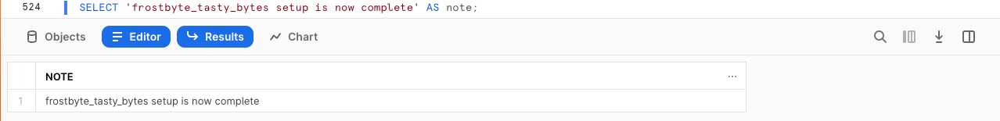

author: Jacob Kranzler
id: tasty-bytes-introduction-ptbr
categories: snowflake-site:taxonomy/solution-center/certification/quickstart, snowflake-site:taxonomy/product/data-engineering, snowflake-site:taxonomy/product/applications-and-collaboration, snowflake-site:taxonomy/snowflake-feature/native-apps
language: pt_br
summary: Este é o quickstart guide “Introdução à Tasty Bytes e base de dados“
environments: web
status: Published 
feedback link: https://github.com/Snowflake-Labs/sfguides/issues


# Introdução à Tasty Bytes
<!-- ------------------------ -->

## Introdução à Tasty Bytes 

### Visão geral
Neste quickstart “Introdução à Tasty Bytes“, você vai conhecer a marca fictícia de food trucks Tasty Bytes, criada pela equipe frostbyte da Snowflake.

Após saber mais sobre a organização Tasty Bytes, vamos realizar o processo de configuração do modelo de dados funcional da Tasty Bytes, bem como de funções e armazenamentos específicos das cargas de trabalho e de todo o controle de acesso baseado em funções (role-based access control, RBAC) necessário. 

Ao finalizar este guia, você terá implementado os elementos básicos necessários para executar os quickstarts da seção [Powered by Tasty Bytes - quickstarts](/pt_br/developers/guides/tasty-bytes-introduction-ptbr/).

### Quem é a Tasty Bytes?


### Pré-requisitos
- Um [navegador](https://docs.snowflake.com/pt/user-guide/setup#browser-requirements) compatível com Snowflake.
- Conta Snowflake Enterprise ou Business Critical.
    - Caso não possua uma conta Snowflake, [**inscreva-se para receber uma conta de avaliação gratuita de 30 dias**](https://signup.snowflake.com/?utm_source=snowflake-devrel&utm_medium=developer-guides&lang=pt-br&utm_cta=developer-guides). No ato da inscrição, escolha a opção **Enterprise**. É possível escolher qualquer [nuvem/região do Snowflake](https://docs.snowflake.com/pt/user-guide/intro-regions).
    - Após a inscrição, você receberá um email com um link de ativação e a URL da sua conta Snowflake.
    - 
    
### Você vai aprender 
- Criar uma planilha do Snowflake.
- Executar todas as consultas de uma planilha do Snowflake de forma síncrona.
- Explorar bancos de dados, esquemas, tabelas, funções e armazenamentos via SQL em uma planilha do Snowflake.

### O que será desenvolvido
- Elementos básicos para a Tasty Bytes que permitam executar os Powered by Tasty Bytes - quickstarts. 
    - Um banco de dados Snowflake.
    - Esquemas brutos, harmonizados e analíticos completos com tabelas e exibições.
    - Funções e armazenamentos Snowflake específicos das cargas de trabalho.
    - Controle de acesso baseado em funções (RBAC)

## Configuração da Tasty Bytes

### Visão geral
Neste quickstart, você usará a interface da web do Snowflake, conhecida como Snowsight. Caso seja sua primeira vez usando o Snowsight, recomendamos consultar a [documentação do Snowsight](https://docs.snowflake.com/pt/user-guide/ui-snowsight) para obter orientações gerais.

### Etapa 1 - Acessar o Snowflake via URL
- Abra o navegador e insira a URL da sua conta Snowflake. Caso ainda não tenha uma conta Snowflake, volte à seção anterior para se inscrever em uma conta de avaliação gratuita. 

### Etapa 2 - Fazer login no Snowflake
- Acesse sua conta Snowflake.
    - 

### Etapa 3 - Acessar as planilhas
- Clique na guia Worksheets na barra de navegação à esquerda.
    - 

### Etapa 4 - Criar uma planilha
- Dentro da guia Worksheets, clique no botão “+” no canto superior direito do Snowsight e escolha “SQL Worksheet”.
    - 

### Etapa 5 - Renomear uma planilha
- Renomeie a planilha clicando no carimbo de data/hora gerado automaticamente e digite “Tasty Bytes, configuração”.
    - 

### Etapa 6 - Acessar o Setup SQL armazenado no GitHub
- Clique no botão abaixo para acessar o arquivo Tasty Bytes Setup SQL hospedado no GitHub.

<button>[tb_introduction.sql](https://github.com/Snowflake-Labs/sf-samples/blob/main/samples/tasty_bytes/tb_introduction.sql)</button>

### Etapa 7 - Copiar o Setup SQL do GitHub
- No GitHub, navegue para a direita e clique em “Copy raw contents”. Todas as informações SQL necessárias serão copiadas para sua área de transferência.
    - 

### Etapa 8 - Colar o Setup SQL do GitHub para a sua planilha do Snowflake
- Volte para o Snowsight e sua planilha recém-criada e cole (*CMD + V no Mac ou CTRL + V no Windows*) o conteúdo copiado do GitHub.

### Etapa 9 - Executar de modo síncrono todo o Setup SQL
- Clique dentro da nova planilha Tasty Bytes - Setup, selecione tudo (*CMD + A no Mac ou CTRL + A no Windows*) e clique em "► Run". 
    - 

### Etapa 10 - Concluir a configuração
- Após clicar em "► Run", as consultas começarão a ser executadas. As consultas vão ser executadas uma após a outra, com a conclusão da planilha em cerca de 5 minutos. Após a conclusão, você verá a seguinte mensagem: `frostbyte_tasty_bytes setup is now complete`.
    - 

### Etapa 11 - Clicar em Next -->

## Exploração dos elementos básicos da Tasty Bytes

### Visão geral
Após configurar a Tasty Bytes com sucesso, podemos agora explorar o banco de dados, as funções e os armazenamentos que criamos. 

> 
>

### Etapa 1 - Explorar o banco de dados Tasty Bytes
Essa consulta apresentará o banco de dados que criamos com o comando [SHOW DATABASES](https://docs.snowflake.com/pt/sql-reference/sql/show-databases.html). 
```
SHOW DATABASES LIKE 'frostbyte_tasty_bytes';
``` 
. 

### Etapa 2 - Explorar os esquemas dentro do banco de dados Tasty Bytes
Essa consulta apresentará os esquemas dentro do banco de dados que criamos com o comando [SHOW SCHEMAS](https://docs.snowflake.com/pt/sql-reference/sql/show-schemas). 
```
SHOW SCHEMAS IN DATABASE frostbyte_tasty_bytes;
``` 
. 

### Etapa 3 - Explorar as tabelas do esquema RAW_POS no banco de dados Tasty Bytes
Esta consulta apresentará as tabelas no esquema `raw_pos` com o comando [SHOW TABLES](https://docs.snowflake.com/pt/sql-reference/sql/show-tables) 
```
SHOW TABLES IN SCHEMA frostbyte_tasty_bytes.raw_pos;
``` 
. 

### Etapa 4 - Explorar as funções Tasty Bytes
Essa consulta apresentará as funções que criamos com o comando [SHOW ROLES](https://docs.snowflake.com/pt/sql-reference/sql/show-roles). 
```
SHOW ROLES LIKE 'tasty%';
``` 
. 

### Etapa 5 - Explorar os armazenamentos Tasty Bytes
Esta consulta apresentará os armazenamentos que criamos com o comando [SHOW WAREHOUSES](https://docs.snowflake.com/pt/sql-reference/sql/show-warehouses). 
```
SHOW WAREHOUSES LIKE 'tasty%';
``` 
. 

### Etapa 6 - Combinar todos os elementos
As próximas três consultas vão: 1\. Assumir a função `tasty_data_engineer` com o comando [USE ROLE](https://docs.snowflake.com/pt/sql-reference/sql/use-role.html). 2. Usar o armazenamento `tasty_de_wh` com o comando [USE WAREHOUSE](https://docs.snowflake.com/pt/sql-reference/sql/use-warehouse.html). 3. Consultar nossa tabela `raw_pos.menu` para saber quais itens do menu são vendidos em nossos food trucks com a marca Plant Palace.
    
``` 
USE ROLE tasty_data_engineer; 
USE WAREHOUSE tasty_de_wh;

SELECT 
    m.menu_type_id, 
    m.menu_type, 
    m.truck_brand_name, 
    m.menu_item_name 
FROM frostbyte_tasty_bytes.raw_pos.menu m 
WHERE m.truck_brand_name = 'Plant Palace'; 
``` 
 

Incrível! Em poucos minutos temos um ambiente de demonstração Tasty Bytes completo com dados, funções e armazenamentos configurados na nossa conta Snowflake. Agora, vamos ver todos os outros Tasty Bytes Quickstarts que podemos usar.

### Etapa 7 - Clicar em Next -->

## Powered by Tasty Bytes - quickstarts

### Visão geral
Parabéns! Você acaba de concluir a configuração dos elementos básicos para a Tasty Bytes!

O índice abaixo vai listar todos os Tasty Bytes Quickstarts que podem utilizar os elementos básicos que você acaba de criar.


### Do zero ao Snowflake

- #### [Governança financeira](https://quickstarts.snowflake.com/guide/tasty_bytes_zero_to_snowflake_financial_governance/)
    - Saiba mais sobre os armazenamentos virtuais Snowflake e suas opções de configuração, monitores de recursos e parâmetros de tempo limite no nível de conta e armazenamento.
- #### [Transformação](/en/developers/guides/tasty-bytes-zero-to-snowflake-transformation-ptbr/)
    - Saiba mais sobre o Snowflake Zero Copy Cloning, cache de conjunto de resultados, manipulação de tabelas, Time-Travel e funcionalidades de troca, descarte e cancelamento de descarte de tabelas.
- #### [Dados semiestruturados](/en/developers/guides/tasty-bytes-zero-to-snowflake-semi-structured-data-ptbr/)
    - Saiba mais sobre o formato VARIANT de dados do Snowflake, processamento de dados semiestruturados com uso de notação de pontos e nivelamento lateral, bem como criação de exibições e criação de gráficos com o Snowsight.
- #### [Governança de dados](https://quickstarts.snowflake.com/guide/tasty_bytes_zero_to_snowflake_data_governance/)
    - Saiba mais sobre as funções definidas pelo sistema Snowflake, crie e aplique permissões a uma função personalizada e implemente Dynamic Data Masking baseado em tags e políticas de acesso a linhas.
- #### [Colaboração](/pt_br/developers/guides/tasty-bytes-zero-to-snowflake-collaboration-ptbr/)
    - Saiba mais sobre o Snowflake Marketplace com dados ativos gratuitos, disponibilizados instantaneamente pelo Weather Source para conduzir análises baseadas em dados, harmonizando fontes primárias e terciárias.
- #### [Geoespacial](/en/developers/guides/tasty-bytes-zero-to-snowflake-geospatial/)
    - Saiba mais sobre o suporte geoespacial do Snowflake, começando pela aquisição gratuita de dados ativos e disponíveis instantaneamente do SafeGraph, depois passando para a criação de pontos geográficos (ST_POINT), cálculos de distância (ST_DISTANCE), coleta de coordenadas (ST_COLLECT), criação de um polígono de delimitação mínimo (ST_ENVELOPE), cálculo de área (ST_AREA) e determinação de pontos centrais (ST_CENTROID).

### Guias detalhados das cargas de trabalho (*em breve*)
