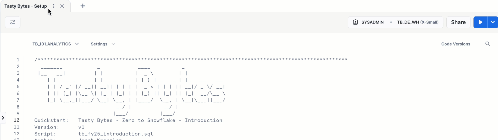
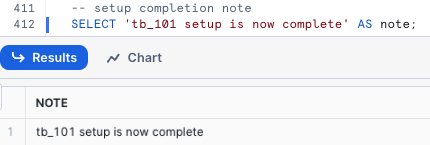
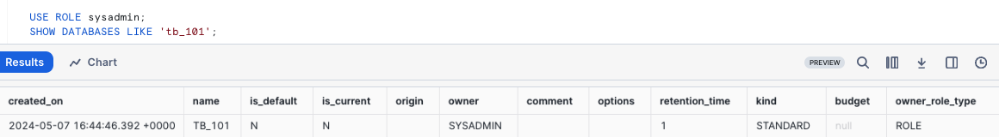
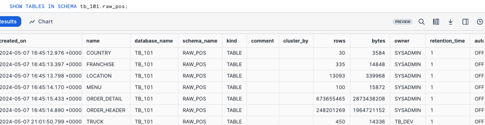
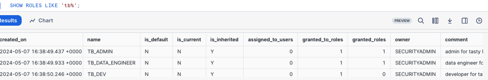
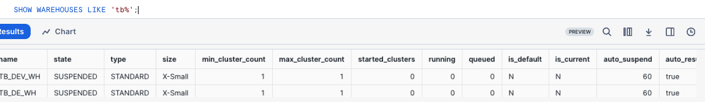
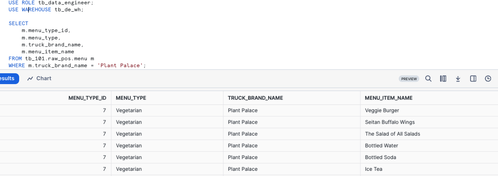

author: Jacob Kranzler
id: tasty-bytes-introduction
categories: snowflake-site:taxonomy/solution-center/certification/quickstart, snowflake-site:taxonomy/product/data-engineering
language: en
summary: This is the Tasty Bytes Introduction and Data Foundation Quickstart guide 
environments: web
status: Archived 
feedback link: https://github.com/Snowflake-Labs/sfguides/issues

# An Introduction to Tasty Bytes
<!-- ------------------------ -->

## An Introduction to Tasty Bytes 


### Overview
Within this Tasty Bytes Introduction Quickstart you will first be learning about the fictitious food truck brand, Tasty Bytes, created by Snowflake.

After learning about the Tasty Bytes Organization, we will complete the process of setting up the Tasty Bytes Foundational Data Model, Workload Specific Roles + Warehouses and all necessary Role Based Access Control (RBAC). 

Upon finishing this Quickstart, you will have deployed the foundation required to run the Quickstarts seen in our [Powered by Tasty Bytes - Quickstarts](/en/developers/guides/tasty-bytes-introduction/) section.

### Who is Tasty Bytes?


### Prerequisites
- A Supported Snowflake [Browser](https://docs.snowflake.com/en/user-guide/setup#browser-requirements)
- An Enterprise or Business Critical Snowflake Account
    - If you do not have a Snowflake Account, please [**sign up for a Free 30 Day Trial Account**](https://signup.snowflake.com/?utm_source=snowflake-devrel&utm_medium=developer-guides&utm_cta=developer-guides). When signing up, please make sure to select **Enterprise** edition. You are welcome to choose any [Snowflake Cloud/Region](https://docs.snowflake.com/en/user-guide/intro-regions).
    - After registering, you will receive an email with an activation link and your Snowflake Account URL.
    - 
    
### What You Will Learn 
- How to Create a Snowflake Worksheet
- How to Execute All Queries within a Snowflake Worksheet Synchronously
- How to Explore Databases, Schemas, Tables, Roles and Warehouses via SQL in a Snowflake Worksheet

### What You Will Build
- The Tasty Bytes Foundation that empowers you to run Powered by Tasty Bytes - Quickstarts. 
    - A Snowflake Database
    - Raw, Harmonized and Analytic Schemas complete with Tables and Views
    - Workload Specific Snowflake Roles and Warehouses
    - Role Based Access Control (RBAC)

## Setting up Tasty Bytes

### Overview
For this Quickstart, you will use the Snowflake web interface known as Snowsight. If this is your first time leveraging Snowsight, we highly recommend taking a look at our [Snowsight Documentation](https://docs.snowflake.com/en/user-guide/ui-snowsight) for a high-level walkthrough.

### Step 1 - Accessing Snowflake via URL
- Open a browser window and enter the URL of your Snowflake Account. If you do not already have a Snowflake account please revisit the previous section to sign up for a Free Snowflake Trial Account. 

### Step 2 - Logging into Snowflake
- Log into your Snowflake account.

### Step 3 - Navigating to Worksheets
- Click on the Projects Tab in the left-hand navigation bar and click Worksheets.

### Step 4 - Creating a Worksheet
- Within Worksheets, click the "+" button in the top-right corner of Snowsight.

### Step 5 - Renaming a Worksheet
- Rename the Worksheet by clicking on the auto-generated Timestamp name and inputting "Tasty Bytes - Introduction"

### Step 6 - Accessing hosted Setup SQL in GitHub
- Click the button below which will direct you to our Tasty Bytes SQL Setup file that is hosted on GitHub.

<button>[tb_introduction.sql](https://github.com/Snowflake-Labs/sf-samples/blob/main/samples/tasty_bytes/FY25_Zero_To_Snowflake/tb_introduction.sql)</button>

### Step 7 - Copying Setup SQL from GitHub
- Within GitHub navigate to the right side and click "Copy raw contents". This will copy all of the required SQL into your clipboard.
    - 

### Step 8 - Pasting Setup SQL from GitHub into your Snowflake Worksheet
- Path back to Snowsight and your newly created Worksheet and Paste (*CMD + V for Mac or CTRL + V for Windows*) what we just copied from GitHub.

### Step 9 - Synchronously Running all Setup SQL
- Click inside the newly created Tasty Bytes - Setup Worksheet, and next to "► Run" Click "▼" and choose "Run All"
    - 

### Step 10 - Completing Setup
- After clicking "Run All" you will see queries begin to execute. These queries will run one after another with the entire worksheet taking around 3 minutes. Upon completion you will see a message stating `tb_101 setup is now complete` .
    - 


### Step 11 - Click Next -->

## Exploring the Tasty Bytes Foundation

### Overview
With the Tasty Bytes Setup successful, we can now explore the Database, Roles and Warehouses we created. 

> 
>**Note:** Within the *Tasty Bytes - Setup* worksheet you created in previous section, please scroll to the bottom and Copy, Paste and  Run the SQL included in each step below.
>

### Step 1 - Exploring the Tasty Bytes Database
This query will return the Database we created via [SHOW DATABASES](https://docs.snowflake.com/en/sql-reference/sql/show-databases.html) using our SYSADMIN role.
```
USE ROLE sysadmin;
SHOW DATABASES LIKE 'tb_101';
```
 


### Step 2 - Exploring the Schemas within the Tasty Bytes Database
This query will return the Schemas within the Database we created via [SHOW SCHEMAS](https://docs.snowflake.com/en/sql-reference/sql/show-schemas).
```
SHOW SCHEMAS IN DATABASE tb_101;
```
 


### Step 3 - Exploring the Tables within the RAW_POS Schema within the Tasty Bytes Database
This query will return the Tables within the `raw_pos` schema via [SHOW TABLES](https://docs.snowflake.com/en/sql-reference/sql/show-tables)
```
SHOW TABLES IN SCHEMA tb_101.raw_pos;
```
 


### Step 4 - Exploring the Tasty Bytes Roles
This query will return the Roles we created via [SHOW ROLES](https://docs.snowflake.com/en/sql-reference/sql/show-roles).
```
SHOW ROLES LIKE 'tb%';
```
 


### Step 5 - Exploring the Tasty Bytes Warehouses
This query will return the Warehouses we created via [SHOW WAREHOUSES](https://docs.snowflake.com/en/sql-reference/sql/show-warehouses).
```
SHOW WAREHOUSES LIKE 'tb%';
```
 


### Step 6 - Putting it All Together
These next three queries will:
1. Assume the `tb_data_engineer` role via [USE ROLE](https://docs.snowflake.com/en/sql-reference/sql/use-role.html)
2. Leverage the `tb_de_wh` Warehouse via [USE WAREHOUSE](https://docs.snowflake.com/en/sql-reference/sql/use-warehouse.html)
3. Query our `raw_pos.menu` table to find which Menu Items are sold at our Plant Palace branded food trucks.
    
```
USE ROLE tb_data_engineer;
USE WAREHOUSE tb_de_wh;

SELECT
    m.menu_type_id,
    m.menu_type,
    m.truck_brand_name,
    m.menu_item_name
FROM tb_101.raw_pos.menu m
WHERE m.truck_brand_name = 'Plant Palace';
```
 

Amazing! Within a few minutes we now have a Tasty Bytes demo environment complete with data, roles and warehouses set up in our Snowflake account. Let's now take a look at all of the other Tasty Bytes Quickstarts available to us to leverage.

### Step 7 - Click Next -->

## Powered by Tasty Bytes - Quickstarts

### Overview
Congratulations! You have now completed the Tasty Bytes Foundational Setup!

The Table of Contents below will outline all of the available Tasty Bytes Quickstarts that leverage the foundation you just built.


### Zero to Snowflake

- #### [Cost Management](/en/developers/guides/tasty-bytes-zero-to-snowflake-cost-management/)
    - Learn about Snowflake Virtual Warehouses and their configurability, Resource Monitors, Account and Warehouse Level Timeout Parameters, and Exploring Cost.
- #### [Transformation](/en/developers/guides/tasty-bytes-zero-to-snowflake-transformation/)
    - Learn about Snowflake Cloning, Caching, Table Manipulation, Time-Travel and Table level Swap, Drop and Undrop functionality.
- #### [Semi-Structured Data](/en/developers/guides/tasty-bytes-zero-to-snowflake-semi-structured-data/)
    - Learn about Snowflake VARIANT Data Type, Semi-Structured Data Processing via Dot and Bracket Notation and Lateral Flattening, Array Functions, View creation, and Snowsight Charting.
- #### [Governance with Snowflake Horizon](/en/developers/guides/tasty-bytes-zero-to-snowflake-governance-with-horizon/)
    - Learn about Snowflake System Defined Roles, Role Based Access Control, Tag Based Masking, Policies (Row-Access, Aggregation, and Projection), Data Classification, Access History and Universal Search.
- #### [Collaboration](/en/developers/guides/tasty-bytes-zero-to-snowflake-collaboration/)
    - Learn about the Snowflake Marketplace by leveraging free, instantly available, live data from Weathersource to conduct data driven analysis harmonizing first and third party sources.
- #### [Geospatial](/en/developers/guides/tasty-bytes-zero-to-snowflake-geospatial/)
    - Learn Snowflake's Geospatial capabilities, beginning with obtaining free, real-time data from SafeGraph. Progress through creating geographic points (ST_POINT), measuring distances (ST_DISTANCE), aggregating coordinates (ST_COLLECT), establishing a Minimum Bounding Polygon (ST_ENVELOPE), determining areas (ST_AREA), identifying central points (ST_CENTROID), and executing advanced Geospatial Analysis using the H3 (Hexagonal Hierarchical Geospatial Indexing System).

### Other Tasty Bytes Quickstarts
- #### [Extracting Insights from Unstructured Data using DocumentAI](/en/developers/guides/tasty-bytes-extracting-insights-with-docai/)

- #### [Customer Reviews Analytics using Snowflake Cortex](/en/developers/guides/customer-reviews-analytics-using-snowflake-cortex/)

- #### [Tasty Bytes - Snowpark 101 for Data Science](/en/developers/guides/tasty-bytes-snowpark-101-for-data-science/)

- #### [Developing React Native Applications using Snowflake Hybrid Tables](https://quickstarts.snowflake.com/guide/404.html/)

- #### [Tasty Bytes - Developing React Native Data Application with SQL API](/en/developers/guides/developing-tasty-bytes-react-native-application-with-snowflake-sql-api/)

- #### [Integrating Tasty Bytes Location Recommendations ML Model into the React Native Data Application](https://quickstarts.snowflake.com/guide/404.html/)

- #### [Tasty Bytes - Working with Iceberg Tables](/en/developers/guides/tasty-bytes-working-with-iceberg-tables/)


