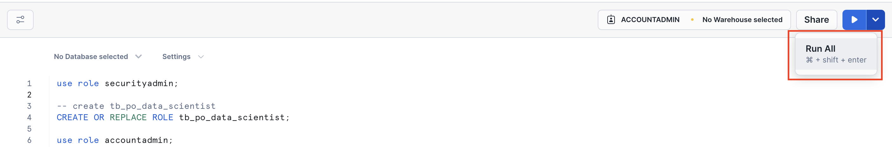
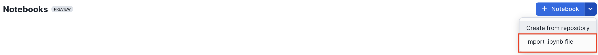
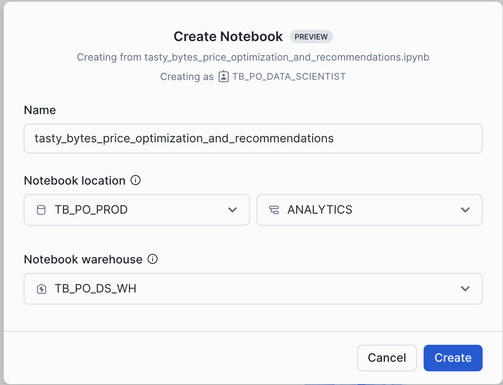
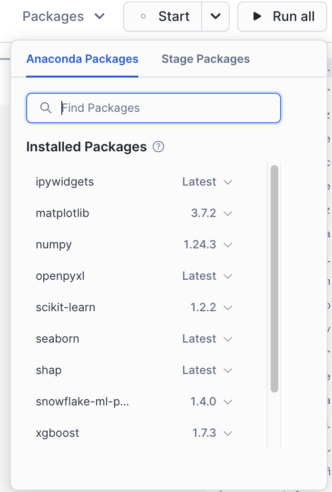
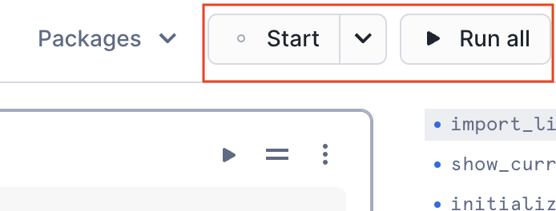
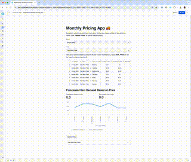
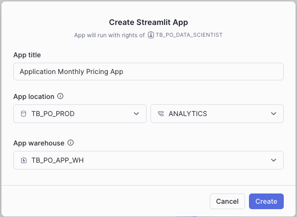
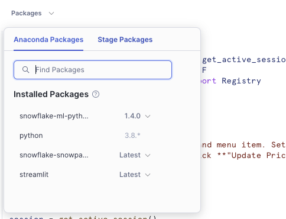

author: Joviane Bellegarde
id: tasty-bytes-price-optimization-using-snowflake-notebooks-and-streamlit
categories: snowflake-site:taxonomy/solution-center/certification/quickstart, snowflake-site:taxonomy/product/data-engineering
language: en
summary: Price Optimization Using Snowflake Notebooks and Streamlit
environments: web
status: Hidden
feedback link: https://github.com/Snowflake-Labs/sfguides/issues


# Price Optimization Using Snowflake Notebooks and Streamlit in Snowflake
<!-- ------------------------ -->

## Overview


Tasty Bytes, a fictitious company, is one of the largest food truck networks in the world with localized menu options spread across 15 food truck brands globally. Tasty Bytes is aiming to achieve 25% YoY sales growth over 5 years. Price optimization enables Tasty Bytes to achieve this goal by determining the right prices for their menu items to maximize profitability while maintaining customer satisfaction. 

In this Quickstart, we will train & deploy an ML model which leverages historical menu-item sale data to understand how menu-item demand changes with varying price. By utilizing this trained model, we would recommend the optimal day of week prices for all menu-items for the upcoming month to our food-truck brands. Afterward, we will showcase an application that can be built and deployed to allow business users to submit data into Snowflake and interact directly with an ML model.

### What You Will Build
You will build a Streamlit in Snowflake (SiS) application that will show the recommended price per item per day-of-week and the profit lift over the current price. We will allow users to change prices and see the impact on demand and profit.

### What You Will Learn
We will implement price optimization for their diversified food-truck brands to inform their pricing and promotions by utilizing **Snowflake Notebooks** and **Streamlit** to:
- Train & deploy an ML model to understand how menu-item demand changes with varying price
- Create a user-friendly application to use deployed ML-model to inform pricing strategies

### Prerequisites
- A Supported Snowflake [Browser](https://docs.snowflake.com/en/user-guide/setup#browser-requirements)
- A Snowflake Account
    - If you do not have a Snowflake Account, please [**sign up for a Free 30 Day Trial Account**](https://signup.snowflake.com/?utm_source=snowflake-devrel&utm_medium=developer-guides&utm_cta=developer-guides). When signing up, please make sure to select **Enterprise** edition. You can choose any AWS or Azure [Snowflake Region](https://docs.snowflake.com/en/user-guide/intro-regions).
    - After registering, you will receive an email with an activation link and your Snowflake Account URL


<!-- ------------------------ -->
## Setting up Data in Snowflake

### Overview
You will use [Snowsight](https://docs.snowflake.com/en/user-guide/ui-snowsight.html#), the Snowflake web interface to:
- Create Snowflake objects (warehouse, database, schema, raw tables)
- Ingest data from S3 to raw tables

#### Creating Objects, Loading Data, and Joining Data
- Navigate to Worksheets, click `+` in the top-right corner to create a new Worksheet, and choose `SQL Worksheet`

- Copy and paste the [tb_po_setup.sql](https://github.com/Snowflake-Labs/sfguide-price-optimization-using-snowflake-notebooks-and-streamlit/blob/main/scripts/sql/tb_po_setup.sql) setup script to create the Snowflake objects (warehouse, database, schema, raw tables), and ingest the data from S3 and click `Run All` at the top of the Worksheet

<!-- ------------------------ -->
## Machine Learning With Snowpark

### Overview
At Tasty Bytes, brand managers are responsible for setting their food-truck brand's menu item prices for the upcoming month. By default, price for the upcoming month is set to the current price. As Tasty Byte Data Scientists, we want to create a user-friendly way for brand managers to use ML-models to inform their pricing and increase the company's profits.
- You are tasked as Tasty Bytes Data Scientist to perform the following:
  - **Data Exploration**
    - Connect to Snowflake
    - Snowpark DataFrame API
  - **Feature Engineering**
    - Window & Aggregate functions
    - Imputation and train/test split
  - **Model Training & Deployment**
    - Train Snowpark ML model
    - Register model on Model Registry
  - **Model Utilization**
    - Stored procedure to utilize deployed model
    - Elastic scalability
    - Data Driven Insights
  - **Describe Current Pricing Process**
    - Import an Excel spreadsheet and inference the demand model
    - Calculate profit lift from new prices

### Setting Up Snowflake Notebook
You will use [Snowsight](https://docs.snowflake.com/en/user-guide/ui-snowsight.html#), the Snowflake web interface, to create a Snowflake Notebook by importing the notebook
- Navigate to Notebooks in [Snowsight](https://docs.snowflake.com/en/user-guide/ui-snowsight.html#) by clicking on `Projects` `->` `Notebook`
- Switch Role to `TB_PO_DATA_SCIENTIST`
- Download the [0_start_here.ipynb](https://github.com/Snowflake-Labs/sfguide-price-optimization-using-snowflake-notebooks-and-streamlit/blob/main/notebooks/0_start_here.ipynb) Notebook
- Using the `Import .ipynb file`, import the downloaded notebook



- Select the `TB_PO_PROD` database and `ANALYTICS` schema for the Notebook Location and `TB_PO_DS_WH` for the Notebook warehouse and click `Create`



- Open the Notebook once created and add the following packages by using the `Packages` button on the top right and search for the packages with their respective versions:
    - `ipywidgets` version `Latest`
    - `matplotlib` version `3.7.2`
    - `numpy` version `1.24.3`
    - `openpyxl` version `Latest`
    - `scikit-learn` version `1.2.2`
    - `seaborn` version `Latest`
    - `shap` version `Latest`
    - `seaborn` version `Latest`
    - `snowflake-ml-python` version `1.4.0`
    - `xgboost` version `1.7.3`



- At the top of the page, click `Start` to start the Notebook session and run the cells by clicking `Run All`




<!-- ------------------------ -->
## Streamlit in Snowflake

### Overview
At Tasty Bytes, brand managers are responsible for setting their food-truck brand's menu item prices for the upcoming month. 
By default, price for the upcoming month is set to the current price. As Tasty Bytes Data Scientists, we want to create a user-friendly way for brand managers to use ML-models to inform their pricing and increase the company's profits. We will build a Streamlit in Snowflake (SiS) application that will show the recommended price per item per day-of-week and the profit lift over the current price. We will allow users to change prices and see the impact on demand and profit. Finalized prices will be saved back to Snowflake. The app will be secure and low-maintenance as it will be deployed through Snowflake.

### Purpose
**The purpose of this final step is to showcase how easily an application can be built and deployed to allow business users to submit data into Snowflake and interact directly with a ML model.** We will build a Streamlit App on the fly in Snowflake to support Tasty Bytes' brand managers in deciding monthly pricing.
- **Build an Application to Set Pricing and Interact with Recommendations**
  - View and edit pricing data
  - Show impact of price changes
  - Write changes back to Snowflake
- **Application Deployment**
  - Share the application in Snowflake with the brand managers



#### Create Streamlit Application
- Within Snowsight, Click on the `Streamlit` tab
- Switch Role to `TB_PO_DATA_SCIENTIST`
- Click on `+Streamlit App` to create a new Streamlit application
- Name the Streamlit application "Monthly Pricing App"
- Select the `TB_PO_PROD` database and `ANALYTICS` schema for the Streamlit application location and `TB_PO_APP_WH` for the warehouse and click `Create`



- This will create a sample Streamlit Application
- Click on Packages in the top left corner and search for `snowflake-ml-python` and add version `1.4.0`



- Replace the sample code with the Python code below
- Click `Run` to run the "Application Monthly Pricing App" Streamlit Application
- This application shows the recommended price per item per day-of-week and the profit lift over the current price. Users can change prices and see the impact on demand and profit. Finalized prices are saved back to Snowflake.
```
# Import python packages
import streamlit as st
from snowflake.snowpark.context import get_active_session
import snowflake.snowpark.functions as F
from snowflake.ml.registry.registry import Registry
import snowflake.snowpark.types as T

# Write directly to the app
st.title("Monthly Pricing App :truck:")
st.write(
    """Navigate to a food truck brand and menu item. Set the day-of-week 
    pricing for the upcoming month. Click **"Update Prices"** to 
    submit finalized pricing.
    """
)

# Get the current credentials
session = get_active_session()

# Get data and add a comment for columns
df = session.table("pricing").with_column("comment", F.lit(""))

# Dynamic filters
brand = st.selectbox("Brand:", df.select("brand").distinct())
item = st.selectbox(
    "Item:", df.filter(F.col("brand") == brand).select("item").distinct()
)

# Provide instructions for updating pricing and using recommendations
st.write(
    """
    View price recommendations and profit lift over current month pricing.
    Adjust **NEW_PRICE** to see the impact on demand and profit.
    """
)

# Display and get updated prices from the data editor object
set_prices = session.create_dataframe(
    st.data_editor(
        df.filter((F.col("brand") == brand) & (F.col("item") == item))
    )
)

# Add a subheader
st.subheader("Forecasted Item Demand Based on Price")

# Define model input features
feature_cols = [
    "price",
    "price_change",
    "base_price",
    "price_hist_dow",
    "price_year_dow",
    "price_month_dow",
    "price_change_hist_dow",
    "price_change_year_dow",
    "price_change_month_dow",
    "price_hist_roll",
    "price_year_roll",
    "price_month_roll",
    "price_change_hist_roll",
    "price_change_year_roll",
    "price_change_month_roll",
]

# Get demand estimation
df_demand = set_prices.join(
    session.table("pricing_detail"), ["brand", "item", "day_of_week"]
).withColumn("price",F.col("new_price")).withColumn("price_change",F.col("PRICE")- F.col("base_price"))

# Get demand estimator model from registry
reg = Registry(session=session)
demand_estimator = reg.get_model("DEMAND_ESTIMATION_MODEL").default

for col in feature_cols :
        df_demand = df_demand.withColumn(col+"_NEW",F.col(col).cast(T.DoubleType())).drop(col).rename(col+"_NEW",col)

df_demand = demand_estimator.run(df_demand, function_name="predict")\
    .select(
    "day_of_week",
    "current_price_demand",
    "new_price",
    "item_cost",
    "average_basket_profit",
    "current_price_profit",
    F.col("demand_estimation").alias("new_price_demand"))

# Demand lift
demand_lift = df_demand.select(
    F.round(
        (
            (F.sum("new_price_demand") - F.sum("current_price_demand"))
            / F.sum("current_price_demand")
        )
        * 100,
        1,
    )
).collect()[0][0]

# Profit lift
profit_lift = (
    df_demand.with_column(
        "new_price_profit",
        F.col("new_price_demand")
        * (F.col("new_price") - F.col("item_cost") + F.col("average_basket_profit")),
    )
    .select(
        F.round(
            (
                (F.sum("new_price_profit") - F.sum("current_price_profit"))
                / F.sum("current_price_profit")
            )
            * 100,
            1,
        )
    )
    .collect()[0][0]
)

# Show KPIs
col1, col2 = st.columns(2)
col1.metric("Total Weekly Demand Lift (%)", demand_lift)
col2.metric("Total Weekly Profit Lift (%)", profit_lift)

# Plot demand
st.line_chart(
    df_demand.with_column("current_price_demand", F.col("current_price_demand") * 0.97),
    x="DAY_OF_WEEK",
    y=["NEW_PRICE_DEMAND", "CURRENT_PRICE_DEMAND"],
)

# Button to submit pricing
if st.button("Update Prices"):
    set_prices.with_column("timestamp", F.current_timestamp()).write.mode(
        "append"
    ).save_as_table("pricing_final")

# Expander to view submitted pricing
with st.expander("View Submitted Prices"):
    st.table(session.table("pricing_final").order_by(F.col("timestamp").desc()))
```


<!-- ------------------------ -->
## Clean Up

### Remove Snowflake Objects
- Navigate to Worksheets, click `+` in the top-right corner to create a new Worksheet, and choose `SQL Worksheet`
- Copy and paste the following SQL statements in the worksheet to drop all Snowflake objects created in this Quickstart
```
USE ROLE securityadmin;
DROP ROLE IF EXISTS tb_po_data_scientist;
USE ROLE accountadmin;
DROP DATABASE IF EXISTS tb_po_prod;
DROP WAREHOUSE IF EXISTS tb_po_ds_wh;
DROP WAREHOUSE IF EXISTS tb_po_app_wh;
```


<!-- ------------------------ -->
## Conclusion and Resources

### Conclusion
**Congrats!** You've successfully created a user-friendly way to use ML-models to inform pricing and increase the fictitious company, Tasty Bytes', profits. You also built a Streamlit in Snowflake (SiS) application that shows the recommended price per item per day-of-week and profit lift over the current price.

### What You Learned
With the completion of this Quickstart, you have now delved into:
- Data Exploration
- Feature Engineering
- Model Training & Deployment
- Model Utilization

### Resources
- [Snowflake Documentation](https://docs.snowflake.com/)
- [Snowpark API](https://docs.snowflake.com/en/developer-guide/snowpark/index)
- [Snowflake Notebooks](https://docs.snowflake.com/en/user-guide/ui-snowsight/notebooks)
- [Streamlit in Snowflake](https://docs.snowflake.com/en/developer-guide/streamlit/about-streamlit)
