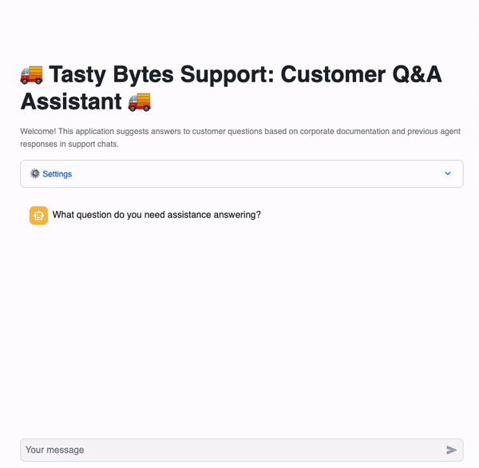
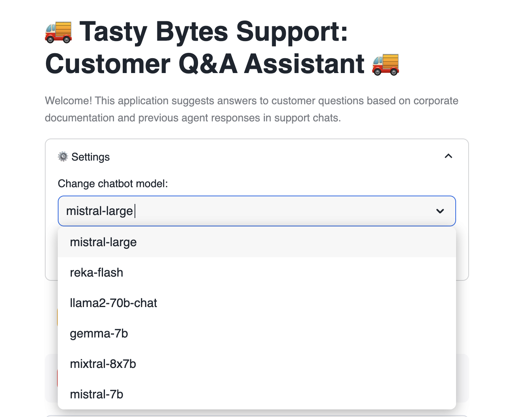
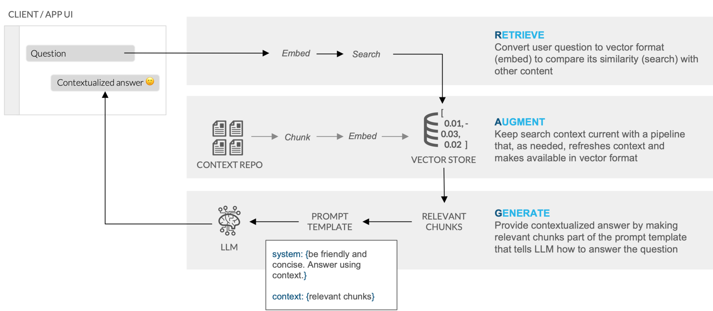

author: Charlie Hammond
id: tasty-bytes-rag-chatbot-using-cortex-and-streamlit
categories: snowflake-site:taxonomy/solution-center/certification/quickstart, snowflake-site:taxonomy/product/ai, snowflake-site:taxonomy/snowflake-feature/ingestion/conversational-assistants
language: en
summary: In this guide, we build a Cortex LLM powered chatbot to help Tasty Bytes support agents find answers to customer questions faster. 
environments: web
status: Published 
feedback link: https://github.com/Snowflake-Labs/sfguides/issues

# Tasty Bytes - RAG Chatbot Using Cortex and Streamlit
<!-- ------------------------ -->
## Overview 


Welcome to the Powered by Tasty Bytes - RAG Chatbot Using Cortex and Streamlit Quickstart.

In this guide, we will build a Cortex LLM powered chatbot to help Tasty Bytes agents find answers to customer questions faster. This Streamlit chatbot uses retrieval augemented generation (RAG) by retrieving previous agent support chat logs and public-facing documents (Annual Reports, FAQs). 




### What You’ll Learn
- How to build a chatbot using Cortex LLMs 
- How to build a Streamlit in Snowflake application 
- Basics of retrieval augemented generation (RAG) 

### What You’ll Need 
- Snowflake account 

### What You’ll Build 
- A Cortex LLM chatbot using Streamlit in Snowflake

<!-- ------------------------ -->
## Setup

### Create Snowflake Database, Schema, and Warehouse

Run the code below in a Snowsight worksheet. It creates basic objects in Snowflake.

```sql
-- Database
CREATE OR REPLACE DATABASE tasty_bytes_chatbot;

--Schema
CREATE OR REPLACE SCHEMA tasty_bytes_chatbot.app;

--Warehouse
CREATE OR REPLACE WAREHOUSE tasty_bytes_chatbot_wh with
WAREHOUSE_SIZE = LARGE
AUTO_SUSPEND = 60;
```

### Load App Data

Run the code below in a Snowsight worksheet. It creates all data required to run the app.

```sql
CREATE OR REPLACE FILE FORMAT tasty_bytes_chatbot.app.csv_ff 
TYPE = 'csv';

CREATE OR REPLACE STAGE tasty_bytes_chatbot.app.s3load
COMMENT = 'Quickstarts S3 Stage Connection'
url = 's3://sfquickstarts/tastybytes-cx/app/'
file_format = tasty_bytes_chatbot.app.csv_ff;

CREATE OR REPLACE TABLE tasty_bytes_chatbot.app.documents (
	RELATIVE_PATH VARCHAR(16777216),
	RAW_TEXT VARCHAR(16777216)
)
COMMENT = '{"origin":"sf_sit-is", "name":"voc", "version":{"major":1, "minor":0}, "attributes":{"is_quickstart":1, "source":"streamlit", "vignette":"rag_chatbot"}}';

COPY INTO tasty_bytes_chatbot.app.documents
FROM @tasty_bytes_chatbot.app.s3load/documents/;

-- https://docs.snowflake.com/en/sql-reference/data-types-vector#loading-and-unloading-vector-data
CREATE OR REPLACE TABLE tasty_bytes_chatbot.app.array_table (
  SOURCE VARCHAR(6),
	SOURCE_DESC VARCHAR(16777216),
	FULL_TEXT VARCHAR(16777216),
	SIZE NUMBER(18,0),
	CHUNK VARCHAR(16777216),
	INPUT_TEXT VARCHAR(16777216),
	CHUNK_EMBEDDING ARRAY
);

COPY INTO tasty_bytes_chatbot.app.array_table
FROM @tasty_bytes_chatbot.app.s3load/vector_store/;

CREATE OR REPLACE TABLE tasty_bytes_chatbot.app.vector_store (
	SOURCE VARCHAR(6),
	SOURCE_DESC VARCHAR(16777216),
	FULL_TEXT VARCHAR(16777216),
	SIZE NUMBER(18,0),
	CHUNK VARCHAR(16777216),
	INPUT_TEXT VARCHAR(16777216),
	CHUNK_EMBEDDING VECTOR(FLOAT, 768)
) AS
SELECT 
  source,
	source_desc,
	full_text,
	size,
	chunk,
	input_text,
  chunk_embedding::VECTOR(FLOAT, 768)
FROM tasty_bytes_chatbot.app.array_table;
```

### Streamlit File

- From Snowsight, select the Streamlit tab
- Create a new Streamlit-in-Snowflake application with:
  - Database: TASTY_BYTES_CHATBOT 
  - Schema: APP
  - Warehouse: TASTY_BYTES_CHATBOT_WH
- Add snowflake-ml-python package from the packages dropdown in the code editor section
- Copy the code below into the code editor section
- Run the app!

**Note:** Model availability varies by region. Please see [Snowflake Cortex cross region inference](https://docs.snowflake.com/en/user-guide/snowflake-cortex/cross-region-inference) for steps if you are in a region without a certain model. 

```python
# Import python packages
import pandas as pd
import streamlit as st
from snowflake.snowpark.context import get_active_session
from snowflake.cortex import Complete
import snowflake.snowpark.functions as F
import snowflake.snowpark.types as T

# Set Streamlit page configuration
st.set_page_config(layout="wide", initial_sidebar_state="expanded")
st.title(":truck: Tasty Bytes Support: Customer Q&A Assistant  :truck:")
st.caption(
    f"""Welcome! This application suggests answers to customer questions based 
    on corporate documentation and previous agent responses in support chats.
    """
)

# Get current credentials
session = get_active_session()

# Constants
CHAT_MEMORY = 20
DOC_TABLE = "app.vector_store"


# Reset chat conversation
def reset_conversation():
    st.session_state.messages = [
        {
            "role": "assistant",
            "content": "What question do you need assistance answering?",
        }
    ]


##########################################
#       Select LLM
##########################################
with st.expander(":gear: Settings"):
    model = st.selectbox(
        "Change chatbot model:",
        [
            "claude-4-sonnet",
            "openai-gpt-4.1",
            "llama4-maverick",
            "mistral-7b",
        ],
    )
    st.button("Reset Chat", on_click=reset_conversation)


##########################################
#       RAG
##########################################
def get_context(chat, DOC_TABLE):
    chat_summary = summarize(chat)
    return find_similar_doc(chat_summary, DOC_TABLE)


def summarize(chat):
    summary = Complete(
        model,
        "Provide the most recent question with essential context from this support chat: "
        + chat,
    )
    return summary.replace("'", "")


def find_similar_doc(text, DOC_TABLE):
    doc = session.sql(f"""Select input_text,
                        source_desc,
                        VECTOR_COSINE_SIMILARITY(chunk_embedding, SNOWFLAKE.CORTEX.EMBED_TEXT_768('e5-base-v2', '{text.replace("'", "''")}')) as dist
                        from {DOC_TABLE}
                        order by dist desc
                        limit 1
                        """).to_pandas()
    st.info("Selected Source: " + doc["SOURCE_DESC"].iloc[0])
    return doc["INPUT_TEXT"].iloc[0]

##########################################
#       Prompt Construction
##########################################
if "background_info" not in st.session_state:
    st.session_state.background_info = (
        session.table("app.documents")
        .select("raw_text")
        .filter(F.col("relative_path") == "tasty_bytes_who_we_are.pdf")
        .collect()[0][0]
    )


def get_prompt(chat, context):
    prompt = f"""Answer this new customer question sent to our support agent
        at Tasty Bytes Food Truck Company. Use the background information
        and provided context taken from the most relevant corporate documents
        or previous support chat logs with other customers.
        Be concise and only answer the latest question.
        The question is in the chat.
        Chat: <chat> {chat} </chat>.
        Context: <context> {context} </context>.
        Background Info: <background_info> {st.session_state.background_info} </background_info>."""
    return prompt.replace("'", "")


##########################################
#       Chat with LLM
##########################################
if "messages" not in st.session_state:
    reset_conversation()

if user_message := st.chat_input():
    st.session_state.messages.append({"role": "user", "content": user_message})

for message in st.session_state.messages:
    with st.chat_message(message["role"]):
        st.markdown(message["content"])

if st.session_state.messages[-1]["role"] != "assistant":
    chat = str(st.session_state.messages[-CHAT_MEMORY:]).replace("'", "")
    with st.chat_message("assistant"):
        with st.status("Answering..", expanded=True) as status:
            st.write("Finding relevant documents & support chat logs...")
            # Get relevant information
            context = get_context(chat, DOC_TABLE)
            st.write("Using search results to answer your question...")
            # Ask LLM
            prompt = get_prompt(chat, context)
            response = Complete(model, prompt)
            status.update(label="Complete!", state="complete", expanded=False)
        st.markdown(response)
    st.session_state.messages.append({"role": "assistant", "content": response})

```

<!-- ------------------------ -->
## Streamlit App

Within Streamlit in Snowflake, leverage the application to ask questions regarding Tasty Bytes. A few suggested questions and demo steps detailed below:

- Change the LLM mid-conversation. Ask the bot "Can you answer that again?" after changing.



- Highlight the document source (chat logs or document path) that was retrieved and used by the bot.
- Sample questions:
    - Who is the CEO?
    - What cities are trucks in?
    - Do you do private events and catering?
    - How do I become a franchise?
    - Do you have vegetarian options?
    - What are the truck names?
    - What food do the trucks serve?
    - How do I find a truck's location?


<!-- ------------------------ -->
## Understanding the Streamlit Chatbot Application

The following features are used in the RAG chatbot Streamlit Application.

### Cortex Complete

Cortex complete generates a response (completion) to a prompt using your choice of supported language model. In the application, we pass the prompt and selected model to Cortex complete to generate a response questions posed by the user. You can read more [documentation here](https://docs.snowflake.com/en/sql-reference/functions/complete-snowflake-cortex). 

Users can select between many available models to pass to Cortex complete.

```python
model = st.selectbox(
      "Change chatbot model:",
      [
          "mistral-large",
          "reka-flash",
          "llama2-70b-chat",
          "gemma-7b",
          "mixtral-8x7b",
          "mistral-7b",
      ],
  )
```

With just a single line of code, Cortex complete calls the relevant LLM to generate a response to a question. 

```python
response = Complete(model, prompt)
```

### Retrieval Augemented Generation (RAG)

The chatbot application uses retrieval augemented generation (RAG) to find the most relevant chats and other documents to answer the user's question. 



The code below finds the document most similar to the current chat from our vector_store table. The documents in the table include chat logs and other public-facing documents (Annual Reports, FAQs). 

[Vector Embeddings](https://docs.snowflake.com/en/user-guide/snowflake-cortex/vector-embeddings#create-vector-embeddings-from-text) have previously been created for documents (chat logs, annual reports, etc.) in the vector_store table. In our application, we use Cortex Embed to create a vector for the current chat. This allows us to determine the [Vector Cosine Similarity](https://docs.snowflake.com/en/sql-reference/functions/vector_cosine_similarity) between the chat and existing documents and return the most similar document. The text of the most relevant document is later used in our prompt to ensure responses have all relevant information. 

```python
# text: current chat
# DOC_TABLE: table containing document vector embeddings (app.vector_store)
def find_similar_doc(text, DOC_TABLE):
    doc = session.sql(f"""Select input_text,
                        source_desc,
                        VECTOR_COSINE_SIMILARITY(chunk_embedding, SNOWFLAKE.CORTEX.EMBED_TEXT_768('e5-base-v2', '{text.replace("'", "''")}')) as dist
                        from {DOC_TABLE}
                        order by dist desc
                        limit 1
                        """).to_pandas()
    st.info("Selected Source: " + doc["SOURCE_DESC"].iloc[0])
    return doc["INPUT_TEXT"].iloc[0]
```

### Prompt Engineering

The app builds prompts based on chat history, context, and Tasty Bytes background information. All of this information is passed to Cortex complete to ensure we accurately respond to user questions. 

- **chat** is the current chat history
- **context** is the text of the most relevant document returned from RAG
- **background info** is the text of the text of the `tasty_bytes_who_we_are.pdf` document. This contains high level information about Tasty Bytes. 

```python
def get_prompt(chat, context):
    prompt = f"""Answer this new customer question sent to our support agent
        at Tasty Bytes Food Truck Company. Use the background information
        and provided context taken from the most relevant corporate documents
        or previous support chat logs with other customers.
        Be concise and only answer the latest question.
        The question is in the chat.
        Chat: <chat> {chat} </chat>.
        Context: <context> {context} </context>.
        Background Info: <background_info> {st.session_state.background_info} </background_info>."""
    return prompt.replace("'", "")
```

<!-- ------------------------ -->
## Conclusion And Resources

Congratulations, you've created a RAG chatbot using Cortex and Streamlit! In this tutorial, we talked through all of the pieces required to build the Streamlit in Snowflake application, including Cortex LLMs and RAG fundamentals. 

If you want to learn more about RAG and Cortex from Snowflake, check out this incredible blog post - [Easy and Secure LLM Inference and Retrieval Augmented Generation (RAG) Using Snowflake Cortex](/blog/easy-secure-llm-inference-retrieval-augmented-generation-rag-cortex/).

### What You Learned
- How to build a chatbot using Cortex LLMs 
- How to build a Streamlit in Snowflake application 
- Basics of retrieval augmented generation (RAG) 

### Related Resources
- [Easy and Secure LLM Inference and Retrieval Augmented Generation (RAG) Using Snowflake Cortex](/blog/easy-secure-llm-inference-retrieval-augmented-generation-rag-cortex/)
- [Streamlit in Snowflake Documentation](https://docs.snowflake.com/en/developer-guide/streamlit/about-streamlit)
- [Cortex LLM Functions](https://docs.snowflake.com/en/user-guide/snowflake-cortex/llm-functions)
