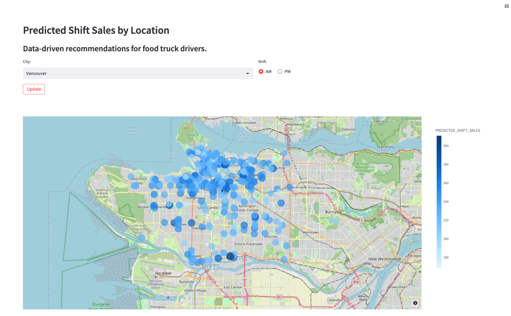

author: Marie Coolsaet
id: tasty-bytes-snowpark-101-for-data-science-ptbr
categories: snowflake-site:taxonomy/solution-center/certification/quickstart, snowflake-site:taxonomy/product/data-engineering, snowflake-site:taxonomy/snowflake-feature/snowpark
language: pt_br
summary: Tasty Bytes: introdução ao Snowpark para ciência de dados
environments: web
status: Published 
feedback link: https://github.com/Snowflake-Labs/sfguides/issues


# Tasty Bytes: introdução ao Snowpark para ciência de dados
<!-- ------------------------ -->
## Visão geral 

Neste quickstart guide “Introdução ao Snowpark para ciência de dados”, você vai ajudar a empresa fictícia de food trucks Tasty Bytes a aumentar as vendas treinando um modelo para oferecer recomendações de locais aos motoristas. Você vai usar o **Snowpark para Python** para preparar dados e treinar e implementar um modelo. Após a implementação, você vai criar um protótipo de aplicação usando o **Streamlit** para demonstrar como os motoristas podem usar o modelo para encontrar o melhor local para estacionar pensando no próximo turno.

### O que é o Snowpark?
O Snowpark permite que desenvolvedores consultem e criem aplicações de dados em Python, Java e Scala por meio de interfaces de programação de aplicativos (application programming interface, APIs) e conceitos de programação estilo DataFrame executados no mecanismo flexível do Snowflake. Saiba mais sobre o [Snowpark](https://docs.snowflake.com/pt/developer-guide/snowpark/index).

### O que é o Streamlit?
O Streamlit *(adquirido pela Snowflake em março de 2022)* é uma biblioteca Python que facilita a criação e o compartilhamento de aplicações web personalizadas. Saiba mais sobre o [Streamlit](https://docs.streamlit.io/).

### Você vai aprender 
- Acessar dados de terceiros no **Snowflake Data Marketplace**.
- Explorar dados e executar **engenharia de recursos com as APIs Snowpark DataFrame**.
- **Treinar um modelo no Snowflake** com um procedimento armazenado.
- **Implementar um modelo no Snowflake** em uma função definida pelo usuário para inferência de modelo.
- **Criar uma aplicação Streamlit** para interagir com o modelo.

### Pré-requisitos
- Ter o [Git](https://git-scm.com/book/en/v2/Getting-Started-Installing-Git) instalado.
- Ter o [Anaconda](https://www.anaconda.com/) instalado.
- Uma conta Snowflake com [pacotes Anaconda habilitados pelo ORGADMIN](https://docs.snowflake.com/pt/developer-guide/udf/python/udf-python-packages#using-third-party-packages-from-anaconda). Caso você não possua uma conta Snowflake, inscreva-se em uma [conta de avaliação gratuita](https://signup.snowflake.com/?utm_source=snowflake-devrel&utm_medium=developer-guides&lang=pt-br&utm_cta=developer-guides).
- Um login da conta Snowflake com a função ACCOUNTADMIN. Caso você não tenha uma, será necessário se inscrever com uma conta de avaliação gratuita ou usar uma função diferente que possa criar bancos de dados, esquemas, tabelas, estágios, funções definidas por usuários e procedimentos armazenados. 

### O que será desenvolvido 
- **Uma previsão de vendas por local**<br>


- **Uma aplicação Streamlit para encontrar os melhores locais com base nas vendas previstas**<br>


<!-- ------------------------ -->
## Configuração dos dados no Snowflake

### Visão geral
Você vai usar o [Snowsight](https://docs.snowflake.com/pt/user-guide/ui-snowsight), a interface da web do Snowflake, para:
- Acessar dados de localização da SafeGraph pelo Snowflake Marketplace.
- Criar objetos Snowflake (armazenamento, banco de dados, esquemas).
- Ingerir dados de vendas por turno do S3\. 
- Combinar vendas por turno com dados de localização da SafeGraph.

A Tasty Bytes opera food trucks em várias cidades pelo mundo, e cada veículo pode escolher dois locais de venda por dia. Os locais estão mapeados como pontos de interesse da SafeGraph. O objetivo é unir dados de latitude e longitude disponíveis no SafeGraph Marketplace aos dados de vendas por turno e usá-los como recursos no treinamento de modelos.

### Etapa 1 - Adquirir os dados de pontos de interesse da SafeGraph pelo Snowflake Marketplace 
- Acesse sua conta Snowflake.
- Siga as etapas e o vídeo abaixo para acessar a oferta do SafeGraph Marketplace em sua conta Snowflake.

  - Clique -> Ícone Home
  - Clique -> Marketplace
  - Pesquise -> frostbyte
  - Clique -> SafeGraph: frostbyte
  - Clique -> Get
  - Renomeie o banco de dados -> FROSTBYTE_SAFEGRAPH (tudo em maiúsculas)
  - Permissão para funções adicionais -> PUBLIC


> 
>
### Etapa 2 - Criar objetos, carregar dados e unir os dados
- Navegue até Worksheets, clique em “+” no canto superior direito para criar uma nova planilha e selecione “SQL Worksheet”.
- Cole e execute o código SQL a seguir na planilha para criar objetos Snowflake (armazenamento, banco de dados, esquemas), ingerir dados de vendas por turnos do S3 e combinar as vendas por turno com dados de localização da SafeGraph.

```sql 
USE ROLE accountadmin;

-- create a development database for data science work 
CREATE OR REPLACE DATABASE frostbyte_tasty_bytes_dev;

-- create raw, harmonized, and analytics schemas 
-- raw zone for data ingestion 
CREATE OR REPLACE SCHEMA frostbyte_tasty_bytes_dev.raw; 
-- harmonized zone for data processing 
CREATE OR REPLACE SCHEMA frostbyte_tasty_bytes_dev.harmonized; 
-- analytics zone for development 
CREATE OR REPLACE SCHEMA frostbyte_tasty_bytes_dev.analytics;

-- create csv file format 
CREATE OR REPLACE FILE FORMAT frostbyte_tasty_bytes_dev.raw.csv_ff type = 'csv';

-- create an external stage pointing to S3 
CREATE OR REPLACE STAGE frostbyte_tasty_bytes_dev.raw.s3load 
COMMENT = 'Quickstarts S3 Stage Connection' 
url = 's3://sfquickstarts/frostbyte_tastybytes/' 
file_format = frostbyte_tasty_bytes_dev.raw.csv_ff;

-- define shift sales table 
CREATE OR REPLACE TABLE frostbyte_tasty_bytes_dev.raw.shift_sales( 
  location_id NUMBER(19,0), 
  city VARCHAR(16777216),
  date DATE, 
  shift_sales FLOAT, 
  shift VARCHAR(2), 
  month NUMBER(2,0), 
  day_of_week NUMBER(2,0), 
  city_population NUMBER(38,0) 
);

-- create and use a compute warehouse 
CREATE OR REPLACE WAREHOUSE tasty_dsci_wh AUTO_SUSPEND = 60; 
USE WAREHOUSE tasty_dsci_wh;

-- ingest from S3 into the shift sales table 
COPY INTO frostbyte_tasty_bytes_dev.raw.shift_sales 
FROM @frostbyte_tasty_bytes_dev.raw.s3load/analytics/shift_sales/;

-- join in SafeGraph data 
CREATE OR REPLACE TABLE frostbyte_tasty_bytes_dev.harmonized.shift_sales 
  AS 
SELECT 
    a.location_id, 
    a.city, 
    a.date, 
    a.shift_sales, 
    a.shift, 
    a.month, 
    a.day_of_week, 
    a.city_population, 
    b.latitude, 
    b.longitude 
FROM frostbyte_tasty_bytes_dev.raw.shift_sales a 
JOIN frostbyte_safegraph.public.frostbyte_tb_safegraph_s b 
ON a.location_id = b.location_id;

-- promote the harmonized table to the analytics layer for data science development 
CREATE OR REPLACE VIEW frostbyte_tasty_bytes_dev.analytics.shift_sales_v 
  AS 
SELECT * FROM frostbyte_tasty_bytes_dev.harmonized.shift_sales;

-- view shift sales data 
SELECT * FROM frostbyte_tasty_bytes_dev.analytics.shift_sales_v; 
```

<!-- ------------------------ -->
## Ciência de dados com Snowpark

### Visão geral
A Tasty Bytes busca um crescimento de 25% das vendas anuais nos próximos cinco anos. Para apoiar esse objetivo e maximizar a receita diária da frota de caminhões, a equipe de ciência de dados precisa construir um modelo de aprendizado de máquina (machine learning, ML) para direcionar os caminhões aos locais onde maiores vendas são esperadas em determinados turnos.

- O notebook [tasty_bytes_snowpark_101.ipynb](https://github.com/Snowflake-Labs/sfguide-tasty-bytes-snowpark-101-for-data-science/blob/main/tasty_bytes_snowpark_101.ipynb) aborda funções e recursos essenciais de um fluxo de trabalho básico de ciência de dados usando Snowpark para Python.
- Siga as etapas abaixo como um cientista de dados da Tasty Bytes que recebeu a tarefa de desenvolver e implementar um modelo no Snowflake para recomendar os melhores locais para os food trucks.
  - **Fundamentos do Snowpark**
    - Conectar ao Snowflake
    - Explorar a API e o DataFrames
  - **Exploração de dados e engenharia de recursos**
    - Funções de agregação
    - Imputação, codificação e divisão treino/teste
  - **Treinamento e implementação de modelos**
    - Treinar em um procedimento armazenado
    - Escalabilidade flexível
    - Implementar uma função definida pelo usuário para inferência de modelo

### Etapa 1 - Criar um clone do repositório do GitHub

[Clone](https://docs.github.com/en/repositories/creating-and-managing-repositories/cloning-a-repository) o [repositório do GitHub](https://github.com/Snowflake-Labs/sfguide-tasty-bytes-snowpark-101-for-data-science). Esse repositório contém todo o código necessário para completar este quickstart guide com sucesso.

```
$ git clone https://github.com/Snowflake-Labs/sfguide-tasty-bytes-snowpark-101-for-data-science.git
```
### Etapa 2 - Atualizar o arquivo de autorização
- Atualize o arquivo [**data_scientist_auth.json**](https://github.com/Snowflake-Labs/sfguide-tasty-bytes-snowpark-101-for-data-science/blob/main/data_scientist_auth.json) com suas credenciais do Snowflake. O notebook Python vai usar esse arquivo para acessar suas credenciais e conectar-se ao Snowflake.<br>

> 
> Para o parâmetro `account`, use seu [identificador de conta](https://docs.snowflake.com/pt/user-guide/admin-account-identifier). Observe que o identificador de conta não inclui o sufixo snowflakecomputing.com.

### Etapa 3 - Criar um ambiente Python
> 

> 

 **No terminal, execute o seguinte código para criar o ambiente Python e iniciar o notebook Jupyter:**<br>
i. Crie um ambiente Python 3.8 chamado "py38_env_tb1" (tb1 = Tasty Bytes 1) usando pacotes (e versões) do canal Snowflake Anaconda. 
```
conda create --name py38_env_tb1 --override-channels -c https://repo.anaconda.com/pkgs/snowflake python=3.8
 ``` 
ii. Ative o ambiente py38_env_tb1. 
```  
conda activate py38_env_tb1
 ``` 
iii. Instale o pacote Snowpark Python e demais pacotes que serão usados nas funções implementadas no Snowflake a partir do canal Anaconda do Snowflake. 
```
conda install -c https://repo.anaconda.com/pkgs/snowflake snowflake-snowpark-python numpy pandas scikit-learn joblib cachetools
``` 
v. Instale os pacotes que serão usados apenas no ambiente Python (interface de usuário (UI), visualização...). 
```
pip install streamlit matplotlib plotly notebook
``` 
vi. Navegue para o repositório do GitHub clonado e inicie o notebook Jupyter. 
```
jupyter notebook
```

### Etapa 4 - Executar o notebook Jupyter
- Abra e execute as células de [tasty_bytes_snowpark_101.ipynb](https://github.com/Snowflake-Labs/sfguide-tasty-bytes-snowpark-101-for-data-science/blob/main/tasty_bytes_snowpark_101.ipynb) no notebook Jupyter. 

### Solução de problemas
- Problemas relacionados ao PyArrow: desinstale `pyarrow` antes de instalar o Snowpark.
- Alterne a versão do ambiente Python do arquivo [environment.yml](https://github.com/Snowflake-Labs/sfguide-tasty-bytes-snowpark-101-for-data-science/blob/main/environment.yml):<br>

    i. No terminal, acesse o repositório do GitHub clonado e crie o ambiente. 
    ```
    conda env create -f environment.yml
    ```
    ii . Ative o ambiente. 
    ```
    conda activate py38_env_tb1
    ```
    iii. Inicie o Notebook Jupyter. 
    ```
    jupyter notebook
    ```

<!-- ------------------------ -->
## Criação do protótipo de aplicação com o Streamlit

### Visão geral
Após implementar um modelo que prevê as vendas por turno de cada local para o turno seguinte, você gostaria de encontrar um jeito para que os motoristas usem essas previsões para escolherem onde estacionar. É preciso criar um protótipo de aplicação para mostrar à equipe de engenharia como um motorista poderia interagir com o modelo de previsão de vendas por turno. A aplicação vai permitir que um usuário escolha uma cidade e um horário (manhã ou tarde) e mostrar a previsão de vendas por local em um mapa.

### Etapa 1 - Confirmar os pré-requisitos
- A aplicação Streamlit usa o ambiente Python, o arquivo de autenticação e a função definida pelo usuário da Etapa 3. Confirme o cumprimento dos seguintes requisitos:
  - Criação do ambiente Python 3.8 py_38_env_tb1.
  - Preenchimento do arquivo data_scientist_auth.json.
  - Execução do notebook [tasty_bytes_snowpark_101.ipynb](https://github.com/Snowflake-Labs/sfguide-tasty-bytes-snowpark-101-for-data-science/blob/main/tasty_bytes_snowpark_101.ipynb).

### Etapa 2 - Opcional: revisar o código
- Abra [streamlit_app.py](https://github.com/Snowflake-Labs/sfguide-tasty-bytes-snowpark-101-for-data-science/blob/main/streamlit_app.py).
- Identifique onde ocorre a conexão com o Snowflake.
- Identifique onde a função definida pelo usuário para inferência de modelo é chamada para apresentar as previsões de vendas por turno imediatamente.

### Etapa 3 - Inicializar a aplicação
- No terminal, navegue até o repositório do GitHub clonado e ative o ambiente Python py38_env_tb1. 
  ```  
  conda activate py38_env_tb1
  ```
- Inicie a aplicação. 
  ```  
  streamlit run streamlit_app.py
  ```
- Use o menu suspenso para escolher uma cidade e visualizar as recomendações atualizadas. 


<!-- ------------------------ -->
## Limpeza

### Visão geral dos objetos criados neste quickstart
**Snowflake:** 
- **Armazenamento:** tasty_dsci_wh 
- **Banco de dados:** frostbyte_tasty_bytes_dev 
- **Esquema:** bruto 
- **Tabela:** frostbyte_tasty_bytes_dev.raw.shift_sales 
- **Estágio:** frostbyte_tasty_bytes_dev.raw.s3load 
- **Formato de arquivo:** frostbyte_tasty_bytes_dev.raw.csv_ff 
- **Esquema:** harmonizado 
- **Tabela:** frostbyte_tasty_bytes_dev.harmonized.shift_sales 
- **Esquema:** análise de dados 
- **Tabelas:** 
- frostbyte_tasty_bytes_dev.analytics.shift_sales_train 
- frostbyte_tasty_bytes_dev.analytics.shift_sales_test 
- **Exibição:** frostbyte_tasty_bytes_dev.analytics.shift_sales_v 
- **Estágio:** frostbyte_tasty_bytes_dev.analytics.model_stage 
- **Procedimento:** sproc_train_linreg 
- **Comando:** udf_linreg_predict_location_sales 
- **Banco de dados compartilhado:** frostbyte_safegraph 
- **Tabela:** frostbyte_safegraph.public.frostbyte_tb_safegraph_s

**Anaconda:** 
- Ambiente Python py38_env_tb1

**GitHub:** 
- Repositório clonado: [sfguide-tasty-bytes-snowpark-101-for-data-science](https://github.com/Snowflake-Labs/sfguide-tasty-bytes-snowpark-101-for-data-science/)

### Etapa 1 - Remover os objetos Snowflake
- Navegue até Worksheets, clique em “+” no canto superior direito para criar uma nova planilha e selecione “SQL Worksheet”.
- Cole e execute o código SQL a seguir para remover os objetos Snowflake criados no quickstart.

```sql
USE ROLE accountadmin;
DROP PROCEDURE IF EXISTS frostbyte_tasty_bytes.analytics.sproc_train_linreg(varchar, array, varchar, varchar);
DROP FUNCTION IF EXISTS frostbyte_tasty_bytes.analytics.udf_linreg_predict_location_sales(float, float, float, float, float, float, float, float);
DROP DATABASE IF EXISTS frostbyte_tasty_bytes_dev;
DROP DATABASE IF EXISTS frostbyte_safegraph;
DROP WAREHOUSE IF EXISTS tasty_dsci_wh;
```

### Etapa 2 - Remover o ambiente Python
- No terminal, execute: 
```
conda remove --name py38_env_tb1 --all
```

### Etapa 3 - Remover o repositório do GitHub clonado
- No terminal do diretório onde o repositório do GitHub foi clonado, execute: 
```
rm -rf sfguide-tasty-bytes-snowpark-101-for-data-science
```

<!-- ------------------------ -->
## Conclusão e próximas etapas

### Conclusão
**Você conseguiu!** Você acaba de completar com sucesso o quickstart “Tasty Bytes: introdução ao Snowpark para ciência de dados”.

Neste módulo, você: 
- Adquiriu dados de pontos de interesse da SafeGraph pelo Snowflake Marketplace. 
- Explorou dados e executou engenharia de recursos com o Snowpark.
- Treinou um modelo no Snowflake com um procedimento armazenado. 
- Implementou um modelo a uma função definida pelo usuário. 
- Criou uma aplicação Streamlit para oferecer previsões de vendas por turno e local imediatamente.

### Próximas etapas
Para continuar sua jornada no Snowflake Data Cloud, clique no link abaixo para ver os outros quickstarts Tasty Bytes disponíveis para você.

- ### [Powered by Tasty Bytes - Índice de quickstarts](/pt_br/developers/guides/tasty-bytes-introduction-ptbr/)
