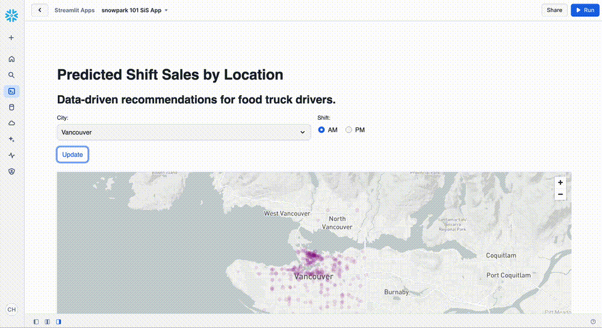
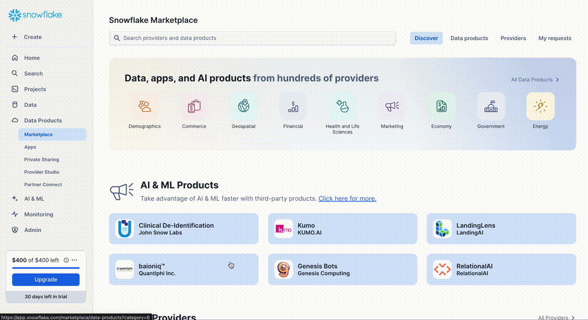
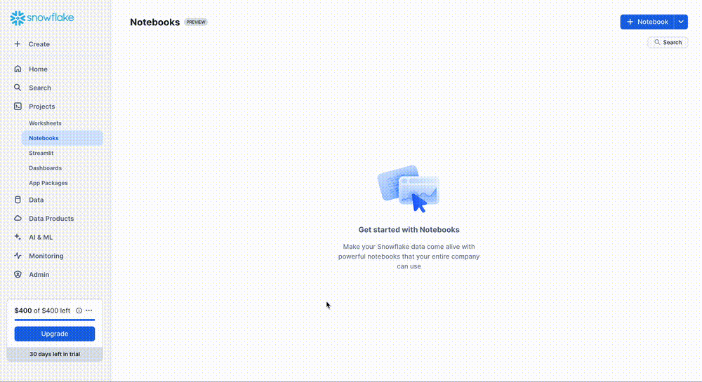
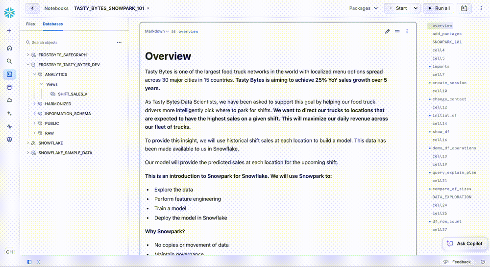
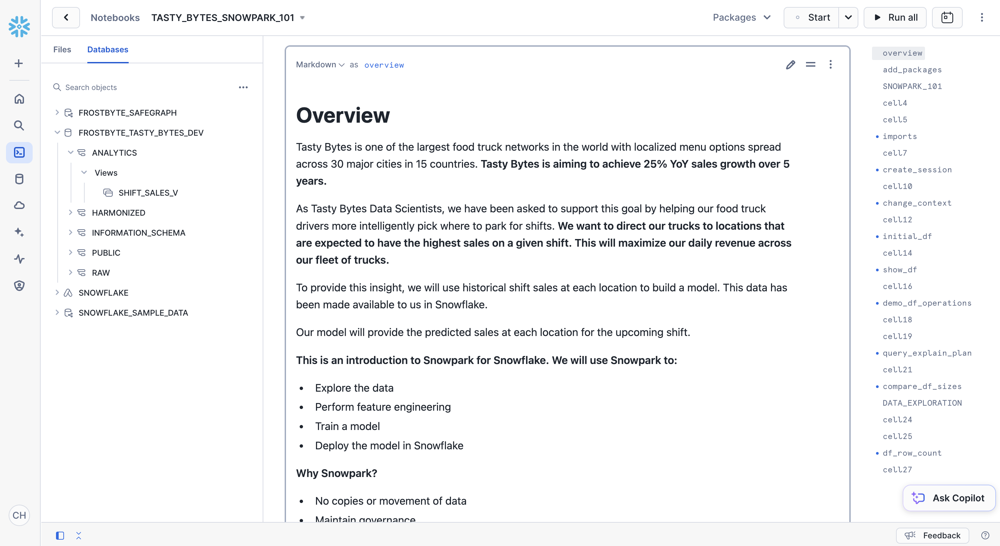
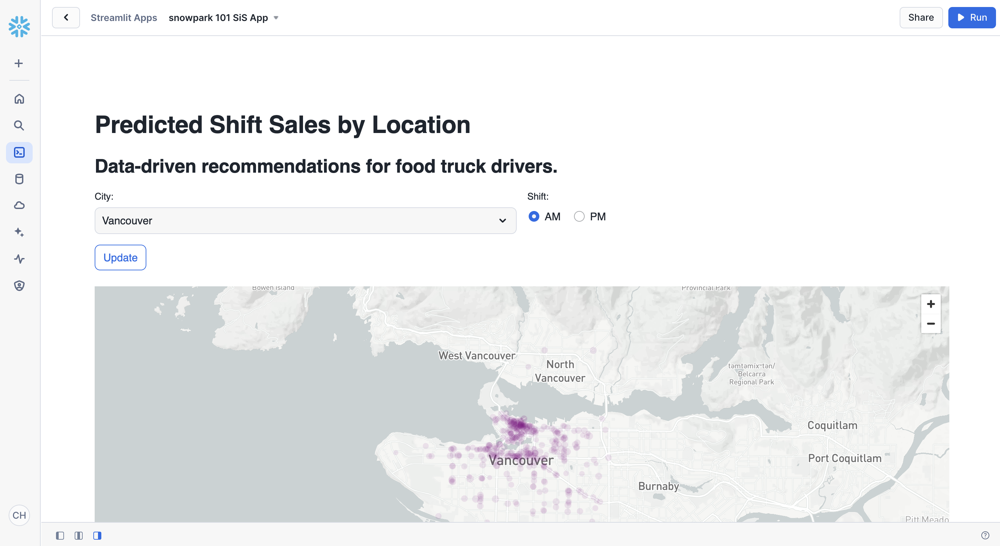

author: Marie Coolsaet
id: tasty-bytes-snowpark-101-for-data-science
categories: snowflake-site:taxonomy/solution-center/certification/quickstart, snowflake-site:taxonomy/product/data-engineering, snowflake-site:taxonomy/snowflake-feature/snowpark
language: en
summary: Tasty Bytes - Snowpark 101 for Data Science Quickstart 
environments: web
status: Published 
feedback link: https://github.com/Snowflake-Labs/sfguides/issues


# Tasty Bytes - Snowpark 101 for Data Science
<!-- ------------------------ -->
## Overview 


In this Snowpark 101 for Data Science Quickstart guide, you will be help the fictitious food truck company, Tasty Bytes, to increase sales by training a model to provide location recommendations to truck drivers. You will use **Snowpark for Python** to prepare data, train a model, and deploy the model. Once deployed, you will create an application prototype using **Streamlit** to demonstrate how truck drivers could use the model to find the best location to park for an upcoming shift.

### What is Snowpark?
Snowpark is a set of libraries and code execution environments that run Python and other programming languages next to your data in Snowflake. Learn more about [Snowpark](https://docs.snowflake.com/en/developer-guide/snowpark/index).

### What is Streamlit?
Streamlit is a Python library that makes it easy to create and share custom web apps. Learn more about [Streamlit](https://docs.snowflake.com/en/developer-guide/streamlit/about-streamlit).

### What You Will Learn 
- How to access third-party data from the **Snowflake Marketplace**
- How to explore data & perform **feature engineering with Snowpark DataFrame APIs**
- How to **train a model in Snowflake** using a Snowpark ML pipeline
- How to **deploy a model in Snowflake** using Snowflake Model Registry
- How to **build a Streamlit app** to interact with the model

### Prerequisites
- A Snowflake account login with ACCOUNTADMIN role. If not, you will need to register for a [free trial account](https://signup.snowflake.com/?utm_source=snowflake-devrel&utm_medium=developer-guides&utm_cta=developer-guides) or use a different role that has the ability to create database, schema, tables, stages, user-defined functions, and stored procedures. 

### What You Will Build 
- **A sales forecast by location**<br>


- **A Streamlit application for finding the top locations by predicted sales**<br>



<!-- ------------------------ -->
## Setting up the Data in Snowflake

### Overview
You will use [Snowsight](https://docs.snowflake.com/en/user-guide/ui-snowsight.html#), the Snowflake web interface, to:
- Access SafeGraph location data from the Snowflake Marketplace
- Create Snowflake objects (warehouse, database, schema)
- Ingest shift sales data from S3
- Join shift sales with the SafeGraph location data

Tasty Bytes operates food trucks in cities across the globe with each truck having the ability to choose two different selling locations per day. The locations are mapped to SafeGraph points-of-interest. You want to join latitude and longitude from the SafeGraph Marketplace data to your shift sales data to use as features in model training.

### Step 1 - Acquiring SafeGraph POI Data from the Snowflake Marketplace 
- Log into your Snowflake account.
- Follow the steps and video below to access the SafeGraph Marketplace listing in your Snowflake account.

  - Click -> Home Icon
  - Click -> Data Products
  - Search -> frostbyte
  - Click -> SafeGraph: frostbyte
  - Click -> Get
  - Rename Database -> FROSTBYTE_SAFEGRAPH (all capital letters)
  - Grant to Additional Roles -> PUBLIC



> 
>SafeGraph is a global geospatial data company that offers any data on any place in the world. Customers like Esri, Tripadvisor, Mapbox, and Sysco use SafeGraph data to better understand their customers, create new products, and make better decisions for their business.
>
### Step 2 - Creating Objects, Loading Data, and Joining Data
- Navigate to Worksheets, click "+" in the top-right corner to create a new Worksheet, and choose "SQL Worksheet".
- Paste and run the following SQL in the worksheet to create Snowflake objects (warehouse, database, schema), ingest shift sales data from S3, and join shift sales with the SafeGraph location data.

```sql
USE ROLE accountadmin;

-- create a development database for data science work
CREATE OR REPLACE DATABASE frostbyte_tasty_bytes_dev;

-- create raw, harmonized, and analytics schemas
-- raw zone for data ingestion
CREATE OR REPLACE SCHEMA frostbyte_tasty_bytes_dev.raw;
-- harmonized zone for data processing
CREATE OR REPLACE SCHEMA frostbyte_tasty_bytes_dev.harmonized;
-- analytics zone for development
CREATE OR REPLACE SCHEMA frostbyte_tasty_bytes_dev.analytics;

-- create csv file format
CREATE OR REPLACE FILE FORMAT frostbyte_tasty_bytes_dev.raw.csv_ff 
type = 'csv';

-- create an external stage pointing to S3
CREATE OR REPLACE STAGE frostbyte_tasty_bytes_dev.raw.s3load
COMMENT = 'Quickstarts S3 Stage Connection'
url = 's3://sfquickstarts/frostbyte_tastybytes/'
file_format = frostbyte_tasty_bytes_dev.raw.csv_ff;


-- create and use a compute warehouse
CREATE OR REPLACE WAREHOUSE tasty_dsci_wh AUTO_SUSPEND = 60;
USE WAREHOUSE tasty_dsci_wh;
show warehouses;
---------------------------------------------------------------
---------------------------------------------------------------
---- CREATING RBAC FOR SNOWPARK 101 DEMO  ---------------------
---------------------------------------------------------------
---------------------------------------------------------------

USE ROLE securityadmin;

CREATE ROLE IF NOT EXISTS tasty_bytes_admin;
CREATE ROLE IF NOT EXISTS tasty_bytes_ds_role;

/* role hierarchy */
USE ROLE ACCOUNTADMIN;
GRANT ROLE tasty_bytes_admin TO ROLE SYSADMIN;
GRANT ROLE tasty_bytes_ds_role TO ROLE tasty_bytes_admin;

/* grant privileges */
USE ROLE ACCOUNTADMIN;

-- databases
GRANT USAGE ON DATABASE frostbyte_tasty_bytes_dev TO ROLE tasty_bytes_ds_role;

--schemas 
GRANT USAGE ON SCHEMA frostbyte_tasty_bytes_dev.raw TO ROLE tasty_bytes_ds_role;
GRANT USAGE ON SCHEMA frostbyte_tasty_bytes_dev.harmonized TO ROLE tasty_bytes_ds_role;
GRANT USAGE ON SCHEMA frostbyte_tasty_bytes_dev.analytics TO ROLE tasty_bytes_ds_role;

GRANT USAGE ON ALL SCHEMAS IN DATABASE frostbyte_tasty_bytes_dev TO ROLE tasty_bytes_ds_role;

GRANT ALL ON SCHEMA frostbyte_tasty_bytes_dev.raw TO ROLE tasty_bytes_admin;
GRANT ALL ON SCHEMA frostbyte_tasty_bytes_dev.harmonized TO ROLE tasty_bytes_admin;
GRANT ALL ON SCHEMA frostbyte_tasty_bytes_dev.analytics TO ROLE tasty_bytes_admin;
GRANT ALL ON SCHEMA frostbyte_tasty_bytes_dev.raw TO ROLE tasty_bytes_ds_role;
GRANT ALL ON SCHEMA frostbyte_tasty_bytes_dev.harmonized TO ROLE tasty_bytes_ds_role;
GRANT ALL ON SCHEMA frostbyte_tasty_bytes_dev.analytics TO ROLE tasty_bytes_ds_role;

--tables
GRANT ALL ON ALL TABLES IN SCHEMA frostbyte_tasty_bytes_dev.raw TO ROLE tasty_bytes_admin;
GRANT ALL ON ALL TABLES IN SCHEMA frostbyte_tasty_bytes_dev.harmonized TO ROLE tasty_bytes_admin;
GRANT ALL ON ALL TABLES IN SCHEMA frostbyte_tasty_bytes_dev.analytics TO ROLE tasty_bytes_admin;
GRANT ALL ON ALL TABLES IN SCHEMA frostbyte_tasty_bytes_dev.raw TO ROLE tasty_bytes_ds_role;
GRANT ALL ON ALL TABLES IN SCHEMA frostbyte_tasty_bytes_dev.harmonized TO ROLE tasty_bytes_ds_role;
GRANT ALL ON ALL TABLES IN SCHEMA frostbyte_tasty_bytes_dev.analytics TO ROLE tasty_bytes_ds_role;

GRANT CREATE TABLE ON SCHEMA frostbyte_tasty_bytes_dev.raw TO ROLE tasty_bytes_ds_role;
GRANT CREATE TABLE ON SCHEMA frostbyte_tasty_bytes_dev.harmonized TO ROLE tasty_bytes_ds_role;
GRANT CREATE TABLE ON SCHEMA frostbyte_tasty_bytes_dev.analytics TO ROLE tasty_bytes_ds_role;

GRANT CREATE STAGE ON SCHEMA frostbyte_tasty_bytes_dev.raw TO ROLE tasty_bytes_ds_role;
GRANT CREATE STAGE ON SCHEMA frostbyte_tasty_bytes_dev.harmonized TO ROLE tasty_bytes_ds_role;
GRANT CREATE STAGE ON SCHEMA frostbyte_tasty_bytes_dev.analytics TO ROLE tasty_bytes_ds_role;

-- views
GRANT ALL ON ALL VIEWS IN SCHEMA frostbyte_tasty_bytes_dev.raw TO ROLE tasty_bytes_admin;
GRANT ALL ON ALL VIEWS IN SCHEMA frostbyte_tasty_bytes_dev.harmonized TO ROLE tasty_bytes_admin;
GRANT ALL ON ALL VIEWS IN SCHEMA frostbyte_tasty_bytes_dev.analytics TO ROLE tasty_bytes_admin;
GRANT ALL ON ALL VIEWS IN SCHEMA frostbyte_tasty_bytes_dev.raw TO ROLE tasty_bytes_ds_role;
GRANT ALL ON ALL VIEWS IN SCHEMA frostbyte_tasty_bytes_dev.harmonized TO ROLE tasty_bytes_ds_role;
GRANT ALL ON ALL VIEWS IN SCHEMA frostbyte_tasty_bytes_dev.analytics TO ROLE tasty_bytes_ds_role;

-- warehouse grants
GRANT ALL ON WAREHOUSE tasty_dsci_wh TO ROLE tasty_bytes_admin;
GRANT ALL ON WAREHOUSE tasty_dsci_wh TO ROLE tasty_bytes_ds_role;

-- future grants
GRANT ALL ON FUTURE TABLES IN SCHEMA frostbyte_tasty_bytes_dev.analytics TO ROLE tasty_bytes_admin;
GRANT ALL ON FUTURE TABLES IN SCHEMA frostbyte_tasty_bytes_dev.analytics TO ROLE tasty_bytes_ds_role;

GRANT ALL ON FUTURE VIEWS IN SCHEMA frostbyte_tasty_bytes_dev.analytics TO ROLE tasty_bytes_admin;
GRANT ALL ON FUTURE VIEWS IN SCHEMA frostbyte_tasty_bytes_dev.analytics TO ROLE tasty_bytes_ds_role;

GRANT USAGE ON FUTURE PROCEDURES IN SCHEMA frostbyte_tasty_bytes_dev.analytics TO ROLE tasty_bytes_admin;
GRANT USAGE ON FUTURE PROCEDURES IN SCHEMA frostbyte_tasty_bytes_dev.analytics TO ROLE tasty_bytes_ds_role;

GRANT USAGE ON FUTURE FUNCTIONS IN SCHEMA frostbyte_tasty_bytes_dev.analytics TO ROLE tasty_bytes_admin;
GRANT USAGE ON FUTURE FUNCTIONS IN SCHEMA frostbyte_tasty_bytes_dev.analytics TO ROLE tasty_bytes_ds_role;

---------------------------------------------------------------
---------------------------------------------------------------
-------- CREATE TABLES/VIEWS FOR SNOWPARK 101  ----------------
---------------------------------------------------------------
---------------------------------------------------------------

-- define shift sales table
CREATE OR REPLACE TABLE frostbyte_tasty_bytes_dev.raw.shift_sales(
	location_id NUMBER(19,0),
	city VARCHAR(16777216),
	date DATE,
	shift_sales FLOAT,
	shift VARCHAR(2),
	month NUMBER(2,0),
	day_of_week NUMBER(2,0),
	city_population NUMBER(38,0)
);

-- ingest from S3 into the shift sales table
COPY INTO frostbyte_tasty_bytes_dev.raw.shift_sales
FROM @frostbyte_tasty_bytes_dev.raw.s3load/analytics/shift_sales/;

-- join in SafeGraph data
CREATE OR REPLACE TABLE frostbyte_tasty_bytes_dev.harmonized.shift_sales
  AS
SELECT
    a.location_id,
    a.city,
    a.date,
    a.shift_sales,
    a.shift,
    a.month,
    a.day_of_week,
    a.city_population,
    b.latitude,
    b.longitude,
    b.location_name
FROM frostbyte_tasty_bytes_dev.raw.shift_sales a
JOIN frostbyte_safegraph.public.frostbyte_tb_safegraph_s b
ON a.location_id = b.location_id;

-- promote the harmonized table to the analytics layer for data science development
CREATE OR REPLACE VIEW frostbyte_tasty_bytes_dev.analytics.shift_sales_v
  AS
SELECT * FROM frostbyte_tasty_bytes_dev.harmonized.shift_sales;

-- view shift sales data
SELECT * FROM frostbyte_tasty_bytes_dev.analytics.shift_sales_v;
```

<!-- ------------------------ -->
## Data Science with Snowpark

### Overview
Tasty Bytes is aiming to achieve 25% YoY sales growth over 5 years. To support this goal and maximize daily revenue across the fleet of trucks, the data science team needs to build an ML model to direct trucks to locations that are expected to have the highest sales on a given shift.

- The [tasty_bytes_snowpark_101.ipynb](https://github.com/Snowflake-Labs/sfguide-tasty-bytes-snowpark-101-for-data-science/blob/main/tasty_bytes_snowpark_101.ipynb) notebook covers foundational feature/functions of a basic data science workflow using Snowpark for Python.
- You will walk through the following steps as a Tasty Bytes Data Scientist tasked with building and deploying a model on Snowflake to recommend the best locations for food trucks to park.
  - **Snowpark Fundamentals**
    - Connect to Snowflake
    - Explore the API and DataFrames
  - **Data Exploration & Feature Engineering**
    - Aggregate functions
    - Imputation, encoding, and train/test split
  - **Model Training & Deployment**
    - Training via a Snowpark ML Pipeline
    - Elastic scalability
    - Deploying a trained model to Snowflake Model Registry

### Step 1 - Download the Notebook

Download [tasty_bytes_snowpark_101.ipynb](https://github.com/Snowflake-Labs/sfguide-tasty-bytes-snowpark-101-for-data-science/blob/main/tasty_bytes_snowpark_101.ipynb) from GitHub.

### Step 2 - Upload the Notebook to Snowflake
- Log into your Snowflake account.
- Follow the steps to upload the ipynb file.

  - Click -> Home Icon
  - Click -> Products
  - Click -> Notebooks
  - Click -> Down Arrow, Import .ipynb File
  - Ensure Database is FROSTBYTE_TASTY_BYTES_DEV
  - Change Schema to ANALYTICS
  - Change Warehouse to TASTY_DSCI_WH



### Step 3 - Add Required Packages
- Click the packages drop down from the top right corner of the notebook. Add the following packages

  - snowflake-ml-python
  - matplotlib
  - plotly



### Step 4- Running the Jupyter Notebook
- Run through the cells of [tasty_bytes_snowpark_101.ipynb](https://github.com/Snowflake-Labs/sfguide-tasty-bytes-snowpark-101-for-data-science/blob/main/tasty_bytes_snowpark_101.ipynb) from your Snowflake Notebook.


<!-- ------------------------ -->
## Application Prototype with Streamlit

### Overview
Now that you have deployed a model that predicts the shift sales of each location for the upcoming shift, you want to find a way for truck drivers to use these predictions to pick where they will park. You need to create an application prototype to show the engineering team how a truck driver would interact with the shift sales forecast model. The application will allow a user to pick a city and shift time (AM or PM) and show predicted sales by location on a map.

### Step 1 - Confirming Prerequisites
The [tasty_bytes_snowpark_101.ipynb](https://github.com/Snowflake-Labs/sfguide-tasty-bytes-snowpark-101-for-data-science/blob/main/tasty_bytes_snowpark_101.ipynb) notebook needs to be run before running the Streamlit application. 

### Step 2 - Optional: Reviewing the Code
- Open [streamlit_app.py](https://github.com/Snowflake-Labs/sfguide-tasty-bytes-snowpark-101-for-data-science/blob/main/streamlit_app.py)
- Identify where the connection to Snowflake happens.
- Identify where the model inference is called via Snowflake Model Registry to give shift sale predictions on the fly.

### Step 3 - Launching the App
- From Snowsight, select the Projects and then Streamlit
- Create a new Streamlit-in-Snowflake application with:
  - Database: FROSTBYTE_TASTY_BYTES_DEV
  - Schema: ANALYTICS
  - Warehouse: TASTY_DSCI_WH
- Add the following packages from the packages dropdown in the code editor section:
  - plotly
  - pydeck
  - snowflake-ml-python
- Copy the code from [streamlit_app.py](https://github.com/Snowflake-Labs/sfguide-tasty-bytes-snowpark-101-for-data-science/blob/main/streamlit_app.py) into the code editor section
- Run the app!



<!-- ------------------------ -->
## Clean Up

### Overview of Objects Created in this Quickstart
**Snowflake:**
- **Warehouse:** tasty_dsci_wh
- **Database:** frostbyte_tasty_bytes_dev
  - **Schema:** raw
    - **Table:** frostbyte_tasty_bytes_dev.raw.shift_sales
    - **Stage:** frostbyte_tasty_bytes_dev.raw.s3load
    - **File format:** frostbyte_tasty_bytes_dev.raw.csv_ff
  - **Schema:** harmonized
    - **Table:** frostbyte_tasty_bytes_dev.harmonized.shift_sales
  - **Schema:** analytics
    - **Tables:** 
      - frostbyte_tasty_bytes_dev.analytics.shift_sales_train
      - frostbyte_tasty_bytes_dev.analytics.shift_sales_test
    - **View:** frostbyte_tasty_bytes_dev.analytics.shift_sales_v
    - **Stage:** frostbyte_tasty_bytes_dev.analytics.model_stage
- **Shared Database:** frostbyte_safegraph
    - **Table:** frostbyte_safegraph.public.frostbyte_tb_safegraph_s

### Step 1 - Removing Snowflake Objects
- Navigate to Worksheets, click "+" in the top-right corner to create a new Worksheet, and choose "SQL Worksheet".
- Paste and run the following SQL in the worksheet to drop Snowflake objects created in the Quickstart.

```sql
USE ROLE accountadmin;
DROP DATABASE IF EXISTS frostbyte_tasty_bytes_dev;
DROP DATABASE IF EXISTS frostbyte_safegraph;
DROP WAREHOUSE IF EXISTS tasty_dsci_wh;
```


<!-- ------------------------ -->
## Conclusion and Next Steps

### Conclusion
**You did it!** You have successfully complete the Tasty Bytes - Snowpark 101 for Data Science Quickstart.

By doing so you have now:
- Acquired SafeGraph POI Data from the Snowflake Marketplace
- Explored data & performed feature engineering with Snowpark
- Trained a model in Snowflake with a Snowpark ML Pipeline
- Deployed a model to a Snowflake Model Registry
- Built a Streamlit in Snowflake application to provide on the fly shift sale predictions by location

### Next Steps
To continue your journey in the Snowflake Data Cloud, please visit the link below to see more Tasty Bytes - Quickstarts available to you.

- ### [Powered by Tasty Bytes - Quickstarts Table of Contents](/en/developers/guides/tasty-bytes-introduction/)

- [Demo on Snowflake Demo Hub](https://developers.snowflake.com/demos/predictive-sales-snowflake/)
