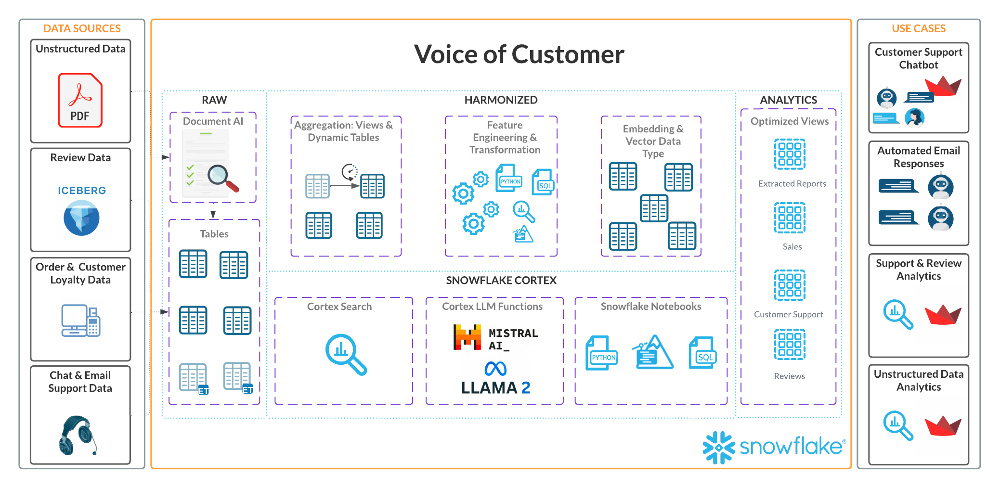
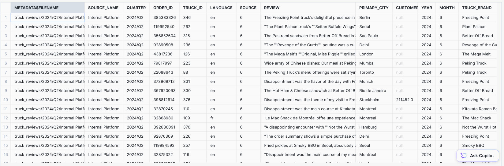
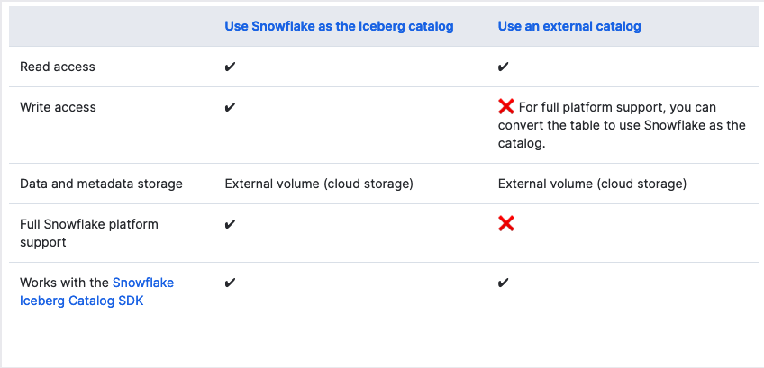
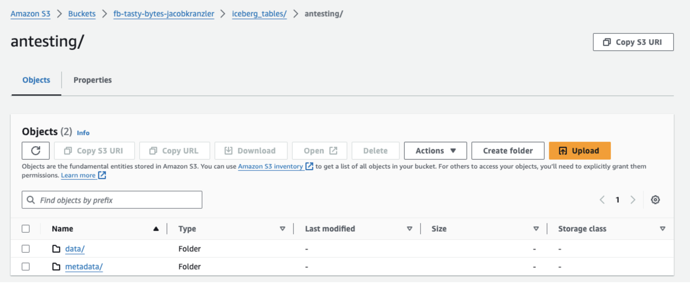
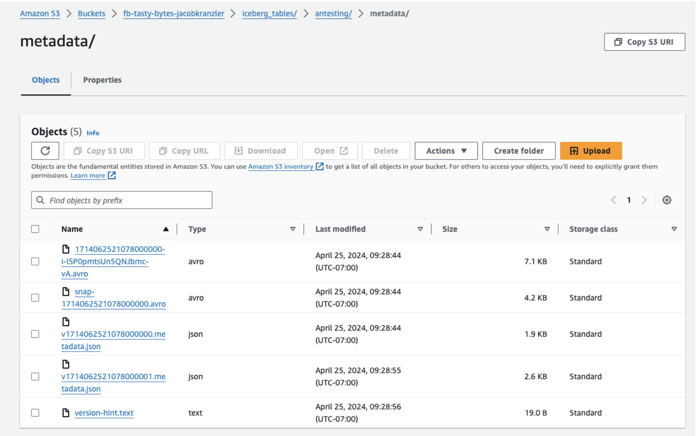

author: nadithya-sf
id: tasty-bytes-working-with-iceberg-tables
categories: snowflake-site:taxonomy/solution-center/certification/quickstart, snowflake-site:taxonomy/product/data-engineering, snowflake-site:taxonomy/snowflake-feature/lakehouse-analytics, snowflake-site:taxonomy/snowflake-feature/apache-iceberg
language: en
summary: This tutorial is a guide built as an extention to the Tasty Bytes series, where we will go over how data from an external Data Lake is made available in Snowflake using External Tables & Iceberg Tables. 
environments: web
status: Published 
feedback link: https://github.com/Snowflake-Labs/sfguides/issues

# Tasty Bytes - Working with Iceberg Tables
<!-- ------------------------ -->
## Overview 


Welcome to the Powered by Tasty Bytes - Working with Iceberg Tables Quickstart.

Within this Quickstart we will walk through how we can use Iceberg Tables in combination with External tables to manage data sitting in an external storage.

### Background

The Tasty Bytes team recognizes the critical importance of analyzing restaurant reviews for understanding customer satisfaction, enhancing service quality, and upholding a positive reputation. By leveraging insights from reviews, they aim to pinpoint strengths, weaknesses, and areas for improvement, thereby driving business success and gain customer loyalty.

The Data Engineering team has been tasked to make this data available to the Data Science team. To achieve these objectives, the team is establishing an environment where development teams can access and process data from their data lake concurrently, using a variety of tools. They prioritize several key factors:

- ACID compliance
- Single source of truth
- Faster adoption
- Performance & Scalability
- Easy to maintain



### Prerequisites

- Snowflake account.
- AWS account with permission to create and manage IAM policies and roles.
- An S3 bucket, in the same region as your Snowflake account.

### What You’ll Learn 
- How to create an External Table
- How to create a Snowflake-managed Iceberg Table 
- Manage an Iceberg Table

### Architecture


We will build an External Table that queries data stored in external storage. The External Table will create certain file-level metadata, version identifiers and related properties. The external tables are configured to auto-refresh. We also will build Iceberg table with Snowflake as the catalog. We will load it with data from the external table to show how you interact with data from Iceberg tables. 

<!-- ------------------------ -->
## Setup

Create a database, schema and warehouse in your Snowflake account

```sql

--Database
CREATE OR REPLACE DATABASE TASTY_BYTES_DB;

--Schema
CREATE OR REPLACE SCHEMA RAW;

--Warehouse
CREATE OR REPLACE WAREHOUSE iceberg_quickstart_wh with
WAREHOUSE_SIZE = MEDIUM
AUTO_SUSPEND = 60;
```

### Load data to S3

- Download the zip file from [here](https://drive.google.com/drive/folders/1w5qm8qECpOOxDqrSR7y_gHhzWZfCgFuI?usp=sharing)
- If you are using a Mac, **'.DS_Store'** files are auto generated into the folder you unzip. You need to delete these files before you upload to S3
    - Navigate to the folder **truck_reviews**.
    - Open up terminal from this folder.
    - Type `find . -name '.DS_Store' -type f -delete` in the terminal. 
    - Press enter.
- Open S3.
- **IMPORTANT: Iceberg tables currently need you to create your S3 bucket in the same region as your snowflake account. Make sure your snowflake account's region and S3 bucket's region align.**
    - You can know your snowflake account's region by running the below command.
    ```
    SELECT current_region();
    ```
- Open the bucket you intend to use and upload the **truck_reviews** folder.

### Create IAM Policy

- Log into the AWS Management Console.
- From the home dashboard, choose Identity & Access Management (IAM)
- Choose Account settings from the left-hand navigation pane.
- Choose Policies from the left-hand navigation pane.
- Click Create Policy.
- Click the JSON tab.
- Paste the following JSON. This will provide snowflake with **READ WRITE ACCESS** to the bucket you created.
   - **Replace < bucket > in the below JSON with the bucket name you created.**

````
{
    "Version": "2012-10-17",
    "Statement": [
        {
            "Effect": "Allow",
            "Action": [
                "s3:PutObject",
                "s3:GetObject",
                "s3:GetObjectVersion",
                "s3:DeleteObject",
                "s3:DeleteObjectVersion"
            ],
            "Resource": "arn:aws:s3:::<bucket>/*"
        },
        {
            "Effect": "Allow",
            "Action": [
                "s3:ListBucket",
                "s3:GetBucketLocation"
            ],
            "Resource": "arn:aws:s3:::<bucket>",
            "Condition": {
                "StringLike": {
                    "s3:prefix": [
                        "*"
                    ]
                }
            }
        }
    ]
}
````

- Click the Next button
- Name the policy and click Create Policy

### Create IAM Roles

- Log into the AWS Management Console.
- From the home dashboard, choose Identity & Access Management (IAM)
- Choose Account settings from the left-hand navigation pane.
- Choose Roles from the left-hand navigation pane.
- Click the Create role button.
- Select AWS account as the trusted entity type.
- Select Another AWS Account 
- In the Account ID field, enter your own AWS account ID temporarily. Later, you will modify the trusted relationship and grant access to Snowflake.
- Select the Require external ID option. Enter a dummy ID such as 0000.
- Click the Next button.
- Locate the policy from the previous step and select it.
- Click the Next button.
- Enter a name and description for the **storage integration**  role, and click the Create role button.
    - Role Name: **iceberg_demo_stg_int_role< first letter of your first name >< last name >**
    - Example: **iceberg_demo_stg_int_role_jdoe**
- Save the Role ARN, you can altenatively come back to this when we use it in the future steps.
- Create another role for the **external volume** with the same policy we used earlier.
    - Role Name: **iceberg_demo_ext_vol_role< first letter of your first name >< last name >**
    - Example: **iceberg_demo_ext_vol_role_jdoe**

### Create a Storage Integration

A storage integration is a Snowflake object that stores a generated identity and access management (IAM) entity for your external cloud storage, along with an optional set of allowed or blocked storage locations (Amazon S3, Google Cloud Storage, or Microsoft Azure). Cloud provider administrators in your organization grant permissions on the storage locations to the generated entity. This option allows users to avoid supplying credentials when creating stages or when loading or unloading data.

Run the below command on your snowflake worksheet.
- Make sure you replace **< bucket >** with the bucket name you created earlier.
- Make sure you replace **< iam_role >** with the ROLE ARN of the **storage integration** role you created earlier
    - Example ROLE ARN: **arn:aws:iam::001234567890:role/myrole**

```
USE ROLE ACCOUNTADMIN;
CREATE OR REPLACE STORAGE INTEGRATION int_tastybytes_truckreviews
  TYPE = EXTERNAL_STAGE
  STORAGE_PROVIDER = 'S3'
  ENABLED = TRUE
  STORAGE_AWS_ROLE_ARN = '< iam_role >'
  STORAGE_ALLOWED_LOCATIONS = ('s3://< bucket >/truck_reviews/');
```

### Create External Volume

Run the below command on your snowflake worksheet.
- Make sure you replace **< bucket >** with the bucket name you created earlier.
- Make sure you replace **< iam_role >** with the ROLE ARN of the **external volume** role you created earlier
    - Example ROLE ARN: **arn:aws:iam::001234567890:role/myrole**

````
USE ROLE ACCOUNTADMIN;
CREATE OR REPLACE EXTERNAL VOLUME vol_tastybytes_truckreviews
    STORAGE_LOCATIONS =
        (
            (
                NAME = 'my-s3-bucket'
                STORAGE_PROVIDER = 'S3'
                STORAGE_BASE_URL = 's3://< bucket >/'
                STORAGE_AWS_ROLE_ARN = '< iam_role >'
            )
        );
````
### Step 6 - Retrieve the AWS IAM User for your Snowflake Account

#### Storage Integration

A storage integration is a Snowflake object that stores a generated identity and access management (IAM) user for your S3 cloud storage, along with an optional set of allowed or blocked storage locations (i.e. buckets). Cloud provider administrators in your organization grant permissions on the storage locations to the generated user. This option allows users to avoid supplying credentials when creating stages or loading data.

- Execute the DESCRIBE INTEGRATION command to retrieve the ARN for the AWS IAM user that was automatically created for your Snowflake Account.

````
DESC INTEGRATION int_tastybytes_truckreviews;
````

  - The STORAGE_AWS_IAM_USER_ARN is the snowflake user arn that has been auto generated.
  - The STORAGE_AWS_EXTERNAL_ID is the External ID you need to provide in AWS Role you created earlier.
  - Go back to the AWS management console.
  - Go back to IAM and open the **storage integration** role you created.
  - Click on the Trust relationships tab.
  - Click the Edit trust relationship button.
  - Modify the policy document with the DESC STORAGE INTEGRATION results. 
    - Update the **< STORAGE_AWS_IAM_USER_ARN >** and **< STORAGE_AWS_EXTERNAL_ID >** and click on Update Trust Policy.

**Policy document for IAM role**

````
  {
  "Version": "2012-10-17",
  "Statement": [
    {
      "Sid": "",
      "Effect": "Allow",
      "Principal": {
        "AWS": "<STORAGE_AWS_IAM_USER_ARN>"
      },
      "Action": "sts:AssumeRole",
      "Condition": {
        "StringEquals": {
          "sts:ExternalId": "<STORAGE_AWS_EXTERNAL_ID>"
        }
      }
    }
  ]
}
````


#### External Volume

- Execute the DESCRIBE EXTERNAL VOLUME command to retrieve the ARN for the AWS IAM user that was automatically created for your Snowflake Account. Tip: run both commands together.

````
DESC EXTERNAL VOLUME vol_tastybytes_truckreviews;
SELECT 
    PARSE_JSON("property_value"):STORAGE_AWS_IAM_USER_ARN AS STORAGE_AWS_IAM_USER_ARN,
    PARSE_JSON("property_value"):STORAGE_AWS_EXTERNAL_ID AS STORAGE_AWS_EXTERNAL_ID
FROM TABLE(RESULT_SCAN(LAST_QUERY_ID())) WHERE "property" = 'STORAGE_LOCATION_1';
````

  - The STORAGE_AWS_IAM_USER_ARN is the snowflake user arn that has been auto generated.
  - The STORAGE_AWS_EXTERNAL_ID is the External ID you need to provide in AWS Role you created earlier.
  - Go back to IAM and open the **external volume** role you created.
  - Click on the Trust relationships tab.
  - Click the Edit trust relationship button.
  - Modify the policy document with the DESC EXTERNAL VOLUME results. 
    - Update the **< STORAGE_AWS_IAM_USER_ARN >** and **< STORAGE_AWS_EXTERNAL_ID >** and click on Update Trust Policy.

### Load Tasty Bytes Order Data into Snowflake

We will use Tasty Bytes order data to enrich Iceberg tables within Snowflake. 

````
CREATE OR REPLACE TABLE tasty_bytes_db.raw.order_header
(
    order_id NUMBER(38,0),
    truck_id NUMBER(38,0),
    location_id FLOAT,
    customer_id NUMBER(38,0),
    discount_id VARCHAR(16777216),
    shift_id NUMBER(38,0),
    shift_start_time TIME(9),
    shift_end_time TIME(9),
    order_channel VARCHAR(16777216),
    order_ts TIMESTAMP_NTZ(9),
    served_ts VARCHAR(16777216),
    order_currency VARCHAR(3),
    order_amount NUMBER(38,4),
    order_tax_amount VARCHAR(16777216),
    order_discount_amount VARCHAR(16777216),
    order_total NUMBER(38,4)
);

CREATE OR REPLACE FILE FORMAT tasty_bytes_db.raw.csv_ff 
type = 'csv';

CREATE OR REPLACE STAGE tasty_bytes_db.raw.s3load
COMMENT = 'Quickstarts S3 Stage Connection'
url = 's3://sfquickstarts/frostbyte_tastybytes/'
file_format = tasty_bytes_db.raw.csv_ff;

COPY INTO tasty_bytes_db.raw.order_header
FROM @tasty_bytes_db.raw.s3load/raw_pos/order_header/;
````

<!-- ------------------------ -->
## Create an External Table

An external table is a Snowflake feature that allows you to query data stored in an external stage as if the data were inside a table in Snowflake. The external stage is not part of Snowflake, so Snowflake does not store or manage the stage. External tables let you store (within Snowflake) certain file-level metadata, including filenames, version identifiers, and related properties.

### External Stage

The review files in our external storage are in csv format and have **|** as the delimiter. So let's create a file format for this configuration.

````
CREATE OR REPLACE FILE FORMAT tasty_bytes_db.raw.ff_csv
    TYPE = 'csv'
    SKIP_HEADER = 1   
    FIELD_DELIMITER = '|';
````

Next let's create a stage named stg_truck_reviews in the RAW schema we created earlier for this demo. The cloud storage URL includes the path files. The stage references a storage integration named my_storage_int.

**Replace the <bucket_name> in the below code with the bucket you are using for this quickstart**

````
CREATE OR REPLACE STAGE tasty_bytes_db.raw.stg_truck_reviews
    STORAGE_INTEGRATION = int_tastybytes_truckreviews
    URL = 's3://<bucket_name>/truck_reviews/'
    FILE_FORMAT = raw.ff_csv;
````

#### Query the Stage

````
SELECT TOP 100 METADATA$FILENAME,
       SPLIT_PART(METADATA$FILENAME, '/', 4) as source_name,
       CONCAT(SPLIT_PART(METADATA$FILENAME, '/', 2),'/' ,SPLIT_PART(METADATA$FILENAME, '/', 3)) as quarter,
       $1 as order_id,
       $2 as truck_id,
       $3 as language,
       $4 as source,
       $5 as review,
       $6 as primary_city,
       $7 as customer_id,
       $8 as year,
       $9 as month,
       $10 as truck_brand,
FROM @tasty_bytes_db.raw.stg_truck_reviews/;
````
You should see a similar output as below.



### External Table

Let's now create an external table in the RAW schema. When queried, an external table reads data from a set of one or more files in a specified external stage and outputs the data in a single VARIANT column.

Here we are parsing the semi-structured data returned in the Variant column.

````
CREATE OR REPLACE EXTERNAL TABLE tasty_bytes_db.raw.ext_survey_data
(
    source varchar as SPLIT_PART(METADATA$FILENAME, '/', 4),
    quarter varchar as CONCAT(SPLIT_PART(METADATA$FILENAME, '/', 2),'/' ,SPLIT_PART(METADATA$FILENAME, '/', 3)),
    order_id variant as IFNULL((value:c1),-1),
    truck_id bigint as (IFNULL(value:c2::int,-1)),
    language varchar as (value:c3::varchar),
    review varchar as (value:c5::varchar),
    primary_city varchar as (value:c6::varchar),
    review_year int as (value:c8::int),
    review_month int as (value:c9::int)
)
PARTITION BY (quarter, source)
LOCATION = @tasty_bytes_db.raw.stg_truck_reviews/
AUTO_REFRESH = TRUE
FILE_FORMAT = tasty_bytes_db.raw.ff_csv
PATTERN ='.*truck_reviews.*[.]csv'
COMMENT = '{"origin":"sf_sit-is", "name":"voc", "version":{"major":1, "minor":0}, "attributes":{"is_quickstart":0, "source":"sql", "vignette":"iceberg"}}';
````

Let's take a look at the data in the external table

````
SELECT * FROM tasty_bytes_db.raw.ext_survey_data LIMIT 100;
````

<!-- ------------------------ -->
## Configure External Table to Auto-Refresh

Execute the SHOW EXTERNAL TABLES command. Tip: run the commands below together to get the **notication_channel** column.

````
SHOW EXTERNAL TABLES;
SELECT "notification_channel"
FROM TABLE(RESULT_SCAN(LAST_QUERY_ID()));
````

Copy the ARN of the SQS queue for the external table in the **notification_channel** column and follow the below steps.

- Log into the AWS Management Console.
- Open your S3 bucket created in setup
- Click the properties tab
- Scroll to Event notifications and click Create event notification
- Configure an event notification for your S3 bucket using the instructions provided in the Amazon S3 documentation. Complete the fields as follows:

    - **Name**: Name of the event notification (e.g. Auto-ingest Snowflake).

    - **Events**: Select All object create events and All object removal events.

    - **Destination**: Select SQS Queue.

    - **SQS**: Select Add SQS queue ARN.
    
    - **SQS queue ARN**: Paste the SQS queue name from the SHOW EXTERNAL TABLES output.

Click save changes and the external stage with auto-refresh is now configured!

When new or updated data files are added to the S3 bucket, the event notification informs Snowflake to scan them into the external table metadata.


<!-- ------------------------ -->
## Create Iceberg Table

An Iceberg table uses the Apache Iceberg open table format specification, which provides an abstraction layer on data files stored in open formats and supports features such as:

- ACID (atomicity, consistency, isolation, durability) transactions
- Schema evolution
- Hidden partitioning
- Table snapshots

Iceberg tables for Snowflake combine the performance and query semantics of regular Snowflake tables with external cloud storage that you manage. They are ideal for existing data lakes that you do not store in Snowflake.



In this quickstart we will see how to create a Iceberg table using Snowflake as the catalog. An Iceberg table that uses Snowflake as the Iceberg catalog provides full Snowflake platform support with read and write access. The table data and metadata are stored in external cloud storage, which Snowflake accesses using an external volume. Snowflake handles all life-cycle maintenance, such as compaction, for the table.

**Note**: BASE_LOCATION determines the location of the Iceberg Table. running this command will create a new folder named `iceberg_table` in your bucket. The data and metadata files for the Iceberg table will be created in the directory.

````
CREATE OR REPLACE ICEBERG TABLE tasty_bytes_db.raw.icb_truck_reviews
        (
        source_name VARCHAR,
        quarter VARCHAR,
        order_id BIGINT,
        truck_id INT,
        review VARCHAR,
        language VARCHAR
        )
        CATALOG = 'SNOWFLAKE'
        EXTERNAL_VOLUME = 'vol_tastybytes_truckreviews'
        BASE_LOCATION = 'iceberg_table/';
````

Snowflake creates data and metadata files and manages them. The table state is maintained in the metadata files. When changes are made to the data, new metadata files are created replacing the older metadata.




#### Metadata Files

  - Metadata File: Stores table schema, partition info, and snapshot details.

  - Manifest List File: Indexes manifest files, tracks added/deleted data files, and includes partition boundaries.

  - Manifest File: Lists data files (Parquet/ORC/AVRO) and may include column-level metrics for optimization.



#### Data Files

Data files refer to the physical files that store the actual data. These files typically contain data in formats such as Parquet or ORC. Iceberg tables organize data into multiple data files, each containing a subset of the table's data. These files are managed and optimized by the Iceberg table format to support efficient data storage, retrieval, and processing.

### Querying Iceberg Tables
Now let's load some data into the Iceberg table. This query copies the data from the external table into our new iceberg table (in the `iceberg_table` directory of S3). 

**Note:** You may load data directly into the S3 directory where your Iceberg table resides. We are loading data from the External Table here to show how you can interact with data inside Iceberg Tables. 

````
INSERT INTO tasty_bytes_db.raw.icb_truck_reviews
(
source_name, quarter, order_id, truck_id, review, language
)
SELECT source as source_name,
    quarter,
    order_id,
    truck_id,
    review,
    language
FROM tasty_bytes_db.raw.ext_survey_data;
````

Let's query the data. You can query the table just as you would standard tables in Snowflake. 

````
SELECT TOP 100 * FROM tasty_bytes_db.raw.icb_truck_reviews;
````

You can also do joins and enrich the Iceberg data with data residing in Snowflake. Let's get some more information on reviews that have associated orders using the `order_header` table.

````
SELECT
    tr.order_id,
    tr.truck_id,
    tr.review,
    oh.location_id,
    oh.order_ts,
    oh.order_total
FROM tasty_bytes_db.raw.order_header oh
JOIN tasty_bytes_db.raw.icb_truck_reviews tr
    ON tr.order_id = oh.order_id;
````

<!-- ------------------------ -->
## Cleanup

Run the following command to remove all Snowflake objects created in this quickstart. Do not forget the AWS roles, policy, and bucket!

````
DROP DATABASE IF EXISTS tasty_bytes_db;
DROP WAREHOUSE IF EXISTS iceberg_quickstart_wh;
DROP INTEGRATION IF EXISTS int_tastybytes_truckreviews;
DROP EXTERNAL VOLUME IF EXISTS vol_tastybytes_truckreviews;
````

<!-- ------------------------ -->
## Conclusion and Resources

In this quickstart, we explored the use of Iceberg tables in Snowflake to manage and analyze restaurant review data efficiently. We began by setting up the necessary infrastructure in Snowflake, AWS, and S3, including creating databases, warehouses, IAM policies, roles, and storage integrations.

We then proceeded to surface data from S3 into Snowflake using external stages and tables, allowing us to query and analyze the data as if it were stored natively within Snowflake. We configured auto-refresh for the external tables to ensure they stay up-to-date with changes in the S3 bucket.

Next, we created Iceberg tables in Snowflake, leveraging the powerful features of the Iceberg format such as ACID transactions, schema evolution, and hidden partitioning. These tables allow us to efficiently manage and analyze large volumes of data stored in external cloud storage while benefiting from Snowflake's query capabilities.

### Related Resources

  - [Snowflake Documentation for Iceberg Tables](https://docs.snowflake.com/en/user-guide/tables-iceberg)
  - [Apache Iceberg Documentation](https://iceberg.apache.org/)
