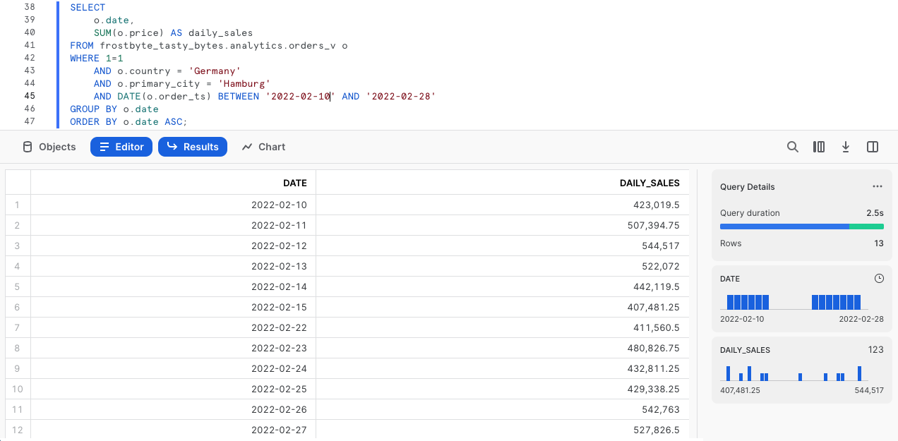
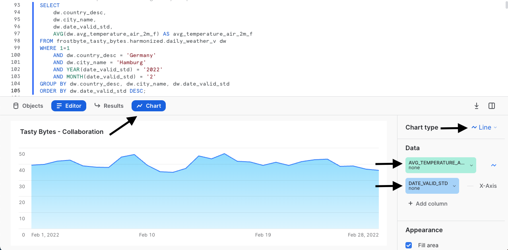

author: Jacob Kranzler
id: tasty-bytes-zero-to-snowflake-collaboration-es
categories: snowflake-site:taxonomy/solution-center/certification/quickstart, snowflake-site:taxonomy/product/applications-and-collaboration
language: es
summary: Tasty Bytes - De cero a Snowflake - Colaboración
environments: web
status: Published
feedback link: https://github.com/Snowflake-Labs/sfguides/issues

# Tasty Bytes - De cero a Snowflake - Colaboración
<!-- ------------------------ -->

## Acceso directo a datos de terceros a través de Snowflake Marketplace

### Descripción general
Te damos la bienvenida a la quickstart guide De cero a Snowflake de Tasty Bytes centrada en la colaboración. En esta quickstart guide explicaremos cómo puedes enriquecer tus datos de primera mano con datos meteorológicos a través de Snowflake Marketplace. En Snowflake Marketplace podrás encontrar, probar y comprar datos y aplicaciones de terceros sin tener que configurar procesos de extracción, transformación y carga (extract, transform, load; ETL), flujos de datos ni integraciones.


### Requisitos previos
- Antes de empezar, asegúrate de haber completado la [**quickstart guide Introducción a Tasty Bytes**](/en/developers/guides/tasty-bytes-introduction/), donde aprenderás a configurar una cuenta de prueba y a implementar los conceptos esenciales de Tasty Bytes necesarios para completar esta quickstart guide.

### Contenido que se enseñará
- Cómo acceder a Snowflake Marketplace
- Cómo obtener datos actualizados de Weather Source en tu cuenta
- Cómo crear una vista
- Cómo crear una función SQL
- Cómo utilizar los gráficos de Snowsight para analizar la información visual

### Cosas que podrás conseguir
- Armonización de datos meteorológicos de primera mano y de terceros
- Conversión de grados Fahrenheit a Celsius
- Conversión de pulgadas a milímetros
- Cómo obtener información adicional a través de Snowflake Marketplace

## Creación de una hoja de trabajo y copia en SQL

### Descripción general
En esta quickstart guide se narra una historia de Tasty Bytes mediante una hoja de trabajo SQL en Snowsight. Esta página servirá de guía completa paralela con comentarios adicionales, imágenes y enlaces a la documentación.

En esta sección te explicaremos cómo iniciar sesión en Snowflake, crear una nueva hoja de trabajo, cambiar el nombre de la hoja de trabajo, copiar SQL de GitHub y pegar el que utilizaremos en esta quickstart guide.

### Paso 1: acceder a Snowflake con la URL
- Abre una ventana del navegador e introduce la URL de tu cuenta de Snowflake. 

### Paso 2: iniciar sesión en Snowflake
- Inicia sesión en tu cuenta de Snowflake.
    - 

### Paso 3: acceder a las hojas de trabajo
- Haz clic en la pestaña Worksheets en la barra de navegación situada a la izquierda para acceder a las hojas de trabajo.
    - 

### Paso 4: crear una hoja de trabajo
- En la pestaña Worksheets, haz clic en el botón “+” en la esquina superior derecha de Snowsight y elige “SQL Worksheet”.
    - 

### Paso 5: cambiar el nombre de una hoja de trabajo
- Cambia el nombre de la hoja de trabajo haciendo clic en el nombre generado automáticamente (marca de tiempo) e introduce “Tasty Bytes - Collaboration"
    - 

### Paso 6: acceder a la quickstart guide de SQL en GitHub
- Haz clic en el botón que aparece a continuación. Te redirigirá a nuestro archivo SQL de Tasty Bytes alojado en GitHub.

<button>[tb_zts_collaboration.sql](https://github.com/Snowflake-Labs/sf-samples/blob/main/samples/tasty_bytes/tb_zts_collaboration.sql)</button>

### Paso 7: copiar el código SQL de configuración de GitHub
- En GitHub, ve al lado derecho y haz clic en “Copy raw contents”. De esta forma, se copiará todo el código SQL necesario en el portapapeles.
    - 

### Paso 8: pegar el código SQL de configuración de GitHub en tu hoja de trabajo de Snowflake
- Vuelve a la hoja de trabajo que acabas de crear en Snowsight y pega (*CMD + V para Mac o CTRL + V para Windows*) lo que has copiado de GitHub.

### Paso 9: hacer clic en Next -->

## Investigación de los días sin ventas en los datos de primera mano

### Descripción general
Los analistas financieros de Tasty Bytes nos han informado de que, al ejecutar análisis interanuales, hay días en varias ciudades en los que las ventas de los food trucks se quedaron a 0 sin ningún motivo aparente. Un ejemplo que nos dieron fue Hamburgo (Alemania) en febrero de 2022.


### Paso 1: consultar los datos de los puntos de venta en busca de tendencias
Vamos a empezar ejecutando las tres consultas de este paso para configurar los contextos iniciales del rol `tasty_data_engineer` y del almacén `tasty_de_wh`. Cuando hayamos establecido el contexto, consultaremos la vista de analíticas `orders_v` para proporcionar un conjunto de resultados de las ventas de Hamburgo (Alemania) en 2022.

``` 
USE ROLE tasty_data_engineer; 
USE WAREHOUSE tasty_de_wh;

SELECT 
    o.date, 
    SUM(o.price) AS daily_sales
FROM frostbyte_tasty_bytes.analytics.orders_v o 
WHERE 1=1 
    AND o.country = 'Germany' 
    AND o.primary_city = 'Hamburg' 
    AND DATE(o.order_ts) BETWEEN '2022-02-10' AND '2022-02-28' 
GROUP BY o.date 
ORDER BY o.date ASC; 
```



Basándonos en lo que acabamos de ver, estamos de acuerdo con los analistas en que hay días de febrero en los que no tenemos registros de ventas. Por tanto, está claro que los analistas han descubierto algo. Veamos si podemos investigar aún más para saber por qué puede haber ocurrido esto en la siguiente sección.

### Paso 2: hacer clic en Next -->

## Uso de los datos de Weather Source desde Snowflake Marketplace

### Descripción general
Como hemos podido ver en la sección anterior, parece que nos faltan ventas entre el 16 y el 21 de febrero en Hamburgo (Alemania). En nuestros datos de primera mano no hay mucha más información que podamos utilizar para seguir investigando, pero debe de haber ocurrido algo importante. 
        
Una idea que podemos estudiar directamente si utilizamos [Snowflake Marketplace](/es/data-cloud/marketplace/) son los fenómenos meteorológicos extremos y una lista pública gratuita proporcionada por Weather Source.

### Paso 1: obtener la lista de Snowflake Marketplace de Weather Source LLC: frostbyte
Snowflake Marketplace es la ubicación de referencia para buscar, probar y adquirir los datos y aplicaciones que necesitas para desarrollar soluciones empresariales innovadoras. En este paso, accederemos a la lista de [Weather Source LLC: frostbyte](https://app.snowflake.com/marketplace/listing/GZSOZ1LLEL/weather-source-llc-weather-source-llc-frostbyte) para poder realizar análisis adicionales sobre el desplome de las ventas en Hamburgo.

Sigue los pasos y el vídeo que se muestran a continuación para conseguir esta lista en tu cuenta de Snowflake.

- Haz clic en Home.
- Haz clic en Marketplace.
- Busca frostbyte.
- Haz clic en Weather Source LLC: frostbyte.
- Haz clic en Get.
- Cambia el nombre de la base de datos a FROSTBYTE_WEATHERSOURCE (todo en mayúsculas).
- Otorga la condición PUBLIC a los roles adicionales.


>aside positive Weather Source es un destacado proveedor de datos meteorológicos y climáticos mundiales, y su conjunto de productos OnPoint proporciona a las empresas los datos meteorológicos y climáticos necesarios para generar rápidamente información práctica y útil en un amplio abanico de casos de uso en distintos sectores.
>

### Paso 2: armonizar los datos propios y de terceros
Una vez establecida la base de datos compartida `frostbyte_weathersource`, ejecuta la consulta de este paso para crear una vista `harmonized.daily_weather_v` que una dos tablas de Weather Source a nuestra tabla de países con los países y ciudades en los que operan los food trucks de Tasty Bytes.

```
CREATE OR REPLACE VIEW frostbyte_tasty_bytes.harmonized.daily_weather_v
    AS
SELECT 
    hd.*,
    TO_VARCHAR(hd.date_valid_std, 'YYYY-MM') AS yyyy_mm,
    pc.city_name AS city,
    c.country AS country_desc
FROM frostbyte_weathersource.onpoint_id.history_day hd
JOIN frostbyte_weathersource.onpoint_id.postal_codes pc
    ON pc.postal_code = hd.postal_code
    AND pc.country = hd.country
JOIN frostbyte_tasty_bytes.raw_pos.country c
    ON c.iso_country = hd.country
    AND c.city = hd.city_name;
```


Como vemos en la definición de la vista un poco más arriba, vamos a combinar las dos tablas `frostbyte_weathersource` en el esquema `onpoint_id` y, a continuación, vamos a armonizarlas con nuestra tabla `country` de la base de datos `frostbyte_tasty_bytes` y el esquema `raw_pos`. 

Este tipo de operación se suele encontrar en la capa armonizada, también conocida como zona Plata.

### Paso 3: visualizar las temperaturas diarias
Con la vista `daily_weather_v` en el esquema armonizado, vamos a echar un vistazo a la temperatura media diaria de Hamburgo en febrero de 2022 ejecutando la siguiente consulta.

Durante el proceso utilizaremos las funciones [AVG](https://docs.snowflake.com/en/sql-reference/functions/avg), [YEAR](https://docs.snowflake.com/en/sql-reference/functions/year) y [MONTH](https://docs.snowflake.com/en/sql-reference/functions/year).

```
SELECT 
    dw.country_desc,
    dw.city_name,
    dw.date_valid_std,
    AVG(dw.avg_temperature_air_2m_f) AS avg_temperature_air_2m_f
FROM frostbyte_tasty_bytes.harmonized.daily_weather_v dw
WHERE 1=1
    AND dw.country_desc = 'Germany'
    AND dw.city_name = 'Hamburg'
    AND YEAR(date_valid_std) = '2022'
    AND MONTH(date_valid_std) = '2'
GROUP BY dw.country_desc, dw.city_name, dw.date_valid_std
ORDER BY dw.date_valid_std DESC;
```


Para investigar más a fondo las tendencias, vamos a utilizar los gráficos de Snowsight para crear un gráfico lineal de la temperatura media a lo largo del tiempo.



De acuerdo con lo hemos visto antes, aún no hay ningún dato que nos llame la atención como para considerarlo el causante de los días sin ventas de los food trucks. Veamos en el siguiente paso qué más podemos encontrar para explicar lo ocurrido.

### Paso 4: añadir los datos sobre el viento
Como hemos visto en el paso anterior, no parece que la temperatura media diaria sea la causante de los días sin ventas en Hamburgo. Afortunadamente, Weather Source proporciona otras métricas meteorológicas en las que también podemos profundizar. 

Ejecuta la consulta donde utilizaremos la vista armonizada para incluir las métricas de viento. En esta consulta veremos cómo se usa la función [MAX](https://docs.snowflake.com/en/sql-reference/functions/min).

```
SELECT 
    dw.country_desc,
    dw.city_name,
    dw.date_valid_std,
    MAX(dw.max_wind_speed_100m_mph) AS max_wind_speed_100m_mph
FROM frostbyte_tasty_bytes.harmonized.daily_weather_v dw
WHERE 1=1
    AND dw.country_desc IN ('Germany')
    AND dw.city_name = 'Hamburg'
    AND YEAR(date_valid_std) = '2022'
    AND MONTH(date_valid_std) = '2'
GROUP BY dw.country_desc, dw.city_name, dw.date_valid_std
ORDER BY dw.date_valid_std DESC;
```


De nuevo, este tipo de datos podría mostrar mejor las tendencias a través de un rápido gráfico de Snowsight. Sigue las flechas de las siguientes capturas de pantalla para ir de Results a Charts.


**¡Eureka!** El viento de los días sin ventas estaba a niveles de huracán. Parece una buena razón para explicar por qué los food trucks no pudieron vender nada esos días. Sin embargo, ya que hemos ejecutado este análisis en la capa armonizada, vamos a empezar por hacerlo accesible en la capa analítica, donde los analistas podrán acceder a esta información por su cuenta.

### Paso 5: hacer clic en Next -->

## Democratización de la información de los datos

### Descripción general
Ahora sabemos que probablemente los vientos huracanados influyeran en los días sin ventas que nos comunicaron los analistas financieros.

Vamos a poner esta investigación a disposición de cualquier persona de la organización. Para ello, habrá que implementar una vista de analíticas a la que puedan acceder todos los empleados de Tasty Bytes.

### Paso 1: crear funciones SQL
Como somos una empresa global, vamos a empezar el proceso con la creación de dos funciones SQL para convertir Fahrenheit a Celsius y pulgadas a milímetros. 

Ejecuta las dos consultas del primer paso una a una para crear las funciones `fahrenheit_to_celsius` y `inch_to_millimeter`, que utilizarán el comando [CREATE FUNCTION](https://docs.snowflake.com/en/sql-reference/sql/create-function).


```
CREATE OR REPLACE FUNCTION frostbyte_tasty_bytes.analytics.fahrenheit_to_celsius(temp_f NUMBER(35,4))
RETURNS NUMBER(35,4)
AS
$$
    (temp_f - 32) * (5/9)
$$;
```


```
CREATE OR REPLACE FUNCTION frostbyte_tasty_bytes.analytics.inch_to_millimeter(inch NUMBER(35,4))
RETURNS NUMBER(35,4)
    AS
$$
    inch * 25.4
$$;
```


>aside positive Cuando crees una función definida por el usuario (user-defined function, UDF), tendrás que especificar un controlador cuyo código se escriba en uno de los lenguajes compatibles. En función del lenguaje del controlador, podrás incluir el código fuente del controlador en línea mediante la sentencia CREATE FUNCTION o hacer referencia a la ubicación del controlador desde CREATE FUNCTION, donde el controlador esté precompilado o el código fuente esté en una fase.
>

### Paso 2: crear el SQL para nuestra vista
Antes de implementar la vista de analíticas, vamos a crear el SQL que utilizaremos en la vista para combinar las ventas diarias y el tiempo, y también para utilizar nuestras funciones SQL de conversión. 

Ejecuta la siguiente consulta donde filtraremos por Hamburgo (Alemania) y utilizaremos algunas funciones que aún no hemos explicado: [ZEROIFNULL](https://docs.snowflake.com/en/sql-reference/functions/zeroifnull), [ROUND](https://docs.snowflake.com/en/sql-reference/functions/round) y [DATE](https://docs.snowflake.com/en/sql-reference/functions/to_date).

```
SELECT 
    fd.date_valid_std AS date,
    fd.city_name,
    fd.country_desc,
    ZEROIFNULL(SUM(odv.price)) AS daily_sales,
    ROUND(AVG(fd.avg_temperature_air_2m_f),2) AS avg_temperature_fahrenheit,
    ROUND(AVG(frostbyte_tasty_bytes.analytics.fahrenheit_to_celsius(fd.avg_temperature_air_2m_f)),2) AS avg_temperature_celsius,
    ROUND(AVG(fd.tot_precipitation_in),2) AS avg_precipitation_inches,
    ROUND(AVG(frostbyte_tasty_bytes.analytics.inch_to_millimeter(fd.tot_precipitation_in)),2) AS avg_precipitation_millimeters,
    MAX(fd.max_wind_speed_100m_mph) AS max_wind_speed_100m_mph
FROM frostbyte_tasty_bytes.harmonized.daily_weather_v fd
LEFT JOIN frostbyte_tasty_bytes.harmonized.orders_v odv
    ON fd.date_valid_std = DATE(odv.order_ts)
    AND fd.city_name = odv.primary_city
    AND fd.country_desc = odv.country
WHERE 1=1
    AND fd.country_desc = 'Germany'
    AND fd.city = 'Hamburg'
    AND fd.yyyy_mm = '2022-02'
GROUP BY fd.date_valid_std, fd.city_name, fd.country_desc
ORDER BY fd.date_valid_std ASC;
```


Los resultados que acabamos de recibir tienen buena pinta. Ahora, en el siguiente paso, vamos a incluir este código SQL en una vista.

### Paso 3: desplegar la vista analítica
Vamos a utilizar la misma consulta que acabamos de analizar, pero tendremos que eliminar los filtros de la cláusula WHERE, añadir [COMMENT](https://docs.snowflake.com/en/sql-reference/sql/comment) y promocionarlo en nuestro esquema `analytics` como la vista `daily_city_metrics_v`.

Para ello, inicia la última consulta de esta sección.

```
CREATE OR REPLACE VIEW frostbyte_tasty_bytes.analytics.daily_city_metrics_v
COMMENT = 'Daily Weather Source Metrics and Orders Data for our Cities'
    AS
SELECT 
    fd.date_valid_std AS date,
    fd.city_name,
    fd.country_desc,
    ZEROIFNULL(SUM(odv.price)) AS daily_sales,
    ROUND(AVG(fd.avg_temperature_air_2m_f),2) AS avg_temperature_fahrenheit,
    ROUND(AVG(frostbyte_tasty_bytes.analytics.fahrenheit_to_celsius(fd.avg_temperature_air_2m_f)),2) AS avg_temperature_celsius,
    ROUND(AVG(fd.tot_precipitation_in),2) AS avg_precipitation_inches,
    ROUND(AVG(frostbyte_tasty_bytes.analytics.inch_to_millimeter(fd.tot_precipitation_in)),2) AS avg_precipitation_millimeters,
    MAX(fd.max_wind_speed_100m_mph) AS max_wind_speed_100m_mph
FROM frostbyte_tasty_bytes.harmonized.daily_weather_v fd
LEFT JOIN frostbyte_tasty_bytes.harmonized.orders_v odv
    ON fd.date_valid_std = DATE(odv.order_ts)
    AND fd.city_name = odv.primary_city
    AND fd.country_desc = odv.country
WHERE 1=1
GROUP BY fd.date_valid_std, fd.city_name, fd.country_desc;
```


¡Genial! Ya hemos democratizado este tipo de información en la organización de Tasty Bytes. Vamos a recopilar todo esto en la siguiente sección y a comprobar nuestro trabajo.

### Paso 4: hacer clic en Next -->

## Obtención de la información a partir de ventas y datos meteorológicos de Marketplace

### Descripción general
Ahora que los datos de ventas y meteorológicos de todas las ciudades en las que operan nuestros food trucks ya están disponibles, vamos a ver cómo hemos reducido el tiempo que los analistas financieros dedican a obtener información.

### Paso 1: simplificar nuestros análisis
Hasta ahora, teníamos que unir manualmente los datos de los puntos de venta y Weather Source para poder investigar los problemas de ventas en Hamburgo, pero hemos simplificado enormemente ese proceso gracias a nuestra vista `analytics.daily_city_metrics_v`. 

Pon en marcha la siguiente consulta, que muestra cómo hemos simplificado este análisis al convertirlo en una sentencia SELECT en una sola vista.

```
SELECT 
    dcm.date,
    dcm.city_name,
    dcm.country_desc,
    dcm.daily_sales,
    dcm.avg_temperature_fahrenheit,
    dcm.avg_temperature_celsius,
    dcm.avg_precipitation_inches,
    dcm.avg_precipitation_millimeters,
    dcm.max_wind_speed_100m_mph
FROM frostbyte_tasty_bytes.analytics.daily_city_metrics_v dcm
WHERE 1=1
    AND dcm.country_desc = 'Germany'
    AND dcm.city_name = 'Hamburg'
    AND dcm.date BETWEEN '2022-02-01' AND '2022-02-26'
ORDER BY date DESC;
```


**¡Toma ya!** Si los analistas financieros hubieran podido contar con esta información cuando comenzaron su investigación, no habrían tenido que recurrir a los equipos de datos, ya que toda la información estaba ahí. 

Al completar esta quickstart guide, hemos visto la rapidez con la que podemos obtener valor empresarial real a partir de nuestro trabajo y lo fácil que es utilizar Snowflake Marketplace para obtener información adicional sobre los datos.

### Paso 2: hacer clic en Next -->

## Conclusión y siguientes pasos

### Conclusión
¡Bien hecho! Has completado la quickstart guide De cero a Snowflake de Tasty Bytes sobre colaboración. 

Lo que quiere decir que habrás: - accedido a Snowflake Marketplace, - obtenido datos actualizados de Weather Source en tu cuenta, - creado una vista, - creado una función SQL, - utilizado los gráficos de Snowsight para analizar la información de forma visual.

Si deseas volver a empezar esta quickstart guide, ejecuta las secuencias de comandos de restauración que aparecen en la parte inferior de la hoja de trabajo asociada.

### Siguientes pasos
Si quieres ampliar tu experiencia con Snowflake Data Cloud, haz clic en el siguiente enlace para descubrir otras quickstart guides Powered by Tasty Bytes.

- ### [Powered by Tasty Bytes - Índice de las quickstart guides](/es/developers/guides/tasty-bytes-introduction-es/)

