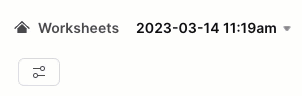

author: Jacob Kranzler
id: tasty-bytes-zero-to-snowflake-collaboration-ptbr
categories: snowflake-site:taxonomy/solution-center/certification/quickstart, snowflake-site:taxonomy/product/platform
language: pt_br
summary: Quickstart Tasty Bytes: do zero ao Snowflake - colaboração
environments: web
status: Published
feedback link: https://github.com/Snowflake-Labs/sfguides/issues

# Tasty Bytes: do zero ao Snowflake - colaboração
<!-- ------------------------ -->

## Acesso direto a dados de terceiros via Snowflake Marketplace

### Visão geral
Damos as boas-vindas ao quickstart “Tasty Bytes:do zero ao Snowflake”, voltado para colaboração! Neste quickstart, destacaremos como você pode enriquecer seus próprios dados com dados meteorológicos por meio do Snowflake Marketplace. O Snowflake Marketplace é o lugar onde você pode encontrar, testar e comprar dados e aplicações de terceiros sem ter que configurar processos de extração, transformação e carga (extract, transform, load; ETL), pipelines de dados ou integrações.


### Pré-requisitos
- Antes de começar, é necessário ter concluído o [**Quickstart “Introdução à Tasty Bytes”**](/pt_br/developers/guides/tasty-bytes-introduction-ptbr/), que oferece um passo a passo para criar uma conta de avaliação gratuita e implementar os elementos básicos da Tasty Bytes necessários para completar este módulo.

### Você vai aprender
- Acessar o Snowflake Marketplace.
- Obter dados da Weather Source na sua conta, em tempo real.
- Como criar um modo de exibição.
- Criar uma função SQL.
- Usar gráficos do Snowsight para explorar insights visuais.

### O que será desenvolvido
- A harmonização de dados próprios de vendas e dados meteorológicos de terceiros.
- Conversão simplificada de Fahrenheit para Celsius.
- Conversão simplificada de polegadas para milímetros.
- Uma introdução sobre como descobrir insights adicionais por meio do Snowflake Marketplace.

## Criação de uma planilha e cópia no código SQL

### Visão geral
Neste quickstart, vamos acompanhar a história da Tasty Bytes por meio de uma planilha SQL do Snowsight. Esta página servirá como um guia de referência completo com comentários adicionais, imagens e links para a documentação.

Nesta seção vamos mostrar como acessar o Snowflake, criar uma planilha nova, renomeá-la, copiar o código SQL do GitHub e colar o código SQL que usaremos neste quickstart.

### Etapa 1 - Acessar o Snowflake via URL
- Abra o navegador e insira a URL da sua conta Snowflake. 

### Etapa 2 - Fazer login no Snowflake
- Acesse sua conta Snowflake.
    - 

### Etapa 3 - Acessar as planilhas
- Clique na guia Worksheets na barra de navegação à esquerda.
    - 

### Etapa 4 - Criar uma planilha
- Dentro da guia Worksheets, clique no botão “+” no canto superior direito do Snowsight e escolha “SQL Worksheet”.
    - 

### Etapa 5 - Renomear uma planilha
- Renomeie a planilha clicando no carimbo de data/hora gerado automaticamente e digite “Tasty Bytes, colaboração”.
    - 

### Etapa 6 - Acessar o código SQL do quickstart no GitHub
- Clique no botão abaixo para acessar o arquivo SQL da Tasty Bytes hospedado no GitHub.

<button>[tb\_zts\_collaboration.sql](https://github.com/Snowflake-Labs/sf-samples/blob/main/samples/tasty_bytes/tb_zts_collaboration.sql)</button>

### Etapa 7 - Copiar o Setup SQL do GitHub
- No GitHub, navegue para a direita e clique em “Copy raw contents”. Todas as informações SQL necessárias serão copiadas para sua área de transferência.
    - 

### Etapa 8 - Colar o Setup SQL do GitHub para a sua planilha do Snowflake
- Volte para o Snowsight e sua planilha recém-criada e cole (*CMD + V no Mac ou CTRL + V no Windows*) o conteúdo copiado do GitHub.

### Etapa 9 - Clicar em Next -->

## Estudo dos dias sem nenhuma venda nos dados próprios

### Visão geral
Os analistas financeiros da Tasty Bytes alertaram que, ao realizar análises ano a ano, há dias inexplicáveis em diversas cidades em que não houve nenhuma venda nos caminhões. Um exemplo citado foi o de Hamburgo, na Alemanha, em fevereiro de 2022.


### Etapa 1 - Consultar os dados do ponto de venda para observar tendências
Vamos começar realizando três consultas para definir o contexto de função e armazenamento para `tasty_data_engineer` e `tasty_de_wh`. Com o contexto definido, vamos consultar a exibição de análise de dados `orders_v` para obter um conjunto de resultados de vendas em Hamburgo, Alemanha, em 2022.

\`\`\` USE ROLE tasty\_data\_engineer; USE WAREHOUSE tasty\_de\_wh;

SELECT o.date, SUM(o.price) AS daily\_sales FROM frostbyte\_tasty\_bytes.analytics.orders\_v o WHERE 1=1 AND o.country = 'Germany' AND o.primary\_city = 'Hamburg' AND DATE(o.order\_ts) BETWEEN '2022-02-10' AND '2022-02-28' GROUP BY o.date ORDER BY o.date ASC; \`\`\`


Com base no que vemos acima, podemos concordar com os analistas de que não há registros de vendas em alguns dias de fevereiro, então eles realmente identificaram algo. Na próxima seção, veremos se conseguimos analisar melhor o que pode ter acontecido.

### Etapa 2 - Clicar em Next -->

## Obtenção de dados da Weather Source no Snowflake Marketplace

### Visão geral
Com base no que vimos na seção anterior, parece que não temos dados de vendas de 16 a 21 de fevereiro em Hamburgo, Alemanha. Não há muito que possamos fazer para investigar com os dados próprios, mas provavelmente algo ocorreu aqui. 
        
Uma ideia que podemos explorar imediatamente usando o [Snowflake Marketplace](/pt_br/data-cloud/marketplace/) é verificar se houve alguma condição meteorológica extrema, empregando a oferta de dados pública e gratuita da Weather Source.

### Etapa 1 - Adquirir a oferta da Weather Source LLC: frostbyte no Snowflake Marketplace
O Snowflake Marketplace é o melhor lugar para procurar, testar e comprar dados e aplicações necessários para desenvolver soluções de negócios inovadoras. Nesta etapa, vamos acessar a ofertar da [Weather Source LLC: frostbyte](https://app.snowflake.com/marketplace/listing/GZSOZ1LLEL/weather-source-llc-weather-source-llc-frostbyte) para ajudar a orientar as análises adicionais sobre a queda nas vendas em Hamburgo.

Siga as etapas e o vídeo abaixo para adquirir a oferta na sua conta Snowflake.

- Clique -> Home
- Clique -> Marketplace
- Pesquise -> frostbyte
- Clique -> Weather Source LLC: frostbyte
- Clique -> Get
- Renomeie o banco de dados -> FROSTBYTE\_WEATHERSOURCE (tudo em maiúsculas)
- Permissão para funções adicionais -> PUBLIC


>aside positive A Weather Source é uma fornecedora líder global de dados de meteorologia, e seu OnPoint Product Suite oferece às empresas os dados meteorológicos necessários para geração de insights relevantes e úteis para diversos casos de uso em diversos setores.
>

### Etapa 2 - Harmonizar os dados próprios e de terceiros
Com o banco de dados `frostbyte_weathersource` já criado, execute a consulta desta etapa para criar uma exibição `harmonized.daily_weather_v` que junte duas tabelas da Weather Source à nossa tabela de países e cidades onde os food trucks da Tasty Bytes operam.

```
CREATE OR REPLACE VIEW frostbyte_tasty_bytes.harmonized.daily_weather_v
    AS
SELECT 
    hd.*,
    TO_VARCHAR(hd.date_valid_std, 'YYYY-MM') AS yyyy_mm,
    pc.city_name AS city,
    c.country AS country_desc
FROM frostbyte_weathersource.onpoint_id.history_day hd
JOIN frostbyte_weathersource.onpoint_id.postal_codes pc
    ON pc.postal_code = hd.postal_code
    AND pc.country = hd.country
JOIN frostbyte_tasty_bytes.raw_pos.country c
    ON c.iso_country = hd.country
    AND c.city = hd.city_name;
```


Como podemos ver na definição do modo de exibição acima, estamos juntando duas das tabelas `frostbyte_weathersource` dentro do esquema `onpoint_id` e harmonizando-as com a nossa tabela `country` do banco de dados `frostbyte_tasty_bytes` e o esquema `raw_pos`. 

Esse é o tipo de operação que encontramos normalmente na camada harmonizada, ou que poderia ser descrita como zona Silver (Prata).

### Etapa 3 - Visualizar as temperaturas diárias
Com a exibição `daily_weather_v` do nosso esquema harmonizado ativa, vamos observar a temperatura diária média de Hamburgo em fevereiro de 2022 executando a seguinte consulta.

Ao fazer isso, usaremos as funções [AVG](https://docs.snowflake.com/pt/sql-reference/functions/avg), [YEAR](https://docs.snowflake.com/pt/sql-reference/functions/year) e [MONTH](https://docs.snowflake.com/pt/sql-reference/functions/year).

```
SELECT 
    dw.country_desc,
    dw.city_name,
    dw.date_valid_std,
    AVG(dw.avg_temperature_air_2m_f) AS avg_temperature_air_2m_f
FROM frostbyte_tasty_bytes.harmonized.daily_weather_v dw
WHERE 1=1
    AND dw.country_desc = 'Germany'
    AND dw.city_name = 'Hamburg'
    AND YEAR(date_valid_std) = '2022'
    AND MONTH(date_valid_std) = '2'
GROUP BY dw.country_desc, dw.city_name, dw.date_valid_std
ORDER BY dw.date_valid_std DESC;
```


Para investigar melhor as tendências, vamos usar os gráficos do Snowsight para criar um gráfico de linha com a temperatura média no período de tempo.


Com base no que vimos acima, não há nada que se destaque como causa dos dias sem vendas dos nossos food trucks. Veremos na próxima etapa o que mais podemos descobrir para explicar o que aconteceu.

### Etapa 4 - Adicionar dados sobre as condições de vento
Como visto na etapa anterior, não parece que a temperatura média diária tenha sido o motivo para os dias sem vendas em Hamburgo. Felizmente, a Weather Source fornece outras métricas de clima que podemos analisar também. 

Execute a próxima consulta, onde usaremos a exibição harmonizada para agregar métricas com as condições de vento. Para esta consulta, usaremos a função [MAX](https://docs.snowflake.com/pt/sql-reference/functions/min).

```
SELECT 
    dw.country_desc,
    dw.city_name,
    dw.date_valid_std,
    MAX(dw.max_wind_speed_100m_mph) AS max_wind_speed_100m_mph
FROM frostbyte_tasty_bytes.harmonized.daily_weather_v dw
WHERE 1=1
    AND dw.country_desc IN ('Germany')
    AND dw.city_name = 'Hamburg'
    AND YEAR(date_valid_std) = '2022'
    AND MONTH(date_valid_std) = '2'
GROUP BY dw.country_desc, dw.city_name, dw.date_valid_std
ORDER BY dw.date_valid_std DESC;
```


Novamente, as tendências desse tipo de dados podem ser melhor apresentadas por meio de um gráfico rápido do Snowsight. Na captura de tela abaixo, siga as setas para ir de Results para Charts.


**Veja só!** As condições de vento nos dias sem vendas estavam em níveis de furacão. Esse parece ser um bom motivo por que nossos food trucks não realizaram nenhuma venda nesses dias. Como executamos essa análise na seção harmonizada, agora começaremos o processo de disponibilizar na parte de análise de dados, onde os analistas poderão acessar esses insights por conta própria.

### Etapa 5 - Clicar em Next -->

## Democratização dos insights de dados

### Visão geral
Já determinamos que os ventos de nível de furacão foram, provavelmente, a causa para não haver nenhuma venda nos dias indicados pelos analistas financeiros.

Agora, vamos disponibilizar esse tipo de pesquisa a todos os membros da organização, implementando uma exibição de análise de dados que todos os colaboradores da Tasty Bytes podem acessar.

### Etapa 1 - Criar as funções SQL
Como somos uma empresa global, vamos começar nosso processo criando duas funções SQL para converter Fahrenheit em Celsius e polegadas em milímetros. 

Execute as duas consultas desta etapa, uma de cada vez, para criar as funções `fahrenheit_to_celsius` e `inch_to_millimeter`, que empregam o comando [CREATE FUNCTION](https://docs.snowflake.com/pt/sql-reference/sql/create-function).


```
CREATE OR REPLACE FUNCTION frostbyte_tasty_bytes.analytics.fahrenheit_to_celsius(temp_f NUMBER(35,4))
RETURNS NUMBER(35,4)
AS
$$
    (temp_f - 32) * (5/9)
$$;
```


```
CREATE OR REPLACE FUNCTION frostbyte_tasty_bytes.analytics.inch_to_millimeter(inch NUMBER(35,4))
RETURNS NUMBER(35,4)
    AS
$$
    inch * 25.4
$$;
```


>aside positive Ao criar uma função definida pelo usuário (user-defined function, UDF), você especifica um manipulador cujo código é escrito em uma das linguagens compatíveis. De acordo com a linguagem do manipulador, você pode incluir o código fonte dele em linha com a instrução CREATE FUNCTION ou fazer referência à localização do manipulador a partir de CREATE FUNCTION, onde o manipulador é pré-compilado ou o código fonte é extraído de um estágio.
>

### Etapa 2 - Criar o SQL para nosso modo de exibição
Antes de implementar o modo de exibição de análise de dados, vamos criar o SQL que usaremos na exibição para combinar os dados de vendas diárias e clima, bem como aproveitar as funções de conversão do SQL. 

Execute a próxima consulta, com aplicação do filtro para Hamburgo, Alemanha, onde usamos algumas funções que ainda não vimos, como [ZEROIFNULL](https://docs.snowflake.com/pt/sql-reference/functions/zeroifnull), [ROUND](https://docs.snowflake.com/pt/sql-reference/functions/round) e [DATE](https://docs.snowflake.com/pt/sql-reference/functions/to_date).

```
SELECT 
    fd.date_valid_std AS date,
    fd.city_name,
    fd.country_desc,
    ZEROIFNULL(SUM(odv.price)) AS daily_sales,
    ROUND(AVG(fd.avg_temperature_air_2m_f),2) AS avg_temperature_fahrenheit,
    ROUND(AVG(frostbyte_tasty_bytes.analytics.fahrenheit_to_celsius(fd.avg_temperature_air_2m_f)),2) AS avg_temperature_celsius,
    ROUND(AVG(fd.tot_precipitation_in),2) AS avg_precipitation_inches,
    ROUND(AVG(frostbyte_tasty_bytes.analytics.inch_to_millimeter(fd.tot_precipitation_in)),2) AS avg_precipitation_millimeters,
    MAX(fd.max_wind_speed_100m_mph) AS max_wind_speed_100m_mph
FROM frostbyte_tasty_bytes.harmonized.daily_weather_v fd
LEFT JOIN frostbyte_tasty_bytes.harmonized.orders_v odv
    ON fd.date_valid_std = DATE(odv.order_ts)
    AND fd.city_name = odv.primary_city
    AND fd.country_desc = odv.country
WHERE 1=1
    AND fd.country_desc = 'Germany'
    AND fd.city = 'Hamburg'
    AND fd.yyyy_mm = '2022-02'
GROUP BY fd.date_valid_std, fd.city_name, fd.country_desc
ORDER BY fd.date_valid_std ASC;
```


Os resultados parecem ótimos. Agora podemos colocar esse SQL em uma exibição na próxima etapa.

### Etapa 3 - Implementar o modo de exibição de análise de dados
Usando a mesma consulta que acabamos de estudar, vamos precisar remover os filtros da cláusula WHERE, adicionar [COMMENT](https://docs.snowflake.com/pt/sql-reference/sql/comment) e promovê-la em nosso esquema `analytics` como a exibição `daily_city_metrics_v`.

Para isso, execute a última consulta desta seção.

```
CREATE OR REPLACE VIEW frostbyte_tasty_bytes.analytics.daily_city_metrics_v
COMMENT = 'Daily Weather Source Metrics and Orders Data for our Cities'
    AS
SELECT 
    fd.date_valid_std AS date,
    fd.city_name,
    fd.country_desc,
    ZEROIFNULL(SUM(odv.price)) AS daily_sales,
    ROUND(AVG(fd.avg_temperature_air_2m_f),2) AS avg_temperature_fahrenheit,
    ROUND(AVG(frostbyte_tasty_bytes.analytics.fahrenheit_to_celsius(fd.avg_temperature_air_2m_f)),2) AS avg_temperature_celsius,
    ROUND(AVG(fd.tot_precipitation_in),2) AS avg_precipitation_inches,
    ROUND(AVG(frostbyte_tasty_bytes.analytics.inch_to_millimeter(fd.tot_precipitation_in)),2) AS avg_precipitation_millimeters,
    MAX(fd.max_wind_speed_100m_mph) AS max_wind_speed_100m_mph
FROM frostbyte_tasty_bytes.harmonized.daily_weather_v fd
LEFT JOIN frostbyte_tasty_bytes.harmonized.orders_v odv
    ON fd.date_valid_std = DATE(odv.order_ts)
    AND fd.city_name = odv.primary_city
    AND fd.country_desc = odv.country
WHERE 1=1
GROUP BY fd.date_valid_std, fd.city_name, fd.country_desc;
```


Ótimo, acabamos de democratizar esses insights para toda a organização Tasty Bytes. Na próxima seção, vamos combinar todo o conhecimento aprendido e validar nosso trabalho.

### Etapa 4 - Clicar em Next -->

## Obtenção de insights a partir de dados de vendas e clima do marketplace

### Visão geral
Com os dados disponíveis de vendas e clima de todas as cidades atendidas pelos nossos food trucks, vamos observar como reduzimos o tempo que os analistas financeiros levam para obter os insights.

### Etapa 1 - Simplificar a análise
Anteriormente, tivemos que combinar manualmente os dados de pontos de venda com os da Weather Source para investigar os problemas nas vendas em Hamburgo, mas o processo foi simplificado com a exibição `analytics.daily_city_metrics_v`. 

Execute a próxima consulta, que mostra como simplificamos essa análise ao fazer dela uma simples instrução Select a partir de uma única exibição.

```
SELECT 
    dcm.date,
    dcm.city_name,
    dcm.country_desc,
    dcm.daily_sales,
    dcm.avg_temperature_fahrenheit,
    dcm.avg_temperature_celsius,
    dcm.avg_precipitation_inches,
    dcm.avg_precipitation_millimeters,
    dcm.max_wind_speed_100m_mph
FROM frostbyte_tasty_bytes.analytics.daily_city_metrics_v dcm
WHERE 1=1
    AND dcm.country_desc = 'Germany'
    AND dcm.city_name = 'Hamburg'
    AND dcm.date BETWEEN '2022-02-01' AND '2022-02-26'
ORDER BY date DESC;
```


**Viva!** Se isso já estivesse disponível quando os analistas financeiros estavam conduzindo a pesquisa inicial, eles nem precisariam ter falado com a equipe de dados, pois os insights já estariam ali. 

Ao finalizar este quickstart, vimos como é simples derivar o valor comercial real com nosso trabalho e como é fácil usar o Snowflake Marketplace para descobrir insights adicionais de dados.

### Etapa 2 - Clicar em Next -->

## Conclusão e próximas etapas

### Conclusão
Ótimo trabalho! Você concluiu com sucesso o quickstart “Tasty Bytes: do zero ao Snowflake - colaboração”. 

Nele, você: 
- Acessou o Snowflake Marketplace. 
- Obteve dados da Weather Source na sua conta, em tempo real. 
- Criou um modo de exibição. 
- Criou uma função SQL. 
- Usou os gráficos do Snowsight para explorar insights visuais.

Caso queira refazer este quickstart, use os scripts de Reset que aparecem no final da planilha associada.

### Próximas etapas
Para continuar sua jornada no Snowflake Data Cloud, clique no link abaixo para ver mais quickstarts Powered By Tasty Bytes disponíveis para você.

- ### [Powered by Tasty Bytes - Índice de quickstarts](/pt_br/developers/guides/tasty-bytes-introduction-ptbr/)
