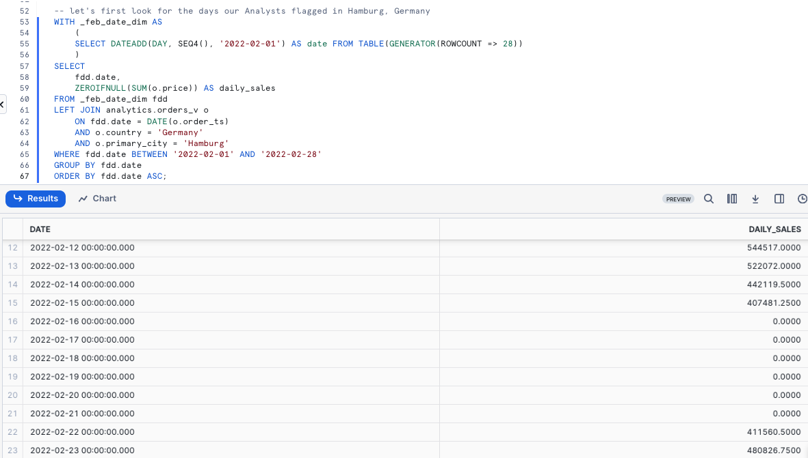
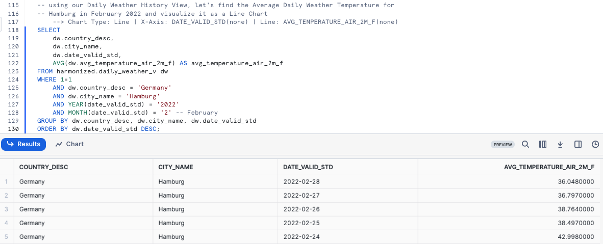
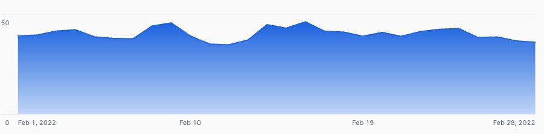
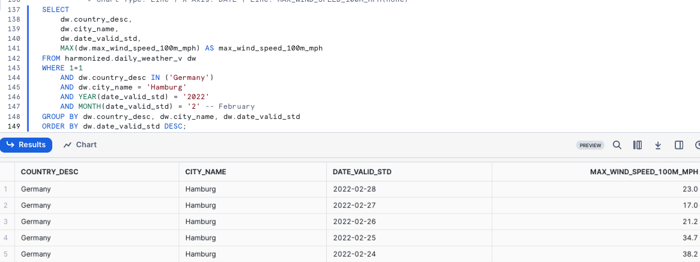
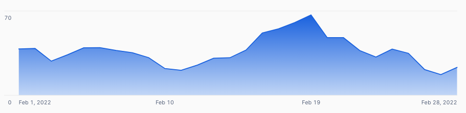
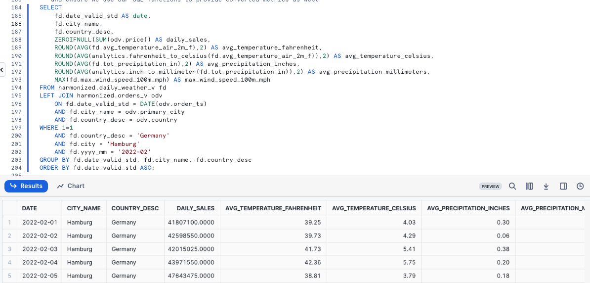
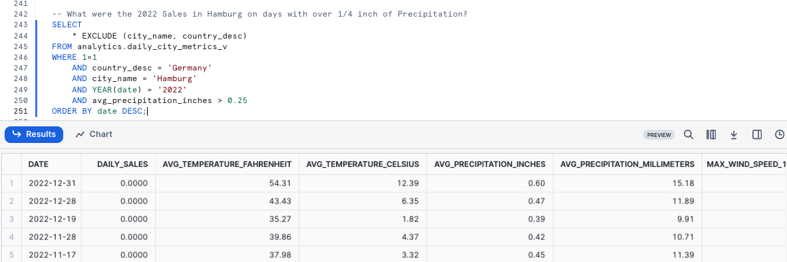
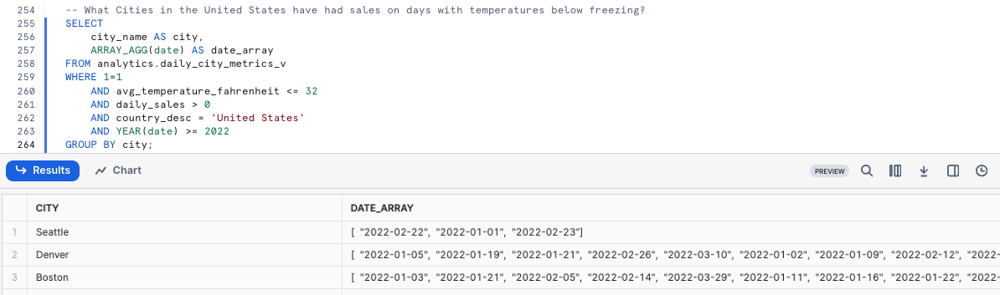

author: Jacob Kranzler
id: tasty-bytes-zero-to-snowflake-collaboration
categories: snowflake-site:taxonomy/solution-center/certification/quickstart, snowflake-site:taxonomy/product/applications-and-collaboration
language: en
summary: Tasty Bytes - Zero to Snowflake - Collaboration Quickstart
environments: web
status: Hidden 
feedback link: https://github.com/Snowflake-Labs/sfguides/issues


# Tasty Bytes - Zero to Snowflake - Collaboration
<!-- ------------------------ -->

## Collaboration in Snowflake


### Overview
Welcome to the Tasty Bytes - Zero to Snowflake Quickstart focused on Collaboration! Within this Quickstart we will highlight how you can enrich your first-party data with weather data via Snowflake Marketplace. Snowflake Marketplace is where you can find, try, and buy third party data and apps, all without having to set up any ETL, data pipelines, or integrations.


### Prerequisites
- Before beginning, please make sure you have completed the [**Introduction to Tasty Bytes Quickstart**](/en/developers/guides/tasty-bytes-introduction/) which provides a walkthrough on setting up a trial account and deploying the Tasty Bytes Foundation required to complete this Quickstart.

### What You Will Learn
- How to Access the Snowflake Marketplace
- How to Acquire Live Weather Source Data in your Account
- How to Create a View
- How to Create a SQL Function
- How to Leverage Snowsight Charts to Explore Visual Insights

### What You Will Build
- The Harmonization of First Party Sales and Third Party Weather Data
- Seamless convertibility from Fahrenheit to Celsius
- Seamless convertibility from Inch to Millimeter
- An Understanding of How to Unlock Additional Insights via the Snowflake Marketplace

## Creating a Worksheet and Copying in our SQL

### Overview
Within this Quickstart we will follow a Tasty Bytes themed story via a Snowsight SQL Worksheet with this page serving as a side by side guide complete with additional commentary, images and documentation links.

This section will walk you through logging into Snowflake, Creating a New Worksheet, Renaming the Worksheet, Copying SQL from GitHub, and Pasting the SQL we will be leveraging within this Quickstart.

### Step 1 - Accessing Snowflake via URL
- Open a browser window and enter the URL of your Snowflake Account 

### Step 2 - Logging into Snowflake
- Log into your Snowflake account.

### Step 3 - Navigating to Worksheets
- Click on the Projects Tab in the left-hand navigation bar and click Worksheets.

### Step 4 - Creating a Worksheet
- Within Worksheets, click the "+" button in the top-right corner of Snowsight.

### Step 5 - Renaming a Worksheet
- Rename the Worksheet by clicking on the auto-generated Timestamp name and inputting "Tasty Bytes - Collaboration"

### Step 6 - Accessing Quickstart SQL in GitHub
- Click the button below which will direct you to our Tasty Bytes SQL file that is hosted on GitHub.

<button>[tb_zts_collaboration.sql](https://github.com/Snowflake-Labs/sf-samples/blob/main/samples/tasty_bytes/FY25_Zero_To_Snowflake/tb_collaboration.sql)</button>

### Step 7 - Copying Setup SQL from GitHub
- Within GitHub navigate to the right side and click "Copy raw contents". This will copy all of the required SQL into your clipboard.
    - 

### Step 8 - Pasting Setup SQL from GitHub into your Snowflake Worksheet
- Path back to Snowsight and your newly created Worksheet and Paste (*CMD + V for Mac or CTRL + V for Windows*) what we just copied from GitHub.

### Step 9 - Click Next -->

## Investigating Days with Zero Sales

### Overview
Tasty Bytes Financial Analysts have let the business know that there are Trucks in the Raw Point of Sales Sytem Data that are missing Sales for various days.
 
We will investigate these missing days and leverage the Snowflake Marketplace to enhance our analysis with Weather and Location data.

We will then dive into one example where Hamburg, Germany Trucks were flagged as having zero sales for a few days in February 2022.


### Step 1 - Querying Point of Sales Data for Trends
Let's start by kicking off this steps three queries to initially set our Role, Warehouse and Database context to `tb_data_engineer`, `tb_de_wh`, `tb_101`. With the context set, we will then query our Analytics `orders_v` View to provide a result set of sales for Hamburg, Germany in 2022.

```
USE ROLE tb_data_engineer;
USE WAREHOUSE tb_de_wh;
USE DATABASE tb_101;

WITH _feb_date_dim AS 
    (
    SELECT DATEADD(DAY, SEQ4(), '2022-02-01') AS date FROM TABLE(GENERATOR(ROWCOUNT => 28))
    )
SELECT
    fdd.date,
    ZEROIFNULL(SUM(o.price)) AS daily_sales
FROM _feb_date_dim fdd
LEFT JOIN analytics.orders_v o
    ON fdd.date = DATE(o.order_ts)
    AND o.country = 'Germany'
    AND o.primary_city = 'Hamburg'
WHERE fdd.date BETWEEN '2022-02-01' AND '2022-02-28'
GROUP BY fdd.date
ORDER BY fdd.date ASC;
```



Based on what we are seeing above, we can agree with our analysts that we do not have daily sales records for a few days in February so our analysts are definitely on to something. Let's see if we can dig further into why this may have happened in our next section.

### Step 2 - Click Next -->

## Acquiring Weather Source Data from the Snowflake Marketplace 

### Overview
From what we saw above, it looks like we are missing sales for February 16th through February 21st for Hamburg. Within our first party data there is not much else we can use to investigate what might have caused this.

However, with live data sets and native applications available in the Snowflake Marketplace we can immediately add Weather Metrics to our analysis and determine if severe weather may have been the root cause.

Within this step, we will retrieve a free, public listing provided by Weather Source, who is a leading provider of global weather and climate data.

### Step 1 - Acquiring the Weather Source LLC: frostbyte Snowflake Marketplace Listing
The Snowflake Marketplace is the premier location to find, try, and buy the data and applications you need to power innovative business solutions. In this step, we will be access the [Weather Source LLC: frostbyte](https://app.snowflake.com/marketplace/listing/GZSOZ1LLEL/weather-source-llc-weather-source-llc-frostbyte) listing to help drive additional analysis on our Hamburg sales slump.

Please follow the steps below to acquire this listing in your Snowflake Account.

- In the bottom left corner, ensure you are operating as ACCOUNTADMIN
- In the left pane, navigate to 'Data Products' (Cloud Icon) and select 'Marketplace'
- In the search bar, enter: 'frostbyte'
- Select the 'Weather Source LLC: frostbyte' listing and click 'Get'
- Adjust Database name to:'TB_WEATHERSOURCE'
- Grant access to: 'PUBLIC'

>aside positive
>Weather Source is a leading provider of global weather and climate data and its OnPoint Product Suite provides businesses with the necessary weather and climate data to quickly generate meaningful and actionable insights for a wide range of use cases across industries.
>

### Step 2 - Harmonizing First and Third Party Data
With the shared `tb_weathersource` database in place, please execute this steps query to create a `harmonized.daily_weather_v` View joining two Weather Source tables to our country table on the Countries and Cities that Tasty Bytes Food Trucks operate within. This query will provide a `View DAILY_WEATHER_V successfully created.` result.

```
CREATE OR REPLACE VIEW harmonized.daily_weather_v
COMMENT = 'Weather Source Daily History filtered to Tasty Bytes supported Cities'
    AS
SELECT
    hd.*,
    TO_VARCHAR(hd.date_valid_std, 'YYYY-MM') AS yyyy_mm,
    pc.city_name AS city,
    c.country AS country_desc
FROM tb_weathersource.onpoint_id.history_day hd
JOIN tb_weathersource.onpoint_id.postal_codes pc
    ON pc.postal_code = hd.postal_code
    AND pc.country = hd.country
JOIN tb_101.raw_pos.country c
    ON c.iso_country = hd.country
    AND c.city = hd.city_name;

```


As we see in the View definition above we are joining two of the `tb_weathersource` Tables within the `onpoint_id` Schema and then Harmonizing it with our `country` Table from our `tb_101` Database and `raw_pos` Schema. 

This is the sort of operation we typically find in the Harmonized layer or what others may describe as the Silver zone.

### Step 3 - Visualizing Daily Temperatures
With the `daily_weather_v` View in our Harmonized Schema in place let's take a look at the Average Daily Weather Temperature for Hamburg in February 2022 by executing our next query.

Along the way we will leverage [AVG](https://docs.snowflake.com/en/sql-reference/functions/avg), [YEAR](https://docs.snowflake.com/en/sql-reference/functions/year) and [MONTH](https://docs.snowflake.com/en/sql-reference/functions/year) functions.

```
SELECT
    dw.country_desc,
    dw.city_name,
    dw.date_valid_std,
    AVG(dw.avg_temperature_air_2m_f) AS avg_temperature_air_2m_f
FROM harmonized.daily_weather_v dw
WHERE 1=1
    AND dw.country_desc = 'Germany'
    AND dw.city_name = 'Hamburg'
    AND YEAR(date_valid_std) = '2022'
    AND MONTH(date_valid_std) = '2' -- February
GROUP BY dw.country_desc, dw.city_name, dw.date_valid_std
ORDER BY dw.date_valid_std DESC;
```



To further investigate trends, let's utilize Snowsight Charting to create a Line Graph of the Average Temperature over time.
- Chart Type: Line
- X-Axis: DATE_VALID_STD(none)
- Line: AVG_TEMPERATURE_AIR_2M_F(none)



Based on what we saw above, there is nothing really standing out yet as the obvious reason for zero sales days at our trucks. Let's see what else we can find that might explain things in the next step.

### Step 4 - Bringing in Wind Data
As we saw in our previous step, it does not look like Average Daily Temperature is the reason for our zero sales days in Hamburg. Thankfully, Weather Source provides other weather metrics we can dive into as well. 

Please now execute the next query where we will leverage our Harmonized View to bring in Wind metrics. In this query we will see the usage of our [MAX](https://docs.snowflake.com/en/sql-reference/functions/min) function.

```
SELECT
    dw.country_desc,
    dw.city_name,
    dw.date_valid_std,
    MAX(dw.max_wind_speed_100m_mph) AS max_wind_speed_100m_mph
FROM harmonized.daily_weather_v dw
WHERE 1=1
    AND dw.country_desc IN ('Germany')
    AND dw.city_name = 'Hamburg'
    AND YEAR(date_valid_std) = '2022'
    AND MONTH(date_valid_std) = '2' -- February
GROUP BY dw.country_desc, dw.city_name, dw.date_valid_std
ORDER BY dw.date_valid_std DESC;
```



Once again this sort of data might better present trends via a quick Snowsight Chart.
- Chart Type: Line
- X-Axis: DATE
- Line: MAX_WIND_SPEED_100M_MPH(none)



**Ah ha!** The wind for those zero sales days was at hurricane levels. This seems to be a better reason for why our trucks were not able to sell anything on those days. However since we ran this analysis in Harmonized let's now begin on our path to make this accessible in Analytics where our analysts can access these insights on their own.

### Step 5 - Click Next -->

## Democratizing First and Third Party Data

### Overview
We have determined that hurricane-level winds were likely the reason for the days with zero sales that our financial analysts brought to our attention.

Let's now make these sort of research available to anyone in our organization by deploying an Analytics view that all Tasty Bytes employees can access.

### Step 1 - Creating SQL Functions
As we are a global company, let's start our process by first creating two SQL functions to convert Fahrenheit to Celsius and Inches to Millimeters. 

Please execute the two queries within this step one by one to create our `fahrenheit_to_celsius` and `inch_to_millimeter` functions which leverage the [CREATE FUNCTION](https://docs.snowflake.com/en/sql-reference/sql/create-function) command and result in `Function _ successfully created.`


```
CREATE OR REPLACE FUNCTION analytics.fahrenheit_to_celsius(temp_f NUMBER(35,4))
RETURNS NUMBER(35,4)
AS
$$
    (temp_f - 32) * (5/9)
$$;
```

```
CREATE OR REPLACE FUNCTION analytics.inch_to_millimeter(inch NUMBER(35,4))
RETURNS NUMBER(35,4)
    AS
$$
    inch * 25.4
$$;
```

>aside positive
>When you create a UDF, you specify a handler whose code is written in one of the supported languages. Depending on the handler’s language, you can either include the handler source code in-line with the CREATE FUNCTION statement or reference the handler’s location from CREATE FUNCTION, where the handler is precompiled or source code on a stage.
>

### Step 2 - Creating the SQL for our View
Before deploying our Analytics view, let's create our SQL we will use in the View to combine Daily Sales and Weather together and also leverage our SQL conversion functions. 

Please execute the next query where we filter for Hamburg, Germany and leverage a few functions we have not seen yet being [ZEROIFNULL](https://docs.snowflake.com/en/sql-reference/functions/zeroifnull), [ROUND](https://docs.snowflake.com/en/sql-reference/functions/round) and [DATE](https://docs.snowflake.com/en/sql-reference/functions/to_date).

```
SELECT
    fd.date_valid_std AS date,
    fd.city_name,
    fd.country_desc,
    ZEROIFNULL(SUM(odv.price)) AS daily_sales,
    ROUND(AVG(fd.avg_temperature_air_2m_f),2) AS avg_temperature_fahrenheit,
    ROUND(AVG(analytics.fahrenheit_to_celsius(fd.avg_temperature_air_2m_f)),2) AS avg_temperature_celsius,
    ROUND(AVG(fd.tot_precipitation_in),2) AS avg_precipitation_inches,
    ROUND(AVG(analytics.inch_to_millimeter(fd.tot_precipitation_in)),2) AS avg_precipitation_millimeters,
    MAX(fd.max_wind_speed_100m_mph) AS max_wind_speed_100m_mph
FROM harmonized.daily_weather_v fd
LEFT JOIN harmonized.orders_v odv
    ON fd.date_valid_std = DATE(odv.order_ts)
    AND fd.city_name = odv.primary_city
    AND fd.country_desc = odv.country
WHERE 1=1
    AND fd.country_desc = 'Germany'
    AND fd.city = 'Hamburg'
    AND fd.yyyy_mm = '2022-02'
GROUP BY fd.date_valid_std, fd.city_name, fd.country_desc
ORDER BY fd.date_valid_std ASC;
```



The results we have just recieved look great. We can now wrap this SQL within a View in our next step.

### Step 3 - Deploying our Analytics View
Using the same query we just explored, we will need to remove the filters in the WHERE clause, add a [COMMENT](https://docs.snowflake.com/en/sql-reference/sql/comment) and promote this to our `analytics` Schema as the `daily_city_metrics_v` View.

Please now kick off the last query of this section to do just this which will result in `View DAILY_CITY_METRICS_V successfully created.`

```
CREATE OR REPLACE VIEW analytics.daily_city_metrics_v
COMMENT = 'Daily Weather Metrics and Orders Data'
    AS
SELECT
    fd.date_valid_std AS date,
    fd.city_name,
    fd.country_desc,
    ZEROIFNULL(SUM(odv.price)) AS daily_sales,
    ROUND(AVG(fd.avg_temperature_air_2m_f),2) AS avg_temperature_fahrenheit,
    ROUND(AVG(tb_101.analytics.fahrenheit_to_celsius(fd.avg_temperature_air_2m_f)),2) AS avg_temperature_celsius,
    ROUND(AVG(fd.tot_precipitation_in),2) AS avg_precipitation_inches,
    ROUND(AVG(tb_101.analytics.inch_to_millimeter(fd.tot_precipitation_in)),2) AS avg_precipitation_millimeters,
    MAX(fd.max_wind_speed_100m_mph) AS max_wind_speed_100m_mph
FROM tb_101.harmonized.daily_weather_v fd
LEFT JOIN tb_101.harmonized.orders_v odv
    ON fd.date_valid_std = DATE(odv.order_ts)
    AND fd.city_name = odv.primary_city
    AND fd.country_desc = odv.country
GROUP BY fd.date_valid_std, fd.city_name, fd.country_desc;
```


Amazing we have now democratized these sort of insights to the Tasty Bytes organization. Let's bring this all together in our next section and validate our work.

### Step 4 - Click Next -->

## Using Harmonized Data to Answer Questions from the Business

### Overview
With Harmonized Sales and Weather Data now available in our Analytics layer, our users can begin to leverage this data to derive insights and ensure we are using data when making decisions.

In this step, we will leverage our work so far to answer a few questions an analyst may receive from the business.

### Step 1 - Answer Questions with Data
Earlier we had to manually join Point of Sales and Weather Source Data to investigate our Hamburg sales issues, but we greatly simplified that process via our `analytics.daily_city_metrics_v` View. 

Let's now run a few questions to answer real questions our analysts are recieving from the business.


#### What were the 2022 Sales in Hamburg on days with over 1/4 inch of Precipitation?

```
SELECT
    * EXCLUDE (city_name, country_desc)
FROM analytics.daily_city_metrics_v
WHERE 1=1
    AND country_desc = 'Germany'
    AND city_name = 'Hamburg'
    AND YEAR(date) = '2022' 
    AND avg_precipitation_inches > 0.25
ORDER BY date DESC;
```




#### What Cities in the United States have had sales on days with temperatures below freezing?

```
SELECT  
    city_name AS city,
    ARRAY_AGG(date) AS date_array
FROM analytics.daily_city_metrics_v
WHERE 1=1
    AND avg_temperature_fahrenheit <= 32
    AND daily_sales > 0
    AND country_desc = 'United States'
    AND YEAR(date) >= 2022
GROUP BY city;
```




**Yay!** If this had been available when our Financial Analysts were initially running their research, they would not have even needed to ping our data teams as the insights are right there. 

By completing this Quickstart we have seen how quickly we are able to derive real world business value by our work and how easy it is to use the Snowflake Marketplace to unlock additional data insights.

### Step 2 - Click Next -->

## Conclusion and Next Steps

### Conclusion
Fantastic work! You have successfully completed the Tasty Bytes - Zero to Snowflake - Collaboration Quickstart. 

By doing so you have now:
- Accessed the Snowflake Marketplace
- Acquired Live Weather Source Data in your Account
- Created a View
- Created a SQL Function
- Leveraged Snowsight Charts to Explore Visual Insights

If you would like to re-run this Quickstart please leverage the Reset scripts in the bottom of your associated Worksheet.

### Next Steps
To continue your journey in the Snowflake AI Data Cloud, please now visit the link below to see all other Powered by Tasty Bytes - Quickstarts available to you.

- ### [Powered by Tasty Bytes - Quickstarts Table of Contents](/en/developers/guides/tasty-bytes-introduction/)


