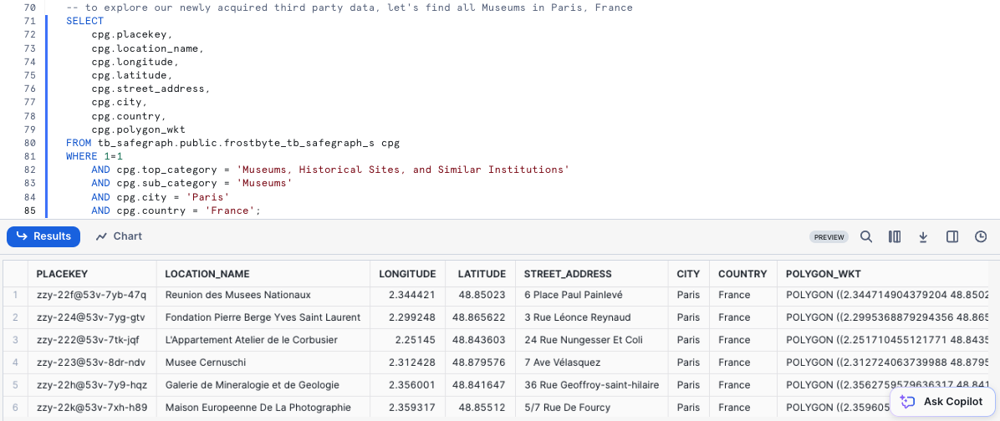
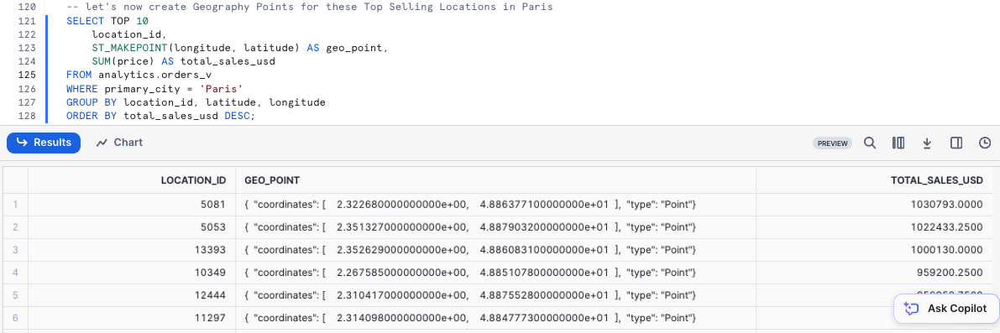
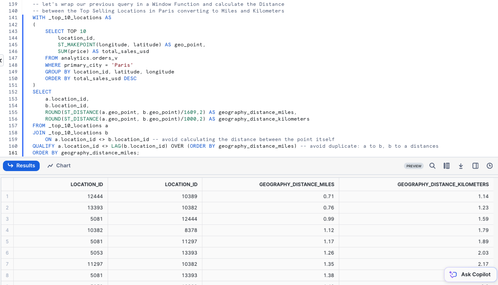
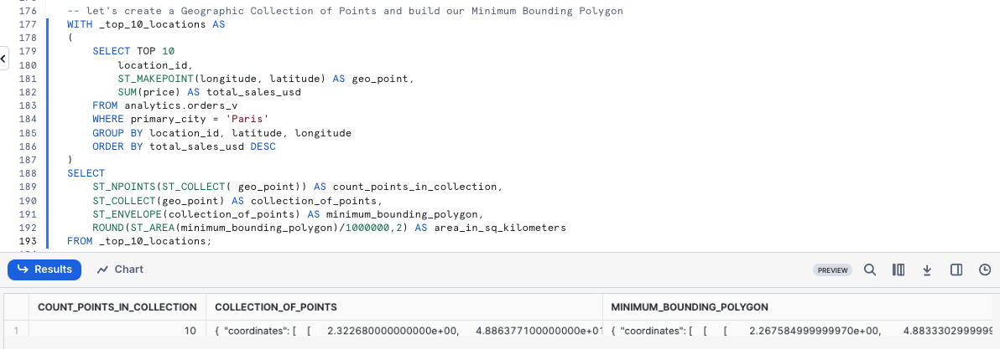
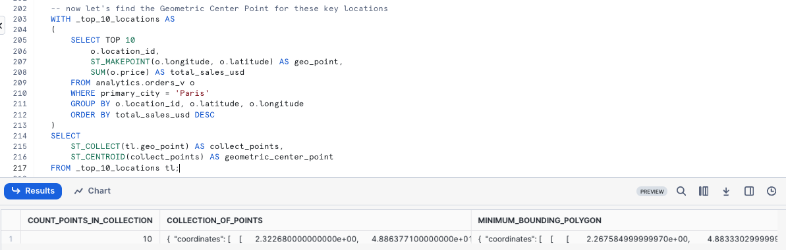
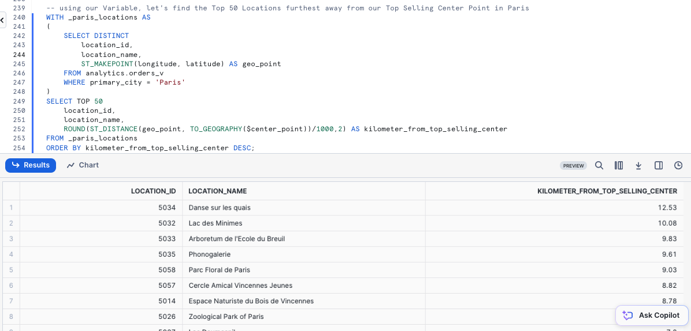
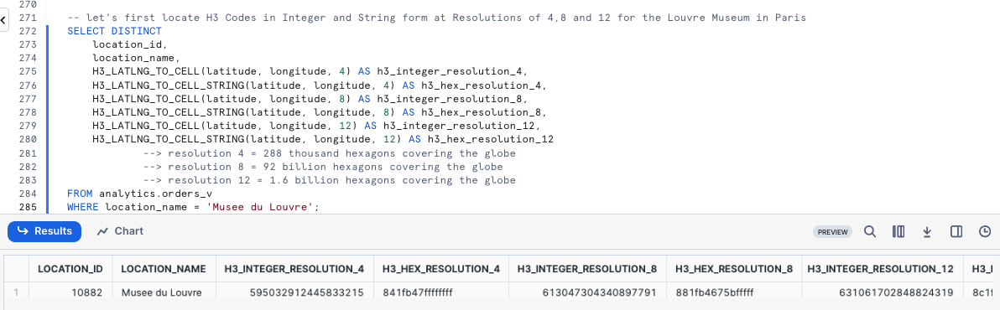
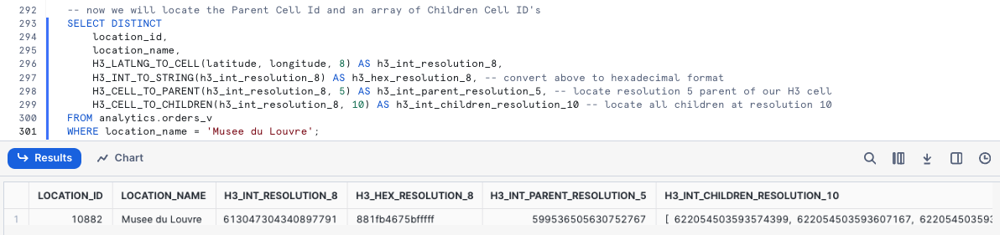
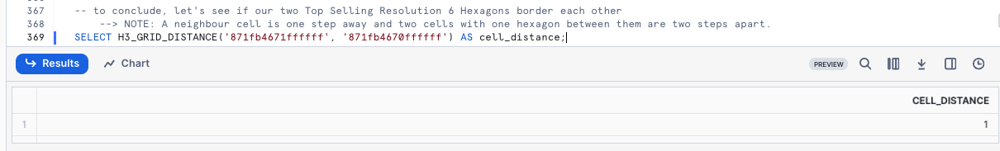

author: Jacob Kranzler
id: tasty-bytes-zero-to-snowflake-geospatial
categories: snowflake-site:taxonomy/solution-center/certification/quickstart, snowflake-site:taxonomy/product/analytics, snowflake-site:taxonomy/snowflake-feature/business-intelligence
language: en
summary: Tasty Bytes - Zero to Snowflake - Geospatial Quickstart
environments: web
status: Hidden 
feedback link: https://github.com/Snowflake-Labs/sfguides/issues

# Tasty Bytes - Zero to Snowflake - Geospatial
<!-- ------------------------ -->

## Geospatial Analysis in Snowflake


###  Overview 
Welcome to the Powered by Tasty Bytes - Zero to Snowflake Quickstart focused on Geospatial Analysis!

Within this Quickstart we will conduct in-depth Geospatial analysis leveraging powerful Snowflake functionality coupled with a SafeGraph POI listing from the Snowflake Marketplace.

### Prerequisites
- Before beginning, please make sure you have completed the [**Introduction to Tasty Bytes Quickstart**](/en/developers/guides/tasty-bytes-introduction/) which provides a walkthrough on setting up a trial account and deploying the Tasty Bytes Foundation required to complete this Quickstart.

### What You Will Learn
- How to Access the Snowflake Marketplace
- How to Acquire SafeGraph POI Data from the Snowflake Marketplace
- How to Create a View
- How to Create a Geography Point
- How to Calculate Distance between Points
- How to Collect Points
- How to Draw a Minimum Bounding Polygon and Calculate its Area
- How to conduct Geospatial Analysis with H3 (Hexagonal Hierarchical Geospatial Indexing System)

### What You Will Build
- An Analytics Ready View Complete with First and Third Party Data
- An Understanding of How to Conduct Geospatial Analysis in Snowflake

## Creating a Worksheet and Copying in our SQL

### Overview
Within this Quickstart we will follow a Tasty Bytes themed story via a Snowsight SQL Worksheet with this page serving as a side by side guide complete with additional commentary, images and documentation links.

This section will walk you through logging into Snowflake, Creating a New Worksheet, Renaming the Worksheet, Copying SQL from GitHub, and Pasting the SQL we will be leveraging within this Quickstart.

#### Step 1 - Accessing Snowflake via URL
- Open a browser window and enter the URL of your Snowflake Account 

### Step 2 - Logging into Snowflake
- Log into your Snowflake account.

### Step 3 - Navigating to Worksheets
- Click on the Projects Tab in the left-hand navigation bar and click Worksheets.

### Step 4 - Creating a Worksheet
- Within Worksheets, click the "+" button in the top-right corner of Snowsight.

### Step 5 - Renaming a Worksheet
- Rename the Worksheet by clicking on the auto-generated Timestamp name and inputting "Tasty Bytes - Geospatial"

### Step 6 - Accessing Quickstart SQL in GitHub
- Click the button below which will direct you to our Tasty Bytes SQL file that is hosted on GitHub.
<button>[tb_zts_geospatial.sql](https://github.com/Snowflake-Labs/sf-samples/blob/main/samples/tasty_bytes/FY25_Zero_To_Snowflake/tb_geospatial.sql)</button>

### Step 7 - Copying Setup SQL from GitHub
- Within GitHub navigate to the right side and click "Copy raw contents". This will copy all of the required SQL into your clipboard.
    - 

### Step 8 - Pasting Setup SQL from GitHub into your Snowflake Worksheet
- Path back to Snowsight and your newly created Worksheet and Paste (*CMD + V for Mac or CTRL + V for Windows*) what we just copied from GitHub.

### Step 9 - Click Next -->


## Acquiring SafeGraph POI Data from the Snowflake Marketplace

### Overview
Tasty Bytes operates Food Trucks in numerous cities and countries across the globe with each truck having the ability to choose two different selling locations per day.

One important item that our Executives are interested in is to learn more about how these locations relate to each other as well as if there are any locations we currently serve that are potentially too far away from hot selling city centers.

Unfortunately what we have seen so far is our first-party data does not give us the building blocks required to complete this sort of Geospatial analysis. Thankfully, the Snowflake Marketplace has great listings from SafeGraph that can assist us here.


### Step 1 - Acquiring SafeGraph POI Data from the Snowflake Marketplace 
To begin, acquire the SafeGraph listing by following the steps below within Snowsight:

- In the bottom left corner, ensure you are operating as ACCOUNTADMIN
- In the left pane, navigate to 'Data Products' (Cloud Icon) and select 'Marketplace'
- In the search bar, enter: 'SafeGraph: frostbyte'
- Select the 'SafeGraph: frostbyte' listing and click 'Get'
- Adjust Database name to:'TB_SAFEGRAPH'
- Grant access to: 'PUBLIC'


>aside positive
>SafeGraph’s Places data provides detailed information about physical places. Our data is fresh, cleaned and provided in a format that empowers the user. With POI data for countries around the world, you can gain insights about any location that a person can visit aside from private residences. 
>

### Step 2 - Evaluating SafeGraph POI Data
Now that we have the `tb_safegraph` database live in our account, let's run the next three queries to set our Worksheet Role, Warehouse and Database context and see what data is available for Paris.

```
USE ROLE sysadmin;
USE WAREHOUSE tb_de_wh;
USE DATABASE tb_101;

SELECT 
    cpg.placekey,
    cpg.location_name,
    cpg.longitude,
    cpg.latitude,
    cpg.street_address,
    cpg.city,
    cpg.country,
    cpg.polygon_wkt
FROM tb_safegraph.public.frostbyte_tb_safegraph_s cpg
WHERE 1=1
    AND cpg.top_category = 'Museums, Historical Sites, and Similar Institutions'
    AND cpg.sub_category = 'Museums'
    AND cpg.city = 'Paris'
    AND cpg.country = 'France';
```



**Amazing!** These sort of POI metrics will be immensely valuable in conducting Geospatial analysis to assist our Executives in making data driven location decisions. 

Let's get this harmonized with our Sales data in the next section.

### Step 3 - Click Next -->

## Harmonizing and Promoting First and Third Party Data

### Overview
To make our Geospatial analysis seamless, let's make sure to get SafeGraph POI data included in the `analytics.orders_v` so all of our downstream users can also access it.

### Step 1 - Enriching our Analytics View
Please execute this steps query which will enrich our `analytics.orders_v` by adding all available, new SafeGraph POI metrics.

Within this [CREATE VIEW](https://docs.snowflake.com/en/sql-reference/sql/create-view) statement, you will see [COMMENT](https://docs.snowflake.com/en/sql-reference/sql/comment), [DATE](https://docs.snowflake.com/en/sql-reference/functions/to_date) and [SELECT * EXCLUDE ..](https://docs.snowflake.com/en/sql-reference/sql/select#parameters) functionality leveraged. 

To highlight what our EXCLUDE is doing we are using it to simplify the SQL required to SELECT all of the available SafeGraph columns but not the ones we already have available in the `harmonized.orders_v`.

This query will provide a `View ORDERS_V successfully created.` result.

```
CREATE OR REPLACE VIEW analytics.orders_v
COMMENT = 'Tasty Bytes Order Detail View'
    AS
SELECT 
    DATE(o.order_ts) AS date,
    o.* ,
    cpg.* EXCLUDE (location_id, region, phone_number, country)
FROM tb_101.harmonized.orders_v o
JOIN tb_safegraph.public.frostbyte_tb_safegraph_s cpg
    ON o.location_id = cpg.location_id;
```


>aside negative
> **Note:** For demonstration purposes the SafeGraph listing already has the Tasty Bytes *location_id's* included within. In a real-world scenario the mapping would leverage public [Placekeys](https://www.placekey.io/) which [SafeGraph is a founding partner of](https://www.safegraph.com/blogs/safegraph-joins-placekey-initiative-as-a-founding-partner).
>

### Step 2 - Click Next -->

## Creating Geograpy Points from Latitude and Longitude

### Overview
With Point of Interest metrics now readily available from the Snowflake Marketplace without any ETL required, let's start on our Geospatial analysis journey.

### Step 1 - Creating a Geography Point
Latitude and Longitude are two building block POI metrics we now have access to thanks to SafeGraph. 

Please execute the next two queries to re-assume to `tb_data_engineer` role and create our Geography Point leveraging the [ST_MAKEPOINT/ST_POINT](https://docs.snowflake.com/en/sql-reference/functions/st_makepoint) function.

>aside positive
> **ST_MAKEPOINT/ST_POINT:** Constructs a GEOGRAPHY object that represents a point with the specified longitude and latitude.
>

```
USE ROLE tb_data_engineer;

SELECT TOP 10
    location_id,
    ST_MAKEPOINT(longitude, latitude) AS geo_point,
    SUM(price) AS total_sales_usd
FROM analytics.orders_v
WHERE primary_city = 'Paris'
GROUP BY location_id, latitude, longitude
ORDER BY total_sales_usd DESC;
```



The results we see in the geo_point column will be essential for everything else we do moving forward.

One thing to note here is despite typically hearing Latitude then Longitude this function requires these values to be input in the Longitude, Latitude order.

### Step 2 - Click Next -->

## Calculating Straight Line Distance between Points

### Overview
Starting with our Geographic Point, we can now begin to dive into some of the powerful Geospatial functions Snowflake offers natively. 

### Step 1 - ST_DISTANCE

Let's first start with calculating the distances in Miles and Kilometers between those top selling locations we generated previously by executing our next query which leverages the [ST_DISTANCE](https://docs.snowflake.com/en/sql-reference/functions/st_distance) function.

>aside positive
>**ST_DISTANCE:** Returns the minimum geodesic distance between two GEOGRAPHY or the minimum Euclidean distance between two GEOMETRY objects.
>

Within this query we also leverage a [Common Table Expression or CTE](https://docs.snowflake.com/en/user-guide/queries-cte), [QUALIFY](https://docs.snowflake.com/en/sql-reference/constructs/qualify) and [LAG](https://docs.snowflake.com/en/sql-reference/functions/lag).

```
WITH _top_10_locations AS
(
    SELECT TOP 10
        location_id,
        ST_MAKEPOINT(longitude, latitude) AS geo_point,
        SUM(price) AS total_sales_usd
    FROM analytics.orders_v
    WHERE primary_city = 'Paris'
    GROUP BY location_id, latitude, longitude
    ORDER BY total_sales_usd DESC
)
SELECT
    a.location_id,
    b.location_id,
    ROUND(ST_DISTANCE(a.geo_point, b.geo_point)/1609,2) AS geography_distance_miles,
    ROUND(ST_DISTANCE(a.geo_point, b.geo_point)/1000,2) AS geography_distance_kilometers
FROM _top_10_locations a
JOIN _top_10_locations b
    ON a.location_id <> b.location_id -- avoid calculating the distance between the point itself
QUALIFY a.location_id <> LAG(b.location_id) OVER (ORDER BY geography_distance_miles) -- avoid duplicate: a to b, b to a distances
ORDER BY geography_distance_miles;
```



**Wow!** Look at how far we have already came in so little time. Let's keep diving deeper into what Geospatial insights we can derive in our next section.

### Step 2 - Click Next -->

## Collecting Coordinates, Creating a Bounding Polygon & Finding its Center Point

### Overview
Now that we understand how to create points, and calculate distance, we will now pile on a large set additional Snowflake Geospatial functionality to further our analysis.

### Step 1 - Create a Geographic Collection of Points and build our Minimum Bounding Polygon
Please execute the next query which will take the building blocks from the previous section and now collect all of our Geography Points and build a Minimum Bounding Polygon from them.

Within this query we will see the usage of [ST_NPOINTS](https://docs.snowflake.com/en/sql-reference/functions/st_npoints), [ST_COLLECT](https://docs.snowflake.com/en/sql-reference/functions/st_collect), [ST_ENVELOPE](https://docs.snowflake.com/en/sql-reference/functions/st_envelope) and [ST_AREA](https://docs.snowflake.com/en/sql-reference/functions/st_area).

>aside positive
>**ST_NPOINTS/ST_NUMPOINTS:** Returns the number of points in a GEOGRAPHY or GEOGRAPHY object.
>
>**ST_COLLECT:** This function combines all the GEOGRAPHY objects in a column into one GEOGRAPHY object.
>
>**ST_ENVELOPE:** Returns the minimum bounding box (a rectangular “envelope”) that encloses a specified GEOMETRY object.
>
>**ST_AREA:** Returns the area of the Polygon(s) in a GEOGRAPHY or GEOMETRY object.
>

```
WITH _top_10_locations AS
(
    SELECT TOP 10
        location_id,
        ST_MAKEPOINT(longitude, latitude) AS geo_point,
        SUM(price) AS total_sales_usd
    FROM analytics.orders_v
    WHERE primary_city = 'Paris'
    GROUP BY location_id, latitude, longitude
    ORDER BY total_sales_usd DESC
)
SELECT
    ST_NPOINTS(ST_COLLECT( geo_point)) AS count_points_in_collection,
    ST_COLLECT(geo_point) AS collection_of_points,
    ST_ENVELOPE(collection_of_points) AS minimum_bounding_polygon,
    ROUND(ST_AREA(minimum_bounding_polygon)/1000000,2) AS area_in_sq_kilometers
FROM _top_10_locations;
```



Look at how much we accomplished within a single SQL query, but we can't stop yet, let's keep going to see what else we can accomplish.

### Step 2 - Finding our Top Selling Locations Center Point
Now that we have collected geographic information about where our Trucks sell the most in Paris.  Please execute the next query which will utilize [ST_CENTROID](https://docs.snowflake.com/en/sql-reference/functions/st_centroid) to find the top selling center point.

>aside positive
>**ST_CENTROID:** Returns the Point representing the geometric center of a GEOGRAPHY or GEOMETRY object.
>

```
WITH _top_10_locations AS
(
    SELECT TOP 10
        o.location_id,
        ST_MAKEPOINT(o.longitude, o.latitude) AS geo_point,
        SUM(o.price) AS total_sales_usd
    FROM analytics.orders_v o
    WHERE primary_city = 'Paris'
    GROUP BY o.location_id, o.latitude, o.longitude
    ORDER BY total_sales_usd DESC
)
SELECT
    ST_COLLECT(tl.geo_point) AS collect_points,
    ST_CENTROID(collect_points) AS geometric_center_point
FROM _top_10_locations tl;
```




### Step 3 - Storing our Center Point in a Variable
So we can use this Center Point of our Top Selling locations in a future query, please execute the query below to SET our center_point variable equal to our `geometric_center_point` result from above.

``
SET center_point = '{   "coordinates": [     2.323399542234561e+00,     4.885933767767676e+01   ],   "type": "Point" }';
``

Once pasted in, please execute the query which will yield a `Statement executed succesfully.` message. Now we can use this `center_point` Variable to help conclude our Geospatial analysis.


### Step 4 - Click Next -->

## Finding Locations Furthest Away from our Top Selling Center Point

### Overview
As mentioned earlier, our Tasty Bytes Executives are interested in seeing what locations we may want to stop having our Food Trucks visit in their weekly schedules. Thankfully, every step we have taken so far has now enabled us to deliver on this exact request.

### Step 1 - Top 50 Locations furthest away from our Top Selling Center Point in Paris
Executing the next query we can identify which Paris locations we may want to take off our schedules. Within the query we will see a new function we haven't used yet, [TO_GEOGRAPHY](https://docs.snowflake.com/en/sql-reference/functions/to_geography).

```
WITH _paris_locations AS
(
    SELECT DISTINCT
        location_id,
        location_name,
        ST_MAKEPOINT(longitude, latitude) AS geo_point
    FROM analytics.orders_v
    WHERE primary_city = 'Paris'
)
SELECT TOP 50
    location_id,
    location_name,
    ROUND(ST_DISTANCE(geo_point, TO_GEOGRAPHY($center_point))/1000,2) AS kilometer_from_top_selling_center
FROM _paris_locations
ORDER BY kilometer_from_top_selling_center DESC;
```



Fantastic work! We have now delivered on the exact as from our Executive Team through a simple process by leveraging SafeGraph from the Snowflake Marketplace.

### Step 2 - Click Next -->

## Geospatial Analysis with H3 (Hexagonal Hierarchical Geospatial Indexing System)

### Overview
H3 is a way of dividing the Earth's surface into hexagonal shapes, organizing them into levels of resolution, and assigning unique codes to each hexagon for easy reference. 
 
This system was created by Uber for tasks like mapping, location-based services, and market
analysis. A lower resolution corresponds to larger hexagons covering broader areas, while a higher resolution means smaller hexagons representing more specific locations.

As Snowflake offers H3 functionality, the Tasty Bytes Leadership Team has tasked our Data Engineer with generating H3 Codes and finding the Top Selling Hexagons.


### Step 1 - Locate H3 Codes in Integer and String form
The next query will locate H3 Codes for the [Louvre](https://en.wikipedia.org/wiki/Louvre) in both Integer and String form at varying resolutions usings the [H3_LATLNG_TO_CELL](https://docs.snowflake.com/en/sql-reference/functions/h3_latlng_to_cell) and [H3_LATLNG_TO_CELL_STRING](https://docs.snowflake.com/en/sql-reference/functions/h3_latlng_to_cell_string) functions.

```
SELECT DISTINCT
    location_id,
    location_name,
    H3_LATLNG_TO_CELL(latitude, longitude, 4) AS h3_integer_resolution_4, 
    H3_LATLNG_TO_CELL_STRING(latitude, longitude, 4) AS h3_hex_resolution_4,
    H3_LATLNG_TO_CELL(latitude, longitude, 8) AS h3_integer_resolution_8, 
    H3_LATLNG_TO_CELL_STRING(latitude, longitude, 8) AS h3_hex_resolution_8,
    H3_LATLNG_TO_CELL(latitude, longitude, 12) AS h3_integer_resolution_12,
    H3_LATLNG_TO_CELL_STRING(latitude, longitude, 12) AS h3_hex_resolution_12
FROM analytics.orders_v
WHERE location_name = 'Musee du Louvre';
```



>aside positive
> **Resolution 4** = 288 thousand hexagons covering the globe
> **Resolution 8** = 92 billion hexagons covering the globe
> **Resolution 12** = 1.6 billion hexagons covering the globe
>  - For more detail on Resolutions please visit: [H3 Geo: Tables of Cell Statistics Across Resolutions](https://h3geo.org/docs/core-library/restable/)

### Step 2 - Parent and Children Cell ID's
Execute the next query to locate the Parent Cell Id and an array containing all of the associated Children Id's for the Louvre by leveraging [H3_CELL_TO_PARENT](https://docs.snowflake.com/en/sql-reference/functions/h3_cell_to_parent), [H3_INT_TO_STRING](https://docs.snowflake.com/en/sql-reference/functions/h3_int_to_string) and [H3_CELL_TO_CHILDREN](https://docs.snowflake.com/en/sql-reference/functions/h3_cell_to_children).

```
SELECT DISTINCT
    location_id,
    location_name,
    H3_LATLNG_TO_CELL(latitude, longitude, 8) AS h3_int_resolution_8,
    H3_INT_TO_STRING(h3_int_resolution_8) AS h3_hex_resolution_8, -- convert above to hexadecimal format
    H3_CELL_TO_PARENT(h3_int_resolution_8, 5) AS h3_int_parent_resolution_5, -- locate resolution 5 parent of our H3 cell
    H3_CELL_TO_CHILDREN(h3_int_resolution_8, 10) AS h3_int_children_resolution_10 -- locate all children at resolution 10
FROM analytics.orders_v
WHERE location_name = 'Musee du Louvre';
```




### Step 3 - Locations within Top Selling Hexagons
Using the H3 Cell IDs from the previous step, let's now produce a list of all locations within these Top Hexagons and the Hexagons Total Sales.

These results will help the business locate areas and locations that we should ensure are always occupied by our trucks.

```
WITH _top_50_locations AS
(
    SELECT TOP 50
        location_id,
        ARRAY_SIZE(ARRAY_UNIQUE_AGG(customer_id)) AS customer_loyalty_visitor_count,
        H3_LATLNG_TO_CELL(latitude, longitude, 7) AS h3_integer_resolution_6,
        H3_LATLNG_TO_CELL_STRING(latitude, longitude, 7) AS h3_hex_resolution_6,
        SUM(price) AS total_sales_usd
    FROM analytics.orders_v
    WHERE primary_city = 'Paris'
    GROUP BY ALL
    ORDER BY total_sales_usd DESC
)
SELECT
    h3_hex_resolution_6,
    COUNT(DISTINCT location_id) AS number_of_top_50_locations,
    SUM(customer_loyalty_visitor_count) AS customer_loyalty_visitor_count,
    SUM(total_sales_usd) AS total_sales_usd
FROM _top_50_locations
GROUP BY ALL
ORDER BY total_sales_usd DESC;
```

### Step 4 - H3_GRID_DISTANCE
To conclude, in the next query we will see if our two Top Selling Resolution 6 Hexagons border each other using H3_GRID_DISTANCE(https://docs.snowflake.com/en/sql-reference/functions/h3_grid_distance).

>aside positive
> A neighbor cell is one step away and two cells with one hexagon between them are two steps apart.
>


```
SELECT H3_GRID_DISTANCE('871fb4671ffffff', '871fb4670ffffff') AS cell_distance;
```



### Step 5 - Click Next -->

## Conclusion and Next Steps

### Conclusion
**Fantastic work!** You have successfully completed the Tasty Bytes - Zero to Snowflake - Geospatial Quickstart. 

By doing so you have now:
- Accessed the Snowflake Marketplace
- Acquired SafeGraph POI Data from the Snowflake Marketplace
- Created a View
- Created a Geography Point
- Calculated Distance between Points
- Collected Points
- Drew a Minimum Bounding Polygon and Calculated its Area
- Conducted Geospatial Analysis with H3 (Hexagonal Hierarchical Geospatial Indexing System)

If you would like to re-run this Quickstart please leverage the Reset scripts in the bottom of your associated Worksheet.

### Next Steps
To continue your journey in the Snowflake AI Data Cloud, please now visit the link below to see all other Powered by Tasty Bytes - Quickstarts available to you.

- ### [Powered by Tasty Bytes - Quickstarts Table of Contents](/en/developers/guides/tasty-bytes-introduction/)


