author: Jacob Kranzler
id: tasty-bytes-zero-to-snowflake-governance-with-horizon
categories: snowflake-site:taxonomy/solution-center/certification/quickstart, snowflake-site:taxonomy/product/data-engineering
language: en
summary: Tasty Bytes - Zero to Snowflake - Governance with Snowflake Horizon Quickstart
environments: web
status: Hidden 
feedback link: https://github.com/Snowflake-Labs/sfguides/issues


# Tasty Bytes - Zero to Snowflake - Governance with Snowflake Horizon
<!-- ------------------------ -->

## Governance in Snowflake 


### Overview
Welcome to the Powered by Tasty Bytes - Zero to Snowflake Quickstart focused on Data Governance! 

Within this Quickstart we will learn about Snowflake Roles, Role Based Access Control and deploy both Column and Row Level Security that can scale with your business.

### Prerequisites
- Before beginning, please make sure you have completed the [**Introduction to Tasty Bytes Quickstart**](/en/developers/guides/tasty-bytes-introduction/) which provides a walkthrough on setting up a trial account and deploying the Tasty Bytes Foundation required to complete this Quickstart.
- Please note that features leveraged within this Quickstart will require an Enterprise or Business Critical Snowflake account. Please see our documentation an [**Overview of Snowflake Editions**](https://docs.snowflake.com/en/user-guide/intro-editions#overview-of-editions).


### What You Will Learn
- What System Defined Roles Exist in Snowflake Accounts
- How to Create a Role
- How to Grant Privileges to a Role
- How to Create a Tag
- How to Create a Masking Policy
- How to Deploy a Tag Based Masking Policy
- How to Create a Row Access Policy using a Mapping Table
- How to Create an Aggregation Policy
- How to Create a Project Policy
- How to Leverage Automatic and Custom Data Classification
- How to use Universal Search

### What You Will Build
- Complete Role Based Access Control for a Test Role
- A Robust Data Governance Foundation for your Account

## Creating a Worksheet and Copying in our SQL

### Overview
Within this Quickstart we will follow a Tasty Bytes themed story via a Snowsight SQL Worksheet with this page serving as a side by side guide complete with additional commentary, images and documentation links.

This section will walk you through logging into Snowflake, Creating a New Worksheet, Renaming the Worksheet, Copying SQL from GitHub, and Pasting the SQL we will be leveraging within this Quickstart.

### Step 1 - Accessing Snowflake via URL
- Open a browser window and enter the URL of your Snowflake Account 

### Step 2 - Logging into Snowflake
- Log into your Snowflake account.

### Step 3 - Navigating to Worksheets
- Click on the Projects Tab in the left-hand navigation bar and click Worksheets.

### Step 4 - Creating a Worksheet
- Within Worksheets, click the "+" button in the top-right corner of Snowsight.

### Step 5 - Renaming a Worksheet
- Rename the Worksheet by clicking on the auto-generated Timestamp name and inputting "Tasty Bytes - Governance"

### Step 6 - Accessing Quickstart SQL in GitHub
- Click the button below which will direct you to our Tasty Bytes SQL file that is hosted on GitHub.
<button>[tb_zts_data_governance.sql](https://github.com/Snowflake-Labs/sf-samples/blob/main/samples/tasty_bytes/FY25_Zero_To_Snowflake/tb_governance_snowflake_horizon.sql)</button>

### Step 7 - Copying Setup SQL from GitHub
- Within GitHub navigate to the right side and click "Copy raw contents". This will copy all of the required SQL into your clipboard.
    - 

### Step 8 - Pasting Setup SQL from GitHub into your Snowflake Worksheet
- Path back to Snowsight and your newly created Worksheet and Paste (*CMD + V for Mac or CTRL + V for Windows*) what we just copied from GitHub.

### Step 9 - Click Next -->

## Exploring Available Roles

### Overview
Our Tasty Bytes Administrator has been tasked with learning the process of deploying Role Based Access Control (RBAC) and proper Governance across our Snowflake Account. 

To begin, let's first dive into the Snowflake System Defined Roles provided by default in all accounts and learn a bit more on their privileges.

### Step 1 - Setting our Context
Before we can begin executing queries within the Snowflake Snowsight interface we must first set our context by running [USE ROLE](https://docs.snowflake.com/en/sql-reference/sql/use-role) and [USE WAREHOUSE](https://docs.snowflake.com/en/sql-reference/sql/use-warehouse) commands or manually setting these in the top-right corner.

For this step, we will do this by executing our first two queries by highlighting them both and clicking the "▶ Run" button. 

Once complete our results pane will result in a `Statement Executed Successfully` message.

```
USE ROLE accountadmin;
USE WAREHOUSE tb_dev_wh;
```

With our context set, we can continue on our learning journey.

### Step 2 - Exploring All Roles in our Account
Now let's run the next query which leverages [SHOW ROLES](https://docs.snowflake.com/en/sql-reference/sql/show-roles) to provide a result set consisting of all roles currently deployed in our account.

```
SHOW ROLES;
```


If you are operating in a trial account with only Tasty Bytes deployed you will only see a few `tb_` roles, however if you are using an existing Snowflake account your list may be more extensive. 

Thankfully we can filter down this result set which we will cover in the next step.

###  Step 3 - Using Result Scan to Filter our Result
To filter on just the Snowflake System Defined Roles from our previous output please execute the next query which utilizes [RESULT_SCAN](https://docs.snowflake.com/en/sql-reference/functions/result_scan) and [LAST_QUERY_ID](https://docs.snowflake.com/en/sql-reference/functions/last_query_id) to query our previous SHOW ROLES results as if they were a table giving us the ability to add a WHERE clause.

```
SELECT 
    "name",
    "comment"
FROM TABLE(RESULT_SCAN(LAST_QUERY_ID()))
WHERE "name" IN ('ORGADMIN','ACCOUNTADMIN','SYSADMIN','USERADMIN','SECURITYADMIN','PUBLIC');
```

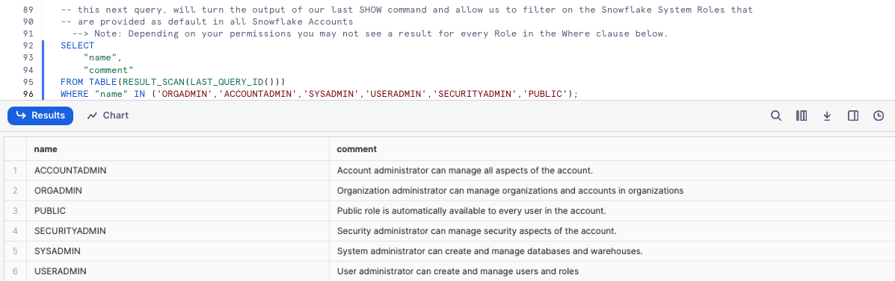


In our result set we can see the high-level descriptions of what these Snowflake System Defined Roles have privileges to do. 

>aside positive
>**Note:** For additional details on these, please the [Snowflake System Defined Roles](https://docs.snowflake.com/en/user-guide/security-access-control-overview#system-defined-roles) documentation.
>

## Creating a Role and Granting Privileges

### Overview
Now that we understand these System Defined roles, let's begin leveraging them to create a test role and grant it access to the Customer Loyalty data we will deploy our initial Data Governance features against and also providing the ability to use our `tb_dev_wh` Warehouse.

### Step 1 - Using the Useradmin Role to Create our Test Role
As we saw, a `useradmin` can create and manage users and roles. Please kick off the next two queries with the first assuming that `useradmin` role and the second leveraging a [CREATE ROLE](https://docs.snowflake.com/en/sql-reference/sql/create-role) command to generate a new `tb_test_role` we will use throughout this Quickstart. This will result in a `Role TB_TEST_ROLE successfully created.` message.

```
USE ROLE useradmin;

CREATE OR REPLACE ROLE tb_test_role
    COMMENT = 'test role for tasty bytes';
```


### Step 2 - Using the Securityadmin Role to Grant Warehouse Privileges
With our `tb_test_role` in place, we can now begin to use [GRANT](https://docs.snowflake.com/en/sql-reference/sql/grant-privilege) statements to give access privileges to required Database objects and our `tb_dev_wh` Warehouse.

To begin, please run the next three queries which will first assume the `securityadmin` role that we learned can manage security aspects in our account, next we will grant ALL privileges on this Warehouse to our `sysadmin`  and finally grant OPERATE and USAGE on our `tb_dev_wh` to our `tb_test_role`. 

When completed we will recieve a `Statement executed successfully.` message.

```
USE ROLE securityadmin;

GRANT ALL ON WAREHOUSE tb_dev_wh TO ROLE sysadmin;

GRANT OPERATE, USAGE ON WAREHOUSE tb_dev_wh TO ROLE tb_test_role;
```

For more on Snowflake Warehouse Privilege Grants please see below:
>aside positive
>**MODIFY:** Enables altering any properties of a warehouse, including changing its size.
> 
>**MONITOR:** Enables viewing current and past queries executed on a warehouse as well as usage statistics on that warehouse.
>
>**OPERATE:** Enables changing the state of a warehouse (stop, start, suspend, resume). In addition, enables viewing current and past queries executed on a warehouse and aborting any executing queries.
>
>**USAGE:** Enables using a virtual warehouse and, as a result, executing queries on the warehouse. If the warehouse is configured to auto-resume when a SQL statement is submitted to it, the warehouse resumes automatically and executes the statement.
>
>**ALL:** Grants all privileges, except OWNERSHIP, on the warehouse.
>

### Step 3 - Using the Securityadmin Role to Grant Database and Schema Privileges
With the Warehouse privileges in place, please execute the next two queries which will provide the `tb_test_role` with the USAGE privilege on the `tb_101` database and all schemas within.

Once again when completed we will recieve a `Statement executed successfully. X objects affected.` message.

```
GRANT USAGE ON DATABASE tb_101 TO ROLE tb_test_role;
GRANT USAGE ON ALL SCHEMAS IN DATABASE tb_101 TO ROLE tb_test_role;
```

For more on Snowflake Database and Schema Grants please see below:
>aside positive
> **MODIFY:** Enables altering any settings of a database.
>
> **MONITOR:** Enables performing the DESCRIBE command on the database.
>
> **USAGE:** Enables using a database, including returning the database details in the SHOW DATABASES command output. Additional privileges are required to view or take actions on objects in a database.
> 
> **ALL:** Grants all privileges, except OWNERSHIP, on a database.
>

### Step 4 - Using the Securityadmin Role to Grant Table and View Privileges
As we will be testing several Data Governance features as our `tb_test_role` let's ensure it can run SELECT statements across our entire Data Model. 

Please now execute the next three queries of this section which will once again result in a `Statement executed successfully. X objects affected.` message.

```
GRANT SELECT ON ALL TABLES IN SCHEMA tb_101.raw_customer TO ROLE tb_test_role;
GRANT SELECT ON ALL TABLES IN SCHEMA tb_101.raw_pos TO ROLE tb_test_role;
GRANT SELECT ON ALL VIEWS IN SCHEMA tb_101.analytics TO ROLE tb_test_role;
```

For more on Snowflake View and Table Privilege Grants please see below:
> aside positive
> **SELECT:** Enables executing a SELECT statement on a table/view. Note that this privilege is sufficient to query a view.
>
> **INSERT:** Enables executing an INSERT command on a table.
>
> **UPDATE:** Enables executing an UPDATE command on a table.
>
> **TRUNCATE:** Enables executing a TRUNCATE TABLE command on a table.
>
> **DELETE:** Enables executing a DELETE command on a table.
>

### Step 5 - Using the Securityadmin Role to Grant our Role to our User
With our `tb_test_role` properly privileged, let's now execute the last two queries of this section. Here we will first [SET](https://docs.snowflake.com/en/sql-reference/sql/set) a SQL Variable called `my_user_var` equal to our [CURRENT_USER](https://docs.snowflake.com/en/sql-reference/functions/current_user). 

The second query will then grant our role to our user we are logged in as which has been stored in our `$my_user_var`. 

As we've seen before, our query will result in a `Statement executed successfully` message.

```
SET my_user_var  = CURRENT_USER();
GRANT ROLE tb_test_role TO USER identifier($my_user_var);
```

**Awesome!** We now have a `tb_test_role` with required Database Object and Warehouse privileges and our user is able to leverage it.

### Step 6 - Click Next -->


## Column-Level Security and Tagging = Tag-Based Masking

### Overview
The first Governance feature set we want to deploy and test will be Snowflake Tag Based Dynamic Data Masking. This will allow us to mask PII data in columns from our Test Role but not from more privileged Roles.

Before we can begin masking data, let's first explore what PII exists in our Customer Loyalty data.

### Step 1 - Finding our PII Columns
Thanks to our last step, we can now officially use our `tb_test_role` Role and leverage the `tb_dev_wh` Warehouse from that role. 

Please execute the next four queries which will first handle setting our context. With the context in place the fourth query will explore our `raw_customer.customer_loyalty` which we ingest from the Tasty Bytes Customer Loyalty Program provider.

```
USE ROLE tb_test_role;
USE WAREHOUSE tb_dev_wh;
USE DATABASE tb_101;

SELECT
    cl.customer_id,
    cl.first_name,
    cl.last_name,
    cl.e_mail,
    cl.phone_number,
    cl.city,
    cl.country,
    cl.sign_up_date,
    cl.birthday_date
FROM raw_customer.customer_loyalty cl 
SAMPLE (1000 ROWS);
```

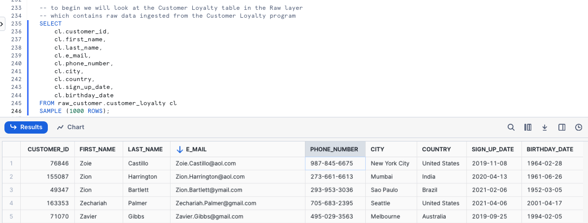

**Woah!!** there is a lot of PII we need to take care before our users can touch this data. Luckily we can use Snowflakes native Tag-Based Masking functionality to do just this.

> aside positive
> A [Tag-based Masking Policy](https://docs.snowflake.com/en/user-guide/tag-based-masking-policies) combines the object tagging and masking policy features to allow a masking policy to be set on a tag using an ALTER TAG command. When the data type in the masking policy signature and the data type of the column match, the tagged column is automatically protected by the conditions in the masking policy.
>

### Step 2 - Creating our Schemas
To keep ourselves organized and to follow best practices, let's now create and privilege `Tags` and `Governance` schemas within our Database by executing the next five queries.


```
USE ROLE accountadmin;

CREATE OR REPLACE SCHEMA tags
    COMMENT = 'Schema containing Object Tags';

GRANT USAGE ON SCHEMA tags TO ROLE public;

CREATE OR REPLACE SCHEMA governance
    COMMENT = 'Schema containing Security Policies';

GRANT ALL ON SCHEMA governance TO ROLE sysadmin;
```


### Step 3 - Creating our Tag
To begin our masking process, please run the [CREATE TAG](https://docs.snowflake.com/en/sql-reference/sql/create-tag) query below. 

Within this query we are creating a `tasty_pii` Tag for these values: NAME, PHONE_NUMBER, EMAIL, BIRTHDAY. Not only will this tag prevent free text values, but it will also add the Tag to the selection menu to Snowsight. This will result in a `Tag TASTY_PII successfully created.` result.

```
CREATE OR REPLACE TAG tags.tasty_pii
    ALLOWED_VALUES 'NAME', 'PHONE_NUMBER', 'EMAIL', 'BIRTHDAY'
    COMMENT = 'Tag for PII, allowed values are: NAME, PHONE_NUMBER, EMAIL, BIRTHDAY';
```

>aside positive
>Tags enable data stewards to track sensitive data for compliance, discovery, protection, and resource usage use cases through either a centralized or decentralized data governance management approach.
>

### Step 4 - Applying Tags
With the Tag in place, let's now execute the next query which uses [ALTER TABLE... MODIFY COLUMN](https://docs.snowflake.com/en/sql-reference/sql/alter-table-column) to set our tag to each respective column in the `customer_loyalty` table. This will result in a `Statement executed successfully.` message.

```
ALTER TABLE raw_customer.customer_loyalty
    MODIFY COLUMN 
    first_name SET TAG tags.tasty_pii = 'NAME',
    last_name SET TAG tags.tasty_pii = 'NAME',
    phone_number SET TAG tags.tasty_pii = 'PHONE_NUMBER',
    e_mail SET TAG tags.tasty_pii = 'EMAIL',
    birthday_date SET TAG tags.tasty_pii = 'BIRTHDAY';
```

### Step 5 - Exploring Tags on a Table
With our Tag created and applied to Columns, please kick off the next query where we leverage the [TAG_REFERENCES_ALL_COLUMNS](https://docs.snowflake.com/en/sql-reference/functions/tag_references_all_columns) function to validate the work we just completed.

```
SELECT
    tag_database,
    tag_schema,
    tag_name,
    column_name,
    tag_value
FROM TABLE(information_schema.tag_references_all_columns
    ('tb_101.raw_customer.customer_loyalty','table'));
```

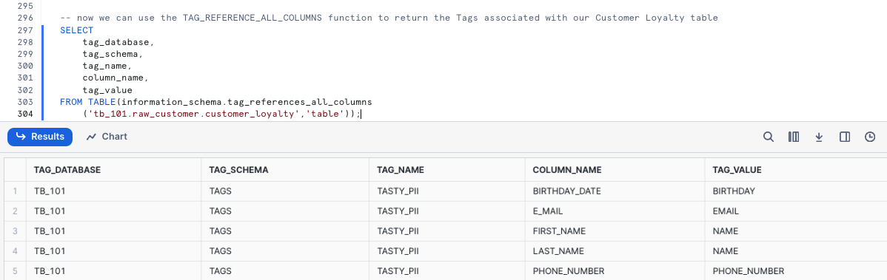

**Perfect!** Just as desired, we see our created tag is associated to the PII columns we will look to mask in the next section.

### Step 6 - Click Next -->

## Creating Masking Policies and Applying to Tags

### Overview
With our Tags in place we can now create our Masking Policies that will mask data for all but privileged Roles. We need to create 1 policy for every data type where the return data type can be implicitly cast into the column datatype. We can only assign 1 policy per datatype to an individual Tag.

### Step 1 - Creating our first Data Masking Policy
For the three different column types we are looking to mask, we want to address the following:
- **Names:** Complete masking for any role that is not `accountadmin` or `sysadmin`
- **Phone Numbers**: Partial masking with only the first three numbers exposed to any role that is not `accountadmin` or `sysadmin`.
- **E-mail Addresses**: Partial masking with only the email provider information available to any role that is not `accountadmin` or `sysadmin`.

In this step we will create our tasty_pii_string_mask Masking Policy. Within the policy we will see the use of [CREATE MASKING POLICY](https://docs.snowflake.com/en/sql-reference/sql/create-masking-policy) as well as the other Snowflake functions required to complete our masking including [CURRENT_ROLE](https://docs.snowflake.com/en/sql-reference/functions/current_role), [CONCAT](https://docs.snowflake.com/en/sql-reference/functions/concat), [LEFT](https://docs.snowflake.com/en/sql-reference/functions/left), and [SPLIT_PART](https://docs.snowflake.com/en/sql-reference/functions/split_part). This query will result in a `Masking policy TASTY_PII_STRING_MASK successfully created.` message.

```
CREATE OR REPLACE MASKING POLICY governance.tasty_pii_string_mask AS (val STRING) RETURNS STRING ->
    CASE
        -- these active roles have access to unmasked values 
        WHEN CURRENT_ROLE() IN ('ACCOUNTADMIN','SYSADMIN')
            THEN val 
        -- if a column is tagged with TASTY_PII : PHONE_NUMBER 
        -- then mask everything but the first 3 digits   
        WHEN SYSTEM$GET_TAG_ON_CURRENT_COLUMN('TAGS.TASTY_PII') = 'PHONE_NUMBER'
            THEN CONCAT(LEFT(val,3), '-***-****')
        -- if a column is tagged with TASTY_PII : EMAIL  
        -- then mask everything before the @ sign  
        WHEN SYSTEM$GET_TAG_ON_CURRENT_COLUMN('TAGS.TASTY_PII') = 'EMAIL'
            THEN CONCAT('**~MASKED~**','@', SPLIT_PART(val, '@', -1))
        -- all other conditions should be fully masked   
    ELSE '**~MASKED~**' 
END;
```

### Step 2 - Addressing Re-Identification
The combination of an individuals City, first 3 Phone Number digits, and Birthday to re-identify them. Let's play it safe and also truncate Birthdays into 5 year buckets which will fit the use case of our Analyst. Run the next query to create our Date Masking Policy to return modified Birthdays. This will return `Masking policy TASTY_PII_DATE_MASK successfully created.`

```
CREATE OR REPLACE MASKING POLICY governance.tasty_pii_date_mask AS (val DATE) RETURNS DATE ->
    CASE
        -- these active roles have access to unmasked values 
        WHEN CURRENT_ROLE() IN ('ACCOUNTADMIN','SYSADMIN')
            THEN val
        -- if a column is tagged with TASTY_PII : BIRTHDAY  
        -- then truncate to 5 year buckets 
        WHEN SYSTEM$GET_TAG_ON_CURRENT_COLUMN('TAGS.TASTY_PII') = 'BIRTHDAY'
            THEN DATE_FROM_PARTS(YEAR(val) - (YEAR(val) % 5),1,1)
        -- if a Date column is not tagged with BIRTHDAY, return NULL
    ELSE NULL 
END;
```

### Step 3 - Set Masking Policies on Tagged Columns
Now we are able to use an ALTER TAG statement to set the Masking Policies on the PII tagged columns Please now execute the query in this step, which applies each Masking Policy to the appropriate Tag using [ALTER TAG... SET MASKING POLICY](https://docs.snowflake.com/en/sql-reference/sql/alter-tag) command.

This will result in a `Statement executed successfully.` message.

```
ALTER TAG tags.tasty_pii SET
    MASKING POLICY governance.tasty_pii_string_mask,
    MASKING POLICY governance.tasty_pii_date_mask;
```

We can now officially say we have deployed Tag Based Masking Policies. Let's move on to the next step where we will validate our work.

### Step 4 - Validating our Work
With Tag Based Masking in-place, let's check things out by first assuming our Test Role and using our Development Warehouse and then beginning to query both raw and downstream data.

Within our first query we will query the Raw layer Customer Loyalty table directly.

```
USE ROLE tb_test_role;
USE WAREHOUSE tb_dev_wh;

SELECT
    cl.customer_id,
    cl.first_name,
    cl.last_name,
    cl.phone_number,
    cl.e_mail,
    cl.birthday_date,
    cl.city,
    cl.country
FROM raw_customer.customer_loyalty cl
WHERE cl.country IN ('United States','Canada','Brazil');
```

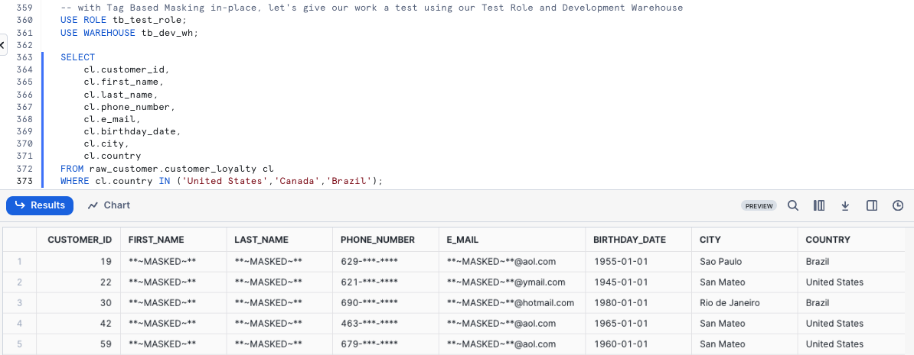

Since we reference this `raw_customer.customer_loyalty` Table in downstream Views let's see if this Masking Policy impacts us there as well. Please kick off the next query which calculates our Customer Loyalty members `lifetime_sales_usd` totals and sorts them in descending order by this amount.

```
SELECT TOP 10
    clm.customer_id,
    clm.first_name,
    clm.last_name,
    clm.phone_number,
    clm.e_mail,
    SUM(clm.total_sales) AS lifetime_sales_usd
FROM analytics.customer_loyalty_metrics_v clm
WHERE clm.city = 'San Mateo'
GROUP BY clm.customer_id, clm.first_name, clm.last_name, clm.phone_number, clm.e_mail
ORDER BY lifetime_sales_usd;
```

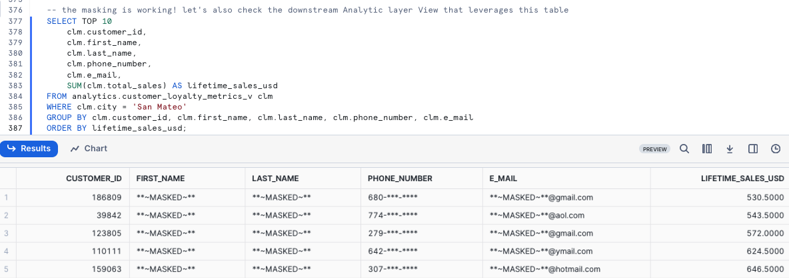 

### Step 5 - Click Next -->

## Row-Access Policies

### Overview
Happy with our Tag Based Dynamic Masking controlling masking at the Column level,
we will now look to restrict access at the Row level for our Test Role. 

Within our Customer Loyalty table, our Test Role should only see Customers who are
based in Tokyo. Thankfully, Snowflake has another powerful native Data Governance
feature that can handle this at scale called [Row Access Policies](https://docs.snowflake.com/en/user-guide/security-row-intro). 

For our use case, we will leverage the mapping table approach.

>aside positive
> Snowflake supports row-level security through the use of Row Access Policies to determine which rows to return in the query result. The row access policy can be relatively simple to allow one particular role to view rows, or be more complex to include a mapping table in the policy definition to determine access to rows in the query result.
>

### Step 1 - Creating a Mapping Table
To begin our Row Level Security journey we will start by creating a `row_policy_map` table that will serve as our Mapping Table which a Row Access Policy condition can reference to filter the query result set. 

Let's now kick off the first two queries in this section which will assume the `accountadmin` Role and create our Mapping Table that will accept Roles and the City they should have permission to see. This will result in `Table ROW_POLICY_MAP successfully created.`.

```
USE ROLE accountadmin;

CREATE OR REPLACE TABLE governance.public.row_policy_map
    (role STRING, city_permissions STRING);
```


### Step 2 - Inserting Mapping Records
With our `row_policy_map` in place, please kick off the next query which will [INSERT](https://docs.snowflake.com/en/sql-reference/sql/insert) a record that maps our `tb_test_role` to Tokyo. This query will result in `number of rows insterted: 1`.

```
INSERT INTO governance.row_policy_map
    VALUES ('TB_TEST_ROLE','Tokyo'); 
```


### Step 3 - Creating a Row Access Policy
Now that we have a record in our `row_policy_map` Table, we can kick off our next query to create our Row Access Policy.

Within this query we are using [CREATE ROW ACCESS POLICY](https://docs.snowflake.com/en/sql-reference/sql/create-row-access-policy) that will allow our Admin and Tasty Workload Roles to see all rows but if a user is using a Role that is seen in our Mapping Table they will only be allowed to see the rows relevant to the City they are mapped to. After executing this query you will recieve a `Row access policy 'CUSTOMER_CITY_ROW_POLICY' is successfully created.` result.

```
CREATE OR REPLACE ROW ACCESS POLICY governance.customer_city_row_policy
    AS (city STRING) RETURNS BOOLEAN ->
       CURRENT_ROLE() IN ('ACCOUNTADMIN','SYSADMIN') -- list of roles that will not be subject to the policy
        OR EXISTS -- this clause references our mapping table from above to handle the row level filtering
            (
            SELECT rp.role
                FROM governance.row_policy_map rp
            WHERE 1=1
                AND rp.role = CURRENT_ROLE()
                AND rp.city_permissions = city
            )
COMMENT = 'Policy to limit rows returned based on mapping table of ROLE and CITY: governance.row_policy_map';
```


### Step 4 - Applying a Row Access Policy to a Table
Please kick off the next query which will associate our Row Access Policy to our `city` Column within the `customer_loyalty` table.

Once complete we will recieve a `Statement executed successfully.` message indicating our policy is applied.

```
ALTER TABLE raw_customer.customer_loyalty
    ADD ROW ACCESS POLICY governance.customer_city_row_policy ON (city);
```

### Step 5 - Testing our Row Access Policy in a Non-Privileged Role
With everything in place, we can begin to test that our Row Access Policy is operating as expected. Please now kick off the next two queries which set our `tb_test_role` Role context and query the `customer_loyalty` table to return a list of our Customer Loyalty members including a calculated `age` Column that leverages [DATEDIFF](https://docs.snowflake.com/en/sql-reference/functions/datediff) and [CURRENT_DATE](https://docs.snowflake.com/en/sql-reference/functions/current_date) functions.

```
USE ROLE tb_test_role;

SELECT
    cl.customer_id,
    cl.first_name,
    cl.last_name,
    cl.city,
    cl.marital_status,
    DATEDIFF(year, cl.birthday_date, CURRENT_DATE()) AS age
FROM raw_customer.customer_loyalty cl SAMPLE (10000 ROWS)
GROUP BY cl.customer_id, cl.first_name, cl.last_name, cl.city, cl.marital_status, age;
```

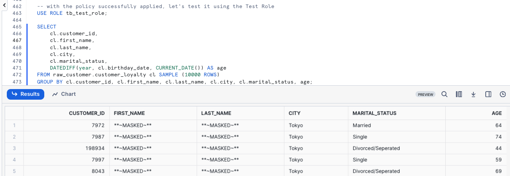

**Yay!** Our Row Access Policy is working as expected and we are also seeing our masking in place since we are using the `tb_test_role`. 


### Step 6 - Testing our Row Access Policy Downstream
As we did previously, let's now confirm our Row Access Policy is in effect when we query our downstream Analytics `customer_loyalty_metrics_v` View by running the next query.

```
SELECT
    clm.city,
    SUM(clm.total_sales) AS total_sales_usd
FROM analytics.customer_loyalty_metrics_v clm
GROUP BY clm.city;
```

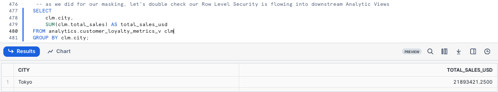

Just as expected, our Governance features are seen downstream despite only having to define them once and apply them to the Raw Tables our Analytics Views retrieve query results from. 

### Step 7 - Click Next -->


## Aggregation Policies

### Overview
 Outside of the Data Access Policies (Masking and Row Access) we have covered, Snowflake Horizon also provides [Privacy Policies](https://docs.snowflake.com/en/user-guide/aggregation-policies). In this section we will cover the ability to set Aggregation Policies on Database Objects which can restrict certain roles to only aggregate data by only allowing for queries that aggregate data into groups of a minimum size versus retrieving individual roles.

For Tasty Bytes and the Test role we have created, let's test an Aggregation Policy ut against our Raw Order Header table.

> aside positive
>
> An **Aggregation Policy** is a schema-level object that controls what type of query can access data from a table or view. When an aggregation policy is applied to a table, queries against that table must aggregate data into groups of a minimum size in order to return results, thereby preventing a query from returning information from an individual record.
>


### Step 1 - Creating a Conditional Aggregation Policy
To begin, let's once again assume our `Accountadmin` role. For our use case, we will create a Conditional Aggregation Policy in our `Governance` Schema that will only allow queries from non-admin users to return results for queries that aggregate more than 1000 rows. Please kick off the next two queries which will result `Aggregation policy 'TASTY_ORDER_TEST_AGGREGATION_POLICY' is successfuly created/`. 

```
USE ROLE accountadmin;

CREATE OR REPLACE AGGREGATION POLICY governance.tasty_order_test_aggregation_policy
  AS () RETURNS AGGREGATION_CONSTRAINT ->
    CASE
      WHEN CURRENT_ROLE() IN ('ACCOUNTADMIN','SYSADMIN')
      THEN NO_AGGREGATION_CONSTRAINT()  
      ELSE AGGREGATION_CONSTRAINT(MIN_GROUP_SIZE => 1000) -- atleast 1000 rows in aggregate
    END;
```

### Step 2 - Setting our Aggregation Policy on a Table
With the Aggregation Policy created, let's apply it to our Order Header table in the next query which will return a `Statement executed successully.` message.

```
ALTER TABLE raw_pos.order_header
    SET AGGREGATION POLICY governance.tasty_order_test_aggregation_policy;
```

### Step 3 - Testing our Aggregation Policy
Now let's test our work by assuming our Test Role and executing a few queries against the `order_header` table. Please execute the next two queries which will set our role and run a TOP 10 SELECT statement from the table.

```
USE ROLE tb_test_role;

SELECT TOP 10 * FROM raw_pos.order_header;
```

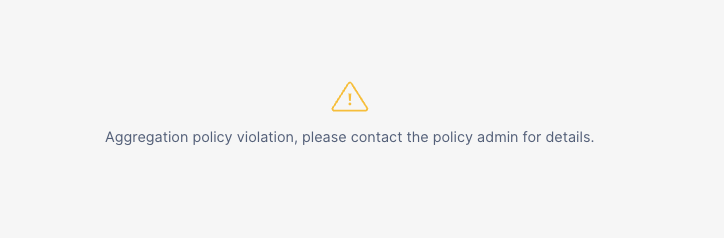

Run the next query to see what happens if we include over 1000 rows.


### Step 4 - Conducting Aggregate Analysis
Bringing in the Customer Loyalty table that we have previously:
 - Deployed Masking against PII columns
 - Deployed Row Level Security to restrict our Test Role to only Tokyo results

Let's answer a few aggregate questions that the business has presented to our Analyst.

**Question 1** - What are the total order amounts by gender?

```
SELECT 
    cl.gender,
    cl.city,
    COUNT(oh.order_id) AS count_order,
    SUM(oh.order_amount) AS order_total
FROM raw_pos.order_header oh
JOIN raw_customer.customer_loyalty cl
    ON oh.customer_id = cl.customer_id
GROUP BY ALL
ORDER BY order_total DESC;
```

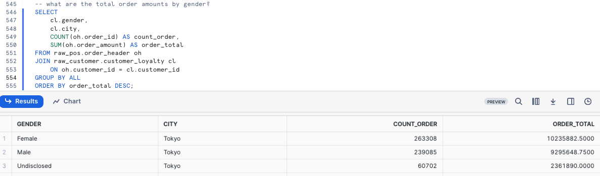


**Question 2** - What are the total order amounts by Postal Code?

```
SELECT 
    cl.postal_code,
    cl.city,
    COUNT(oh.order_id) AS count_order,
    SUM(oh.order_amount) AS order_total
FROM raw_pos.order_header oh
JOIN raw_customer.customer_loyalty cl
    ON oh.customer_id = cl.customer_id
GROUP BY ALL
ORDER BY order_total DESC;
```

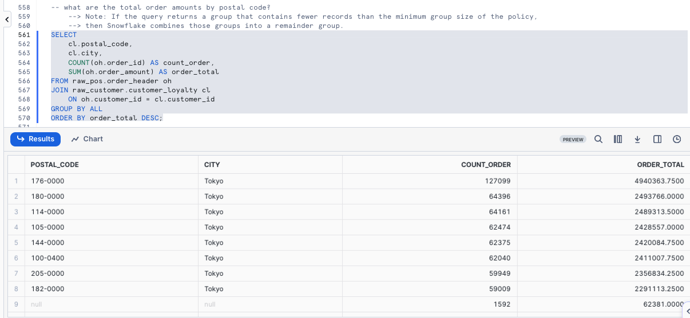


> aside positive
> Note: If the query returns a group that contains fewer records than the minimum group size of the policy, then Snowflake combines those groups into a remainder group.
>


## Projection Policies

### Overview:
Within this step, we will cover another Privacy Policy framework provided by Snowflake Horizon, this time diving into [Projection Policies](https://docs.snowflake.com/en/user-guide/projection-policies) which in short will prevent queries from using a SELECT statement to project values from a column.


### Step 1 - Creating a Conditional Projection Policy
For our use case, we will create a Conditional Projection Policy in our `Governance` Schema that will only allow our Admin Roles to project the columns we will assign it to. Please execute the next two queries which will assume our `accountadmin` Role and create our `tasty_customer_test_projection_policy` Projection Policy. This will result in `Projection policy 'TASTY_CUSTOMER_TEST_PROJECTION_POLICY' is successfully created.`


```
USE ROLE accountadmin;

CREATE OR REPLACE PROJECTION POLICY governance.tasty_customer_test_projection_policy
  AS () RETURNS PROJECTION_CONSTRAINT -> 
  CASE
    WHEN CURRENT_ROLE() IN ('ACCOUNTADMIN','SYSADMIN')
    THEN PROJECTION_CONSTRAINT(ALLOW => true)
    ELSE PROJECTION_CONSTRAINT(ALLOW => false)
  END;
```


> aside positive
> A projection policy is a first-class, schema-level object that defines whether a column can be projected in the output of a SQL query result. A column with a projection policy assigned to it is said to be projection constrained.
>


### Step 2 - Applying our Projection Policy to our Postal Code column
With the Projection Policy in place, let's assign it to our Postal Code column by executing the query below. This will result in a `Statement executed successfully.` message.

```
ALTER TABLE raw_customer.customer_loyalty
 MODIFY COLUMN postal_code
 SET PROJECTION POLICY governance.tasty_customer_test_projection_policy; 
```


### Step 3 - Testing our Projection Policy
Now we can move on to testing our Projection Policy by first assuming our `tb_test_role` Role and running a SELECT TOP 100 * query against our `customer_loyalty` table.


```
USE ROLE tb_test_role;

SELECT TOP 100 * FROM raw_customer.customer_loyalty;
```

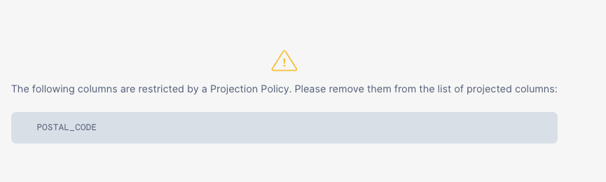


Let's execute the next query to see what happens if we EXCLUDE the `postal_code` column.

```
SELECT TOP 100 * EXCLUDE postal_code FROM raw_customer.customer_loyalty;
```

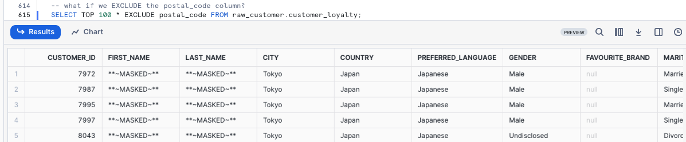

### Step 4 - Click Next -->


## Sensitive Data Classification

### Overview
In some cases, you may not know if there is sensitive data in a table. Snowflake Horizon provides the capability to attempt to automatically detect sensitive information and apply relevant Snowflake system defined privacy tags. 

Classification is a multi-step process that associates Snowflake-defined system tags to columns by analyzing the fields and metadata for personal data. Data  Classification can be done via SQL or the Snowsight interface.

Within this step we will be using SQL to classify a single table as well as all tables within a schema.

To learn how to complete Data Classification within the Snowsight interface, please see the following documentation: 

Using Snowsight to classify tables in a schema 
  • https://docs.snowflake.com/en/user-guide/governance-classify-using#using-sf-web-interface-to-classify-tables-in-a-schema

### Step 1 - SYSTEM$CLASSIFY
As our Raw Customer Schema only includes one table, let's use [SYSTEM$CLASSIFY](https://docs.snowflake.com/en/sql-reference/stored-procedures/system_classify) against it after we assume our `accountadmin` role. Please execute the next two queries.


```
USE ROLE accountadmin;

CALL SYSTEM$CLASSIFY('raw_customer.customer_loyalty', {'auto_tag': true});
```

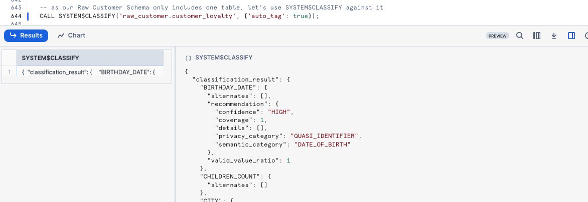


Now let's view the new Tags Snowflake applied automatically via Data Classification by executing the next query.

```
SELECT * FROM TABLE(information_schema.tag_references_all_columns('raw_customer.customer_loyalty','table'));
```

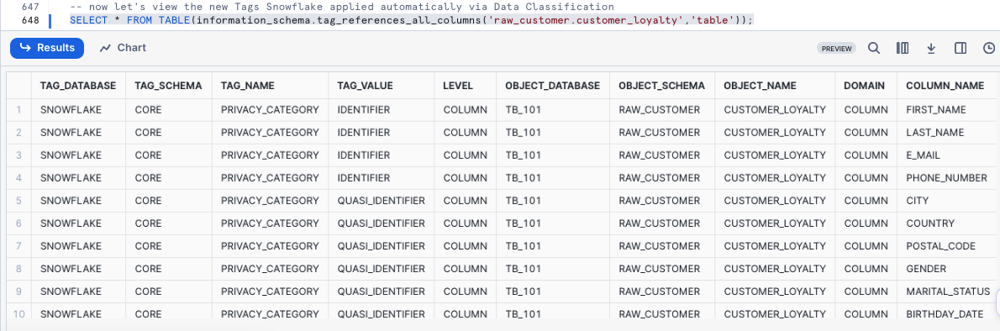

### Step 2 - SYSTEM$CLASSIFY_SCHEMA
As our Raw Point-of-Sale Schema includes numerous tables, let's use [SYSTEM$CLASSIFY_SCHEMA](https://docs.snowflake.com/en/sql-reference/stored-procedures/system_classify_schema) against it in our next query.

```
CALL SYSTEM$CLASSIFY_SCHEMA('raw_pos', {'auto_tag': true});
```

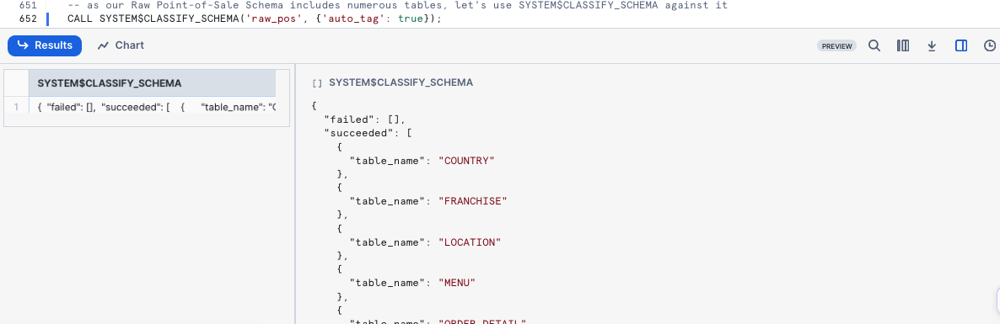


Once again, let's view the Tags applied using the Franchise table within the Schema.

```
SELECT * FROM TABLE(information_schema.tag_references_all_columns('raw_pos.franchise','table'));
```

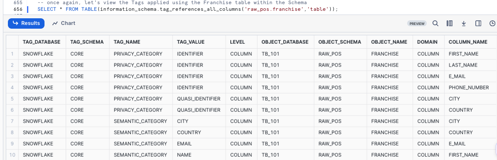

### Step 3 - Click Next -->


## Custom Data Classification

### Overview
Snowflake provides the CUSTOM_CLASSIFIER class in the SNOWFLAKE.DATA_PRIVACY schema to enable Data Engineers to extend their Data Classification capabilities based on their own knowledge of their data.

In this step, we will cover creating and deploying a [Customer Classifier](https://docs.snowflake.com/en/user-guide/classify-custom) to identify [Placekey](https://www.placekey.io/pricing) location identifiers across our data.

### Step 1 - Exploring our Data
To begin, let's take a look at our `Location` table where we know Placekey is present so that we can see what they look like.

```
SELECT 
    TOP 10 *
FROM raw_pos.location
WHERE city = 'London';
```

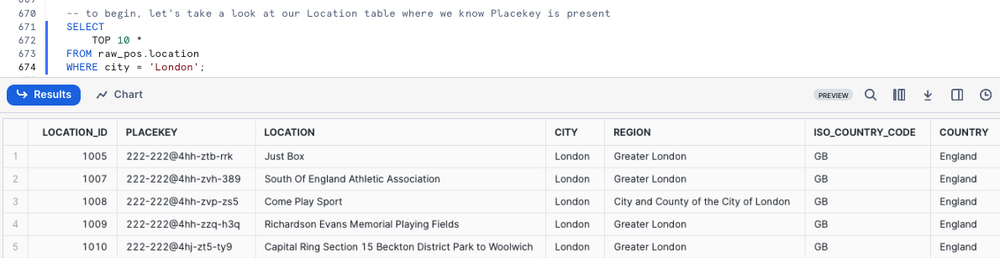

### Step 2 - Creating our Classifiers Schema and Placekey Custom Classifier

Let's now create a `Classifier` Schema to store our Classifiers in by running the next query. This will result in a `Schema CLASSIFIERS successfully created.` message.

```
CREATE OR REPLACE SCHEMA classifiers
    COMMENT = 'Schema containing Custom Classifiers';
```

With our schema available, let's now create our `placekey` Custom Classifier by executing the next query which will provide a `Instance PLACEKEY successfully created.` message.

```
CREATE OR REPLACE snowflake.data_privacy.custom_classifier classifiers.placekey();
```

### Step 3 - Adding REGEX to our Placekey Custom Classifier
Next let's test the Regular Expression (Regex) that our Data Engineer has created to locate the Placekey value by running our next query.

```
SELECT 
    placekey
FROM raw_pos.location
WHERE placekey REGEXP('^[a-zA-Z0-9\d]{3}-[a-zA-Z0-9\d]{3,4}@[a-zA-Z0-9\d]{3}-[a-zA-Z0-9\d]{3}-.*$');
```

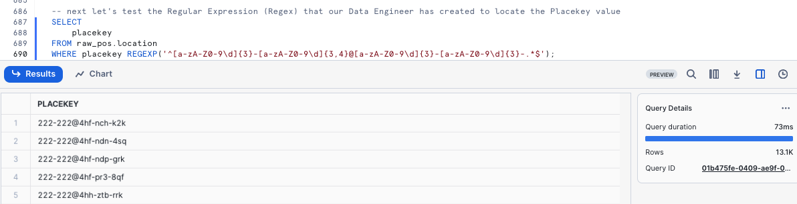

Let's now use the [ADD_REGEX](https://docs.snowflake.com/en/sql-reference/classes/custom_classifier/methods/add_regex) method to assign this to our Placekey Classifier
```
CALL placekey!ADD_REGEX(
  'PLACEKEY', -- semantic category
  'IDENTIFIER', -- privacy category
  '^[a-zA-Z0-9\d]{3}-[a-zA-Z0-9\d]{3,4}@[a-zA-Z0-9\d]{3}-[a-zA-Z0-9\d]{3}-.*$', -- regex expression
  'PLACEKEY*', --column name regex
  'Add a regex to identify Placekey' -- description
);
```

With the details in place, we can now use the [LIST](https://docs.snowflake.com/en/sql-reference/classes/custom_classifier/methods/list) method to validate our work

```
SELECT placekey!LIST();
```

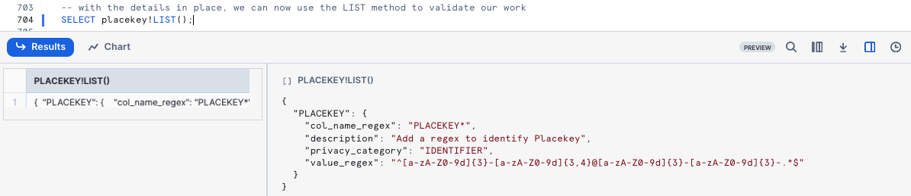

### Step 4 - Using our Placekey Custom Classifier
Let's now use [SYSTEM$CLASSIFY](https://docs.snowflake.com/en/sql-reference/stored-procedures/system_classify) and our Classifier against the `Location` table

```
CALL SYSTEM$CLASSIFY('raw_pos.location', {'custom_classifiers': ['placekey'], 'auto_tag':true});
```

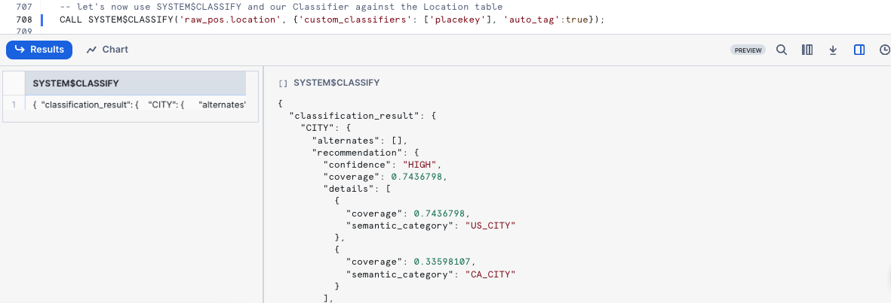

To finish, let's confirm our `Placekey` column was successfully tagged
```
SELECT 
    tag_name,
    level, 
    tag_value,
    column_name
FROM TABLE(information_schema.tag_references_all_columns('raw_pos.location','table'))
WHERE tag_value = 'PLACEKEY';
```

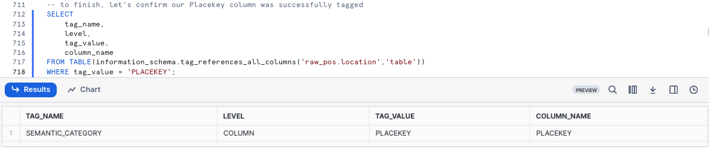

Moving forward as Schemas or Tables are created and updated we can use this exact process of Automatic and Custom Classification to maintain a strong governance posture and build rich semantic-layer metadata.


## Access History (Reads and Writes)

### Overview:
Access History provides insights into user queries encompassing what data was  read and when, as well as what statements have performed a write operations.
 
For Tasty Bytes, Access History is particularly important for Compliance, Auditing, and Governance.

Within this step, we will walk through leveraging Access History to find when the last time our Raw data was read from and written to.

> aside negative
> Access History latency is up to 3 hours. If you have just recently setupb the Tasty Bytes environment, some of the queries below may not have results. 
>

### Step 1 - Leveraging Access History

By executing the next query we will see how many queries have accessed each of your Raw layer tables directly.

```
SELECT 
    value:"objectName"::STRING AS object_name,
    COUNT(DISTINCT query_id) AS number_of_queries
FROM snowflake.account_usage.access_history,
LATERAL FLATTEN (input => direct_objects_accessed)
WHERE object_name ILIKE 'tb_101.raw_%'
GROUP BY object_name
ORDER BY number_of_queries DESC;
```

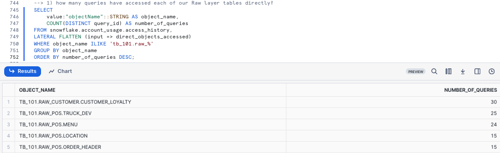
*Please note your results may not match the image above*

Within the next query we will determined what is the breakdown between Read and Write queries and when did they last occur.

```
SELECT 
    value:"objectName"::STRING AS object_name,
    CASE 
        WHEN object_modified_by_ddl IS NOT NULL THEN 'write'
        ELSE 'read'
    END AS query_type,
    COUNT(DISTINCT query_id) AS number_of_queries,
    MAX(query_start_time) AS last_query_start_time
FROM snowflake.account_usage.access_history,
LATERAL FLATTEN (input => direct_objects_accessed)
WHERE object_name ILIKE 'tb_101.raw_%'
GROUP BY object_name, query_type
ORDER BY object_name, number_of_queries DESC;
```

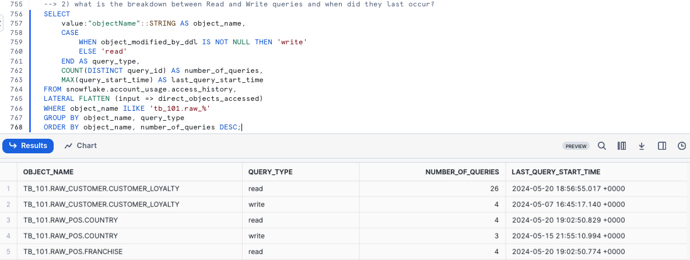
*Please note your results may not match the image above*

To wrap things up, our last query will determine how many queries have accessed each of our Raw layer tables indirectly.

```
SELECT 
    base.value:"objectName"::STRING AS object_name,
    COUNT(DISTINCT query_id) AS number_of_queries
FROM snowflake.account_usage.access_history,
LATERAL FLATTEN (input => base_objects_accessed) base,
LATERAL FLATTEN (input => direct_objects_accessed) direct,
WHERE 1=1
    AND object_name ILIKE 'tb_101.raw_%'
    AND object_name <> direct.value:"objectName"::STRING -- base object is not direct object
GROUP BY object_name
ORDER BY number_of_queries DESC;
```

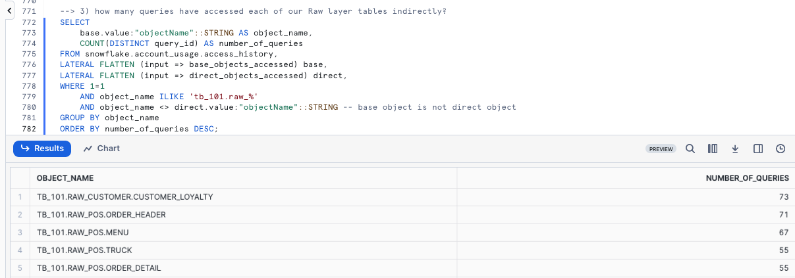

> aside positive
> **Direct Objects Accessed:** Data objects directly named in the query explicitly.
> **Base Objects Accessed:** Base data objects required to execute a query.
>

### Step 2 - Click Next -->

## Discovery with Snowflake Horizon - Universal Search

### Overview
Having explored a wide variety of Governance functionality available in Snowflake, it is time to put it all together with Universal Search.

Universal Search enables Tasty Bytes to easily find Account objects, Snowflake Marketplace listings, relevant Snowflake Documentation and Snowflake Community Knowledge Base articles.

Universal Search understands your query and information about your database objects and can find objects with names that differ from your search terms.
 
 Even if you misspell or type only part of your search term, you can still see useful results.

### Step 1 - Universal Search

To leverage Universal Search in Snowsight:
- Use the Left Navigation Menu
- Select "Search" (Magnifying Glass)
- Enter Search criteria such as:
    - Tasty Bytes
    - Snowflake Best Practices
    - How to use Snowflake Column Masking

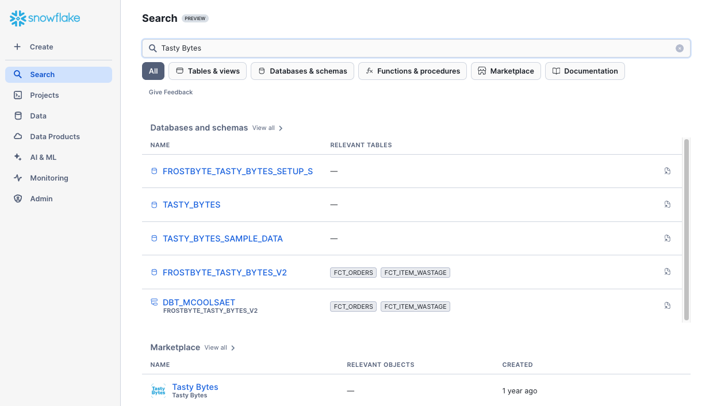


### Step 2 - Click Next -->

## Conclusion and Next Steps

### Conclusion
Fantastic work! You have successfully completed the Tasty Bytes - Zero to Snowflake - Governance with Snowflake Horizon Quickstart. 

By doing so you have now:
- Learned System Defined Roles Exist in Snowflake Accounts
- Created a Role
- Granted Privileges to a Role
- Create a Tag
- Created a Masking Policy
- Deployed a Tag Based Masking Policy
- Created a Row Access Policy using a Mapping Table
- Created an Aggregation Policy
- Created a Project Policy
- Leveraged Automatic and Custom Data Classification
- Used Universal Search

If you would like to re-run this Quickstart please leverage the Reset scripts in the bottom of your associated Worksheet.

### Next Steps
To continue your journey in the Snowflake AI Data Cloud, please now visit the link below to see all other Powered by Tasty Bytes - Quickstarts available to you.

- ### [Powered by Tasty Bytes - Quickstarts Table of Contents](/en/developers/guides/tasty-bytes-introduction/)


