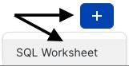
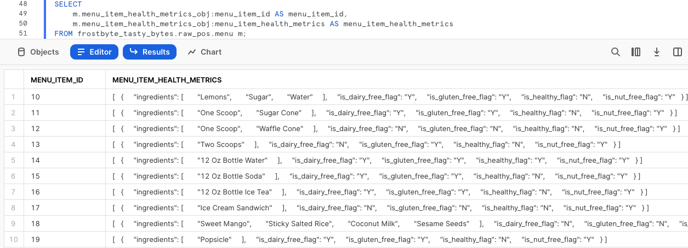
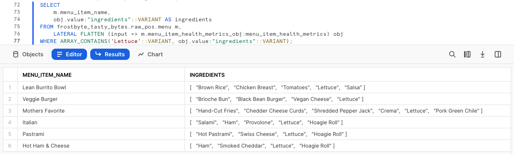
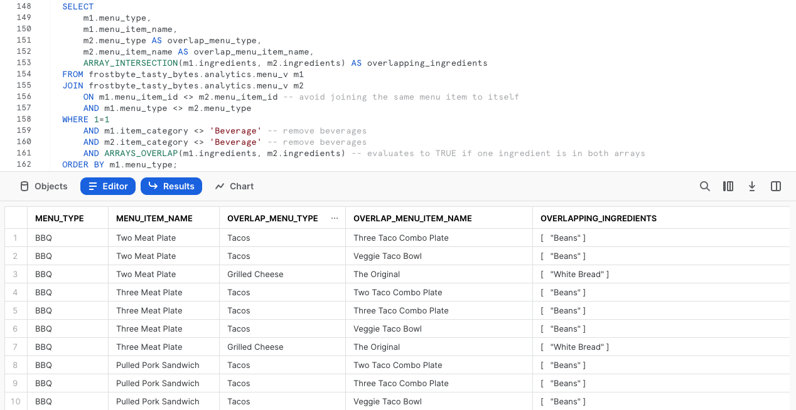
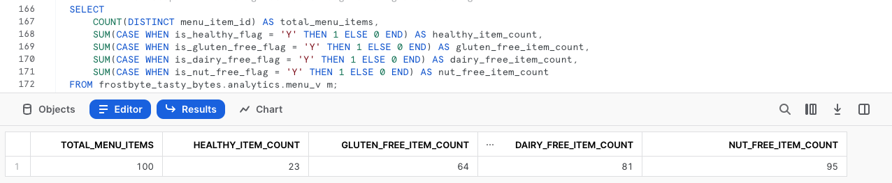

author: Jacob Kranzler
id: tasty-bytes-zero-to-snowflake-semi-structured-data-es
categories: snowflake-site:taxonomy/solution-center/certification/quickstart, snowflake-site:taxonomy/product/data-engineering
language: es
summary: Tasty Bytes - De cero a Snowflake - Datos semiestructurados
environments: web
status: Published 
feedback link: https://github.com/Snowflake-Labs/sfguides/issues

# Tasty Bytes - De cero a Snowflake - Datos semiestructurados
<!-- ------------------------ -->

## Procesamiento de datos semiestructurados en Snowflake

### Descripción general
Te damos la bienvenida a la quickstart guide Tasty Bytes - De cero a Snowflake centrada en el procesamiento de datos semiestructurados.

En esta quickstart guide veremos cómo procesar datos semiestructurados en Snowflake analizando en detalle el tipo de datos VARIANT, el procesamiento de datos semiestructurados con notación de puntos y cómo quitar el formato lateral, así como la creación de vistas y los gráficos de Snowsight.

Para obtener más información sobre los datos semiestructurados en Snowflake, consulta la [descripción general de los datos semiestructurados.](https://docs.snowflake.com/en/user-guide/semistructured-concepts)

### Requisitos previos
- Antes de empezar, asegúrate de haber completado la [**quickstart guide Introducción a Tasty Bytes**](/es/developers/guides/tasty-bytes-introduction-es/), donde aprenderás a configurar una cuenta de prueba y a implementar los conceptos esenciales de Tasty Bytes necesarios para completar esta quickstart guide.

### Contenido que se enseñará
- Qué es el tipo de datos VARIANT
- Cómo usar las notación de puntos para consultar datos semiestructurados
- Cómo quitar el formato de los datos semiestructurados
- Cómo analizar arrays
- Cómo crear una vista
- Cómo crear un gráfico a partir de un conjunto de resultados en Snowsight

### Cosas que podrás conseguir
- Un proceso integral de datos semiestructurados
- Una vista armonizada (plata) y analítica (oro)
- Un gráfico de barras útil a nivel ejecutivo

## Creación de una hoja de trabajo y copia en SQL

### Descripción general
En esta quickstart guide se narra una historia de Tasty Bytes mediante una hoja de trabajo SQL en Snowsight. Esta página servirá de guía completa paralela con comentarios adicionales, imágenes y enlaces a la documentación.

En esta sección te explicaremos cómo iniciar sesión en Snowflake, crear una nueva hoja de trabajo, cambiar el nombre de la hoja de trabajo, copiar SQL de GitHub y pegar el que utilizaremos en esta quickstart guide.

### Paso 1: acceder a Snowflake con la URL
- Abre una ventana del navegador e introduce la URL de tu cuenta de Snowflake. 

### Paso 2: iniciar sesión en Snowflake
- Inicia sesión en tu cuenta de Snowflake.
    - 

### Paso 3: acceder a las hojas de trabajo
- Haz clic en la pestaña Worksheets en la barra de navegación situada a la izquierda para acceder a las hojas de trabajo.
    - 

### Paso 4: crear una hoja de trabajo
- En la pestaña Worksheets, haz clic en el botón “+” en la esquina superior derecha de Snowsight y elige “SQL Worksheet”.
    - 

### Paso 5: cambiar el nombre de una hoja de trabajo
- Cambia el nombre de la hoja de trabajo haciendo clic en el nombre generado automáticamente con (marca de tiempo) y escribe “Tasty Bytes - Datos semiestructurados"
    - 

### Paso 6: acceder a la quickstart guide de SQL en GitHub
- Haz clic en el botón que aparece a continuación. Te redirigirá a nuestro archivo SQL de Tasty Bytes alojado en GitHub. <button>[tb_zts_semi_structured_data.sql](https://github.com/Snowflake-Labs/sf-samples/blob/main/samples/tasty_bytes/tb_zts_semi_structured_data.sql)</button>

### Paso 7: copiar el código SQL de configuración de GitHub
- En GitHub, ve al lado derecho y haz clic en “Copy raw contents”. De esta forma, se copiará todo el código SQL necesario en el portapapeles.
    - 

### Paso 8: pegar el código SQL de configuración de GitHub en tu hoja de trabajo de Snowflake
- Vuelve a la hoja de trabajo que acabas de crear en Snowsight y pega (*CMD + V para Mac o CTRL + V para Windows*) lo que has copiado de GitHub.

### Paso 9: hacer clic en Next -->

## Elaboración de perfiles de datos semiestructurados de la carta

### Descripción general
Como ingeniero de datos de Tasty Bytes, debes elaborar un perfil para los datos de nuestra carta, lo que incluye una columna para datos semiestructurados. A partir de esta tabla con la carta tendrás que generar la vista de una capa analítica que incluya los datos de los ingredientes y alérgenos para los usuarios finales.

### Paso 1: configurar el contexto y la consulta en la tabla
Para empezar, ejecutaremos las tres primeras consultas juntas. De esta forma: - Se definirá el contexto del rol como `tasty_data_engineer`. - Se definirá el contexto del almacén como `tasty_de_wh`. - Se generará un conjunto con los diez resultados principales mediante el comando [TOP](https://docs.snowflake.com/en/sql-reference/constructs/top_n) para nuestra tabla `raw_pos.menu`.

``` 
USE ROLE tasty_data_engineer; 
USE WAREHOUSE tasty_de_wh;

SELECT TOP 10 
    m.truck_brand_name, 
    m.menu_type, 
    m.menu_item_name, 
    m.menu_item_health_metrics_obj 
FROM frostbyte_tasty_bytes.raw_pos.menu m; 
```


En el resultado, podemos ver que `menu_item_health_metrics_obj` debe ser el dato semiestructurado que nos han dicho que contiene las métricas que necesitamos proporcionar posteriormente. 

Al hacer clic en una de las celdas de esta columna, veremos que Snowsight amplía automáticamente los paneles de estadísticas para que veamos mejor los contenidos.


### Paso 2: explorar la columna de datos semiestructurados
Para examinar en más profundidad cómo se define esta columna en Snowflake, ejecuta la siguiente consulta en la que usaremos [SHOW COLUMNS](https://docs.snowflake.com/en/sql-reference/sql/show-columns) para explorar los tipos de datos presentes en nuestra tabla `menu`.

```
SHOW COLUMNS IN frostbyte_tasty_bytes.raw_pos.menu;
```


Si observamos el conjunto de resultados, podemos ver que `menu_item_health_metrics_obj` es del tipo de datos [VARIANT](https://docs.snowflake.com/en/sql-reference/data-types-semistructured).

> En el caso de datos mayormente regulares que solo usan tipos nativos del formato semiestructurado en cuestión (como cadenas o enteros en formato JSON), los requisitos de almacenamiento y rendimiento de consultas para las operaciones en datos relacionales y en una columna VARIANT son muy similares.
>

### Paso 3: recorrer datos semiestructurados mediante la notación de puntos
En la columna `menu_item_health_metrics_obj`, vemos que se incluyó `menu_item_id` junto con los datos más anidados sobre ingredientes y alérgenos a los que necesitamos acceder. 

Ejecuta la siguiente consulta en la que usamos la [notación de puntos](https://docs.snowflake.com/en/user-guide/querying-semistructured#dot-notation) para recorrer nuestros datos semiestructurados.

```
SELECT 
    m.menu_item_health_metrics_obj:menu_item_id AS menu_item_id,
    m.menu_item_health_metrics_obj:menu_item_health_metrics AS menu_item_health_metrics
FROM frostbyte_tasty_bytes.raw_pos.menu m;
```



Al usar la notación de puntos podemos extraer `menu_item_id` al completo, pero parece que aún quedan objetos semiestructurados adicionales en los resultados de la columna `menu_item_health_metrics`. 

Una vez más, vamos a hacer clic en una de las celdas de esta columna para analizarla en detalle.


**¡Estamos avanzando!** Veamos cómo podemos procesar más `menu_item_health_metrics` en la siguiente sección, con funciones adicionales de Snowflake.

### Paso 4: hacer clic en Next -->

## Cómo quitar el formato de datos semiestructurados

### Descripción general
Después de haber visto cómo podemos consultar fácilmente los datos semiestructurados tal y como aparecen en una columna Variant mediante la notación de puntos, nuestro ingeniero de datos de Tasty ya puede proporcionar los datos solicitados a los colaboradores internos.

En esta sección, realizaremos procesamientos adicionales de datos semiestructurados para cumplir algunos de los requisitos.

### Paso 1: familiarizarse con la función FLATTEN
Para seguir extrayendo datos, los usuarios posteriores hacen consultas relativas a la columna `menu_item_health_metrics_obj`. Ejecuta la siguiente consulta, que usa la funcionalidad de la notación de puntos que acabamos de ver, junto con la función [FLATTEN](https://docs.snowflake.com/en/sql-reference/functions/flatten) y la capacidad [LATERAL JOIN](https://docs.snowflake.com/en/sql-reference/constructs/join-lateral) de Snowflake para ofrecernos el array que hemos solicitado: `ingredient`.

> **FLATTEN:** es una función de tabla que selecciona una columna VARIANT, OBJECT o ARRAY y genera una vista lateral. Puede usarse para convertir datos semiestructurados en una representación relacional.
>
>**LATERAL JOIN:** a diferencia de los resultados de las uniones no laterales, el resultado de una unión lateral solo incluye las filas generadas desde la vista de línea. Las filas de la izquierda no necesitan unirse a las de la derecha, ya que las de la izquierda ya se han tenido en cuenta al pasarse a la vista de línea. 
>

```
SELECT 
    m.menu_item_name,
    obj.value:"ingredients"::VARIANT AS ingredients
FROM frostbyte_tasty_bytes.raw_pos.menu m,
    LATERAL FLATTEN (input => m.menu_item_health_metrics_obj:menu_item_health_metrics) obj;
```


### Paso 2: explorar la función ARRAY
Antes de extraer los datos solicitados sobre ingredientes, completa la siguiente consulta que resalta funciones ARRAY de Snowflake y que explorará la columna `ingredients` para cualquier `menu_item_name` que contenga “lechuga” (lettuce) al usar [ARRAY_CONTAINS](https://docs.snowflake.com/en/sql-reference/functions/array_contains).

```
SELECT 
    m.menu_item_name,
    obj.value:"ingredients"::VARIANT AS ingredients
FROM frostbyte_tasty_bytes.raw_pos.menu m,
    LATERAL FLATTEN (input => m.menu_item_health_metrics_obj:menu_item_health_metrics) obj
WHERE ARRAY_CONTAINS('Lettuce'::VARIANT, obj.value:"ingredients"::VARIANT);
```



Según los resultados, vemos que muchos elementos de la carta incluyen lechuga. Este tipo de análisis resultaría extremadamente valioso para los responsables del abastecimiento de la cadena de suministro en caso de que hubiera que retirar alimentos en las ciudades o países donde ofrecemos nuestros productos.

### Paso 3: estructurar datos semiestructurados a escala
Ahora que ya hemos visto qué clase de valores podemos proporcionar a nuestra organización, vamos a ejecutar la última consulta de esta sección. 

Esta consulta utiliza la notación de puntos y nuestras uniones laterales combinadas con la función de tabla FLATTEN para proporcionar el conjunto de resultados que debíamos generar inicialmente.

```
SELECT 
    m.menu_item_health_metrics_obj:menu_item_id::integer AS menu_item_id,
    m.menu_item_name,
    obj.value:"ingredients"::VARIANT AS ingredients,
    obj.value:"is_healthy_flag"::VARCHAR(1) AS is_healthy_flag,
    obj.value:"is_gluten_free_flag"::VARCHAR(1) AS is_gluten_free_flag,
    obj.value:"is_dairy_free_flag"::VARCHAR(1) AS is_dairy_free_flag,
    obj.value:"is_nut_free_flag"::VARCHAR(1) AS is_nut_free_flag
FROM frostbyte_tasty_bytes.raw_pos.menu m,
    LATERAL FLATTEN (input => m.menu_item_health_metrics_obj:menu_item_health_metrics) obj;
```


**¡Genial!** El resultado parece cumplir con los requisitos exactos de las partes interesadas. En la siguiente sección veremos cómo llevar estos resultados a nuestra capa de analíticas, donde las partes interesadas podrán acceder a ellos.

### Paso 4: hacer clic en Next -->

## Creación de vistas estructuradas a partir de datos semiestructurados

### Descripción general
En la sección anterior, hemos utilizado un conjunto de funcionalidades de datos semiestructurados de Snowflake para desarrollar una consulta que proporciona el resultado exacto que necesitan nuestros usuarios finales. A continuación, vamos a seguir el proceso de promoción de esta consulta en nuestra capa sin procesar a través de la capa armonizada y, finalmente, hasta la analítica. Nuestros usuarios poseen privilegios para poder leer esta última capa.

**Nota:** Si conoces los modelos de datos bronce, plata y oro, la capa sin procesar sería bronce, la armonizada sería plata y la analítica, oro.

### Paso 1: crear una vista armonizada utilizando nuestro SQL sin formato semiestructurado
Vamos a utilizar la consulta con la que hemos finalizado la última sección. Ejecuta la siguiente consulta, que contiene tanto este SQL como todas las demás columnas ya estructuradas de la tabla `menu`. 

En esta consulta utilizaremos [CREATE VIEW](https://docs.snowflake.com/en/sql-reference/sql/create-view) en nuestro esquema armonizado para incluir en una tabla la lógica de procesamiento semiestructurada y las columnas adicionales.

> Una vista permite acceder al resultado de una consulta como si fuera una tabla. Las vistas pueden utilizarse para muchos fines, como combinar, segregar o proteger datos. 
>

```
CREATE OR REPLACE VIEW frostbyte_tasty_bytes.harmonized.menu_v
    AS
SELECT 
    m.menu_id,
    m.menu_type_id,
    m.menu_type,
    m.truck_brand_name,
    m.menu_item_health_metrics_obj:menu_item_id::integer AS menu_item_id,
    m.menu_item_name,
    m.item_category,
    m.item_subcategory,
    m.cost_of_goods_usd,
    m.sale_price_usd,
    obj.value:"ingredients"::VARIANT AS ingredients,
    obj.value:"is_healthy_flag"::VARCHAR(1) AS is_healthy_flag,
    obj.value:"is_gluten_free_flag"::VARCHAR(1) AS is_gluten_free_flag,
    obj.value:"is_dairy_free_flag"::VARCHAR(1) AS is_dairy_free_flag,
    obj.value:"is_nut_free_flag"::VARCHAR(1) AS is_nut_free_flag
FROM frostbyte_tasty_bytes.raw_pos.menu m,
    LATERAL FLATTEN (input => m.menu_item_health_metrics_obj:menu_item_health_metrics) obj;
```


Una vez creada la vista `harmonized.menu_v`, podemos realizar una consulta directamente en ella, sin tener que utilizar el SQL más complejo que utilizamos en su momento. Sin embargo, teniendo en cuenta que las partes interesadas acceden a los datos desde la capa de analíticas, hagamos lo siguiente para llegar ahí.

### Paso 2: promoción de la vista armonizada a la analítica de forma sencilla
Ejecuta la siguiente consulta haciendo referencia a nuestra `harmonized.menu_v`. Se creará `analytics.menu_v`, que comenzará a aportar valor downstream de inmediato. 

Podemos ver que en esta consulta hay un par de funciones nuevas que todavía no hemos tratado. Por un lado, hemos añadido el comando [COMMENT](https://docs.snowflake.com/en/sql-reference/sql/comment) que se puede ver tanto en [SHOW VIEWS](https://docs.snowflake.com/en/sql-reference/sql/show) como dentro de la interfaz de Snowsight para documentar lo que un usuario puede ver al hacer una consulta en esta vista.

Por otro lado, estamos utilizando los parámetros [SELECT * EXCLUDE y RENAME](https://docs.snowflake.com/en/sql-reference/sql/select#parameters), que pueden facilitarles mucho el trabajo a los desarrolladores de SQL al reducir la complejidad de las consultas o de la definición de la vista.

> **EXCLUDE:** al seleccionar todas las columnas (con SELECT * o SELECT table_name.\*), EXCLUDE especifica qué columnas deben ser excluidas de los resultados.
>
> **RENAME:** al seleccionar todas las columnas (con SELECT * o SELECT table_name.\*), se especifican los alias de las columnas que deben utilizarse en los resultados.
>


### Paso 3: hacer clic en Next -->

## Análisis de los datos semiestructurados procesados en Snowsight

### Descripción general
Cuando nuestra vista de la carta esté lista en nuestra capa de analíticas, vamos a ejecutar un par de consultas en ella que proporcionaremos a nuestros usuarios finales para mostrar cómo Snowflake impulsa una experiencia de consulta relacional con datos semiestructurados sin tener que hacer copias adicionales ni realizar ningún procesamiento complejo.

### Paso 1: analizar arrays
En la sección anterior, hemos visto la columna `ingredients` como resultado de una consulta, pero ahora está disponible sin ningún requisito de notación de puntos en nuestra vista `analytics.menu_v`. 

Con ella, ejecuta ahora la siguiente consulta, que utiliza dos funciones de array adicionales de Snowflake, [ARRAY_INTERSECTION](https://docs.snowflake.com/en/sql-reference/functions/array_intersection) y [ARRAYS_OVERLAP](https://docs.snowflake.com/en/sql-reference/functions/arrays_overlap), para ver qué elementos de las cartas que no sean bebidas coinciden con nuestras cartas de la línea de food trucks.

```
SELECT 
    m1.menu_type,
    m1.menu_item_name,
    m2.menu_type AS overlap_menu_type,
    m2.menu_item_name AS overlap_menu_item_name,
    ARRAY_INTERSECTION(m1.ingredients, m2.ingredients) AS overlapping_ingredients
FROM frostbyte_tasty_bytes.analytics.menu_v m1
JOIN frostbyte_tasty_bytes.analytics.menu_v m2
    ON m1.menu_item_id <> m2.menu_item_id -- avoid joining the same menu item to itself
    AND m1.menu_type <> m2.menu_type 
WHERE 1=1
    AND m1.item_category <> 'Beverage' -- remove beverages
    AND m2.item_category <> 'Beverage' -- remove beverages
    AND ARRAYS_OVERLAP(m1.ingredients, m2.ingredients) -- evaluates to TRUE if one ingredient is in both arrays
ORDER BY m1.menu_type;
```



De nuevo, utilizando la misma vista, hemos desarrollado este tipo de consulta que puede proporcionar valor empresarial real a nuestros operadores de food trucks, mientras trabajan con los responsables de abastecimiento para predecir y pedir los ingredientes que necesiten cada semana.

### Paso 2: proporcionar métricas a ejecutivos
Ahora veamos cómo ayudar a los ejecutivos de Tasty Bytes a tomar decisiones sobre la carta basadas en datos. Para ello, proporcionaremos métricas de alto nivel en relación con los ingredientes y alérgenos que estamos teniendo en cuenta en nuestras marcas.

Ejecuta la siguiente consulta, que utiliza las sentencias [COUNT](https://docs.snowflake.com/en/sql-reference/functions/count), [SUM](https://docs.snowflake.com/en/sql-reference/functions/sum) y la condicional [CASE](https://docs.snowflake.com/en/sql-reference/functions/case) para agregar las métricas requeridas de `analytics.menu_v`.

```
SELECT
    COUNT(DISTINCT menu_item_id) AS total_menu_items,
    SUM(CASE WHEN is_healthy_flag = 'Y' THEN 1 ELSE 0 END) AS healthy_item_count,
    SUM(CASE WHEN is_gluten_free_flag = 'Y' THEN 1 ELSE 0 END) AS gluten_free_item_count,
    SUM(CASE WHEN is_dairy_free_flag = 'Y' THEN 1 ELSE 0 END) AS dairy_free_item_count,
    SUM(CASE WHEN is_nut_free_flag = 'Y' THEN 1 ELSE 0 END) AS nut_free_item_count
FROM frostbyte_tasty_bytes.analytics.menu_v m;
```



Y, con los resultados que acabamos de recibir, ya hemos pasado de una tabla sin procesar con datos semiestructurados a una única fila agregada a la que cualquier persona de nuestra organización puede acceder fácilmente para hacer que Tasty Bytes se base más en los datos. 


### Paso 3: convertir los resultados en gráficos
Algunos de los ejecutivos de Tasty Bytes prefieren las representaciones visuales de datos. Por ello, vamos a ver lo sencillo que es convertir los resultados de las tablas en gráficos fáciles de asimilar dentro de Snowsight. 

Ejecuta la siguiente consulta, que añade filtros en tres de los nombres de las marcas de food trucks al SQL que hemos ejecutado anteriormente.

```
SELECT
    m.brand_name,
    SUM(CASE WHEN is_gluten_free_flag = 'Y' THEN 1 ELSE 0 END) AS gluten_free_item_count,
    SUM(CASE WHEN is_dairy_free_flag = 'Y' THEN 1 ELSE 0 END) AS dairy_free_item_count,
    SUM(CASE WHEN is_nut_free_flag = 'Y' THEN 1 ELSE 0 END) AS nut_free_item_count
FROM frostbyte_tasty_bytes.analytics.menu_v m
WHERE m.brand_name IN  ('Plant Palace', 'Peking Truck','Revenge of the Curds')
GROUP BY m.brand_name;
```


Por defecto, Snowsight devuelve los resultados de la consulta en tablas. Sin embargo, hay una potente función de Snowsight que aún no hemos visto: [el uso de gráficos](https://docs.snowflake.com/en/user-guide/ui-snowsight-visualizations#using-charts).

Sigue las flechas de la siguiente captura de pantalla para crear tu propio gráfico de barras que muestre una comparativa de estas tres marcas de food trucks que muestre los elementos de su carta que tienen en cuenta los ingredientes y alérgenos.


Para terminar con esta quickstart guide, ya solo nos falta recalcar lo fácil que sería para un ejecutivo de Tasty Bytes hacer esta clase de análisis por su cuenta, sin tener que saber nada sobre el procesamiento de datos semiestructurados que hemos incluido en las vistas desarrolladas. Ahora ya podemos descansar sabiendo que estamos fomentando la democratización de los datos en la organización Tasty Bytes.

### Paso 4: hacer clic en Next -->

## Conclusión y siguientes pasos

### Conclusión
¡Bien hecho! Has completado la quickstart guide Tasty Bytes - De cero a Snowflake sobre datos semiestructurados. 

Lo que quiere decir que habrás: -aprendido qué es un tipo de datos VARIANT; - usado las notaciones de puntos para consultar datos semiestructurados; -eliminado el formato de los datos semiestructurados; -analizado arrays; -creado dos vistas; -creado un gráfico a partir de un conjunto de resultados en Snowsight.

Si deseas volver a empezar esta quickstart guide, ejecuta las secuencias de comandos de restauración que aparecen en la parte inferior de la hoja de trabajo asociada.

### Siguientes pasos
Si quieres ampliar tu experiencia con Snowflake Data Cloud, haz clic en el siguiente enlace para descubrir otras quickstart guides Powered by Tasty Bytes.

- ### [Powered by Tasty Bytes - Índice de las quickstart guides](/es/developers/guides/tasty-bytes-introduction-es/)
