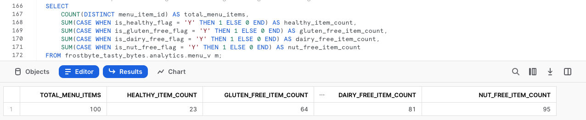

author: Jacob Kranzler
id: tasty-bytes-zero-to-snowflake-semi-structured-data-ptbr
categories: snowflake-site:taxonomy/solution-center/certification/quickstart, snowflake-site:taxonomy/product/data-engineering
language: en
summary: Quickstart Tasty Bytes: do zero ao Snowflake - dados semiestruturados
environments: web
status: Published 
feedback link: https://github.com/Snowflake-Labs/sfguides/issues

# Tasty Bytes: do zero ao Snowflake - dados semiestruturados
<!-- ------------------------ -->

## Processamento de dados semiestruturados no Snowflake

### Visão geral
Damos as boas-vindas ao quickstart “Powered by Tasty Bytes: do zero ao Snowflake”, voltado para o processamento de dados semiestruturados!

Neste quickstart, vamos aprender sobre o processamento de dados semiestruturados no Snowflake. Vamos aprofundar o conhecimento sobre o tipo de dados VARIANT, o processamento de dados semiestruturados em combinação de notação de pontos com nivelamento lateral, bem como a criação de exibições e gráficos no Snowsight.

Para obter mais informações sobre dados semiestruturados no Snowflake, consulte a documentação [visão geral de dados semiestruturados](https://docs.snowflake.com/pt/user-guide/semistructured-concepts).

### Pré-requisitos
- Antes de começar, é necessário ter concluído o [**Quickstart “Introdução à Tasty Bytes”**](/pt_br/developers/guides/tasty-bytes-introduction-ptbr/), que oferece um passo a passo para criar uma conta de avaliação gratuita e implementar os elementos básicos da Tasty Bytes necessários para completar este módulo.

### Você vai aprender
- O que é o tipo de dados VARIANT.
- Como usar notação de pontos para consultar dados semiestruturados.
- Como nivelar dados semiestruturados.
- Como analisar matrizes.
- Como criar um modo de exibição.
- Como criar um gráfico a partir de um conjunto de resultados no Snowsight.

### O que será desenvolvido
- Um processamento de dados semiestruturados de ponta a ponta.
- Uma modo de exibição harmonizado (Silver) e outro de análise de dados (Gold).
- Um gráfico de barras de nível executivo.

## Criação de uma planilha e cópia no código SQL

### Visão geral
Neste quickstart, vamos acompanhar a história da Tasty Bytes por meio de uma planilha SQL do Snowsight. Esta página servirá como um guia de referência completo com comentários adicionais, imagens e links para a documentação.

Nesta seção vamos mostrar como acessar o Snowflake, criar uma planilha nova, renomeá-la, copiar o código SQL do GitHub e colar o código SQL que usaremos neste quickstart.

### Etapa 1 - Acessar o Snowflake via URL
- Abra o navegador e insira a URL da sua conta Snowflake. 

### Etapa 2 - Fazer login no Snowflake
- Acesse sua conta Snowflake.
    - 

### Etapa 3 - Acessar as planilhas
- Clique na guia Worksheets na barra de navegação à esquerda.
    - 

### Etapa 4 - Criar uma planilha
- Dentro da guia Worksheets, clique no botão “+” no canto superior direito do Snowsight e escolha “SQL Worksheet”.
    - 

### Etapa 5 - Renomear uma planilha
- Renomeie a planilha clicando no carimbo de data/hora gerado automaticamente e digite “Tasty Bytes, dados semiestruturados”.
    - 

### Etapa 6 - Acessar o código SQL do quickstart no GitHub
- Clique no botão abaixo para acessar o arquivo SQL da Tasty Bytes hospedado no GitHub. <button>[tb_zts_semi_structured_data.sql](https://github.com/Snowflake-Labs/sf-samples/blob/main/samples/tasty_bytes/tb_zts_semi_structured_data.sql)</button>

### Etapa 7 - Copiar o Setup SQL do GitHub
- No GitHub, navegue para a direita e clique em “Copy raw contents”. Todas as informações SQL necessárias serão copiadas para sua área de transferência.
    - 

### Etapa 8 - Colar o Setup SQL do GitHub para a sua planilha do Snowflake
- Volte para o Snowsight e sua planilha recém-criada e cole (*CMD + V no Mac ou CTRL + V no Windows*) o conteúdo copiado do GitHub.

### Etapa 9 - Clicar em Next -->

## Criação dos perfis de dados semiestruturados do menu

### Visão geral
Enquanto engenheiros de dados da Tasty Bytes, recebemos a tarefa de criar o perfil dos nossos dados de menu, que incluem uma coluna de dados semiestruturados. A partir desta tabela de menu, precisamos criar uma exibição da camada de análise de dados que apresente as restrições alimentares e os ingredientes aos usuários finais.

### Etapa 1 - Definir o contexto e consultar a tabela
Para começar, vamos executar as três primeiras consultas juntas, que vão: 
- Definir o contexto de função para `tasty_data_engineer`. 
- Definir o contexto de armazenamento para `tasty_de_wh`. 
- Gerar um conjunto de resultados do tipo [TOP](https://docs.snowflake.com/pt/sql-reference/constructs/top_n) 10 da nossa tabela. `raw_pos.menu`

``` 
USE ROLE tasty_data_engineer; 
USE WAREHOUSE tasty_de_wh;

SELECT TOP 10 
    m.truck_brand_name, 
    m.menu_type, 
    m.menu_item_name, 
    m.menu_item_health_metrics_obj 
FROM frostbyte_tasty_bytes.raw_pos.menu m; 
```


No resultado, podemos ver que `menu_item_health_metrics_obj` deve mostrar os dados semiestruturados que contêm as métricas que precisamos fornecer mais adiante no processo. 

Ao clicar em uma das células nesta coluna, o Snowsight vai expandir automaticamente o painel de estatísticas para que vejamos melhor o conteúdo.


### Etapa 2 - Explorar a coluna de dados semiestruturados
Para analisar em mais detalhes como esta coluna é definida no Snowflake, execute a próxima consulta que usa [SHOW COLUMNS](https://docs.snowflake.com/pt/sql-reference/sql/show-columns) para descobrir os tipos de dados presentes na tabela `menu`.

```
SHOW COLUMNS IN frostbyte_tasty_bytes.raw_pos.menu;
```


Ao observar o conjunto de resultados, vamos notar que `menu_item_health_metrics_obj` é do tipo de dados [VARIANT](https://docs.snowflake.com/pt/sql-reference/data-types-semistructured).

>aside positive Para dados que são em sua maioria regulares e usam apenas tipos de dados nativos do formato semiestruturado que você está usando (por exemplo, cadeias de caracteres e inteiros no formato JSON), os requisitos de armazenamento e o desempenho de consulta para operações em dados relacionais e dados em uma coluna VARIANT são muito semelhantes.
>

### Etapa 3 - Percorrer dados semiestruturados usando a notação de pontos
Na coluna `menu_item_health_metrics_obj`, vimos que `menu_item_id` estava incluído entre os dados aninhados de ingredientes e restrições alimentares que precisamos acessar. 

Execute a consulta a seguir, em que começamos a usar a [notação de pontos](https://docs.snowflake.com/pt/user-guide/querying-semistructured#dot-notation) para percorrer os dados semiestruturados.

```
SELECT 
    m.menu_item_health_metrics_obj:menu_item_id AS menu_item_id,
    m.menu_item_health_metrics_obj:menu_item_health_metrics AS menu_item_health_metrics
FROM frostbyte_tasty_bytes.raw_pos.menu m;
```


Ao usar a notação de pontos, podemos extrair os dados completamente `menu_item_id`, mas parece que ainda há objetos semiestruturados no resultado da coluna `menu_item_health_metrics`. 

Vamos clicar novamente em uma das células da coluna para analisar melhor.


**Estamos progredindo!** Vamos ver como processar ainda mais a coluna `menu_item_health_metrics` na próxima seção usando funções adicionais do Snowflake.

### Etapa 4 - Clicar em Next -->

## Nivelamento de dados semiestruturados

### Visão geral
Depois de ver como é fácil consultar os dados semiestruturados em uma coluna Variant usando a notação de pontos, nosso engenheiro de dados da Tasty já pode fornecer os dados solicitados aos colaboradores internos.

Nesta seção, vamos realizar um processamento adicional dos dados semiestruturados para atender aos requisitos.

### Etapa 1 - Introdução ao nivelamento lateral
Para extrair da coluna `menu_item_health_metrics_obj` dados mais detalhados solicitados pelos usuários, execute a consulta a seguir. Ela usa a notação de pontos junto da função [FLATTEN](https://docs.snowflake.com/pt/sql-reference/functions/flatten) do Snowflake e o recurso [LATERAL JOIN](https://docs.snowflake.com/pt/sql-reference/constructs/join-lateral) para nos fornecer a primeira matriz `ingredient` solicitada.

>aside positive **Flatten:** é uma função de tabela que usa uma coluna VARIANT, OBJECT ou ARRAY para criar uma exibição lateral. Flatten pode ser usada para converter dados semiestruturados em uma representação relacional.
>
>**Lateral Join:** diferente do resultado de uma junção não lateral, o resultado de uma junção lateral inclui apenas as linhas geradas a partir da exibição em linha. Não é necessário unir as linhas do lado esquerdo às do lado direito, pois as linhas da esquerda já foram incluídas ao serem passadas para a exibição em linha. 
>

```
SELECT 
    m.menu_item_name,
    obj.value:"ingredients"::VARIANT AS ingredients
FROM frostbyte_tasty_bytes.raw_pos.menu m,
    LATERAL FLATTEN (input => m.menu_item_health_metrics_obj:menu_item_health_metrics) obj;
```


### Etapa 2 - Explorar de uma função de matriz
Antes de extrair os dados de restrições alimentares solicitados, execute a próxima consulta, que destaca as funções de matriz do Snowflake, que explorará a coluna `ingredients` em busca de qualquer `menu_item_name` que inclua “alface” (“lettuce”, se os dados estiverem em inglês) usando [ARRAY_CONTAINS](https://docs.snowflake.com/pt/sql-reference/functions/array_contains).

```
SELECT 
    m.menu_item_name,
    obj.value:"ingredients"::VARIANT AS ingredients
FROM frostbyte_tasty_bytes.raw_pos.menu m,
    LATERAL FLATTEN (input => m.menu_item_health_metrics_obj:menu_item_health_metrics) obj
WHERE ARRAY_CONTAINS('Lettuce'::VARIANT, obj.value:"ingredients"::VARIANT);
```


Com base nos resultados, vemos que muitos dos itens do menu contêm “alface” (“lettuce”). Esse tipo de análise pode ser bem útil para os gerentes de compras de cadeia de suprimentos no caso de recalls alimentares realizados em cidades e países onde atuamos.

### Etapa 3 - Estruturar dados semiestruturados em escala
Tendo acabado de ver o valor que podemos agregar à organização, é hora de executar a última consulta desta seção. 

Esta consulta vai usar a notação de pontos e combinar as funções de tabela LATERAL JOIN e FLATTEN para gerar o conjunto de resultados solicitado inicialmente.

```
SELECT 
    m.menu_item_health_metrics_obj:menu_item_id::integer AS menu_item_id,
    m.menu_item_name,
    obj.value:"ingredients"::VARIANT AS ingredients,
    obj.value:"is_healthy_flag"::VARCHAR(1) AS is_healthy_flag,
    obj.value:"is_gluten_free_flag"::VARCHAR(1) AS is_gluten_free_flag,
    obj.value:"is_dairy_free_flag"::VARCHAR(1) AS is_dairy_free_flag,
    obj.value:"is_nut_free_flag"::VARCHAR(1) AS is_nut_free_flag
FROM frostbyte_tasty_bytes.raw_pos.menu m,
    LATERAL FLATTEN (input => m.menu_item_health_metrics_obj:menu_item_health_metrics) obj;
```


**Maravilha!** O resultado parece atender exatamente aos requisitos solicitados por nossos colaboradores. Na seção a seguir veremos como levar os resultados à nossa camada de análise de dados, onde eles poderão ser acessados.

### Etapa 4 - Clicar em Next -->

## Criar modos de exibição estruturados com dados semiestruturados

### Visão geral
Na última seção, criamos uma consulta que fornece o resultado exato solicitado por usuários finais ao usar uma série de funcionalidades do Snowflake para dados semiestruturados. A seguir, vamos dar continuidade ao processo de promover essa consulta com base na camada bruta, passando pela camada harmonizada, até chegar à camada de análise de dados, para que os usuários finais possam ler os resultados.

**Observação:** aos usuários mais familiarizados com modelos de dados Bronze, Silver e Gold, podemos pensar na camada bruta como Bronze, a camada harmonizada como Silver e a de análise de dados como Gold.

### Etapa 1 - Criar um modo de exibição harmonizado com o SQL de nivelamento semiestruturado
Com base na consulta que encerrou a última seção, execute agora a próxima consulta que inclui este SQL e as colunas adicionais da tabela `menu` já estruturadas. 

Nessa consulta, usaremos [CREATE VIEW](https://docs.snowflake.com/pt/sql-reference/sql/create-view) em nosso esquema harmonizado para encapsular a lógica de processamento e colunas adicionais semiestruturadas como tabela.

>aside positive Um modo de exibição permite que o resultado de uma consulta seja acessado como se fosse uma tabela. As exibições têm muitas finalidades, incluindo combinação, separação e proteção de dados. 
>

```
CREATE OR REPLACE VIEW frostbyte_tasty_bytes.harmonized.menu_v
    AS
SELECT 
    m.menu_id,
    m.menu_type_id,
    m.menu_type,
    m.truck_brand_name,
    m.menu_item_health_metrics_obj:menu_item_id::integer AS menu_item_id,
    m.menu_item_name,
    m.item_category,
    m.item_subcategory,
    m.cost_of_goods_usd,
    m.sale_price_usd,
    obj.value:"ingredients"::VARIANT AS ingredients,
    obj.value:"is_healthy_flag"::VARCHAR(1) AS is_healthy_flag,
    obj.value:"is_gluten_free_flag"::VARCHAR(1) AS is_gluten_free_flag,
    obj.value:"is_dairy_free_flag"::VARCHAR(1) AS is_dairy_free_flag,
    obj.value:"is_nut_free_flag"::VARCHAR(1) AS is_nut_free_flag
FROM frostbyte_tasty_bytes.raw_pos.menu m,
    LATERAL FLATTEN (input => m.menu_item_health_metrics_obj:menu_item_health_metrics) obj;
```


Dentro da exibição `harmonized.menu_v` criada, agora é possível executar consultas sem usar o SQL complexo de antes. Considerando que a camada de análise de dados é onde nossos colaboradores acessam dados, o próximo passo é levar tudo até lá.

### Etapa 2 - Promover da camada de harmonização para a análise de dados com facilidade
Consultando o `harmonized.menu_v`, é hora de executar a próxima consulta que vai criar `analytics.menu_v` e agregar valor imediatamente ao processo. 

Nesta consulta, veremos algumas funções novas, ainda não abordadas. Primeiro adicionamos um [COMMENT](https://docs.snowflake.com/pt/sql-reference/sql/comment), que pode ser visto dentro do comando [SHOW VIEWS](https://docs.snowflake.com/pt/sql-reference/sql/show) ou na interface do Snowsight para documentar o que um usuário pode ver ao consultar essa exibição.

Também usaremos os parâmetros [SELECT * EXCLUDE e RENAME](https://docs.snowflake.com/pt/sql-reference/sql/select#parameters) que podem facilitar o trabalho dos desenvolvedores de SQL ao simplificar a definição de consultas e as exibições.

>aside positive **Exclude:** quando você seleciona todas as colunas (SELECT * ou SELECT table_name.\*), EXCLUDE especifica as colunas que devem ser excluídas dos resultados.
>
> **Rename:** ao selecionar todas as colunas (SELECT * ou SELECT table_name.\*), especifique os apelidos (alias) das colunas que devem ser usados nos resultados.
>


### Etapa 3 - Clicar em Next -->

## Análise de dados semiestruturados processados no Snowsight

### Visão geral
Com nossa exibição de menu disponível na camada de análise de dados, vamos executar algumas consultas que forneceremos aos usuários finais, demonstrando como o Snowflake permite uma experiência de consulta relacional sobre dados semiestruturados sem a necessidade de cópias adicionais ou processamento complexo.

### Etapa 1 - Analisar as matrizes
Na seção anterior, obtivemos a coluna `ingredients` como resultado da consulta. Agora, ela está disponível sem a necessidade de notação de pontos no modo de exibição `analytics.menu_v`. 

Com isso, execute a próxima consulta que emprega duas funções de matriz Snowflake adicionais [ARRAY_INTERSECTION](https://docs.snowflake.com/pt/sql-reference/functions/array_intersection) e [ARRAYS_OVERLAP](https://docs.snowflake.com/pt/sql-reference/functions/arrays_overlap) para verificar quais itens do menu não relacionados a bebidas coincidem em cada um dos menus de nossas marcas de food trucks.

```
SELECT 
    m1.menu_type,
    m1.menu_item_name,
    m2.menu_type AS overlap_menu_type,
    m2.menu_item_name AS overlap_menu_item_name,
    ARRAY_INTERSECTION(m1.ingredients, m2.ingredients) AS overlapping_ingredients
FROM frostbyte_tasty_bytes.analytics.menu_v m1
JOIN frostbyte_tasty_bytes.analytics.menu_v m2
    ON m1.menu_item_id <> m2.menu_item_id -- avoid joining the same menu item to itself
    AND m1.menu_type <> m2.menu_type 
WHERE 1=1
    AND m1.item_category <> 'Beverage' -- remove beverages
    AND m2.item_category <> 'Beverage' -- remove beverages
    AND ARRAYS_OVERLAP(m1.ingredients, m2.ingredients) -- evaluates to TRUE if one ingredient is in both arrays
ORDER BY m1.menu_type;
```


De novo, ao utilizar o mesmo modo de exibição, criamos esse tipo de consulta capaz de agregar valor real de negócios aos operadores de food trucks, pois eles poderiam à medida que trabalham com o setor de compras prever e fazer pedidos de ingredientes semanais.

### Etapa 2 - Fornecer métricas aos executivos
Agora vamos ver como ajudar os executivos da Tasty Bytes a tomarem decisões baseadas em dados para os menus ao fornecer métricas de alto nível relativas às restrições alimentares que utilizamos atualmente em nossas marcas.

Execute a consulta a seguir, que usa [COUNT](https://docs.snowflake.com/pt/sql-reference/functions/count), [SUM](https://docs.snowflake.com/pt/sql-reference/functions/sum) e instruções condicionais [CASE](https://docs.snowflake.com/pt/sql-reference/functions/case) para agregar a métricas exigidas do `analytics.menu_v`.

```
SELECT
    COUNT(DISTINCT menu_item_id) AS total_menu_items,
    SUM(CASE WHEN is_healthy_flag = 'Y' THEN 1 ELSE 0 END) AS healthy_item_count,
    SUM(CASE WHEN is_gluten_free_flag = 'Y' THEN 1 ELSE 0 END) AS gluten_free_item_count,
    SUM(CASE WHEN is_dairy_free_flag = 'Y' THEN 1 ELSE 0 END) AS dairy_free_item_count,
    SUM(CASE WHEN is_nut_free_flag = 'Y' THEN 1 ELSE 0 END) AS nut_free_item_count
FROM frostbyte_tasty_bytes.analytics.menu_v m;
```



Com o resultado obtido, saímos de uma tabela bruta com dados semiestruturados para uma única linha agregada facilmente acessível a qualquer usuário da organização, dando autonomia à Tasty Bytes para que se baseie cada vez mais em dados. 


### Etapa 3 - Transformar os resultados em gráficos
Alguns executivos da Tasty Bytes preferem representações visuais dos dados. Então, vamos ver como é simples transformar tabelas em gráficos de fácil compreensão dentro do Snowsight. 

Execute a próxima consulta que vai adicionar filtros a três de nossas marcas de food trucks ao SQL executado anteriormente.

```
SELECT
    m.brand_name,
    SUM(CASE WHEN is_gluten_free_flag = 'Y' THEN 1 ELSE 0 END) AS gluten_free_item_count,
    SUM(CASE WHEN is_dairy_free_flag = 'Y' THEN 1 ELSE 0 END) AS dairy_free_item_count,
    SUM(CASE WHEN is_nut_free_flag = 'Y' THEN 1 ELSE 0 END) AS nut_free_item_count
FROM frostbyte_tasty_bytes.analytics.menu_v m
WHERE m.brand_name IN  ('Plant Palace', 'Peking Truck','Revenge of the Curds')
GROUP BY m.brand_name;
```


Por padrão, o Snowsight exibe os resultados em formato tabular. Porém, um recurso avançado do Snowsight, que ainda não abordamos, é o de [uso de gráficos](https://docs.snowflake.com/pt/user-guide/ui-snowsight-visualizations#using-charts).

Na captura de tela abaixo, siga as setas para criar seu próprio gráfico de barras comparando estas diferentes marcas de food trucks em termos de itens do menu que atendem a certas restrições alimentares.


Para terminar esse quickstart, devemos ressaltar a facilidade com que um executivo da Tasty Bytes poderia fazer esse tipo de análise sozinho sem precisar conhecer processamento de dados semiestruturados que encapsulamos nas exibições criadas. Sendo assim, podemos estar certos de que estamos contribuindo para a democratização dos dados na Tasty Bytes.

### Etapa 4 - Clicar em Next -->

## Conclusão e próximas etapas

### Conclusão
Ótimo trabalho! Você concluiu com sucesso o quickstart “Tasty Bytes: do zero ao Snowflake - dados semiestruturados”. 

Neste módulo, você: 
- Aprendeu o que são os dados do tipo Variant.
- Usou a notação de pontos para consultar dados semiestruturados. 
- Nivelou dados semiestruturados. 
- Analisou matrizes.
- Criou dois modos de exibição. 
- Criou um gráfico a partir de um conjunto de resultados no Snowsight.

Caso queira refazer este quickstart, use os scripts de Reset que aparecem no final da planilha associada.

### Próximas etapas
Para continuar sua jornada no Snowflake Data Cloud, clique no link abaixo para ver mais quickstarts Powered By Tasty Bytes disponíveis para você.

- ### [Powered by Tasty Bytes - Índice de quickstarts](/pt_br/developers/guides/tasty-bytes-introduction-ptbr/)
