author: Jacob Kranzler
id: tasty-bytes-zero-to-snowflake-semi-structured-data
categories: snowflake-site:taxonomy/solution-center/certification/quickstart, snowflake-site:taxonomy/product/data-engineering
language: en
summary: Tasty Bytes - Zero to Snowflake - Semi-Structured Data Quickstart
environments: web
status: Hidden 
feedback link: https://github.com/Snowflake-Labs/sfguides/issues

# Tasty Bytes - Zero to Snowflake - Semi-Structured Data
<!-- ------------------------ -->

## Semi-Structured Data Processing in Snowflake


### Overview
Welcome to the Powered by Tasty Bytes - Zero to Snowflake Quickstart focused on Semi-Structured Data Processing!

Within this Quickstart, we will learn about processing Semi-Structured Data in Snowflake by diving into the VARIANT Data Type, Semi-Structured Data Processing combining Dot Notation and Lateral Flattening as well as View Creation and Snowsight Charting.

For more detail on Semi-Structured Data in Snowflake please visit the [Semi-Structured Data Overview documentation](https://docs.snowflake.com/en/user-guide/semistructured-concepts)

### Prerequisites
- Before beginning, please make sure you have completed the [**Introduction to Tasty Bytes Quickstart**](/en/developers/guides/tasty-bytes-introduction/) which provides a walkthrough on setting up a trial account and deploying the Tasty Bytes Foundation required to complete this Quickstart.

### What You Will Learn
- What a Variant Data Type is
- How to Use Dot Notation to Query Semi-Structured Data
- How to Flatten Semi-Structured Data
- How to Analyze Arrays
- How to Create a View
- How to Build a Chart from a Result Set in Snowsight

### What You Will Build
- An End to End Semi-Structured Data Process
- A Harmonized (Silver) and Analytics (Gold) View
- An Executive-Worthy Bar Chart

## Creating a Worksheet and Copying in our SQL

### Overview
Within this Quickstart we will follow a Tasty Bytes themed story via a Snowsight SQL Worksheet with this page serving as a side by side guide complete with additional commentary, images and documentation links.

This section will walk you through logging into Snowflake, Creating a New Worksheet, Renaming the Worksheet, Copying SQL from GitHub, and Pasting the SQL we will be leveraging within this Quickstart.

### Step 1 - Accessing Snowflake via URL
- Open a browser window and enter the URL of your Snowflake Account 

### Step 2 - Logging into Snowflake
- Log into your Snowflake account.

### Step 3 - Navigating to Worksheets
- Click on the Projects Tab in the left-hand navigation bar and click Worksheets.

### Step 4 - Creating a Worksheet
- Within Worksheets, click the "+" button in the top-right corner of Snowsight.

### Step 5 - Renaming a Worksheet
- Rename the Worksheet by clicking on the auto-generated Timestamp name and inputting "Tasty Bytes - Semi-Structured Data"

### Step 6 - Accessing Quickstart SQL in GitHub
- Click the button below which will direct you to our Tasty Bytes SQL file that is hosted on GitHub.
<button>[tb_zts_semi_structured_data.sql](https://github.com/Snowflake-Labs/sf-samples/blob/main/samples/tasty_bytes/FY25_Zero_To_Snowflake/tb_semi_structured_data.sql)</button>

### Step 7 - Copying Setup SQL from GitHub
- Within GitHub navigate to the right side and click "Copy raw contents". This will copy all of the required SQL into your clipboard.
    - 

### Step 8 - Pasting Setup SQL from GitHub into your Snowflake Worksheet
- Path back to Snowsight and your newly created Worksheet and Paste (*CMD + V for Mac or CTRL + V for Windows*) what we just copied from GitHub.

### Step 9 - Click Next -->

## Semi-Structured Data and the Variant Data Type

### Overview
As a Tasty Bytes Data Engineer, we have been tasked with profiling our Menu data that includes a Semi-Structured Data column. From this menu table we need to produce an Analytics layer View that exposes Dietary and Ingredient data to our end users.

### Step 1 - Setting our Context and Querying our Table
To begin, let's execute the first three queries together which will:
- Set the Role context to `tb_data_engineer`
- Set the Warehouse context to `tb_de_wh`
- Set the Database context to `tb_101`
- Produce a [TOP](https://docs.snowflake.com/en/sql-reference/constructs/top_n) 10 Result Set of our `raw_pos.menu` table

```
USE ROLE tb_data_engineer;
USE WAREHOUSE tb_de_wh;
USE DATABASE tb_101;

SELECT TOP 10
    truck_brand_name,
    menu_type,
    menu_item_name,
    menu_item_health_metrics_obj
FROM raw_pos.menu;
```

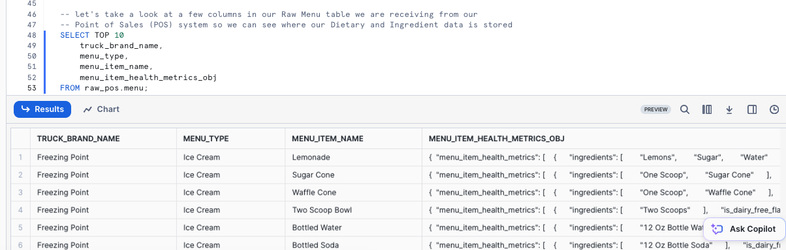

Within our output, we can see that the `menu_item_health_metrics_obj` must be the Semi-Structured Data we were told contained the metrics we need to provide downstream. 


### Step 2 - Exploring our Semi-Structured Column
To dive deeper into how this column in defined in Snowflake, please run the next query where we leverage [SHOW COLUMNS](https://docs.snowflake.com/en/sql-reference/sql/show-columns) to explore the Data Types present in our `menu` table.

```
SHOW COLUMNS IN raw_pos.menu;
```

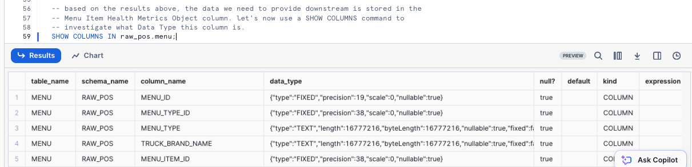

Looking at our result set, we see the `menu_item_health_metrics_obj` is a [VARIANT](https://docs.snowflake.com/en/sql-reference/data-types-semistructured) Data Type.

>aside positive
>For data that is mostly regular and uses only data types that are native to the semi-structured format you are using (e.g. strings and integers for JSON format), the storage requirements and query performance for operations on relational data and data in a VARIANT column is very similar.
>

### Step 3 - Click Next -->

##  Querying Semi-Structured Data via Dot and Bracket Notation + Flatten

### Overview
Within our `menu_item_health_metrics_obj` column, we saw that `menu_item_id` was included alongside the more nested Ingredients and Dietary Restriction data we need to access. 

### Step 1 - Extract First Level Elements
Please execute the next query where we begin to leverage [Dot Notation](https://docs.snowflake.com/en/user-guide/querying-semistructured#dot-notation) to traverse our Semi-Structured data.

```
SELECT
    menu_item_health_metrics_obj:menu_item_id AS menu_item_id,
    menu_item_health_metrics_obj:menu_item_health_metrics AS menu_item_health_metrics
FROM raw_pos.menu;
```

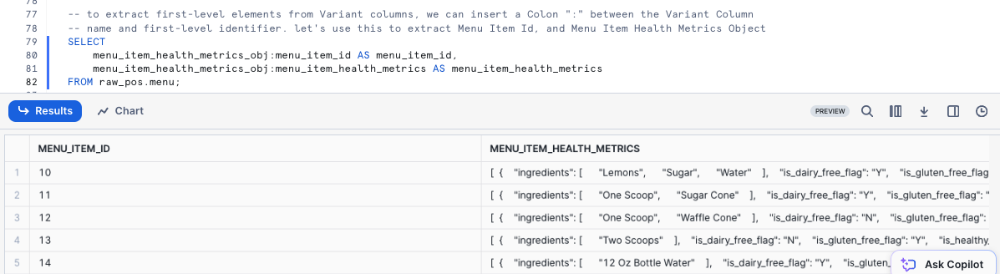

Using Dot Notation we were able to successfully extract `menu_item_id` in full, but look to still be left with additional semi-structured objects in the `menu_item_health_metrics` column output. 


### Step 2 - Flattening with Dot Notation
To convert Semi-Structured data to a relational representation we can use [FLATTEN](https://docs.snowflake.com/en/sql-reference/functions/flatten) function and [LATERAL JOIN](https://docs.snowflake.com/en/sql-reference/constructs/join-lateral) with either Dot or Bracket Notation.

Let's first use Dot Notation to extract our Ingredients into an Array Column by executing the next query.

```
SELECT
    m.menu_item_name,
    m.menu_item_health_metrics_obj:menu_item_id AS menu_item_id,
    obj.value:"ingredients"::ARRAY AS ingredients
FROM raw_pos.menu m, 
    LATERAL FLATTEN (input => m.menu_item_health_metrics_obj:menu_item_health_metrics) obj
ORDER BY menu_item_id;
```

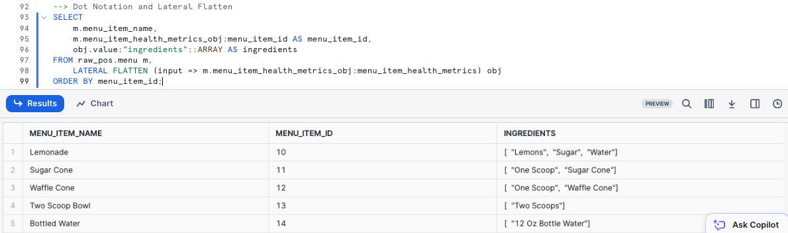

>aside positive
> **Flatten:** is a table function that takes a VARIANT, OBJECT, or ARRAY column and produces a lateral view. Flatten can be used to convert semi-structured data to a relational representation.
>
>**Lateral Join:** Unlike the output of a non-lateral join, the output from a lateral join includes only the rows generated from the inline view. The rows on the left-hand side do not need to be joined to the right hand side because the rows on the left-hand side have already been taken into account by being passed into the inline view. 


### Step 3 - Flattening with Bracket Notation
Let's now use Bracket Notation to extract our Ingredients into an Array Column by executing the next query.

```
SELECT
    m.menu_item_name,
    m.menu_item_health_metrics_obj['menu_item_id'] AS menu_item_id,
    obj.value['ingredients']::ARRAY AS ingredients
FROM raw_pos.menu m,
    LATERAL FLATTEN (input => m.menu_item_health_metrics_obj:menu_item_health_metrics) obj
ORDER BY menu_item_id;
```

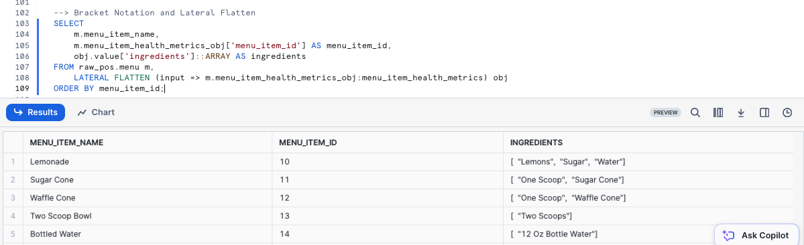


### Step 4 - Extracting Dietary Columns with Dot Notation
Let's first extract the remaining Dietary Columns using both Dot Notation alongside the Ingredients Array.

```
SELECT
    m.menu_item_health_metrics_obj:menu_item_id AS menu_item_id,
    m.menu_item_name,
    obj.value:"ingredients"::VARIANT AS ingredients,
    obj.value:"is_healthy_flag"::VARCHAR(1) AS is_healthy_flag,
    obj.value:"is_gluten_free_flag"::VARCHAR(1) AS is_gluten_free_flag,
    obj.value:"is_dairy_free_flag"::VARCHAR(1) AS is_dairy_free_flag,
    obj.value:"is_nut_free_flag"::VARCHAR(1) AS is_nut_free_flag
FROM raw_pos.menu m,
    LATERAL FLATTEN (input => m.menu_item_health_metrics_obj:menu_item_health_metrics) obj;
```

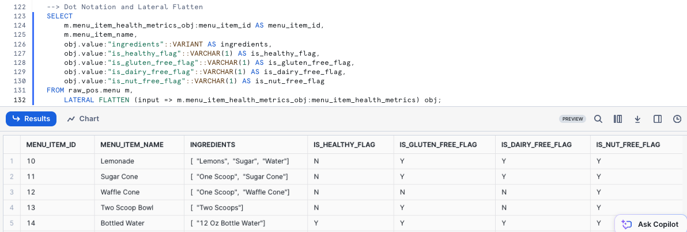

### Step 5 - Extracting Dietary Columns with Bracket Notation
Let's now extract the remaining Dietary Columns using both Dot Notation alongside the Ingredients Array.

```
SELECT
    m.menu_item_health_metrics_obj['menu_item_id'] AS menu_item_id,
    m.menu_item_name,
    obj.value['ingredients']::VARIANT AS ingredients,
    obj.value['is_healthy_flag']::VARCHAR(1) AS is_healthy_flag,
    obj.value['is_gluten_free_flag']::VARCHAR(1) AS is_gluten_free_flag,
    obj.value['is_dairy_free_flag']::VARCHAR(1) AS is_dairy_free_flag,
    obj.value['is_nut_free_flag']::VARCHAR(1) AS is_nut_free_flag
FROM raw_pos.menu m,
    LATERAL FLATTEN (input => m.menu_item_health_metrics_obj:menu_item_health_metrics) obj;
```

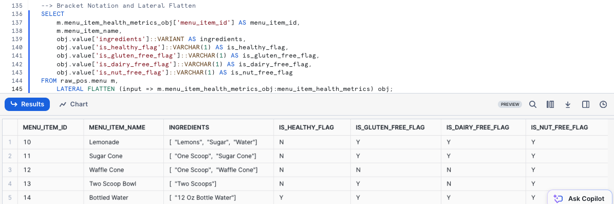


### Step 6 - Click Next -->


## Providing Flattened Data to Business Users

### Overview
With all of the required data, extracted, flattened and available in tabular form, we will now work to provide access to our Business Users.

Within this step, we will promote a full output of the Menu table with the flattened columns to Views in our Harmonized and Analytics layers.

If you are more familiar with Medallion Architectures, we can think of the Harmonized layer as Silver and the Analytics layer as Gold.

### Step 1 - Harmonized/Silver Layer View
To begin, let's add columns to our previous Dot Notation query and leverage it within a new Menu View in our Harmonized or Silver layer. This query will provide a `View MENU_V successfully created` result.

```
CREATE OR REPLACE VIEW harmonized.menu_v
COMMENT = 'Menu level metrics including Truck Brands and Menu Item details including Cost, Price, Ingredients and Dietary Restrictions'
    AS
SELECT
    m.menu_id,
    m.menu_type_id,
    m.menu_type,
    m.truck_brand_name,
    m.menu_item_health_metrics_obj:menu_item_id::integer AS menu_item_id,
    m.menu_item_name,
    m.item_category,
    m.item_subcategory,
    m.cost_of_goods_usd,
    m.sale_price_usd,
    obj.value:"ingredients"::VARIANT AS ingredients,
    obj.value:"is_healthy_flag"::VARCHAR(1) AS is_healthy_flag,
    obj.value:"is_gluten_free_flag"::VARCHAR(1) AS is_gluten_free_flag,
    obj.value:"is_dairy_free_flag"::VARCHAR(1) AS is_dairy_free_flag,
    obj.value:"is_nut_free_flag"::VARCHAR(1) AS is_nut_free_flag
FROM raw_pos.menu m,
    LATERAL FLATTEN (input => m.menu_item_health_metrics_obj:menu_item_health_metrics) obj;
```

### Step 2 - Analytics/Gold Layer View
With the Harmonized View containing the flattening logic in place, let's now promote the data to the Analytics Schema where our various Business Users will be able to access it by running the next query. This query will provide a `View MENU_V successfully created` result.

```
CREATE OR REPLACE VIEW analytics.menu_v
COMMENT = 'Menu level metrics including Truck Brands and Menu Item details including Cost, Price, Ingredients and Dietary Restrictions'
    AS
SELECT
    *
    EXCLUDE (menu_type_id) --exclude MENU_TYPE_ID
    RENAME (truck_brand_name AS brand_name) -- rename TRUCK_BRAND_NAME to BRAND_NAME
FROM harmonized.menu_v;
```

> aside positive
> **Exclude:** specifies the columns that should be excluded from the results of a SELECT * statement.
> **Rename:** specifies the column aliases that should be used in the results of a SELECT * statement.
>

### Step 3 - Querying our Downstream View
Before moving on, let's use our view to take a look at the results for our Better Off Bread brand.

```
SELECT 
    brand_name,
    menu_item_name,
    sale_price_usd,
    ingredients,
    is_healthy_flag,
    is_gluten_free_flag,
    is_dairy_free_flag,
    is_nut_free_flag
FROM analytics.menu_v
WHERE brand_name = 'Better Off Bread';
```


### Step 4 - Grant Access to our Developers
To conclude this step, lets now grant our Developer the ability to run SELECT statements against this view. This query will provide a `Statement executed successfully.` result set.

```
GRANT SELECT ON analytics.menu_v TO ROLE tb_dev;
```

### Step 5 - Click Next --->


## Analyzing Processed Semi-Structured Data in Snowsight

### Overview:
With our Menu View available in our Analytics layer, let's now jump into the life of a Tasty Bytes Developer. Within this step, we will address questions from  the the Tasty Bytes Leadership Team related to our Food Truck Menu's.
 
Along the way we will see how Snowflake can provide a relational query experience over Semi-Structured data without having to make additional copies or conduct any complex data transformations.

### Step 1 - Exploring an Array Function
Before we extract the requested Dietary data, please kick off the next query which highlights a Snowflake Array Functions, which will explore the `ingredients` column for any `menu_item_name` that includes Lettuce by leveraging [ARRAY_CONTAINS](https://docs.snowflake.com/en/sql-reference/functions/array_contains).

```
USE ROLE tb_dev;
USE WAREHOUSE tb_dev_wh;

SELECT
    m.menu_item_id,
    m.menu_item_name,
    m.ingredients
FROM analytics.menu_v m
WHERE ARRAY_CONTAINS('Lettuce'::VARIANT, m.ingredients);
```

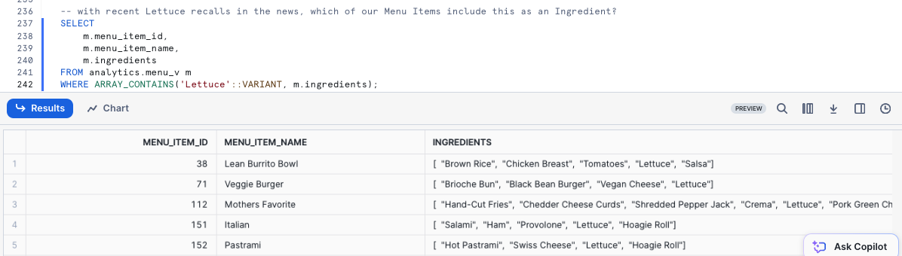

Based on our output, we see that quite a few of our Menu Items include Lettuce. This sort of analysis would be extremely valuable for our Supply Chain Procurement Managers in the event of any food related recalls in the cities and countries we support.


### Step 2 - Array Overlap Analysis
Adding on additional Array functions: [ARRAY_INTERSECTION](https://docs.snowflake.com/en/sql-reference/functions/array_intersection), [ARRAY_OVERLAP](https://docs.snowflake.com/en/sql-reference/functions/arrays_overlap) and [ARRAY_SIZE](https://docs.snowflake.com/en/sql-reference/functions/array_size), let's now find which Menu Items across Menu Types contain overlapping Ingredients and are those Ingredients?

```
SELECT
    m1.brand_name,
    m1.menu_item_name,
    m2.brand_name AS overlap_brand,
    m2.menu_item_name AS overlap_menu_item_name,
    ARRAY_INTERSECTION(m1.ingredients, m2.ingredients) AS overlapping_ingredients
FROM analytics.menu_v m1
JOIN analytics.menu_v m2
    ON m1.menu_item_id <> m2.menu_item_id -- avoid joining the same menu item to itself
    AND m1.menu_type <> m2.menu_type
WHERE 1=1
    AND m1.item_category  <> 'Beverage' -- remove beverages
    AND ARRAYS_OVERLAP(m1.ingredients, m2.ingredients) -- return only those that overlap
ORDER BY ARRAY_SIZE(overlapping_ingredients) DESC; -- order by largest number of overlapping ingredients
```

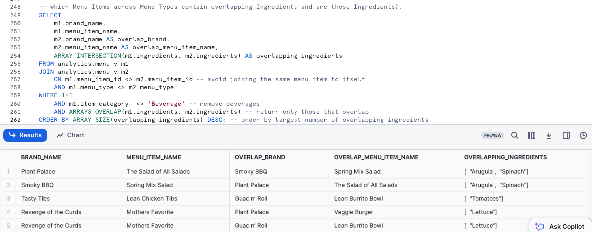

> aside positive
> **Array_intersection:** Returns an array that contains the matching elements in the two input arrays.
> **Arrays_overlap:** Compares whether two arrays have at least one element in common
> **Array_size:** Returns the size of the input array
> 


### Step 3 - Providing Metrics to Executives
Now let's take a look at assisting our Tasty Bytes Executives make data driven Menu decisions by providing high-level metrics surrounding the dietary restrictions we are currently addressing across our brands.

Please execute the next query which utilizes [COUNT](https://docs.snowflake.com/en/sql-reference/functions/count), [SUM](https://docs.snowflake.com/en/sql-reference/functions/sum) and conditional [CASE](https://docs.snowflake.com/en/sql-reference/functions/case) statements to aggregate the required metrics from our `analytics.menu_v`.

```
SELECT
    COUNT(DISTINCT menu_item_id) AS total_menu_items,
    SUM(CASE WHEN is_gluten_free_flag = 'Y' THEN 1 ELSE 0 END) AS gluten_free_item_count,
    SUM(CASE WHEN is_dairy_free_flag = 'Y' THEN 1 ELSE 0 END) AS dairy_free_item_count,
    SUM(CASE WHEN is_nut_free_flag = 'Y' THEN 1 ELSE 0 END) AS nut_free_item_count
FROM analytics.menu_v m;
```

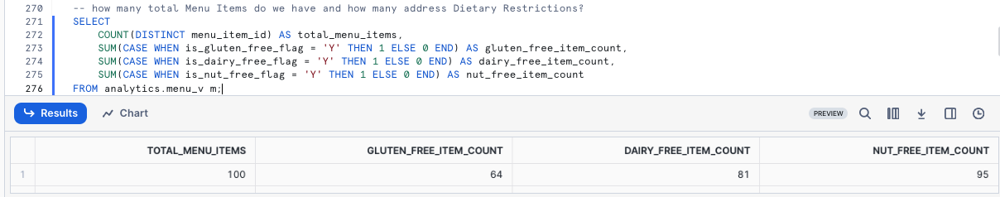

With the output we just recieved we have successfully went from a Raw table containing Semi-Structured Data to a single, aggregate row that can easily be accessed by anyone in our organization to empower Tasty Bytes to be more data driven. 


### Step 4 - Turning Results to Charts
As some of our Tasty Bytes Executives prefer visual representations of data, let's now look at how easy it is to turn tabular results into easy to digest visual charts within Snowsight. 

Please execute the next query now which adds filters on three of our Truck Brands Names to the SQL we ran previously.

```
SELECT
    m.brand_name,
    SUM(CASE WHEN is_gluten_free_flag = 'Y' THEN 1 ELSE 0 END) AS gluten_free_item_count,
    SUM(CASE WHEN is_dairy_free_flag = 'Y' THEN 1 ELSE 0 END) AS dairy_free_item_count,
    SUM(CASE WHEN is_nut_free_flag = 'Y' THEN 1 ELSE 0 END) AS nut_free_item_count
FROM analytics.menu_v m
WHERE m.brand_name IN ('Plant Palace', 'Peking Truck','Revenge of the Curds')
GROUP BY m.brand_name;
```

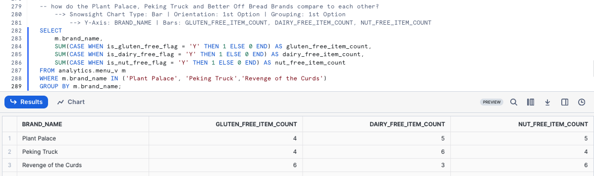

By default, Snowsight returns our query results in tabular form. However one powerful Snowsight feature we have not covered yet is [Using Charts](https://docs.snowflake.com/en/user-guide/ui-snowsight-visualizations#using-charts)

Please now click the Chart Button and create a Bar Chart.

- Snowsight Chart Type: Bar
- Orientation: 1st Option
- Grouping: 1st Option
- Y-Axis: BRAND_NAME
- Bars: GLUTEN_FREE_ITEM_COUNT, DAIRY_FREE_ITEM_COUNT, NUT_FREE_ITEM_COUNT


To finish off this Quickstart, we must point out how easy a Tasty Bytes Executive could do this sort of analysis on their own without ever needing to know about the Semi-Structured Data Processing we have encapsulated in the Views we built. With all of this we can rest assured that we are assisting in driving the democratization of data in our Tasty Bytes Organization.

### Step 5 - Click Next -->

## Conclusion and Next Steps

### Conclusion
Fantastic work! You have successfully completed the Tasty Bytes - Zero to Snowflake - Semi-Structured Data Quickstart. 

By doing so you have now:
- Learned what a Variant Data Type is
- Used Dot and Bracket Notation to Query Semi-Structured Data
- Flattened Semi-Structured Data
- Analyzed Arrays
- Created Two Views
- Built a Chart from a Result Set in Snowsight

If you would like to re-run this Quickstart please leverage the Reset scripts in the bottom of your associated Worksheet.

### Next Steps
To continue your journey in the Snowflake AI Data Cloud, please now visit the link below to see all other Powered by Tasty Bytes - Quickstarts available to you.

- ### [Powered by Tasty Bytes - Quickstarts Table of Contents](/en/developers/guides/tasty-bytes-introduction/)
