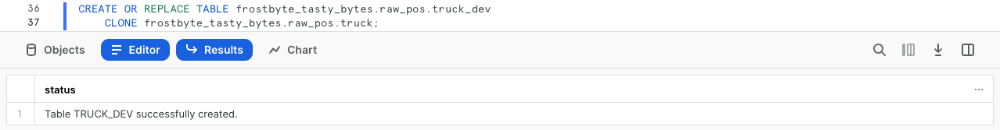
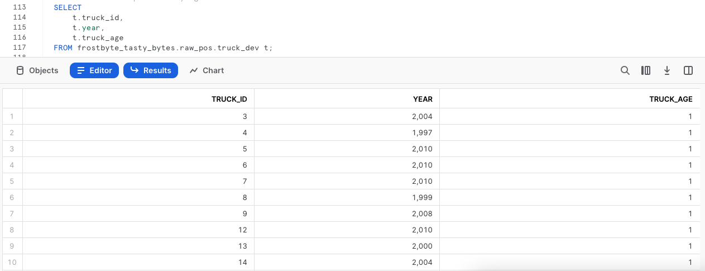
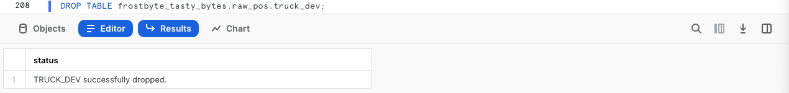

author: Jacob Kranzler
id: tasty-bytes-zero-to-snowflake-transformation-es
categories: snowflake-site:taxonomy/solution-center/certification/quickstart, snowflake-site:taxonomy/product/platform, snowflake-site:taxonomy/product/data-engineering
language: es
summary: Tasty Bytes - De cero a Snowflake - Transformación
environments: web
status: Published 
feedback link: https://github.com/Snowflake-Labs/sfguides/issues

# Tasty Bytes - De cero a Snowflake - Transformación
<!-- ------------------------ -->

## Transformación en Snowflake

### Descripción general
Te damos la bienvenida a la quickstart guide Tasty Bytes - De cero a Snowflake centrada en la transformación.

En esta quickstart guide veremos un gran número de funcionalidades de Snowflake que abarcan funciones clave como Zero Copy Cloning y Time Travel para cumplir un requisito empresarial de Tasty Bytes.

### Requisitos previos
- Antes de empezar, asegúrate de haber completado la [**quickstart guide Introducción a Tasty Bytes**](/es/developers/guides/tasty-bytes-introduction-es/), donde aprenderás a configurar una cuenta de prueba y a implementar los conceptos esenciales de Tasty Bytes necesarios para completar esta quickstart guide.

### Contenido que se enseñará
- Cómo clonar una tabla
- Cómo usar la caché de un conjunto de resultados de Snowflake
- Cómo añadir una columna a una tabla
- Cómo actualizar datos en una columna
- Cómo utilizar Time Travel
- Cómo cambiar, borrar y recuperar una tabla

### Cosas que podrás conseguir
- Comprender la importante funcionalidad de transformación de Snowflake 
- Clonar una tabla de desarrollo a partir de una tabla de producción
- Crear una nueva columna en una tabla completa con la antigüedad calculada de los food trucks expresada en años


## Creación de una hoja de trabajo y copia en SQL

### Descripción general
En esta quickstart guide se narra una historia de Tasty Bytes mediante una hoja de trabajo SQL en Snowsight. Esta página servirá de guía completa paralela con comentarios adicionales, imágenes y enlaces a la documentación.

En esta sección te explicaremos cómo iniciar sesión en Snowflake, crear una nueva hoja de trabajo, cambiar el nombre de la hoja de trabajo, copiar SQL de GitHub y pegar el que utilizaremos en esta quickstart guide.

### Paso 1: acceder a Snowflake con la URL
- Abre una ventana del navegador e introduce la URL de tu cuenta de Snowflake. 

### Paso 2: iniciar sesión en Snowflake
- Inicia sesión en tu cuenta de Snowflake.
    - 

### Paso 3: acceder a las hojas de trabajo
- Haz clic en la pestaña Worksheets en la barra de navegación situada a la izquierda para acceder a las hojas de trabajo.
    - 

### Paso 4: crear una hoja de trabajo
- En la pestaña Worksheets, haz clic en el botón “+” en la esquina superior derecha de Snowsight y elige “SQL Worksheet”.
    - 

### Paso 5: cambiar el nombre de una hoja de trabajo
- Cambia el nombre de la hoja de trabajo haciendo clic en el nombre generado automáticamente (marca de tiempo) y escribe “Tasty Bytes - Transformation”
    - 

### Paso 6: acceder a la quickstart guide de SQL en GitHub
- Haz clic en el botón que aparece a continuación. Te redirigirá a nuestro archivo SQL de Tasty Bytes alojado en GitHub. <button>[tb_zts_transformation](https://github.com/Snowflake-Labs/sf-samples/blob/main/samples/tasty_bytes/tb_zts_transformation.sql)</button>

### Paso 7: copiar el código SQL de configuración de GitHub
- En GitHub, ve al lado derecho y haz clic en “Copy raw contents”. De esta forma, se copiará todo el código SQL necesario en el portapapeles.
    - 

### Paso 8: pegar el código SQL de configuración de GitHub en tu hoja de trabajo de Snowflake
- Vuelve a la hoja de trabajo que acabas de crear en Snowsight y pega (*CMD + V para Mac o CTRL + V para Windows*) lo que has copiado de GitHub.

### Paso 9: hacer clic en Next -->

## Clonación instantánea de tablas de producción para desarrollo

### Descripción general
Como parte del análisis de la flota de food trucks de Tasty Bytes, nuestro desarrollador se ha encargado de añadir una columna con la antigüedad calculada de cada vehículo en nuestra tabla de food trucks. 
 
Como buenos desarrolladores que somos, sabemos que no podemos desarrollar en una tabla de producción. Primero, tenemos que crear un entorno de desarrollo que imite al de producción.

### Paso 1: crear un clon de la tabla de producción
Gracias a la arquitectura única de Snowflake, podemos crear al momento una instantánea de nuestra producción `raw_pos.truck` con la función [CLONE](https://docs.snowflake.com/en/sql-reference/sql/create-clone) y llamarla `raw_pos.truck_dev`.

Ahora, vamos a ejecutar nuestro siguiente conjunto de consultas para configurar el contexto del rol de `tasty_dev` y crear un clon de la tabla. Hay que tener en cuenta que en este caso no es necesario establecer un contexto de almacén, ya que la clonación no requiere uno.

``` 
USE ROLE tasty_dev;

CREATE OR REPLACE TABLE frostbyte_tasty_bytes.raw_pos.truck_dev 
    CLONE frostbyte_tasty_bytes.raw_pos.truck; 
``` 


> **Zero Copy Cloning**: crea una copia de una base de datos, de un esquema o de una tabla. Al crear el clon, se toma una instantánea de los datos presentes en el objeto de origen y esta se pone a disposición del objecto clonado. El objeto clonado permite la escritura y es independiente de su origen. Es decir, los cambios hechos en el objeto de origen y en el objeto clonado son independientes. 
>

### Paso 2: hacer clic en Next -->

## Prueba de la caché del conjunto de resultados de consulta de Snowflake

### Descripción general
Con nuestro clon de Zero Copy Cloning disponible al instante, ya podemos empezar a desarrollar en él sin miedo a que esto afecte a la tabla de producción. Sin embargo, antes de hacer ningún cambio, vamos a ejecutar un par de consultas simples en él y a probar la caché del conjunto de resultados de Snowflake.

### Paso 1: ejecutar consultas en la tabla clonada
Ahora que vamos a ejecutar consultas en la tabla, necesitaremos utilizar el almacén `tasty_dev_wh`. 

Vamos a ejecutar las dos siguientes consultas con la segunda sentencia para producir un conjunto de resultados que muestren nuestros food trucks, su antigüedad, marca y modelo, asegurándonos de que ordenamos la columna `truck_id` gracias al comando [ORDER BY](https://docs.snowflake.com/en/sql-reference/constructs/order-by).

``` 
USE WAREHOUSE tasty_dev_wh;

SELECT 
    t.truck_id, 
    t.year, 
    t.make, 
    t.model 
FROM frostbyte_tasty_bytes.raw_pos.truck_dev t 
ORDER BY t.truck_id; 
```


### Paso 2: ejecutar la consulta de nuevo
Para probar la [caché de conjunto de resultados](https://docs.snowflake.com/en/user-guide/querying-persisted-results) de Snowflake, la consulta que vamos a ejecutar será idéntica a la anterior. Sin embargo, ahora iremos un paso más allá y accederemos a Query Profile para comprobar si la consulta ha devuelto los resultados al instante porque los obtuvo de la caché de conjunto de resultados.

Después de ejecutar la consulta que se muestra a continuación, sigue los pasos indicados en la captura de pantalla para acceder a [Query Profile](https://docs.snowflake.com/en/user-guide/ui-query-profile). En Query Profile veremos un único nodo que indica `QUERY RESULT REUSE`.

```
SELECT
    t.truck_id,
    t.year,
    t.make,
    t.model
FROM frostbyte_tasty_bytes.raw_pos.truck_dev t
ORDER BY t.truck_id;
```

 

>aside positive Si un usuario repite una consulta que ya se ha ejecutado y los datos en las tablas no se han modificado desde la última vez que se ejecutó, el resultado de la consulta será el mismo. En lugar de volver a ejecutar la consulta, Snowflake simplemente devuelve el mismo resultado que había devuelto previamente. 
>         
>De esta forma, se reduce sustancialmente el tiempo de consulta, ya que Snowflake evita que se ejecute de nuevo la consulta y, en su lugar, recupera el resultado directamente de la caché.
>

### Paso 3: hacer clic en Next -->

## Actualización de los datos y cálculo de la antigüedad de los food trucks

### Descripción general
Según el resultado obtenido, debemos corregir el error en la escritura de los registros “Ford_” que hemos visto en la columna `make`. Desde ahí, podemos empezar a trabajar en el cálculo que nos proporcionará la antigüedad de cada food trucks.

### Paso 1: actualizar valores incorrectos en una columna
Antes de empezar esta sección, vamos a asegurarnos de corregir el error de escritura ejecutando una nueva consulta, que utiliza [UPDATE](https://docs.snowflake.com/en/sql-reference/sql/update) para cambiar las filas de `truck_dev` en las que el valor de marca sea igual a Ford_. Se indica mediante el comando [WHERE](https://docs.snowflake.com/en/sql-reference/constructs/where).

```
UPDATE frostbyte_tasty_bytes.raw_pos.truck_dev 
SET make = 'Ford' 
WHERE make = 'Ford_';
```


### Paso 2: desarrollar un cálculo de antigüedad
Una vez corregido el error, ya podemos calcular la antigüedad en años de los food trucks de nuestra flota. Para obtener el cálculo, ejecuta la siguiente consulta en la que utilizaremos las funciones [YEAR](https://docs.snowflake.com/en/sql-reference/functions/year) y [CURRENT_DATE](https://docs.snowflake.com/en/sql-reference/functions/current_date).

```
SELECT
    t.truck_id,
    t.year,
    t.make,
    t.model,
    (YEAR(CURRENT_DATE()) - t.year) AS truck_age_year
FROM frostbyte_tasty_bytes.raw_pos.truck_dev t;
```


### Paso 3: hacer clic en Next -->

## Adición y actualización de una columna

### Descripción general
Ya hemos realizado y corregido el cálculo de la antigüedad en años de los food trucks. Ahora, vamos a añadir una nueva columna a nuestra tabla clonada para apoyar el cálculo y terminar actualizando la columna para que refleje los valores calculados.

### Paso 1: añadir una columna a una tabla
Para comenzar, ejecuta la siguiente consulta, que utiliza [ALTER TABLE... ADD COLUMN](https://docs.snowflake.com/en/sql-reference/sql/alter-table-column) para crear una columna `truck_age` vacía del [tipo de datos NUMBER](https://docs.snowflake.com/en/sql-reference/data-types-numeric) en nuestra tabla `truck_dev`. 

Esta consulta dará como resultado `Statement executed successfully` para indicar que la consulta se ha ejecutado correctamente.

```
ALTER TABLE frostbyte_tasty_bytes.raw_pos.truck_dev
    ADD COLUMN truck_age NUMBER(4);
```

### Paso 2: añadir valores calculados a la columna
Tras haber añadido las columnas, ya podemos iniciar la siguiente consulta, que utilizará [UPDATE](https://docs.snowflake.com/en/sql-reference/sql/update)para actualizar la nueva columna `truck_age` vacía con el cálculo de la antigüedad de los food trucks que hemos generado en la sección anterior. 

```
UPDATE frostbyte_tasty_bytes.raw_pos.truck_dev t
    SET truck_age = (YEAR(CURRENT_DATE()) / t.year);
``` 


### Paso 3: ejecutar consultas en la tabla nueva
Ahora que ya hemos actualizado los datos, vamos a ejecutar una consulta rápida en la tabla para ver si todo ha salido bien con la columna `truck_age`. 

```
SELECT
    t.truck_id,
    t.year,
    t.truck_age
FROM frostbyte_tasty_bytes.raw_pos.truck_dev t;
``` 


**¡Vaya!** Menos mal que somos unos desarrolladores perspicaces y no hemos hecho nada de esto a ciegas en la tabla de producción. 

Parece que hemos metido la pata con el cálculo de la columna `truck_age`. Estábamos haciendo una división en lugar de una resta. Vamos a tener que solucionarlo en la siguiente sección.

### Paso 4: hacer clic en Next -->

## Uso de Time Travel para la recuperación de datos ante desastres

### Descripción general
Aunque hayamos cometido un error, Snowflake cuenta con muchas funciones que nos pueden ayudar a solucionarlo. El proceso que vamos a seguir utiliza el historial de consultas, las variables de SQL y Time Travel para volver a dejar nuestra tabla `truck_dev` tal y como estaba antes de ejecutar la sentencia incorrecta de actualización.

>aside positive Time Travel permite acceder a los datos históricos (es decir, los datos modificados o eliminados) de cualquier momento de un periodo definido.
>

### Paso 1: utilizar el historial de consultas
Para comenzar el proceso de recuperación, ejecuta la siguiente consulta, que utiliza la función [QUERY_HISTORY](https://docs.snowflake.com/en/sql-reference/functions/query_history) de Snowflake para recuperar una lista con todas las sentencias de actualización que hemos ejecutado en nuestra tabla `truck_dev`. 

```
SELECT 
    query_id,
    query_text,
    user_name,
    query_type,
    start_time
FROM TABLE(frostbyte_tasty_bytes.information_schema.query_history())
WHERE 1=1
    AND query_type = 'UPDATE'
    AND query_text LIKE '%frostbyte_tasty_bytes.raw_pos.truck_dev%'
ORDER BY start_time DESC;
``` 


### Paso 2: configurar una variable de SQL
Como cabía esperar, aparece la corrección del error de escritura, así como la actualización del cálculo erróneo y el ID único asociado a cada consulta de la columna (query_id). Ejecuta la siguiente consulta, que crea una variable de SQL `query_id` que utilizaremos para revertir los cambios en el siguiente paso con Time Travel. 

Una vez ejecutada la consulta, el resultado será `Statement executed successfully` para indicar que la consulta se ha ejecutado correctamente. 

```
SET query_id = 
(
    SELECT TOP 1 query_id
    FROM TABLE(frostbyte_tasty_bytes.information_schema.query_history())
    WHERE 1=1
        AND query_type = 'UPDATE'
        AND query_text LIKE '%SET truck_age = (YEAR(CURRENT_DATE()) / t.year);'
    ORDER BY start_time DESC
);
```

### Paso 3: utilizar Time Travel para recuperar la tabla
Al haber almacenado el ID de la consulta errónea como una variable y gracias a Time Travel, podemos ejecutar la siguiente consulta, que reemplazará la tabla `truck_dev` con la que teníamos antes de ejecutar la sentencia de query_id incorrecta. Utilizaremos el comando [BEFORE](https://docs.snowflake.com/en/sql-reference/constructs/at-before). 

``` 
CREATE OR REPLACE TABLE frostbyte_tasty_bytes.raw_pos.truck_dev 
    AS 
SELECT * FROM frostbyte_tasty_bytes.raw_pos.truck_dev 
BEFORE(STATEMENT => $query_id); 
``` 


En la lista que aparece a continuación puedes ver otras opciones disponibles de Time Travel.
>aside positive **AT:** la palabra clave AT especifica que la solicitud incluye cualquier cambio hecho por una sentencia o una transacción cuya marca de tiempo sea igual a la del parámetro especificado.
>
>**BEFORE:** la palabra clave BEFORE especifica que la solicitud se refiere a un punto inmediatamente anterior al parámetro especificado.
>
>**TIMESTAMP:** especifica la fecha y hora exactas que se deben utilizar en Time Travel.
>
>**OFFSET:** especifica la diferencia expresada en segundos entre el tiempo actual y el utilizado en Time Travel.
>
>**STATEMENT:** especifica el ID de la consulta de una sentencia que se debe usar como punto de referencia en Time Travel.
>

### Paso 4: hacer clic en Next -->

## Promoción de desarrollo a producción

### Descripción general
Ahora que tenemos la tabla `truck_dev` como estaba antes de la sentencia incorrecta de actualización, podemos asegurarnos de que la columna se actualiza correctamente. A continuación, promoveremos nuestra tabla a producción con el cálculo correcto para completar la tarea asignada.

### Paso 1: añadir valores calculados correctamente a la columna
Siguiendo el mismo proceso que antes, ejecuta la siguiente consulta y asegúrate de comprobar que ahora estamos usando la resta en lugar de la división.

```
UPDATE frostbyte_tasty_bytes.raw_pos.truck_dev t
SET truck_age = (YEAR(CURRENT_DATE()) - t.year);
```


### Paso 2: cambiar la tabla de desarrollo por la de producción
Ya hemos completado todo en `truck_dev`. Ahora inicia las siguientes dos consultas, donde asumiremos el rol `sysadmin`, que tiene más privilegios. Como `sysadmin`, la segunda consulta utiliza [ALTER TABLE... SWAP WITH](https://docs.snowflake.com/en/sql-reference/sql/alter-table) para promover la tabla `truck_dev` a `truck` y viceversa.

Una vez completada la consulta, el resultado será `Statement executed successfully.` para indicar que la consulta se ha ejecutado correctamente.

``` 
USE ROLE sysadmin;

ALTER TABLE frostbyte_tasty_bytes.raw_pos.truck_dev 
    SWAP WITH frostbyte_tasty_bytes.raw_pos.truck; 
```

### Paso 3: validar la tabla de producción
Para confirmar que el proceso se ha realizado correctamente, vamos a echar un vistazo a la tabla de producción `truck` para poder validar que el cambio se ha realizado y que los resultados de `truck_age` son correctos.

``` 
SELECT 
    t.truck_id, 
    t.year, 
    t.truck_age 
FROM frostbyte_tasty_bytes.raw_pos.truck t 
WHERE t.make = 'Ford';
```


### Paso 4: hacer clic en Next -->

## Borrado y recuperación de tablas

### Descripción general
Oficialmente podemos decir que nuestro desarrollador ha terminado la tarea que se le asignó. Con la columna `truck_age` en su sitio y con todos los cálculos correctos, `sysadmin` ya puede eliminar la tabla borrador y dar por terminada su jornada.

### Paso 1: borrar una tabla
Para eliminar una tabla de nuestra base de datos, ejecuta la siguiente consulta, que utiliza [DROP TABLE](https://docs.snowflake.com/en/sql-reference/sql/drop-table).

```
DROP TABLE frostbyte_tasty_bytes.raw_pos.truck;
```


**¡Vaya!** Según el conjunto de resultados, parece que hasta nuestro `sysadmin` puede cometer errores. Hemos borrado por error la tabla de producción `truck` en lugar de la tabla de desarrollo `truck_dev`. Por suerte, Snowflake Time Travel puede acudir de nuevo al rescate.

### Paso 2: recuperar una tabla
Date prisa y ejecuta la nueva consulta antes de que pueda afectar a algún sistema. Esta consulta recuperará la tabla `truck` con [UNDROP](https://docs.snowflake.com/en/sql-reference/sql/undrop-table).

```
UNDROP TABLE frostbyte_tasty_bytes.raw_pos.truck;
```


### Paso 3: borrar la tabla correcta
Pues ya podemos acabar con esto oficialmente ejecutando una última consulta para borrar correctamente `truck_dev`.

```
DROP TABLE frostbyte_tasty_bytes.raw_pos.truck_dev;
```



### Paso 4: hacer clic en Next -->

## Conclusión y siguientes pasos

### Conclusión
¡Bien hecho! Has completado la quickstart guide Tasty Bytes - De cero a Snowflake - Transformación. 

De este modo, habrás: -clonado una tabla; - usado la caché del conjunto de resultados de Snowflake; - añadido una columna a una tabla; - actualizado los datos de una columna; - utilizado Time Travel para recuperar los datos ante un desastre; - cambiado, borrado y recuperado una tabla.

Si deseas volver a empezar esta quickstart guide, ejecuta las secuencias de comandos de restauración que aparecen en la parte inferior de la hoja de trabajo asociada.

### Siguientes pasos
Si quieres ampliar tu experiencia con Snowflake Data Cloud, haz clic en el siguiente enlace para descubrir otras quickstart guides Powered by Tasty Bytes.

- ### [Powered by Tasty Bytes - Índice de las quickstart guides](/es/developers/guides/tasty-bytes-introduction-es/)
