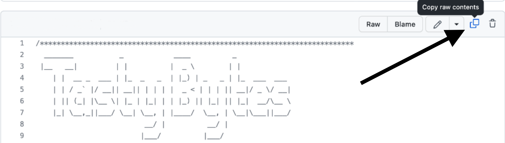
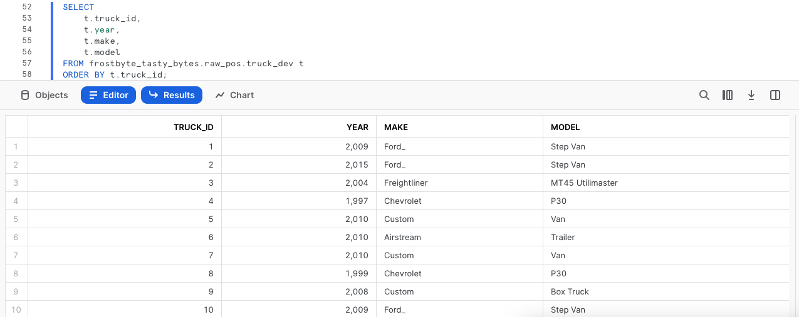
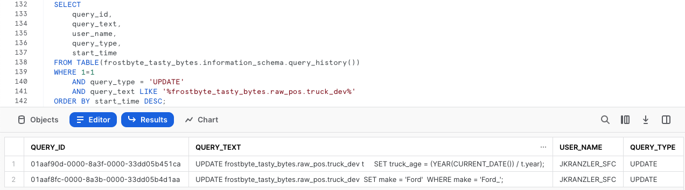
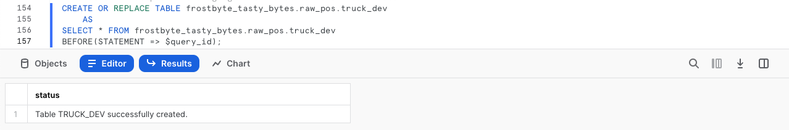
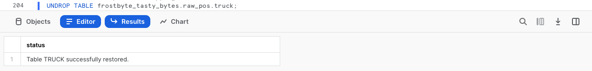

author: Jacob Kranzler
id: tasty-bytes-zero-to-snowflake-transformation-ptbr
categories: snowflake-site:taxonomy/solution-center/certification/quickstart, snowflake-site:taxonomy/product/platform, snowflake-site:taxonomy/product/data-engineering
language:  pt_br
summary: Quickstart Tasty Bytes: do zero ao Snowflake - transformação
environments: web
status: Published 
feedback link: https://github.com/Snowflake-Labs/sfguides/issues

# Tasty Bytes: do zero ao Snowflake - transformação
<!-- ------------------------ -->

## Transformação no Snowflake

### Visão geral
Damos as boas-vindas ao quickstart “Powered by Tasty Bytes: do zero ao Snowflake”, voltado para transformação!

Neste quickstart, apresentaremos várias funcionalidades do Snowflake, incluindo recursos importantes como o Zero Copy Cloning e Time-Travel para atender a uma demanda da Tasty Bytes.

### Pré-requisitos
- Antes de começar, é necessário ter concluído o [**Quickstart “Introdução à Tasty Bytes”**](/en/developers/guides/tasty-bytes-introduction/), que oferece um passo a passo para criar uma conta de avaliação gratuita e implementar os elementos básicos da Tasty Bytes necessários para completar este módulo.

### Você vai aprender
- Clonar uma tabela.
- Usar o cache de conjunto de resultados do Snowflake.
- Adicionar uma coluna a uma tabela.
- Atualizar dados em uma coluna.
- Usar o Time-Travel.
- Trocar, descartar e restaurar tabelas.

### O que será desenvolvido
- Uma compreensão da importante funcionalidade de transformação do Snowflake. 
- Um clone da tabela de desenvolvimento a partir de uma tabela de produção.
- Uma nova coluna em uma tabela preenchida com a idade dos food trucks, calculada em anos.


## Criação de uma planilha e cópia no código SQL

### Visão geral
Neste quickstart, vamos acompanhar a história da Tasty Bytes por meio de uma planilha SQL do Snowsight. Esta página servirá como um guia de referência completo com comentários adicionais, imagens e links para a documentação.

Nesta seção vamos mostrar como acessar o Snowflake, criar uma planilha nova, renomeá-la, copiar o código SQL do GitHub e colar o código SQL que usaremos neste quickstart.

### Etapa 1 - Acessar o Snowflake via URL
- Abra o navegador e insira a URL da sua conta Snowflake. 

### Etapa 2 - Fazer login no Snowflake
- Acesse sua conta Snowflake.
    - 

### Etapa 3 - Acessar as planilhas
- Clique na guia Worksheets na barra de navegação à esquerda.
    - 

### Etapa 4 - Criar uma planilha
- Dentro da guia Worksheets, clique no botão “+” no canto superior direito do Snowsight e escolha “SQL Worksheet”.
    - 

### Etapa 5 - Renomear uma planilha
- Renomeie a planilha clicando no carimbo de data/hora gerado automaticamente e digite “Tasty Bytes, transformação”.
    - 

### Etapa 6 - Acessar o código SQL do quickstart no GitHub
- Clique no botão abaixo para acessar o arquivo SQL da Tasty Bytes hospedado no GitHub. <button>[tb_zts_transformation](https://github.com/Snowflake-Labs/sf-samples/blob/main/samples/tasty_bytes/tb_zts_transformation.sql)</button>

### Etapa 7 - Copiar o Setup SQL do GitHub
- No GitHub, navegue para a direita e clique em “Copy raw contents”. Todas as informações SQL necessárias serão copiadas para sua área de transferência.
    - 

### Etapa 8 - Colar o Setup SQL do GitHub para a sua planilha do Snowflake
- Volte para o Snowsight e sua planilha recém-criada e cole (*CMD + V no Mac ou CTRL + V no Windows*) o conteúdo copiado do GitHub.

### Etapa 9 - Clicar em Next -->

## Clonagem instantânea da tabela de produção para desenvolvimento

### Visão geral
Como parte da análise da frota de caminhões da Tasty Bytes, nosso desenvolvedor recebeu a tarefa de adicionar uma coluna com a idade dos veículos à tabela de caminhões. 
 
Como bons desenvolvedores, sabemos que não é possível desenvolver com uma tabela de produção. Então, primeiro é necessário criar um ambiente de desenvolvimento que imite a produção.

### Etapa 1 - Criar um clone da produção
Graças à arquitetura exclusiva do Snowflake, podemos criar um instantâneo da nossa produção `raw_pos.truck` com a funcionalidade [CLONE](https://docs.snowflake.com/pt/sql-reference/sql/create-clone) e nomeá-lo como `raw_pos.truck_dev`.

Vamos executar a próxima série de consultas para definir o contexto da função `tasty_dev` e criar o clone da tabela, observando que não é necessário criar o contexto de armazenamento, já que a clonagem não o exige.

``` 
USE ROLE tasty_dev;

CREATE OR REPLACE TABLE frostbyte_tasty_bytes.raw_pos.truck_dev 
    CLONE frostbyte_tasty_bytes.raw_pos.truck; 
``` 


> aside positive **Zero Copy Cloning**: cria uma cópia de um banco de dados, esquema ou tabela. Um instantâneo dos dados existentes no objeto original é criado junto ao clone e disponibilizado ao objeto clonado. O objeto clonado é editável e independente do original. Ou seja, as alterações feitas no original ou no clone são independentes. 
>

### Etapa 2 - Clicar em Next -->

## Teste do cache de conjunto de resultados do Snowflake

### Visão geral
Com nosso clone Zero Copy disponível instantaneamente, podemos programar nele sem correr o risco de afetar a produção. Porém, antes de qualquer mudança, vamos executar algumas consultas simples e testar o cache de conjunto de resultados do Snowflake.

### Etapa 1 - Fazer consultas na tabela clonada
Agora que vamos consultar a tabela, precisaremos usar o armazenamento `tasty_dev_wh`. 

Vamos executar as duas consultas seguintes com a segunda instrução, gerando um conjunto de resultados que é composto pelos caminhões, os respectivos ano de produção, o fabricante e os modelos, usando [ORDER BY](https://docs.snowflake.com/pt/sql-reference/constructs/order-by) na coluna `truck_id`.

``` 
USE WAREHOUSE tasty_dev_wh;

SELECT 
    t.truck_id, 
    t.year, 
    t.make, 
    t.model 
FROM frostbyte_tasty_bytes.raw_pos.truck_dev t 
ORDER BY t.truck_id; 
```



### Etapa 2 - Executar novamente a consulta
Para testar o [cache de conjunto de resultados](https://docs.snowflake.com/pt/user-guide/querying-persisted-results) do Snowflake, a próxima consulta será igual à que acabamos de executar. Porém, agora vamos mais adiante e acessar o Query Profile, perfil que exibe os resultados dessa consulta instantaneamente conforme eles são enviados pelo cache de conjunto de resultados.

Após executar a consulta abaixo, siga as etapas na captura de tela para acessar o [Query Profile](https://docs.snowflake.com/pt/user-guide/ui-query-profile). No Query Profile, teremos um único nó, `QUERY RESULT REUSE`.

```
SELECT
    t.truck_id,
    t.year,
    t.make,
    t.model
FROM frostbyte_tasty_bytes.raw_pos.truck_dev t
ORDER BY t.truck_id;
```

 

>aside positive Se um usuário repetir uma consulta que já tenha sido executada, e os dados na(s) tabela(s) não mudaram desde a última vez que a consulta foi executada, então o resultado da consulta será o mesmo. Em vez de executar a consulta novamente, o Snowflake simplesmente retorna o mesmo resultado de antes. 
>         
>Isso pode reduzir bastante o tempo de consulta, pois o Snowflake ignora a execução da consulta e, em vez disso, recupera o resultado diretamente do cache.
>

### Etapa 3 - Clicar em Next -->

## Atualização de dados e cálculo da idade dos food trucks

### Visão geral
Com base nos resultados acima, precisamos resolver o erro de digitação nos registros Ford_ observados na coluna `make`. Depois disso, vamos poder focar nos cálculos que indicarão a idade de cada veículo.

### Etapa 1 - Atualizar os valores incorretos de uma coluna
Para iniciar esta seção, vamos corrigir o erro de digitação executando a consulta a seguir, que usa [UPDATE](https://docs.snowflake.com/pt/sql-reference/sql/update) para mudar as linhas em `truck_dev` com [WHERE](https://docs.snowflake.com/pt/sql-reference/constructs/where) onde o fabricante é Ford_.

```
UPDATE frostbyte_tasty_bytes.raw_pos.truck_dev 
SET make = 'Ford' 
WHERE make = 'Ford_';
```


### Etapa 2 - Criar um cálculo de idade
Depois de resolver o erro de digitação, podemos calcular a idade em anos dos caminhões da nossa frota. Execute a próxima consulta, onde veremos a utilização de [YEAR](https://docs.snowflake.com/pt/sql-reference/functions/year) e [CURRENT_DATE](https://docs.snowflake.com/pt/sql-reference/functions/current_date) para auxiliar no cálculo.

```
SELECT
    t.truck_id,
    t.year,
    t.make,
    t.model,
    (YEAR(CURRENT_DATE()) - t.year) AS truck_age_year
FROM frostbyte_tasty_bytes.raw_pos.truck_dev t;
```


### Etapa 3 - Clicar em Next -->

## Adição e atualização de uma coluna

### Visão geral
Após calcular a idade dos caminhões em anos, vamos agora adicionar uma nova coluna na tabela clonada para ajudar, e encerrar atualizando essa coluna para refletir os valores calculados.

### Etapa 1 - Adicionar uma coluna em uma tabela
Para começar, execute a próxima consulta, que usa [ALTER TABLE... ADD COLUMN](https://docs.snowflake.com/pt/sql-reference/sql/alter-table-column) para criar uma coluna `truck_age` vazia com [tipo de dados NUMBER](https://docs.snowflake.com/pt/sql-reference/data-types-numeric) na tabela `truck_dev`. 

Essa consulta vai gerar o resultado `Statement executed successfully`.

```
ALTER TABLE frostbyte_tasty_bytes.raw_pos.truck_dev
    ADD COLUMN truck_age NUMBER(4);
```

### Etapa 2 - Adicionar os valores calculados à coluna
Com a coluna criada, podemos executar a próxima consulta, que vai atualizar com [UPDATE](https://docs.snowflake.com/pt/sql-reference/sql/update) a nova coluna `truck_age` vazia, usando o cálculo de idade do caminhão criado na seção anterior. 
```
UPDATE frostbyte_tasty_bytes.raw_pos.truck_dev t
    SET truck_age = (YEAR(CURRENT_DATE()) / t.year);
``` 


### Etapa 3 - Realizar uma consulta na nova coluna
Após atualizar os dados, vamos consultar rapidamente a tabela para ver como está nossa coluna `truck_age`.
```
SELECT
    t.truck_id,
    t.year,
    t.truck_age
FROM frostbyte_tasty_bytes.raw_pos.truck_dev t;
``` 


**Opa!** Ainda bem que somos desenvolvedores inteligentes e não fizemos nada disso às cegas em produção. 

Parece que erramos o cálculo de `truck_age` e fizemos uma divisão, em vez de uma subtração. Vamos resolver isso na próxima seção.

### Etapa 4 - Clicar em Next -->

## Utilização do recurso Time Travel para recuperação de desastres em dados

### Visão geral
Apesar do nosso erro, o Snowflake conta com muitos recursos que podem nos ajudar. O processo que aplicaremos vai usar o histórico de consultas, as variáveis SQL e o Time Travel para reverter a tabela `truck_dev` ao estágio anterior antes da instrução de atualização incorreta.

>aside positive O Time Travel permite acessar dados históricos (ou seja, dados que foram alterados ou excluídos) em qualquer momento de um determinado período.
>

### Etapa 1 - Usar o histórico de consultas
Para iniciar o processo de recuperação, execute a consulta a seguir, que usará a função [QUERY_HISTORY](https://docs.snowflake.com/pt/sql-reference/functions/query_history) do Snowflake para recuperar uma lista de todas as instruções feitas na tabela `truck_dev`. 
```
SELECT 
    query_id,
    query_text,
    user_name,
    query_type,
    start_time
FROM TABLE(frostbyte_tasty_bytes.information_schema.query_history())
WHERE 1=1
    AND query_type = 'UPDATE'
    AND query_text LIKE '%frostbyte_tasty_bytes.raw_pos.truck_dev%'
ORDER BY start_time DESC;
``` 


### Etapa 2 - Configurar uma variável SQL
Como esperado, vemos a correção do erro de digitação e o cálculo incorreto, bem como suas respectivas query_ids exclusivas. Execute a próxima consulta, que criará uma variável SQL `query_id` a ser usada para reverter as mudanças via Time-Travel na próxima etapa. 

Após executar, você terá o resultado `Statement executed successfully`.
```
SET query_id = 
(
    SELECT TOP 1 query_id
    FROM TABLE(frostbyte_tasty_bytes.information_schema.query_history())
    WHERE 1=1
        AND query_type = 'UPDATE'
        AND query_text LIKE '%SET truck_age = (YEAR(CURRENT_DATE()) / t.year);'
    ORDER BY start_time DESC
);
```

### Etapa 3 - Usar o Time-Travel para reverter a tabela
Com a query_id incorreta armazenada como variável, podemos executar a próxima consulta, que usa Time-Travel para substituir a tabela `truck_dev` por [BEFORE](https://docs.snowflake.com/pt/sql-reference/constructs/at-before), restaurando a versão anterior, existente antes da instrução query_id incorreta ter sido realizada. 

``` 
CREATE OR REPLACE TABLE frostbyte_tasty_bytes.raw_pos.truck_dev 
    AS 
SELECT * FROM frostbyte_tasty_bytes.raw_pos.truck_dev 
BEFORE(STATEMENT => $query_id); 

``` 


Consulte a lista abaixo para ver demais opções de instruções Time-Travel disponíveis.
>aside positive **AT:** a palavra-chave AT especifica que a solicitação inclui quaisquer alterações feitas por uma instrução ou transação com um carimbo de data/hora igual ao parâmetro especificado.
>
>**BEFORE:** a palavra-chave BEFORE especifica que a solicitação se refere a um momento imediatamente anterior ao parâmetro especificado.
>
>**TIMESTAMP:** especifica a data e a hora exatas a serem usadas para o Time Travel.
>
>**OFFSET:** especifica a diferença em segundos da hora atual para ser aplicada ao Time Travel.
>
>**STATEMENT:** especifica a identificação de consulta de uma instrução a ser usada como ponto de referência para o Time Travel.
>

### Etapa 4 - Clicar em Next -->

## Promoção do desenvolvimento para a produção

### Visão geral
Com a tabela `truck_dev` de volta ao estado em que estava antes da instrução de atualização incorreta, podemos agora garantir que a coluna está atualizada corretamente. Daqui em diante, vamos promover a tabela com o cálculo correto para a produção e completar a tarefa recebida.

### Etapa 1 - Adicionar os valores calculados corretamente à coluna
Usando o mesmo processo de antes, execute a consulta a seguir e confirme se estamos usando subtração, em vez de divisão.

```
UPDATE frostbyte_tasty_bytes.raw_pos.truck_dev t
SET truck_age = (YEAR(CURRENT_DATE()) - t.year);
```


### Etapa 2 - Trocar a tabela de desenvolvimento pela de produção
Ao finalizar a tabela `truck_dev`, execute as duas consultas a seguir, onde assumiremos a função `sysadmin`, com mais privilégios. Já como `sysadmin`, a segunda consulta usa [ALTER TABLE... SWAP WITH](https://docs.snowflake.com/pt/sql-reference/sql/alter-table) para promover nossa tabela `truck_dev` para `truck`, e vice-versa.

Após a executar a consulta, você obterá o resultado `Statement executed successfully.`.

``` 
USE ROLE sysadmin;

ALTER TABLE frostbyte_tasty_bytes.raw_pos.truck_dev 
    SWAP WITH frostbyte_tasty_bytes.raw_pos.truck; 
```

### Etapa 3 - Validar a produção
Para confirmar que o processo foi bem-sucedido, vamos verificar a tabela `truck` em produção para validar a troca e verificar se os resultados em `truck_age` estão corretos.

``` 
SELECT 
    t.truck_id, 
    t.year, 
    t.truck_age 
FROM frostbyte_tasty_bytes.raw_pos.truck t W
HERE t.make = 'Ford';
```


### Etapa 4 - Clicar em Next -->

## Descarte e restauração de tabelas

### Visão geral
Podemos afirmar, oficialmente, que nosso desenvolvedor completou sua tarefa. Com a coluna `truck_age` criada e usando o cálculo correto, o `sysadmin` pode eliminar a tabela remanescente e encerrar o dia.

### Etapa 1 - Descartar a tabela
Para remover a tabela do nosso banco de dados, execute a próxima consulta, que usa [DROP TABLE](https://docs.snowflake.com/pt/sql-reference/sql/drop-table).

```
DROP TABLE frostbyte_tasty_bytes.raw_pos.truck;
```


**Opa!** O conjunto de resultados mostra que até mesmo nosso `sysadmin` pode cometer erros. Sem querer, descartamos a tabela de produção `truck`, e não a de desenvolvimento, `truck_dev`! Felizmente, o Snowflake Time-Travel nos ajuda mais uma vez.

### Etapa 2 - Restaurar a tabela
Aja rápido e execute a próxima consulta antes que os sistemas sejam afetados. Use [UNDROP](https://docs.snowflake.com/pt/sql-reference/sql/undrop-table) para cancelar o descarte da tabela `truck`.

```
UNDROP TABLE frostbyte_tasty_bytes.raw_pos.truck;
```



### Etapa 3 - Descartar a tabela correta
Agora, vamos terminar executando a consulta final e descartando corretamente a tabela `truck_dev`.

```
DROP TABLE frostbyte_tasty_bytes.raw_pos.truck_dev;
```


### Etapa 4 - Clicar em Next -->

## Conclusão e próximas etapas

### Conclusão
Ótimo trabalho! Você concluiu com sucesso o quickstart “Tasty Bytes: do zero ao Snowflake - transformação”. 

Nele, você: 
- Clonou uma tabela 
- Usou o cache de conjunto de resultados do Snowflake 
- Adicionou uma coluna a uma tabela 
- Atualizou dados em uma coluna 
- Usou o Time-Travel para recuperação de desastres em dados 
- Trocou, descartou e restaurou uma tabela

Caso queira refazer este quickstart, use os scripts de Reset que aparecem no final da planilha associada.

### Próximas etapas
Para continuar sua jornada no Snowflake Data Cloud, clique no link abaixo para ver mais quickstarts Powered By Tasty Bytes disponíveis para você.

- ### [Powered by Tasty Bytes - Índice de quickstarts](/pt_br/developers/guides/tasty-bytes-introduction-ptbr/)
