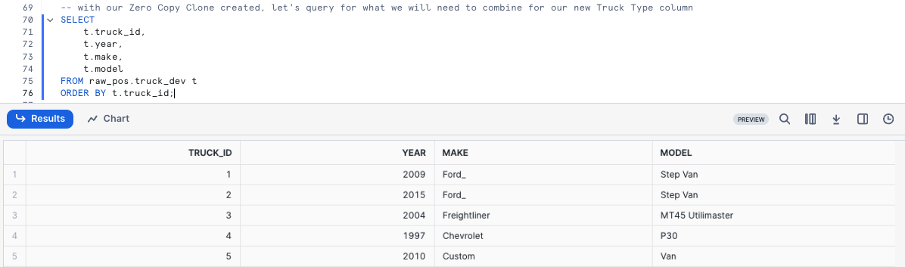
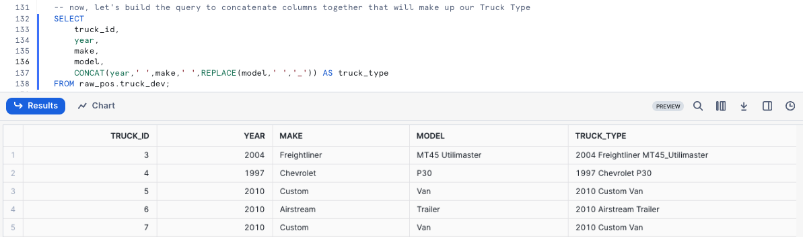
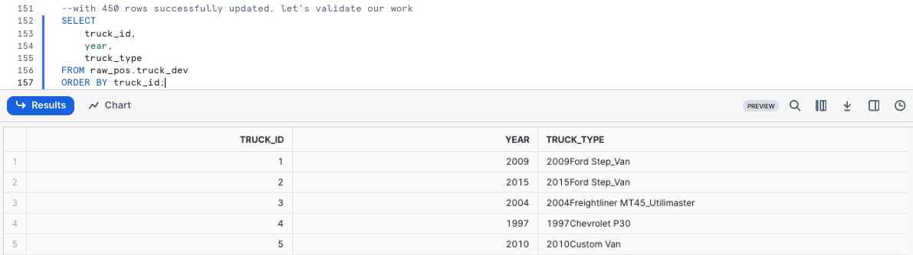
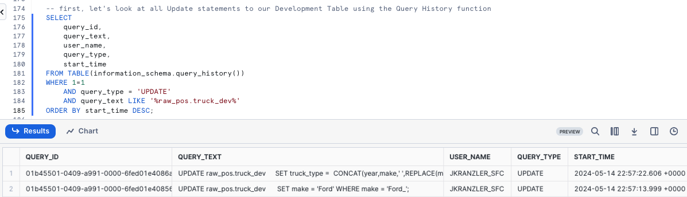
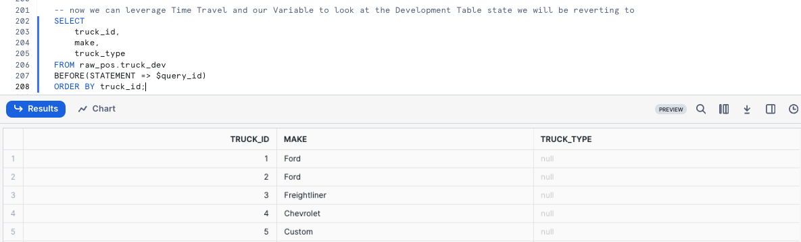
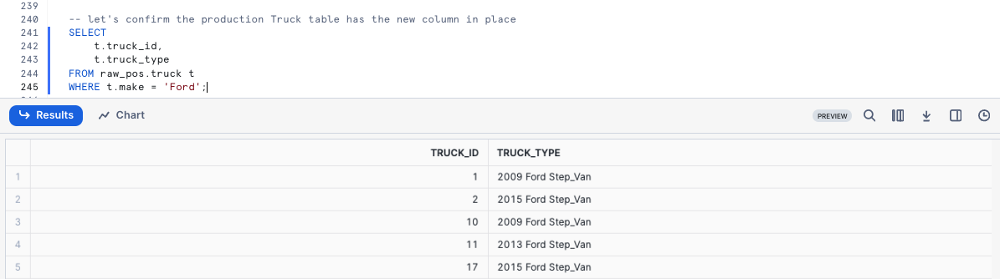

author: Jacob Kranzler
id: tasty-bytes-zero-to-snowflake-transformation
categories: snowflake-site:taxonomy/solution-center/certification/quickstart, snowflake-site:taxonomy/product/platform, snowflake-site:taxonomy/product/data-engineering, snowflake-site:taxonomy/snowflake-feature/transformation
language: en
summary: Tasty Bytes - Zero to Snowflake - Transformation Quickstart
environments: web
status: Hidden 
feedback link: https://github.com/Snowflake-Labs/sfguides/issues

# Tasty Bytes - Zero to Snowflake - Transformation
<!-- ------------------------ -->

## Transformation in Snowflake


### Overview
Welcome to the Powered by Tasty Bytes - Zero to Snowflake Quickstart focused on Transformation!

Within this Quickstart we will walk through a large set of Snowflake functionality covering key features like Zero Copy Cloning and Time-Travel to deliver on a Tasty Bytes business requirement.

### Prerequisites
- Before beginning, please make sure you have completed the [**Introduction to Tasty Bytes Quickstart**](/en/developers/guides/tasty-bytes-introduction/) which provides a walkthrough on setting up a trial account and deploying the Tasty Bytes Foundation required to complete this Quickstart.

### What You Will Learn
- How to Clone a Table
- How to Use Snowflake's Result Set Cache
- How to Add a Column to a Table
- How to Update Data in a Column
- How to Use Time-Travel
- How to Swap, Drop and Undrop a Table

### What You Will Build
- An Understanding of Important Snowflake Transformation Functionality 
- A Development Table Clone of a Production Table
- A New Column in a Table Complete with Calculated Food Truck Ages in Years


## Creating a Worksheet and Copying in our SQL

### Overview
Within this Quickstart we will follow a Tasty Bytes themed story via a Snowsight SQL Worksheet with this page serving as a side by side guide complete with additional commentary, images and documentation links.

This section will walk you through logging into Snowflake, Creating a New Worksheet, Renaming the Worksheet, Copying SQL from GitHub, and Pasting the SQL we will be leveraging within this Quickstart.

### Step 1 - Accessing Snowflake via URL
- Open a browser window and enter the URL of your Snowflake Account 

### Step 2 - Logging into Snowflake
- Log into your Snowflake account.

### Step 3 - Navigating to Worksheets
- Click on the Projects Tab in the left-hand navigation bar and click Worksheets.

### Step 4 - Creating a Worksheet
- Within Worksheets, click the "+" button in the top-right corner of Snowsight.

### Step 5 - Renaming a Worksheet
- Rename the Worksheet by clicking on the auto-generated Timestamp name and inputting "Tasty Bytes - Transformation"

### Step 6 - Accessing Quickstart SQL in GitHub
- Click the button below which will direct you to our Tasty Bytes SQL file that is hosted on GitHub.
<button>[tb_zts_transformation](https://github.com/Snowflake-Labs/sf-samples/blob/main/samples/tasty_bytes/FY25_Zero_To_Snowflake/tb_transformation.sql)</button>

### Step 7 - Copying Setup SQL from GitHub
- Within GitHub navigate to the right side and click "Copy raw contents". This will copy all of the required SQL into your clipboard.
    - 

### Step 8 - Pasting Setup SQL from GitHub into your Snowflake Worksheet
- Path back to Snowsight and your newly created Worksheet and Paste (*CMD + V for Mac or CTRL + V for Windows*) what we just copied from GitHub.

### Step 9 - Click Next -->

## Zero Copy Cloning

### Overview
As part of Tasty Bytes Fleet Analysis, our Developer has been tasked with creating and updating a new Truck Type column within the Raw layer Truck table that combines the Year, Make and Model together.

Within this step, we will first walk through standing up a Development environment using Snowflake Zero Copy Cloning for this development to be completed and tested within before rolling into production.

### Step 1 - Create a Clone of Production
Thanks to Snowflake's unique architecture, we can instantly create a snapshot of our production `raw_pos.truck` using [CLONE](https://docs.snowflake.com/en/sql-reference/sql/create-clone) functionality and name it `raw_pos.truck_dev`.

Let's now run our next set our queries to set our `tb_dev` Role and `tb_101` Warehouse context and create the table clone; noting here that we do not need to set Warehouse context since cloning does not require one. This query will provide a `Table TRUCK_DEV successfully created` result.

```
USE ROLE tb_dev;
USE DATABASE tb_101;

CREATE OR REPLACE TABLE raw_pos.truck_dev CLONE raw_pos.truck;
```


> **Zero Copy Cloning**: Creates a copy of a database, schema or table. A snapshot of data present in the source object is taken when the clone is created and is made available to the cloned object. 
>The cloned object is writable and is independent of the clone source. That is, changes made to either the source object or the clone object are not part of the other. 
>

### Step 2 - Click Next -->

## Testing Snowflakes Query Result Set Cache

### Overview
With our Zero Copy Clone instantly available we can now begin to develop against it without any fear of impacting production. However, before we make any changes let's first run some simple queries against it and test out Snowflake's Result Set Cache.

### Step 1 - Querying our Cloned Table
Now that we are going to query our Table, we will need to use our `tb_dev_wh` Warehouse. 

Let's kick off the next two queries with the second statement producing an result set consisting of our trucks, their years, make and models while making sure we [ORDER BY](https://docs.snowflake.com/en/sql-reference/constructs/order-by) our `truck_id` Column.

```
USE WAREHOUSE tb_dev_wh;

SELECT
    t.truck_id,
    t.year,
    t.make,
    t.model
FROM raw_pos.truck_dev t
ORDER BY t.truck_id;
```



### Step 2 - Using Persisted Query Results
To test Snowflake's [Result Set Cache](https://docs.snowflake.com/en/user-guide/querying-persisted-results), the next query we run will be identical to what we just ran. 

However, we can now take things a step further and access the Query Profile showcasing this query returned results instantly as the the results came from our Result Set Cache.


```
SELECT
    t.truck_id,
    t.year,
    t.make,
    t.model, --> Snowflake supports Trailing Comma's in SELECT clauses
FROM raw_pos.truck_dev t
ORDER BY t.truck_id;
```


> If a user repeats a query that has already been run, and the data in the table(s) hasn’t changed since the last time that the query was run, then the result of the query is the same. Instead of running the query again, Snowflake simply returns the same result that it returned previously. 
>         
>This can substantially reduce query time because Snowflake bypasses query execution and, instead,retrieves the result directly from the cache.
>

### Step 3 - Click Next -->

## Adding and Updating a Column in a Table

### Overview
Within this step, we will now will Add and Update a Truck Type column to the Development Truck Table we created previously while also addressing the typo in the `Make` field.

### Step 1 - Updating Incorrect Values in a Column
To begin this section, let's make sure we correct the typo by executing our next query which leverages [UPDATE](https://docs.snowflake.com/en/sql-reference/sql/update) to change rows in our `truck_dev` [WHERE](https://docs.snowflake.com/en/sql-reference/constructs/where) the make is equal to Ford_.

This query will provide a `Number of Rows updated` result set.

```
UPDATE raw_pos.truck_dev 
    SET make = 'Ford' WHERE make = 'Ford_';
```

### Step 2 - Constructing our Truck Type Column
With the typo handled, we can now build the query to concatenate columns together that will make up our Truck Type. Please execute the next query where we will see [CONCAT](https://docs.snowflake.com/en/sql-reference/functions/concat) and [REPLACE](https://docs.snowflake.com/en/sql-reference/functions/replace) leveraged.

```
SELECT
    truck_id,
    year,
    make,
    model,
    CONCAT(year,' ',make,' ',REPLACE(model,' ','_')) AS truck_type
FROM raw_pos.truck_dev;
```



### Step 3 - Adding a Column
To start, please execute the next query which uses [ALTER TABLE... ADD COLUMN](https://docs.snowflake.com/en/sql-reference/sql/alter-table-column) to
create an empty `truck_type` column of [Data Type VARCHAR](https://docs.snowflake.com/en/sql-reference/data-types-text) to our `truck_dev` table. 

This query will provide a `Statement executed successfully` result.

```
ALTER TABLE raw_pos.truck_dev 
    ADD COLUMN truck_type VARCHAR(100);
```

### Step 4 - Updating our Column
With the column in place, we can kick off the next query which will [UPDATE](https://docs.snowflake.com/en/sql-reference/sql/update) the new, empty `truck_type` column using the Truck Type concatenation we built in the previous section.

This query will provide a `Number of Rows Updated` result set.

```
UPDATE raw_pos.truck_dev
    SET truck_type =  CONCAT(year,make,' ',REPLACE(model,' ','_'));
```


### Step 5 - Querying our new Column
After successfully updating the data, let's now run a quick query against the table to see how things look in our `truck_type` column.

```
SELECT
    truck_id,
    year,
    truck_type
FROM raw_pos.truck_dev
ORDER BY truck_id;
```



**Uh oh!** Thank goodness we were smart developers and didn't do this sort of thing blindly in production. 

It looks like we messed up the `truck_type` concatenation.  We will need to resolve this in our next section.

### Step 6 - Click Next -->

## Time-Travel for Table Restore

### Overview
Althoug we made a mistake on the Update statement earlier and missed adding a space  between Year and Make. Thankfully, we can use Time Travel to revert our table back to the state it was after we fixed the misspelling so we can correct our work.


> Time Travel enables accessing historical data (i.e. data that has been changed or deleted) at any point within a defined period.
>

### Step 1 - Leveraging Query History
To start our recovery process, kick off the next query which will use the Snowflake [QUERY_HISTORY](https://docs.snowflake.com/en/sql-reference/functions/query_history) function to retrieve a list of all update statements we have made against our `truck_dev` Table.

```
SELECT
    query_id,
    query_text,
    user_name,
    query_type,
    start_time
FROM TABLE(information_schema.query_history())
WHERE 1=1
    AND query_type = 'UPDATE'
    AND query_text LIKE '%raw_pos.truck_dev%'
ORDER BY start_time DESC;
```



### Step 2 - Setting a SQL Variable
As expected, we see our typo correction as well as our update and their associated unique query_id's. Please run the next query which creates a `query_id` SQL Variable that we will use to revert our changes via Time-Travel in the next step. 

After execution you will recieve a `Statement executed successfully` result.
```
SET query_id =
    (
    SELECT TOP 1
        query_id
    FROM TABLE(information_schema.query_history())
    WHERE 1=1
        AND query_type = 'UPDATE'
        AND query_text LIKE '%SET truck_type =%'
    ORDER BY start_time DESC
    );
```


### Step 3 - Leveraging Time-Travel to Revert our Table
With our bad query_id stored as a Variable, we can execute the next query which will replace our `truck_dev` Table with what it looked like [BEFORE](https://docs.snowflake.com/en/sql-reference/constructs/at-before) the incorrect query_id statement using Time-Travel. 

```
SELECT 
    truck_id,
    make,
    truck_type
FROM raw_pos.truck_dev
BEFORE(STATEMENT => $query_id)
ORDER BY truck_id;

```



Please refer to the list below for the other Time-Travel Statement options available.

>**AT:** The AT keyword specifies that the request is inclusive of any changes made by a statement or transaction with timestamp equal to the specified parameter.
>
>**BEFORE:** The BEFORE keyword specifies that the request refers to a point immediately preceding the specified parameter.
>
>**TIMESTAMP:** Specifies an exact date and time to use for Time Travel.
>
>**OFFSET:** Specifies the difference in seconds from the current time to use for Time Travel.
>
>**STATEMENT:** Specifies the query ID of a statement to use as the reference point for Time Travel.
>

Happy with our results, let's now execute the next query to recreate the table. This query will provide a `Table TRUCK_DEV successfully created.` result.

```
CREATE OR REPLACE TABLE raw_pos.truck_dev
    AS
SELECT * FROM raw_pos.truck_dev
BEFORE(STATEMENT => $query_id); -- revert to before a specified Query ID ran
```

To conclude, let's run the correct update statement which will provide a `Number of Rows Updated` result set.

```
UPDATE raw_pos.truck_dev t
    SET truck_type = CONCAT(t.year,' ',t.make,' ',REPLACE(t.model,' ','_'));
```

### Step 4 - Click Next -->

## Table Swap, Drop and Undrop

### Overview
Based on our previous efforts, we have addressed the requirements we were given and to complete our task need to push our Development into Production.

### Step 1 - Table Swap
Within this step, we will swap our Development Truck table `truck_dev` with what is currently available in Production.

Please kick off the next two queries where we first assume the more privileged `accountadmin` role. As a `accountadmin` the second query utilizes [ALTER TABLE... SWAP WITH](https://docs.snowflake.com/en/sql-reference/sql/alter-table) to promote our `truck_dev` table to `truck` and vice versa.

Once complete you will recieve a  `Statement executed successfully.` result.

```
USE ROLE accountadmin;

ALTER TABLE raw_pos.truck_dev 
    SWAP WITH raw_pos.truck;
```

### Step 2 - Validate Production
To confirm our process was successful, let's now take a look at the Production `truck` table so we can validate the swap was successful and the `truck_type` results are valid.

```
SELECT
    t.truck_id,
    t.truck_type
FROM raw_pos.truck t
WHERE t.make = 'Ford';
```



### Step 3 - Dropping and Undropping Tables
We can officially say our developer has completed their assigned task. With the `truck_type` column in place and correctly calculated, our `sysadmin` can 
clean up the left over Table and sign off for the day.

### Step 4 - Dropping a Table
To remove the Table from our Database, please execute the next query which leverages [DROP TABLE](https://docs.snowflake.com/en/sql-reference/sql/drop-table). This query will provide a `TRUCK successfully dropped.` result.

```
DROP TABLE raw_pos.truck;
```

**Uh oh!!** That result set shows that even our `accountadmin` can make mistakes. We incorrectly dropped production `truck` and not development `truck_dev`! Thankfully, Snowflake's Time-Travel can come to the rescue again.

### Step 5 - Undropping a Table
Hurry up and run the next query before any systems are impacted which will [UNDROP](https://docs.snowflake.com/en/sql-reference/sql/undrop-table) the `truck` table. This query will provide a `Table TRUCK successfully restored.` result.

```
UNDROP TABLE raw_pos.truck;
```

### Step 6 - Dropping the Correct Table
Alright, now let's officially close things out by running the final query to correctly drop `truck_dev`. This query will provide a `TRUC_DEV successfully dropped.` result.

```
DROP TABLE raw_pos.truck_dev;
```

### Step 7 - Click Next -->

## Conclusion and Next Steps

### Conclusion
Fantastic work! You have successfully completed the Tasty Bytes - Zero to Snowflake - Transformation Quickstart. 

By doing so you have now:
- Cloned a Table
- Used Snowflake's Result Set Cache
- Added a Column to a Table
- Updated Data in a Column
- Leveraged Time-Travel for Data Disaster Recovery
- Swapped, Dropped and Undropped a Table

If you would like to re-run this Quickstart please leverage the Reset scripts in the bottom of your associated Worksheet.

### Next Steps
To continue your journey in the Snowflake AI Data Cloud, please now visit the link below to see all other Powered by Tasty Bytes - Quickstarts available to you.

- ### [Powered by Tasty Bytes - Quickstarts Table of Contents](/en/developers/guides/tasty-bytes-introduction/)
