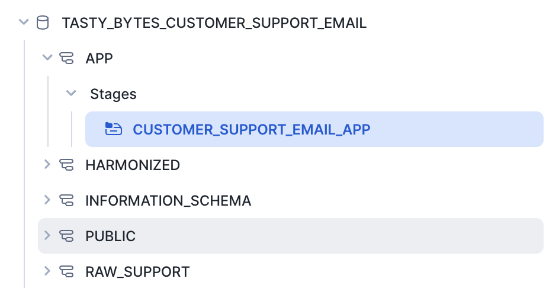
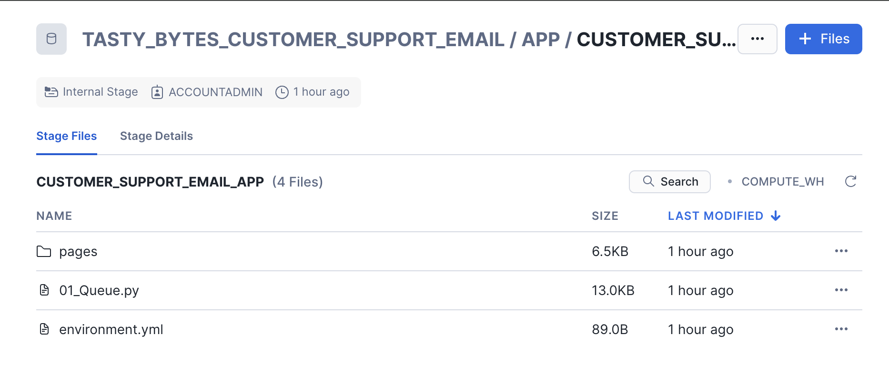
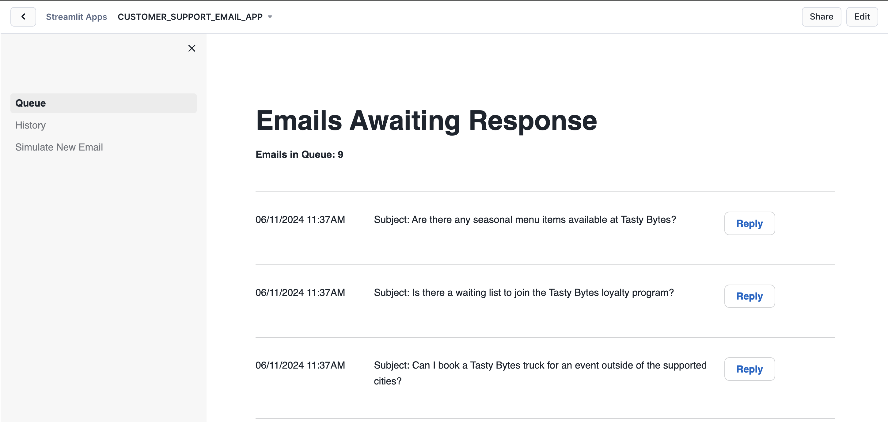

author: Charlie Hammond
id: tasty_bytes_customer_support_email_app
summary: This is a sample Snowflake Guide
categories: Tasty-Bytes, Getting-Started, Cortex
environments: web
status: Published 
feedback link: https://github.com/Snowflake-Labs/sfguides/issues
tags: Getting Started

# Snowflake Guide Template
<!-- ------------------------ -->
## Overview 
Duration: 1

Please use [this markdown file](https://raw.githubusercontent.com/Snowflake-Labs/sfguides/master/site/sfguides/sample.md) as a template for writing your own Snowflake Quickstarts. This example guide has elements that you will use when writing your own guides, including: code snippet highlighting, downloading files, inserting photos, and more. 

It is important to include on the first page of your guide the following sections: Prerequisites, What you'll learn, What you'll need, and What you'll build. Remember, part of the purpose of a Snowflake Guide is that the reader will have **built** something by the end of the tutorial; this means that actual code needs to be included (not just pseudo-code).

The rest of this Snowflake Guide explains the steps of writing your own guide. 

### Prerequisites
- Familiarity with Markdown syntax

### What You’ll Learn 
- how to set the metadata for a guide (category, author, id, etc)
- how to set the amount of time each slide will take to finish 
- how to include code snippets 
- how to hyperlink items 
- how to include images 

### What You’ll Need 
- A [GitHub](https://github.com/) Account 
- [VSCode](https://code.visualstudio.com/download) Installed
- [NodeJS](https://nodejs.org/en/download/) Installed
- [GoLang](https://golang.org/doc/install) Installed

### What You’ll Build 
- A Snowflake Guide

<!-- ------------------------ -->
## Setup
Duration: 10

### Step 1 - Accessing hosted Setup SQL in GitHub
- Click the button below which will direct you to our Tasty Bytes SQL Setup file that is hosted on GitHub.

<button>[setup.sql](https://github.com/Snowflake-Labs/sfguide-tasty-bytes-enhancing-customer-experience/blob/main/customer-support-email-app/setup/setup.sql)</button>

### Step 2 - Run the contents of setup.sql

Open a new Snowsight worksheet and run all commands from setup.sql.

### Step 3 - Load Streamlit Files

- Download all files from the [app directory](https://github.com/Snowflake-Labs/sfguide-tasty-bytes-enhancing-customer-experience/tree/main/customer-support-email-app/app). This includes all files in the pages subdirectory.
- In Snowsight, open the tasty_bytes_customer_support_email.app.customer_support_email_app stage



- Click + Files in the top right of the stage
- Upload all files that you downloaded from GitHub into the stage. The contents should match the app directory
  - 01_Queue.py and environment.yml are at the top level
  - 02_History.py and 03_Simulate_New_Email.py and in the pages folder. 



### Step 4 - Create the Streamlit App

Run the code below in a Snowsight worksheet to build the Streamlit app.

```sql
USE ROLE sysadmin;

CREATE OR REPLACE STREAMLIT tasty_bytes_customer_support_email.app.customer_support_email_app
ROOT_LOCATION = '@tasty_bytes_customer_support_email.app.customer_support_email_app'
MAIN_FILE = '01_Queue.py'
QUERY_WAREHOUSE = 'tasty_bytes_customer_support_email_wh';
```

### Step 5 - Open the Streamlit App

- From Snowsight, ensure you are using the customer_support_email_role role.
- Under Projects, click Streamlit
- Open CUSTOMER_SUPPORT_EMAIL_APP from the list of apps



<!-- ------------------------ -->
## Running the Customer Support Email App
Duration: 5

This application is divided into three sections.

- Queue displays a list of emails awaiting responses to customers.
- History showcases emails previously addressed by agents and auto-responses from LLM.
- Additionally, there's an option to Simulate a New Email, acting as a customer for demonstration purposes.
The primary objective of this demonstration is to illustrate how the app utilizes the knowledge base in real-time.

Let's simulate a scenario where we first act as a customer, sending an email that the LLM cannot answer. Then, we will act as a Customer Support Agent to respond, adding the summarized response to our knowledge base or corpus, and resend a similar email to trigger an auto-response from LLM.

To do this, please follow the steps below:

- Click on Simulate New Email
- Send a new email with the following information:
  - Body: I wanted to ask if the the Buffalo Wings at Toronto Plant Palace are still Vegan? Last time I was there they were.
  - Email Address: Use your email or a fake email address
  - Subject: Are the Buffalo Wings at Toronto Plant Palace still vegan?
-   - Click Send to dispatch the email, which the LLM will process. Since the auto-response Knowledge Base lacks information about this query, it will be routed to an agent.
- Navigate to the Queue to view the list of emails to be addressed.
- Scroll to the bottom and click Reply next to the email sent. This action reveals the full email and a suggested response generated by LLM for sending to the customer.
- Click Send to dispatch the email. Subsequently, you'll be prompted to add the response to the knowledge base.
- Choose Yes to add it, which will provide a summary for addition.
- Click Save to store the response in the knowledge base. Additionally, you have the option to interact with the chatbot for further assistance.
- Now that the response is saved to the knowledge base, you can pose the same or a similar question again to observe the auto-response.
- Once the auto-response is received, navigate to the History section to view the response.

P.S. If you prefer not to find something new to add to the knowledge base for each demo, you can simply delete the ones you added by executing the commands below:
```sql
delete from tasty_bytes_customer_support_email.harmonized.chunk_text
where source = 'EMAIL';

delete from tasty_bytes_customer_support_email.harmonized.vector_store
where source = 'EMAIL';
```

<!-- ------------------------ -->
## Understanding the Customer Support Email App
Duration: 10

The following features are used in the customer support email app.

<!-- ------------------------ -->
## Conclusion And Resources
Duration: 1

At the end of your Snowflake Guide, always have a clear call to action (CTA). This CTA could be a link to the docs pages, links to videos on youtube, a GitHub repo link, etc. 

If you want to learn more about Snowflake Guide formatting, checkout the official documentation here: [Formatting Guide](https://github.com/googlecodelabs/tools/blob/master/FORMAT-GUIDE.md)

### What You Learned
- creating steps and setting duration
- adding code snippets
- embedding images, videos, and surveys
- importing other markdown files

### Related Resources
- <link to github code repo>
- <link to documentation>
