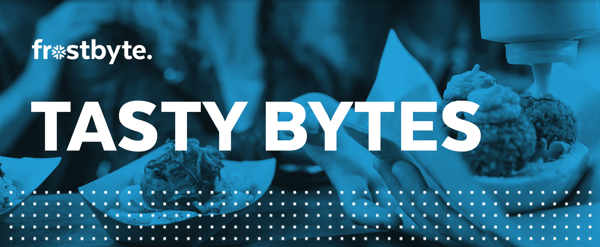

author: Jacob Kranzler
id: tasty_bytes_introduction
summary: This is the Tasty Bytes Introduction and Data Foundation Quickstart guide
categories: Getting-Started
environments: web
status: Published 
feedback link: https://github.com/Snowflake-Labs/sfguides/issues
tags: Getting Started, Data Engineering, Data Warehouse

<!-- ------------------------ -->

## Tasty Bytes Introduction - Overview 

Within this Tasty Bytes Introduction Quickstart you will first be learning about the fictious food truck brand, Tasty Bytes, created by the frostbyte team within the Snowflake Field CTO Office. 

After learning about the Tasty Bytes Organization, we will walk through the process of downloading a .sql file and importing it as a Worksheet in the Snowsight UI. This .sql file will then be ran in bulk which will complete the process of setting up a three zone (*raw, harmonized and analytics*) Tasty Bytes Data Model complete with Schemas, Tables, Views, Warehouses, Roles and all required Role Based Access Control (RBAC).

Upon finishing this Quickstart, you will be able to move on to the other Tasty Bytes Quickstarts seen in the Table of Contents below. These Tasty Bytes themed Quickstarts range from quick Zero to Snowflake feature/function rich walkthroughs to in-depth Workload Deep Dives.

### Who is Tasty Bytes?

### Tasty Bytes Quickstart Table of Contents
- **Zero to Snowflake**
    - [**Financial Governance**](site/sfguides/src/tasty_bytes_zero_to_snowflake_financial_governance)
        - Learn about Snowflake Virtual Warehouses and their configurabilities, Resource Monitors, and Account and Warehouse Level Timeout Parameters
    - [**Transformation**](site/sfguides/src/tasty_bytes_zero_to_snowflake_transformation)
        - Learn about Snowflake Zero Copy Cloning, Result Set Cache, Table Manipulation, Time-Travel and the Table level SWAP, DROP and Undrop functionality.
    - [**Semi-Structured Data**](site/sfguides/src/tasty_bytes_zero_to_snowflake_semi_structured_data)
        - Learn about Snowflake VARIANT Data Type, Semi-Structured Data Processing via Dot Notation and Lateral Flattening as well as View Creation and Snowsight Charting.
    - [**Data Governance**](site/sfguides/src/tasty_bytes_zero_to_snowflake_data_governance)
        - Learn about Snowflake System Defined Roles, Create and apply GRANTS to a custom role, and deploy both Tag Based Dynamic Data Masking and Row-Access Policies.
    - [**Collaboration**](site/sfguides/src/tasty_bytes_zero_to_snowflake_collaboration)
        - Learn about the Snowflake Marketplace by leveraging free, instantly available, live listings from Weathersource and Safegraph.
    - [**Geospatial**](site/sfguides/src/tasty_bytes_zero_to_snowflake_geospatial)
        - Learn about Snowflake Geospatial support starting with constructing Geographic Points and leveraging other Geospatial functionality to calculate distance, collect coordinates, draw a minimum bounding polygon and find it's center point.

- **Workload Deep Dives**
    - **Data Engineering**
        - Ingestion, Optimization & Automation (*Coming Soon*)
        - External Tables (*Coming Soon*)
    - **Data Science**
        - Snowpark 101 (*Coming Soon*)

### Prerequisites
- An Enterprise or Business Critical Snowflake Account
    - If you do not have a Snowflake Account, please [**sign up for a Free 30 Day Trial Account**](https://signup.snowflake.com/), select **Enterprise** edition and whichever Cloud/Region combination you wish.
        - 
    - After registering, you will receive an email with an activation link and your Snowflake account URL you will use in the next steps.

### What You’ll Learn 
- How to Create a Snowflake Worksheet
- How to Import a .sql File into a Snowflake Worksheet
- How to Execute an entire Snowflake Worksheet
- How to Explore Databases in your Snowflake Account
- How to Explore Roles in your Snowflake Account
- How to Explore Warehouse in your Snowflake Account

### What You'll Build
- A Snowflake Database
- Three Snowflake Schemas (Raw, Harmonized and Analytics) complete with Tables and Views
- Workload Specific Snowflake Warehouses
- Workload Specific Snowflake Roles

## Preparing Your Snowflake Account
- For this Quickstart, you will use the latest Snowflake web interface known as Snowsight.
    1. Open a browser window and enter the URL of your existing Snowflake Account or the URL for the Snowflake 30-day Trial Account that was sent with your registration email.
    2. Log into your Snowflake account
    3. Click on Worksheets tab in the left-hand navigation bar.
        - The ​Worksheets​ tab provides an interface for submitting SQL queries, performing DDL and DML operations, and viewing results as your queries or operations complete.
        - A new worksheet is created by clicking + Worksheet on the top right.

