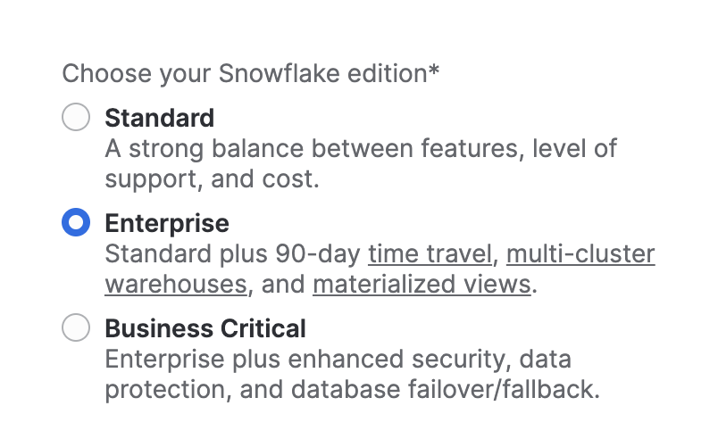
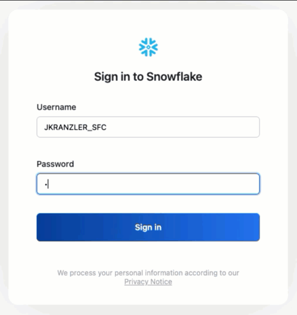
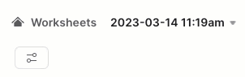
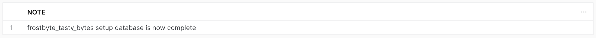
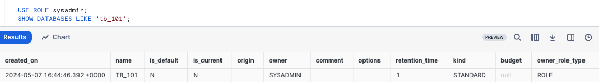
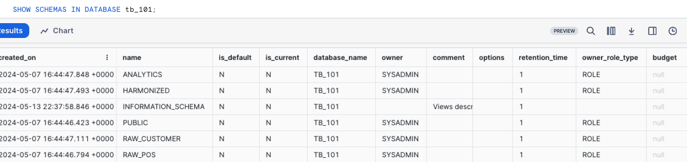
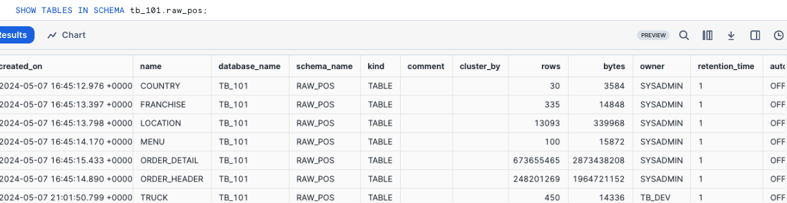
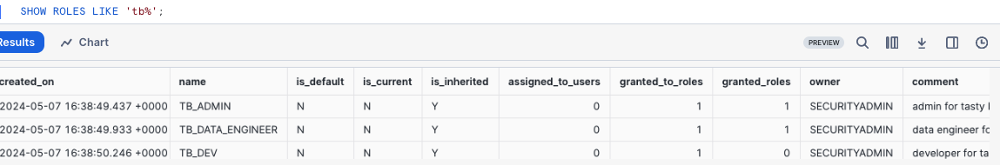
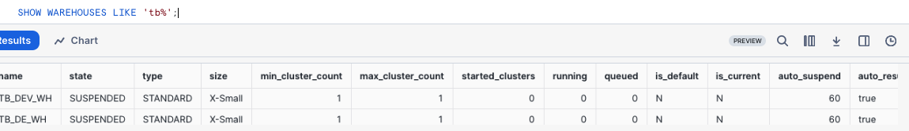
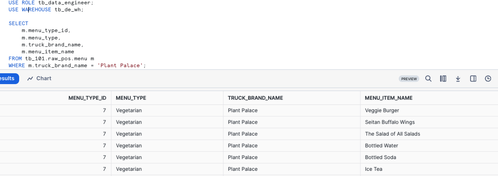

author: Jacob Kranzler
id: tasty_bytes_introduction
summary: This is the Tasty Bytes Introduction and Data Foundation Quickstart guide
categories: Tasty-Bytes, Getting-Started, Featured
environments: web
status: Published 
feedback link: https://github.com/Snowflake-Labs/sfguides/issues
tags: Getting Started, Tasty Bytes, Zero to Snowflake

# An Introduction to Tasty Bytes
<!-- ------------------------ -->

## An Introduction to Tasty Bytes 
Duration: 1


### Overview
Within this Tasty Bytes Introduction Quickstart you will first be learning about the fictious food truck brand, Tasty Bytes, created by the frostbyte team at Snowflake.

After learning about the Tasty Bytes Organization, we will complete the process of setting up the Tasty Bytes Foundational Data Model, Workload Specific Roles + Warehouses and all necessary Role Based Access Control (RBAC). 

Upon finishing this Quickstart, you will have deployed the foundation required to run the Quickstarts seen in our [Powered by Tasty Bytes - Quickstarts](https://quickstarts.snowflake.com/guide/tasty_bytes_introduction/index.html#3) section.

### Who is Tasty Bytes?


### Prerequisites
- A Supported Snowflake [Browser](https://docs.snowflake.com/en/user-guide/setup#browser-requirements)
- An Enterprise or Business Critical Snowflake Account
    - If you do not have a Snowflake Account, please [**sign up for a Free 30 Day Trial Account**](https://signup.snowflake.com/). When signing up, please make sure to select **Enterprise** edition. You are welcome to choose any [Snowflake Cloud/Region](https://docs.snowflake.com/en/user-guide/intro-regions).
    - After registering, you will receive an email with an activation link and your Snowflake Account URL.
    - 
    
### What You Will Learn 
- How to Create a Snowflake Worksheet
- How to Execute All Queries within a Snowflake Worksheet Synchronously
- How to Explore Databases, Schemas, Tables, Roles and Warehouses via SQL in a Snowflake Worksheet

### What You Will Build
- The Tasty Bytes Foundation that empowers you to run Powered by Tasty Bytes - Quickstarts. 
    - A Snowflake Database
    - Raw, Harmonized and Analytic Schemas complete with Tables and Views
    - Workload Specific Snowflake Roles and Warehouses
    - Role Based Access Control (RBAC)

## Setting up Tasty Bytes
Duration: 6

### Overview
For this Quickstart, you will use the Snowflake web interface known as Snowsight. If this is your first time leveraging Snowsight we would highly consider taking a look at our [Snowsight Documentation](https://docs.snowflake.com/en/user-guide/ui-snowsight) for a high-level walkthrough.

### Step 1 - Accessing Snowflake via URL
- Open a browser window and enter the URL of your Snowflake Account. If you do not already have a Snowflake account please revisit the previous section to sign up for a Free Snowflake Trial Account. 

### Step 2 - Logging into Snowflake
- Log into your Snowflake account.
    - 

### Step 3 - Navigating to Worksheets
- Click on the Worksheets Tab in the left-hand navigation bar.
    - 

### Step 4 - Creating a Worksheet
- Within Worksheets, click the "+" button in the top-right corner of Snowsight and choose "SQL Worksheet"
    - 

### Step 5 - Renaming a Worksheet
- Rename the Worksheet by clicking on the auto-generated Timestamp name and inputting "Tasty Bytes - Setup"
    - 

### Step 6 - Accessing hosted Setup SQL in GitHub
- Click the button below which will direct you to our Tasty Bytes SQL Setup file that is hosted on GitHub.

<button>[tb_introduction.sql](https://github.com/Snowflake-Labs/sf-samples/blob/main/samples/tasty_bytes/tb_introduction.sql)</button>

### Step 7 - Copying Setup SQL from GitHub
- Within GitHub navigate to the right side and click "Copy raw contents". This will copy all of the required SQL into your clipboard.
    - 

### Step 8 - Pasting Setup SQL from GitHub into your Snowflake Worksheet
- Path back to Snowsight and your newly created Worksheet and Paste (*CMD + V for Mac or CTRL + V for Windows*) what we just copied from GitHub.

### Step 9 - Synchronously Running all Setup SQL
- Click inside the newly created Tasty Bytes - Setup Worksheet, Select All (*CMD + A for Mac or CTRL + A for Windows*) and Click "► Run" 
    - 

### Step 10 - Completing Setup
- After clicking "► Run" you will see queries begin to execute. These queries will run one after another with the entire worksheet taking around 5 minutes. Upon completion you will see a message stating `frostbyte_tasty_bytes setup is now complete` .
    - 

### Step 11 - Click Next -->

## Exploring the Tasty Bytes Foundation
Duration: 2

### Overview
With the Tasty Bytes Setup successful, we can now explore the Database, Roles and Warehouses we created. 

>aside negative
>**Note:** Within the *Tasty Bytes - Setup* worksheet you created in previous section, please scroll to the bottom and Copy, Paste and  Run the SQL included in each step below.
>

### Step 1 - Exploring the Tasty Bytes Database
This query will return the Database we created via [SHOW DATABASES](https://docs.snowflake.com/en/sql-reference/sql/show-databases.html).
```
SHOW DATABASES LIKE 'frostbyte_tasty_bytes';
```
 

### Step 2 - Exploring the Schemas within the Tasty Bytes Database
This query will return the Schemas within the Database we created via [SHOW SCHEMAS](https://docs.snowflake.com/en/sql-reference/sql/show-schemas).
```
SHOW SCHEMAS IN DATABASE frostbyte_tasty_bytes;
```
 

### Step 3 - Exploring the Tables within the RAW_POS Schema within the Tasty Bytes Database
This query will return the Tables within the `raw_pos` schema via [SHOW TABLES](https://docs.snowflake.com/en/sql-reference/sql/show-tables)
```
SHOW TABLES IN SCHEMA frostbyte_tasty_bytes.raw_pos;
```
 

### Step 4 - Exploring the Tasty Bytes Roles
This query will return the Roles we created via [SHOW ROLES](https://docs.snowflake.com/en/sql-reference/sql/show-roles).
```
SHOW ROLES LIKE 'tasty%';
```
 

### Step 5 - Exploring the Tasty Bytes Warehouses
This query will return the Warehouses we created via [SHOW WAREHOUSES](https://docs.snowflake.com/en/sql-reference/sql/show-warehouses).
```
SHOW WAREHOUSES LIKE 'tasty%';
```
 

### Step 6 - Putting it All Together
These next three queries will:
1. Assume the `tasty_data_engineer` role via [USE ROLE](https://docs.snowflake.com/en/sql-reference/sql/use-role.html)
2. Leverage the `tasty_de_wh` Warehouse via [USE WAREHOUSE](https://docs.snowflake.com/en/sql-reference/sql/use-warehouse.html)
3. Query our `raw_pos.menu` table to find which Menu Items are sold at our Plant Palace branded food trucks.
    
```
USE ROLE tasty_data_engineer;
USE WAREHOUSE tasty_de_wh;

SELECT
    m.menu_type_id,
    m.menu_type,
    m.truck_brand_name,
    m.menu_item_name
FROM frostbyte_tasty_bytes.raw_pos.menu m
WHERE m.truck_brand_name = 'Plant Palace';
```
 

Amazing! Within a few minutes we now have a Tasty Bytes demo environment complete with data, roles and warehouses set up in our Snowflake account. Let's now take a look at all of the other Tasty Bytes Quickstarts available to us to leverage.

### Step 7 - Click Next -->

## Powered by Tasty Bytes - Quickstarts
Duration: 1

### Overview
Congratulations! You have now completed the Tasty Bytes Foundational Setup!

The Table of Contents below will outline all of the available Tasty Bytes Quickstarts that leverage the foundation you just built.


### Zero to Snowflake

- #### [Financial Governance](https://quickstarts.snowflake.com/guide/tasty_bytes_zero_to_snowflake_financial_governance/)
    - Learn about Snowflake Virtual Warehouses and their configurabilities, Resource Monitors, and Account and Warehouse Level Timeout Parameters.
- #### [Transformation](https://quickstarts.snowflake.com/guide/tasty_bytes_zero_to_snowflake_transformation/)
    - Learn about Snowflake Zero Copy Cloning, Result Set Cache, Table Manipulation, Time-Travel and Table level Swap, Drop and Undrop functionality.
- #### [Semi-Structured Data](https://quickstarts.snowflake.com/guide/tasty_bytes_zero_to_snowflake_semi_structured_data/)
    - Learn about Snowflake VARIANT Data Type, Semi-Structured Data Processing via Dot Notation and Lateral Flattening as well as View Creation and Snowsight Charting.
- #### [Data Governance](https://quickstarts.snowflake.com/guide/tasty_bytes_zero_to_snowflake_data_governance/)
    - Learn about Snowflake System Defined Roles, Create and apply Grants to a custom role, and deploy both Tag Based Dynamic Data Masking and Row-Access Policies.
- #### [Collaboration](https://quickstarts.snowflake.com/guide/tasty_bytes_zero_to_snowflake_collaboration/)
    - Learn about the Snowflake Marketplace by leveraging free, instantly available, live data from Weathersource to conduct data driven analysis harmonizing first and third party sources.
- #### [Geospatial](https://quickstarts.snowflake.com/guide/tasty_bytes_zero_to_snowflake_geospatial/)
    - Learn about Snowflake Geospatial support starting with acquiring free, instantly available live data from Safegraph then moving onto constructing Geographic Points (ST_POINT), calculating distance (ST_DISTANCE), collecting coordinates (ST_COLLECT), drawing a Minimum Bounding Polygon (ST_ENVELOPE), calculating area (ST_AREA) and finding center points (ST_CENTROID).

### Workload Deep Dives (*Coming Soon*)


