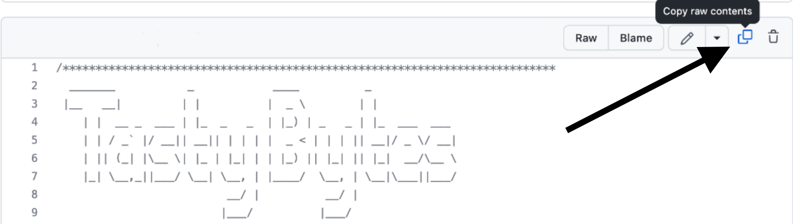

author: Jacob Kranzler
id: tasty_bytes_introduction_es
summary: Esta es la introducción a la quickstart guide de base de datos de Tasty Bytes
categories: Tasty-Bytes, Getting-Started, Featured
environments: web
status: Published 
feedback link: https://github.com/Snowflake-Labs/sfguides/issues
tags: Introducción, Tasty Bytes, De cero a Snowflake, Getting Started, Zero to Snowflake, es

# Introducción a Tasty Bytes
<!-- ------------------------ -->

## Introducción a Tasty Bytes 
Duration: 1 

### Descripción general
En esta quickstart guide Introducción a Tasty Bytes descubrirás, antes de nada, la marca ficticia de food trucks Tasty Bytes, creada por el equipo frostbyte en Snowflake.

Cuando ya conozcas la organización Tasty Bytes, realizaremos el proceso de configuración del modelo de base de datos de Tasty Bytes, además de los roles y almacenes específicos de cada workload, así como cualquier control de acceso basado en funciones (role-based access control, RBAC) que sea necesario. 

Al terminar esta quickstart guide, habrás implementado los conceptos esenciales necesarios para ejecutar el resto de quickstart guides de nuestra sección [ Powered by Tasty Bytes - Quickstart guides](/guide/tasty_bytes_introduction_es/index.html#3).

### ¿Qué es Tasty Bytes?


### Requisitos previos
- Un [Navegador](https://docs.snowflake.com/en/user-guide/setup#browser-requirements) compatible con Snowflake.
- Una cuenta de Snowflake Business Critical o Entreprise.
    - Si no tienes una cuenta de Snowflake, [**regístrate para obtener una cuenta de prueba gratuita durante 30 días**](https://signup.snowflake.com/). Al iniciar sesión, asegúrate de seleccionar **Enterprise Edition**. Puedes elegir cualquier [nube o región de Snowflake](https://docs.snowflake.com/en/user-guide/intro-regions).
    - Después de registrarte, recibirás un correo electrónico con un enlace de activación y la URL de tu cuenta de Snowflake.
    - 
    
### Contenido que se enseñará 
- Cómo crear una hoja de trabajo de Snowflake
- Cómo ejecutar todas las consultas en una misma hoja de trabajo de Snowflake de forma sincronizada
- Cómo analizar bases de datos, esquemas, tablas, roles y almacenes con SQL en una hoja de trabajo de Snowflake

### Cosas que podrás conseguir
- Los conceptos esenciales de Tasty Bytes gracias a los que podrás ejecutar las quickstart guides de Powered by Tasty Bytes: 
    - Una base de datos de Snowflake
    - Esquemas sin procesar, armonizados y analíticos completos con tablas y vistas
    - Roles y almacenes de Snowflake específicos de cada workload
    - Control de acceso basado en funciones (RBAC)

## Configuración de Tasty Bytes
Duration: 6

### Descripción general
En esta quickstart guide, usarás la interfaz web de Snowflake denominada Snowsight. Si es la primera vez que utilizas Snowsight, te recomendamos que eches un vistazo a la [documentación sobre Snowsight](https://docs.snowflake.com/en/user-guide/ui-snowsight), que cuenta con una guía detallada.

### Paso 1: acceder a Snowflake con la URL
- Abre una ventana del navegador e introduce la URL de tu cuenta de Snowflake. Si todavía no tienes una cuenta, vuelve a la sección anterior para iniciar sesión y obtener una cuenta de Snowflake de prueba gratuita. 

### Paso 2: iniciar sesión en Snowflake
- Inicia sesión en tu cuenta de Snowflake.
    - 

### Paso 3: acceder a las hojas de trabajo
- Haz clic en la pestaña Worksheets en la barra de navegación situada a la izquierda para acceder a las hojas de trabajo.
    - 

### Paso 4: crear una hoja de trabajo
- En la pestaña Worksheets, haz clic en el botón “+” en la esquina superior derecha de Snowsight y elige “SQL Worksheet”.
    - 

### Paso 5: cambiar el nombre de una hoja de trabajo
- Cambia el nombre de la hoja de trabajo haciendo clic en el nombre generado automáticamente (marca de tiempo) y escribe “Tasty Bytes - Setup"
    - 

### Paso 6: acceder a un código SQL de configuración alojado en GitHub
- Haz clic en el botón que aparece a continuación. Te redirigirá a nuestro archivo SQL de configuración de Tasty Bytes, alojado en GitHub.

<button>[tb_introduction.sql](https://github.com/Snowflake-Labs/sf-samples/blob/main/samples/tasty_bytes/tb_introduction.sql)</button>

### Paso 7: copiar el código SQL de configuración de GitHub
- En GitHub, ve al lado derecho y haz clic en “Copy raw contents”. De esta forma, se copiará todo el código SQL necesario en el portapapeles.
    - 

### Paso 8: pegar el código SQL de configuración de GitHub en tu hoja de trabajo de Snowflake
- Vuelve a la hoja de trabajo que acabas de crear en Snowsight y pega (*CMD + V para Mac o CTRL + V para Windows*) lo que has copiado de GitHub.

### Paso 9: ejecutar el SQL de configuración de forma sincronizada
- Haz clic dentro de la hoja de trabajo de configuración de Tasty Bytes que acabamos de crear, selecciona todo (*CMD + A para Mac o CTRL + A para Windows*) y haz clic en “► Run” para ejecutarla. 
    - 

### Paso 10: finalizar la configuración
- Después de hacer clic en “► Run”, verás que las consultas empiezan a ejecutarse. Se ejecutarán una tras otra. La ejecución de toda la hoja de trabajo durará unos 5 minutos. Una vez finalizada, aparecerá el mensaje `frostbyte_tasty_bytes setup is now complete` para indicar que la configuración se ha completado.
    - 

### Paso 11: hacer clic en Next -->

## Exploración de los conceptos esenciales de Tasty Bytes
Duration: 2

### Descripción general
Ahora que ya hemos completado la configuración de Tasty Bytes, podemos explorar la base de datos, los roles y los almacenes que hemos creado. 

>aside negative **Nota:** En la hoja de trabajo *Tasty Bytes - Setup* que has creado en la sección anterior, desplázate hasta el final. Ahí, copia, pega y ejecuta el SQL incluido en cada uno de los pasos siguientes.
>

### Paso 1: explorar los conceptos esenciales de Tasty Bytes
Esta consulta con el comando [SHOW DATABASES](https://docs.snowflake.com/en/sql-reference/sql/show-databases.html) devolverá la base de datos que hemos creado. 
```
SHOW DATABASES LIKE 'frostbyte_tasty_bytes';
``` 
 

### Paso 2: explorar los esquemas en la base de datos de Tasty Bytes
Esta consulta con el comando [SHOW SCHEMAS](https://docs.snowflake.com/en/sql-reference/sql/show-schemas) devolverá los esquemas de la base de datos que hemos creado. 
```
SHOW SCHEMAS IN DATABASE frostbyte_tasty_bytes;
``` 
 

### Paso 3: explorar las tablas en el esquema RAW_POS dentro de la base de datos de Tasty Bytes
Esta consulta con el comando [SHOW TABLES](https://docs.snowflake.com/en/sql-reference/sql/show-tables) devolverá las tablas del esquema `raw_pos`. 
```
SHOW TABLES IN SCHEMA frostbyte_tasty_bytes.raw_pos;
``` 
 

### Paso 4: explorar los roles de Tasty Bytes
Esta consulta con el comando [SHOW ROLES](https://docs.snowflake.com/en/sql-reference/sql/show-roles) devolverá los roles que hemos creado. 
```
SHOW ROLES LIKE 'tasty%';
``` 
 

### Paso 5: explorar los almacenes de Tasty Bytes
Esta consulta con el comando [SHOW WAREHOUSES](https://docs.snowflake.com/en/sql-reference/sql/show-warehouses) devolverá los almacenes que hemos creado. 
```
SHOW WAREHOUSES LIKE 'tasty%';
``` 
 

### Paso 6: recopilar todo
Las siguientes tres consultas van a: 1\. Asumir el rol `tasty_data_engineer` mediante [USE ROLE](https://docs.snowflake.com/en/sql-reference/sql/use-role.html) 2. Utilizar el almacén `tasty_de_wh` mediante [USE WAREHOUSE](https://docs.snowflake.com/en/sql-reference/sql/use-warehouse.html) 3. Ejecutar una consulta en la tabla `raw_pos.menu` para saber qué artículos del menú se venden en nuestros food trucks de la línea Plant Palace.
    
``` 
USE ROLE tasty_data_engineer; 
USE WAREHOUSE tasty_de_wh;

SELECT 
    m.menu_type_id, 
    m.menu_type, 
    m.truck_brand_name, 
    m.menu_item_name 
FROM frostbyte_tasty_bytes.raw_pos.menu m 
WHERE m.truck_brand_name = 'Plant Palace'; 
``` 
 

¡Genial! En tan solo unos minutos hemos creado un entorno de demostración completo con datos, roles y almacenes configurados en nuestra cuenta de Snowflake. Ahora vamos a echarle un vistazo al resto de quickstart guides de Tasty Bytes que tenemos a nuestra disposición.

### Paso 7: hacer clic en Next -->

## Powered by Tasty Bytes - Quickstart guides
Duration: 1

### Descripción general
¡Enhorabuena! Has completado la configuración de los conceptos esenciales de Tasty Bytes.

El siguiente índice recoge todas las quickstart guides de Tasty Bytes disponibles que utilizan como base los elementos que acabas de crear.


### De cero a Snowflake

- #### [Transformación](/guide/tasty_bytes_zero_to_snowflake_transformation_es/)
    - Obtén más información sobre Zero Copy Cloning de Snowflake, la caché del conjunto de resultados, Time Travel y las funcionalidades de cambio, borrado y recuperación a nivel de tabla.
- #### [Datos semiestructurados](/guide/tasty_bytes_zero_to_snowflake_semi_structured_data_es/)
    - Obtén más información sobre el tipo de datos VARIANT de Snowflake, el procesamiento de datos semiestructurados con notación de puntos y cómo quitar el formato lateral, así como la creación de vistas y los gráficos de Snowsight.
- #### [Colaboración](/guide/tasty_bytes_zero_to_snowflake_collaboration_es/)
    - Obtén más información sobre Snowflake Marketplace utilizando datos actualizados de Weather Source gratuitos y disponibles al instante para realizar análisis basados en datos de fuentes propias y de terceros armonizados.
- #### [Geoespacial](https://quickstarts.snowflake.com/guide/tasty_bytes_zero_to_snowflake_geospatial/)
    - Obtén más información sobre la asistencia geoespacial de Snowflake, por ejemplo, sobre la adquisición de datos actualizados y gratuitos, disponibles al instante en SafeGraph o la construcción de puntos geográficos (ST_POINT), el cálculo de distancias (ST_DISTANCE), la recopilación de coordenadas (ST_COLLECT), cómo dibujar un polígono de delimitación mínimo (ST_ENVELOPE), el cálculo de área (ST_AREA) y la búsqueda de puntos centrales (ST_CENTROID).

### Guías detalladas de workloads (*próximamente*)
