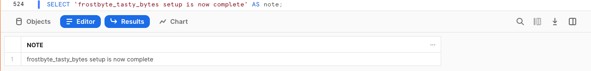
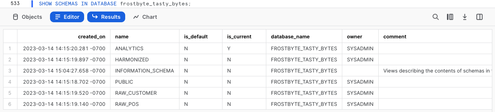
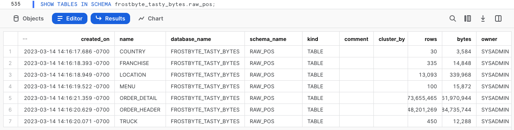
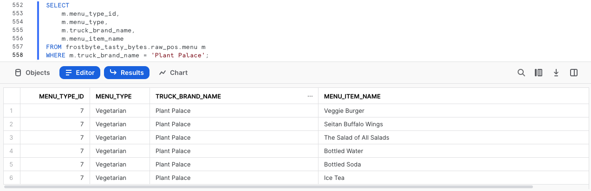

author: Jacob Kranzler
id: tasty_bytes_introduction_it
summary: This is the Tasty Bytes Introduction and Data Foundation Quickstart guide
categories: Tasty-Bytes, Getting-Started, Featured
environments: web
status: Published 
feedback link: https://github.com/Snowflake-Labs/sfguides/issues
tags: Getting Started, Tasty Bytes, Zero to Snowflake, it  

# Introduzione a Tasty Bytes
<!-- ------------------------ -->

## Introduzione a Tasty Bytes 
Duration: 1 

### Panoramica
In questo quickstart Introduzione a Tasty Bytes per prima cosa farai la conoscenza del marchio fittizio di food truck Tasty Bytes, creato dal team frostbyte di Snowflake.

Dopo avere conosciuto l’organizzazione Tasty Bytes, completeremo la configurazione del suo modello dati di base, dei ruoli e dei warehouse specifici per i workload e di tutti i controlli degli accessi basati sui ruoli (RBAC) necessari. 

Al termine di questo quickstart avrai implementato l’ambiente base necessario per eseguire i quickstart contenuti nella sezione [Quickstart Powered by Tasty Bytes](https://quickstarts.snowflake.com/guide/tasty_bytes_introduction/index.html#3).

### Che cos’è Tasty Bytes?


### Prerequisiti
- Un [browser](https://docs.snowflake.com/en/user-guide/setup#browser-requirements) Snowflake supportato
- Un account Snowflake Enterprise o Business Critical
    - Se non hai un account Snowflake, [**richiedi la tua prova gratuita di 30 giorni**](https://signup.snowflake.com/). Al momento della registrazione, assicurati di selezionare **Enterprise** Edition. Puoi scegliere qualsiasi [cloud o regione di Snowflake](https://docs.snowflake.com/en/user-guide/intro-regions).
    - Al termine della registrazione, riceverai un’email con un link per l’attivazione e l’URL del tuo account Snowflake.
    - 
    
### Cosa imparerai 
- Come creare un foglio di lavoro Snowflake
- Come eseguire tutte le query in un foglio di lavoro Snowflake in modo sincrono
- Come esplorare database, schemi, tabelle, ruoli e warehouse tramite SQL in un foglio di lavoro Snowflake

### Cosa realizzerai
- L’ambiente base di Tasty Bytes che ti consentirà di eseguire i quickstart Powered by Tasty Bytes. 
    - Un database Snowflake
    - Schemi di dati grezzi, armonizzati e analitici completi di tabelle e viste
    - Ruoli e warehouse di Snowflake specifici per i workload
    - Controllo degli accessi basato sui ruoli (RBAC)

## Configurare Tasty Bytes
Duration: 6

### Panoramica
Per questo quickstart utilizzerai l’interfaccia web di Snowflake nota come Snowsight. Se questa è la prima volta che utilizzi Snowsight, ti consigliamo caldamente di dare un’occhiata alla [documentazione di Snowsight](https://docs.snowflake.com/en/user-guide/ui-snowsight) per una spiegazione a livello generale.

### Passaggio 1 - Accedere a Snowflake tramite URL
- Apri una finestra del browser e inserisci l’URL del tuo account Snowflake. Se non hai già un account Snowflake, torna alla sezione precedente e registrati per provare Snowflake gratuitamente. 

### Passaggio 2 - Effettuare l’accesso a Snowflake
- Accedi al tuo account Snowflake.
    - 

### Passaggio 3 - Accedere ai fogli di lavoro
- Fai clic sulla scheda Worksheets nella barra di navigazione sulla sinistra.
    - 

### Passaggio 4 - Creare un foglio di lavoro
- Nella scheda Worksheets, fai clic sul pulsante “+” nell’angolo superiore destro di Snowsight e scegli “SQL Worksheet”
    - 

### Passaggio 5 - Rinominare un foglio di lavoro
- Rinomina il foglio di lavoro facendo clic sul nome generato automaticamente (data e ora) e inserendo “Tasty Bytes - Setup”
    - 

### Passaggio 6 - Accedere al file di configurazione SQL su GitHub
- Fai clic sul pulsante qui sotto, che ti porterà al file di configurazione SQL di Tasty Bytes archiviato su GitHub.

<button>[tb\_introduction.sql](https://github.com/Snowflake-Labs/sf-samples/blob/main/samples/tasty_bytes/tb_introduction.sql)</button>

### Passaggio 7 - Copiare la configurazione SQL da GitHub
- In GitHub, vai sul lato destro e fai clic su “Copy raw contents”. Tutto il codice SQL necessario verrà copiato nei tuoi Appunti.
    - 

### Passaggio 8 - Incollare la configurazione SQL da GitHub nel tuo foglio di lavoro Snowflake
- Torna a Snowsight e al foglio di lavoro che hai appena creato e incolla (*CMD + V per Mac o CTRL + V per Windows*) il codice che abbiamo appena copiato da GitHub.

### Passaggio 9 - Eseguire in modo sincrono tutto il codice SQL di configurazione
- Fai clic nel foglio di lavoro “Tasty Bytes - Setup” appena creato, seleziona tutto (*CMD + A per Mac o CTRL + A per Windows*) e fai clic su “► Run” 
    - 

### Passaggio 10 - Completare la configurazione
- Dopo avere fatto clic su “► Run” inizierà l’esecuzione delle query. Queste query verranno eseguite una dopo l’altra e l’intero foglio di lavoro richiederà circa 5 minuti. Al termine comparirà il seguente messaggio: `frostbyte_tasty_bytes setup is now complete` .
    - 

### Passaggio 11 - Fai clic su Next -->

## Esplorare l’ambiente base di Tasty Bytes
Duration: 2

### Panoramica
Dopo avere completato correttamente la configurazione di Tasty Bytes, possiamo esplorare il database, i ruoli e i warehouse che abbiamo creato. 

>aside negative **Nota:** all’interno del foglio di lavoro *Tasty Bytes - Setup* che hai creato nella sezione precedente, scorri fino in fondo e copia, incolla ed esegui il codice SQL incluso in ciascuno dei seguenti passaggi.
>

### Passaggio 1 - Esplorare il database Tasty Bytes
Questa query restituisce il database che abbiamo creato tramite [SHOW DATABASES](https://docs.snowflake.com/en/sql-reference/sql/show-databases.html).
 ```
USE ROLE sysadmin;
SHOW DATABASES LIKE 'frostbyte_tasty_bytes';
``` 
 

### Passaggio 2 - Esplorare gli schemi nel database Tasty Bytes
Questa query restituisce gli schemi all’interno del database che abbiamo creato tramite [SHOW SCHEMAS](https://docs.snowflake.com/en/sql-reference/sql/show-schemas). 
```
SHOW SCHEMAS IN DATABASE frostbyte_tasty_bytes;
``` 
 

### Passaggio 3 - Esplorare le tabelle nello schema RAW\_POS all’interno del database Tasty Bytes
Questa query restituisce le tabelle all’interno dello schema `raw_pos` tramite [SHOW TABLES](https://docs.snowflake.com/en/sql-reference/sql/show-tables) 
```
SHOW TABLES IN SCHEMA frostbyte_tasty_bytes.raw_pos;
``` 
 

### Passaggio 4 - Esplorare i ruoli di Tasty Bytes
Questa query restituisce i ruoli che abbiamo creato tramite [SHOW ROLES](https://docs.snowflake.com/en/sql-reference/sql/show-roles). 
```
SHOW ROLES LIKE 'tasty%';
``` 
 

### Passaggio 5 - Esplorare i warehouse Tasty Bytes
Questa query restituisce i warehouse che abbiamo creato tramite [SHOW WAREHOUSES](https://docs.snowflake.com/en/sql-reference/sql/show-warehouses). 
```
SHOW WAREHOUSES LIKE 'tasty%';
``` 
 

### Passaggio 6 - Combinare tutti gli elementi
Le prossime tre query: 
1. Assumono il ruolo `tasty_data_engineer` tramite [USE ROLE](https://docs.snowflake.com/en/sql-reference/sql/use-role.html) 
2. Utilizzano il warehouse `tasty_de_wh` tramite [USE WAREHOUSE](https://docs.snowflake.com/en/sql-reference/sql/use-warehouse.html) 
3. Interrogano la tabella `raw_pos.menu` per trovare quali voci di menu sono vendute nei food truck con il marchio Plant Palace.
    
```
USE ROLE tasty_data_engineer;
USE WAREHOUSE tasty_de_wh;

SELECT
    m.menu_type_id,
    m.menu_type,
    m.truck_brand_name,
    m.menu_item_name
FROM frostbyte_tasty_bytes.raw_pos.menu m
WHERE m.truck_brand_name = 'Plant Palace';
```
 

Fantastico! In pochi minuti abbiamo configurato un ambiente demo Tasty Bytes completo di dati, ruoli e warehouse nel nostro account Snowflake. Ora diamo un’occhiata a tutti gli altri quickstart Tasty Bytes a nostra disposizione.

### Passaggio 7 - Fai clic su Next -->

## Quickstart Powered by Tasty Bytes
Duration: 1

### Panoramica
Congratulazioni! Hai completato la configurazione dell’ambiente base di Tasty Bytes.

Il sommario riportato di seguito descrive tutti i quickstart Tasty Bytes disponibili che utilizzano l’ambiente base che hai appena creato.


### Da zero a Snowflake

- #### [Governance finanziaria](https://quickstarts.snowflake.com/guide/tasty_bytes_zero_to_snowflake_financial_governance/)
    - Scopri i Virtual Warehouse di Snowflake con le loro configurabilità, i monitor delle risorse e i parametri di timeout a livello di account e di warehouse.
- #### [Trasformazione](/guide/tasty_bytes_zero_to_snowflake_transformation_it/)
    - Scopri le funzionalità di cache dei set di risultati, Zero-Copy Cloning, manipolazione delle tabelle, Time Travel e swap, drop e undrop delle tabelle di Snowflake.
- #### [Dati semi-strutturati](/guide/tasty_bytes_zero_to_snowflake_semi_structured_data_it/)
    - Scopri il tipo di dati VARIANT di Snowflake, l’elaborazione dei dati semi-strutturati tramite notazione punto e appiattimento laterale, la creazione di viste e i grafici Snowsight.
- #### [Governance dei dati](https://quickstarts.snowflake.com/guide/tasty_bytes_zero_to_snowflake_data_governance/)
    - Scopri i ruoli definiti dal sistema di Snowflake, crea e concedi privilegi a un ruolo personalizzato e implementa Dynamic Data Masking basato sui tag e Row Access Policies.
- #### [Collaborazione](/guide/tasty_bytes_zero_to_snowflake_collaboration_it/)
    - Scopri il Marketplace Snowflake utilizzando dati aggiornati gratuiti e immediatamente disponibili forniti da Weather Source per svolgere analisi data-driven armonizzando le fonti di dati interne ed esterne.
- #### [Analisi geospaziale](https://quickstarts.snowflake.com/guide/tasty_bytes_zero_to_snowflake_geospatial/)
    - Scopri il supporto per l’analisi geospaziale di Snowflake, iniziando dall’acquisizione di dati aggiornati gratuiti e immediatamente disponibili da SafeGraph per poi creare punti geografici (ST\_POINT), calcolare distanze (ST\_DISTANCE), raccogliere coordinate (ST\_COLLECT), disegnare un poligono di delimitazione minimo (ST\_ENVELOPE), calcolare aree (ST\_AREA) e trovare i punti centrali (ST\_CENTROID).

### Approfondimenti sui workload (*disponibili a breve*)


