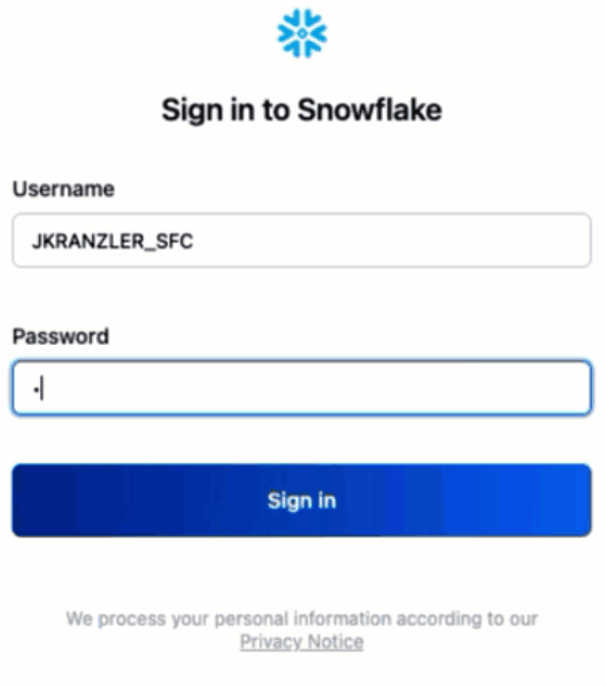
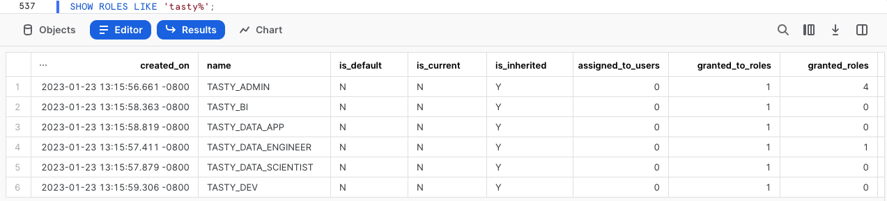
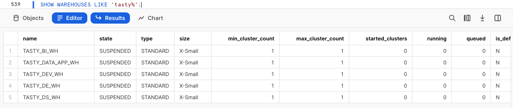

author: Jacob Kranzler
id: tasty_bytes_introduction_ja
summary: これはTasty Bytesの紹介とデータ基盤クイックスタートガイドです。
categories: Tasty-Bytes, Getting-Started, Featured
environments: web
status: Published 
feedback link: https://github.com/Snowflake-Labs/sfguides/issues
tags: Getting Started, Tasty Bytes, Zero to Snowflake, ja

# Tasty Bytesの紹介

<!-- ------------------------ -->
## Tasty Bytesの紹介
Duration: 1


### 概要
このTasty Bytes紹介クイックスタートでは、まずSnowflakeのfrostbyteチームによって作成された架空のキッチンカーブランド、Tasty Bytesについて学びます。

Tasty Bytesの組織について学んだ後、Tasty Bytes基盤のデータモデル、ワークロード固有のロールとウェアハウス、必要なすべてのロールベースのアクセス制御（RBAC）を設定するプロセスを完了します。

このクイックスタートを終了すると、「[Powered by Tasty Bytes - クイックスタート](https://quickstarts.snowflake.com/guide/tasty_bytes_introduction/index.html#3)」セクションにあるクイックスタートを実行するために必要な基盤が展開されます。

### Tasty Bytesとは


### 前提条件
- サポートされているSnowflake[ブラウザ](https://docs.snowflake.com/en/user-guide/setup#browser-requirements)
- エンタープライズまたはビジネスクリティカルなSnowflakeアカウント
  - Snowflakeアカウントをお持ちでない場合は、[**30日間の無料トライアルアカウントに登録してください**](https://signup.snowflake.com/)。サインアップする際は、必ず**エンタープライズ**エディションを選択してください。[Snowflakeクラウド/リージョン](https://docs.snowflake.com/en/user-guide/intro-regions)は、どれを選択しても構いません。
  - 登録後、アクティベーションリンクとSnowflakeアカウントURLが記載されたメールが届きます。
  - 

### 学習する内容
- Snowflakeワークシートの作成方法
- Snowflakeワークシート内のすべてのクエリを同期的に実行する方法
- SnowflakeワークシートでSQLを使用してデータベース、スキーマ、テーブル、ロール、ウェアハウスを探索する方法

### 構築するもの
- Powered by Tasty Bytes - クイックスタートを実行するためのTasty Bytes基盤。
  - Snowflakeデータベース
  - テーブルとビューを含む未加工スキーマ、整合スキーマ、分析スキーマ
  - ワークロード固有のSnowflakeロールとウェアハウス
  - ロールベースのアクセス制御（RBAC）

## Tasty Bytesの設定
Duration: 6

### 概要
このクイックスタートでは、Snowsightとして知られるSnowflakeウェブインターフェースを使用します。Snowsightを初めて利用する場合は、[Snowsightのドキュメント](https://docs.snowflake.com/en/user-guide/ui-snowsight)でその概要を確認することを強くお勧めします。

### ステップ1 - URLでSnowflakeにアクセスする
- ブラウザウィンドウを開き、SnowflakeアカウントのURLを入力します。Snowflakeアカウントをまだお持ちでない場合は、前のセクションに戻って無料のSnowflakeトライアルアカウントに登録してください。

### ステップ2 - Snowflakeにログインする
- Snowflakeアカウントにログインします。
  - 

### ステップ3 - ワークシートに移動する
- 左側のナビゲーションバーにある「ワークシート」タブをクリックします。
  - 

### ステップ4 - ワークシートを作成する
- ワークシート内で、Snowsightの右上にある「+」ボタンをクリックし、「SQLワークシート」を選択します。
  - 

### ステップ5 - ワークシートの名前を変更する
- 自動生成されたタイムスタンプ名をクリックし、「Tasty Bytes - 設定」と入力してワークシートの名前を変更します。
  - 

### ステップ6 - GitHubでホストされているSetup SQLにアクセスする
- 下のボタンをクリックすると、GitHubでホストされているTasty BytesのSQL設定ファイルに移動します。

<button>[tb_introduction.sql](https://github.com/Snowflake-Labs/sf-samples/blob/main/samples/tasty_bytes/tb_introduction.sql)</button>

### ステップ7 - GitHubからSetup SQLをコピーする
- GitHub内で右側に移動し、「未加工コンテンツをコピー」をクリックします。これで、必要なSQLがすべてクリップボードにコピーされます。
  - 

### ステップ8 - GitHubからSnowflakeワークシートにSetup SQLを貼り付ける
- Snowsightと新しく作成したワークシートに戻り、先ほどGitHubからコピーしたものを貼り付けます（*Macの場合はCMD + V、Windowsの場合はCTRL + V*）。

### ステップ9 - すべてのSetup SQLを同期的に実行する
- 新しく作成したTasty Bytes - 設定ワークシート内をクリックし、すべて選択し（*Macの場合はCMD + A、Windowsの場合はCTRL + A*)、「► 実行」をクリックします。
  - 

### ステップ10 - 設定を完了する
- 「► 実行」をクリックすると、クエリが実行されます。これらのクエリは順次実行され、ワークシート全体では約5分かかります。完了すると、「`frostbyte_tasty_bytes setup is now complete`」というメッセージが表示されます。
  - 

### ステップ11 - 「Next」をクリックする

## Tasty Bytes基盤の探索
Duration: 2

### 概要
Tasty Bytesの設定が完了したので、作成したデータベース、ロール、ウェアハウスを探索できるようになりました。

>aside negative
> **注意：** 前のセクションで作成した*Tasty Bytes - 設定*ワークシート内で、一番下までスクロールし、以下の各ステップに含まれるSQLをコピーアンドペースとして、実行してください。
>

### ステップ1 - Tasty Bytesデータベースを探索する
このクエリは、[SHOW DATABASES](https://docs.snowflake.com/en/sql-reference/sql/show-databases.html)で作成したデータベースを返します。
```
SHOW DATABASES LIKE 'frostbyte_tasty_bytes';
```
 

### ステップ2 - Tasty Bytesデータベース内のスキーマを探索する
このクエリは、[SHOW SCHEMAS](https://docs.snowflake.com/en/sql-reference/sql/show-schemas)で作成したデータベース内のスキーマを返します。
```
SHOW SCHEMAS IN DATABASE frostbyte_tasty_bytes;
```
 

### ステップ3 - Tasty Bytesデータベース内のRAW_POSスキーマ内のテーブルを探索する
このクエリは、[SHOW TABLES](https://docs.snowflake.com/en/sql-reference/sql/show-tables)を使用して`raw_pos`スキーマ内のテーブルを返します。
```
SHOW TABLES IN SCHEMA frostbyte_tasty_bytes.raw_pos;
```
 

### ステップ4 - Tasty Bytesロールを探索する
このクエリは、[SHOW ROLES](https://docs.snowflake.com/en/sql-reference/sql/show-roles)で作成したロールを返します。
```
SHOW ROLES LIKE 'tasty%';
```
 

### ステップ5 - Tasty Bytesウェアハウスを探索する
このクエリは、[SHOW WAREHOUSES](https://docs.snowflake.com/en/sql-reference/sql/show-warehouses)で作成したウェアハウスを返します。
```
SHOW WAREHOUSES LIKE 'tasty%';
```
 

### ステップ6 - すべてをまとめる
次の3つのクエリを使用して以下を実行します。
1. [USE ROLE](https://docs.snowflake.com/en/sql-reference/sql/use-role.html)を使用して`tasty_data_engineer`ロールを引き受けます。
2. [USE WAREHOUSE](https://docs.snowflake.com/en/sql-reference/sql/use-warehouse.html)を使用して`tasty_de_wh`ウェアハウスを活用します。
3. `raw_pos.menu`テーブルをクエリし、Plant Palaceブランドのキッチンカーで販売されているメニュー項目を検索します。

```
USE ROLE tasty_data_engineer;
USE WAREHOUSE tasty_de_wh;

SELECT
    m.menu_type_id,
    m.menu_type,
    m.truck_brand_name,
    m.menu_item_name
FROM frostbyte_tasty_bytes.raw_pos.menu m
WHERE m.truck_brand_name = 'Plant Palace';
```


驚きました！数分で、データ、ロール、ウェアハウスを完備したTasty Bytesのデモ環境がSnowflakeアカウントに設定されました。それでは、私たちが活用できる他のTasty Bytesクイックスタートをすべて見てみましょう。

### ステップ7 - 「Next」をクリックする

## Powered by Tasty Bytes - クイックスタート
Duration: 1

### 概要
おめでとうございます。これでTasty Bytes基盤の設定が完了しました。

以下の目次には、先ほど構築した基盤を活用する、利用可能なTasty Bytesクイックスタートの概要が記載されています。


### ゼロからのSnowflake

- #### [財務ガバナンス](https://quickstarts.snowflake.com/guide/tasty_bytes_zero_to_snowflake_financial_governance/)
  
  - Snowflake仮想ウェアハウスとその構成、リソースモニター、アカウントおよびウェアハウスレベルのタイムアウトパラメータについて学びます。
- #### [変換](https://quickstarts.snowflake.com/guide/tasty_bytes_zero_to_snowflake_transformation/)
  
  - Snowflakeのゼロコピークローン、結果セットキャッシュ、テーブル操作、タイムトラベル、テーブルレベルのスワップ、ドロップ、アンドロップ機能について学びます。
- #### [半構造化データ](https://quickstarts.snowflake.com/guide/tasty_bytes_zero_to_snowflake_semi_structured_data/)
  
  - SnowflakeのVARIANTデータ型、ドット表記による半構造化データ処理、ラテラルフラット化、ビュー作成、Snowsightチャートについて学びます。
- #### [データガバナンス](https://quickstarts.snowflake.com/guide/tasty_bytes_zero_to_snowflake_data_governance/)
  
  - Snowflakeのシステム定義ロールについて学び、カスタムロールを作成して権限を付与し、タグベースのダイナミックデータマスキングと行アクセスポリシーの両方を展開します。
- #### [コラボレーション](https://quickstarts.snowflake.com/guide/tasty_bytes_zero_to_snowflake_collaboration/)
  
  - Weathersourceから無料ですぐに利用できるライブデータを活用して、ファーストパーティとサードパーティのソースを調和させたデータドリブンな分析を行うことで、Snowflakeマーケットプレイスに関する理解を深めます。
- #### [地理空間](https://quickstarts.snowflake.com/guide/tasty_bytes_zero_to_snowflake_geospatial/)
  
  - SafeGraphから無料ですぐに利用できるライブデータの取得から、地理点の構築（ST_POINT）、距離の計算（ST_DISTANCE）、座標の収集（ST_COLLECT）、最小境界ポリゴンの描画（ST_ENVELOPE）、面積の計算（ST_AREA）、中心点の検出（ST_CENTROID）まで、Snowflakeの地理空間サポートについて学びます。

### ワークロードの詳細（*近日公開予定*）