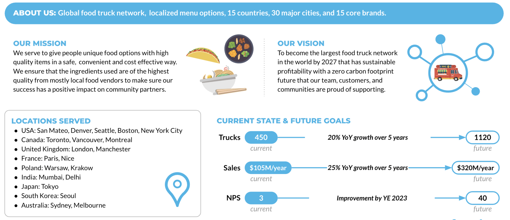
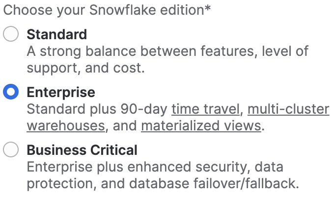
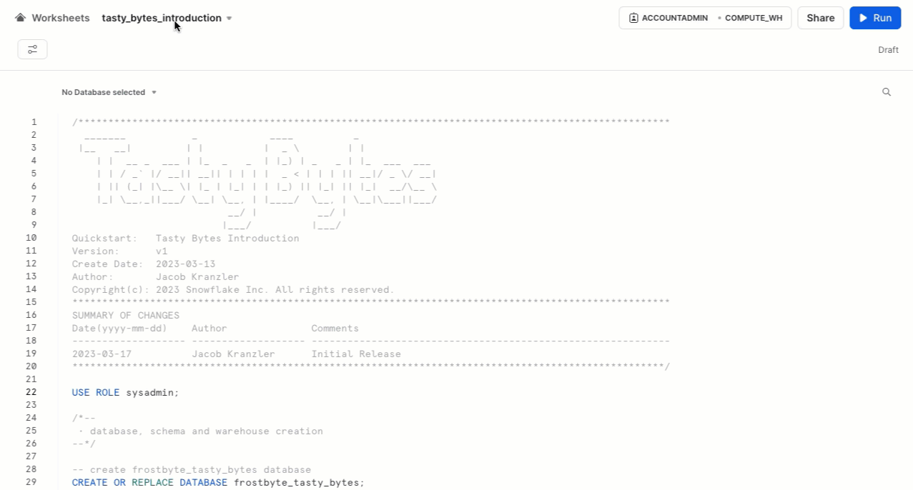
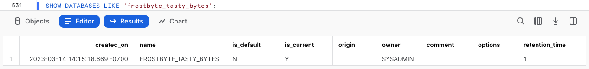
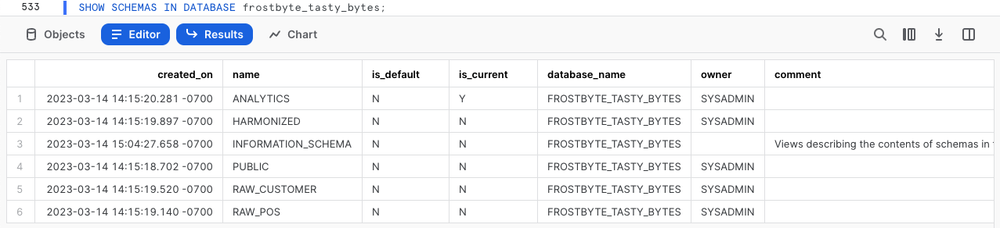
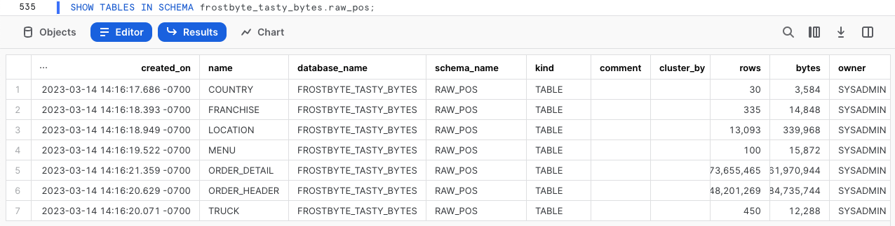
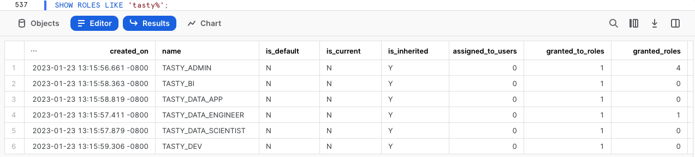

author: Jacob Kranzler
id: tasty_bytes_introduction_kr
summary: This is the Tasty Bytes Introduction and Data Foundation Quickstart guide
categories: Tasty-Bytes, Getting-Started, Featured
environments: web
status: Published 
feedback link: https://github.com/Snowflake-Labs/sfguides/issues
tags: Getting Started, Tasty Bytes, Zero to Snowflake, kr

# Tasty Bytes 소개

<!-- ------------------------ -->
## Tasty Bytes 소개

Duration: 1 

### 개요

이 Tasty Bytes 소개 Quickstart에서는 우선 Snowflake의 frostbyte 팀이 생성한 Tasty Bytes라는 가상의 푸드 트럭 브랜드에 대해 알아보겠습니다.

Tasty Bytes 조직에 대해 알아본 후에는 Tasty Bytes 기초 데이터 모델, 워크로드 전용 역할 및 웨어하우스, 모든 필수 역할 기반 액세스 제어(RBAC) 설정 프로세스를 완료하겠습니다.

이 Quickstart를 완료한 시점에는 [Tasty Bytes 사용 - Quickstart](/guide/tasty_bytes_introduction_kr/index.html#3) 섹션에서 확인할 수 있는 Quickstart를 실행하는 데 필요한 상태일 것입니다.

### Tasty Bytes란 무엇일까요?



### 사전 필요 조건 및 지식

- 지원되는 Snowflake [브라우저](https://docs.snowflake.com/ko/user-guide/setup#browser-requirements)
- 엔터프라이즈 또는 비즈니스 크리티컬 Snowflake 계정
  - Snowflake 계정이 없다면 [**30일 무료 평가판 계정을 위해 등록하십시오**](https://signup.snowflake.com/). 등록할 때 **엔터프라이즈** 에디션을 선택하셔야 합니다. 아무 [Snowflake 클라우드 또는 리전](https://docs.snowflake.com/ko/user-guide/intro-regions)을 선택하셔도 됩니다.
  - 등록한 후 활성화 링크와 Snowflake 계정 URL이 포함된 이메일이 전송됩니다.
  - 


### 알아볼 내용

- Snowflake 워크시트 생성하기
- Snowflake 워크시트 내에서 동시에 모든 쿼리 실행하기
- Snowflake 워크시트에서 SQL을 통해 데이터베이스, 스키마, 테이블, 역할 및 웨어하우스 탐색하기

### 구축할 것

- Tasty Bytes 사용 - Quickstart를 실행할 수 있도록 하는 Tasty Bytes 기초
  - Snowflake 데이터베이스
  - 테이블 및 뷰가 포함된 가공 전, 조정 및 분석 스키마
  - 워크로드 전용 Snowflake 역할 및 웨어하우스
  - 역할 기반 액세스 제어(RBAC)

## Tasty Bytes 설정

Duration: 6

### 개요

이 Quickstart에서는 Snowsight로 알려진 Snowflake 웹 인터페이스를 사용하겠습니다. Snowsight를 처음 활용하는 것이라면 개괄적인 검토를 위해 [Snowsight 설명서](https://docs.snowflake.com/ko/user-guide/ui-snowsight)를 확인하는 것이 좋습니다.

### 1단계 - URL을 통해 Snowflake에 액세스

- 브라우저 창을 열고 Snowflake 계정 URL을 입력합니다. 아직 Snowflake 계정이 없다면 무료 Snowflake 평가판 계정을 위해 등록하기 위해 이전 섹션으로 되돌아가십시오.

### 2단계 - Snowflake에 로그인

- Snowflake 계정에 로그인합니다.
  - 


### 3단계 - Worksheets로 이동

- 왼쪽 탐색 메뉴에 있는 Worksheets 탭을 클릭합니다.
  - 


### 4단계 - 워크시트 생성

- Worksheets 내에서 Snowsight 오른쪽 상단 모서리에 있는 ‘+’ 버튼을 클릭하고 ‘SQL Worksheet’를 선택합니다.
  - 


### 5단계 - 워크시트 이름 바꾸기

- 자동으로 생성된 Timestamp 이름을 클릭하고 ‘Tasty Bytes - Setup’을 입력하여 워크시트의 이름을 바꿉니다.
  - 


### 6단계 - GitHub에서 호스팅된 설정 SQL에 액세스

- GitHub에서 호스팅된 Tasty Bytes SQL 설정 파일과 연결된 아래 버튼을 클릭합니다.

<button>[tb_introduction.sql](https://github.com/Snowflake-Labs/sf-samples/blob/main/samples/tasty_bytes/tb_introduction.sql)</button>

### 7단계 - GitHub에서 설정 SQL 복사

- GitHub 내에서 오른쪽으로 이동하여 ‘Copy raw contents’를 클릭합니다. 이렇게 하면 모든 필수 SQL이 클립보드로 복사됩니다.
  - 


### 8단계 - 설정 SQL을 GitHub에서 Snowflake 워크시트로 붙여넣기

- Snowsight 및 새롭게 생성한 워크시트로 되돌아가 방금 GitHub에서 복사한 것을 붙여넣습니다(*Mac 바로 가기 키 CMD + V, Windows 바로 가기 키 CTRL + V*).

### 9단계 - 모든 설정 SQL 동시 실행

- 새롭게 생성한 Tasty Bytes - Setup 워크시트 내부를 클릭하고 모두 선택(Mac 바로 가기 키 *CMD + A, Windows 바로 가기 키 CTRL + A*)한 후 ‘► Run’을 클릭합니다.
  - 


### 10단계 - 설정 완료

- ‘► Run’을 클릭한 후 쿼리가 실행되기 시작합니다. 이러한 쿼리는 순차적으로 실행되며 전체 워크시트를 실행하는 데 약 5분이 소요됩니다. 완료된 후 `frostbyte_tasty_bytes setup is now complete`라는 메시지가 나타납니다.
  - 


### 11단계 - 다음 클릭 -->

## Tasty Bytes 기초 탐색

Duration: 2

### 개요

Tasty Bytes 설정이 성공적으로 완료되면 이제 생성한 데이터베이스, 역할 및 웨어하우스를 탐색할 수 있습니다.

> aside negative **참고:** 이전 섹션에서 생성한 *Tasty Bytes - Setup* 워크시트 내에서 하단까지 스크롤하여 아래에 있는 각 단계에 포함된 SQL을 복사하고, 붙여넣고, 실행하십시오.

### 1단계 - Tasty Bytes 데이터베이스 탐색

이 쿼리는 [SHOW DATABASES](https://docs.snowflake.com/ko/sql-reference/sql/show-databases.html)를 통해 생성한 데이터베이스를 반환합니다.

```
SHOW DATABASES LIKE 'frostbyte_tasty_bytes';
```

 
### 2단계 - Tasty Bytes 데이터베이스 내 스키마 탐색

이 쿼리는 [SHOW SCHEMAS](https://docs.snowflake.com/ko/sql-reference/sql/show-schemas)를 통해 생성한 데이터베이스 내 스키마를 반환합니다.

```
SHOW SCHEMAS IN DATABASE frostbyte_tasty_bytes;
```

 
### 3단계 - Tasty Bytes 데이터베이스의 RAW_POS 스키마 내 테이블 탐색

이 쿼리는 [SHOW TABLES](https://docs.snowflake.com/ko/sql-reference/sql/show-tables)를 통해 `raw_pos` 스키마 내 테이블을 반환합니다.

```
SHOW TABLES IN SCHEMA frostbyte_tasty_bytes.raw_pos;
```

 
### 4단계 - Tasty Bytes 역할 탐색

이 쿼리는 [SHOW ROLES](https://docs.snowflake.com/ko/sql-reference/sql/show-roles)를 통해 생성한 역할을 반환합니다.

```
SHOW ROLES LIKE 'tasty%';
```

 
### 5단계 - Tasty Bytes 웨어하우스 탐색

이 쿼리는 [SHOW WAREHOUSES](https://docs.snowflake.com/ko/sql-reference/sql/show-warehouses)를 통해 생성한 웨어하우스를 반환합니다.

```
SHOW WAREHOUSES LIKE 'tasty%';
```

 
### 6단계 - 결합

다음 3개의 쿼리는 다음 작업을 수행합니다.

1. [USE ROLE](https://docs.snowflake.com/ko/sql-reference/sql/use-role.html)을 통해 `tasty_data_engineer` 역할 사용
2. [USE WAREHOUSE](https://docs.snowflake.com/ko/sql-reference/sql/use-warehouse.html)를 통해 `tasty_de_wh` 웨어하우스 활용
3. Plant Palace라는 브랜드의 푸드 트럭에서 판매하는 메뉴 항목을 찾기 위해 `raw_pos.menu` 테이블 쿼리

```
USE ROLE tasty_data_engineer;
USE WAREHOUSE tasty_de_wh;

SELECT
    m.menu_type_id,
    m.menu_type,
    m.truck_brand_name,
    m.menu_item_name
FROM frostbyte_tasty_bytes.raw_pos.menu m
WHERE m.truck_brand_name = 'Plant Palace';
```

 
훌륭합니다! 몇 분 만에 이제 Tasty Bytes 데모 환경이 준비되었으며 Snowflake 계정에서 데모, 역할 및 웨어하우스가 설정되었습니다. 이제 활용할 수 있도록 제공되는 다른 모든 Tasty Bytes Quickstart를 살펴보겠습니다.

### 7단계 - 다음 클릭 -->

## Tasty Bytes 사용 - Quickstart

Duration: 1

### 개요

축하합니다! 이제 Tasty Bytes 기초 설정을 완료하셨습니다!

아래 목차는 방금 구축한 기초를 활용하는 사용 가능한 모든 Tasty Bytes Quickstart를 알려줍니다.


### 제로부터 Snowflake까지

- #### [금융 거버넌스](https://quickstarts.snowflake.com/guide/tasty_bytes_zero_to_snowflake_financial_governance/)
  - Snowflake 가상 웨어하우스 및 구성 가능성, 리소스 모니터 그리고 계정 및 웨어하우스 수준 시간 초과 매개변수를 알아보십시오.
- #### [변환](/guide/tasty_bytes_zero_to_snowflake_transformation_kr/)
    - 제로 카피 클론, 결과 세트 캐시, 테이블 조작, Time Travel 및 테이블 수준 교체 그리고 드롭 및 드롭 취소 기능을 알아보십시오.
- #### [반정형 데이터](/guide/tasty_bytes_zero_to_snowflake_semi_structured_data_kr/)
  
  - Snowflake VARIANT 데이터 유형, 점표기법 및 래터럴 평면화를 통한 반정형 데이터 처리, 뷰 생성 그리고 Snowsight 그래프 생성을 알아보십시오.
- #### [데이터 거버넌스](https://quickstarts.snowflake.com/guide/tasty_bytes_zero_to_snowflake_data_governance/)
  
  - Snowflake 시스템 정의 역할, 사용자 정의 역할 생성 및 허가 적용 그리고 태그 기반 동적 데이터 마스킹 및 행 액세스 정책 배포를 알아보십시오.
- #### [협업](/guide/tasty_bytes_zero_to_snowflake_collaboration_kr/)
  
  - 자사 및 서드 파티 소스를 조정하여 데이터 기반 분석을 수행하기 위해 Weathersource에서 제공하는 즉각적으로 사용 가능한 무료 라이브 데이터를 활용하여 Snowflake 마켓플레이스를 알아보십시오.
- #### [지리 공간](https://quickstarts.snowflake.com/guide/tasty_bytes_zero_to_snowflake_geospatial/)
  
  - SafeGraph에서 제공하는 즉각적으로 사용 가능한 무료 라이브 데이터를 습득하는 것부터 시작하여 지리 공간 지점을 만들고(ST_POINT), 거리를 계산하고(ST_DISTANCE), 좌표를 수집하고(ST_COLLECT), 최소 바운딩 폴리곤을 그리고(ST_ENVELOPE), 면적을 계산하고(ST_AREA), 중심점을 찾아(ST_CENTROID) Snowflake 지리 공간 지원을 알아보십시오.

### 워크로드 심층적으로 알아보기(*곧 제공 예정*)
