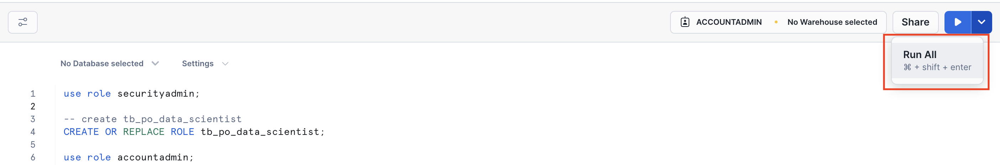
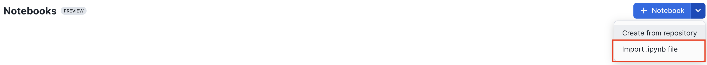
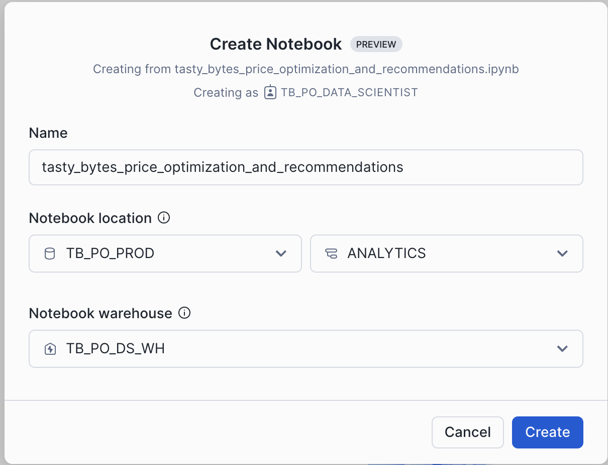
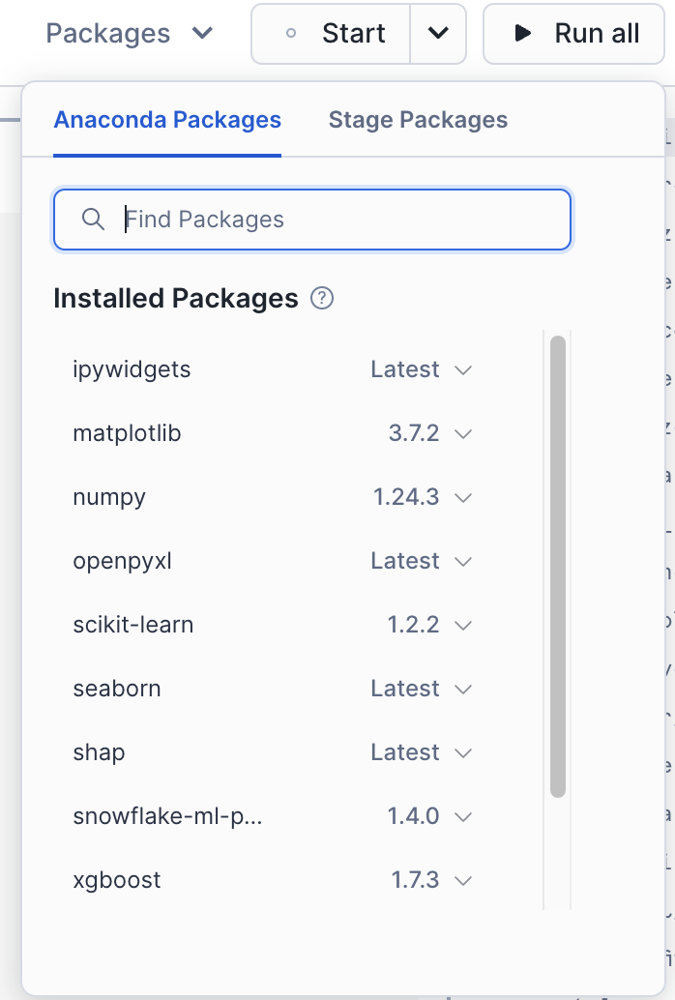
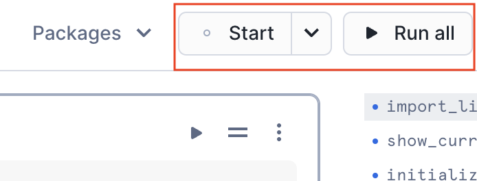
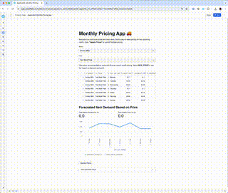
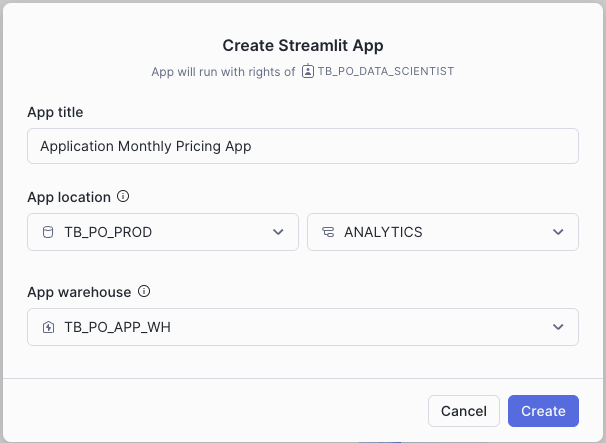
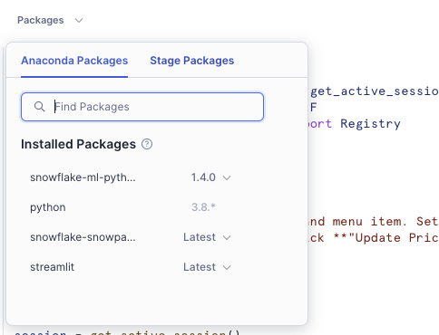

author: Joviane Bellegarde
id: tasty_bytes_price_optimization_using_snowflake_notebooks_and_streamlit
summary: Price Optimization Using Snowflake Notebooks and Streamlit
categories: Tasty-Bytes, Getting-Started
environments: web
status: Unpublished
feedback link: https://github.com/Snowflake-Labs/sfguides/issues
tags: Getting Started, Tasty Bytes, Price Optimization, Notebooks

# Price Optimization using Snowflake Notebooks and Streamlit in Snowflake
<!-- ------------------------ -->

## Overview
Duration: 2


Tasty Bytes, a fictitious company, is one of the largest food truck networks in the world with localized menu options spread across 15 food truck brands globally. Tasty Bytes is aiming to achieve 25% YoY sales growth over 5 years. Price optimization enables Tasty Bytes to achieve this goal by determining the right prices for their menu items to maximize profitability while maintaining customer satisfaction. 

In this Quickstart, we will train & deploy an ML model which leverages historical menu-item sale data to understand how menu-item demand changes with varying price. By utilizing this trained model, we would recommend the optimal day of week prices for all menu-items for the upcoming month to our food-truck brands. Afterward, we will showcase an application that can be built and deployed to allow business users to submit data into Snowflake and interact directly with an ML model.

### What You Will Learn
We will implement price optimization for their diversified food-truck brands to inform their pricing and promotions by utilizing **Snowflake Notebooks** and **Streamlit** to:
- Train & deploy an ML model to understand how menu-item demand changes with varying price
- Create a user-friendly application to use deployed ML-model to inform pricing strategies

### Prerequisites
- A Supported Snowflake [Browser](https://docs.snowflake.com/en/user-guide/setup#browser-requirements)
- A Snowflake Account
    - If you do not have a Snowflake Account, please [**sign up for a Free 30 Day Trial Account**](https://signup.snowflake.com/). When signing up, please make sure to select **Enterprise** edition. You can choose any AWS or Azure [Snowflake Region](https://docs.snowflake.com/en/user-guide/intro-regions).
    - After registering, you will receive an email with an activation link and your Snowflake Account URL


<!-- ------------------------ -->
## Setting up Data in Snowflake
Duration: 5

### Overview
You will use [Snowsight](https://docs.snowflake.com/en/user-guide/ui-snowsight.html#), the Snowflake web interface to:
- Create Snowflake objects (warehouse, database, schema, raw tables)
- Ingest data from S3 to raw tables

#### Creating Objects, Loading Data, and Joining Data
- Navigate to Worksheets, click `+` in the top-right corner to create a new Worksheet, and choose `SQL Worksheet`

- Copy and paste the following code to create Snowflake objects (warehouse, database, schema, raw tables), and ingest shift  data from S3 and click `Run All` at the top of the Worksheet
```
USE ROLE securityadmin;

-- create tb_po_data_scientist
CREATE OR REPLACE ROLE tb_po_data_scientist;

USE ROLE accountadmin;

/*---------------------------*/
-- create our Database
/*---------------------------*/
CREATE OR REPLACE DATABASE tb_po_prod;

/*---------------------------*/
-- create our Schemas
/*---------------------------*/
CREATE OR REPLACE SCHEMA tb_po_prod.raw_pos;
CREATE OR REPLACE SCHEMA tb_po_prod.raw_supply_chain;
CREATE OR REPLACE SCHEMA tb_po_prod.raw_customer;
CREATE OR REPLACE SCHEMA tb_po_prod.harmonized;
CREATE OR REPLACE SCHEMA tb_po_prod.analytics;
CREATE OR REPLACE SCHEMA tb_po_prod.raw_safegraph;
CREATE OR REPLACE SCHEMA tb_po_prod.public;

/*---------------------------*/
-- create our Warehouses
/*---------------------------*/

-- data science warehouse
CREATE OR REPLACE WAREHOUSE tb_po_ds_wh
    WAREHOUSE_SIZE = 'xxxlarge'
    WAREHOUSE_TYPE = 'standard'
    AUTO_SUSPEND = 60
    AUTO_RESUME = TRUE
    INITIALLY_SUSPENDED = TRUE
COMMENT = 'data science warehouse for tasty bytes';

CREATE OR REPLACE WAREHOUSE tb_po_app_wh
    WAREHOUSE_SIZE = 'xsmall'
    WAREHOUSE_TYPE = 'standard'
    AUTO_SUSPEND = 60
    AUTO_RESUME = TRUE
    INITIALLY_SUSPENDED = TRUE
COMMENT = 'streamlit app warehouse for tasty bytes';

-- use our Warehouse
USE WAREHOUSE tb_po_ds_wh;

-- grant tb_po_ds_wh priviledges to tb_po_data_scientist role
GRANT USAGE ON WAREHOUSE tb_po_ds_wh TO ROLE tb_po_data_scientist;
GRANT OPERATE ON WAREHOUSE tb_po_ds_wh TO ROLE tb_po_data_scientist;
GRANT MONITOR ON WAREHOUSE tb_po_ds_wh TO ROLE tb_po_data_scientist;
GRANT MODIFY ON WAREHOUSE tb_po_ds_wh TO ROLE tb_po_data_scientist;

-- grant tb_po_app_wh priviledges to tb_po_data_scientist role
GRANT USAGE ON WAREHOUSE tb_po_app_wh TO ROLE tb_po_data_scientist;
GRANT OPERATE ON WAREHOUSE tb_po_app_wh TO ROLE tb_po_data_scientist;
GRANT MONITOR ON WAREHOUSE tb_po_app_wh TO ROLE tb_po_data_scientist;
GRANT MODIFY ON WAREHOUSE tb_po_app_wh TO ROLE tb_po_data_scientist;

-- grant tb_doc_ai database privileges
GRANT ALL ON DATABASE tb_po_prod TO ROLE tb_po_data_scientist;

GRANT ALL ON SCHEMA tb_po_prod.raw_pos TO ROLE tb_po_data_scientist;
GRANT ALL ON SCHEMA tb_po_prod.raw_supply_chain TO ROLE tb_po_data_scientist;
GRANT ALL ON SCHEMA tb_po_prod.raw_customer TO ROLE tb_po_data_scientist;
GRANT ALL ON SCHEMA tb_po_prod.harmonized TO ROLE tb_po_data_scientist;
GRANT ALL ON SCHEMA tb_po_prod.analytics TO ROLE tb_po_data_scientist;
GRANT ALL ON SCHEMA tb_po_prod.raw_safegraph TO ROLE tb_po_data_scientist;
GRANT ALL ON SCHEMA tb_po_prod.public TO ROLE tb_po_data_scientist;

GRANT CREATE STAGE ON SCHEMA tb_po_prod.analytics TO ROLE tb_po_data_scientist;
GRANT CREATE STAGE ON SCHEMA tb_po_prod.public TO ROLE tb_po_data_scientist;

GRANT ALL ON ALL STAGES IN SCHEMA tb_po_prod.analytics TO ROLE tb_po_data_scientist;
GRANT ALL ON ALL STAGES IN SCHEMA tb_po_prod.public TO ROLE tb_po_data_scientist;

-- set my_user_var variable to equal the logged-in user
SET my_user_var = (SELECT  '"' || CURRENT_USER() || '"' );

-- grant the logged in user the doc_ai_role
GRANT ROLE tb_po_data_scientist TO USER identifier($my_user_var);

USE ROLE tb_po_data_scientist;


/*---------------------------*/
-- create file format
/*---------------------------*/
-- CREATE OR REPLACE FILE FORMAT tb_po_prod.public.csv_ff
-- type = 'csv';

create or replace file format tb_po_prod.public.csv_ff
type = 'CSV'
field_delimiter = ','
record_delimiter = '\n'
field_optionally_enclosed_by = '"'
skip_header = 1;


/*---------------------------*/
-- create Stages
/*---------------------------*/
CREATE OR REPLACE STAGE tb_po_prod.public.analytics_s3
  URL = 's3://sfquickstarts/frostbyte_tastybytes/analytics'
  FILE_FORMAT = tb_po_prod.public.csv_ff;

CREATE OR REPLACE STAGE tb_po_prod.public.harmonized_s3
  URL = 's3://sfquickstarts/frostbyte_tastybytes/harmonized'
  FILE_FORMAT = tb_po_prod.public.csv_ff;

-- raw_safegraph s3
CREATE OR REPLACE STAGE tb_po_prod.public.raw_safegraph_s3
  URL = 's3://sfquickstarts/frostbyte_tastybytes/raw_safegraph'
  FILE_FORMAT = tb_po_prod.public.csv_ff;

-- raw_supply_chain s3
CREATE OR REPLACE STAGE tb_po_prod.public.raw_supply_chain_s3
  URL = 's3://sfquickstarts/frostbyte_tastybytes/raw_supply_chain'
  FILE_FORMAT = tb_po_prod.public.csv_ff;

CREATE OR REPLACE STAGE tb_po_prod.public.excel_s3
  URL = 's3://sfquickstarts/frostbyte_tastybytes/excel'
  FILE_FORMAT = tb_po_prod.public.csv_ff;

-- raw_pos
CREATE OR REPLACE STAGE tb_po_prod.public.raw_pos_s3
  URL = 's3://sfquickstarts/frostbyte_tastybytes/raw_pos'
  FILE_FORMAT = tb_po_prod.public.csv_ff;


-- raw_customer
CREATE OR REPLACE STAGE tb_po_prod.public.raw_customer_s3
  URL = 's3://sfquickstarts/frostbyte_tastybytes/raw_customer'
  FILE_FORMAT = tb_po_prod.public.csv_ff;


/*---------------------------*/
-- create raw_pos tables
/*---------------------------*/

--> menu
CREATE OR REPLACE TABLE tb_po_prod.raw_pos.menu
(
    menu_id NUMBER(19,0),
    menu_type_id NUMBER(38,0),
    menu_type VARCHAR(16777216),
    truck_brand_name VARCHAR(16777216),
    menu_item_id NUMBER(38,0),
    menu_item_name VARCHAR(16777216),
    item_category VARCHAR(16777216),
    item_subcategory VARCHAR(16777216),
    cost_of_goods_usd NUMBER(38,4),
    sale_price_usd NUMBER(38,4),
    menu_item_health_metrics_obj VARIANT
);

--> menu
COPY INTO tb_po_prod.raw_pos.menu
FROM @tb_po_prod.public.raw_pos_s3/menu/menu.csv
file_format = (format_name = 'tb_po_prod.public.csv_ff');

--> truck
CREATE OR REPLACE TABLE tb_po_prod.raw_pos.truck
(
    truck_id NUMBER(38,0),
    menu_type_id NUMBER(38,0),
    primary_city VARCHAR(16777216),
    region VARCHAR(16777216),
    iso_region VARCHAR(16777216),
    country VARCHAR(16777216),
    iso_country_code VARCHAR(16777216),
    franchise_flag NUMBER(38,0),
    year NUMBER(38,0),
    make VARCHAR(16777216),
    model VARCHAR(16777216),
    ev_flag NUMBER(38,0),
    franchise_id NUMBER(38,0),
    truck_opening_date DATE
);

--> truck
COPY INTO tb_po_prod.raw_pos.truck
FROM @tb_po_prod.public.raw_pos_s3/truck/truck.csv
file_format = (format_name = 'tb_po_prod.public.csv_ff');


--> country
CREATE OR REPLACE TABLE tb_po_prod.raw_pos.country
(
	COUNTRY_ID NUMBER(18,0),
	COUNTRY VARCHAR(16777216),
	ISO_CURRENCY VARCHAR(3),
	ISO_COUNTRY VARCHAR(2),
	CITY_ID NUMBER(19,0),
	CITY VARCHAR(16777216),
	CITY_POPULATION NUMBER(38,0)
);

--> country
COPY INTO tb_po_prod.raw_pos.country
FROM @tb_po_prod.public.raw_pos_s3/country/country.csv
file_format = (format_name = 'tb_po_prod.public.csv_ff');

--> franchise
CREATE OR REPLACE TABLE tb_po_prod.raw_pos.franchise
(
    FRANCHISE_ID NUMBER(38,0),
	FIRST_NAME VARCHAR(16777216),
	LAST_NAME VARCHAR(16777216),
	CITY VARCHAR(16777216),
	COUNTRY VARCHAR(16777216),
	E_MAIL VARCHAR(16777216),
	PHONE_NUMBER VARCHAR(16777216)
);

--> franchise
COPY INTO tb_po_prod.raw_pos.franchise
FROM @tb_po_prod.public.raw_pos_s3/franchise/franchise.csv
file_format = (format_name = 'tb_po_prod.public.csv_ff');


--> location
CREATE OR REPLACE TABLE tb_po_prod.raw_pos.location
(
	LOCATION_ID NUMBER(19,0),
	PLACEKEY VARCHAR(16777216),
	LOCATION VARCHAR(16777216),
	CITY VARCHAR(16777216),
	REGION VARCHAR(16777216),
	ISO_COUNTRY_CODE VARCHAR(16777216),
	COUNTRY VARCHAR(16777216)
);

--> location
COPY INTO tb_po_prod.raw_pos.location
FROM @tb_po_prod.public.raw_pos_s3/location/location.csv
file_format = (format_name = 'tb_po_prod.public.csv_ff');

--> order_header
CREATE OR REPLACE TABLE tb_po_prod.raw_pos.order_header
(
    order_id NUMBER(38,0),
    truck_id NUMBER(38,0),
    location_id FLOAT,
    customer_id NUMBER(38,0),
    discount_id VARCHAR(16777216),
    shift_id NUMBER(38,0),
    shift_start_time TIME(9),
    shift_end_time TIME(9),
    order_channel VARCHAR(16777216),
    order_ts TIMESTAMP_NTZ(9),
    served_ts VARCHAR(16777216),
    order_currency VARCHAR(3),
    order_amount NUMBER(38,4),
    order_tax_amount VARCHAR(16777216),
    order_discount_amount VARCHAR(16777216),
    order_total NUMBER(38,4)
);

COPY INTO tb_po_prod.raw_pos.order_header
FROM @tb_po_prod.public.raw_pos_s3/order_header
file_format = (format_name = 'tb_po_prod.public.csv_ff');


--> order_detail
CREATE OR REPLACE TABLE tb_po_prod.raw_pos.order_detail
(
	ORDER_DETAIL_ID NUMBER(38,0),
	ORDER_ID NUMBER(38,0),
	MENU_ITEM_ID NUMBER(38,0),
	DISCOUNT_ID VARCHAR(16777216),
	LINE_NUMBER NUMBER(38,0),
	QUANTITY NUMBER(5,0),
	UNIT_PRICE NUMBER(38,4),
	PRICE NUMBER(38,4),
	ORDER_ITEM_DISCOUNT_AMOUNT VARCHAR(16777216)
);

--> order_detail
COPY INTO tb_po_prod.raw_pos.order_detail
FROM @tb_po_prod.public.raw_pos_s3/order_detail
file_format = (format_name = 'tb_po_prod.public.csv_ff');

/*---------------------------*/
-- create raw_customer table
/*---------------------------*/

--> customer_loyalty
CREATE OR REPLACE TABLE tb_po_prod.raw_customer.customer_loyalty
(
	CUSTOMER_ID NUMBER(38,0),
	FIRST_NAME VARCHAR(16777216),
	LAST_NAME VARCHAR(16777216),
	CITY VARCHAR(16777216),
	COUNTRY VARCHAR(16777216),
	POSTAL_CODE VARCHAR(16777216),
	PREFERRED_LANGUAGE VARCHAR(16777216),
	GENDER VARCHAR(16777216),
	FAVOURITE_BRAND VARCHAR(16777216),
	MARITAL_STATUS VARCHAR(16777216),
	CHILDREN_COUNT VARCHAR(16777216),
	SIGN_UP_DATE DATE,
	BIRTHDAY_DATE DATE,
	E_MAIL VARCHAR(16777216),
	PHONE_NUMBER VARCHAR(16777216)
);

--> customer_loyalty
COPY INTO tb_po_prod.raw_customer.customer_loyalty
FROM @tb_po_prod.public.raw_customer_s3/customer_loyalty
file_format = (format_name = 'tb_po_prod.public.csv_ff');

/*---------------------------*/
-- create raw_supply_chain tables
/*---------------------------*/

--> item
CREATE OR REPLACE TABLE tb_po_prod.raw_supply_chain.item
(
	ITEM_ID NUMBER(38,0),
	NAME VARCHAR(16777216),
	CATEGORY VARCHAR(16777216),
	UNIT VARCHAR(16777216),
	UNIT_PRICE NUMBER(38,9),
	UNIT_CURRENCY VARCHAR(16777216),
	SHELF_LIFE_DAYS NUMBER(38,0),
	VENDOR_ID NUMBER(38,0),
	IMAGE_URL VARCHAR(16777216)
);

--> item
COPY INTO tb_po_prod.raw_supply_chain.item
FROM @tb_po_prod.public.raw_supply_chain_s3/item.csv
file_format = (format_name = 'tb_po_prod.public.csv_ff');


--> recipe
CREATE OR REPLACE TABLE tb_po_prod.raw_supply_chain.recipe
(
	RECIPE_ID NUMBER(38,0),
	MENU_ITEM_ID NUMBER(38,0),
	MENU_ITEM_LINE_ITEM NUMBER(38,0),
	ITEM_ID NUMBER(38,0),
	UNIT_QUANTITY NUMBER(38,9)
);

--> recipe
COPY INTO tb_po_prod.raw_supply_chain.recipe
FROM @tb_po_prod.public.raw_supply_chain_s3/recipe.csv
file_format = (format_name = 'tb_po_prod.public.csv_ff');

--> item_prices
CREATE OR REPLACE TABLE tb_po_prod.raw_supply_chain.item_prices
(
	ITEM_ID NUMBER(38,0),
	UNIT_PRICE NUMBER(38,2),
	START_DATE DATE,
	END_DATE DATE
);

--> item_prices
COPY INTO tb_po_prod.raw_supply_chain.item_prices
FROM @tb_po_prod.public.raw_supply_chain_s3/item_prices.csv
file_format = (format_name = 'tb_po_prod.public.csv_ff');

--> price_elasticity
CREATE OR REPLACE TABLE tb_po_prod.raw_supply_chain.price_elasticity
(
	PE_ID NUMBER(11,0),
	MENU_ITEM_ID NUMBER(38,0),
	PRICE NUMBER(38,2),
	CURRENCY VARCHAR(3),
	FROM_DATE DATE,
	THROUGH_DATE DATE,
	DAY_OF_WEEK NUMBER(2,0)
);

--> price_elasticity
COPY INTO tb_po_prod.raw_supply_chain.price_elasticity
FROM @tb_po_prod.public.raw_supply_chain_s3/price_elasticity.csv
file_format = (format_name = 'tb_po_prod.public.csv_ff');

--> menu_prices
CREATE OR REPLACE TABLE tb_po_prod.raw_supply_chain.menu_prices
(
	MENU_ITEM_ID NUMBER(38,0),
	SALES_PRICE_USD NUMBER(38,2),
	START_DATE DATE,
	END_DATE DATE
);

--> menu_prices
COPY INTO tb_po_prod.raw_supply_chain.menu_prices
FROM @tb_po_prod.public.raw_supply_chain_s3/menu_prices.csv
file_format = (format_name = 'tb_po_prod.public.csv_ff');

/*---------------------------*/
-- create raw_safegraph table
/*---------------------------*/

create or replace TABLE tb_po_prod.raw_safegraph.core_poi_geometry (
	PLACEKEY VARCHAR(16777216),
	PARENT_PLACEKEY VARCHAR(16777216),
	SAFEGRAPH_BRAND_IDS VARCHAR(16777216),
	LOCATION_NAME VARCHAR(16777216),
	BRANDS VARCHAR(16777216),
	STORE_ID VARCHAR(16777216),
	TOP_CATEGORY VARCHAR(16777216),
	SUB_CATEGORY VARCHAR(16777216),
	NAICS_CODE NUMBER(38,0),
	LATITUDE FLOAT,
	LONGITUDE FLOAT,
	STREET_ADDRESS VARCHAR(16777216),
	CITY VARCHAR(16777216),
	REGION VARCHAR(16777216),
	POSTAL_CODE VARCHAR(16777216),
	OPEN_HOURS VARIANT,
	CATEGORY_TAGS VARCHAR(16777216),
	OPENED_ON VARCHAR(16777216),
	CLOSED_ON VARCHAR(16777216),
	TRACKING_CLOSED_SINCE VARCHAR(16777216),
	GEOMETRY_TYPE VARCHAR(16777216),
	POLYGON_WKT VARCHAR(16777216),
	POLYGON_CLASS VARCHAR(16777216),
	ENCLOSED BOOLEAN,
	PHONE_NUMBER VARCHAR(16777216),
	IS_SYNTHETIC BOOLEAN,
	INCLUDES_PARKING_LOT BOOLEAN,
	ISO_COUNTRY_CODE VARCHAR(16777216),
	WKT_AREA_SQ_METERS FLOAT,
	COUNTRY VARCHAR(16777216)
);

--> core_poi_geometry
COPY INTO tb_po_prod.raw_safegraph.core_poi_geometry
FROM @tb_po_prod.public.raw_safegraph_s3/core_poi_geometry.csv
file_format = (format_name = 'tb_po_prod.public.csv_ff');

/*---------------------------*/
-- harmonized views
/*---------------------------*/

--> harmonized orders_v
create or replace view TB_PO_PROD.HARMONIZED.ORDERS_V(
	ORDER_ID,
	TRUCK_ID,
	ORDER_TS,
	ORDER_DETAIL_ID,
	LINE_NUMBER,
	TRUCK_BRAND_NAME,
	MENU_TYPE,
	PRIMARY_CITY,
	REGION,
	COUNTRY,
	FRANCHISE_FLAG,
	FRANCHISE_ID,
	FRANCHISEE_FIRST_NAME,
	FRANCHISEE_LAST_NAME,
	LOCATION_ID,
	PLACEKEY,
	LOCATION_NAME,
	TOP_CATEGORY,
	SUB_CATEGORY,
	LATITUDE,
	LONGITUDE,
	CUSTOMER_ID,
	FIRST_NAME,
	LAST_NAME,
	E_MAIL,
	PHONE_NUMBER,
	CHILDREN_COUNT,
	GENDER,
	MARITAL_STATUS,
	MENU_ITEM_ID,
	MENU_ITEM_NAME,
	QUANTITY,
	UNIT_PRICE,
	PRICE,
	ORDER_AMOUNT,
	ORDER_TAX_AMOUNT,
	ORDER_DISCOUNT_AMOUNT,
	ORDER_TOTAL
) as (


SELECT
    oh.order_id,
    oh.truck_id,
    oh.order_ts,
    od.order_detail_id,
    od.line_number,
    m.truck_brand_name,
    m.menu_type,
    t.primary_city,
    t.region,
    t.country,
    t.franchise_flag,
    t.franchise_id,
    f.first_name AS franchisee_first_name,
    f.last_name AS franchisee_last_name,
    l.location_id,
    cpg.placekey,
    cpg.location_name,
    cpg.top_category,
    cpg.sub_category,
    cpg.latitude,
    cpg.longitude,
    cl.customer_id,
    cl.first_name,
    cl.last_name,
    cl.e_mail,
    cl.phone_number,
    cl.children_count,
    cl.gender,
    cl.marital_status,
    od.menu_item_id,
    m.menu_item_name,
    od.quantity,
    od.unit_price,
    od.price,
    oh.order_amount,
    oh.order_tax_amount,
    oh.order_discount_amount,
    oh.order_total
FROM TB_PO_PROD.raw_pos.ORDER_DETAIL od
JOIN TB_PO_PROD.raw_pos.ORDER_HEADER oh
    ON od.order_id = oh.order_id
JOIN TB_PO_PROD.raw_pos.TRUCK t
    ON oh.truck_id = t.truck_id
JOIN TB_PO_PROD.raw_pos.MENU m
    ON od.menu_item_id = m.menu_item_id
JOIN TB_PO_PROD.raw_pos.FRANCHISE f
    ON t.franchise_id = f.franchise_id
JOIN TB_PO_PROD.raw_pos.LOCATION l
    ON oh.location_id = l.location_id
JOIN TB_PO_PROD.raw_safegraph.CORE_POI_GEOMETRY cpg
    ON cpg.placekey = l.placekey
LEFT JOIN TB_PO_PROD.raw_customer.CUSTOMER_LOYALTY cl
    ON oh.customer_id = cl.customer_id
  );

--> menu_item_cogs_and_price_v
CREATE OR REPLACE VIEW tb_po_prod.harmonized.menu_item_cogs_and_price_v
	AS
SELECT DISTINCT
    r.menu_item_id,
    ip.start_date,
    ip.end_date,
    SUM(ip.unit_price * r.unit_quantity)
        OVER (PARTITION BY r.menu_item_id, ip.start_date, ip.end_date)
            AS cost_of_menu_item_usd,
    mp.sales_price_usd
FROM tb_po_prod.raw_supply_chain.ITEM i
JOIN tb_po_prod.raw_supply_chain.RECIPE r
    ON i.item_id = r.item_id
JOIN tb_po_prod.raw_supply_chain.ITEM_PRICES ip
    ON ip.item_id = r.item_id
JOIN tb_po_prod.raw_supply_chain.MENU_PRICES mp
    ON mp.menu_item_id = r.menu_item_id
    AND mp.start_date = ip.start_date
ORDER BY r.menu_item_id, ip.start_date
  ;

--> order_item_cost_v
CREATE OR REPLACE VIEW tb_po_prod.harmonized.order_item_cost_v
	AS
WITH menu_item_cogs_and_price_v AS
(
    SELECT DISTINCT
        r.menu_item_id,
        ip.start_date,
        ip.end_date,
        SUM(ip.unit_price * r.unit_quantity) OVER (PARTITION BY r.menu_item_id, ip.start_date, ip.end_date) AS cost_of_goods_usd,
        mp.sales_price_usd AS base_price
    FROM tb_po_prod.raw_supply_chain.item i
    JOIN tb_po_prod.raw_supply_chain.recipe r
        ON i.item_id = r.item_id
    JOIN tb_po_prod.raw_supply_chain.item_prices ip
        ON ip.item_id = r.item_id
    JOIN tb_po_prod.raw_supply_chain.menu_prices mp
        ON mp.menu_item_id = r.menu_item_id
        AND mp.start_date = ip.start_date
    JOIN tb_po_prod.raw_pos.menu m
        ON m.menu_item_id = mp.menu_item_id
    WHERE m.item_category <> 'Extra'
),
order_item_total AS
(
    SELECT
        oh.order_id,
        oh.order_ts,
        od.menu_item_id,
        od.quantity,
        m.base_price AS price,
        m.cost_of_goods_usd,
        m.base_price * od.quantity AS order_item_tot,
        oh.order_amount,
        m.cost_of_goods_usd * od.quantity AS order_item_cog,
        SUM(order_item_cog) OVER (PARTITION BY oh.order_id) AS order_cog
    FROM tb_po_prod.raw_pos.order_header oh
    JOIN tb_po_prod.raw_pos.order_detail od
        ON oh.order_id = od.order_id
    JOIN menu_item_cogs_and_price_v m
        ON od.menu_item_id = m.menu_item_id
        AND DATE(oh.order_ts) BETWEEN m.start_date AND m.end_date
)
SELECT
        oi.order_id,
        DATE(oi.order_ts) AS date,
        oi.menu_item_id,
        oi.quantity,
        oi.price,
        oi.cost_of_goods_usd,
        oi.order_item_tot,
        oi.order_item_cog,
        oi.order_amount,
        oi.order_cog,
        oi.order_amount - oi.order_item_tot AS order_amt_wo_item,
        oi.order_cog - oi.order_item_cog AS order_cog_wo_item
FROM order_item_total oi
  ;

--> menu_item_aggregate_dt
CREATE OR REPLACE TABLE TB_PO_PROD.HARMONIZED.MENU_ITEM_AGGREGATE_DT (
	DATE DATE,
	DAY_OF_WEEK NUMBER(2,0),
	MENU_TYPE_ID NUMBER(38,0),
	TRUCK_BRAND_NAME VARCHAR(16777216),
	MENU_ITEM_ID NUMBER(38,0),
	MENU_ITEM_NAME VARCHAR(16777216),
	SALE_PRICE NUMBER(38,2),
	BASE_PRICE NUMBER(38,2),
	COST_OF_GOODS_USD NUMBER(38,2),
	COUNT_ORDERS NUMBER(18,0),
	TOTAL_QUANTITY_SOLD NUMBER(17,0),
	COMPETITOR_PRICE VARCHAR(16777216)
);

--> menu_item_aggregate_dt
COPY INTO tb_po_prod.harmonized.menu_item_aggregate_dt
FROM @tb_po_prod.public.harmonized_s3/menu_item_aggregate_dt
file_format = (format_name = 'tb_po_prod.public.csv_ff');

/*---------------------------*/
-- analytics views
/*---------------------------*/

--> orders_v
create or replace view TB_PO_PROD.ANALYTICS.ORDERS_V(
	DATE,
	ORDER_ID,
	TRUCK_ID,
	ORDER_TS,
	ORDER_DETAIL_ID,
	LINE_NUMBER,
	TRUCK_BRAND_NAME,
	MENU_TYPE,
	PRIMARY_CITY,
	REGION,
	COUNTRY,
	FRANCHISE_FLAG,
	FRANCHISE_ID,
	FRANCHISEE_FIRST_NAME,
	FRANCHISEE_LAST_NAME,
	LOCATION_ID,
	PLACEKEY,
	LOCATION_NAME,
	TOP_CATEGORY,
	SUB_CATEGORY,
	LATITUDE,
	LONGITUDE,
	CUSTOMER_ID,
	FIRST_NAME,
	LAST_NAME,
	E_MAIL,
	PHONE_NUMBER,
	CHILDREN_COUNT,
	GENDER,
	MARITAL_STATUS,
	MENU_ITEM_ID,
	MENU_ITEM_NAME,
	QUANTITY,
	UNIT_PRICE,
	PRICE,
	ORDER_AMOUNT,
	ORDER_TAX_AMOUNT,
	ORDER_DISCOUNT_AMOUNT,
	ORDER_TOTAL
) as (


SELECT DATE(o.order_ts) AS date, * FROM TB_PO_PROD.harmonized.ORDERS_V o
  );

--> menu_item_aggregate_v
CREATE OR REPLACE VIEW tb_po_prod.analytics.menu_item_aggregate_v
	AS
SELECT * RENAME sale_price AS price
FROM tb_po_prod.harmonized.menu_item_aggregate_dt; -- should be menu_item_aggregate_dt


--> menu_item_cogs_and_price_v
CREATE OR REPLACE VIEW tb_po_prod.analytics.menu_item_cogs_and_price_v
	AS
SELECT * FROM tb_po_prod.harmonized.menu_item_cogs_and_price_v;

--> order_item_cost_agg_v
CREATE OR REPLACE VIEW tb_po_prod.analytics.order_item_cost_agg_v
	AS
SELECT
    year,
    month,
    menu_item_id,
	avg_revenue_wo_item,
    avg_cost_wo_item,
    avg_profit_wo_item,
	LAG(avg_revenue_wo_item,1) OVER (PARTITION BY menu_item_id ORDER BY year,month) AS prev_avg_revenue_wo_item,
    LAG(avg_cost_wo_item,1) OVER (PARTITION BY menu_item_id ORDER BY year,month) AS prev_avg_cost_wo_item,
    LAG(avg_profit_wo_item,1) OVER (PARTITION BY menu_item_id ORDER BY year,month) AS prev_avg_profit_wo_item
FROM
(SELECT * FROM (
    (
        SELECT
            oic1.menu_item_id,
            YEAR(oic1.date) AS year,
            MONTH(oic1.date) AS month,
            SUM(oic1.order_amt_wo_item) / SUM(oic1.quantity) AS avg_revenue_wo_item,
            SUM(oic1.order_cog_wo_item) / SUM(oic1.quantity) AS avg_cost_wo_item,
            (SUM(oic1.order_amt_wo_item) - SUM(oic1.order_cog_wo_item)) /SUM(oic1.quantity) AS avg_profit_wo_item
        FROM tb_po_prod.harmonized.order_item_cost_v oic1
        GROUP BY oic1.menu_item_id, YEAR(oic1.date), MONTH(oic1.date)
    )
UNION
    (
    SELECT
            oic2.menu_item_id,
            CASE
                WHEN max_date.max_month = 12 THEN max_date.max_year + 1
            ELSE max_date.max_year
            END AS year,
            CASE
                WHEN max_date.max_month = 12 THEN 1
            ELSE max_date.max_month + 1
            END AS month,
            0 AS avg_revenue_wo_item,
            0 AS avg_cost_wo_item,
            0 AS avg_profit_wo_item
    FROM (
            SELECT DISTINCT
                oh.menu_item_id,
                DATE(oh.order_ts) AS date
            FROM tb_po_prod.harmonized.orders_v oh
        ) oic2
    JOIN
        (
        SELECT
            MONTH(MAX(DATE(oh.order_ts))) AS max_month,
            YEAR(MAX(DATE(oh.order_ts))) AS max_year
        FROM tb_po_prod.harmonized.orders_v oh
        ) max_date
ON YEAR(oic2.date) = max_date.max_year AND MONTH(oic2.date) = max_date.max_month
    )
) oic
ORDER BY oic.menu_item_id, oic.year, oic.month)avg_r_c_wo_item;


/*---------------------------*/
-- scale down warehouse after load
/*---------------------------*/
ALTER WAREHOUSE tb_po_ds_wh SET WAREHOUSE_SIZE = 'Large';


/*---------------------------*/
-- sql completion note
/*---------------------------*/
SELECT 'price optimization sql is now complete' AS note;
```


<!-- ------------------------ -->
## Machine Learning With Snowpark
Duration: 10

### Overview
At Tasty Bytes, brand managers are responsible for setting their food-truck brand's menu item prices for the upcoming month. By default, price for the upcoming month is set to the current price. As Tasty Byte Data Scientists, we want to create a user-friendly way for brand managers to use ML-models to inform their pricing and increase the company's profits.
- You are tasked as Tasty Bytes Data Scientist to perform the following:
  - **Data Exploration**
    - Connect to Snowflake
    - Snowpark DataFrame API
  - **Feature Engineering**
    - Window & Aggregate functions
    - Imputation and train/test split
  - **Model Training & Deployment**
    - Train Snowpark ML model
    - Register model on Model Registry
  - **Model Utilization**
    - Stored procedure to utilize deployed model
    - Elastic scalability
    - Data Driven Insights
  - **Describe Current Pricing Process**
    - Import an Excel spreadsheet and inference the demand model
    - Calculate profit lift from new prices

### Setting Up Snowflake Notebook
You will use [Snowsight](https://docs.snowflake.com/en/user-guide/ui-snowsight.html#), the Snowflake web interface, to create a Snowflake Notebook by importing the notebook
- Navigate to Notebooks in [Snowsight](https://docs.snowflake.com/en/user-guide/ui-snowsight.html#) by clicking on `Projects` `->` `Notebook`
- Switch Role to `TB_PO_DATA_SCIENTIST`
- Download the [Tasty Bytes Price Optimization and Recommendations Notebook](https://github.com/Snowflake-Labs/sfguide-price-optimization-using-snowflake-notebooks-and-streamlit/blob/main/tasty_bytes_price_optimization_and_recommendations.ipynb)
- Using the `Import .ipynb file`, import the downloaded notebook

- Select the `TB_PO_PROD` database and `ANALYTICS` schema for the Notebook Location and `TB_PO_DS_WH` for the Notebook warehouse and click `Create`

- Open the Notebook once created and add the following packages by using the `Packages` button on the top right and search for the packages with their respective versions

- At the top of the page, click `Start` to start the Notebook session and run the cells by clicking `Run All`



<!-- ------------------------ -->
## Streamlit in Snowflake
Duration: 5

### Overview
At Tasty Bytes, brand managers are responsible for setting their food-truck brand's menu item prices for the upcoming month. 
By default, price for the upcoming month is set to the current price. As Tasty Bytes Data Scientists, we want to create a user-friendly way for brand managers to use ML-models to inform their pricing and increase the company's profits. We will build a Streamlit in Snowflake (SiS) application that will show the recommended price per item per day-of-week and the profit lift over the current price. We will allow users to change prices and see the impact on demand and profit. Finalized prices will be saved back to Snowflake. The app will be secure and low-maintenance as it will be deployed through Snowflake.

### Purpose
**The purpose of this final step is to showcase how easily an application can be built and deployed to allow business users to submit data into Snowflake and interact directly with a ML model.** We will build a Streamlit App on the fly in Snowflake to support Tasty Bytes' brand managers in deciding monthly pricing.
- **Build an Application to Set Pricing and Interact with Recommendations**
  - View and edit pricing data
  - Show impact of price changes
  - Write changes back to Snowflake
- **Application Deployment**
  - Share the application in Snowflake with the brand managers



#### Create Streamlit Application
- Within Snowsight, Click on the `Streamlit` tab
- Switch Role to `TB_PO_DATA_SCIENTIST`
- Click on `+Streamlit App` to create a new Streamlit Application
- Name the Streamlit app "Application Monthly Pricing App"
- Select the `TB_PO_PROD` database and `ANALYTICS` schema for the Streamlit application location and `TB_PO_APP_WH` for the warehouse and click `Create`



- This will create a sample Streamlit Application
- Click on Packages in the top left corner and search for `snowflake-ml-python` and add version `1.4.0`



- Replace the sample code with the Python code below
- Click `Run` to run the "Application Monthly Pricing App" Streamlit Application
- This application shows the recommended price per item per day-of-week and the profit lift over the current price. Users can change prices and see the impact on demand and profit. Finalized prices are saved back to Snowflake.
```
# Import python packages
import streamlit as st
from snowflake.snowpark.context import get_active_session
import snowflake.snowpark.functions as F
from snowflake.ml.registry.registry import Registry
import snowflake.snowpark.types as T

# Write directly to the app
st.title("Monthly Pricing App :truck:")
st.write(
    """Navigate to a food truck brand and menu item. Set the day-of-week 
    pricing for the upcoming month. Click **"Update Prices"** to 
    submit finalized pricing.
    """
)

# Get the current credentials
session = get_active_session()

# Get data and add a comment for columns
df = session.table("pricing").with_column("comment", F.lit(""))

# Dynamic filters
brand = st.selectbox("Brand:", df.select("brand").distinct())
item = st.selectbox(
    "Item:", df.filter(F.col("brand") == brand).select("item").distinct()
)

# Provide instructions for updating pricing and using recommendations
st.write(
    """
    View price recommendations and profit lift over current month pricing.
    Adjust **NEW_PRICE** to see the impact on demand and profit.
    """
)

# Display and get updated prices from the data editor object
set_prices = session.create_dataframe(
    st.data_editor(
        df.filter((F.col("brand") == brand) & (F.col("item") == item))
    )
)

# Add a subheader
st.subheader("Forecasted Item Demand Based on Price")

# Define model input features
feature_cols = [
    "price",
    "price_change",
    "base_price",
    "price_hist_dow",
    "price_year_dow",
    "price_month_dow",
    "price_change_hist_dow",
    "price_change_year_dow",
    "price_change_month_dow",
    "price_hist_roll",
    "price_year_roll",
    "price_month_roll",
    "price_change_hist_roll",
    "price_change_year_roll",
    "price_change_month_roll",
]

# Get demand estimation
df_demand = set_prices.join(
    session.table("pricing_detail"), ["brand", "item", "day_of_week"]
).withColumn("price",F.col("new_price")).withColumn("price_change",F.col("PRICE")- F.col("base_price"))

# Get demand estimator model from registry
reg = Registry(session=session)
demand_estimator = reg.get_model("DEMAND_ESTIMATION_MODEL").default

for col in feature_cols :
        df_demand = df_demand.withColumn(col+"_NEW",F.col(col).cast(T.DoubleType())).drop(col).rename(col+"_NEW",col)

df_demand = demand_estimator.run(df_demand, function_name="predict")\
    .select(
    "day_of_week",
    "current_price_demand",
    "new_price",
    "item_cost",
    "average_basket_profit",
    "current_price_profit",
    F.col("demand_estimation").alias("new_price_demand"))

# Demand lift
demand_lift = df_demand.select(
    F.round(
        (
            (F.sum("new_price_demand") - F.sum("current_price_demand"))
            / F.sum("current_price_demand")
        )
        * 100,
        1,
    )
).collect()[0][0]

# Profit lift
profit_lift = (
    df_demand.with_column(
        "new_price_profit",
        F.col("new_price_demand")
        * (F.col("new_price") - F.col("item_cost") + F.col("average_basket_profit")),
    )
    .select(
        F.round(
            (
                (F.sum("new_price_profit") - F.sum("current_price_profit"))
                / F.sum("current_price_profit")
            )
            * 100,
            1,
        )
    )
    .collect()[0][0]
)

# Show KPIs
col1, col2 = st.columns(2)
col1.metric("Total Weekly Demand Lift (%)", demand_lift)
col2.metric("Total Weekly Profit Lift (%)", profit_lift)

# Plot demand
st.line_chart(
    df_demand.with_column("current_price_demand", F.col("current_price_demand") * 0.97),
    x="DAY_OF_WEEK",
    y=["NEW_PRICE_DEMAND", "CURRENT_PRICE_DEMAND"],
)

# Button to submit pricing
if st.button("Update Prices"):
    set_prices.with_column("timestamp", F.current_timestamp()).write.mode(
        "append"
    ).save_as_table("pricing_final")

# Expander to view submitted pricing
with st.expander("View Submitted Prices"):
    st.table(session.table("pricing_final").order_by(F.col("timestamp").desc()))
```


<!-- ------------------------ -->
## Clean Up
Duration: 1

### Remove Snowflake Objects
- Navigate to Worksheets, click `+` in the top-right corner to create a new Worksheet, and choose `SQL Worksheet`
- Copy and paste the following SQL statements in the worksheet to drop all Snowflake objects created in this Quickstart
```
USE ROLE securityadmin;
DROP ROLE IF EXISTS tb_po_data_scientist;
USE ROLE accountadmin;
DROP DATABASE IF EXISTS tb_po_prod;
DROP WAREHOUSE IF EXISTS tb_po_ds_wh;
DROP WAREHOUSE IF EXISTS tb_po_app_wh;
```


<!-- ------------------------ -->
## Conclusion and Resources
Duration: 1

**Congrats!** You've successfully created a user-friendly way to use ML-models to inform pricing and increase the fictitious company, Tasty Bytes', profits. You also built a Streamlit in Snowflake (SiS) application that shows the recommended price per item per day-of-week and profit lift over the current price.

### What We Learned
With the completion of this quickstart, you have now delved into:
- Data Exploration
- Feature Engineering
- Model Training & Deployment
- Model Utilization

### Resources
- [Snowflake Documentation](https://docs.snowflake.com/)
- [Snowpark API](https://docs.snowflake.com/en/developer-guide/snowpark/index)
- [Snowflake Notebooks](https://docs.snowflake.com/en/user-guide/ui-snowsight/notebooks)
- [Streamlit Documentation](https://docs.streamlit.io/)