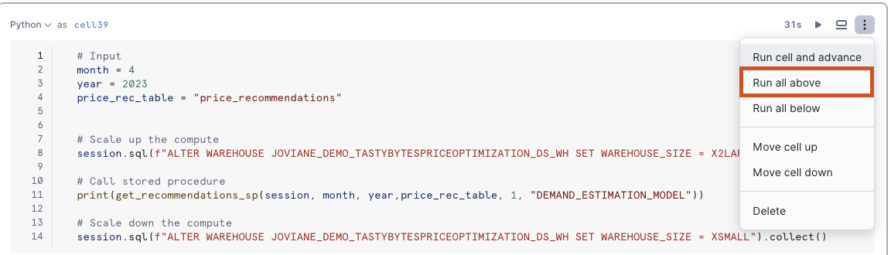

author: Joviane Bellegarde
id: tasty_bytes_price_optimization_using_snowflake_notebooks_and_streamlit
summary: Price Optimization Using Snowflake Notebooks and Streamlit
categories: Tasty-Bytes, Getting-Started
environments: web
status: Unpublished
feedback link: https://github.com/Snowflake-Labs/sfguides/issues
tags: Getting Started, Tasty Bytes, Price Optimization, Notebooks

# Price Optimization using Snowflake Notebooks and Streamlit in Snowflake
<!-- ------------------------ -->

## Overview
Duration: 1


Tasty Bytes is one of the largest food truck networks in the world with localized menu options spread across 15 food truck brands globally. Tasty Bytes is aiming to achieve 25% YoY sales growth over 5 years. Price optimization enables Tasty Bytes to achieve this goal by determining the right prices for their menu items to maximize profitability while maintaining customer satisfaction. 

### Prerequisites
- A Supported Snowflake [Browser](https://docs.snowflake.com/en/user-guide/setup#browser-requirements)
- A Snowflake Account
    - If you do not have a Snowflake Account, please [**sign up for a Free 30 Day Trial Account**](https://signup.snowflake.com/). When signing up, please make sure to select **Enterprise** edition. You can choose any AWS or Azure [Snowflake Region](https://docs.snowflake.com/en/user-guide/intro-regions).
    - After registering, you will receive an email with an activation link and your Snowflake Account URL

### What does this Quickstart aim to solve?
- We will train & deploy an ML model which leverages historical menu-item sale data to understand how menu-item demand changes with varying price. By utilizing this trained model, we would recommend the optimal day of week prices for all menu-items for the upcoming month to our food-truck brands. Afterward, we will showcase an application that can be built and deployed to allow business users to submit data into Snowflake and interact directly with a ML model.

### What you will learn
We will implement price optimization for their diversified food-truck brands to inform their pricing and 
promotions by utilizing Snowflake Notebooks and Streamlit to:
- Train & deploy an ML model to understand how menu-item demand changes with varying price
- User-friendly application to use deployed ML-model to inform pricing strategies

Along the way, we will delve more into these topics:

##### Price Optimization - Train & Deploy ML Model

- **Data Exploration**
  - Connect to Snowflake
  - Snowpark DataFrame API

- **Feature Engineering**
  - Window & Aggregate functions
  - Imputation and train/test split

- **Model Training & Deployment**
  - Train Snowpark ML model
  - Register model on Model Registry

- **Model Utilization**
  - Stored procedure to utilize deployed model
  - Elastic scalability
  - Data Driven Insights

### Price Recommendation - Create User-Friendly Application Using Deployed ML Model

- **Describe Current Pricing Process**
  - Import an Excel spreadsheet and inference the demand model
  - Calculate profit lift from new prices

- **Build an Application to Set Pricing and Interact with Recommendations**
  - View and edit pricing data
  - Show impact of price changes
  - Write changes back to Snowflake

- **Application Deployment**
  - Share the application in Snowflake with the brand managers

<!-- ------------------------ -->
## Setting up Data in Snowflake
Duration: 3

### Overview
You will use [Snowsight](https://docs.snowflake.com/en/user-guide/ui-snowsight.html#), the Snowflake web interface to:
- Create Snowflake objects (warehouse, database, schema, raw tables)
- Ingest data from S3 to raw tables

### Creating Objects, Loading Data, and Joining Data
- Navigate to Worksheets, click `+` in the top-right corner to create a new Worksheet, and choose `SQL Worksheet`
- Paste and run both the following SQL in the worksheet to create Snowflake objects (warehouse, database, schema, raw tables), and ingest shift  data from S3
- [Price Optimization Setup SQL 1](https://github.com/Snowflake-Labs/sfguide-price-optimization-using-snowflake-notebooks-and-streamlit/blob/main/setup/po_setup_1.sql)
- [Price Optimization Setup SQL 2](https://github.com/Snowflake-Labs/sfguide-price-optimization-using-snowflake-notebooks-and-streamlit/blob/main/setup/po_setup_2.sql)

<!-- ------------------------ -->
## Machine Learning With Snowpark Part 1 - Price Optimization: Setting Up Snowflake Notebook
Duration 13

### Overview
You will use [Snowsight](https://docs.snowflake.com/en/user-guide/ui-snowsight.html#), the Snowflake web interface, to create Snowflake notebook by importing notebook
- Download the notebook **tasty_bytes_price_optimization_and_recommendation.ipynb** using this repository [link](https://github.com/Snowflake-Labs/sfguide-price-optimization-using-snowflake-notebooks-and-streamlit/blob/main/notebook/tasty_bytes_price_optimization_and_recommendations.ipynb)
- Navigate to Notebooks in [Snowsight](https://docs.snowflake.com/en/user-guide/ui-snowsight.html#) by clicking on Projects -> Notebook
- Using the import button on the top right, import the downloaded **tasty_bytes_price_optimization_and_recommendation.ipynb** notebook
- Provide a name for the notebook and select appropriate database `JOVIANE_DEMO_TASTYBYTESPRICEOPTIMIZATION_PROD`, schema `ANALYTICS` and warehouse `JOVIANE_DEMO_TASTYBYTESPRICEOPTIMIZATION_DS_WH`

- Open the notebook once created and add the following packages by using the "Packages" button on the top right and selecting their appropriate versions
    - matplotlib -> 3.7.3
    - ipywidgets -> latest
    - openpyxl -> latest
    - scikit-learn -> 1.2.2
    - snowflake-ml-python -> 1.4.0
    - shap -> latest
    - numpy -> 1.24.3
    - xgboost -> 1.7.3
    - seaborn -> latest

- Once the notebook has uploaded, scroll down to cell 39 and click on `Run all above`


<!-- ------------------------ -->
## Machine Learning With Snowpark Part 2 - Price Recommendations
Duration 3

### Overview
- Navigate to Worksheets, click `+` in the top-right corner to create a new Worksheet, and choose `SQL Worksheet`
- Paste and run the following SQL in the worksheet to create Snowflake objects (warehouse, database, schema, raw tables)
```
/***************************************************************************************************
  _______           _            ____          _
 |__   __|         | |          |  _ \        | |
    | |  __ _  ___ | |_  _   _  | |_) | _   _ | |_  ___  ___
    | | / _` |/ __|| __|| | | | |  _ < | | | || __|/ _ \/ __|
    | || (_| |\__ \| |_ | |_| | | |_) || |_| || |_|  __/\__ \
    |_| \__,_||___/ \__| \__, | |____/  \__, | \__|\___||___/
                          __/ |          __/ |
                         |___/          |___/
Demo:         Tasty Bytes - Price Optimization SiS
Version:      v1
Vignette:     2 - SiS with Snowpark
Script:       setup_step_1_sis_tables_role.sql         
Create Date:  2023-06-08
Author:       Marie Coolsaet
Copyright(c): 2023 Snowflake Inc. All rights reserved.
****************************************************************************************************
Description: 
   Create tables used in SiS Streamlit App for Setting Monthly Pricing
****************************************************************************************************
SUMMARY OF CHANGES
Date(yyyy-mm-dd)    Author              Comments
------------------- ------------------- ------------------------------------------------------------
2023-06-08        Marie Coolsaet      Initial Release
2024-03-07        Shriya Rai          Update with Snowpark ML 
***************************************************************************************************/

/*----------------------------------------------------------------------------------
Instructions: Run all of this script to create the required tables and roles for the SiS app.

Note: In order for these scripts to run you will need to have run the notebook in
tasty_bytes_price_optimization.ipynb in 1 - Machine Learning with Snowpark.

 ----------------------------------------------------------------------------------*/

USE ROLE joviane_demo_tastybytespriceoptimization_data_scientist;
USE WAREHOUSE joviane_demo_tastybytespriceoptimization_ds_wh;

ALTER warehouse joviane_demo_tastybytespriceoptimization_ds_wh SET warehouse_size='large';

-- create the table that the app will write back to
CREATE OR REPLACE TABLE joviane_demo_tastybytespriceoptimization_prod.analytics.pricing_final (
    brand VARCHAR(16777216),
    item VARCHAR(16777216),
    day_of_week VARCHAR(16777216),
    new_price FLOAT,
    current_price FLOAT,
    recommended_price FLOAT,
    profit_lift FLOAT,
    comment VARCHAR(16777216),
    timestamp TIMESTAMP_NTZ(9)
);

-- create the table with required pricing information for the app
CREATE OR REPLACE TABLE joviane_demo_tastybytespriceoptimization_prod.analytics.pricing_detail AS
SELECT 
    a.truck_brand_name AS brand,
    a.menu_item_name AS item,
    case 
        when a.day_of_week = 0 then '7 - Sunday'
        when a.day_of_week = 1 then '1 - Monday'
        when a.day_of_week = 2 then '2 - Tuesday'
        when a.day_of_week = 3 then '3 - Wednesday'
        when a.day_of_week = 4 then '4 - Thursday'
        when a.day_of_week = 5 then '5 - Friday'
        else '6 - Saturday'
    end as day_of_week,
    round(b.price::FLOAT,2) AS current_price,
    round(a.price::FLOAT,2) AS recommended_price,
    joviane_demo_tastybytespriceoptimization_prod.analytics.DEMAND_ESTIMATION_MODEL!PREDICT(
        current_price,
        current_price - c.base_price,
        c.base_price,
        c.price_hist_dow,
        c.price_year_dow,
        c.price_month_dow,
        c.price_change_hist_dow,
        c.price_change_year_dow,
        c.price_change_month_dow,
        c.price_hist_roll,
        c.price_year_roll,
        c.price_month_roll,
        c.price_change_hist_roll,
        c.price_change_year_roll,
        c.price_change_month_roll):DEMAND_ESTIMATION::INT AS current_price_demand,
    joviane_demo_tastybytespriceoptimization_prod.analytics.DEMAND_ESTIMATION_MODEL!PREDICT(
        recommended_price,
        recommended_price - c.base_price,
        c.base_price,
        c.price_hist_dow,
        c.price_year_dow,
        c.price_month_dow,
        c.price_change_hist_dow,
        c.price_change_year_dow,
        c.price_change_month_dow,
        c.price_hist_roll,
        c.price_year_roll,
        c.price_month_roll,
        c.price_change_hist_roll,
        c.price_change_year_roll,
        c.price_change_month_roll):DEMAND_ESTIMATION::INT AS recommended_price_demand,
    round(((recommended_price_demand
        * (d.prev_avg_profit_wo_item 
            + recommended_price 
            - round(a.cost_of_goods_usd,2))) 
            - (current_price_demand
        * (d.prev_avg_profit_wo_item 
            + current_price 
            - round(a.cost_of_goods_usd,2))))
            ,0) AS profit_lift,
    c.base_price,
    c.price_hist_dow,
    c.price_year_dow,
    c.price_month_dow,
    c.price_change_hist_dow,
    c.price_change_year_dow,
    c.price_change_month_dow,
    c.price_hist_roll,
    c.price_year_roll,
    c.price_month_roll,
    c.price_change_hist_roll,
    c.price_change_year_roll,
    c.price_change_month_roll,
    d.prev_avg_profit_wo_item AS average_basket_profit,
    round(a.cost_of_goods_usd,2) AS item_cost,
    recommended_price_demand * (average_basket_profit
            + recommended_price 
            - item_cost) AS recommended_price_profit,
    current_price_demand * (average_basket_profit
            + current_price
            - item_cost) AS current_price_profit
FROM (
SELECT p.*,m.menu_item_name FROM joviane_demo_tastybytespriceoptimization_prod.analytics.price_recommendations p 
left join joviane_demo_tastybytespriceoptimization_prod.raw_pos.menu m on p.menu_item_id=m.menu_item_id) a
LEFT JOIN (SELECT * FROM joviane_demo_tastybytespriceoptimization_prod.analytics.demand_est_input_full WHERE (month = 3) AND (year=2023)) b
ON  a.day_of_week = b.day_of_week AND a.menu_item_id = b.menu_item_id
LEFT JOIN (SELECT * FROM joviane_demo_tastybytespriceoptimization_prod.analytics.demand_est_input_full WHERE (month = 4) AND (year=2023)) c
ON a.day_of_week = c.day_of_week AND a.menu_item_id = c.menu_item_id
LEFT JOIN (SELECT * FROM joviane_demo_tastybytespriceoptimization_prod.analytics.order_item_cost_agg_v WHERE (month = 4) AND (year=2023)) d
ON a.menu_item_id = d.menu_item_id
ORDER BY brand, item, day_of_week;

-- create pricing table to be displayed in the app
CREATE OR REPLACE TABLE joviane_demo_tastybytespriceoptimization_prod.analytics.pricing 
AS SELECT
brand, 
item, 
day_of_week, 
current_price AS new_price, 
current_price, 
recommended_price, 
profit_lift
FROM joviane_demo_tastybytespriceoptimization_prod.analytics.pricing_detail;

-- create brand manager role
USE ROLE securityadmin;
CREATE ROLE IF NOT EXISTS joviane_demo_tastybytespriceoptimization_brand_manager;

-- grant roles to user
SET my_user_var = (SELECT  '"' || CURRENT_USER() || '"' );
GRANT ROLE joviane_demo_tastybytespriceoptimization_data_scientist TO USER identifier($my_user_var);
GRANT ROLE joviane_demo_tastybytespriceoptimization_brand_manager TO USER identifier($my_user_var);

-- grant usage privileges for app
GRANT USAGE ON DATABASE joviane_demo_tastybytespriceoptimization_prod TO ROLE joviane_demo_tastybytespriceoptimization_brand_manager;
GRANT USAGE ON SCHEMA joviane_demo_tastybytespriceoptimization_prod.analytics TO ROLE joviane_demo_tastybytespriceoptimization_brand_manager;
```

- Now, return to the notebook that was created in **Machine Learning With Snowpark Part 1 - Price Optimization: Setting Up Snowflake Notebook** and scroll down to cell 39 and click on `Run cell and advance`

<!-- ------------------------ -->
## Streamlit in Snowflake
Duration 3

### Overview
At Tasty Bytes, brand managers are responsible for setting their food-truck brand's menu item prices for the upcoming month. 
By default, price for the upcoming month is set to the current price. As tasty data scientists, we want to create a user-friendly way for brand managers to use ML-models to inform their pricing and increase the company's profits. We will build a Streamlit in Snowflake (SiS) application that will show the recommended price per item per day-of-week and the profit lift over the current price. We will allow users to change prices and see the impact on demand and profit. Finalized prices will be saved back to Snowflake. The app will be secure and low-maintenance as it will be deployed through Snowflake.

### Purpose
**The purpose of this final step is to showcase how easily an application can be built and deployed to allow business users to submit data into Snowflake and interact directly with a ML model.** We will build a Streamlit App on the fly in Snowflake to support Tasty Bytes's brand managers in deciding monthly pricing.
- **Describe Current Pricing Process**
  - Import an excel spreadsheet and inference the demand model
  - Calculate profit lift from new prices
  
- **Build an Application to Set Pricing and Interact with Recommendations**
  - View and edit pricing data
  - Show impact of price changes
  - Write changes back to Snowflake
  
- **Application Deployment**
  - Share the application in Snowflake with the brand managers

#### Create Streamlit Application
- Within Snowsight, Click on the Streamlit Tab
- Click on `+Streamlit App` to create a new Streamlit Application
- Enter App Name, Warehouse and Location.
- Click `Create`
- Name the Application Monthly Pricing App
- Set the Warehouse to joviane_demo_tastybytespriceoptimization_DATA_APP_WH
- Set the database to joviane_demo_tastybytespriceoptimization_prod
- Place the Applciation in the analytics Schema
- This will create a sample Streamlit Application
- Replace the sample code with the below Python code using Edit
```
# Import python packages
import streamlit as st
from snowflake.snowpark.context import get_active_session
import snowflake.snowpark.functions as F
from snowflake.ml.registry.registry import Registry
import snowflake.snowpark.types as T

# Write directly to the app
st.title("Monthly Pricing App :truck:")
st.write(
    """Navigate to a food truck brand and menu item. Set the day-of-week 
    pricing for the upcoming month. Click **"Update Prices"** to 
    submit finalized pricing.
    """
)

# Get the current credentials
session = get_active_session()

# Get data and add a comment for columns
df = session.table("pricing").with_column("comment", F.lit(""))

# Dynamic filters
brand = st.selectbox("Brand:", df.select("brand").distinct())
item = st.selectbox(
    "Item:", df.filter(F.col("brand") == brand).select("item").distinct()
)

# Provide instructions for updating pricing and using recommendtions
st.write(
    """
    View price recommendations and profit lift over current month pricing.
    Adjust **NEW_PRICE** to see the impact on demand and profit.
    """
)

# Display and get updated prices from the data editor object
set_prices = session.create_dataframe(
    st.experimental_data_editor(
        df.filter((F.col("brand") == brand) & (F.col("item") == item))
    )
)

# Add a subheader
st.subheader("Forecasted Item Demand Based on Price")

# Define model input features
feature_cols = [
    "price",
    "price_change",
    "base_price",
    "price_hist_dow",
    "price_year_dow",
    "price_month_dow",
    "price_change_hist_dow",
    "price_change_year_dow",
    "price_change_month_dow",
    "price_hist_roll",
    "price_year_roll",
    "price_month_roll",
    "price_change_hist_roll",
    "price_change_year_roll",
    "price_change_month_roll",
]

# Get demand estimation
df_demand = set_prices.join(
    session.table("pricing_detail"), ["brand", "item", "day_of_week"]
).withColumn("price",F.col("new_price")).withColumn("price_change",F.col("PRICE")- F.col("base_price"))

# Get demand estimator model from registry
reg = Registry(session=session) 
demand_estimator = reg.get_model("DEMAND_ESTIMATION_MODEL").default

for col in feature_cols :
        df_demand = df_demand.withColumn(col+"_NEW",F.col(col).cast(T.DoubleType())).drop(col).rename(col+"_NEW",col)

df_demand = demand_estimator.run(df_demand, function_name="predict")\
    .select(
    "day_of_week",
    "current_price_demand",
    "new_price",
    "item_cost",
    "average_basket_profit",
    "current_price_profit",
    F.col("demand_estimation").alias("new_price_demand"))

# Demand lift
demand_lift = df_demand.select(
    F.round(
        (
            (F.sum("new_price_demand") - F.sum("current_price_demand"))
            / F.sum("current_price_demand")
        )
        * 100,
        1,
    )
).collect()[0][0]

# Profit lift
profit_lift = (
    df_demand.with_column(
        "new_price_profit",
        F.col("new_price_demand")
        * (F.col("new_price") - F.col("item_cost") + F.col("average_basket_profit")),
    )
    .select(
        F.round(
            (
                (F.sum("new_price_profit") - F.sum("current_price_profit"))
                / F.sum("current_price_profit")
            )
            * 100,
            1,
        )
    )
    .collect()[0][0]
)

# Show KPIs
col1, col2 = st.columns(2)
col1.metric("Total Weekly Demand Lift (%)", demand_lift)
col2.metric("Total Weekly Profit Lift (%)", profit_lift)

# Plot demand
st.line_chart(
    df_demand.with_column("current_price_demand", F.col("current_price_demand") * 0.97),
    x="DAY_OF_WEEK",
    y=["NEW_PRICE_DEMAND", "CURRENT_PRICE_DEMAND"],
)

# Button to submit pricing
if st.button("Update Prices"):
    set_prices.with_column("timestamp", F.current_timestamp()).write.mode(
        "append"
    ).save_as_table("pricing_final")

# Expander to view submitted pricing
with st.expander("View Submitted Prices"):
    st.table(session.table("pricing_final").order_by(F.col("timestamp").desc()))
```
- Next we need to add a few packages to this Application. Click on Packages in the top left corner:
- Search for "snowflake-ml-python" and add "snowflake-ml-python"

<!-- ------------------------ -->
## Conclusion
Duration 1

**Congrats!** You've successfully created a user-friendly way to use ML-models to inform pricing and increase the fictitious company, Tasty Bytes', profits. You also built a Streamlit in Snowflake (SiS) application that shows the recommended price per item per day-of-week and profit lift over the current price.

### What we've covered
With the completion of this quickstart, you have now delved into:
- Data Exploration
- Feature Engineering
- Model Training & Deployment
- Model Utilization