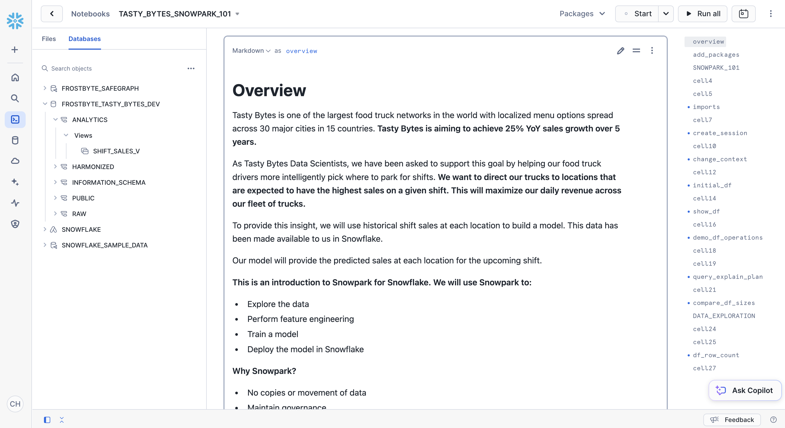
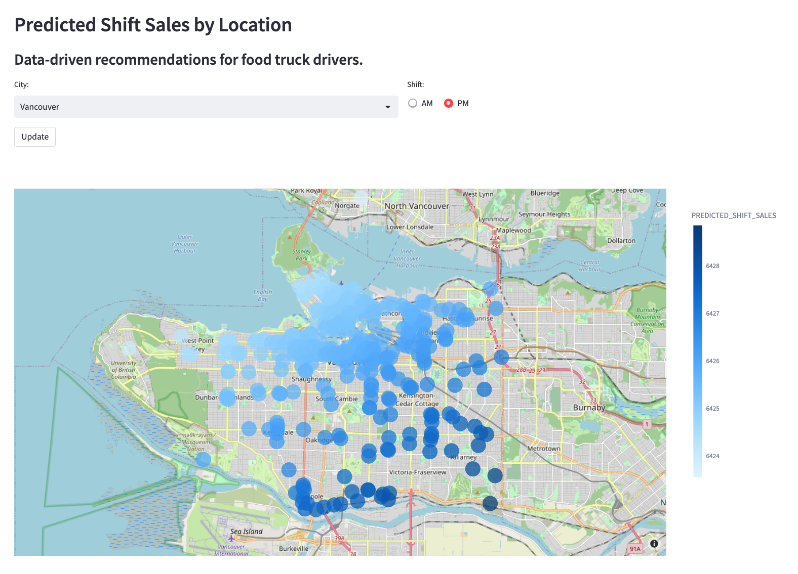

author: Marie Coolsaet
id: tasty_bytes_snowpark_101_for_data_science
summary: Tasty Bytes - Snowpark 101 for Data Science Quickstart
categories: Tasty-Bytes, Getting-Started, Featured, Data-Science-&-Ml
environments: web
status: Published 
feedback link: https://github.com/Snowflake-Labs/sfguides/issues
tags: Getting Started, Data Science, Data Engineering, Snowpark, Machine Learning, Streamlit

# Tasty Bytes - Snowpark 101 for Data Science
<!-- ------------------------ -->
## Overview 
Duration: 1


In this Snowpark 101 for Data Science Quickstart guide, you will be help the fictitious food truck company, Tasty Bytes, to increase sales by training a model to provide location recommendations to truck drivers. You will use **Snowpark for Python** to prepare data, train a model, and deploy the model. Once deployed, you will create an application prototype using **Streamlit** to demonstrate how truck drivers could use the model to find the best location to park for an upcoming shift.

### What is Snowpark?
Snowpark allows developers to query and create data applications in Python, Java, and Scala through APIs and DataFrame-style programming constructs that run on Snowflake's elastic engine. Learn more about [Snowpark](https://docs.snowflake.com/en/developer-guide/snowpark/index).

### What is Streamlit?
Streamlit *(acquired by Snowflake in March 2022)* is a Python library that makes it easy to create and share custom web apps. Learn more about [Streamlit](https://docs.streamlit.io/).

### What You Will Learn 
- How to access third-party data from the **Snowflake Data Marketplace**
- How to explore data & perform **feature engineering with Snowpark DataFrame APIs**
- How to **train a model in Snowflake** with a stored procedure
- How to **deploy a model in Snowflake** to a user-defined function for model inference
- How to **build a Streamlit app** to interact with the model

### Prerequisites
- [Git](https://git-scm.com/book/en/v2/Getting-Started-Installing-Git) installed
- [Anaconda](https://www.anaconda.com/) installed
- A Snowflake account with [Anaconda Packages enabled by ORGADMIN](https://docs.snowflake.com/en/developer-guide/udf/python/udf-python-packages.html#using-third-party-packages-from-anaconda). If you do not have a Snowflake account, you can register for a [free trial account](https://signup.snowflake.com/).
- A Snowflake account login with ACCOUNTADMIN role. If not, you will need to register for a free trial or use a different role that has the ability to create database, schema, tables, stages, user-defined functions, and stored procedures. 

### What You Will Build 
- **A sales forecast by location**<br>


- **A Streamlit application for finding the top locations by predicted sales**<br>


<!-- ------------------------ -->
## Setting up the Data in Snowflake
Duration: 6

### Overview
You will use [Snowsight](https://docs.snowflake.com/en/user-guide/ui-snowsight.html#), the Snowflake web interface, to:
- Access SafeGraph location data from the Snowflake Marketplace
- Create Snowflake objects (warehouse, database, schema)
- Ingest shift sales data from S3
- Join shift sales with the SafeGraph location data

Tasty Bytes operates food trucks in cities across the globe with each truck having the ability to choose two different selling locations per day. The locations are mapped to SafeGraph points-of-interest. You want to join latitude and longitude from the SafeGraph Marketplace data to your shift sales data to use as features in model training.

### Step 1 - Acquiring SafeGraph POI Data from the Snowflake Marketplace 
- Log into your Snowflake account.
- Follow the steps and video below to access the SafeGraph Marketplace listing in your Snowflake account.

  - Click -> Home Icon
  - Click -> Marketplace
  - Search -> frostbyte
  - Click -> SafeGraph: frostbyte
  - Click -> Get
  - Rename Database -> FROSTBYTE_SAFEGRAPH (all capital letters)
  - Grant to Additional Roles -> PUBLIC


>aside positive
>SafeGraph is a global geospatial data company that offers any data on any place in the world. Customers like Esri, Tripadvisor, Mapbox, and Sysco use SafeGraph data to better understand their customers, create new products, and make better decisions for their business.
>
### Step 2 - Creating Objects, Loading Data, and Joining Data
- Navigate to Worksheets, click "+" in the top-right corner to create a new Worksheet, and choose "SQL Worksheet".
- Paste and run the following SQL in the worksheet to create Snowflake objects (warehouse, database, schema), ingest shift sales data from S3, and join shift sales with the SafeGraph location data.

```sql
USE ROLE accountadmin;

-- create a development database for data science work
CREATE OR REPLACE DATABASE frostbyte_tasty_bytes_dev;

-- create raw, harmonized, and analytics schemas
-- raw zone for data ingestion
CREATE OR REPLACE SCHEMA frostbyte_tasty_bytes_dev.raw;
-- harmonized zone for data processing
CREATE OR REPLACE SCHEMA frostbyte_tasty_bytes_dev.harmonized;
-- analytics zone for development
CREATE OR REPLACE SCHEMA frostbyte_tasty_bytes_dev.analytics;

-- create csv file format
CREATE OR REPLACE FILE FORMAT frostbyte_tasty_bytes_dev.raw.csv_ff 
type = 'csv';

-- create an external stage pointing to S3
CREATE OR REPLACE STAGE frostbyte_tasty_bytes_dev.raw.s3load
COMMENT = 'Quickstarts S3 Stage Connection'
url = 's3://sfquickstarts/frostbyte_tastybytes/'
file_format = frostbyte_tasty_bytes_dev.raw.csv_ff;

-- define shift sales table
CREATE OR REPLACE TABLE frostbyte_tasty_bytes_dev.raw.shift_sales(
	location_id NUMBER(19,0),
	city VARCHAR(16777216),
	date DATE,
	shift_sales FLOAT,
	shift VARCHAR(2),
	month NUMBER(2,0),
	day_of_week NUMBER(2,0),
	city_population NUMBER(38,0)
);

-- create and use a compute warehouse
CREATE OR REPLACE WAREHOUSE tasty_dsci_wh AUTO_SUSPEND = 60;
USE WAREHOUSE tasty_dsci_wh;

-- ingest from S3 into the shift sales table
COPY INTO frostbyte_tasty_bytes_dev.raw.shift_sales
FROM @frostbyte_tasty_bytes_dev.raw.s3load/analytics/shift_sales/;

-- join in SafeGraph data
CREATE OR REPLACE TABLE frostbyte_tasty_bytes_dev.harmonized.shift_sales
  AS
SELECT
    a.location_id,
    a.city,
    a.date,
    a.shift_sales,
    a.shift,
    a.month,
    a.day_of_week,
    a.city_population,
    b.latitude,
    b.longitude
FROM frostbyte_tasty_bytes_dev.raw.shift_sales a
JOIN frostbyte_safegraph.public.frostbyte_tb_safegraph_s b
ON a.location_id = b.location_id;

-- promote the harmonized table to the analytics layer for data science development
CREATE OR REPLACE VIEW frostbyte_tasty_bytes_dev.analytics.shift_sales_v
  AS
SELECT * FROM frostbyte_tasty_bytes_dev.harmonized.shift_sales;

-- view shift sales data
SELECT * FROM frostbyte_tasty_bytes_dev.analytics.shift_sales_v;
```

<!-- ------------------------ -->
## Data Science with Snowpark
Duration: 22

### Overview
Tasty Bytes is aiming to achieve 25% YoY sales growth over 5 years. To support this goal and maximize daily revenue across the fleet of trucks, the data science team needs to build an ML model to direct trucks to locations that are expected to have the highest sales on a given shift.

- The [tasty_bytes_snowpark_101.ipynb](https://github.com/Snowflake-Labs/sfguide-tasty-bytes-snowpark-101-for-data-science/blob/main/tasty_bytes_snowpark_101.ipynb) notebook covers foundational feature/functions of a basic data science workflow using Snowpark for Python.
- You will walk through the following steps as a Tasty Bytes Data Scientist tasked with building and deploying a model on Snowflake to recommend the best locations for food trucks to park.
  - **Snowpark Fundamentals**
    - Connect to Snowflake
    - Explore the API and DataFrames
  - **Data Exploration & Feature Engineering**
    - Aggregate functions
    - Imputation, encoding, and train/test split
  - **Model Training & Deployment**
    - Training in a stored procedure
    - Elastic scalability
    - Deploying a user-defined function for model inference

### Step 1 - Cloning the GitHub Repository

[Clone](https://docs.github.com/en/repositories/creating-and-managing-repositories/cloning-a-repository) the [GitHub repository](https://github.com/Snowflake-Labs/sfguide-tasty-bytes-snowpark-101-for-data-science). This repository contains all the code you will need to successfully complete this QuickStart Guide.

```
$ git clone https://github.com/Snowflake-Labs/sfguide-tasty-bytes-snowpark-101-for-data-science.git
```
### Step 2 - Updating the Authorization File
- Update [**data_scientist_auth.json**](https://github.com/Snowflake-Labs/sfguide-tasty-bytes-snowpark-101-for-data-science/blob/main/data_scientist_auth.json) file with you Snowflake account credentials. The Python notebook will use this file to access your credentials and connect to Snowflake.<br>

>aside positive    
> For the `account` parameter, use your [account identifier](https://docs.snowflake.com/en/user-guide/admin-account-identifier). Note that the account identifier does not include the snowflakecomputing.com suffix.

### Step 3 - Creating the Python Environment
>aside positive
>These instructions use [Anaconda](https://www.anaconda.com/) for creating the Python environment. *However, you may use any other Python environment with Python 3.8, for example, [virtualenv](https://virtualenv.pypa.io/en/latest/)*.

>aside negative
>**Apple M1**: There is a known issue with running Snowpark Python on Apple M1 chips due to memory handling in pyOpenSSL. Please refer to the [**Snowpark documentation**](https://docs.snowflake.com/en/developer-guide/snowpark/python/setup.html) to solve this issue.<br>

 **From the terminal, execute the following to build the Python environment and launch Jupyter Notebook:**<br>
i. Create a Python 3.8 environment called "py38_env_tb1" (tb1 = Tasty Bytes 1) using packages (& versions) from the Snowflake Anaconda channel
```
conda create --name py38_env_tb1 --override-channels -c https://repo.anaconda.com/pkgs/snowflake python=3.8
 ```
ii. Activate the py38_env_tb1 environment
 ```  
conda activate py38_env_tb1
 ```
iii. Install the Snowpark Python package and packages that will be used in functions deployed on Snowflake from the Snowflake Anaconda channel
```
conda install -c https://repo.anaconda.com/pkgs/snowflake snowflake-snowpark-python numpy pandas scikit-learn joblib cachetools
```
v. Install packages that will be used only in the Python environment (i.e. UI, visualization..)
```
pip install streamlit matplotlib plotly notebook
```
vi. Navigate to the cloned GitHub repo and launch Jupyter Notebook
```
jupyter notebook
```

### Step 4- Running the Jupyter Notebook
- Open and run through the cells of [tasty_bytes_snowpark_101.ipynb](https://github.com/Snowflake-Labs/sfguide-tasty-bytes-snowpark-101-for-data-science/blob/main/tasty_bytes_snowpark_101.ipynb) in Jupyter Notebook.


### Troubleshooting
- PyArrow related issues: Uninstall `pyarrow` before installing Snowpark.
- Alternate Python environment build from [environment.yml](https://github.com/Snowflake-Labs/sfguide-tasty-bytes-snowpark-101-for-data-science/blob/main/environment.yml) file:<br>

    i. In the terminal, navigate to the cloned GitHub repository and build the environment
    ```
    conda env create -f environment.yml
    ```
    ii . Activate the environment
    ```
    conda activate py38_env_tb1
    ```
    iii. Launch Jupyter Notebook
    ```
    jupyter notebook
    ```

<!-- ------------------------ -->
## Application Prototype with Streamlit
Duration: 6

### Overview
Now that you have deployed a model that predicts the shift sales of each location for the upcoming shift, you want to find a way for truck drivers to use these predictions to pick where they will park. You need to create an application prototype to show the engineering team how a truck driver would interact with the shift sales forecast model. The application will allow a user to pick a city and shift time (AM or PM) and show predicted sales by location on a map.

### Step 1 - Confirming Prerequisites
- The Streamlit App leverages the Python environment, authentication file, and user-defined function from Step 3. Confirm the following requirements:
  - The Python 3.8 environment py38_env_tb1 has been created.
  - The data_scientist_auth.json file has been filled out.
  - The [tasty_bytes_snowpark_101.ipynb](https://github.com/Snowflake-Labs/sfguide-tasty-bytes-snowpark-101-for-data-science/blob/main/tasty_bytes_snowpark_101.ipynb) notebook has been run.

### Step 2 - Optional: Reviewing the Code
- Open [streamlit_app.py](https://github.com/Snowflake-Labs/sfguide-tasty-bytes-snowpark-101-for-data-science/blob/main/streamlit_app.py)
- Identify where the connection to Snowflake happens.
- Identify where the model inference user-defined function is called to give shift sale predictions on the fly.

### Step 3 - Launching the App
- In the terminal, navigate to the cloned GitHub repo and activate the py38_env_tb1 Python environment
  ```  
  conda activate py38_env_tb1
  ```
- Launch the application
  ```  
  streamlit run streamlit_app.py
  ```
- Use the drop down menu to select a city and view the updated recommendations.



<!-- ------------------------ -->
## Clean Up
Duration: 5

### Overview of Objects Created in this Quickstart
**Snowflake:**
- **Warehouse:** tasty_dsci_wh
- **Database:** frostbyte_tasty_bytes_dev
  - **Schema:** raw
    - **Table:** frostbyte_tasty_bytes_dev.raw.shift_sales
    - **Stage:** frostbyte_tasty_bytes_dev.raw.s3load
    - **File format:** frostbyte_tasty_bytes_dev.raw.csv_ff
  - **Schema:** harmonized
    - **Table:** frostbyte_tasty_bytes_dev.harmonized.shift_sales
  - **Schema:** analytics
    - **Tables:** 
      - frostbyte_tasty_bytes_dev.analytics.shift_sales_train
      - frostbyte_tasty_bytes_dev.analytics.shift_sales_test
    - **View:** frostbyte_tasty_bytes_dev.analytics.shift_sales_v
    - **Stage:** frostbyte_tasty_bytes_dev.analytics.model_stage
    - **Procedure:** sproc_train_linreg
    - **Function:** udf_linreg_predict_location_sales
- **Shared Database:** frostbyte_safegraph
    - **Table:** frostbyte_safegraph.public.frostbyte_tb_safegraph_s

**Anaconda:**
- py38_env_tb1 Python environment

**GitHub:**
- Cloned repository: [sfguide-tasty-bytes-snowpark-101-for-data-science](https://github.com/Snowflake-Labs/sfguide-tasty-bytes-snowpark-101-for-data-science/)

### Step 1 - Removing Snowflake Objects
- Navigate to Worksheets, click "+" in the top-right corner to create a new Worksheet, and choose "SQL Worksheet".
- Paste and run the following SQL in the worksheet to drop Snowflake objects created in the Quickstart.

```sql
USE ROLE accountadmin;
DROP PROCEDURE IF EXISTS frostbyte_tasty_bytes.analytics.sproc_train_linreg(varchar, array, varchar, varchar);
DROP FUNCTION IF EXISTS frostbyte_tasty_bytes.analytics.udf_linreg_predict_location_sales(float, float, float, float, float, float, float, float);
DROP DATABASE IF EXISTS frostbyte_tasty_bytes_dev;
DROP DATABASE IF EXISTS frostbyte_safegraph;
DROP WAREHOUSE IF EXISTS tasty_dsci_wh;
```

### Step 2 - Removing Python Environment
- In the terminal, execute:
```
conda remove --name py38_env_tb1 --all
```

### Step 3 - Removing Cloned GitHub Repository
- In the terminal from the directory where the GitHub repository was cloned, execute:
```
rm -rf sfguide-tasty-bytes-snowpark-101-for-data-science
```

<!-- ------------------------ -->
## Conclusion and Next Steps
Duration: 1

### Conclusion
**You did it!** You have successfully complete the Tasty Bytes - Snowpark 101 for Data Science Quickstart.

By doing so you have now:
- Acquired SafeGraph POI Data from the Snowflake Marketplace
- Explored data & performed feature engineering with Snowpark
- Trained a model in Snowflake with a stored procedure
- Deployed a model to a user-defined function
- Built a Streamlit application to provide on the fly shift sale predictions by location

### Next Steps
To continue your journey in the Snowflake Data Cloud, please visit the link below to see more Tasty Bytes - Quickstarts available to you.

- ### [Powered by Tasty Bytes - Quickstarts Table of Contents](https://quickstarts.snowflake.com/guide/tasty_bytes_introduction/index.html#3)

- [Demo on Snowflake Demo Hub](https://developers.snowflake.com/demos/predictive-sales-snowflake/)