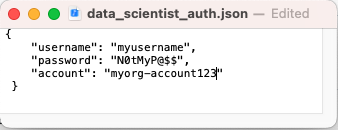
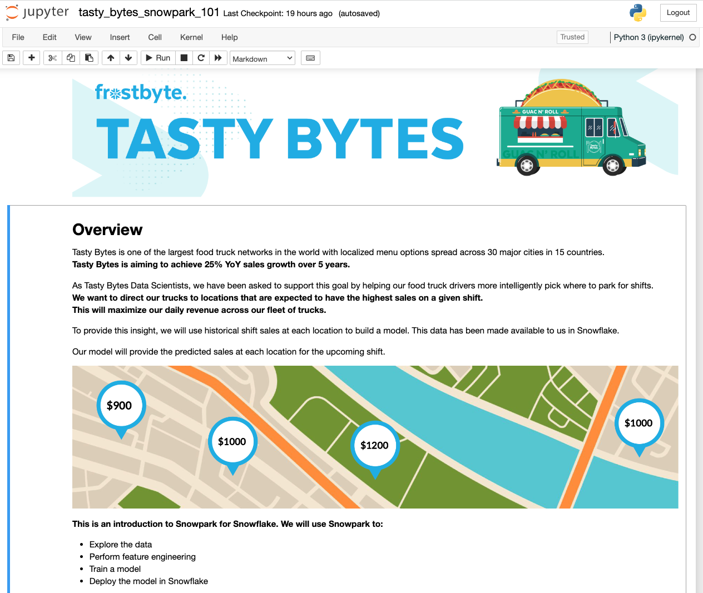

author: Marie Coolsaet
id: tasty_bytes_snowpark_101_for_data_science_ja
summary: Tasty Bytes - データサイエンスのためのSnowpark入門
categories: Tasty-Bytes, Getting-Started, Featured, Data-Science-&-Ml
environments: web
status: Published 
feedback link: https://github.com/Snowflake-Labs/sfguides/issues
tags: Getting Started, Data Science, Data Engineering, Snowpark, Machine Learning, Streamlit, ja

# Tasty Bytes - データサイエンスのためのSnowpark入門

<!-- ------------------------ -->
## 概要

Duration: 1 

このデータサイエンスのためのSnowpark入門クイックスタートガイドでは、架空のキッチンカー会社であるTasty Bytes社に対し、キッチンカーの運転手にロケーション推奨を提供するモデルのトレーニングを行うことで売上を伸ばす支援をします。**Snowpark for Python**を使用してデータの準備、モデルのトレーニング、モデルの展開を行います。展開後は、**Streamlit**を使用してアプリケーションのプロトタイプを作成し、キッチンカーの運転手が次のシフトのために駐車する最適なロケーションを見つけるためにこのモデルをどのように利用できるかについてデモを行います。

### Snowparkとは

Snowparkでは、開発者はSnowflakeの伸縮性のあるエンジンで実行されるAPIとDataFrame型のプログラミングコンストラクトを使用して、クエリを実行したり、Python、Java、Scalaでデータアプリケーションを作成したりできます。詳しくは、[Snowpark](https://docs.snowflake.com/en/developer-guide/snowpark/index)をご覧ください。

### Streamlitとは

Streamlit *（2022年3月にSnowflakeが買収）* は、カスタムウェブアプリを簡単に作成および共有できるようにするPythonライブラリです。詳しくは、[Streamlit](https://docs.streamlit.io/)をご覧ください。

### 学習する内容

- **Snowflakeマーケット**プレイスからサードパーティデータにアクセスする方法
- **Snowpark DataFrame API を使用してデータを探索し**、特徴量エンジニアリングを実行する方法
- ストアドプロシージャを使用して**Snowflakeでモデルをトレーニングする**方法
- モデル推論のためにユーザー定義関数に**Snowflakeでモデルを展開する**方法
- モデルと対話するための**Streamlitアプリを構築する**方法

### 前提条件

- [Git](https://git-scm.com/book/en/v2/Getting-Started-Installing-Git)がインストールされていること
- [Anaconda](https://www.anaconda.com/)がインストールされていること
- [ORGADMINによって有効化されたAnacondaパッケージ](https://docs.snowflake.com/en/developer-guide/udf/python/udf-python-packages.html#using-third-party-packages-from-anaconda)を持つSnowflakeアカウント。Snowflakeアカウントをお持ちでない場合は、[無料トライアルアカウント](https://signup.snowflake.com/)に登録できます。
- アカウント管理者の役割を持つSnowflakeアカウントのログイン。ログインをお持ちでない場合は、無料トライアルに登録するか、データベース、スキーマ、テーブル、ステージ、ユーザー定義関数、ストアドプロシージャを作成する機能を持つ別のロールを使用する必要があります。

### 構築するもの

- **ロケーション別の売上予測**<br> 

- **売上予測に基づいて上位のロケーションを見つけるStreamlitアプリケーション**<br> 

<!-- ------------------------ -->
## Snowflakeでのデータの設定

Duration: 6

### 概要

Snowflakeウェブインターフェースである[Snowsight](https://docs.snowflake.com/en/user-guide/ui-snowsight.html#)を使用して、次のことを行います。

- SnowflakeマーケットプレイスからSafeGraphロケーションデータにアクセスする
- Snowflakeオブジェクト（ウェアハウス、データベース、スキーマ）を作成する
- S3からシフト売上データを取り込む
- シフト売上とSafeGraphロケーションデータを結合する

Tasty Bytesは世界中の都市でキッチンカーを運行しており、各キッチンカーは1日に2つの異なる販売ロケーションを選択できます。これらのロケーションはSafeGraphの関心ポイントにマッピングされています。SafeGraphマーケットプレイスデータの緯度と経度をシフト売上データに結合し、モデルトレーニングで特徴量として使用します。

### ステップ1 - SnowflakeマーケットプレイスからSafeGraph POIデータを取得する

- Snowflakeアカウントにログインします。

- 以下の手順とビデオに従って、SnowflakeアカウントからSafeGraphマーケットプレイスのリストにアクセスします。
  
  - ホームアイコンをクリック
  - マーケットプレイスをクリック
  - frostbyteを検索
  - 「SafeGraph: frostbyte」をクリック
  - 「Get（取得）」をクリック
  - データベースの名称をFROSTBYTE_WEATHERSOURCE（すべて大文字）に変更
  - 追加ロールへの付与 -> 「PUBLIC（公開）」


> SafeGraphは、世界中のあらゆる場所に関するデータを提供するグローバルな地理空間データ会社です。Esri、Tripadvisor、Mapbox、Syscoなどの顧客は、SafeGraphのデータを使用して、自社の顧客をより正確に把握し、新しい製品を生み出し、より的確な経営判断を行っています。

### ステップ2 - オブジェクトの作成、データのロード、データの結合を行う

- ワークシートに移動し、右上の「+」をクリックして新しいワークシートを作成し、「SQLワークシート」を選択します。
- ワークシートに以下のSQLを貼り付けて実行します。このSQLは、Snowflakeオブジェクト（ウェアハウス、データベース、スキーマ）を作成し、S3からシフト売上データを取り込み、シフト売上とSafeGraphロケーションデータを結合します。

```sql
USE ROLE accountadmin;

-- create a development database for data science work
CREATE OR REPLACE DATABASE frostbyte_tasty_bytes_dev;

-- create raw, harmonized, and analytics schemas
-- raw zone for data ingestion
CREATE OR REPLACE SCHEMA frostbyte_tasty_bytes_dev.raw;
-- harmonized zone for data processing
CREATE OR REPLACE SCHEMA frostbyte_tasty_bytes_dev.harmonized;
-- analytics zone for development
CREATE OR REPLACE SCHEMA frostbyte_tasty_bytes_dev.analytics;

-- create csv file format
CREATE OR REPLACE FILE FORMAT frostbyte_tasty_bytes_dev.raw.csv_ff 
type = 'csv';

-- create an external stage pointing to S3
CREATE OR REPLACE STAGE frostbyte_tasty_bytes_dev.raw.s3load
COMMENT = 'Quickstarts S3 Stage Connection'
url = 's3://sfquickstarts/frostbyte_tastybytes/'
file_format = frostbyte_tasty_bytes_dev.raw.csv_ff;

-- define shift sales table
CREATE OR REPLACE TABLE frostbyte_tasty_bytes_dev.raw.shift_sales(
	location_id NUMBER(19,0),
	city VARCHAR(16777216),
	date DATE,
	shift_sales FLOAT,
	shift VARCHAR(2),
	month NUMBER(2,0),
	day_of_week NUMBER(2,0),
	city_population NUMBER(38,0)
);

-- create and use a compute warehouse
CREATE OR REPLACE WAREHOUSE tasty_dsci_wh AUTO_SUSPEND = 60;
USE WAREHOUSE tasty_dsci_wh;

-- ingest from S3 into the shift sales table
COPY INTO frostbyte_tasty_bytes_dev.raw.shift_sales
FROM @frostbyte_tasty_bytes_dev.raw.s3load/analytics/shift_sales/;

-- join in SafeGraph data
CREATE OR REPLACE TABLE frostbyte_tasty_bytes_dev.harmonized.shift_sales
  AS
SELECT
    a.location_id,
    a.city,
    a.date,
    a.shift_sales,
    a.shift,
    a.month,
    a.day_of_week,
    a.city_population,
    b.latitude,
    b.longitude
FROM frostbyte_tasty_bytes_dev.raw.shift_sales a
JOIN frostbyte_safegraph.public.frostbyte_tb_safegraph_s b
ON a.location_id = b.location_id;

-- promote the harmonized table to the analytics layer for data science development
CREATE OR REPLACE VIEW frostbyte_tasty_bytes_dev.analytics.shift_sales_v
  AS
SELECT * FROM frostbyte_tasty_bytes_dev.harmonized.shift_sales;

-- view shift sales data
SELECT * FROM frostbyte_tasty_bytes_dev.analytics.shift_sales_v;
```

<!-- ------------------------ -->
## Snowparkによるデータサイエンス

Duration: 22

### 概要

Tasty Bytesは、5年間で前年比25%の売上成長を達成することを目指しています。この目標をサポートし、キッチンカーフリート全体で1日の収益を最大化するため、データサイエンスチームは、所定のシフトで最も高い売上が期待できるロケーションにキッチンカーを誘導するMLモデルを構築する必要があります。

- [tasty_bytes_snowpark_101.ipynb](https://github.com/Snowflake-Labs/sfguide-tasty-bytes-snowpark-101-for-data-science/blob/main/tasty_bytes_snowpark_101.ipynb)ノートブックは、Snowpark for Pythonを利用した基本的なデータサイエンスワークフローの基本的な機能/関数をカバーしています。
- あなたは、キッチンカーの駐車に最適なロケーションを推奨するモデルをSnowflakeで構築して展開するタスクを任されたTasty Bytesのデータサイエンティストとして、次の手順を実行します。
  - **Snowparkの基礎**
    - Snowflakeに接続する
    - APIとDataFramesを探索する
  - **データ探索と特徴量エンジニアリング**
    - 集計関数
    - インピュテーション、エンコーディング、トレーニング/テストの分割
  - **モデルのトレーニングと展開**
    - ストアドプロシージャでのトレーニング
    - 伸縮性のあるスケーラビリティ
    - モデル推論のためのユーザー定義関数の展開

### ステップ1 - GitHubレポジトリを複製する

[GitHubレポジトリ](https://github.com/Snowflake-Labs/sfguide-tasty-bytes-snowpark-101-for-data-science)を[複製します](https://docs.github.com/en/repositories/creating-and-managing-repositories/cloning-a-repository)。このレポジトリには、このクイックスタートガイドを正常に完了するために必要なすべてのコードが含まれています。

```
$ git clone https://github.com/Snowflake-Labs/sfguide-tasty-bytes-snowpark-101-for-data-science.git
```

### ステップ2 - 認証ファイルを更新する

- [**data_scientist_auth.json**](https://github.com/Snowflake-Labs/sfguide-tasty-bytes-snowpark-101-for-data-science/blob/main/data_scientist_auth.json)ファイルをSnowflakeアカウント認証情報で更新します。Pythonノートブックはこのファイルを使って認証情報にアクセスし、Snowflakeに接続します。<br>

>   
`account`パラメータには、[アカウント識別子](https://docs.snowflake.com/en/user-guide/admin-account-identifier)を使用します。アカウント識別子には、接尾辞snowflakecomputing.comが含まれていないことに注意してください。

### ステップ3 - Python環境を作成する

> この手順ではPython環境の作成に[Anaconda](https://www.anaconda.com/)を使用します。*ただし、Python 3.8では、[virtualenv](https://virtualenv.pypa.io/en/latest/)などの他のPython環境を使用することもできます。*

> **Apple M1**：Apple M1チップ上でSnowpark Pythonを実行すると、pyOpenSSLでのメモリ処理に起因する既知の問題があります。この問題を解決するには、[**Snowparkのドキュメント**](https://docs.snowflake.com/en/developer-guide/snowpark/python/setup.html)を参照してください。<br>

**ターミナルから以下を実行してPython環境を構築し、Jupyter Notebookを起動します。**<br> i. 「py38_env_tb1」（tb1 = Tasty Bytes 1）というPython 3.8環境を、Snowflake Anacondaチャネルのパッケージ（とバージョン）を使用して作成します。

```
conda create --name py38_env_tb1 --override-channels -c https://repo.anaconda.com/pkgs/snowflake python=3.8
```

ii. py38_env_tb1環境をアクティブ化します。

```
conda activate py38_env_tb1
```

iii. Snowpark Pythonパッケージと、Snowflake AnacondaチャネルからSnowflakeに展開される関数で使用されるパッケージをインストールします。

```
conda install -c https://repo.anaconda.com/pkgs/snowflake snowflake-snowpark-python numpy pandas scikit-learn joblib cachetools
```

v. Python環境でのみ使用されるパッケージ（UI、視覚化など）をインストールします。

```
pip install streamlit matplotlib plotly notebook
```

vi. 複製したGitHubレポジトリに移動し、Jupyter Notebookを起動します。

```
jupyter notebook
```

### ステップ4 - Jupyter Notebookを実行する

- Jupyter Notebookで[tasty_bytes_snowpark_101.ipynb](https://github.com/Snowflake-Labs/sfguide-tasty-bytes-snowpark-101-for-data-science/blob/main/tasty_bytes_snowpark_101.ipynb)のセルを開いて実行します。

### トラブルシューティング

- PyArrow関連の問題：Snowparkをインストールする前に`pyarrow`をアンインストールしてください。

- [environment.yml](https://github.com/Snowflake-Labs/sfguide-tasty-bytes-snowpark-101-for-data-science/blob/main/environment.yml)ファイルから代替のPython環境を構築します。<br>
  
  i. ターミナルで、複製したGitHubレポジトリに移動し、環境を構築します。
  
  ```
  conda env create -f environment.yml
  ```
  
  ii . 環境をアクティブ化します。
  
  ```
  conda activate py38_env_tb1
  ```
  
  iii.Jupyter Notebookを起動します。
  
  ```
  jupyter notebook
  ```

<!-- ------------------------ -->
## Streamlitによるアプリケーションプロトタイプ

Duration: 6

### 概要

今後のシフトの各ロケーションのシフト売上を予測するモデルを展開しました。次に、キッチンカーの運転手がこの予測を使用して駐車場所を選ぶ方法を見つけます。キッチンカーの運転手がシフト売上予測モデルをどのように操作するかをエンジニアリングチームに示すために、アプリケーションのプロトタイプを作成する必要があります。このアプリケーションでは、ユーザーが都市とシフト時間（午前または午後）を選択でき、その選択に応じて地図上にロケーションごとの売上予測が表示されます。

### ステップ1 - 前提条件を確認する

- Streamlitアプリは、ステップ3のPython環境、認証ファイル、ユーザー定義関数を利用します。次の要件を確認します。
  - Python 3.8環境のpy38_env_tb1が作成されている。
  - data_scientist_auth.jsonファイルが入力されている。
  - [tasty_bytes_snowpark_101.ipynb](https://github.com/Snowflake-Labs/sfguide-tasty-bytes-snowpark-101-for-data-science/blob/main/tasty_bytes_snowpark_101.ipynb)ノートブックが実行されている。

### ステップ2 - オプション：コードを確認する

- [streamlit_app.py](https://github.com/Snowflake-Labs/sfguide-tasty-bytes-snowpark-101-for-data-science/blob/main/streamlit_app.py)を開きます。
- Snowflakeへの接続が行われる場所を特定します。
- シフト売上予測を迅速に提供するために、モデル推論のユーザー定義関数が呼び出される場所を特定します。

### ステップ3 - アプリを起動する

- ターミナルで、複製したGitHubレポジトリに移動し、py38_env_tb1 Python環境をアクティ化します。
  ```
  conda activate py38_env_tb1
  ```
- アプリケーションを起動します。
  ```
  streamlit run streamlit_app.py
  ```
- ドロップダウンメニューから都市を選択します。更新された推奨が表示されます。

<!-- ------------------------ -->
## クリーンアップ

Duration: 5

### このクイックスタートで作成されるオブジェクトの概要

**Snowflake：**

- **ウェアハウス：** tasty_dsci_wh
- **データベース：** frostbyte_tasty_bytes_dev
  - **スキーマ：未加工**
    - **テーブル：** frostbyte_tasty_bytes_dev.raw.shift_sales
    - **ステージ：** frostbyte_tasty_bytes_dev.raw.s3load
    - **ファイル形式：** frostbyte_tasty_bytes_dev.raw.csv_ff
  - **スキーマ：** 整合
    - **テーブル：** frostbyte_tasty_bytes_dev.harmonized.shift_sales
  - **スキーマ：** 分析
    - **テーブル：**
      - frostbyte_tasty_bytes_dev.analytics.shift_sales_train
      - frostbyte_tasty_bytes_dev.analytics.shift_sales_test
    - **ビュー：** frostbyte_tasty_bytes_dev.analytics.shift_sales_v
    - **ステージ：** frostbyte_tasty_bytes_dev.analytics.model_stage
    - **プロシージャ：** sproc_train_linreg
    - **関数：** udf_linreg_predict_location_sales
- **共有データベース：** frostbyte_safegraph
  - **テーブル：** frostbyte_safegraph.public.frostbyte_tb_safegraph_s

**Anaconda：**

- py38_env_tb1 Python環境

**GitHub：**

- 複製したレポジトリ：[sfguide-tasty-bytes-snowpark-101-for-data-science](https://github.com/Snowflake-Labs/sfguide-tasty-bytes-snowpark-101-for-data-science/)

### ステップ1 - Snowflakeオブジェクトを削除する

- ワークシートに移動し、右上の「+」をクリックして新しいワークシートを作成し、「SQLワークシート」を選択します。
- 次のSQLをワークシートに貼り付けて実行し、クイックスタートで作成したSnowflakeオブジェクトを削除します。

```sql
USE ROLE accountadmin;
DROP PROCEDURE IF EXISTS frostbyte_tasty_bytes.analytics.sproc_train_linreg(varchar, array, varchar, varchar);
DROP FUNCTION IF EXISTS frostbyte_tasty_bytes.analytics.udf_linreg_predict_location_sales(float, float, float, float, float, float, float, float);
DROP DATABASE IF EXISTS frostbyte_tasty_bytes_dev;
DROP DATABASE IF EXISTS frostbyte_safegraph;
DROP WAREHOUSE IF EXISTS tasty_dsci_wh;
```

### ステップ2 - Python環境を削除する

- ターミナルで次を実行します。

```
conda remove --name py38_env_tb1 --all
```

### ステップ3 - 複製したGitHubレポジトリを削除する

- GitHubレポジトリを複製したディレクトリのターミナルで、次を実行します。

```
rm -rf sfguide-tasty-bytes-snowpark-101-for-data-science
```

<!-- ------------------------ -->
## まとめと次のステップ

Duration: 1

### まとめ

**お疲れ様でした。** Tasty Bytes - データサイエンスのためのSnowpark入門クイックスタートを無事完了しました。

これにより、次のことができるようになりました。

- SnowflakeマーケットプレイスからSafeGraph POIデータを取得する
- Snowparkでデータを探索し、特徴量エンジニアリングを実行する
- ストアドプロシージャを使用してSnowflakeでモデルをトレーニングする
- モデルをユーザー定義関数に展開する
- Streamlitアプリケーションを構築し、ロケーションごとのシフト売上予測を迅速に提供する

### 次のステップ

引き続きSnowflakeデータクラウドについて学習するには、以下のリンクから利用可能なTasty Bytes - クイックスタートをご覧ください。

- ### [Powered by Tasty Bytes - クイックスタート目次](https://quickstarts.snowflake.com/guide/tasty_bytes_introduction/index.html#3)