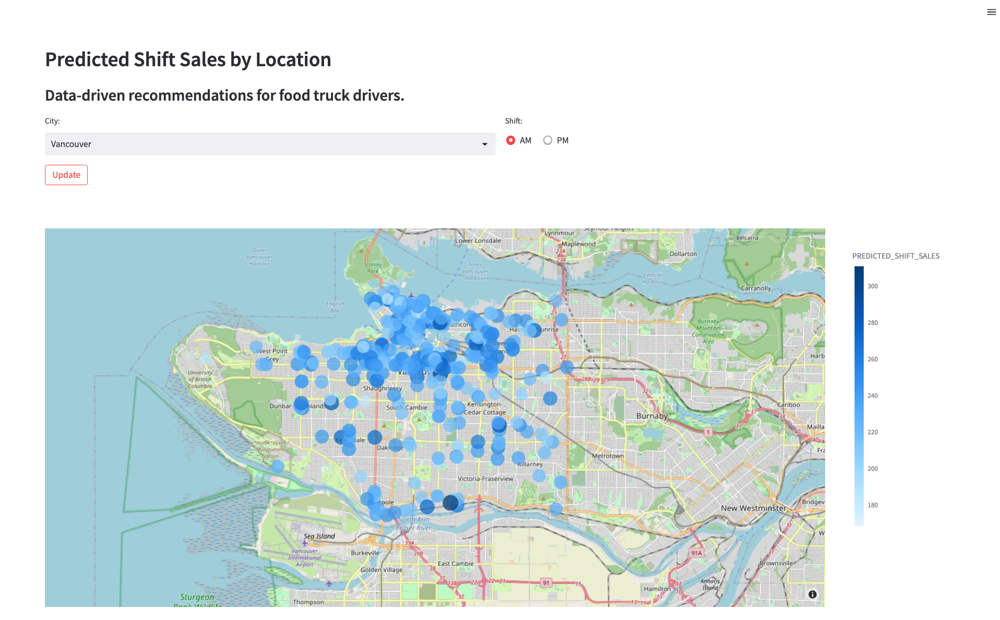

author: Marie Coolsaet
id: tasty_bytes_snowpark_101_for_data_science_kr
summary: Tasty Bytes - Snowpark 101 for Data Science Quickstart
categories: Tasty-Bytes, Getting-Started, Featured, Data-Science-&-Ml
environments: web
status: Published 
feedback link: https://github.com/Snowflake-Labs/sfguides/issues
tags: Getting Started, Data Science, Data Engineering, Snowpark, Machine Learning, Streamlit, kr

# Tasty Bytes - 데이터 사이언스를 위한 Snowpark 101

<!-- ------------------------ -->
## 개요

Duration: 1 

이 데이터 사이언스를 위한 Snowpark 101 Quickstart에서는 가상의 푸드 트럭 회사인 Tasty Bytes가 트럭 기사에게 위치 추천을 제공하기 위해 모델을 훈련시켜 매출을 올리는 것을 돕게 됩니다. 여러분은 데이터를 준비하고, 모델을 훈련시키고, 모델을 배포하기 위해 **Snowpark for Python**을 사용할 것입니다. 배포한 후에는 **Streamlit**을 사용해 애플리케이션 프로토타입을 생성하여 트럭 기사가 다가오는 교대조를 위해 주차할 최고의 위치를 찾는 데 모델을 사용할 수 있는 방법을 확인할 것입니다.

### Snowpark란 무엇일까요?

Snowpark를 사용하면 개발자는 Snowflake의 유연한 엔진에서 실행되는 API 및 DataFrame형 프로그래밍 구조를 통해 Python, Java 및 Scala에서 데이터 애플리케이션을 쿼리 및 생성할 수 있습니다. [Snowpark](https://docs.snowflake.com/ko/developer-guide/snowpark/index)에 대해 자세히 알아보십시오.

### Streamlit이란 무엇일까요?

Streamlit*(2022년 3월에 Snowflake에서 인수)*은 사용자 정의 웹 앱을 생성 및 공유하는 것을 쉽게 만드는 Python 라이브러리입니다. [Streamlit](https://docs.streamlit.io/)에 대해 자세히 알아보십시오.

### 알아볼 내용

- **Snowflake 데이터 마켓플레이스**에서 서드 파티 데이터 액세스하기
- 데이터 탐색하기 및 **Snowpark DataFrame API로 피처 엔지니어링** 수행하기
- 저장 프로시저로 **Snowflake에서 모델 훈련**하기
- 모델 추론을 위해 사용자 정의 함수에 대해 **Snowflake에서 모델 배포**하기
- 모델과 상호 작용하기 위해 **Streamlit 앱 구축**하기

### 사전 필요 조건 및 지식

- [Git](https://git-scm.com/book/en/v2/Getting-Started-Installing-Git) 설치
- [Anaconda](https://www.anaconda.com/) 설치
- Snowflake 계정([ORGADMIN이 활성화한 Anaconda 패키지](https://docs.snowflake.com/ko/developer-guide/udf/python/udf-python-packages.html#using-third-party-packages-from-anaconda) 포함) Snowflake 계정이 없다면 [무료 평가판 계정](https://signup.snowflake.com/)을 위해 등록할 수 있습니다.
- Snowflake 계정 로그인(ACCOUNTADMIN 역할 포함) 계정이 없다면 무료 평가판을 위해 등록하거나 데이터베이스, 스키마, 테이블, 스테이지, 사용자 정의 함수 및 저장 프로시저를 생성할 수 있는 다른 역할을 사용해야 합니다.

### 구축할 것

- **위치별 매출 예측**<br> 

- **예상 매출에 따라 상위 위치를 찾기 위한 Streamlit 애플리케이션**<br> 

<!-- ------------------------ -->
## Snowflake에서 데이터 설정

Duration: 6

### 개요

다음을 위해 Snowflake 웹 인터페이스인 [Snowsight](https://docs.snowflake.com/ko/user-guide/ui-snowsight.html#)를 사용하게 됩니다.

- Snowflake 마켓플레이스의 SafeGraph 위치 데이터에 액세스
- Snowflake 객체(웨어하우스, 데이터베이스, 스키마) 생성
- S3에서 교대조 매출 데이터 수집
- 교대조 매출과 SafeGraph 위치 데이터 결합

Tasty Bytes는 전 세계 도시에서 푸드 트럭을 운영합니다. 각 트럭은 매일 2개의 각기 다른 판매 위치를 선택할 수 있습니다. 위치는 SafeGraph 관심 지역에 매핑됩니다. 모델 훈련에서 피처로 사용하기 위해 SafeGraph 마켓플레이스 데이터의 위도와 경도를 교대조 매출 데이터와 결합하고자 합니다.

### 1단계 - Snowflake 마켓플레이스에서 SafeGraph POI 데이터 획득

- Snowflake 계정에 로그인합니다.

- 아래 단계와 동영상에 따라 Snowflake 계정에서 SafeGraph 마켓플레이스 목록에 액세스합니다.
  
  - 클릭 -> 홈 아이콘
  - 클릭 -> Marketplace
  - 검색 -> frostbyte
  - 클릭 -> SafeGraph: frostbyte
  - 클릭 -> Get
  - 데이터베이스 이름 바꾸기 -> FROSTBYTE_SAFEGRAPH(전부 대문자)
  - 추가 역할에 부여 -> PUBLIC


> aside positive SafeGraph는 전 세계 모든 장소에 대한 모든 데이터를 제공하는 전 세계적인 지리 공간 데이터 회사입니다. Esri, Tripadvisor, Mapbox 및 Sysco와 같은 고객은 SafeGraph 데이터를 사용하여 고객을 더 잘 이해하고, 신제품을 만들고, 비즈니스를 위한 더 나은 결정을 내립니다.

### 2단계 - 객체 생성, 데이터 로드 및 데이터 결합

- Worksheets로 이동하고, 새로운 워크시트를 생성하기 위해 오른쪽 상단 모서리에 있는 ‘+’를 클릭하고, ‘SQL Worksheet’를 선택합니다.
- 워크시트에서 다음 SQL을 붙여넣고 실행하여 Snowflake 객체(웨어하우스, 데이터베이스, 스키마)를 생성하고, S3에서 교대조 매출 데이터를 수집하고, 교대조 매출과 SafeGraph 위치 데이터를 결합합니다.

```sql
USE ROLE accountadmin;

-- create a development database for data science work
CREATE OR REPLACE DATABASE frostbyte_tasty_bytes_dev;

-- create raw, harmonized, and analytics schemas
-- raw zone for data ingestion
CREATE OR REPLACE SCHEMA frostbyte_tasty_bytes_dev.raw;
-- harmonized zone for data processing
CREATE OR REPLACE SCHEMA frostbyte_tasty_bytes_dev.harmonized;
-- analytics zone for development
CREATE OR REPLACE SCHEMA frostbyte_tasty_bytes_dev.analytics;

-- create csv file format
CREATE OR REPLACE FILE FORMAT frostbyte_tasty_bytes_dev.raw.csv_ff 
type = 'csv';

-- create an external stage pointing to S3
CREATE OR REPLACE STAGE frostbyte_tasty_bytes_dev.raw.s3load
COMMENT = 'Quickstarts S3 Stage Connection'
url = 's3://sfquickstarts/frostbyte_tastybytes/'
file_format = frostbyte_tasty_bytes_dev.raw.csv_ff;

-- define shift sales table
CREATE OR REPLACE TABLE frostbyte_tasty_bytes_dev.raw.shift_sales(
	location_id NUMBER(19,0),
	city VARCHAR(16777216),
	date DATE,
	shift_sales FLOAT,
	shift VARCHAR(2),
	month NUMBER(2,0),
	day_of_week NUMBER(2,0),
	city_population NUMBER(38,0)
);

-- create and use a compute warehouse
CREATE OR REPLACE WAREHOUSE tasty_dsci_wh AUTO_SUSPEND = 60;
USE WAREHOUSE tasty_dsci_wh;

-- ingest from S3 into the shift sales table
COPY INTO frostbyte_tasty_bytes_dev.raw.shift_sales
FROM @frostbyte_tasty_bytes_dev.raw.s3load/analytics/shift_sales/;

-- join in SafeGraph data
CREATE OR REPLACE TABLE frostbyte_tasty_bytes_dev.harmonized.shift_sales
  AS
SELECT
    a.location_id,
    a.city,
    a.date,
    a.shift_sales,
    a.shift,
    a.month,
    a.day_of_week,
    a.city_population,
    b.latitude,
    b.longitude
FROM frostbyte_tasty_bytes_dev.raw.shift_sales a
JOIN frostbyte_safegraph.public.frostbyte_tb_safegraph_s b
ON a.location_id = b.location_id;

-- promote the harmonized table to the analytics layer for data science development
CREATE OR REPLACE VIEW frostbyte_tasty_bytes_dev.analytics.shift_sales_v
  AS
SELECT * FROM frostbyte_tasty_bytes_dev.harmonized.shift_sales;

-- view shift sales data
SELECT * FROM frostbyte_tasty_bytes_dev.analytics.shift_sales_v;
```

<!-- ------------------------ -->
## Snowpark를 통한 데이터 사이언스

Duration: 22

### 개요

Tasty Bytes는 5년에 걸쳐 전년 대비 25%의 매출 성장을 달성하고자 합니다. 이 목표를 지원하고 트럭 군단에 걸쳐 일일 수익을 극대화하려면 데이터 사이언스 팀은 주어진 교대조에서 가장 높은 매출을 올릴 것으로 예측되는 위치로 트럭을 안내하기 위해 ML 모델을 구축해야 합니다.

- [tasty_bytes_snowpark_101.ipynb](https://github.com/Snowflake-Labs/sfguide-tasty-bytes-snowpark-101-for-data-science/blob/main/tasty_bytes_snowpark_101.ipynb) 노트북은 Snowpark for Python을 사용하는 기본 데이터 사이언스 워크플로우의 기초 피처와 함수를 다룹니다.
- Tasty Bytes 데이터 사이언티스트로서 다음 단계를 진행하게 됩니다. 이 과정에서 푸드 트럭이 주차하기 가장 좋은 위치를 추천하기 위해 Snowflake에서 모델을 구축 및 배포해야 합니다.
  - **Snowpark 기초**
    - Snowflake와 연결
    - API 및 DataFrame 탐색
  - **데이터 탐색 및 피처 엔지니어링**
    - 집계 함수
    - 대체, 인코딩 및 훈련 또는 테스트로 분리
  - **모델 훈련 및 배포**
    - 저장 프로시저에서 훈련
    - 유연한 확장성
    - 모델 추론을 위해 사용자 정의 함수 배포

### 1단계 - GitHub 리포지토리 복제

[GitHub 리포지토리](https://github.com/Snowflake-Labs/sfguide-tasty-bytes-snowpark-101-for-data-science)를 [복제](https://docs.github.com/ko/repositories/creating-and-managing-repositories/cloning-a-repository)합니다. 이 리포지토리에는 이 Quickstart 가이드를 성공적으로 완료하는 데 필요한 모든 코드가 포함되어 있습니다.

```
$ git clone https://github.com/Snowflake-Labs/sfguide-tasty-bytes-snowpark-101-for-data-science.git
```

### 2단계 - 인증 파일 업데이트

- Snowflake 계정 자격 증명으로 [**data_scientist_auth.json**](https://github.com/Snowflake-Labs/sfguide-tasty-bytes-snowpark-101-for-data-science/blob/main/data_scientist_auth.json) 파일을 업데이트합니다. Python 노트북은 이 파일을 사용하여 자격 증명에 액세스하고 Snowflake와 연결합니다.<br> 

> aside positive  
`account` 매개변수에는 [계정 식별자](https://docs.snowflake.com/ko/user-guide/admin-account-identifier)를 사용합니다. 계정 식별자에는 snowflakecomputing.com 접미사가 포함되지 않습니다.

### 3단계- Python 환경 생성

> aside positive 이러한 지침은 Python 환경을 생성하기 위해 [Anaconda](https://www.anaconda.com/)를 사용합니다. 하지만 *Python 3.8을 포함한 다른 모든 Python 환경(예: [virtualenv](https://virtualenv.pypa.io/en/latest/))을 사용할 수 있습니다.*

> aside negative **Apple M1**: pyOpenSSL의 메모리 처리로 인해 Apple M1 칩에서 Snowpark Python 실행과 관련해 알려진 이슈가 있습니다. 이 이슈를 해결하려면 [**Snowpark 설명서**](https://docs.snowflake.com/ko/developer-guide/snowpark/python/setup.html)를 참조하십시오.<br>

**터미널에서 다음을 실행하여 Python 환경을 구축하고 Jupyter Notebook을 시작합니다.**<br> 1. Snowflake Anaconda 채널의 패키지(및 버전)을 사용하여 ‘py38_env_tb1’(tb1 = Tasty Bytes 1)라는 Python 3.8 환경을 생성합니다.

```
conda create --name py38_env_tb1 --override-channels -c https://repo.anaconda.com/pkgs/snowflake python=3.8
```

2\. py38_env_tb1 환경을 활성화합니다.

```
conda activate py38_env_tb1
```

3\. Snowpark Python 패키지 및 Snowflake Anaconda 채널에서 Snowflake로 배포된 함수에서 사용할 패키지를 설치합니다.

```
conda install -c https://repo.anaconda.com/pkgs/snowflake snowflake-snowpark-python numpy pandas scikit-learn joblib cachetools
```

4\. Python 환경(예: UI, 시각화 등)에서만 사용될 패키지를 설치합니다.

```
pip install streamlit matplotlib plotly notebook
```

5\. 복제된 GitHub 리포지토리로 이동하여 Jupyter Notebook을 실행합니다.

```
jupyter notebook
```

### 4단계- Jupyter Notebook 실행

- Jupyter Notebook에서 [tasty_bytes_snowpark_101.ipynb](https://github.com/Snowflake-Labs/sfguide-tasty-bytes-snowpark-101-for-data-science/blob/main/tasty_bytes_snowpark_101.ipynb)를 열고 셀을 실행합니다. 

### 문제 해결

- PyArrow 관련 이슈: Snowpark를 설치하기 전에 `pyarrow`를 제거합니다.

- [environment.yml](https://github.com/Snowflake-Labs/sfguide-tasty-bytes-snowpark-101-for-data-science/blob/main/environment.yml) 파일의 Python 환경 빌드를 교체합니다.<br>
  
  1\. 터미널에서 복제된 GitHub 리포지토리로 이동하여 환경을 구축합니다.
  
  ```
  conda env create -f environment.yml
  ```
  
  2\. 환경을 활성화합니다.
  
  ```
  conda activate py38_env_tb1
  ```
  
  3\. Jupyter Notebook을 시작합니다.
  
  ```
  jupyter notebook
  ```

<!-- ------------------------ -->
## Streamlit을 사용한 애플리케이션 프로토타입

Duration: 6

### 개요

이제 다가오는 시프트를 위해 각 위치의 교대조 매출을 예측하는 모델을 배포했으니 트럭 기사가 주차할 자리를 선정하기 위해 이러한 예측을 사용할 방법을 찾아보려고 합니다. 엔지니어링 팀에 트럭 기사가 교대조 매출 예측 모델과 어떻게 상호 작용할지 보여주기 위해 애플리케이션 프로토타입을 생성해야 합니다. 이 애플리케이션을 통해 사용자는 도시와 교대조 시간(AM 또는 PM)을 선택하고 지도에서 위치별로 예상 매출을 표시할 수 있습니다.

### 1단계 - 사전 필요 조건 확인

- 3단계의 Python 환경, 인증 파일 및 사용자 정의 함수를 활용하는 Streamlit 앱 다음 요구 사항을 확인합니다.
  - py38_env_tb1 Python 3.8 환경이 생성되었습니다.
  - data_scientist_auth.json 파일이 채워져 있습니다.
  - [tasty_bytes_snowpark_101.ipynb](https://github.com/Snowflake-Labs/sfguide-tasty-bytes-snowpark-101-for-data-science/blob/main/tasty_bytes_snowpark_101.ipynb) 노트북이 실행되었습니다.

### 2단계 - 선택 사항: 코드 검토

- [streamlit_app.py](https://github.com/Snowflake-Labs/sfguide-tasty-bytes-snowpark-101-for-data-science/blob/main/streamlit_app.py)를 엽니다.
- 어디에서 Snowflake와 연결되는지 확인합니다.
- 교대조 매출 예측을 즉시 제공하기 위해 어디에서 모델 추론 사용자 정의 함수가 호출되는지 확인합니다.

### 3단계 - 앱 시작

- 터미널에서 복제된 GitHub 리포지토리로 이동하여 py38_env_tb1 Python 환경을 활성화합니다.
  ```
  conda activate py38_env_tb1
  ```
- 애플리케이션을 시작합니다.
  ```
  streamlit run streamlit_app.py
  ```
- 드롭다운 메뉴를 사용하여 도시를 선택하고 업데이트된 추천을 확인합니다. 

<!-- ------------------------ -->
## 정리

Duration: 5

### 이 Quickstart에 생성된 객체 개요

**Snowflake:**

- **Warehouse:** tasty_dsci_wh
- **데이터베이스:** frostbyte_tasty_bytes_dev
  - **스키마:** raw
    - **테이블:** frostbyte_tasty_bytes_dev.raw.shift_sales
    - **스테이지:** frostbyte_tasty_bytes_dev.raw.s3load
    - **파일 형식:** frostbyte_tasty_bytes_dev.raw.csv_ff
  - **스키마:** harmonized
    - **테이블:** frostbyte_tasty_bytes_dev.harmonized.shift_sales
  - **스키마:** analytics
    - **테이블:**
      - frostbyte_tasty_bytes_dev.analytics.shift_sales_train
      - frostbyte_tasty_bytes_dev.analytics.shift_sales_test
    - **뷰:** frostbyte_tasty_bytes_dev.analytics.shift_sales_v
    - **스테이지:** frostbyte_tasty_bytes_dev.analytics.model_stage
    - **프로시저:** sproc_train_linreg
    - **함수:** udf_linreg_predict_location_sales
- **공유 데이터베이스:** frostbyte_safegraph
  - **테이블:** frostbyte_safegraph.public.frostbyte_tb_safegraph_s

**Anaconda:**

- py38_env_tb1 Python environment

**GitHub:**

- 복제된 리포지토리: [sfguide-tasty-bytes-snowpark-101-for-data-science](https://github.com/Snowflake-Labs/sfguide-tasty-bytes-snowpark-101-for-data-science/)

### 1단계 - Snowflake 객체 제거

- Worksheets로 이동하고, 새로운 워크시트를 생성하기 위해 오른쪽 상단 모서리에 있는 ‘+’를 클릭하고, ‘SQL Worksheet’를 선택합니다.
- 워크시트에 다음 SQL을 붙여넣고 실행하여 Quickstart에서 생성한 Snowflake 객체를 드롭합니다.

```sql
USE ROLE accountadmin;
DROP PROCEDURE IF EXISTS frostbyte_tasty_bytes.analytics.sproc_train_linreg(varchar, array, varchar, varchar);
DROP FUNCTION IF EXISTS frostbyte_tasty_bytes.analytics.udf_linreg_predict_location_sales(float, float, float, float, float, float, float, float);
DROP DATABASE IF EXISTS frostbyte_tasty_bytes_dev;
DROP DATABASE IF EXISTS frostbyte_safegraph;
DROP WAREHOUSE IF EXISTS tasty_dsci_wh;
```

### 2단계 - Python 환경 제거

- 터미널에서 다음을 실행합니다.

```
conda remove --name py38_env_tb1 --all
```

### 3단계 - 복제된 GitHub 리포지토리 제거

- GitHub 리포지토리가 복제된 디렉터리의 터미널에서 다음을 실행합니다.

```
rm -rf sfguide-tasty-bytes-snowpark-101-for-data-science
```

<!-- ------------------------ -->
## 종료 및 다음 단계

Duration: 1

### 결론

**끝났습니다!** Tasty Bytes - 데이터 사이언스를 위한 Snowpark 101 Quickstart를 성공적으로 완료하셨습니다.

이를 완료하면서 진행한 내용은 다음과 같습니다.

- Snowflake 마켓플레이스에서 SafeGraph POI 데이터 획득
- 데이터 탐색 및 Snowpark로 피처 엔지니어링 수행
- 저장 프로시저로 Snowflake에서 모델 훈련
- 사용자 정의 함수에 모델 배포
- 위치별로 교대조 매출 예측을 즉시 제공하기 위해 Streamlit 애플리케이션 구축

### 다음 단계

Snowflake 데이터 클라우드에서의 여정을 계속하려면 아래 링크를 방문하여 사용 가능한 더 많은 Tasty Bytes - Quickstart를 확인하십시오.

- ### [Tasty Bytes 사용 - Quickstarts 목차](/guide/tasty_bytes_introduction_kr/index.html#3)
