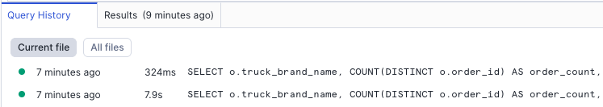

author: Dureti Shemsi, Cameron Shimmin
id: tasty_bytes_zero_to_snowflake_v2
summary: Tasty Bytes - Zero to Snowflake
categories: Tasty-Bytes, Getting-Started, Featured
environments: web
status: Published
feedback link: https://github.com/Snowflake-Labs/sfguides/issues
tags: Getting Started, Tasty Bytes, Zero to Snowflake, Governance, Horizon, Data Security, RBAC, Masking, Data Quality

# Tasty Bytes - Zero to Snowflake

## Welcome to the Course!

Duration: 1
<!-- \ -->

### Overview

Welcome to the Zero to Snowflake Quickstart! This guide is a consolidated journey through key areas of the Snowflake AI Data Cloud. You will start with the fundamentals of warehousing and data transformation, build an automated data pipeline, then see how you can experiment with LLMs using the Cortex Playground to compare different models for summarizing text, use AISQL Functions to instantly analyze customer review sentiment with a simple SQL command, and leverage the Snowflake Copilot to accelerate query writing by asking for the SQL you need in plain English. Finally, you will learn to secure your data with powerful governance controls and enrich your analysis through seamless data collaboration.

### Prerequisites

  - Before beginning, please make sure you have completed the [**Introduction to Tasty Bytes Quickstart**](https://quickstarts.snowflake.com/guide/tasty_bytes_introduction/index.html) which provides a walkthrough on setting up a trial account and deploying the Tasty Bytes Foundation required to complete this Quickstart.

### What You Will Learn

  - **Vignette 1: Getting Started:** The fundamentals of Snowflake warehouses, caching, cloning, and Time Travel.
  - **Vignette 2: Simple Data Pipelines:** How to ingest and transform semi-structured data using Dynamic Tables.
  - **Vignette 3: Artificial Intelligence:** A placeholder for your future content.
  - **Vignette 4: Governance with Horizon:** How to protect your data with roles, classification, masking, and row-access policies.
  - **Vignette 5: Apps & Collaboration:** How to leverage the Snowflake Marketplace to enrich your internal data with third-party datasets.

### What You Will Build

  - A comprehensive understanding of the core Snowflake platform.
  - Configured Virtual Warehouses.
  - An automated ELT pipeline with Dynamic Tables.
  - A robust data governance framework with roles and policies.
  - Enriched analytical views combining first- and third-party data.

## **Creating a Worksheet in Workspaces and Copying in our SQL**

Duration: 3

### **Overview**

In this Quickstart, we will use Snowflake Workspaces to organize, edit, and run all the SQL scripts required for this course. We will create a dedicated SQL worksheet for the setup and each vignette. This will keep our code organized and easy to manage.

Let's walk through how to create your first worksheet, add the necessary setup code, and run it.

### **Step 1 \- Create Your Setup Worksheet**

First, we need a place to put our setup script.

1. **Navigate to Workspaces:** In the left-hand navigation menu of the Snowflake UI, click on **Projects** » **Workspaces**. This is the central hub for all your worksheets.  
2. **Create a New Worksheet:** Find and click the **"+ Add New"** button in the top-right corner of the Workspaces area. This will generate a new, blank worksheet.  
3. **Rename the Worksheet:** Your new worksheet will have a name based on the timestamp it was created. Give it a descriptive name like **Zero To Snowflake Setup**.

### **Step 2 \- Add and Run the Setup Script**

Now that you have your worksheet, it's time to add the setup SQL and execute it.

1. **Copy the SQL Code:** In the section below, you'll find a large block of SQL code. Select the *entire* script and copy it to your clipboard.  
2. **Paste into your Worksheet:** Return to your Zero To Snowflake Setup worksheet in Snowflake and paste the entire script into the editor.  
3. **Run the Script:** To execute all the commands in the worksheet sequentially, click the **"Run All"** button located at the top-right of the worksheet editor. This will perform all the necessary setup actions, such as creating roles, databases, and warehouses that you will need for the upcoming vignettes.

### **Looking Ahead**

The process you just completed for creating a new worksheet is the exact same workflow you will use for every subsequent vignette in this course.

For each new vignette, you will:

1. Create a **new** worksheet.  
2. Give it a descriptive name (e.g., Vignette 1 \- Getting Started with Snowflake).  
3. Copy and paste the SQL script for that specific vignette.  
4. Click **"Run All"** to execute it.

This practice will keep your work for each section self-contained and organized.

<!-- end list -->
### Copy the entire SQL block below and paste it into your worksheet.

```sql
USE ROLE sysadmin;

-- assign Query Tag to Session 
ALTER SESSION SET query_tag = '{"origin":"sf_sit-is","name":"tb_zts","version":{"major":1, "minor":1},"attributes":{"is_quickstart":1, "source":"sql", "vignette": "intro"}}';

/*--
 • database, schema and warehouse creation
--*/

-- create tb_101 database
CREATE OR REPLACE DATABASE tb_101;

-- create raw_pos schema
CREATE OR REPLACE SCHEMA tb_101.raw_pos;

-- create raw_customer schema
CREATE OR REPLACE SCHEMA tb_101.raw_customer;

-- create harmonized schema
CREATE OR REPLACE SCHEMA tb_101.harmonized;

-- create analytics schema
CREATE OR REPLACE SCHEMA tb_101.analytics;

-- create governance schema
CREATE OR REPLACE SCHEMA tb_101.governance;

-- create raw_support
CREATE OR REPLACE SCHEMA tb_101.raw_support;

-- Create schema for the Semantic Layer
CREATE OR REPLACE SCHEMA tb_101.semantic_layer
COMMENT = 'Schema for the business-friendly semantic layer, optimized for analytical consumption.';

-- create warehouses
CREATE OR REPLACE WAREHOUSE tb_de_wh
    WAREHOUSE_SIZE = 'large' -- Large for initial data load - scaled down to XSmall at end of this scripts
    WAREHOUSE_TYPE = 'standard'
    AUTO_SUSPEND = 60
    AUTO_RESUME = TRUE
    INITIALLY_SUSPENDED = TRUE
COMMENT = 'data engineering warehouse for tasty bytes';

CREATE OR REPLACE WAREHOUSE tb_dev_wh
    WAREHOUSE_SIZE = 'xsmall'
    WAREHOUSE_TYPE = 'standard'
    AUTO_SUSPEND = 60
    AUTO_RESUME = TRUE
    INITIALLY_SUSPENDED = TRUE
COMMENT = 'developer warehouse for tasty bytes';

-- create analyst warehouse
CREATE OR REPLACE WAREHOUSE tb_analyst_wh
    COMMENT = 'TastyBytes Analyst Warehouse'
    WAREHOUSE_TYPE = 'standard'
    WAREHOUSE_SIZE = 'large'
    MIN_CLUSTER_COUNT = 1
    MAX_CLUSTER_COUNT = 2
    SCALING_POLICY = 'standard'
    AUTO_SUSPEND = 60
    INITIALLY_SUSPENDED = true,
    AUTO_RESUME = true;

-- Create a dedicated large warehouse for analytical workloads
CREATE OR REPLACE WAREHOUSE tb_cortex_wh
    WAREHOUSE_SIZE = 'LARGE'
    WAREHOUSE_TYPE = 'STANDARD'
    AUTO_SUSPEND = 60
    AUTO_RESUME = TRUE
    INITIALLY_SUSPENDED = TRUE
COMMENT = 'Dedicated large warehouse for Cortex Analyst and other analytical tools.';

-- create roles
USE ROLE securityadmin;

-- functional roles
CREATE ROLE IF NOT EXISTS tb_admin
    COMMENT = 'admin for tasty bytes';
    
CREATE ROLE IF NOT EXISTS tb_data_engineer
    COMMENT = 'data engineer for tasty bytes';
    
CREATE ROLE IF NOT EXISTS tb_dev
    COMMENT = 'developer for tasty bytes';
    
CREATE ROLE IF NOT EXISTS tb_analyst
    COMMENT = 'analyst for tasty bytes';
    
-- role hierarchy
GRANT ROLE tb_admin TO ROLE sysadmin;
GRANT ROLE tb_data_engineer TO ROLE tb_admin;
GRANT ROLE tb_dev TO ROLE tb_data_engineer;
GRANT ROLE tb_analyst TO ROLE tb_data_engineer;

-- privilege grants
USE ROLE accountadmin;

GRANT IMPORTED PRIVILEGES ON DATABASE snowflake TO ROLE tb_data_engineer;

GRANT CREATE WAREHOUSE ON ACCOUNT TO ROLE tb_admin;

USE ROLE securityadmin;

GRANT USAGE ON DATABASE tb_101 TO ROLE tb_admin;
GRANT USAGE ON DATABASE tb_101 TO ROLE tb_data_engineer;
GRANT USAGE ON DATABASE tb_101 TO ROLE tb_dev;

GRANT USAGE ON ALL SCHEMAS IN DATABASE tb_101 TO ROLE tb_admin;
GRANT USAGE ON ALL SCHEMAS IN DATABASE tb_101 TO ROLE tb_data_engineer;
GRANT USAGE ON ALL SCHEMAS IN DATABASE tb_101 TO ROLE tb_dev;

GRANT ALL ON SCHEMA tb_101.raw_support TO ROLE tb_admin;
GRANT ALL ON SCHEMA tb_101.raw_support TO ROLE tb_data_engineer;
GRANT ALL ON SCHEMA tb_101.raw_support TO ROLE tb_dev;

GRANT ALL ON SCHEMA tb_101.raw_pos TO ROLE tb_admin;
GRANT ALL ON SCHEMA tb_101.raw_pos TO ROLE tb_data_engineer;
GRANT ALL ON SCHEMA tb_101.raw_pos TO ROLE tb_dev;

GRANT ALL ON SCHEMA tb_101.harmonized TO ROLE tb_admin;
GRANT ALL ON SCHEMA tb_101.harmonized TO ROLE tb_data_engineer;
GRANT ALL ON SCHEMA tb_101.harmonized TO ROLE tb_dev;

GRANT ALL ON SCHEMA tb_101.analytics TO ROLE tb_admin;
GRANT ALL ON SCHEMA tb_101.analytics TO ROLE tb_data_engineer;
GRANT ALL ON SCHEMA tb_101.analytics TO ROLE tb_dev;

GRANT ALL ON SCHEMA tb_101.governance TO ROLE tb_admin;
GRANT ALL ON SCHEMA tb_101.governance TO ROLE tb_data_engineer;
GRANT ALL ON SCHEMA tb_101.governance TO ROLE tb_dev;

GRANT ALL ON SCHEMA tb_101.semantic_layer TO ROLE tb_admin;
GRANT ALL ON SCHEMA tb_101.semantic_layer TO ROLE tb_data_engineer;
GRANT ALL ON SCHEMA tb_101.semantic_layer TO ROLE tb_dev;

-- warehouse grants
GRANT OWNERSHIP ON WAREHOUSE tb_de_wh TO ROLE tb_admin COPY CURRENT GRANTS;
GRANT ALL ON WAREHOUSE tb_de_wh TO ROLE tb_admin;
GRANT ALL ON WAREHOUSE tb_de_wh TO ROLE tb_data_engineer;

GRANT ALL ON WAREHOUSE tb_dev_wh TO ROLE tb_admin;
GRANT ALL ON WAREHOUSE tb_dev_wh TO ROLE tb_data_engineer;
GRANT ALL ON WAREHOUSE tb_dev_wh TO ROLE tb_dev;

GRANT ALL ON WAREHOUSE tb_analyst_wh TO ROLE tb_admin;
GRANT ALL ON WAREHOUSE tb_analyst_wh TO ROLE tb_data_engineer;
GRANT ALL ON WAREHOUSE tb_analyst_wh TO ROLE tb_dev;

GRANT ALL ON WAREHOUSE tb_cortex_wh TO ROLE tb_admin;
GRANT ALL ON WAREHOUSE tb_cortex_wh TO ROLE tb_data_engineer;
GRANT ALL ON WAREHOUSE tb_cortex_wh TO ROLE tb_dev;

-- future grants
GRANT ALL ON FUTURE TABLES IN SCHEMA tb_101.raw_pos TO ROLE tb_admin;
GRANT ALL ON FUTURE TABLES IN SCHEMA tb_101.raw_pos TO ROLE tb_data_engineer;
GRANT ALL ON FUTURE TABLES IN SCHEMA tb_101.raw_pos TO ROLE tb_dev;

GRANT ALL ON FUTURE TABLES IN SCHEMA tb_101.raw_customer TO ROLE tb_admin;
GRANT ALL ON FUTURE TABLES IN SCHEMA tb_101.raw_customer TO ROLE tb_data_engineer;
GRANT ALL ON FUTURE TABLES IN SCHEMA tb_101.raw_customer TO ROLE tb_dev;

GRANT ALL ON FUTURE VIEWS IN SCHEMA tb_101.harmonized TO ROLE tb_admin;
GRANT ALL ON FUTURE VIEWS IN SCHEMA tb_101.harmonized TO ROLE tb_data_engineer;
GRANT ALL ON FUTURE VIEWS IN SCHEMA tb_101.harmonized TO ROLE tb_dev;

GRANT ALL ON FUTURE VIEWS IN SCHEMA tb_101.analytics TO ROLE tb_admin;
GRANT ALL ON FUTURE VIEWS IN SCHEMA tb_101.analytics TO ROLE tb_data_engineer;
GRANT ALL ON FUTURE VIEWS IN SCHEMA tb_101.analytics TO ROLE tb_dev;

GRANT ALL ON FUTURE VIEWS IN SCHEMA tb_101.governance TO ROLE tb_admin;
GRANT ALL ON FUTURE VIEWS IN SCHEMA tb_101.governance TO ROLE tb_data_engineer;
GRANT ALL ON FUTURE VIEWS IN SCHEMA tb_101.governance TO ROLE tb_dev;

GRANT ALL ON FUTURE VIEWS IN SCHEMA tb_101.semantic_layer TO ROLE tb_admin;
GRANT ALL ON FUTURE VIEWS IN SCHEMA tb_101.semantic_layer TO ROLE tb_data_engineer;
GRANT ALL ON FUTURE VIEWS IN SCHEMA tb_101.semantic_layer TO ROLE tb_dev;

-- Apply Masking Policy Grants
USE ROLE accountadmin;
GRANT APPLY MASKING POLICY ON ACCOUNT TO ROLE tb_admin;
GRANT APPLY MASKING POLICY ON ACCOUNT TO ROLE tb_data_engineer;
  
-- Grants for tb_admin
GRANT EXECUTE DATA METRIC FUNCTION ON ACCOUNT TO ROLE tb_admin;

-- Grants for tb_analyst
GRANT ALL ON SCHEMA harmonized TO ROLE tb_analyst;
GRANT ALL ON SCHEMA analytics TO ROLE tb_analyst;
GRANT OPERATE, USAGE ON WAREHOUSE tb_analyst_wh TO ROLE tb_analyst;
GRANT ROLE tb_analyst TO USER USER;

-- Grants for cortex search service
GRANT DATABASE ROLE SNOWFLAKE.CORTEX_USER TO ROLE TB_DEV;
GRANT USAGE ON SCHEMA TB_101.HARMONIZED TO ROLE TB_DEV;
GRANT USAGE ON WAREHOUSE TB_DE_WH TO ROLE TB_DEV;


-- raw_pos table build
USE ROLE sysadmin;
USE WAREHOUSE tb_de_wh;

/*--
 • file format and stage creation
--*/

CREATE OR REPLACE FILE FORMAT tb_101.public.csv_ff 
type = 'csv';

CREATE OR REPLACE STAGE tb_101.public.s3load
COMMENT = 'Quickstarts S3 Stage Connection'
url = 's3://sfquickstarts/frostbyte_tastybytes/'
file_format = tb_101.public.csv_ff;

CREATE OR REPLACE STAGE tb_101.public.truck_reviews_s3load
COMMENT = 'Truck Reviews Stage'
url = 's3://sfquickstarts/tastybytes-voc/'
file_format = tb_101.public.csv_ff;

-- This stage will be used to upload your YAML files.
CREATE OR REPLACE STAGE tb_101.semantic_layer.semantic_model_stage
  DIRECTORY = (ENABLE = TRUE)
  COMMENT = 'Internal stage for uploading Cortex Analyst semantic model YAML files.';

/*--
 raw zone table build 
--*/

-- country table build
CREATE OR REPLACE TABLE tb_101.raw_pos.country
(
    country_id NUMBER(18,0),
    country VARCHAR(16777216),
    iso_currency VARCHAR(3),
    iso_country VARCHAR(2),
    city_id NUMBER(19,0),
    city VARCHAR(16777216),
    city_population VARCHAR(16777216)
);

-- franchise table build
CREATE OR REPLACE TABLE tb_101.raw_pos.franchise 
(
    franchise_id NUMBER(38,0),
    first_name VARCHAR(16777216),
    last_name VARCHAR(16777216),
    city VARCHAR(16777216),
    country VARCHAR(16777216),
    e_mail VARCHAR(16777216),
    phone_number VARCHAR(16777216) 
);

-- location table build
CREATE OR REPLACE TABLE tb_101.raw_pos.location
(
    location_id NUMBER(19,0),
    placekey VARCHAR(16777216),
    location VARCHAR(16777216),
    city VARCHAR(16777216),
    region VARCHAR(16777216),
    iso_country_code VARCHAR(16777216),
    country VARCHAR(16777216)
);

-- menu table build
CREATE OR REPLACE TABLE tb_101.raw_pos.menu
(
    menu_id NUMBER(19,0),
    menu_type_id NUMBER(38,0),
    menu_type VARCHAR(16777216),
    truck_brand_name VARCHAR(16777216),
    menu_item_id NUMBER(38,0),
    menu_item_name VARCHAR(16777216),
    item_category VARCHAR(16777216),
    item_subcategory VARCHAR(16777216),
    cost_of_goods_usd NUMBER(38,4),
    sale_price_usd NUMBER(38,4),
    menu_item_health_metrics_obj VARIANT
);

-- truck table build 
CREATE OR REPLACE TABLE tb_101.raw_pos.truck
(
    truck_id NUMBER(38,0),
    menu_type_id NUMBER(38,0),
    primary_city VARCHAR(16777216),
    region VARCHAR(16777216),
    iso_region VARCHAR(16777216),
    country VARCHAR(16777216),
    iso_country_code VARCHAR(16777216),
    franchise_flag NUMBER(38,0),
    year NUMBER(38,0),
    make VARCHAR(16777216),
    model VARCHAR(16777216),
    ev_flag NUMBER(38,0),
    franchise_id NUMBER(38,0),
    truck_opening_date DATE
);

-- order_header table build
CREATE OR REPLACE TABLE tb_101.raw_pos.order_header
(
    order_id NUMBER(38,0),
    truck_id NUMBER(38,0),
    location_id FLOAT,
    customer_id NUMBER(38,0),
    discount_id VARCHAR(16777216),
    shift_id NUMBER(38,0),
    shift_start_time TIME(9),
    shift_end_time TIME(9),
    order_channel VARCHAR(16777216),
    order_ts TIMESTAMP_NTZ(9),
    served_ts VARCHAR(16777216),
    order_currency VARCHAR(3),
    order_amount NUMBER(38,4),
    order_tax_amount VARCHAR(16777216),
    order_discount_amount VARCHAR(16777216),
    order_total NUMBER(38,4)
);

-- order_detail table build
CREATE OR REPLACE TABLE tb_101.raw_pos.order_detail 
(
    order_detail_id NUMBER(38,0),
    order_id NUMBER(38,0),
    menu_item_id NUMBER(38,0),
    discount_id VARCHAR(16777216),
    line_number NUMBER(38,0),
    quantity NUMBER(5,0),
    unit_price NUMBER(38,4),
    price NUMBER(38,4),
    order_item_discount_amount VARCHAR(16777216)
);

-- customer loyalty table build
CREATE OR REPLACE TABLE tb_101.raw_customer.customer_loyalty
(
    customer_id NUMBER(38,0),
    first_name VARCHAR(16777216),
    last_name VARCHAR(16777216),
    city VARCHAR(16777216),
    country VARCHAR(16777216),
    postal_code VARCHAR(16777216),
    preferred_language VARCHAR(16777216),
    gender VARCHAR(16777216),
    favourite_brand VARCHAR(16777216),
    marital_status VARCHAR(16777216),
    children_count VARCHAR(16777216),
    sign_up_date DATE,
    birthday_date DATE,
    e_mail VARCHAR(16777216),
    phone_number VARCHAR(16777216)
);

/*--
 raw_suport zone table build 
--*/
CREATE OR REPLACE TABLE tb_101.raw_support.truck_reviews
(
    order_id NUMBER(38,0),
    language VARCHAR(16777216),
    source VARCHAR(16777216),
    review VARCHAR(16777216),
    review_id NUMBER(38,0)  
);

/*--
 • harmonized view creation
--*/

-- orders_v view
CREATE OR REPLACE VIEW tb_101.harmonized.orders_v
    AS
SELECT 
    oh.order_id,
    oh.truck_id,
    oh.order_ts,
    od.order_detail_id,
    od.line_number,
    m.truck_brand_name,
    m.menu_type,
    t.primary_city,
    t.region,
    t.country,
    t.franchise_flag,
    t.franchise_id,
    f.first_name AS franchisee_first_name,
    f.last_name AS franchisee_last_name,
    l.location_id,
    cl.customer_id,
    cl.first_name,
    cl.last_name,
    cl.e_mail,
    cl.phone_number,
    cl.children_count,
    cl.gender,
    cl.marital_status,
    od.menu_item_id,
    m.menu_item_name,
    od.quantity,
    od.unit_price,
    od.price,
    oh.order_amount,
    oh.order_tax_amount,
    oh.order_discount_amount,
    oh.order_total
FROM tb_101.raw_pos.order_detail od
JOIN tb_101.raw_pos.order_header oh
    ON od.order_id = oh.order_id
JOIN tb_101.raw_pos.truck t
    ON oh.truck_id = t.truck_id
JOIN tb_101.raw_pos.menu m
    ON od.menu_item_id = m.menu_item_id
JOIN tb_101.raw_pos.franchise f
    ON t.franchise_id = f.franchise_id
JOIN tb_101.raw_pos.location l
    ON oh.location_id = l.location_id
LEFT JOIN tb_101.raw_customer.customer_loyalty cl
    ON oh.customer_id = cl.customer_id;

-- loyalty_metrics_v view
CREATE OR REPLACE VIEW tb_101.harmonized.customer_loyalty_metrics_v
    AS
SELECT 
    cl.customer_id,
    cl.city,
    cl.country,
    cl.first_name,
    cl.last_name,
    cl.phone_number,
    cl.e_mail,
    SUM(oh.order_total) AS total_sales,
    ARRAY_AGG(DISTINCT oh.location_id) AS visited_location_ids_array
FROM tb_101.raw_customer.customer_loyalty cl
JOIN tb_101.raw_pos.order_header oh
ON cl.customer_id = oh.customer_id
GROUP BY cl.customer_id, cl.city, cl.country, cl.first_name,
cl.last_name, cl.phone_number, cl.e_mail;

-- truck_reviews_v view
  CREATE OR REPLACE VIEW tb_101.harmonized.truck_reviews_v
      AS
  SELECT DISTINCT
      r.review_id,
      r.order_id,
      oh.truck_id,
      r.language,
      source,
      r.review,
      t.primary_city,
      oh.customer_id,
      TO_DATE(oh.order_ts) AS date,
      m.truck_brand_name
  FROM raw_support.truck_reviews r
  JOIN raw_pos.order_header oh
      ON oh.order_id = r.order_id
  JOIN raw_pos.truck t
      ON t.truck_id = oh.truck_id
  JOIN raw_pos.menu m
      ON m.menu_type_id = t.menu_type_id;

/*--
 • analytics view creation
--*/

-- orders_v view
CREATE OR REPLACE VIEW tb_101.analytics.orders_v
COMMENT = 'Tasty Bytes Order Detail View'
    AS
SELECT DATE(o.order_ts) AS date, * FROM tb_101.harmonized.orders_v o;

-- customer_loyalty_metrics_v view
CREATE OR REPLACE VIEW tb_101.analytics.customer_loyalty_metrics_v
COMMENT = 'Tasty Bytes Customer Loyalty Member Metrics View'
    AS
SELECT * FROM tb_101.harmonized.customer_loyalty_metrics_v;

-- truck_reviews_v view
CREATE OR REPLACE VIEW tb_101.analytics.truck_reviews_v 
    AS
SELECT * FROM harmonized.truck_reviews_v;
GRANT USAGE ON SCHEMA raw_support to ROLE tb_admin;
GRANT SELECT ON TABLE raw_support.truck_reviews TO ROLE tb_admin;

-- view for streamlit app
CREATE OR REPLACE VIEW tb_101.analytics.japan_menu_item_sales_feb_2022
AS
SELECT
    DISTINCT menu_item_name,
    date,
    order_total
FROM analytics.orders_v
WHERE country = 'Japan'
    AND YEAR(date) = '2022'
    AND MONTH(date) = '2'
GROUP BY ALL
ORDER BY date;

-- Orders view for the Semantic Layer
CREATE OR REPLACE VIEW tb_101.semantic_layer.orders_v
AS
SELECT * FROM (
    SELECT
        order_id::VARCHAR AS order_id,
        truck_id::VARCHAR AS truck_id,
        order_detail_id::VARCHAR AS order_detail_id,
        truck_brand_name,
        menu_type,
        primary_city,
        region,
        country,
        franchise_flag,
        franchise_id::VARCHAR AS franchise_id,
        location_id::VARCHAR AS location_id,
        customer_id::VARCHAR AS customer_id,
        gender,
        marital_status,
        menu_item_id::VARCHAR AS menu_item_id,
        menu_item_name,
        quantity,
        order_total
    FROM tb_101.harmonized.orders_v
)
LIMIT 10000;

-- Customer Loyalty Metrics view for the Semantic Layer
CREATE OR REPLACE VIEW tb_101.semantic_layer.customer_loyalty_metrics_v
AS
SELECT * FROM (
    SELECT
        cl.customer_id::VARCHAR AS customer_id,
        cl.city,
        cl.country,
        SUM(o.order_total) AS total_sales,
        ARRAY_AGG(DISTINCT o.location_id::VARCHAR) WITHIN GROUP (ORDER BY o.location_id::VARCHAR) AS visited_location_ids_array
    FROM tb_101.harmonized.customer_loyalty_metrics_v AS cl
    JOIN tb_101.harmonized.orders_v AS o
        ON cl.customer_id = o.customer_id
    GROUP BY
        cl.customer_id,
        cl.city,
        cl.country
    ORDER BY
        cl.customer_id
)
LIMIT 10000;

/*--
 raw zone table load 
--*/

-- truck_reviews table load
COPY INTO tb_101.raw_support.truck_reviews
FROM @tb_101.public.truck_reviews_s3load/raw_support/truck_reviews/;

-- country table load
COPY INTO tb_101.raw_pos.country
FROM @tb_101.public.s3load/raw_pos/country/;

-- franchise table load
COPY INTO tb_101.raw_pos.franchise
FROM @tb_101.public.s3load/raw_pos/franchise/;

-- location table load
COPY INTO tb_101.raw_pos.location
FROM @tb_101.public.s3load/raw_pos/location/;

-- menu table load
COPY INTO tb_101.raw_pos.menu
FROM @tb_101.public.s3load/raw_pos/menu/;

-- truck table load
COPY INTO tb_101.raw_pos.truck
FROM @tb_101.public.s3load/raw_pos/truck/;

-- customer_loyalty table load
COPY INTO tb_101.raw_customer.customer_loyalty
FROM @tb_101.public.s3load/raw_customer/customer_loyalty/;

-- order_header table load
COPY INTO tb_101.raw_pos.order_header
FROM @tb_101.public.s3load/raw_pos/order_header/;

-- Setup truck details
USE WAREHOUSE tb_de_wh;

-- order_detail table load
COPY INTO tb_101.raw_pos.order_detail
FROM @tb_101.public.s3load/raw_pos/order_detail/;

-- add truck_build column
ALTER TABLE tb_101.raw_pos.truck
ADD COLUMN truck_build OBJECT;

-- construct an object from year, make, model and store on truck_build column
UPDATE tb_101.raw_pos.truck
    SET truck_build = OBJECT_CONSTRUCT(
        'year', year,
        'make', make,
        'model', model
    );

-- Messing up make data in truck_build object
UPDATE tb_101.raw_pos.truck
SET truck_build = OBJECT_INSERT(
    truck_build,
    'make',
    'Ford',
    TRUE
)
WHERE 
    truck_build:make::STRING = 'Ford_'
    AND 
    truck_id % 2 = 0;

-- truck_details table build 
CREATE OR REPLACE TABLE tb_101.raw_pos.truck_details
AS 
SELECT * EXCLUDE (year, make, model)
FROM tb_101.raw_pos.truck;

-- Create or replace the Cortex Search Service named 'tasty_bytes_review_search'. --
CREATE OR REPLACE CORTEX SEARCH SERVICE tb_101.harmonized.tasty_bytes_review_search
ON REVIEW 
ATTRIBUTES LANGUAGE, ORDER_ID, REVIEW_ID, TRUCK_BRAND_NAME, PRIMARY_CITY, DATE, SOURCE 
WAREHOUSE = tb_de_wh
TARGET_LAG = '1 hour' 
AS (
    SELECT
        REVIEW,             
        LANGUAGE,           
        ORDER_ID,           
        REVIEW_ID,          
        TRUCK_BRAND_NAME,  
        PRIMARY_CITY,       
        DATE,               
        SOURCE             
    FROM
        tb_101.harmonized.truck_reviews_v 
    WHERE
        REVIEW IS NOT NULL 
);

USE ROLE securityadmin;
-- Additional Grants on semantic layer
GRANT SELECT ON VIEW tb_101.semantic_layer.orders_v TO ROLE PUBLIC;
GRANT SELECT ON VIEW tb_101.semantic_layer.customer_loyalty_metrics_v TO ROLE PUBLIC;
GRANT READ ON STAGE tb_101.semantic_layer.semantic_model_stage TO ROLE tb_admin;
GRANT WRITE ON STAGE tb_101.semantic_layer.semantic_model_stage TO ROLE tb_admin;
```

### Step 4 - Click Next --\>

## Vignette 1: Getting Started with Snowflake

### Overview

Within this Vignette, we will learn about core Snowflake concepts by exploring Virtual Warehouses, using the query results cache, performing basic data transformations, leveraging data recovery with Time Travel, and monitoring our account with Resource Monitors and Budgets.

### Prerequisites
- Before beginning, please make sure you have completed the [**Introduction to Tasty Bytes Quickstart**](https://quickstarts.snowflake.com/guide/tasty_bytes_introduction/index.html) which provides a walkthrough on setting up a trial account and deploying the Tasty Bytes Foundation required to complete this Quickstart.

### What You Will Learn
- How to create, configure, and scale a Virtual Warehouse.
- How to leverage the Query Result Cache.
- How to use Zero-Copy Cloning for development.
- How to transform and clean data.
- How to instantly recover a dropped table using UNDROP.
- How to create and apply a Resource Monitor.
- How to create a Budget to monitor costs.
- How to use Universal Search to find objects and information.

### What You Will Build
- A Snowflake Virtual Warehouse
- A development copy of a table using Zero-Copy Clone
- A Resource Monitor
- A Budget

### Copy the entire SQL block below and paste it into your worksheet.

```sql
/***************************************************************************************************       
Asset:        Zero to Snowflake v2 - Getting Started with Snowflake
Version:      v1     
Copyright(c): 2025 Snowflake Inc. All rights reserved.
****************************************************************************************************

Getting Started with Snowflake
1. Virtual Warehouses & Settings
2. Using Persisted Query Results
3. Basic Data Transformation Techniques
4. Data Recovery with UNDROP
5. Resource Monitors
6. Budgets
7. Universal Search

****************************************************************************************************/

-- Before we start, run this query to set the session query tag.
ALTER SESSION SET query_tag = '{"origin":"sf_sit-is","name":"tb_101_v2","version":{"major":1, "minor":1},"attributes":{"is_quickstart":0, "source":"tastybytes", "vignette": "getting_started_with_snowflake"}}';

-- We'll begin by setting our Worksheet context. We will set our database, schema and role.

USE DATABASE tb_101;
USE ROLE accountadmin;

/*   1. Virtual Warehouses & Settings 
    **************************************************************
     User-Guide:
     https://docs.snowflake.com/en/user-guide/warehouses-overview
    **************************************************************
    
    Virtual Warehouses are the dynamic, scalable, and cost-effective computing power that lets you 
    perform analysis on your Snowflake data. Their purpose is to handle all your data processing needs 
    without you having to worry about the underlying technical details.

    Warehouse parameters:
      > WAREHOUSE_SIZE: 
            Size specifies the amount of compute resources available per cluster 
            in a warehouse. The available sizes range from X-Small to 6X-Large.
            Default: 'XSmall'
      > WAREHOUSE_TYPE:
            Defines the type of virtual warehouse, which dictates its architecture and behavior
            Types:
                'STANDARD' for general purpose workloads
                'SNOWPARK_OPTIMIZED' for memory-intensive workloads
            Default: 'STANDARD'
      > AUTO_SUSPEND:
            Specifies the period of inactivity after which the warehouse will automatically suspend itself.
            Default: 600s
      > INITIALLY_SUSPENDED:
            Determines whether the warehouse starts in a suspended state immediately after it is created.
            Default: TRUE
      > AUTO_RESUME:
            Determines whether the warehouse automatically resumes from a suspended state when a query is directed to it.
            Default: TRUE

        With that, let's create our first warehouse!
*/

-- Let's first look at the warehouses that already exist on our account that you have access privileges for
SHOW WAREHOUSES;

/*
    This returns the list of warehouses and their attributes: name, state (running or suspended), type, and size 
    among many others. 
    
    We can also view and manage all warehouses in Snowsight. To access the warehouse page, click the Admin button
    on the Navigation Menu, then click the 'Warehouses' link in the now expanded Admin category.
    
    Back on the warehouse page, we see a list of the warehouses on this account and their attributes.
*/

-- You can easily create a warehouse with a simple SQL command
CREATE OR REPLACE WAREHOUSE my_wh
    COMMENT = 'My TastyBytes warehouse'
    WAREHOUSE_TYPE = 'standard'
    WAREHOUSE_SIZE = 'xsmall'
    MIN_CLUSTER_COUNT = 1
    MAX_CLUSTER_COUNT = 2
    SCALING_POLICY = 'standard'
    AUTO_SUSPEND = 60
    INITIALLY_SUSPENDED = true,
    AUTO_RESUME = false;

/*
    Now that we have a warehouse, we should specify that this Worksheet uses this warehouse. We can
    do this either with a SQL command, or in the UI.
*/

-- Use the warehouse
USE WAREHOUSE my_wh;

/*
    We can try running a simple query, however, you will see an error message in the results pane, informing
    us that our warehouse MY_WH is suspended. Try it now.
*/
SELECT * FROM raw_pos.truck_details;

/*    
    An active warehouse is required for running queries, as well as all DML operations, so we'll 
    need to resume our warehouse if we want to get insights from our data.
    
    The error message also came with a suggestion to run the SQL command:
    'ALTER warehouse MY_WH resume'. Let's do just that!
*/
ALTER WAREHOUSE my_wh RESUME;

/* 
    We'll also set AUTO_RESUME to TRUE so we can avoid having to manually 
    resume the warehouse should it suspend again.
 */
ALTER WAREHOUSE my_wh SET AUTO_RESUME = TRUE;

--The warehouse is now running, so lets try to run the query from before 
SELECT * FROM raw_pos.truck_details;

-- Now we are able to start running queries on our data

/* 
    Next, let's take a look at the power of warehouse scalability in Snowflake.
    
    Warehouses in Snowflake are designed for scalability and elasticity, giving you the power
    to adjust compute resources up or down based on workload needs.
    
    We can easily scale up our warehouses on the fly with a simple ALTER WAREHOUSE statement.
*/
ALTER WAREHOUSE my_wh SET warehouse_size = 'XLarge';

--Let's now take a look at the sales per truck.
SELECT
    o.truck_brand_name,
    COUNT(DISTINCT o.order_id) AS order_count,
    SUM(o.price) AS total_sales
FROM analytics.orders_v o
GROUP BY o.truck_brand_name
ORDER BY total_sales DESC;

/*
    With the Results panel open, take a quick look at the toolbar in the top right. Here we see options to search, 
    select columns, view query details and duration stats, view column stats, and download results. 
    
    Search - Use search terms to filter the results
    Column selection - Enable/disable columns to display in the results
      Query details - Contains information related to the query like the SQL text, rows returned, query ID, the 
      role and warehouse it was executed with.
    Query duration - Breaks down how long it took for the query to run by compilation, provisioning and execution times.
    Column stats - Displays data relating to the distributions of the columns on the results panel.
    Download results - Export and download the results as csv.
*/

/*  2. Using Persisted Query Results
    *******************************************************************
    User-Guide:
    https://docs.snowflake.com/en/user-guide/querying-persisted-results
    *******************************************************************
    
    Before we proceed, this is a great place to demonstrate another powerful feature in Snowflake: 
    the Query Result Cache.
    
    When we first ran the above query it took several seconds to complete, even with an XL warehouse.

    Run the same 'sales per truck' query above and note the total run time in the Query Duration pane.
    You'll notice that it took several seconds the first time you ran it to only a few hundred milliseconds 
    the next time. This is the query result cache in action.

    Open the Query History panel and compare the run times between the first time the query was run for the second time.
    
    Query Result Cache overview:
    - Results are retained for any query for 24 hours, however the timer is reset any time the query is executed.
    - Hitting the result cache requires almost no compute resources, ideal for frequently run reports or dashboards
      and managing credit consumption.
    - The cache resides in the Cloud Services Layer, meaning it is logically separated from individual warehouses. 
      This makes it globally accessible to all virtual warehouses & users within the same account.
*/

-- We'll now start working with a smaller dataset, so we can scale the warehouse back down
ALTER WAREHOUSE my_wh SET warehouse_size = 'XSmall';

/*  3. Basic Transformation Techniques

    Now that our warehouse is configured and running, the plan is to get an understanding of the distribution 
    of our trucks' manufacturers, however, this information is embedded in another column 'truck_build' that stores
    information about the year, make and model in a VARIANT data type. 

    VARIANT data types are examples of semi-structured data. They can store any type of data including OBJECT, 
    ARRAY and other VARIANT values. In our case, the truck_build stores a single OBJECT which contains three distinct 
    VARCHAR values for year, make and model.
    
    We'll now isolate all three properties into their own respective columns to allow for simpler and easier analytics. 
*/
SELECT truck_build FROM raw_pos.truck_details;

/*  Zero Copy Cloning

    The truck_build column data consistently follows the same format. We'll need a separate column for 'make'
    to more easily perform quality analysis on it. The plan is to create a development copy of the truck table, add new columns 
    for year, make, and model, then extract and store each property from the truck build VARIANT object into these new columns.
 
    Snowflake's powerful Zero Copy Cloning lets us create identical, fully functional and separate copies of database 
    objects instantly, without using any additional storage space. 

    Zero Copy Cloning leverages Snowflake's unique micropartition architecture to share data between the cloned object and original copy.
    Any changes to either table will result in new micropartitions created for only the modified data. These new micro-partitions are
    now owned exclusively by the owner, whether its the clone or original cloned object. Basically, any changes made to one table,
    will not be to either the original or cloned copy.
*/

-- Create the truck_dev table as a Zero Copy clone of the truck table
CREATE OR REPLACE TABLE raw_pos.truck_dev CLONE raw_pos.truck_details;

-- Verify successful truck table clone into truck_dev 
SELECT TOP 15 * 
FROM raw_pos.truck_dev
ORDER BY truck_id;

/*
    Now that we have a development copy of the truck table, we can start by adding the new columns.
    Note: To run all three statements at once, select them and click the blue 'Run' button at the top right of the screen, or use your keyboard.
    
        Mac: command + return
        Windows: Ctrl + Enter
*/

ALTER TABLE raw_pos.truck_dev ADD COLUMN IF NOT EXISTS year NUMBER;
ALTER TABLE raw_pos.truck_dev ADD COLUMN IF NOT EXISTS make VARCHAR(255);
ALTER TABLE raw_pos.truck_dev ADD COLUMN IF NOT EXISTS model VARCHAR(255);

/*
    Now let's update the new columns with the data extracted from the truck_build column.
    We will use the colon (:) operator to access the value of each key in the truck_build 
    column, then set that value to its respective column.
*/
UPDATE raw_pos.truck_dev
SET 
    year = truck_build:year::NUMBER,
    make = truck_build:make::VARCHAR,
    model = truck_build:model::VARCHAR;

-- Verify the 3 columns were successfully added to the table and populated with the extracted data from truck_build
SELECT year, make, model FROM raw_pos.truck_dev;

-- Now we can count the different makes and get a sense of the distribution in our TastyBytes food truck fleet.
SELECT 
    make,
    COUNT(*) AS count
FROM raw_pos.truck_dev
GROUP BY make
ORDER BY make ASC;

/*
    After running the query above, we notice a problem in our dataset. Some trucks' makes are 'Ford' and some 'Ford_',
    giving us two different counts for the same truck manufacturer.
*/

-- First we'll use UPDATE to change any occurrence of 'Ford_' to 'Ford'
UPDATE raw_pos.truck_dev
    SET make = 'Ford'
    WHERE make = 'Ford_';

-- Verify the make column has been successfully updated 
SELECT truck_id, make 
FROM raw_pos.truck_dev
ORDER BY truck_id;

/*
    The make column looks good now so let's SWAP the truck table with the truck_dev table
    This command atomically swaps the metadata and data between two tables, instantly promoting the truck_dev table 
    to become the new production truck table.
*/
ALTER TABLE raw_pos.truck_details SWAP WITH raw_pos.truck_dev; 

-- Run the query from before to get an accurate make count
SELECT 
    make,
    COUNT(*) AS count
FROM raw_pos.truck_details
GROUP BY
    make
ORDER BY count DESC;
/*
    The changes look great. We'll perform some cleanup on our dataset by first dropping the truck_build 
    column from the production database now that we have split that data into three separate columns.
    Then we can drop the truck_dev table since we no longer need it.
*/

-- We can drop the old truck build column with a simple ALTER TABLE ... DROP COLUMN command
ALTER TABLE raw_pos.truck_details DROP COLUMN truck_build;

-- Now we can drop the truck_dev table
DROP TABLE raw_pos.truck_details;

/*  4. Data Recovery with UNDROP
	
    Oh no! We accidentally dropped the production truck table. 😱

    Luckily we can use the UNDROP command to restore the table back to its state before being dropped. 
    UNDROP is part of Snowflake's powerful Time Travel feature and allows for the restoration of dropped
    database objects within a configured data retention period (default 24 hours).

    Let's restore the production 'truck' table ASAP using UNDROP!
*/

-- Optional: run this query to verify the 'truck' table no longer exists
    -- Note: The error 'Table TRUCK does not exist or not authorized.' means the table was dropped.
DESCRIBE TABLE raw_pos.truck_details;

--Run UNDROP on the production 'truck' table to restore it to the exact state it was in before being dropped
UNDROP TABLE raw_pos.truck_details;

--Verify the table was successfully restored
SELECT * from raw_pos.truck_details;

-- Now drop the real truck_dev table
DROP TABLE raw_pos.truck_dev;

/*  5. Resource Monitors
    ***********************************************************
    User-Guide:                                   
    https://docs.snowflake.com/en/user-guide/resource-monitors
    ***********************************************************

    Monitoring compute usage and spend is critical to any cloud-based workflow. Snowflake provides a simple 
    and straightforward way to track warehouse credit usage with Resource Monitors.

    With Resource Monitors you define credit quotas and then trigger certain actions on 
    associated warehouses upon reaching defined usage thresholds.

    Actions the resource monitor can take:
    -NOTIFY: Sends an email notification to specified users or roles.
    -SUSPEND: Suspends the associated warehouses when a threshold is reached.
              NOTE: Running queries are allowed to complete. 
    -SUSPEND_IMMEDIATE: Suspends the associated warehouses when a threshold is reached and
                        cancels all running queries.

    Now, we'll create a Resource Monitor for our warehouse my_wh

    Let's quickly set our account level role in Snowsight to accountadmin;
    To do so:
    - Click the User Icon in the bottom left of the screen
    - Hover over 'Switch Role'
    - Select 'ACCOUNTADMIN' in the role list panel

   Next we will use the accountadmin role in our Worksheet
*/
USE ROLE accountadmin;

-- Run the query below to create the resource monitor via SQL
CREATE OR REPLACE RESOURCE MONITOR my_resource_monitor
    WITH CREDIT_QUOTA = 100
    FREQUENCY = MONTHLY -- Can also be DAILY, WEEKLY, YEARLY, or NEVER (for a one-time quota)
    START_TIMESTAMP = IMMEDIATELY
    TRIGGERS ON 75 PERCENT DO NOTIFY
             ON 90 PERCENT DO SUSPEND
             ON 100 PERCENT DO SUSPEND_IMMEDIATE;

-- With the Resource Monitor created, apply it to my_wh
ALTER WAREHOUSE my_wh 
    SET RESOURCE_MONITOR = my_resource_monitor;

/*  6. Budgets
    ****************************************************
      User-Guide:                                   
      https://docs.snowflake.com/en/user-guide/budgets 
    ****************************************************
      
    In the previous step we configured a Resource Monitor that allows for monitoring
    credit usage for Warehouses. In this step we will create a Budget for a more holistic 
    and flexible approach to managing costs in Snowflake. 
    
    While Resource Monitors are tied specifically to warehouse and compute usage, Budgets can be used 
    to track costs and impose spending limits on any Snowflake object or service and notify users 
    when the dollar amount reaches a specified threshold.
*/

-- Let's first create our budget
CREATE OR REPLACE SNOWFLAKE.CORE.BUDGET my_budget()
    COMMENT = 'My Tasty Bytes Budget';

/*
    Before we can configure our Budget we need to verify an email address on the account.

    To verify your email address:
    - Click the User Icon in the bottom left of the screen
    - Click Settings 
    - Enter your email address in the email field
    - Click 'Save'
    - Check your email and follow instructions to verify email
        NOTE: if you don't receive an email after a few minutes, click 'Resend Verification'
     
    With our new budget now in place, our email verified and our account-level role set to accountadmin, 
    lets head over to the Budgets page in Snowsight to add some resources to our Budget.

    To get to the Budgets page in Snowsight:
    - Click the Admin button on the Navigation Menu
    - Click the first item 'Cost Management'
    - Click the 'Budgets' tab
    
    If prompted to select a warehouse, select tb_dev_wh, otherwise, ensure your warehouse is set to 
    tb_dev_wh from the warehouse panel at the top right of the screen.
    
    On the budgets page we see metrics about our spend for the current period.
    In the middle of the screen shows a graph of the current spend with forecasted spend.
    At the bottom of the screen we see our 'MY_BUDGET' budget we created earlier. Click
    that to view the Budget page
    
    Clicking the '<- Budget Details' at the top right of the screen reveals the
    Budget Details panel. Here we can view information about our budget and all 
    of the resources attached to it. We see there are no resources monitored so let's add some now.
    Click the 'Edit' button to open the Edit Budget panel;
    
    - Keep budget name the same
    - Set the spending limit to 100
    - Enter the email you verified earlier
    - Click the '+ Tags & Resources' button to add a couple of resources
    - Expand Databases, then TB_101, then check the box next to the ANALYTICS schema
    - Scroll down to and expand 'Warehouses'
    - Check the box for 'TB_DE_WH'
    - Click 'Done'
    - Back in the Edit Budget menu, click 'Save Changes'
*/

/*  7. Universal Search
    **************************************************************************
      User-Guide                                                             
      https://docs.snowflake.com/en/user-guide/ui-snowsight-universal-search  
    **************************************************************************

    Universal Search allows you to easily find any object in your account, plus explore data products in the Marketplace, 
    relevant Snowflake Documentation, and Community Knowledge Base articles.

    Let's try it now.
    - To use Universal Search, begin by clicking 'Search' in the Navigation Menu
    - Here we see the Universal Search UI. Let's put in our first search term.
    - Enter 'truck' into the search bar and observe the results. The top sections are categories 
      of relevant objects on your account, like databases, tables, views, stages, etc. Below your
      database objects you can see sections for relevant marketplace listings and documentation.

    - You may also provide search terms in natural language to describe what you're looking for. If we wanted to
    know where to start looking to answer which truck franchise has the most return customers, we could search
    something like 'Which truck franchise has the most loyal customer base?' Clicking 'View all >' button next to 
    the 'Tables & Views' section will allow us to view all of the relevant tables and views relevant to our query.

    Universal Search returns several tables and views from different schemas. Note also how the relevant columns
    are listed for each object. These are all excellent starting points for data-driven answers about return customers.
*/

-------------------------------------------------------------------------
--RESET--
-------------------------------------------------------------------------
-- Drop created objects
DROP RESOURCE MONITOR IF EXISTS my_resource_monitor;
DROP TABLE IF EXISTS raw_pos.truck_dev;

-- Reset truck details
CREATE OR REPLACE TABLE raw_pos.truck_details
AS 
SELECT * EXCLUDE (year, make, model)
FROM raw_pos.truck;

DROP WAREHOUSE IF EXISTS my_wh;
-- Unset Query Tag
ALTER SESSION UNSET query_tag;
```

### Step 7 - Click Next --\>

## Virtual Warehouses and Settings

Duration: 3

### Overview

Virtual Warehouses are the dynamic, scalable, and cost-effective computing power that lets you perform analysis on your Snowflake data. Their purpose is to handle all your data processing needs without you having to worry about the underlying technical details.

### Step 1 - Setting Context

First, lets set our session context. To run the queries, highlight the three queries at the top of your worksheet and click the "► Run" button.

```sql
ALTER SESSION SET query_tag = '{"origin":"sf_sit-is","name":"tb_101_v2","version":{"major":1, "minor":1},"attributes":{"is_quickstart":0, "source":"tastybytes", "vignette": "getting_started_with_snowflake"}}';

USE DATABASE tb_101;
USE ROLE accountadmin;
```

### Step 2 - Creating a Warehouse

Let's create our first warehouse\! This command creates a new X-Small warehouse that will initially be suspended and will not auto-resume.

```sql
CREATE OR REPLACE WAREHOUSE my_wh
    COMMENT = 'My TastyBytes warehouse'
    WAREHOUSE_TYPE = 'standard'
    WAREHOUSE_SIZE = 'xsmall'
    MIN_CLUSTER_COUNT = 1
    MAX_CLUSTER_COUNT = 2
    SCALING_POLICY = 'standard'
    AUTO_SUSPEND = 60
    INITIALLY_SUSPENDED = true,
    AUTO_RESUME = false;
```

> **Virtual Warehouses**: A virtual warehouse, often referred to simply as a “warehouse”, is a cluster of compute resources in Snowflake. Warehouses are required for queries, DML operations, and data loading. For more information, see the [Warehouse Overview](https://docs.snowflake.com/en/user-guide/warehouses-overview).

### Step 3 - Using and Resuming a Warehouse

Now that we have a warehouse, we must set it as the active warehouse for our session. Execute the next statement.

```sql
USE WAREHOUSE my_wh;
```

If you try to run the query below, it will fail, because the warehouse is suspended. 
```sql
SELECT * FROM raw_pos.truck_details;
```

Let's resume it and set it to auto-resume in the future.
```sql
ALTER WAREHOUSE my_wh RESUME;
ALTER WAREHOUSE my_wh SET AUTO_RESUME = TRUE;
```

Now, try the query again. It should execute successfully.

```sql
SELECT * FROM raw_pos.truck_details;
```

### Step 4 - Scaling a Warehouse

Warehouses in Snowflake are designed for elasticity. We can scale our warehouse up on the fly to handle a more intensive workload. Let's scale our warehouse to an X-Large.

```sql
ALTER WAREHOUSE my_wh SET warehouse_size = 'XLarge';
```

With our larger warehouse, let's run a query to calculate total sales per truck brand.

```sql
SELECT
    o.truck_brand_name,
    COUNT(DISTINCT o.order_id) AS order_count,
    SUM(o.price) AS total_sales
FROM analytics.orders_v o
GROUP BY o.truck_brand_name
ORDER BY total_sales DESC;
```

<!-- \ -->

### Step 5 - Click Next --\>

## Using Persisted Query Results

Duration: 1

### Overview

This is a great place to demonstrate another powerful feature in Snowflake: the Query Result Cache. When you first ran the 'sales per truck' query, it likely took several seconds. If you run the exact same query again, the result will be nearly instantaneous.

### Step 1 - Re-running a Query

Run the same 'sales per truck' query from the previous step. Note the execution time in the query details pane. It should be much faster.

```sql
SELECT
    o.truck_brand_name,
    COUNT(DISTINCT o.order_id) AS order_count,
    SUM(o.price) AS total_sales
FROM analytics.orders_v o
GROUP BY o.truck_brand_name
ORDER BY total_sales DESC;
```


> **Query Result Cache**: Results are retained for any query for 24 hours. Hitting the result cache requires almost no compute resources, making it ideal for frequently run reports or dashboards. The cache resides in the Cloud Services Layer, making it globally accessible to all users and warehouses in the account. For more information, please visit the [documentation on using persisted query results](https://docs.snowflake.com/en/user-guide/querying-persisted-results).

### Step 2 - Scaling Down

We will now be working with smaller datasets, so we can scale our warehouse back down to an X-Small to conserve credits.

```sql
ALTER WAREHOUSE my_wh SET warehouse_size = 'XSmall';
```

### Step 3 - Click Next --\>

## Basic Data Transformation Techniques

Duration: 3

### Overview

In this section, we will see some basic transformation techniques to clean our data and use Zero-Copy Cloning to create development environments. Our goal is to analyze the manufacturers of our food trucks, but this data is currently nested inside a `VARIANT` column.

### Step 1 - Creating a Development Table with Zero-Copy Clone

First, let's take a look at the `truck_build` column. 
```sql
SELECT truck_build FROM raw_pos.truck_details;
```
This table contains data about the make, model and year of each truck, but it is nested, or embedded in an Object. We can perform operations on this column to extract these values, but first we'll create a development copy of the table.

Let's create a development copy of our `truck_details` table. Snowflake's Zero-Copy Cloning lets us create an identical, fully independent copy of the table instantly, without using additional storage.

```sql
CREATE OR REPLACE TABLE raw_pos.truck_dev CLONE raw_pos.truck_details;
```

> **[Zero-Copy Cloning](https://docs.snowflake.com/en/user-guide/object-clone)**: Cloning creates a copy of a database object without duplicating the storage. Changes made to either the original or the clone are stored as new micro-partitions, leaving the other object untouched.

### Step 2 - Adding New Columns and Transforming Data

Now that we have a safe development table, let's add columns for `year`, `make`, and `model`. Then, we will extract the data from the `truck_build` `VARIANT` column and populate our new columns.

```sql
-- Add new columns
ALTER TABLE raw_pos.truck_dev ADD COLUMN IF NOT EXISTS year NUMBER;
ALTER TABLE raw_pos.truck_dev ADD COLUMN IF NOT EXISTS make VARCHAR(255);
ALTER TABLE raw_pos.truck_dev ADD COLUMN IF NOT EXISTS model VARCHAR(255);

-- Extract and update data
UPDATE raw_pos.truck_dev
SET 
    year = truck_build:year::NUMBER,
    make = truck_build:make::VARCHAR,
    model = truck_build:model::VARCHAR;
```

### Step 3 - Cleaning the Data

Let's run a query to see the distribution of truck makes.

```sql
SELECT 
    make,
    COUNT(*) AS count
FROM raw_pos.truck_dev
GROUP BY make
ORDER BY make ASC;
```

We can see a data quality issue: 'Ford' and 'Ford\_' are being treated as separate manufacturers. Let's fix this with an `UPDATE` statement.

```sql
UPDATE raw_pos.truck_dev
    SET make = 'Ford'
    WHERE make = 'Ford_';
```

### Step 4 - Promoting to Production with SWAP

Our development table is now cleaned and correctly formatted. We can instantly promote it to be the new production table using the `SWAP WITH` command. This atomically swaps the two tables.

```sql
ALTER TABLE raw_pos.truck_details SWAP WITH raw_pos.truck_dev;
```

### Step 5 - Final Cleanup

Now that the swap is complete, we can drop the unnecessary `truck_build` column from our new production table. We also need to drop the old production table, which is now named `truck_dev`. But for the sake of the next lesson, we will "accidentally" drop the main table.

```sql
ALTER TABLE raw_pos.truck_details DROP COLUMN truck_build;

-- Accidentally drop the production table!
DROP TABLE raw_pos.truck_details;
```

### Step 6 - Click Next --\>

## Data Recovery with UNDROP

Duration: 2

### Overview

Oh no\! We accidentally dropped the production `truck_details` table. Luckily, Snowflake's Time Travel feature allows us to recover it instantly. The `UNDROP` command restores dropped objects.

### Step 1 - Verify the Drop

If you run a `DESCRIBE` command on the table, you will get an error stating it does not exist.

```sql
DESCRIBE TABLE raw_pos.truck_details;
```

### Step 2 - Restore the Table with UNDROP

Let's restore the `truck_details` table to the exact state it was in before being dropped.

```sql
UNDROP TABLE raw_pos.truck_details;
```

> **[Time Travel & UNDROP](https://docs.snowflake.com/en/user-guide/data-time-travel)**: Snowflake Time Travel enables accessing historical data at any point within a defined period. This allows for restoring data that has been modified or deleted. `UNDROP` is a feature of Time Travel that makes recovery from accidental drops trivial.

### Step 3 - Verify Restoration and Clean Up

Verify the table was successfully restored by selecting from it. Then, we can safely drop the actual development table, `truck_dev`.

```sql
-- Verify the table was restored
SELECT * from raw_pos.truck_details;

-- Now drop the real truck_dev table
DROP TABLE raw_pos.truck_dev;
```

### Step 4 - Click Next --\>

## Monitoring Cost with Resource Monitors

Duration: 2

### Overview

Monitoring compute usage is critical. Snowflake provides Resource Monitors to track warehouse credit usage. You can define credit quotas and trigger actions (like notifications or suspension) when thresholds are reached.

### Step 1 - Creating a Resource Monitor

Let's create a resource monitor for `my_wh`. This monitor has a monthly quota of 100 credits and will send notifications at 75% and suspend the warehouse at 90% and 100% of the quota. First, ensure your role is `accountadmin`.

```sql
USE ROLE accountadmin;

CREATE OR REPLACE RESOURCE MONITOR my_resource_monitor
    WITH CREDIT_QUOTA = 100
    FREQUENCY = MONTHLY
    START_TIMESTAMP = IMMEDIATELY
    TRIGGERS ON 75 PERCENT DO NOTIFY
             ON 90 PERCENT DO SUSPEND
             ON 100 PERCENT DO SUSPEND_IMMEDIATE;
```

<!-- \ -->

### Step 2 - Applying the Resource Monitor

With the monitor created, apply it to `my_wh`.

```sql
ALTER WAREHOUSE my_wh 
    SET RESOURCE_MONITOR = my_resource_monitor;
```

> For more information on what each configuration handles, please visit the documentation for [Working with Resource Monitors](https://docs.snowflake.com/en/user-guide/resource-monitors).

### Step 3 - Click Next --\>

## Monitoring Cost with Budgets

Duration: 2

### Overview

While Resource Monitors track warehouse usage, Budgets provide a more flexible approach to managing all Snowflake costs. Budgets can track spend on any Snowflake object and notify users when a dollar amount threshold is reached.

### Step 1 - Creating a Budget via SQL

Let's first create the budget object in SQL.

```sql
CREATE OR REPLACE SNOWFLAKE.CORE.BUDGET my_budget()
    COMMENT = 'My Tasty Bytes Budget';
```

### Step 2 - Budget Page in Snowsight
Let's take a look at the Budget Page on Snowsight.

Navigate to **Admin** » **Cost Management** » **Budgets**.


Key:
1. Warehouse Context
2. Cost Management Navigation
3. Time Period Filter
4. Key Metrics Summary
5. Spend and Forecast Trend Chart
6. Budget Details

### Step 3 - Configuring the Budget in Snowsight

Configuring a budget is done through the Snowsight UI.

1.  Make sure your account role is set to `ACCOUNTADMIN`. You can change this in the bottom left corner.
2.  Click on the **MY\_BUDGET** budget we created.
3.  Click **Edit** in the Budget Details panel on the right.
4.  Set the **Spending Limit** to `100`.
5.  Enter a verified notification email address.
6.  Click **+ Tags & Resources** and add the **TB\_101.ANALYTICS** schema and the **TB\_DE\_WH** warehouse to be monitored.
7.  Click **Save Changes**.


> For a detailed guide on Budgets, please see the [Snowflake Budgets Documentation](https://docs.snowflake.com/en/user-guide/budgets).

### Step 4 - Click Next --\>

## Exploring with Universal Search

Duration: 1

### Overview

Universal Search allows you to easily find any object in your account, plus explore data products in the Marketplace, relevant Snowflake Documentation, and Community Knowledge Base articles.

### Step 1 - Searching for an Object

Let's try it now.

1.  Click **Search** in the Navigation Menu on the left.
2.  Enter `truck` into the search bar.
3.  Observe the results. You will see categories of objects on your account, such as tables and views, as well as relevant documentation.


### Step 2 - Using Natural Language Search

You can also use natural language. For example, search for: `Which truck franchise has the most loyal customer base?`
Universal search will return relevant tables and views, even highlighting columns that might help answer your question, providing an excellent starting point for analysis.


### Step 3 - Click Next --\>

## Vignette 2: Simple Data Pipeline

### Overview
Welcome to the Powered by Tasty Bytes - Zero to Snowflake Quickstart focused on building a Simple Data Pipeline!

Within this Quickstart, we will learn how to build a simple, automated data pipeline in Snowflake. We will start by ingesting raw, semi-structured data from an external stage, and then use the power of Snowflake's Dynamic Tables to transform and enrich that data, creating a pipeline that automatically stays up-to-date as new data arrives.

### Prerequisites
- Before beginning, please make sure you have completed the [**Introduction to Tasty Bytes Quickstart**](https://quickstarts.snowflake.com/guide/tasty_bytes_introduction/index.html) which provides a walkthrough on setting up a trial account and deploying the Tasty Bytes Foundation required to complete this Quickstart.

### What You Will Learn
- How to ingest data from an external S3 stage.
- How to query and transform semi-structured VARIANT data.
- How to use the FLATTEN function to parse arrays.
- How to create and chain Dynamic Tables.
- How an ELT pipeline automatically processes new data.
- How to visualize a pipeline using the Directed Acyclic Graph (DAG).

### What You Will Build
- An external Stage for data ingestion.
- A staging table for raw data.
- A multi-step data pipeline using three chained Dynamic Tables.

### Copy the entire SQL block below and paste it into your worksheet.

```sql
/***************************************************************************************************       
Asset:        Zero to Snowflake v2 - Simple Data Pipeline
Version:      v1     
Copyright(c): 2025 Snowflake Inc. All rights reserved.
****************************************************************************************************

Simple Data Pipeline
1. Ingestion from External stage
2. Semi-Structured Data and the VARIANT data type
3. Dynamic Tables
4. Simple Pipeline with Dynamic Tables
5. Pipeline Visualization with the Directed Acyclic Graph (DAG)

****************************************************************************************************/

ALTER SESSION SET query_tag = '{"origin":"sf_sit-is","name":"tb_101_v2","version":{"major":1, "minor":1},"attributes":{"is_quickstart":0, "source":"tastybytes", "vignette": "data_pipeline"}}';

/*
    We will assume the role of a TastyBytes data engineer with the intention of creating a data pipeline with raw menu data,
    so let's set our context appropriately.
*/
USE DATABASE tb_101;
USE ROLE tb_data_engineer;
USE WAREHOUSE tb_de_wh;

/*  1. Ingestion from External stage
    ***************************************************************
    SQL Reference:
    https://docs.snowflake.com/en/sql-reference/sql/copy-into-table
    ***************************************************************

    Right now our data currently sits in an Amazon S3 bucket in CSV format. We need to load this raw CSV data 
    into a stage so that we can COPY it INTO a staging table for us to work with.
    
    In Snowflake, a stage is a named database object that specifies a location where data files are stored, allowing 
    you to load or unload data into and out of tables. 

    When we create a stage we specify:
                                - The S3 bucket to pull the data from
                                - The file format to parse the data with, CSV in this case
*/

-- Create the menu stage
CREATE OR REPLACE STAGE raw_pos.menu_stage
COMMENT = 'Stage for menu data'
URL = 's3://sfquickstarts/frostbyte_tastybytes/raw_pos/menu/'
FILE_FORMAT = public.csv_ff;

CREATE OR REPLACE TABLE raw_pos.menu_staging
(
    menu_id NUMBER(19,0),
    menu_type_id NUMBER(38,0),
    menu_type VARCHAR(16777216),
    truck_brand_name VARCHAR(16777216),
    menu_item_id NUMBER(38,0),
    menu_item_name VARCHAR(16777216),
    item_category VARCHAR(16777216),
    item_subcategory VARCHAR(16777216),
    cost_of_goods_usd NUMBER(38,4),
    sale_price_usd NUMBER(38,4),
    menu_item_health_metrics_obj VARIANT
);

-- With the stage and table in place, let's now load the data from the stage into the new menu_staging table.
COPY INTO raw_pos.menu_staging
FROM @raw_pos.menu_stage;

-- Optional: Verify successful load
SELECT * FROM raw_pos.menu_staging;

/*  2. Semi-Structured data in Snowflake
    *********************************************************************
    User-Guide:
    https://docs.snowflake.com/en/sql-reference/data-types-semistructured
    *********************************************************************
    
    Snowflake excels at handling semi-structured data like JSON using its VARIANT data type. It automatically parses, optimizes, 
    and indexes this data, enabling users to query it with standard SQL and specialized functions for easy extraction and analysis.
    Snowflake supports semi-structured data types such as JSON, Avro, ORC, Parquet or XML.
    
    The VARIANT object in the menu_item_health_metrics_obj column contains two main key-value pairs:
        - menu_item_id: A number representing the item's unique identifier.
        - menu_item_health_metrics: An array that holds objects detailing health information.
        
    Each object within the menu_item_health_metrics array has:
        - An ingredients array of strings.
        - Several dietary flags with string values of 'Y' and 'N'.
*/
SELECT menu_item_health_metrics_obj FROM raw_pos.menu_staging;

/*
    This query uses special syntax to navigate the data's internal, JSON-like structure. 
    The colon operator (:) accesses data by its key name and square brackets ([]) select an element from an array by its numerical position. 
    These operators are often chained together to extract the ingredients list from the nested object.
    
    Elements retrieved from VARIANT objects remain VARIANT type. 
    Casting these elements to their known data types improves query performance and enhances data quality.
    There are two different ways to achieve casting:
        - the CAST function
        - using the shorthand syntax: <source_expr> :: <target_data_type>

    Below is a query that combines all of these topics to get the menu item name, the menu item ID,
    and the list of ingredients needed. 
*/
SELECT
    menu_item_name,
    CAST(menu_item_health_metrics_obj:menu_item_id AS INTEGER) AS menu_item_id, -- Casting using 'AS'
    menu_item_health_metrics_obj:menu_item_health_metrics[0]:ingredients::ARRAY AS ingredients -- Casting using double colon (::) syntax
FROM raw_pos.menu_staging;

/*
    Another powerful function we can leverage when working with semi-structured data is FLATTEN.
    FLATTEN allows us to unwrap semi-structured data like JSON and Arrays and produce
    a row for every element within the specified object.

    We can use it to get a list of all ingredients from all of the menus used by our trucks.
*/
SELECT
    i.value::STRING AS ingredient_name,
    m.menu_item_health_metrics_obj:menu_item_id::INTEGER AS menu_item_id
FROM
    raw_pos.menu_staging m,
    LATERAL FLATTEN(INPUT => m.menu_item_health_metrics_obj:menu_item_health_metrics[0]:ingredients::ARRAY) i;

/*  3. Dynamic Tables
    **************************************************************
    User-Guide:
    https://docs.snowflake.com/en/user-guide/dynamic-tables-about
    **************************************************************
    
    It would be nice to have all of the ingredients stored in a structured format to easily query, filter and
    analyze individually. However, our food truck franchises are constantly adding new and exciting menu items
    to their menu, many of which use unique ingredients not yet in our database. 
    
    For this, we can use Dynamic Tables, a powerful tool designed to simplify data transformation pipelines.
    Dynamic Tables are a perfect fit for our use case for several reasons:
        - They are created using a declarative syntax, where their data is defined by a specified query.
        - Automatic data refresh means data remains fresh without requiring manual updates or custom scheduling. 
        - Data freshness managed by Snowflake Dynamic Tables extends not only to the dynamic table 
          itself but also to any downstream data objects that depend on it.

    To see these functionalities in action, we'll create a simple Dynamic Table pipeline and then add a new 
    menu item to the staging table to demonstrate automatic refreshes.

    We will start by creating the Dynamic Table for Ingredients.
*/
CREATE OR REPLACE DYNAMIC TABLE harmonized.ingredient
    LAG = '1 minute'
    WAREHOUSE = 'TB_DE_WH'
AS
    SELECT
    ingredient_name,
    menu_ids
FROM (
    SELECT DISTINCT
        i.value::STRING AS ingredient_name, -- Distinct ingredient values 
        ARRAY_AGG(m.menu_item_id) AS menu_ids -- Array of menu IDs the ingredient is used for
    FROM
        raw_pos.menu_staging m,
        LATERAL FLATTEN(INPUT => menu_item_health_metrics_obj:menu_item_health_metrics[0]:ingredients::ARRAY) i
    GROUP BY i.value::STRING
);

-- Let's verify that the ingredients Dynamic Table was successfully created
SELECT * FROM harmonized.ingredient;

/*
    One of our sandwich trucks Better Off Bread has introduced a new menu item, a Banh Mi sandwich.
    This menu item introduces a few ingredients: French Baguette, Mayonnaise, and Pickled Daikon. 
    
    Dynamic table's automatic refresh means that updating our menu_staging table with this new menu 
    item will automatically reflect in the ingredient table. 
*/
INSERT INTO raw_pos.menu_staging 
SELECT 
    10101,
    15, --truck id
    'Sandwiches',
    'Better Off Bread', -- truck brand name 
    157, --menu item id
    'Banh Mi', -- menu item name
    'Main',
    'Cold Option',
    9.0,
    12.0,
    PARSE_JSON('{
      "menu_item_health_metrics": [
        {
          "ingredients": [
            "French Baguette",
            "Mayonnaise",
            "Pickled Daikon",
            "Cucumber",
            "Pork Belly"
          ],
          "is_dairy_free_flag": "N",
          "is_gluten_free_flag": "N",
          "is_healthy_flag": "Y",
          "is_nut_free_flag": "Y"
        }
      ],
      "menu_item_id": 157
    }'
);

/*
    Verify French Baguette, Pickled Daikon are showing in the ingredients table.
    You may see 'Query produced no results". This means the dynamic table hasn't refreshed yet.
    Allow at most 1 minute for the Dynamic Table lag setting to catch up
*/

SELECT * FROM harmonized.ingredient 
WHERE ingredient_name IN ('French Baguette', 'Pickled Daikon');

/* 4. Simple Pipeline with Dynamic Tables

    Now let's create an ingredient to menu lookup dynamic table. This will let us see which menu items 
    use specific ingredients. THen we can determine which trucks need which ingredients and how many.
    Since this table is also a dynamic table, it will automatically refresh should any new ingredients be used 
    in any menu item that is added to the menu staging table.
*/
CREATE OR REPLACE DYNAMIC TABLE harmonized.ingredient_to_menu_lookup
    LAG = '1 minute'
    WAREHOUSE = 'TB_DE_WH'    
AS
SELECT
    i.ingredient_name,
    m.menu_item_health_metrics_obj:menu_item_id::INTEGER AS menu_item_id
FROM
    raw_pos.menu_staging m,
    LATERAL FLATTEN(INPUT => m.menu_item_health_metrics_obj:menu_item_health_metrics[0]:ingredients) f
JOIN harmonized.ingredient i ON f.value::STRING = i.ingredient_name;

-- Verify ingredient to menu lookup created successfully
SELECT * 
FROM harmonized.ingredient_to_menu_lookup
ORDER BY menu_item_id;

/*
    Run the next two insert queries to simulate an order of 2 Banh Mi sandwiches at truck #15 on
    January 27th 2022. After that we'll create another downstream dynamic table that shows us 
    ingredient usage by truck.
*/
INSERT INTO raw_pos.order_header
SELECT 
    459520441, -- order_id
    15, -- truck_id
    1030, -- location id
    101565,
    null,
    200322900,
    TO_TIMESTAMP_NTZ('08:00:00', 'hh:mi:ss'),
    TO_TIMESTAMP_NTZ('14:00:00', 'hh:mi:ss'),
    null,
    TO_TIMESTAMP_NTZ('2022-01-27 08:21:08.000'), -- order timestamp
    null,
    'USD',
    14.00,
    null,
    null,
    14.00;
    
INSERT INTO raw_pos.order_detail
SELECT
    904745311, -- order_detail_id
    459520441, -- order_id
    157, -- menu_item_id
    null,
    0,
    2, -- quantity ordered
    14.00,
    28.00,
    null;

/*
    Next, we'll create another dynamic table that summarizes the monthly usage of each ingredient by individual food trucks in the United States. 
    This allows our business to track ingredient consumption, which is crucial for optimizing inventory, controlling 
    costs, and making informed decisions about menu planning and supplier relationships.
    
    Note the two different methods used to extract parts of the date from our order timestamp:
      -> EXTRACT(<date part> FROM <datetime>) will isolate the specified date part from the given timestamp. There are several 
      date and time parts that can be used with EXTRACT function with the most common being YEAR, MONTH, DAY, HOUR, MINUTE, SECOND.
      -> MONTH(<datetime>) returns the month's index from 1-12. YEAR(<datetime>) and DAY(<datetime>) will do the same but for the year
      and day respectively.
*/

-- Next create the table
CREATE OR REPLACE DYNAMIC TABLE harmonized.ingredient_usage_by_truck 
    LAG = '2 minute'
    WAREHOUSE = 'TB_DE_WH'  
    AS 
    SELECT
        oh.truck_id,
        EXTRACT(YEAR FROM oh.order_ts) AS order_year,
        MONTH(oh.order_ts) AS order_month,
        i.ingredient_name,
        SUM(od.quantity) AS total_ingredients_used
    FROM
        raw_pos.order_detail od
        JOIN raw_pos.order_header oh ON od.order_id = oh.order_id
        JOIN harmonized.ingredient_to_menu_lookup iml ON od.menu_item_id = iml.menu_item_id
        JOIN harmonized.ingredient i ON iml.ingredient_name = i.ingredient_name
        JOIN raw_pos.location l ON l.location_id = oh.location_id
    WHERE l.country = 'United States'
    GROUP BY
        oh.truck_id,
        order_year,
        order_month,
        i.ingredient_name
    ORDER BY
        oh.truck_id,
        total_ingredients_used DESC;
/*
    Now, let's view the ingredient usage for truck #15 in January 2022 using our newly created
    ingredient_usage_by_truck view. 
*/
SELECT
    truck_id,
    ingredient_name,
    SUM(total_ingredients_used) AS total_ingredients_used,
FROM
    harmonized.ingredient_usage_by_truck
WHERE
    order_month = 1 -- Months are represented numerically 1-12
    AND truck_id = 15
GROUP BY truck_id, ingredient_name
ORDER BY total_ingredients_used DESC;

/*  5. Pipeline Visualization with the Directed Acyclic Graph (DAG)

    Finally, let's understand our pipeline's Directed Acyclic Graph, or DAG. 
    The DAG serves as a visualization of our data pipeline. You can use it to visually orchestrate complex data workflows, ensuring 
    tasks run in the correct order. You can use it to view lag metrics and configuration for each dynamic table in the pipeline and 
    also manually refresh tables if needed.

    To access the DAG:
    - Click the 'Data' button in the Navigation Menu to open the database screen
    - Click the arrow '>' next to 'TB_101' to expand the database 
    - Expand 'HARMONIZED' then expand 'Dynamic Tables'
    - Click the 'INGREDIENT' table
*/

-------------------------------------------------------------------------
--RESET--
-------------------------------------------------------------------------
USE ROLE accountadmin;
--Drop Dynamic Tables
DROP TABLE IF EXISTS raw_pos.menu_staging;
DROP TABLE IF EXISTS harmonized.ingredient;
DROP TABLE IF EXISTS harmonized.ingredient_to_menu_lookup;
DROP TABLE IF EXISTS harmonized.ingredient_usage_by_truck;

--Delete inserts
DELETE FROM raw_pos.order_detail
WHERE order_detail_id = 904745311;
DELETE FROM raw_pos.order_header
WHERE order_id = 459520441;

-- Unset Query Tag
ALTER SESSION UNSET query_tag;
-- Suspend warehouse
ALTER WAREHOUSE tb_de_wh SUSPEND;
```

### Step 7 - Click Next --\>

## Ingestion from External Stage

Duration: 2

### Overview

Our raw menu data currently sits in an Amazon S3 bucket as CSV files. To begin our pipeline, we first need to ingest this data into Snowflake. We will do this by creating a Stage to point to the S3 bucket and then using the `COPY` command to load the data into a staging table.

### Step 1 - Set Context

First, let's set our session context to use the correct database, role, and warehouse. Execute the first few queries in your worksheet.

```sql
ALTER SESSION SET query_tag = '{"origin":"sf_sit-is","name":"tb_101_v2","version":{"major":1, "minor":1},"attributes":{"is_quickstart":0, "source":"tastybytes", "vignette": "data_pipeline"}}';

USE DATABASE tb_101;
USE ROLE tb_data_engineer;
USE WAREHOUSE tb_de_wh;
```

### Step 2 - Create Stage and Staging Table

A Stage is a Snowflake object that specifies an external location where data files are stored. We'll create a stage that points to our public S3 bucket. Then, we'll create the table that will hold this raw data.

```sql
-- Create the menu stage
CREATE OR REPLACE STAGE raw_pos.menu_stage
COMMENT = 'Stage for menu data'
URL = 's3://sfquickstarts/frostbyte_tastybytes/raw_pos/menu/'
FILE_FORMAT = public.csv_ff;

CREATE OR REPLACE TABLE raw_pos.menu_staging
(
    menu_id NUMBER(19,0),
    menu_type_id NUMBER(38,0),
    menu_type VARCHAR(16777216),
    truck_brand_name VARCHAR(16777216),
    menu_item_id NUMBER(38,0),
    menu_item_name VARCHAR(16777216),
    item_category VARCHAR(16777216),
    item_subcategory VARCHAR(16777216),
    cost_of_goods_usd NUMBER(38,4),
    sale_price_usd NUMBER(38,4),
    menu_item_health_metrics_obj VARIANT
);
```

### Step 3 - Copy Data into Staging Table

With the stage and table in place, let's load the data from the stage into our `menu_staging` table using the `COPY INTO` command.

```sql
COPY INTO raw_pos.menu_staging
FROM @raw_pos.menu_stage;
```

> aside positive
> **[COPY INTO TABLE](https://docs.snowflake.com/en/sql-reference/sql/copy-into-table)**: This powerful command loads data from a staged file into a Snowflake table. It is the primary method for bulk data ingestion.

### Step 4 - Click Next --\>

## Working with Semi-Structured Data

Duration: 2

### Overview

Snowflake excels at handling semi-structured data like JSON using its native `VARIANT` data type. One of the columns we ingested, `menu_item_health_metrics_obj`, contains JSON. Let's explore how to query it.

### Step 1 - Querying VARIANT Data

Let's look at the raw JSON. Notice it contains nested objects and arrays.

```sql
SELECT menu_item_health_metrics_obj FROM raw_pos.menu_staging;
```

<!-- \ -->

We can use special syntax to navigate the JSON structure. The colon (`:`) accesses keys by name, and square brackets (`[]`) access array elements. We can also cast (`::`) the results to the proper data type.

```sql
SELECT
    menu_item_name,
    CAST(menu_item_health_metrics_obj:menu_item_id AS INTEGER) AS menu_item_id, -- Casting using 'AS'
    menu_item_health_metrics_obj:menu_item_health_metrics[0]:ingredients::ARRAY AS ingredients -- Casting using double colon (::) syntax
FROM raw_pos.menu_staging;
```

### Step 2 - Parsing Arrays with FLATTEN

The `FLATTEN` function is a powerful tool for un-nesting arrays. It produces a new row for each element in an array. Let's use it to create a list of every ingredient for every menu item.

```sql
SELECT
    i.value::STRING AS ingredient_name,
    m.menu_item_health_metrics_obj:menu_item_id::INTEGER AS menu_item_id
FROM
    raw_pos.menu_staging m,
    LATERAL FLATTEN(INPUT => m.menu_item_health_metrics_obj:menu_item_health_metrics[0]:ingredients::ARRAY) i;
```

> aside positive
> **[Semi-Structured Data Types](https://docs.snowflake.com/en/sql-reference/data-types-semistructured)**: Snowflake's VARIANT, OBJECT, and ARRAY types allow you to store and query semi-structured data directly, without needing to define a rigid schema upfront.

### Step 3 - Click Next --\>

## Automating with Dynamic Tables

Duration: 3

### Overview

Our franchises are constantly adding new menu items. We need a way to process this new data automatically. For this, we can use Dynamic Tables, a powerful tool designed to simplify data transformation pipelines by declaratively defining the result of a query and letting Snowflake handle the refreshes.

### Step 1 - Creating the First Dynamic Table

We'll start by creating a dynamic table that extracts all unique ingredients from our staging table. We set a `LAG` of '1 minute', which tells Snowflake the maximum amount of time this table's data can be behind the source data.

```sql
CREATE OR REPLACE DYNAMIC TABLE harmonized.ingredient
    LAG = '1 minute'
    WAREHOUSE = 'TB_DE_WH'
AS
    SELECT
    ingredient_name,
    menu_ids
FROM (
    SELECT DISTINCT
        i.value::STRING AS ingredient_name, 
        ARRAY_AGG(m.menu_item_id) AS menu_ids
    FROM
        raw_pos.menu_staging m,
        LATERAL FLATTEN(INPUT => menu_item_health_metrics_obj:menu_item_health_metrics[0]:ingredients::ARRAY) i
    GROUP BY i.value::STRING
);
```

> aside positive
> **[Dynamic Tables](https://docs.snowflake.com/en/user-guide/dynamic-tables-about)**: Dynamic Tables automatically refresh as their underlying source data changes, simplifying ELT pipelines and ensuring data freshness without manual intervention or complex scheduling.

### Step 2 - Testing the Automatic Refresh

Let's see the automation in action. One of our trucks has added a Banh Mi sandwich, which contains new ingredients. Let's insert this new menu item into our staging table.

```sql
INSERT INTO raw_pos.menu_staging 
SELECT 
    10101, 15, 'Sandwiches', 'Better Off Bread', 157, 'Banh Mi', 'Main', 'Cold Option', 9.0, 12.0,
    PARSE_JSON('{"menu_item_health_metrics": [{"ingredients": ["French Baguette","Mayonnaise","Pickled Daikon","Cucumber","Pork Belly"],"is_dairy_free_flag": "N","is_gluten_free_flag": "N","is_healthy_flag": "Y","is_nut_free_flag": "Y"}],"menu_item_id": 157}');
```

Now, query the `harmonized.ingredient` table. Within a minute, you should see the new ingredients appear automatically.

```sql
-- You may need to wait up to 1 minute and re-run this query
SELECT * FROM harmonized.ingredient 
WHERE ingredient_name IN ('French Baguette', 'Pickled Daikon');
```

### Step 3 - Click Next --\>

## Building Out the Pipeline

Duration: 3

### Overview

Now we can build a multi-step pipeline by creating more dynamic tables that read from other dynamic tables. This creates a chain, or a Directed Acyclic Graph (DAG), where updates automatically flow from the source to the final output.

### Step 1 - Creating a Lookup Table

Let's create a lookup table that maps ingredients to the menu items they are used in. This dynamic table reads from our `harmonized.ingredient` dynamic table.

```sql
CREATE OR REPLACE DYNAMIC TABLE harmonized.ingredient_to_menu_lookup
    LAG = '1 minute'
    WAREHOUSE = 'TB_DE_WH'   
AS
SELECT
    i.ingredient_name,
    m.menu_item_health_metrics_obj:menu_item_id::INTEGER AS menu_item_id
FROM
    raw_pos.menu_staging m,
    LATERAL FLATTEN(INPUT => m.menu_item_health_metrics_obj:menu_item_health_metrics[0]:ingredients) f
JOIN harmonized.ingredient i ON f.value::STRING = i.ingredient_name;
```

### Step 2 - Adding Transactional Data

Let's simulate an order of two Banh Mi sandwiches by inserting records into our order tables.

```sql
INSERT INTO raw_pos.order_header
SELECT 
    459520441, 15, 1030, 101565, null, 200322900,
    TO_TIMESTAMP_NTZ('08:00:00', 'hh:mi:ss'),
    TO_TIMESTAMP_NTZ('14:00:00', 'hh:mi:ss'),
    null, TO_TIMESTAMP_NTZ('2022-01-27 08:21:08.000'),
    null, 'USD', 14.00, null, null, 14.00;
    
INSERT INTO raw_pos.order_detail
SELECT
    904745311, 459520441, 157, null, 0, 2, 14.00, 28.00, null;
```

### Step 3 - Creating the Final Pipeline Table

Finally, let's create our final dynamic table. This one joins our order data with our ingredient lookup tables to create a summary of monthly ingredient usage per truck. This table depends on the other dynamic tables, completing our pipeline.

```sql
CREATE OR REPLACE DYNAMIC TABLE harmonized.ingredient_usage_by_truck 
    LAG = '2 minute'
    WAREHOUSE = 'TB_DE_WH'  
    AS 
    SELECT
        oh.truck_id,
        EXTRACT(YEAR FROM oh.order_ts) AS order_year,
        MONTH(oh.order_ts) AS order_month,
        i.ingredient_name,
        SUM(od.quantity) AS total_ingredients_used
    FROM
        raw_pos.order_detail od
        JOIN raw_pos.order_header oh ON od.order_id = oh.order_id
        JOIN harmonized.ingredient_to_menu_lookup iml ON od.menu_item_id = iml.menu_item_id
        JOIN harmonized.ingredient i ON iml.ingredient_name = i.ingredient_name
        JOIN raw_pos.location l ON l.location_id = oh.location_id
    WHERE l.country = 'United States'
    GROUP BY
        oh.truck_id,
        order_year,
        order_month,
        i.ingredient_name
    ORDER BY
        oh.truck_id,
        total_ingredients_used DESC;
```

### Step 4 - Querying the Final Output

Now, let's query the final table in our pipeline. After a few minutes for the refreshes to complete, you will see the ingredient usage from the Banh Mi order we inserted. The entire pipeline updated automatically.

```sql
-- You may need to wait up to 2 minutes and re-run this query
SELECT
    truck_id,
    ingredient_name,
    SUM(total_ingredients_used) AS total_ingredients_used
FROM
    harmonized.ingredient_usage_by_truck
WHERE
    order_month = 1
    AND truck_id = 15
GROUP BY truck_id, ingredient_name
ORDER BY total_ingredients_used DESC;
```

### Step 5 - Click Next --\>

## Visualizing the Pipeline with a DAG

Duration: 1

### Overview

Finally, let's visualize our pipeline's Directed Acyclic Graph, or DAG. The DAG shows how our data flows through the tables, and it can be used to monitor the health and lag of our pipeline.

### Step 1 - Accessing the Graph View

To access the DAG in Snowsight:

1.  Navigate to **Data** » **Database**.
2.  In the database object explorer, expand your database **TB\_101** and the schema **HARMONIZED**.
3.  Click on **Dynamic Tables**.
4.  Select any of the dynamic tables you created (e.g., `INGREDIENT_USAGE_BY_TRUCK`).
5.  Click on the **Graph** tab in the main window.

You will now see a visualization of your pipeline, showing how the base tables flow into your dynamic tables.

<!-- \ -->

### Step 2 - Click Next --\>

## AI Experimentation with Cortex Playground

Duration: 4 

### Overview

This section demonstrates how to leverage **Snowflake Cortex Playground** for rapid experimentation with AI models to analyze customer feedback. You'll learn how to connect to data, compare different AI models, fine-tune model behavior, and understand the underlying SQL that powers these AI insights. The goal is to quickly prototype analytical strategies and identify optimal AI approaches for understanding customer sentiment and pinpointing service improvement opportunities. This directly addresses the **AI Experimentation Environment** objective from Phase 1 of your overall lab.

### Step 1 - Access Cortex Playground and Connecting to Data Source

Let's begin by connecting directly to customer review data within Cortex Playground. This keeps your data secure within Snowflake while allowing you to analyze feedback using AI models.

**Navigation steps:**

1.  Navigate to **AI & ML → Studio → Cortex Playground**.
2.  Select **Role: TB\_DEV** and **Warehouse: TB\_DEV\_WH**.
3.  Click "**+Connect your data**" in the prompt box.
4.  Select data source:
      * **Database: TB_101**
      * **Schema: HARMONIZED**
      * **Table: TRUCK\_REVIEWS\_V**
5.  Select text column: **REVIEW**
6.  Select filter column: **TRUCK\_BRAND\_NAME**
7.  Click **Done**.
8.  In the system prompt box, apply a filter using the **TRUCK\_BRAND\_NAME** dropdown. For instance, select "**Better Of Bread**" to narrow down the reviews.


> **What you've accomplished:** You now have direct access to customer review data within the AI interface. The filter allows you to focus your analysis on specific truck brands, making your experiment more targeted and relevant.
### Step 2 - Compare AI Models to Generate Strategic Insights

Now, let's analyze customer reviews to extract specific operational insights and compare how different AI models perform on this business task.

**Setup Model Comparison:**

1.  Click "**Compare**" to enable side-by-side model comparison.
2.  Set the left panel to "**claude-3-5-sonnet**" and the right panel to "**snowflake-llama-3.3-70b**".

> **Note:** Snowflake Cortex provides access to leading AI models from multiple providers, including Anthropic, OpenAI, Meta, and others, giving you choice and flexibility without vendor lock-in.
**Enter this strategic prompt:**

```
Analyze this customer review across multiple dimensions: sentiment score with confidence level, key theme extraction, competitive positioning insights, operational impact assessment, and priority ranking for management action
```


> **Key Insight:** Notice the distinct strengths: Claude provides structured, executive-ready analysis with clear confidence. In contrast, Snowflake’s Llama model, optimized specifically for robust business intelligence, delivers comprehensive operational intelligence enriched with strategic context and detailed competitive analysis. This highlights the power of leveraging multiple AI providers, empowering you to choose the ideal approach for your specific business needs.
With our optimal model identified, we now need to fine-tune its behavior for different business scenarios. The same model can produce vastly different results depending on its settings—let’s optimize this for our specific analytical requirements.

### Step 3 - Fine-Tune Model Behavior with Temperature Settings

We want to observe how adjusting parameters, especially "**temperature**," affects the AI model's responses. Does it lead to more consistent or more creative answers?

**How to Set Up This Temperature Test:**

1.  First, make sure both panels are set to "**claude-3-5-sonnet**." We're comparing the same model, just with different settings.
2.  Next, click "**Change Settings**" right next to where it says "**Compare**."
3.  Now, let's adjust those parameters for each side:
      * **Left Panel:**
          * Set **Temperature** to **0.1**. This will generally make the model give you really consistent, predictable answers.
          * Set **Max-tokens** to **200**. This just keeps the responses from getting too long.
      * **Right Panel:**
          * Set **Temperature** to **0.8**. This should make the model's answers a bit more creative and varied.
          * Set **top\_p** to **0.8**. This is another setting that helps encourage a wider range of words in the response.
          * Set **Max-tokens** to **200**. Again, keeping the length in check.
4.  Finally, use the exact same strategic prompt you used in Step 2.

Give that a try and see how the responses differ\! It's pretty cool to see how these small tweaks can change the AI's "personality."


**Observe the Impact:**

Notice how adjusting the temperature parameter fundamentally changes the analytical output, even with the same AI model and data.

  * **Temperature 0.1:** Produces deterministic, focused output. Ideal for structured, consistent analysis and standardized reporting.
  * **Temperature 0.8:** Results in diverse, varied output. Perfect for generating explanatory insights or exploring less obvious connections.

While temperature influences token choice, **top\_p** (set to 0.8 on the right) restricts possible tokens. **max\_tokens** simply sets the maximum response length; be mindful small values can truncate results.

This gives you precise control over AI creativity versus consistency, letting you match the AI’s behavior to your analytical objectives.

Now that we’ve mastered model selection and parameter optimization, let's examine the technology foundation that makes this experimentation possible. Understanding this will help us transition from playground testing to production deployment.

### Step 4 - Understanding the Underlying Technology

Now that we've mastered experimentation, let's explore the core technology that takes your AI insights from the playground to production.

#### The Foundation: SQL at Its Core

Every AI insight you generate in Cortex Playground isn't just magic; it's backed by SQL. Click "**View Code**" after any model response, and you'll see the exact SQL query, complete with your specified settings like temperature. This isn't just for show—this code is ready for action\! You can run it directly in a Snowflake worksheet, automate it with streams and tasks, or integrate it with a dynamic table for live data processing. It's also worth noting that the functionalities of this Cortex Complete can be accessed programmatically via Python or a REST API, offering flexible integration options.


#### The SNOWFLAKE.CORTEX.COMPLETE Function

Behind every prompt you've run, the **SNOWFLAKE.CORTEX.COMPLETE** function is hard at work. This is Snowflake Cortex's powerful function providing direct access to industry-leading large language models for text completion. The Cortex Playground simply offers an intuitive interface to test and compare these models before you embed them directly into your SQL. (Heads up: this will evolve to AI\_COMPLETE in future releases.)

This seamless integration means your AI experimentation directly translates into production-ready workflows within Snowflake.

### Step 5 - Next Steps: Scaling AI Insights

The Cortex Playground is an invaluable tool for experimenting with individual reviews, but true large-scale customer feedback analysis demands specialized AI functions. The prompt patterns and model selections you've refined here lay the groundwork for building scalable solutions. Our next step involves processing thousands of reviews using purpose-built AI SQL Functions like **SENTIMENT()**, **CLASSIFY()**, **EXTRACT\_ANSWER()**, and **AI\_SUMMARIZE\_AGG()**. This systematic approach ensures that AI-driven insights seamlessly become a core part of our operational strategy.

-----

## Section 2: Scaling AI Analysis with Cortex AI Functions

**(This is where your content for Cortex AI Functions would go, formatted with its own `### Overview`, `### Step X`, etc.)**

-----

## Section 3: Optimizing Development with Snowflake Copilot

**(This is where your content for Snowflake Copilot would go.)**

-----

## Section 4: Enabling Semantic Discovery with Cortex Search

**(This is where your content for Cortex Search would go.)**

-----

## Section 5: Creating Conversational Analytics with Cortex Analyst

**(This is where your content for Cortex Analyst would go.)**

-----

## Section 6: Unifying AI Capabilities with Snowflake Intelligence

**(This is where your content for Snowflake Intelligence would go, followed by any conclusion or cleanup steps for the entire lab.)**

-----

### Click Next --\>

## Vignette 4: Governance with Horizon
### Overview
Welcome to the Powered by Tasty Bytes - Zero to Snowflake Quickstart focused on Data Governance with Snowflake Horizon!

Within this Quickstart, we will explore some of the powerful governance features within Snowflake Horizon. We will begin with a look at Role-Based Access Control (RBAC), before diving into features like automated data classification, tag-based masking policies for column-level security, row-access policies, data quality monitoring, and finally, account-wide security monitoring with the Trust Center.

### Prerequisites
- Before beginning, please make sure you have completed the [**Introduction to Tasty Bytes Quickstart**](https://quickstarts.snowflake.com/guide/tasty_bytes_introduction/index.html) which provides a walkthrough on setting up a trial account and deploying the Tasty Bytes Foundation required to complete this Quickstart.

### What You Will Learn
- The fundamentals of Role-Based Access Control (RBAC) in Snowflake.
- How to automatically classify and tag sensitive data.
- How to implement column-level security with Dynamic Data Masking.
- How to implement row-level security with Row Access Policies.
- How to monitor data quality with Data Metric Functions.
- How to monitor account security with the Trust Center.

### What You Will Build
- A custom, privileged role.
- A data classification profile for auto-tagging PII.
- Tag-based masking policies for string and date columns.
- A row access policy to restrict data visibility by country.
- A custom Data Metric Function to check data integrity.

### Copy the entire SQL block below and paste it into your worksheet.

```sql
/***************************************************************************************************       
Asset:        Zero to Snowflake v2 - Governance with Horizon
Version:      v1     
Copyright(c): 2025 Snowflake Inc. All rights reserved.
****************************************************************************************************

Governance with Horizon
1. Introduction to Roles and Access Control
2. Tag-Based Classification with Auto Tagging
3. Column-level Security with Masking Policies
4. Row Level Security with Row Access Policies
5. Data Quality Monitoring with Data Metric Functions
6. Account Security Monitoring with the Trust Center

****************************************************************************************************/

-- Set the session query tag
ALTER SESSION SET query_tag = '{"origin":"sf_sit-is","name":"tb_101_v2","version":{"major":1, "minor":1},"attributes":{"is_quickstart":0, "source":"tastybytes", "vignette": "governance_with_horizon"}}';

-- First, let's set our Worksheet context
USE ROLE useradmin;
USE DATABASE tb_101;
USE WAREHOUSE tb_dev_wh;

/*  1. Introduction to Roles and Access Control    
    *************************************************************************
    User-Guide:
    https://docs.snowflake.com/en/user-guide/security-access-control-overview
    *************************************************************************
    
    Snowflake Access Control Framework is based on:
      - Role-based Access Control (RBAC): Access privileges are assigned to roles, which are in turn assigned to users.
      - Discretionary Access Control (DAC): Each object has an owner, who can in turn grant access to that object.
    
    The key concepts to understanding access control in Snowflake are:
      - Securable Object: A securable object is anything you can control who gets to use or see. If someone isn't 
        specifically given permission, they can't access it. These objects are managed by groups (Roles), not individual 
        people. Databases, tables, and functions for example are all securable objects.
      - Role: A role is like a set of permissions you can give out. You can give these roles to individual users, or even 
        to other roles, creating a chain of permissions.
      - Privilege: A privilege is a specific permission to do something with an object. You can combine many small privileges 
        to control exactly how much access someone has.
      - User: A user is simply an identity (like a username) that Snowflake recognizes. It can be a real person or a computer program.
    
      Snowflake System Defined Role Definitions:
       - ORGADMIN: Role that manages operations at the organization level.
       - ACCOUNTADMIN: This is the top-level role in the system and should be granted only to a limited/controlled number of users
          in your account.
       - SECURITYADMIN: Role that can manage any object grant globally, as well as create, monitor, and manage users and roles.
       - USERADMIN: Role that is dedicated to user and role management only.
       - SYSADMIN: Role that has privileges to create warehouses and databases in an account.
       - PUBLIC: PUBLIC is a pseudo-role automatically granted to all users and roles. It can own securable objects, 
           and anything it owns becomes available to every other user and role in the account.

                                +---------------+
                                | ACCOUNTADMIN  |
                                +---------------+
                                  ^    ^     ^
                                  |    |     |
                    +-------------+-+  |    ++-------------+
                    | SECURITYADMIN |  |    |   SYSADMIN   |<------------+
                    +---------------+  |    +--------------+             |
                            ^          |     ^        ^                  |
                            |          |     |        |                  |
                    +-------+-------+  |     |  +-----+-------+  +-------+-----+
                    |   USERADMIN   |  |     |  | CUSTOM ROLE |  | CUSTOM ROLE |
                    +---------------+  |     |  +-------------+  +-------------+
                            ^          |     |      ^              ^      ^
                            |          |     |      |              |      |
                            |          |     |      |              |    +-+-----------+
                            |          |     |      |              |    | CUSTOM ROLE |
                            |          |     |      |              |    +-------------+
                            |          |     |      |              |           ^
                            |          |     |      |              |           |
                            +----------+-----+---+--+--------------+-----------+
                                                 |
                                            +----+-----+
                                            |  PUBLIC  |
                                            +----------+

    In this section we'll look at how to create a custom data steward role and associate priveleges with it.                                 
*/
-- First, let's see which roles are already on our account.
SHOW ROLES;

-- Now we'll create our data steward role.
CREATE OR REPLACE ROLE tb_data_steward
    COMMENT = 'Custom Role';
-- With the role created we can switch to the SECURITYADMIN role and grant privileges to our new role.

/*
    With our new role created, we'll want to be able to use a warehouse to perform queries. Before moving
    on, let's get a better understanding of warehouse privileges.
     
    - MODIFY: Enables altering any properties of a warehouse, including changing its size.
    - MONITOR: Enables viewing current and past queries executed on a warehouse as well as usage
       statistics on that warehouse.
    - OPERATE: Enables changing the state of a warehouse (stop, start, suspend, resume). In addition,
       enables viewing current and past queries executed on a warehouse and aborting any executing queries.
    - USAGE: Enables using a virtual warehouse and, as a result, executing queries on the warehouse.
       If the warehouse is configured to auto-resume when a SQL statement is submitted to it, the warehouse
       resumes automatically and executes the statement.
    - ALL: Grants all privileges, except OWNERSHIP, on the warehouse.

      Now that we understand warehouse privileges, we can grant operate and usage privileges to our new role.
      First, switch to the SECURITYADMIN role.
*/
USE ROLE securityadmin;
-- First, we'll grant the role the ability to use warehouse tb_dev_wh
GRANT OPERATE, USAGE ON WAREHOUSE tb_dev_wh TO ROLE tb_data_steward;

/*
     Next, let's understand Snowflake Database and Schema Grants:
      - MODIFY: Enables altering any database settings.
      - MONITOR: Enables execution of the DESCRIBE command.
      - USAGE: Enables using a database, including returning the database details in the
         SHOW DATABASES command output. Additional privileges are required to view or take
         actions on objects in a database.
      - ALL: Grants all privileges, except OWNERSHIP, on a database.
*/

GRANT USAGE ON DATABASE tb_101 TO ROLE tb_data_steward;
GRANT USAGE ON ALL SCHEMAS IN DATABASE tb_101 TO ROLE tb_data_steward;

/*
    Access to data within Snowflake tables and views is managed through the following privileges:
        SELECT: Grants the ability to retrieve data.
        INSERT: Allows the addition of new rows.
        UPDATE: Allows the modification of existing rows.
        DELETE: Allows for the removal of rows.
        TRUNCATE: Allows for the deletion of all rows in a table.

      Next is to ensure we can run SELECT queries on the tables in the raw_customer schema.
*/

-- Grant SELECT privileges on all tables in the RAW_CUSTOMER schema
GRANT SELECT ON ALL TABLES IN SCHEMA raw_customer TO ROLE tb_data_steward;
-- Grant ALL privileges on the governance schema and all tables in the governance schema. 
GRANT ALL ON SCHEMA governance TO ROLE tb_data_steward;
GRANT ALL ON ALL TABLES IN SCHEMA governance TO ROLE tb_data_steward;

-- In order to use our new role, we also need to grant the role to the current user
GRANT ROLE tb_data_steward TO USER USER;

/*
    Finally, run the query below use our newly created role!
    --> Alternatively, you can also use the role by clicking the 'Select role and warehouse' button in the 
        Worksheet UI, then selecting 'tb_data_steward'.
*/
USE ROLE tb_data_steward;

-- To celebrate let's get an idea of the type of data we're going to be working with.
SELECT TOP 100 * FROM raw_customer.customer_loyalty;

/*
    We're seeing the customer loyalty data, which is great! However, upon closer inspection its 
    quite clear this table is full of sensitive, Personally Identifiable Information or, PII. 
    In the next sections we'll look further into how we can mitigate this.
*/

/*  2. Tag-Based Classification with Auto Tagging
    ******************************************************
    User-Guide:
    https://docs.snowflake.com/en/user-guide/classify-auto
    ******************************************************

    In the last query we noticed quite a bit of personally identifiable information (PII) stored in
    the Customer Loyalty table. We can use Snowflake's auto tagging capabilities in conjunction with 
    tag-based masking to obfuscate sensitive data in query results.

    Snowflake can automatically discover and tag sensitive information by continuously monitoring the 
    columns in your database schemas. After a data engineer assigns a classification profile to a schema, 
    all sensitive data within that schema's tables is automatically classified based on the schedule 
    in the profile.
    
    We'll now create a classification profile and designate a tag to be automatically assigned to columns 
    based on the column's semantic category. Let's start by switching to the accountadmin role. 
*/
USE ROLE accountadmin;

/*
    We'll create a governance schema, then a tag for PII within it, then give our new role permissions to 
    apply the tag on database objects.
*/
CREATE OR REPLACE TAG governance.pii;
GRANT APPLY TAG ON ACCOUNT TO ROLE tb_data_steward;

/*
    First we need to grant our role tb_data_steward the appropriate privileges to execute data classifications and 
    create classification profiles on our raw_customer schema.
*/
GRANT EXECUTE AUTO CLASSIFICATION ON SCHEMA raw_customer TO ROLE tb_data_steward;
GRANT DATABASE ROLE SNOWFLAKE.CLASSIFICATION_ADMIN TO ROLE tb_data_steward;
GRANT CREATE SNOWFLAKE.DATA_PRIVACY.CLASSIFICATION_PROFILE ON SCHEMA governance TO ROLE tb_data_steward;

-- Switch back to the data steward role.
USE ROLE tb_data_steward;

/*
    Create the classification profile. Objects added to the schema are classified immediately, valid for 30 days
    and are tagged automatically.
*/
CREATE OR REPLACE SNOWFLAKE.DATA_PRIVACY.CLASSIFICATION_PROFILE
  governance.tb_classification_profile(
    {
      'minimum_object_age_for_classification_days': 0,
      'maximum_classification_validity_days': 30,
      'auto_tag': true
    });

/*
    Create a tag map to automatically tag columns given the specified semantic categories. This means any column 
    classified with any of the values in the semantic_categories array will be automatically tagged with the PII tag.
*/
CALL governance.tb_classification_profile!SET_TAG_MAP(
  {'column_tag_map':[
    {
      'tag_name':'tb_101.governance.pii',
      'tag_value':'pii',
      'semantic_categories':['NAME', 'PHONE_NUMBER', 'POSTAL_CODE', 'DATE_OF_BIRTH', 'CITY', 'EMAIL']
    }]});

-- Now call SYSTEM$CLASSIFY to automatically classify the customer_loyalty table with our classification profile.
CALL SYSTEM$CLASSIFY('tb_101.raw_customer.customer_loyalty', 'tb_101.governance.tb_classification_profile');

/*
    Run the next query to see the results of the auto classification and tagging. We'll pull metadata from the 
    automatically generated INFORMATION_SCHEMA, available on every Snowflake account. Take a minute to look
    through how each column was tagged and how it relates to the classification profile we created in earlier 
    steps. 
    
    You'll see all columns are tagged with PRIVACY_CATEGORY and SEMANTIC_CATEGORY tags each with its own purpose. 
    PRIVACY_CATEGORY denotes the level of sensitivity of the personal data in the column, while 
    SEMANTIC_CATEGORY describes the real-world concept the data represents. 
    
    Finally, note that columns tagged with the semantic category we specified in the classification tag map 
    array are tagged with our custom 'PII' tag.
*/
SELECT 
    column_name,
    tag_database,
    tag_schema,
    tag_name,
    tag_value,
    apply_method
FROM TABLE(INFORMATION_SCHEMA.TAG_REFERENCES_ALL_COLUMNS('raw_customer.customer_loyalty', 'table'));

/*  3. Column-level Security with Masking Policies
    **************************************************************
    User-Guide:
    https://docs.snowflake.com/en/user-guide/security-column-intro
    **************************************************************

    Snowflake's Column-level Security lets us protect data in columns using masking policies. It offers 
    two main features: Dynamic Data Masking, which can hide or transforms sensitive data at query time, and 
    External Tokenization, which allows you to tokenize data before it enters Snowflake and then detokenize 
    it when queried.

    Now that our sensitive columns are tagged as PII, we'll create a couple of masking policies to associate
    with that tag. The first will be for sensitive string data like first and last names, emails and phone numbers. The
    second will be for sensitive DATE values like birthday. 

    The masking logic is similar for both: If the current role queries a PII-tagged column and isn't the account admin or a
    TastyBytes admin, string values will show 'MASKED'. Date values will display only the original year, with month and day as 01-01.
*/

-- Create the masking policy for sensitive string data
CREATE OR REPLACE MASKING POLICY governance.mask_string_pii AS (original_value STRING)
RETURNS STRING ->
  CASE WHEN
    -- If the user's current role is NOT one of the privileged roles, the mask the column.
    CURRENT_ROLE() NOT IN ('ACCOUNTADMIN', 'TB_ADMIN')
    THEN '****MASKED****'
    -- Otherwise (if the tag is not sensitive OR the role is privileged), show the original value.
    ELSE original_value
  END;

-- Now create the masking policy for sensitive DATE data
CREATE OR REPLACE MASKING POLICY governance.mask_date_pii AS (original_value DATE)
RETURNS DATE ->
  CASE WHEN
    CURRENT_ROLE() NOT IN ('ACCOUNTADMIN', 'TB_ADMIN')
    THEN DATE_TRUNC('year', original_value) -- When masked, only the year is unchanged, the month and day will be 01-01
    ELSE original_value
  END;

-- Attach both of the masking policies to the tag that was applied automatically to the customer loyalty table
ALTER TAG governance.pii SET
    MASKING POLICY governance.mask_string_pii,
    MASKING POLICY governance.mask_date_pii;

/*
    Switch to the public role, query the first 100 rows from the customer loyalty table to observe 
    how the masking policy obfuscates sensitive data.
*/
USE ROLE public;
SELECT TOP 100 * FROM raw_customer.customer_loyalty;

-- Now, switch to the TB_ADMIN role to observe the masking policy is not applied to admin roles
USE ROLE tb_admin;
SELECT TOP 100 * FROM raw_customer.customer_loyalty;

/*  4. Row Level Security with Row Access Policies
    ***********************************************************
    User-Guide:
    https://docs.snowflake.com/en/user-guide/security-row-intro
    ***********************************************************

    Snowflake supports row-level security using row access policies to determine which rows are returned in query results.
    The policy is attached to a table and works by evaluating each row against rules that you define. These rules often use 
    attributes of the user running the query, such as their current role.

    For example, we can use a row access policy to ensure that users in the United States only see data for customers 
    within the United States.

    First, let's switch our role to our data steward role.
*/
USE ROLE tb_data_steward;

-- Before creating the row access policy, we'll create a row policy map.
CREATE OR REPLACE TABLE governance.row_policy_map
    (role STRING, country_permission STRING);

/*
    The row policy map associates roles with the allowed access row value.
    For example, if we associate our role tb_data_engineer with the country value 'United States', 
    tb_data_engineer will only see rows where the country value is 'United States'.
*/
INSERT INTO governance.row_policy_map
    VALUES('tb_data_engineer', 'United States');

/*
    With the row policy map in place, we'll create the Row Access Policy. 
    
    This policy states that administrators have unrestricted row access, while other roles in the policy map can 
    only see rows matching their associated country.
*/
CREATE OR REPLACE ROW ACCESS POLICY governance.customer_loyalty_policy
    AS (country STRING) RETURNS BOOLEAN ->
        CURRENT_ROLE() IN ('ACCOUNTADMIN', 'SYSADMIN') 
        OR EXISTS 
            (
            SELECT 1
                FROM governance.row_policy_map rp
            WHERE
                UPPER(rp.role) = CURRENT_ROLE()
                AND rp.country_permission = country
            );

-- Apply the row access policy to the customer loyalty table on the 'country' column.
ALTER TABLE raw_customer.customer_loyalty
    ADD ROW ACCESS POLICY governance.customer_loyalty_policy ON (country);

/*
    Now, switch to the role we associated with 'United States' in the row policy map and observe the outcome of 
    querying a table with our row access policy.
*/
USE ROLE tb_data_engineer;

-- We should only see customers from the United States. 
SELECT TOP 100 * FROM raw_customer.customer_loyalty;

/*
    Well done! You should now have a better understanding of how to govern and secure your data with 
    Snowflake's column and row level security strategies. You learned how to create tags to use in 
    conjunction with masking policies to secure columns with Personally Identifiable Information as well as 
    row access policies to ensure roles have access to only certain specific column values.
*/

/*  5. Data Quality Monitoring with Data Metric Functions
    ***********************************************************
    User-Guide:
    https://docs.snowflake.com/en/user-guide/data-quality-intro
    ***********************************************************

    Snowflake maintains data consistency and reliability using Data Metric Functions (DMFs), a powerful feature 
    for automating quality checks directly within the platform. By scheduling these checks on any table or view, 
    users gain a clear understanding of their data's integrity, which leads to more reliable, data-informed decisions.
    
    Snowflake offers both pre-built system DMFs for immediate use and the flexibility to create custom ones for 
    unique business logic, ensuring comprehensive quality monitoring.

    Let's take a look at some of the System DMFs!
*/

-- Now switch back to the TastyBytes data steward role to begin using DMFs
USE ROLE tb_data_steward;

-- This will return the percentage of null customer IDs from the order header table.
SELECT SNOWFLAKE.CORE.NULL_PERCENT(SELECT customer_id FROM raw_pos.order_header);

-- We can use DUPLICATE_COUNT to check for duplicate order IDs.
SELECT SNOWFLAKE.CORE.DUPLICATE_COUNT(SELECT order_id FROM raw_pos.order_header); 

-- Average order total amount for all orders
SELECT SNOWFLAKE.CORE.AVG(SELECT order_total FROM raw_pos.order_header);

/*
    We can also create our own custom Data Metric Functions to monitor data quality according to specific business rules.
    We'll create a custom DMF that checks for order totals that are not equal to the unit price multiplied by the quantity.
*/

-- Create custom Data Metric Function
CREATE OR REPLACE DATA METRIC FUNCTION governance.invalid_order_total_count(
    order_prices_t table(
        order_total NUMBER,
        unit_price NUMBER,
        quantity INTEGER
    )
)
RETURNS NUMBER
AS
'SELECT COUNT(*)
 FROM order_prices_t
 WHERE order_total != unit_price * quantity';

-- Simulates a new order where the total doesn't equal the unit price * quantity
INSERT INTO raw_pos.order_detail
SELECT
    904745311,
    459520442,
    52,
    null,
    0,
    2, -- Quantity
    5.0, -- Unit Price
    5.0, -- Total Price (purposefully incorrect)
    null;

-- Call the custom DMF on the order detail table.
SELECT governance.invalid_order_total_count(
    SELECT 
        price, 
        unit_price, 
        quantity 
    FROM raw_pos.order_detail
) AS num_orders_with_incorrect_price;

-- Set Data Metric Schedule on order detail table to trigger on changes
ALTER TABLE raw_pos.order_detail
    SET DATA_METRIC_SCHEDULE = 'TRIGGER_ON_CHANGES';

-- Assign custom DMF to table 
ALTER TABLE raw_pos.order_detail
    ADD DATA METRIC FUNCTION governance.invalid_order_total_count
    ON (price, unit_price, quantity);

/*  6. Account Security Monitoring with the Trust Center
    **************************************************************
    User-Guide:
    https://docs.snowflake.com/en/user-guide/trust-center/overview
    **************************************************************

    The Trust Center enables automatic checks to evaluate and monitor security risks on your account with the use 
    of scanners. Scanners are scheduled background processes that check your account for security risks and violations, 
    then provice recommended actions based on its findings. They are often grouped together into scanner packages. 
    
    Common use cases for the Trust Center are:
        - Ensuring Multi-Factor Authentication is enabled for users
        - Finding over-priveleged roles
        - Finding inactive users who have not logged in for at least 90 days
        - Find and mitigate risky users

    Before we begin we'll need to grant our admin role the permissions needed to be an administrator for
    the Trust Center.
*/
USE ROLE accountadmin;
GRANT APPLICATION ROLE SNOWFLAKE.TRUST_CENTER_ADMIN TO ROLE tb_admin;
USE ROLE tb_admin; -- Switch back to the TastyBytes admin role

/*
    We can get to the Trust Center by clicking the 'Monitoring' button in the Navigation Menu, then 
    'Trust Center'. You can open the Trust Center in a seperate browser tab if preferred.
    When we first load the Trust Center we can see several panes and sections:
        1. Tabs: Findings, Scanner Packages
        2. Password Readiness pane
        3. Open Security Violations
        4. Violations list with filter

    You may see a message under the tabs encouraging you to enable the CIS Benchmarks Scanner Package. 
    We'll do that next.

    Click the 'Scanner Packages' tab. Here we see a list of scanner packages. These are groups of 
    scanners, or scheduled background processes that check for account security risks. For each 
    scanner package we can see its name, the provider, the number of active and inactive scanners,
    and the status. All scanner packages are disabled by default except for the Security Essentials 
    scanner package.
    
    Click on 'CIS Benchmarks' to see more details about the scanner package. Here you'll see the 
    name and description of the scanner package with an option to enable the package. Underneath that
    is the list of scanners in the scanner package. You can click any of these scanners for more detail
    about it like the schedule, the time and day it was last run and description.

    Let's now enable it by clicking the 'Enable Package' button. This will pop up an 'Enable Scanner Package' 
    modal where we can set the schedule for the scanner package. Let's configure this package to run on a 
    monthly schedule.

    Click the dropdown for 'Frequency' and select the option for 'Monthly'. Leave all other values as is. Note 
    that packages are run automatically when enabled and on their configured schedule.
    
    Optionally, we can configure notification settings. We can keep the default values where the minimum 
    severity trigger level is 'Critical' and under Receipients, 'Admin users' is selected. 
    Press 'continue'.
    It may take a few moments for the scanner package to be fully enabled.

    Let's repeat this one more time for the 'Threat Intelligence' scanner package on our account. Use the same 
    configuration settings from the last scanner package. 
    
    Once both packages are enabled, we'll navigate back to the 'Findings' tab to review the violations 
    our scanner packages discovered.

    You should see many more entries in the violation list alongside a graph of the number of violations at 
    each severity level. In the Violation list we can see more information about every violation including a
    short description, the severity and the scanner package. There is also an option to mark the violation as 
    resolved. 
    Furthermore, clicking any of the individual violations will bring up detail pane with more in-depth information
    about the violation, like a summary and options for remediation.

    The violations list can be filtered by status, severity and scanner package by using the dropdown options.
    Clicking a severity category in the violations graph will also apply a filter of that type. 
    
    Cancel out a filter by clicking the 'X' next to the currently active filter category. 
*/

-------------------------------------------------------------------------
--RESET--
-------------------------------------------------------------------------
USE ROLE accountadmin;

-- Drop data steward role
DROP ROLE IF EXISTS tb_data_steward;

-- Masking Policy
ALTER TAG IF EXISTS governance.pii UNSET
    MASKING POLICY governance.mask_string_pii,
    MASKING POLICY governance.mask_date_pii;
DROP MASKING POLICY IF EXISTS governance.mask_string_pii;
DROP MASKING POLICY IF EXISTS governance.mask_date_pii;

-- Auto classification
ALTER SCHEMA raw_customer UNSET CLASSIFICATION_PROFILE;
DROP SNOWFLAKE.DATA_PRIVACY.CLASSIFICATION_PROFILE IF EXISTS tb_classification_profile;

-- row access policies
ALTER TABLE raw_customer.customer_loyalty 
    DROP ROW ACCESS POLICY governance.customer_loyalty_policy;
DROP ROW ACCESS POLICY IF EXISTS governance.customer_loyalty_policy;

-- Data metric functions
DELETE FROM raw_pos.order_detail WHERE order_detail_id = 904745311;
ALTER TABLE raw_pos.order_detail
    DROP DATA METRIC FUNCTION governance.invalid_order_total_count ON (price, unit_price, quantity);
DROP FUNCTION governance.invalid_order_total_count(TABLE(NUMBER, NUMBER, INTEGER));
ALTER TABLE raw_pos.order_detail UNSET DATA_METRIC_SCHEDULE;

-- Unset tags
ALTER TABLE raw_customer.customer_loyalty
  MODIFY
    COLUMN first_name UNSET TAG governance.pii, SNOWFLAKE.CORE.PRIVACY_CATEGORY, SNOWFLAKE.CORE.SEMANTIC_CATEGORY,
    COLUMN last_name UNSET TAG governance.pii, SNOWFLAKE.CORE.PRIVACY_CATEGORY, SNOWFLAKE.CORE.SEMANTIC_CATEGORY,
    COLUMN e_mail UNSET TAG governance.pii, SNOWFLAKE.CORE.PRIVACY_CATEGORY, SNOWFLAKE.CORE.SEMANTIC_CATEGORY,
    COLUMN phone_number UNSET TAG governance.pii, SNOWFLAKE.CORE.PRIVACY_CATEGORY, SNOWFLAKE.CORE.SEMANTIC_CATEGORY,
    COLUMN postal_code UNSET TAG governance.pii, SNOWFLAKE.CORE.PRIVACY_CATEGORY, SNOWFLAKE.CORE.SEMANTIC_CATEGORY,
    COLUMN marital_status UNSET TAG governance.pii, SNOWFLAKE.CORE.PRIVACY_CATEGORY, SNOWFLAKE.CORE.SEMANTIC_CATEGORY,
    COLUMN gender UNSET TAG governance.pii, SNOWFLAKE.CORE.PRIVACY_CATEGORY, SNOWFLAKE.CORE.SEMANTIC_CATEGORY,
    COLUMN birthday_date UNSET TAG governance.pii, SNOWFLAKE.CORE.PRIVACY_CATEGORY, SNOWFLAKE.CORE.SEMANTIC_CATEGORY,
    COLUMN country UNSET TAG governance.pii, SNOWFLAKE.CORE.PRIVACY_CATEGORY, SNOWFLAKE.CORE.SEMANTIC_CATEGORY,
    COLUMN city UNSET TAG governance.pii, SNOWFLAKE.CORE.PRIVACY_CATEGORY, SNOWFLAKE.CORE.SEMANTIC_CATEGORY;

-- Drop PII tag
DROP TAG IF EXISTS governance.pii;
-- Unset Query Tag
ALTER SESSION UNSET query_tag;
ALTER WAREHOUSE tb_dev_wh SUSPEND;
```

### Step 7 - Click Next --\>

## Introduction to Roles and Access Control

Duration: 2

### Overview

Snowflake's security model is built on a framework of Role-based Access Control (RBAC) and Discretionary Access Control (DAC). Access privileges are assigned to roles, which are then assigned to users. This creates a powerful and flexible hierarchy for securing objects.

> aside positive
> **[Access Control Overview](https://docs.snowflake.com/en/user-guide/security-access-control-overview)**: To learn more about the key concepts of access control in Snowflake, including securable objects, roles, privileges, and users.

### Step 1 - Set Context and View Existing Roles

First, let's set our context for this exercise and view the roles that already exist in the account.

```sql
USE ROLE useradmin;
USE DATABASE tb_101;
USE WAREHOUSE tb_dev_wh;

SHOW ROLES;
```

### Step 2 - Create a Custom Role

We will now create a custom `tb_data_steward` role. This role will be responsible for managing and protecting our customer data.

```sql
CREATE OR REPLACE ROLE tb_data_steward
    COMMENT = 'Custom Role';
```

The typical hierarchy of system and custom roles might look something like this:

```
                                +---------------+
                                | ACCOUNTADMIN  |
                                +---------------+
                                  ^    ^     ^
                                  |    |     |
                    +-------------+-+  |    ++-------------+
                    | SECURITYADMIN |  |    |   SYSADMIN   |<------------+
                    +---------------+  |    +--------------+             |
                            ^          |     ^        ^                  |
                            |          |     |        |                  |
                    +-------+-------+  |     |  +-----+-------+  +-------+-----+
                    |   USERADMIN   |  |     |  | CUSTOM ROLE |  | CUSTOM ROLE |
                    +---------------+  |     |  +-------------+  +-------------+
                            ^          |     |      ^              ^      ^
                            |          |     |      |              |      |
                            |          |     |      |              |    +-+-----------+
                            |          |     |      |              |    | CUSTOM ROLE |
                            |          |     |      |              |    +-------------+
                            |          |     |      |              |           ^
                            |          |     |      |              |           |
                            +----------+-----+---+--+--------------+-----------+
                                                 |
                                            +----+-----+
                                            |  PUBLIC  |
                                            +----------+
```

### Step 3 - Grant Privileges to the Custom Role

We can't do much with our role without granting privileges to it. Let's switch to the `securityadmin` role to grant our new `tb_data_steward` role the necessary permissions to use a warehouse and access our database schemas and tables.

```sql
USE ROLE securityadmin;

-- Grant warehouse usage
GRANT OPERATE, USAGE ON WAREHOUSE tb_dev_wh TO ROLE tb_data_steward;

-- Grant database and schema usage
GRANT USAGE ON DATABASE tb_101 TO ROLE tb_data_steward;
GRANT USAGE ON ALL SCHEMAS IN DATABASE tb_101 TO ROLE tb_data_steward;

-- Grant table-level privileges
GRANT SELECT ON ALL TABLES IN SCHEMA raw_customer TO ROLE tb_data_steward;
GRANT ALL ON SCHEMA governance TO ROLE tb_data_steward;
GRANT ALL ON ALL TABLES IN SCHEMA governance TO ROLE tb_data_steward;
```

### Step 4 - Grant and Use the New Role

Finally, we grant the new role to our own user. Then we can switch to the `tb_data_steward` role and run a query to see what data we can access.

```sql
-- Grant role to your user
GRANT ROLE tb_data_steward TO USER USER;

-- Switch to the new role
USE ROLE tb_data_steward;

-- Run a test query
SELECT TOP 100 * FROM raw_customer.customer_loyalty;
```

Looking at the query results, it's clear this table contains a lot of Personally Identifiable Information (PII). In the next sections, we'll learn how to protect it.

### Step 5 - Click Next --\>

## Tag-Based Classification with Auto Tagging

Duration: 3

### Overview

A key first step in data governance is identifying and classifying sensitive data. Snowflake Horizon's auto-tagging capability can automatically discover sensitive information by monitoring columns in your schemas. We can then use these tags to apply security policies.

> aside positive
> **[Automatic Classification](https://docs.snowflake.com/en/user-guide/classify-auto)**: Learn how Snowflake can automatically classify sensitive data based on a schedule, simplifying governance at scale.

### Step 1 - Create PII Tag and Grant Privileges

Using the `accountadmin` role, we'll create a `pii` tag in our `governance` schema. We will also grant the necessary privileges to our `tb_data_steward` role to perform classification.

```sql
USE ROLE accountadmin;

CREATE OR REPLACE TAG governance.pii;
GRANT APPLY TAG ON ACCOUNT TO ROLE tb_data_steward;

GRANT EXECUTE AUTO CLASSIFICATION ON SCHEMA raw_customer TO ROLE tb_data_steward;
GRANT DATABASE ROLE SNOWFLAKE.CLASSIFICATION_ADMIN TO ROLE tb_data_steward;
GRANT CREATE SNOWFLAKE.DATA_PRIVACY.CLASSIFICATION_PROFILE ON SCHEMA governance TO ROLE tb_data_steward;
```

### Step 2 - Create a Classification Profile

Now, as the `tb_data_steward`, we'll create a classification profile. This profile defines how auto-tagging will behave.

```sql
USE ROLE tb_data_steward;

CREATE OR REPLACE SNOWFLAKE.DATA_PRIVACY.CLASSIFICATION_PROFILE
  governance.tb_classification_profile(
    {
      'minimum_object_age_for_classification_days': 0,
      'maximum_classification_validity_days': 30,
      'auto_tag': true
    });
```

### Step 3 - Map Semantic Categories to the PII Tag

Next, we'll define a mapping that tells the classification profile to apply our `governance.pii` tag to any column whose `SEMANTIC_CATEGORY` matches common PII types like `NAME`, `PHONE_NUMBER`, `EMAIL`, etc.

```sql
CALL governance.tb_classification_profile!SET_TAG_MAP(
  {'column_tag_map':[
    {
      'tag_name':'tb_101.governance.pii',
      'tag_value':'pii',
      'semantic_categories':['NAME', 'PHONE_NUMBER', 'POSTAL_CODE', 'DATE_OF_BIRTH', 'CITY', 'EMAIL']
    }]});
```

### Step 4 - Run Classification and View Results

Let's manually trigger the classification process on our `customer_loyalty` table. Then, we can query the `INFORMATION_SCHEMA` to see the tags that were automatically applied.

```sql
-- Trigger classification
CALL SYSTEM$CLASSIFY('tb_101.raw_customer.customer_loyalty', 'tb_101.governance.tb_classification_profile');

-- View applied tags
SELECT 
    column_name,
    tag_database,
    tag_schema,
    tag_name,
    tag_value,
    apply_method
FROM TABLE(INFORMATION_SCHEMA.TAG_REFERENCES_ALL_COLUMNS('raw_customer.customer_loyalty', 'table'));
```

Notice that columns identified as PII now have our custom `governance.pii` tag applied.

### Step 5 - Click Next --\>

## Column-Level Security with Masking Policies

Duration: 3

### Overview

Now that our sensitive columns are tagged, we can use Dynamic Data Masking to protect them. A masking policy is a schema-level object that determines whether a user sees the original data or a masked version at query time. We can apply these policies directly to our `pii` tag.

> aside positive
> **[Column-level Security](https://docs.snowflake.com/en/user-guide/security-column-intro)**: Column-level Security includes Dynamic Data Masking and External Tokenization to protect sensitive data.

### Step 1 - Create Masking Policies

We'll create two policies: one to mask string data and one to mask date data. The logic is simple: if the user's role is not privileged (i.e., not `ACCOUNTADMIN` or `TB_ADMIN`), return a masked value. Otherwise, return the original value.

```sql
-- Create the masking policy for sensitive string data
CREATE OR REPLACE MASKING POLICY governance.mask_string_pii AS (original_value STRING)
RETURNS STRING ->
  CASE WHEN
    CURRENT_ROLE() NOT IN ('ACCOUNTADMIN', 'TB_ADMIN')
    THEN '****MASKED****'
    ELSE original_value
  END;

-- Now create the masking policy for sensitive DATE data
CREATE OR REPLACE MASKING POLICY governance.mask_date_pii AS (original_value DATE)
RETURNS DATE ->
  CASE WHEN
    CURRENT_ROLE() NOT IN ('ACCOUNTADMIN', 'TB_ADMIN')
    THEN DATE_TRUNC('year', original_value)
    ELSE original_value
  END;
```

### Step 2 - Apply Masking Policies to the Tag

The power of tag-based governance comes from applying the policy once to the tag. This action automatically protects all columns that have that tag, now and in the future.

```sql
ALTER TAG governance.pii SET
    MASKING POLICY governance.mask_string_pii,
    MASKING POLICY governance.mask_date_pii;
```

### Step 3 - Test the Policies

Let's test our work. First, switch to the unprivileged `public` role and query the table. The PII columns should be masked.

```sql
USE ROLE public;
SELECT TOP 100 * FROM raw_customer.customer_loyalty;
```

<!-- \ -->

Now, switch to a privileged role, `tb_admin`. The data should now be fully visible.

```sql
USE ROLE tb_admin;
SELECT TOP 100 * FROM raw_customer.customer_loyalty;
```

<!-- \ -->

### Step 4 - Click Next --\>

## Row-Level Security with Row Access Policies

Duration: 3

### Overview

In addition to masking columns, Snowflake allows you to filter which rows are visible to a user with Row Access Policies. The policy evaluates each row against rules you define, often based on the user's role or other session attributes.

> aside positive
> **[Row-level Security](https://docs.snowflake.com/en/user-guide/security-row-intro)**: Row Access Policies determine which rows are visible in a query result, enabling fine-grained access control.

### Step 1 - Create a Policy Mapping Table

A common pattern for row access policies is to use a mapping table that defines which roles can see which data. We'll create a table that maps roles to the `country` values they are permitted to see.

```sql
USE ROLE tb_data_steward;

CREATE OR REPLACE TABLE governance.row_policy_map
    (role STRING, country_permission STRING);

-- Map the tb_data_engineer role to only see 'United States' data
INSERT INTO governance.row_policy_map
    VALUES('tb_data_engineer', 'United States');
```

### Step 2 - Create the Row Access Policy

Now we create the policy itself. This policy returns `TRUE` (allowing the row to be seen) if the user's role is an admin role OR if the user's role exists in our mapping table and matches the `country` value of the current row.

```sql
CREATE OR REPLACE ROW ACCESS POLICY governance.customer_loyalty_policy
    AS (country STRING) RETURNS BOOLEAN ->
        CURRENT_ROLE() IN ('ACCOUNTADMIN', 'SYSADMIN') 
        OR EXISTS 
            (
            SELECT 1 FROM governance.row_policy_map rp
            WHERE
                UPPER(rp.role) = CURRENT_ROLE()
                AND rp.country_permission = country
            );
```

### Step 3 - Apply and Test the Policy

Apply the policy to the `country` column of our `customer_loyalty` table. Then, switch to the `tb_data_engineer` role and query the table.

```sql
-- Apply the policy
ALTER TABLE raw_customer.customer_loyalty
    ADD ROW ACCESS POLICY governance.customer_loyalty_policy ON (country);

-- Switch role to test the policy
USE ROLE tb_data_engineer;

-- Query the table
SELECT TOP 100 * FROM raw_customer.customer_loyalty;
```

The result set should now only contain rows where the `country` is 'United States'.

### Step 4 - Click Next --\>

## Data Quality Monitoring with Data Metric Functions

Duration: 2

### Overview

Data governance isn't just about security; it's also about trust and reliability. Snowflake helps maintain data integrity with Data Metric Functions (DMFs). You can use system-defined DMFs or create your own to run automated quality checks on your tables.

> aside positive
> **[Data Quality Monitoring](https://docs.snowflake.com/en/user-guide/data-quality-intro)**: Learn how to ensure data consistency and reliability using built-in and custom Data Metric Functions.

### Step 1 - Use System DMFs

Let's use a few of Snowflake's built-in DMFs to check the quality of our `order_header` table.

```sql
USE ROLE tb_data_steward;

-- This will return the percentage of null customer IDs.
SELECT SNOWFLAKE.CORE.NULL_PERCENT(SELECT customer_id FROM raw_pos.order_header);

-- We can use DUPLICATE_COUNT to check for duplicate order IDs.
SELECT SNOWFLAKE.CORE.DUPLICATE_COUNT(SELECT order_id FROM raw_pos.order_header); 

-- Average order total amount for all orders.
SELECT SNOWFLAKE.CORE.AVG(SELECT order_total FROM raw_pos.order_header);
```

### Step 2 - Create a Custom DMF

We can also create custom DMFs for our specific business logic. Let's create one that checks for orders where the `order_total` does not equal `unit_price * quantity`.

```sql
CREATE OR REPLACE DATA METRIC FUNCTION governance.invalid_order_total_count(
    order_prices_t table(
        order_total NUMBER,
        unit_price NUMBER,
        quantity INTEGER
    )
)
RETURNS NUMBER
AS
'SELECT COUNT(*)
 FROM order_prices_t
 WHERE order_total != unit_price * quantity';
```

### Step 3 - Test and Schedule the DMF

Let's insert a bad record to test our DMF. Then, we'll call the function to see if it catches the error.

```sql
-- Insert a record with an incorrect total price
INSERT INTO raw_pos.order_detail
SELECT 904745311, 459520442, 52, null, 0, 2, 5.0, 5.0, null;

-- Call the custom DMF on the order detail table.
SELECT governance.invalid_order_total_count(
    SELECT price, unit_price, quantity FROM raw_pos.order_detail
) AS num_orders_with_incorrect_price;
```

To automate this check, we can associate the DMF with the table and set a schedule to have it run automatically whenever the data changes.

```sql
ALTER TABLE raw_pos.order_detail
    SET DATA_METRIC_SCHEDULE = 'TRIGGER_ON_CHANGES';

ALTER TABLE raw_pos.order_detail
    ADD DATA METRIC FUNCTION governance.invalid_order_total_count
    ON (price, unit_price, quantity);
```

### Step 4 - Click Next --\>

## Account Security Monitoring with the Trust Center

Duration: 2

### Overview

The Trust Center provides a centralized dashboard for monitoring security risks across your entire Snowflake account. It uses scheduled scanners to check for issues like missing Multi-Factor Authentication (MFA), over-privileged roles, or inactive users, and then provides recommended actions.

> aside positive
> **[Trust Center Overview](https://docs.snowflake.com/en/user-guide/trust-center/overview)**: The Trust Center enables automatic checks to evaluate and monitor security risks on your account.

### Step 1 - Grant Privileges and Navigate to the Trust Center

First, an `ACCOUNTADMIN` needs to grant the `TRUST_CENTER_ADMIN` application role to a user or role. We'll grant it to our `tb_admin` role.

```sql
USE ROLE accountadmin;
GRANT APPLICATION ROLE SNOWFLAKE.TRUST_CENTER_ADMIN TO ROLE tb_admin;
USE ROLE tb_admin; 
```

Now, navigate to the Trust Center in the Snowsight UI:

1.  Click the **Monitoring** tab in the left navigation bar.
2.  Click on **Trust Center**.

\

### Step 2 - Enable Scanner Packages

By default, most scanner packages are disabled. Let's enable them to get a comprehensive view of our account's security posture.

1.  In the Trust Center, click the **Scanner Packages** tab.
2.  Click on **CIS Benchmarks**.
3.  Click the **Enable Package** button.
4.  In the modal, set the **Frequency** to `Monthly` and click **Continue**.
5.  Repeat this process for the **Threat Intelligence** scanner package.

### Step 3 - Review Findings

After the scanners have had a moment to run, navigate back to the **Findings** tab.

  - You will see a dashboard summarizing violations by severity.
  - The list below details each violation, its severity, and the scanner that found it.
  - Clicking on any violation will open a details pane with a summary and recommended remediation steps.
  - You can filter the list by severity, status, or scanner package to focus on the most critical issues.

This powerful tool gives you a continuous, actionable overview of your Snowflake account's security health.

### Step 4 - Click Next --\>

## Vignette 5: Apps & Collaboration
### Overview
Welcome to the Powered by Tasty Bytes - Zero to Snowflake Quickstart focused on Apps & Collaboration!

In this Quickstart, we will explore how Snowflake facilitates seamless data collaboration through the Snowflake Marketplace. We will see how easy it is to acquire live, ready-to-query third-party datasets and immediately join them with our own internal data to unlock new insights—all without the need for traditional ETL pipelines.

*Please note: The SQL file provided does not include the "Introduction to Streamlit" section mentioned in its header. This guide will cover all content provided in the SQL file.*

### Prerequisites
- Before beginning, please make sure you have completed the [**Introduction to Tasty Bytes Quickstart**](https://quickstarts.snowflake.com/guide/tasty_bytes_introduction/index.html) which provides a walkthrough on setting up a trial account and deploying the Tasty Bytes Foundation required to complete this Quickstart.

### What You Will Learn
- How to discover and acquire data from the Snowflake Marketplace.
- How to instantly query live, shared data.
- How to join Marketplace data with your own account data to create enriched views.
- How to leverage third-party Point-of-Interest (POI) data for deeper analysis.
- How to use Common Table Expressions (CTEs) to structure complex queries.

### What You Will Build
- Enriched analytical Views that combine internal sales data with external weather and POI data.

### Copy the entire SQL block below and paste it into your worksheet.

```sql
/***************************************************************************************************       
Asset:        Zero to Snowflake v2 - Getting Started with Snowflake
Version:      v1     
Copyright(c): 2025 Snowflake Inc. All rights reserved.
****************************************************************************************************

Apps & Collaboration
1. Acquiring weather data from Snowflake Marketplace
2. Integrating Account Data with Weather Source Data 
3. Explore Safegraph POI data
4. Introduction to Streamlit in Snowflake

****************************************************************************************************/

-- First, set the session query tag
ALTER SESSION SET query_tag = '{"origin":"sf_sit-is","name":"tb_101_v2","version":{"major":1, "minor":1},"attributes":{"is_quickstart":0, "source":"tastybytes", "vignette": "apps_and_collaboration"}}';

-- Now, set the Worksheet context
USE DATABASE tb_101;
USE ROLE accountadmin;
USE WAREHOUSE tb_de_wh;

/*  1. Acquiring weather data from Snowflake Marketplace
    ***********************************************************
    User-Guide:
    https://docs.snowflake.com/en/user-guide/data-sharing-intro
    ***********************************************************
    One of our Junior Analysts, Ben, wants to gain better insight into how the weather impacts our US food truck sales. 
    To do this, he'll use the Snowflake Marketplace to add weather data to our account and query it against our own TastyBytes 
    data to uncover some brand new insights.
    
    The Snowflake Marketplace provides a centralized hub where we can discover and access a wide variety of third-party data, 
    applications, and AI products. This secure data sharing empowers us to access live, ready-to-query data without duplication. 
    
    Steps to acquire Weather Source data:
    1. Ensure you are using accountadmin from the account level (check the bottom left corner).
    2. Navigate to the 'Data Products' page from the Navigation Menu. You can open this page in a new browser tab if preferred.
    3. In the search bar, enter: 'Weather Source frostbyte'.
    4. Select the 'Weather Source LLC: frostbyte' listing and click 'Get'.
    5. Click 'Options' to expand the options section.
    6. Change Database name to:'ZTS_WEATHERSOURCE'.
    7. Grant access to 'PUBLIC'.
    8. Press 'Done'.
    
    This process allows us to access Weather Source data almost instantly. By eliminating the need for traditional data 
    duplication and pipelines, our analysts can move directly from a business question to actionable analysis. 
    
    With the weather data now in our account, our TastyBytes analysts can immediately begin joining it with our existing location data. 
*/

-- Switch to the analyst role
USE ROLE tb_analyst;

/*  2. Integrating Account Data with Weather Source Data

    Before we start harmonizing our raw location data with data from the Weather Source share, we can query the data share
    directly to get a better sense of the data we're working with. We'll start by getting a list of all of the distinct cities available 
    in the weather data along with some weather metrics for that specific city.
*/
SELECT 
    DISTINCT city_name,
    AVG(max_wind_speed_100m_mph) AS avg_wind_speed_mph,
    AVG(avg_temperature_air_2m_f) AS avg_temp_f,
    AVG(tot_precipitation_in) AS avg_precipitation_in,
    MAX(tot_snowfall_in) AS max_snowfall_in
FROM zts_weathersource.onpoint_id.history_day
WHERE country = 'US'
GROUP BY city_name;

-- Now, let's create a view that joins our raw country data with the historical daily weather data from our Weather Source data share. 
CREATE OR REPLACE VIEW harmonized.daily_weather_v
COMMENT = 'Weather Source Daily History filtered to Tasty Bytes supported Cities'
    AS
SELECT
    hd.*,
    TO_VARCHAR(hd.date_valid_std, 'YYYY-MM') AS yyyy_mm,
    pc.city_name AS city,
    c.country AS country_desc
FROM zts_weathersource.onpoint_id.history_day hd
JOIN zts_weathersource.onpoint_id.postal_codes pc
    ON pc.postal_code = hd.postal_code
    AND pc.country = hd.country
JOIN raw_pos.country c
    ON c.iso_country = hd.country
    AND c.city = hd.city_name;

/*
    Using our Daily Weather History View, Ben wants to find the average daily weather temperature for
    Hamburg in February 2022 and visualize it as a Line Chart.

    In the Results pane, click 'Chart' to visualize your results graphically. In the chart view, on the left
    hand section where it says 'Chart Type' configure these settings:
    
        Chart Type: Line chart | X-Axis: DATE_VALID_STD | Y-Axis: AVERAGE_TEMP_F
*/
SELECT
    dw.country_desc,
    dw.city_name,
    dw.date_valid_std,
    AVG(dw.avg_temperature_air_2m_f) AS average_temp_f
FROM harmonized.daily_weather_v dw
WHERE dw.country_desc = 'Germany'
    AND dw.city_name = 'Hamburg'
    AND YEAR(date_valid_std) = 2022
    AND MONTH(date_valid_std) = 2 -- February
GROUP BY dw.country_desc, dw.city_name, dw.date_valid_std
ORDER BY dw.date_valid_std DESC;

/*
    The daily weather view is working great! Let's take it one step further and combine our 
    orders view with our daily weather view with a daily sales by weather view. By doing this, we can 
    discover trends and relationships between our sales and weather conditions. 
*/
CREATE OR REPLACE VIEW analytics.daily_sales_by_weather_v
COMMENT = 'Daily Weather Metrics and Orders Data'
AS
WITH daily_orders_aggregated AS (
    SELECT
        DATE(o.order_ts) AS order_date,
        o.primary_city,
        o.country,
        o.menu_item_name,
        SUM(o.price) AS total_sales
    FROM
        harmonized.orders_v o
    GROUP BY ALL
)
SELECT
    dw.date_valid_std AS date,
    dw.city_name,
    dw.country_desc,
    ZEROIFNULL(doa.total_sales) AS daily_sales,
    doa.menu_item_name,
    ROUND(dw.avg_temperature_air_2m_f, 2) AS avg_temp_fahrenheit,
    ROUND(dw.tot_precipitation_in, 2) AS avg_precipitation_inches,
    ROUND(dw.tot_snowdepth_in, 2) AS avg_snowdepth_inches,
    dw.max_wind_speed_100m_mph AS max_wind_speed_mph
FROM
    harmonized.daily_weather_v dw
LEFT JOIN
    daily_orders_aggregated doa
    ON dw.date_valid_std = doa.order_date
    AND dw.city_name = doa.primary_city
    AND dw.country_desc = doa.country
ORDER BY 
    date ASC;

/*
    Ben can now use the daily sales by weather view to uncover how weather impacts sales, a previously unexplored relationship
    and can now begin to answer questions like: How does significant precipitation impact our sales figures in the Seattle market?

    Chart Type: Bar chart | X-Axis: MENU_ITEM_NAME | Y-Axis: DAILY_SALES
*/
SELECT * EXCLUDE (city_name, country_desc, avg_snowdepth_inches, max_wind_speed_mph)
FROM analytics.daily_sales_by_weather_v
WHERE 
    country_desc = 'United States'
    AND city_name = 'Seattle'
    AND avg_precipitation_inches >= 1.0
ORDER BY date ASC;

/*  3. Explore Safegraph POI data

    Ben wants more insight to the weather conditions at our food truck locations. Luckily Safegraph provides free Point-of-Interest 
    data on the Snowflake Marketplace.
    
    To use this data listing, we'll follow a similar procedure that we did earlier for the weather data:
        1. Ensure you are using accountadmin from the account level (check the bottom left corner).
        2. Navigate to the 'Data Products' page from the Navigation Menu. You can open this page in a new browser tab if preferred.
        3. In the search bar, enter: 'safegraph frostbyte'
        4. Select the 'Safegraph: frostbyte' listing and click 'Get'
        5. Click 'Options' to expand the options section.
        6. Database name: 'ZTS_SAFEGRAPH'
        7. Grant access to 'PUBLIC'.
        8. Press 'Done'.
    
    By joining Safegraph's POI data with a weather dataset like Frostbyte's and our own internal `orders_v` table, we can identify 
    hi-risk locations and quantify the financial impact from external factors.  
*/
CREATE OR REPLACE VIEW harmonized.tastybytes_poi_v
AS 
SELECT 
    l.location_id,
    sg.postal_code,
    sg.country,
    sg.city,
    sg.iso_country_code,
    sg.location_name,
    sg.top_category,
    sg.category_tags,
    sg.includes_parking_lot,
    sg.open_hours
FROM raw_pos.location l
JOIN zts_safegraph.public.frostbyte_tb_safegraph_s sg 
    ON l.location_id = sg.location_id
    AND l.iso_country_code = sg.iso_country_code;

-- Now let's query our point of interest data against our weather data to find our top 3 windiest locations on average in the US in 2022.
SELECT TOP 3
    p.location_id,
    p.city,
    p.postal_code,
    AVG(hd.max_wind_speed_100m_mph) AS average_wind_speed
FROM harmonized.tastybytes_poi_v AS p
JOIN
    zts_weathersource.onpoint_id.history_day AS hd
    ON p.postal_code = hd.postal_code
WHERE
    p.country = 'United States'
    AND YEAR(hd.date_valid_std) = 2022
GROUP BY p.location_id, p.city, p.postal_code
ORDER BY average_wind_speed DESC;

/*
    We want to use the location_ids from the last query to directly compare sales performance under different weather conditions.
    Using a Common Table Expression (CTE) we can use the query above as a subquery to find the top 3 locations with the highest 
    average wind speed and then analyze the sales data for those specific locations. Common Table Expressions help split up complex
    queries into different, smaller queries for improved readability and performance.
    
    We will split sales data for each truck brand into two buckets: 'calm' days, where the day's maximum wind speed was 20 mph or 
    less, and 'windy' days, where it exceeded 20 mph.

    The business impact of this is to identify a brand's weather resilience. By seeing these sales figures side-by-side,
    we can instantly spot which brands are 'weather-proof' and which see sales drop significantly in high winds.
    This allows for better informed operational decisions like running 'Windy Day' promotions for vulnerable brands,
    adjusting inventory, or informing future truck deployment strategy to better match a brand's menu to a
    location's typical weather.    
*/
WITH TopWindiestLocations AS (
    SELECT TOP 3
        p.location_id
    FROM harmonized.tastybytes_poi_v AS p
    JOIN
        zts_weathersource.onpoint_id.history_day AS hd
        ON p.postal_code = hd.postal_code
    WHERE
        p.country = 'United States'
        AND YEAR(hd.date_valid_std) = 2022
    GROUP BY p.location_id, p.city, p.postal_code
    ORDER BY AVG(hd.max_wind_speed_100m_mph) DESC
)
SELECT
    o.truck_brand_name,
    ROUND(
        AVG(CASE WHEN hd.max_wind_speed_100m_mph <= 20 THEN o.order_total END),
    2) AS avg_sales_calm_days,
    ZEROIFNULL(ROUND(
        AVG(CASE WHEN hd.max_wind_speed_100m_mph > 20 THEN o.order_total END),
    2)) AS avg_sales_windy_days
FROM analytics.orders_v AS o
JOIN
    zts_weathersource.onpoint_id.history_day AS hd
    ON o.primary_city = hd.city_name
    AND DATE(o.order_ts) = hd.date_valid_std
WHERE o.location_id IN (SELECT location_id FROM TopWindiestLocations)
GROUP BY o.truck_brand_name
ORDER BY o.truck_brand_name;

/*----------------------------------------------------------------------------------
 Reset Script
----------------------------------------------------------------------------------*/
USE ROLE accountadmin;

-- Drop views
DROP VIEW IF EXISTS harmonized.daily_weather_v;
DROP VIEW IF EXISTS analytics.daily_sales_by_weather_v;
DROP VIEW IF EXISTS harmonized.tastybytes_poi_v;

-- Unset Query Tag
ALTER SESSION UNSET query_tag;
-- Suspend the warehouse
ALTER WAREHOUSE tb_de_wh SUSPEND;
```

### Step 7 - Click Next --\>

## Acquiring Data from Snowflake Marketplace

Duration: 2

### Overview

One of our analysts wants to see how weather impacts food truck sales. To do this, he'll use the Snowflake Marketplace to get live weather data from Weather Source, which can then be joined directly with our own sales data. The Marketplace allows us to access live, ready-to-query data from third-party providers without any data duplication or ETL.

> aside positive
> **[Introduction to the Snowflake Marketplace](https://docs.snowflake.com/en/user-guide/data-sharing-intro)**: The Marketplace provides a centralized hub to discover and access a wide variety of third-party data, applications, and AI products.

### Step 1 - Set Initial Context

First, let's set our context to use the `accountadmin` role, which is required to acquire data from the Marketplace.

```sql
USE DATABASE tb_101;
USE ROLE accountadmin;
USE WAREHOUSE tb_de_wh;
```

### Step 2 - Acquire Weather Source Data

Follow these steps in the Snowsight UI to get the Weather Source data:

1.  Make sure you are using the `ACCOUNTADMIN` role.
2.  Navigate to **Data Products** » **Marketplace** from the left-hand navigation menu.
3.  In the search bar, enter: `Weather Source frostbyte`.
4.  Click on the **Weather Source LLC: frostbyte** listing.
5.  Click the **Get** button.
6.  In the options, change the **Database name** to `ZTS_WEATHERSOURCE`.
7.  Grant access to the **PUBLIC** role.
8.  Click **Get**.

<!-- \ -->

This process makes the Weather Source data instantly available in our account as a new database, ready to be queried.

### Step 3 - Click Next --\>

## Integrating Account Data with Shared Data

Duration: 3

### Overview

With the Weather Source data now in our account, our analyst can immediately begin joining it with our existing Tasty Bytes data. There's no need to wait for an ETL job to run.

### Step 1 - Explore the Shared Data

Let's switch to the `tb_analyst` role and begin exploring the new weather data. We'll start by getting a list of all distinct US cities available in the share, along with some average weather metrics.

```sql
USE ROLE tb_analyst;

SELECT 
    DISTINCT city_name,
    AVG(max_wind_speed_100m_mph) AS avg_wind_speed_mph,
    AVG(avg_temperature_air_2m_f) AS avg_temp_f,
    AVG(tot_precipitation_in) AS avg_precipitation_in,
    MAX(tot_snowfall_in) AS max_snowfall_in
FROM zts_weathersource.onpoint_id.history_day
WHERE country = 'US'
GROUP BY city_name;
```

### Step 2 - Create an Enriched View

Now, let's create a view that joins our raw `country` data with the historical daily weather data from the Weather Source share. This gives us a unified view of weather metrics for the cities where Tasty Bytes operates.

```sql
CREATE OR REPLACE VIEW harmonized.daily_weather_v
COMMENT = 'Weather Source Daily History filtered to Tasty Bytes supported Cities'
    AS
SELECT
    hd.*,
    TO_VARCHAR(hd.date_valid_std, 'YYYY-MM') AS yyyy_mm,
    pc.city_name AS city,
    c.country AS country_desc
FROM zts_weathersource.onpoint_id.history_day hd
JOIN zts_weathersource.onpoint_id.postal_codes pc
    ON pc.postal_code = hd.postal_code
    AND pc.country = hd.country
JOIN raw_pos.country c
    ON c.iso_country = hd.country
    AND c.city = hd.city_name;
```

### Step 3 - Analyze and Visualize Enriched Data

Using our new view, the analyst can query for the average daily temperature in Hamburg, Germany for February 2022. We can then visualize this as a line chart directly in Snowsight.

1.  Run the query below.
2.  In the **Results** pane, click **Chart**.
3.  Set the **Chart Type** to `Line`.
4.  Set the **X-Axis** to `DATE_VALID_STD`.
5.  Set the **Y-Axis** to `AVERAGE_TEMP_F`.

<!-- end list -->

```sql
SELECT
    dw.country_desc,
    dw.city_name,
    dw.date_valid_std,
    AVG(dw.avg_temperature_air_2m_f) AS average_temp_f
FROM harmonized.daily_weather_v dw
WHERE dw.country_desc = 'Germany'
    AND dw.city_name = 'Hamburg'
    AND YEAR(date_valid_std) = 2022
    AND MONTH(date_valid_std) = 2
GROUP BY dw.country_desc, dw.city_name, dw.date_valid_std
ORDER BY dw.date_valid_std DESC;
```

<!-- \ -->

### Step 4 - Create a Sales and Weather View

Let's take it a step further and combine our `orders_v` view with our new `daily_weather_v` to see how sales correlate with weather conditions.

```sql
CREATE OR REPLACE VIEW analytics.daily_sales_by_weather_v
COMMENT = 'Daily Weather Metrics and Orders Data'
AS
WITH daily_orders_aggregated AS (
    SELECT DATE(o.order_ts) AS order_date, o.primary_city, o.country,
        o.menu_item_name, SUM(o.price) AS total_sales
    FROM harmonized.orders_v o
    GROUP BY ALL
)
SELECT
    dw.date_valid_std AS date, dw.city_name, dw.country_desc,
    ZEROIFNULL(doa.total_sales) AS daily_sales, doa.menu_item_name,
    ROUND(dw.avg_temperature_air_2m_f, 2) AS avg_temp_fahrenheit,
    ROUND(dw.tot_precipitation_in, 2) AS avg_precipitation_inches,
    ROUND(dw.tot_snowdepth_in, 2) AS avg_snowdepth_inches,
    dw.max_wind_speed_100m_mph AS max_wind_speed_mph
FROM harmonized.daily_weather_v dw
LEFT JOIN daily_orders_aggregated doa
    ON dw.date_valid_std = doa.order_date
    AND dw.city_name = doa.primary_city
    AND dw.country_desc = doa.country
ORDER BY date ASC;
```

### Step 5 - Answer a Business Question

Our analyst can now answer complex business questions, such as: "How does significant precipitation impact our sales figures in the Seattle market?"

```sql
SELECT * EXCLUDE (city_name, country_desc, avg_snowdepth_inches, max_wind_speed_mph)
FROM analytics.daily_sales_by_weather_v
WHERE 
    country_desc = 'United States'
    AND city_name = 'Seattle'
    AND avg_precipitation_inches >= 1.0
ORDER BY date ASC;
```

### Step 6 - Click Next --\>

## Exploring Point-of-Interest (POI) Data

Duration: 3

### Overview

Our analyst now wants more insight into the specific locations of our food trucks. We can get Point-of-Interest (POI) data from Safegraph, another provider on the Snowflake Marketplace, to enrich our analysis even further.

### Step 1 - Acquire Safegraph POI Data

Follow the same procedure as before to acquire the Safegraph data from the Marketplace.

1.  Ensure you are using the `ACCOUNTADMIN` role.
2.  Navigate to **Data Products** » **Marketplace**.
3.  In the search bar, enter: `safegraph frostbyte`.
4.  Select the **Safegraph: frostbyte** listing and click **Get**.
5.  In the options, set the **Database name** to `ZTS_SAFEGRAPH`.
6.  Grant access to the **PUBLIC** role.
7.  Click **Get**.

### Step 2 - Create a POI View

Let's create a view that joins our internal `location` data with the Safegraph POI data.

```sql
CREATE OR REPLACE VIEW harmonized.tastybytes_poi_v
AS 
SELECT 
    l.location_id, sg.postal_code, sg.country, sg.city, sg.iso_country_code,
    sg.location_name, sg.top_category, sg.category_tags,
    sg.includes_parking_lot, sg.open_hours
FROM raw_pos.location l
JOIN zts_safegraph.public.frostbyte_tb_safegraph_s sg 
    ON l.location_id = sg.location_id
    AND l.iso_country_code = sg.iso_country_code;
```

### Step 3 - Combine POI and Weather Data

Now we can combine all three datasets: our internal data, the weather data, and the POI data. Let's find our top 3 windiest truck locations in the US in 2022.

```sql
SELECT TOP 3
    p.location_id, p.city, p.postal_code,
    AVG(hd.max_wind_speed_100m_mph) AS average_wind_speed
FROM harmonized.tastybytes_poi_v AS p
JOIN zts_weathersource.onpoint_id.history_day AS hd
    ON p.postal_code = hd.postal_code
WHERE
    p.country = 'United States'
    AND YEAR(hd.date_valid_std) = 2022
GROUP BY p.location_id, p.city, p.postal_code
ORDER BY average_wind_speed DESC;
```

### Step 4 - Analyze Brand Resilience to Weather

Finally, let's conduct a more complex analysis to determine brand resilience. We'll use a Common Table Expression (CTE) to first find the windiest locations, and then compare sales on "calm" vs. "windy" days for each truck brand at those locations. This can help inform operational decisions, like offering "Windy Day" promotions for brands that are less resilient.

```sql
WITH TopWindiestLocations AS (
    SELECT TOP 3
        p.location_id
    FROM harmonized.tastybytes_poi_v AS p
    JOIN zts_weathersource.onpoint_id.history_day AS hd ON p.postal_code = hd.postal_code
    WHERE p.country = 'United States' AND YEAR(hd.date_valid_std) = 2022
    GROUP BY p.location_id, p.city, p.postal_code
    ORDER BY AVG(hd.max_wind_speed_100m_mph) DESC
)
SELECT
    o.truck_brand_name,
    ROUND(AVG(CASE WHEN hd.max_wind_speed_100m_mph <= 20 THEN o.order_total END), 2) AS avg_sales_calm_days,
    ZEROIFNULL(ROUND(AVG(CASE WHEN hd.max_wind_speed_100m_mph > 20 THEN o.order_total END), 2)) AS avg_sales_windy_days
FROM analytics.orders_v AS o
JOIN zts_weathersource.onpoint_id.history_day AS hd
    ON o.primary_city = hd.city_name AND DATE(o.order_ts) = hd.date_valid_std
WHERE o.location_id IN (SELECT location_id FROM TopWindiestLocations)
GROUP BY o.truck_brand_name
ORDER BY o.truck_brand_name;
```

### Step 5 - Click Next --\>

## Conclusion and Next Steps

Duration: 1

### Conclusion

Congratulations\! You have successfully completed the entire Tasty Bytes - Zero to Snowflake journey.

You have now built and configured warehouses, cloned and transformed data, recovered a dropped table with Time Travel, built an automated data pipeline for semi-structured data, implemented a robust governance framework with roles and policies, and seamlessly enriched your own data with live datasets from the Snowflake Marketplace.

If you would like to re-run this Quickstart, please run the complete `RESET` script located at the bottom of your worksheet.

### Next Steps

To continue your journey in the Snowflake AI Data Cloud, please now visit the link below to see all other Powered by Tasty Bytes - Quickstarts available to you.

  - ### [Powered by Tasty Bytes - Quickstarts Table of Contents](https://quickstarts.snowflake.com/guide/tasty_bytes_introduction/index.html#3)