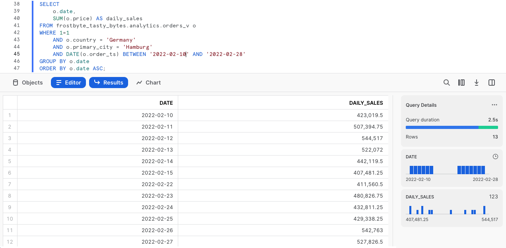
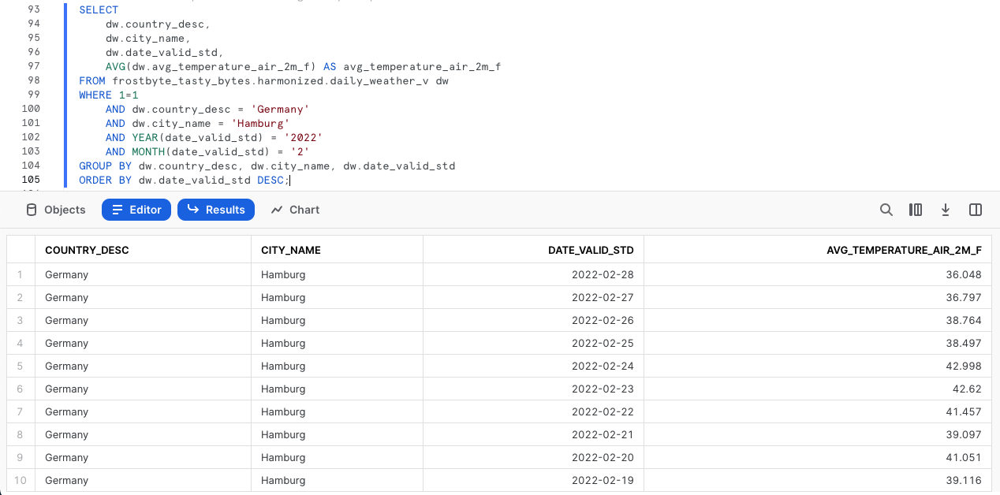
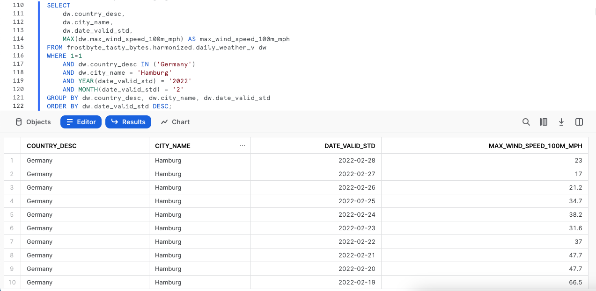
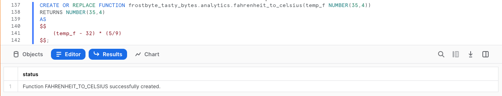
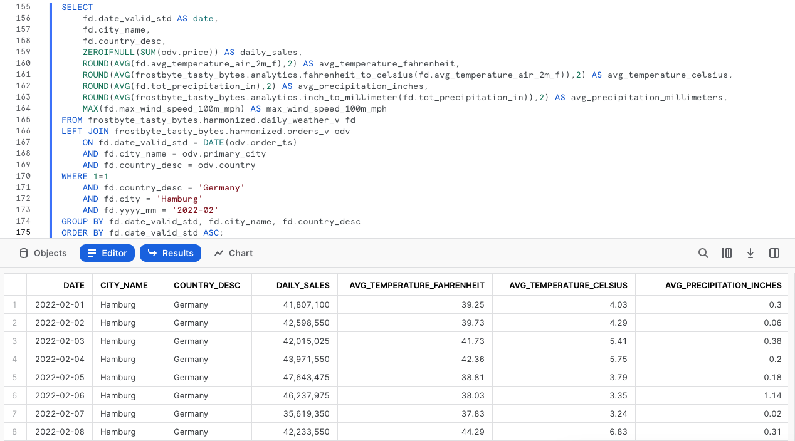

author: Jacob Kranzler
id: tasty_bytes_zero_to_snowflake_collaboration_fr
summary: Tasty Bytes – Débuter avec Snowflake – Collaboration
categories: Tasty-Bytes, Getting-Started, Featured
environments: web
status: Published
feedback link: https://github.com/Snowflake-Labs/sfguides/issues
tags: Premiers pas, Débuter avec Snowflake, Getting Started, Tasty Bytes, Zero to Snowflake, fr  

# Tasty Bytes – Débuter avec Snowflake – Collaboration
<!-- ------------------------ -->

## Accéder directement à des données tierces via la Marketplace Snowflake
Duration: 1 

### Présentation
Bienvenue dans ce guide Quickstart Tasty Bytes Débuter avec Snowflake sur la collaboration ! Dans ce guide, nous allons vous montrer comment vous pouvez enrichir vos données internes avec des données météorologiques tierces via la Marketplace Snowflake. La Marketplace Snowflake vous permet de trouver, d’essayer et d’acheter des applications et données tierces, sans avoir à configurer d’ETL, de pipelines de données ou d’intégrations.


### Conditions préalables
- Avant de commencer, assurez-vous de suivre l’intégralité du guide Quickstart [**Présentation de Tasty Bytes**](/guide/tasty_bytes_introduction_fr/index.html), qui explique comment configurer un compte d’essai et déployer les éléments de base de Tasty Bytes requis pour suivre ce guide Quickstart.

### Vous allez apprendre :
- Comment accéder à la Marketplace Snowflake
- Comment acquérir des données Weather Source en direct dans votre compte
- Comment créer une vue
- Comment créer une fonction SQL
- Comment exploiter des graphiques Snowsight pour explorer des informations visuelles

### Vous allez :
- Harmoniser des données de ventes internes et des données météorologiques tierces
- Créer une fonction pour convertir facilement des degrés Fahrenheit en degrés Celsius
- Créer une fonction pour convertir facilement des pouces en millimètres
- Comprendre comment exploiter davantage d’informations via la Marketplace Snowflake

## Créer une feuille de calcul et la copier dans un fichier SQL
Duration: 1

### Présentation
Dans ce guide Quickstart, vous allez suivre une histoire de Tasty Bytes via une feuille de calcul SQL Snowsight. Cette page, qui fait office de guide étape par étape, comprend également des commentaires, des images et des liens vers de la documentation.

Cette section vous explique comment vous connecter à Snowflake, comment créer une nouvelle feuille de calcul et la renommer, mais aussi comment copier le fichier SQL que nous allons utiliser dans ce guide Quickstart depuis GitHub et le coller.

### Étape 1 – Accéder à Snowflake via une URL
- Ouvrez une fenêtre de votre navigateur et saisissez l’URL de votre compte Snowflake. 

### Étape 2 – Se connecter à Snowflake
- Connectez-vous à votre compte Snowflake.
    - 

### Étape 3 – Accéder aux feuilles de calcul
- Cliquez sur l’onglet Worksheets (Feuilles de calcul) dans la barre de navigation de gauche.
    - 

### Étape 4 – Créer une feuille de calcul
- Sous l’onglet Worksheets (Feuilles de calcul), cliquez sur le bouton « + » dans le coin supérieur droit de Snowsight, puis sélectionnez « SQL Worksheet » (Feuille de calcul SQL).
    - 

### Étape 5 – Renommer une feuille de calcul
- Renommez la feuille de calcul en cliquant sur le nom généré automatiquement (horodatage), puis en saisissant « Tasty Bytes – Collaboration ».
    - 

### Étape 6 – Accéder au fichier SQL de ce guide Quickstart dans GitHub
- Cliquez sur le bouton ci-dessous pour être redirigé vers notre fichier SQL Tasty Bytes hébergé sur GitHub.

<button>[tb_zts_collaboration.sql](https://github.com/Snowflake-Labs/sf-samples/blob/main/samples/tasty_bytes/tb_zts_collaboration.sql)</button>

### Étape 7 – Copier le fichier de configuration SQL depuis GitHub
- Dans GitHub, à droite, cliquez sur « Copy raw contents » (Copier le contenu brut). L’ensemble du fichier SQL requis est copié dans votre presse-papiers.
    - 

### Étape 8 – Coller le fichier de configuration SQL depuis GitHub dans une feuille de calcul Snowflake
- Revenez dans Snowsight et dans votre nouvelle feuille de calcul, puis collez (*CMD + V pour Mac ou CTRL + V pour Windows*) ce que vous venez de copier dans GitHub.

### Étape 9 – Cliquer sur Next (Suivant) -->

## Étudier les jours sans vente dans nos données internes
Duration: 1

### Présentation
Après analyse des données de cette année par rapport à celles de l’année dernière, les analystes financiers de Tasty Bytes nous ont fait savoir que certains jours, dans plusieurs villes, leurs camionnettes n’enregistraient aucune vente et qu’ils n’y voyaient aucune explication. Ils nous ont donné l’exemple de la ville de Hambourg, en Allemagne, en février 2022.


### Étape 1 – Interroger les données des points de ventes pour identifier des tendances
Commençons par exécuter trois requêtes pour définir le contexte de notre rôle et de notre entrepôt sur `tasty_data_engineer` et `tasty_de_wh`. Une fois le contexte défini, nous interrogerons notre vue d’analyse `orders_v` pour fournir un jeu de résultats des ventes pour la ville de Hambourg, en Allemagne, en 2022.

``` 
USE ROLE tasty_data_engineer; 
USE WAREHOUSE tasty_de_wh;

SELECT 
    o.date, 
    SUM(o.price) AS daily_sales 
FROM frostbyte_tasty_bytes.analytics.orders_v o 
WHERE 1=1 
    AND o.country = 'Germany' 
    AND o.primary_city = 'Hamburg' 
    AND DATE(o.order_ts) BETWEEN '2022-02-10' AND '2022-02-28' 
GROUP BY o.date 
ORDER BY o.date ASC; 
```



Selon ce que nous observons ci-dessus, nous sommes d’accord avec les analystes pour dire qu’il manque les chiffres des ventes quotidiennes de certains jours du mois de février, ce qui prouve qu’ils ont bien repéré une anomalie. Voyons si nous pouvons en découvrir les raisons dans la section suivante.

### Étape 2 – Cliquer sur Next (Suivant) -->

## Exploiter des données Weather Source depuis la Marketplace Snowflake
Duration: 2

### Présentation
D’après ce que nous avons vu dans la section précédente, il semble qu’il manque les chiffres des ventes du 16 au 21 février pour la ville de Hambourg, en Allemagne. Il n’y a pas grand-chose de plus dans nos données internes que nous pouvons utiliser pour y voir plus clair, mais il doit bien y avoir une explication. 
        
En exploitant la [Marketplace Snowflake](https://www.snowflake.com/fr/data-cloud/marketplace/), nous pouvons immédiatement vérifier les conditions météorologiques extrêmes en consultant l’annonce publique gratuite de Weather Source.

### Étape 1 – Se procurer les données Weather Source LLC: frostbyte sur la Marketplace Snowflake
La Marketplace Snowflake vous permet de trouver, d’essayer et d’acheter les applications et données dont vous avez besoin pour créer des solutions professionnelles innovantes. Dans cette étape, nous allons accéder à l’annonce [Weather Source LLC: frostbyte](https://app.snowflake.com/marketplace/listing/GZSOZ1LLEL/weather-source-llc-weather-source-llc-frostbyte) pour analyser plus en détail le recul de nos ventes à Hambourg.

Depuis votre compte Snowflake, suivez les étapes et la vidéo ci-dessous pour acquérir les données de cette annonce.

- Cliquez sur -> Home (Accueil).
- Cliquez sur -> Marketplace.
- Recherchez -> frostbyte.
- Cliquez sur -> Weather Source LLC: frostbyte.
- Cliquez sur -> Get (Obtenir).
- Renommez la base de données -> FROSTBYTE_WEATHERSOURCE (en lettres majuscules).
- Attribuez l’accès PUBLIC aux rôles supplémentaires.


>aside positive Weather Source est l’un des principaux fournisseurs de données météorologiques et climatiques mondiales. Sa suite de produits OnPoint fournit aux entreprises les données météorologiques et climatiques dont elles ont besoin pour générer rapidement des informations utiles et exploitables pour un large éventail de cas d’usage dans de nombreux secteurs d’activité.
>

### Étape 2 – Harmoniser des données internes et tierces
Une fois la base de données partagée `frostbyte_weathersource` en place, exécutez la requête suivante pour créer une vue `harmonized.daily_weather_v` associant les deux tables Weather Source et notre table sur les pays et les villes dans lesquels opèrent les food trucks de Tasty Bytes.

```
CREATE OR REPLACE VIEW frostbyte_tasty_bytes.harmonized.daily_weather_v
    AS
SELECT 
    hd.*,
    TO_VARCHAR(hd.date_valid_std, 'YYYY-MM') AS yyyy_mm,
    pc.city_name AS city,
    c.country AS country_desc
FROM frostbyte_weathersource.onpoint_id.history_day hd
JOIN frostbyte_weathersource.onpoint_id.postal_codes pc
    ON pc.postal_code = hd.postal_code
    AND pc.country = hd.country
JOIN frostbyte_tasty_bytes.raw_pos.country c
    ON c.iso_country = hd.country
    AND c.city = hd.city_name;
```


Comme nous le voyons dans la définition de la vue ci-dessus, nous associons deux des tables `frostbyte_weathersource` dans le schéma `onpoint_id`, puis nous les harmonisons avec la table `country` de notre base de données `frostbyte_tasty_bytes` et notre schéma `raw_pos`. 

Nous trouvons généralement ce type d’opération dans la couche harmonisée (également appelée zone Silver).

### Étape 3 – Visualiser les températures quotidiennes
Avec la vue `daily_weather_v` de notre schéma harmonisé en place, jetons un œil à la température quotidienne moyenne à Hambourg en février 2022 en exécutant la requête suivante.

Nous allons aussi exploiter les fonctions [AVG](https://docs.snowflake.com/fr/sql-reference/functions/avg), [YEAR](https://docs.snowflake.com/fr/sql-reference/functions/year) et [MONTH](https://docs.snowflake.com/fr/sql-reference/functions/year).

```
SELECT 
    dw.country_desc,
    dw.city_name,
    dw.date_valid_std,
    AVG(dw.avg_temperature_air_2m_f) AS avg_temperature_air_2m_f
FROM frostbyte_tasty_bytes.harmonized.daily_weather_v dw
WHERE 1=1
    AND dw.country_desc = 'Germany'
    AND dw.city_name = 'Hamburg'
    AND YEAR(date_valid_std) = '2022'
    AND MONTH(date_valid_std) = '2'
GROUP BY dw.country_desc, dw.city_name, dw.date_valid_std
ORDER BY dw.date_valid_std DESC;
```



Pour étudier plus en détail les tendances, utilisons des graphiques Snowsight pour créer un graphique linéaire de la température moyenne au fil du temps.


Selon ce que nous avons vu avant, il n’existe aucune raison évidente qui explique les jours sans vente de nos camionnettes. Voyons quelle raison nous pouvons trouver pour expliquer cette situation dans la section suivante.

### Étape 4 – Rassembler les données sur le vent
Comme nous l’avons vu à l’étape précédente, la température quotidienne moyenne ne semble pas être la raison de nos jours sans vente à Hambourg. Heureusement, Weather Source fournit d’autres indicateurs météorologiques sur lesquels nous pouvons également nous pencher. 

Exécutez la requête suivante qui va exploiter notre vue harmonisée pour rassembler des indicateurs relatifs au vent. Cette requête va utiliser la fonction [MAX](https://docs.snowflake.com/fr/sql-reference/functions/min).

```
SELECT 
    dw.country_desc,
    dw.city_name,
    dw.date_valid_std,
    MAX(dw.max_wind_speed_100m_mph) AS max_wind_speed_100m_mph
FROM frostbyte_tasty_bytes.harmonized.daily_weather_v dw
WHERE 1=1
    AND dw.country_desc IN ('Germany')
    AND dw.city_name = 'Hamburg'
    AND YEAR(date_valid_std) = '2022'
    AND MONTH(date_valid_std) = '2'
GROUP BY dw.country_desc, dw.city_name, dw.date_valid_std
ORDER BY dw.date_valid_std DESC;
```



De nouveau, il se peut qu’un graphique Snowsight soit plus efficace pour dégager les tendances de ce type de données. Suivez les flèches figurant sur les captures d’écran ci-dessous pour passer de l’onglet Results (Résultats) à l’onglet Charts (Graphiques).


**Ah !** Les jours où nous n’avons enregistré aucune vente, la ville a connu des vents de force ouragan. Cette information peut expliquer pourquoi nos camionnettes n’ont rien vendu ces jours-là. Toutefois, étant donné que nous avons effectué cette analyse dans la vue harmonisée, mettons ces informations à disposition dans la vue d’analyse afin que nos analystes puissent y accéder eux-mêmes.

### Étape 5 – Cliquer sur Next (Suivant) -->

## Démocratiser des informations extraites de données
Duration: 3

### Présentation
Nous avons déterminé que des vents de force ouragan ont probablement exercé une influence sur les jours sans vente, une tendance dont nos analystes financiers nous ont fait part.

Mettons désormais ce type de recherche à disposition de l’ensemble des membres de notre organisation en déployant une vue d’analyse à laquelle tous les employés de Tasty Bytes pourront accéder.

### Étape 1 – Créer des fonctions SQL
En tant qu’entreprise internationale, commençons par créer deux fonctions SQL pour convertir les degrés Fahrenheit en degrés Celsius et les pouces en millimètres. 

Exécutez les deux requêtes de cette étape l’une après l’autre pour créer nos fonctions `fahrenheit_to_celsius` et `inch_to_millimeter`, qui utilisent la commande [CREATE FUNCTION](https://docs.snowflake.com/fr/sql-reference/sql/create-function).


```
CREATE OR REPLACE FUNCTION frostbyte_tasty_bytes.analytics.fahrenheit_to_celsius(temp_f NUMBER(35,4))
RETURNS NUMBER(35,4)
AS
$$
    (temp_f - 32) * (5/9)
$$;
```



```
CREATE OR REPLACE FUNCTION frostbyte_tasty_bytes.analytics.inch_to_millimeter(inch NUMBER(35,4))
RETURNS NUMBER(35,4)
    AS
$$
    inch * 25.4
$$;
```


>aside positive Lorsque vous créez une UDF, vous spécifiez un gestionnaire dont le code est écrit dans l’un des langages pris en charge. Selon le langage du gestionnaire, vous pouvez soit inclure le code source du gestionnaire en ligne avec l’instruction CREATE FUNCTION, soit faire référence à l’emplacement du gestionnaire à partir de CREATE FUNCTION, où le gestionnaire est précompilé ou le code source est sur une zone de préparation.
>

### Étape 2 – Créer une fonction SQL pour une vue
Avant de déployer notre vue d’analyse, créons la fonction SQL que nous allons utiliser dans celle-ci pour combiner les données relatives aux ventes quotidiennes et les données météorologiques, mais exploitons aussi nos fonctions de conversion SQL. 

Exécutez la requête suivante qui filtre la ville de Hambourg, en Allemagne, et qui exploite des fonctions que nous n’avons pas encore vues, à savoir [ZEROIFNULL](https://docs.snowflake.com/fr/sql-reference/functions/zeroifnull), [ROUND](https://docs.snowflake.com/fr/sql-reference/functions/round) et [DATE](https://docs.snowflake.com/fr/sql-reference/functions/to_date).

```
SELECT 
    fd.date_valid_std AS date,
    fd.city_name,
    fd.country_desc,
    ZEROIFNULL(SUM(odv.price)) AS daily_sales,
    ROUND(AVG(fd.avg_temperature_air_2m_f),2) AS avg_temperature_fahrenheit,
    ROUND(AVG(frostbyte_tasty_bytes.analytics.fahrenheit_to_celsius(fd.avg_temperature_air_2m_f)),2) AS avg_temperature_celsius,
    ROUND(AVG(fd.tot_precipitation_in),2) AS avg_precipitation_inches,
    ROUND(AVG(frostbyte_tasty_bytes.analytics.inch_to_millimeter(fd.tot_precipitation_in)),2) AS avg_precipitation_millimeters,
    MAX(fd.max_wind_speed_100m_mph) AS max_wind_speed_100m_mph
FROM frostbyte_tasty_bytes.harmonized.daily_weather_v fd
LEFT JOIN frostbyte_tasty_bytes.harmonized.orders_v odv
    ON fd.date_valid_std = DATE(odv.order_ts)
    AND fd.city_name = odv.primary_city
    AND fd.country_desc = odv.country
WHERE 1=1
    AND fd.country_desc = 'Germany'
    AND fd.city = 'Hamburg'
    AND fd.yyyy_mm = '2022-02'
GROUP BY fd.date_valid_std, fd.city_name, fd.country_desc
ORDER BY fd.date_valid_std ASC;
```




Les résultats que nous venons de recevoir semblent optimum. Nous pouvons maintenant insérer cette fonction SQL dans une vue lors de la prochaine étape.

### Étape 3 – Déployer une vue d’analyse
À l’aide de la requête précédente, nous allons devoir supprimer les filtres de la clause WHERE, ajouter une fonction [COMMENT](https://docs.snowflake.com/fr/sql-reference/sql/comment) et la promouvoir dans notre schéma `analytics` en tant que vue `daily_city_metrics_v`.

Pour ce faire, exécutez la dernière requête de cette section.

```
CREATE OR REPLACE VIEW frostbyte_tasty_bytes.analytics.daily_city_metrics_v
COMMENT = 'Daily Weather Source Metrics and Orders Data for our Cities'
    AS
SELECT 
    fd.date_valid_std AS date,
    fd.city_name,
    fd.country_desc,
    ZEROIFNULL(SUM(odv.price)) AS daily_sales,
    ROUND(AVG(fd.avg_temperature_air_2m_f),2) AS avg_temperature_fahrenheit,
    ROUND(AVG(frostbyte_tasty_bytes.analytics.fahrenheit_to_celsius(fd.avg_temperature_air_2m_f)),2) AS avg_temperature_celsius,
    ROUND(AVG(fd.tot_precipitation_in),2) AS avg_precipitation_inches,
    ROUND(AVG(frostbyte_tasty_bytes.analytics.inch_to_millimeter(fd.tot_precipitation_in)),2) AS avg_precipitation_millimeters,
    MAX(fd.max_wind_speed_100m_mph) AS max_wind_speed_100m_mph
FROM frostbyte_tasty_bytes.harmonized.daily_weather_v fd
LEFT JOIN frostbyte_tasty_bytes.harmonized.orders_v odv
    ON fd.date_valid_std = DATE(odv.order_ts)
    AND fd.city_name = odv.primary_city
    AND fd.country_desc = odv.country
WHERE 1=1
GROUP BY fd.date_valid_std, fd.city_name, fd.country_desc;
```


Incroyable ! Nous avons désormais démocratisé ce type d’informations pour l’organisation Tasty Bytes. Rassemblons toutes ces informations dans la section suivante pour valider notre travail.

### Étape 4 – Cliquer sur Next (Suivant) -->

## Tirer des informations des données de ventes et météorologiques de la Marketplace
Duration: 1

### Présentation
Les données de ventes et météorologiques étant disponibles pour toutes les villes où nos food trucks opèrent, voyons comment nous avons raccourci le délai d’analyse des analystes financiers.

### Étape 1 – Simplifier l’analyse
Auparavant, nous devions associer manuellement les données des points de vente et celles de Weather Source pour examiner les problèmes de vente de la ville de Hambourg. Toutefois, nous avons simplifié ce processus via notre vue `analytics.daily_city_metrics_v`. 

Exécutez la requête suivante, qui montre à quel point nous avons simplifié cette analyse en faisant d’elle une simple instruction Select depuis une seule et même vue.

```
SELECT 
    dcm.date,
    dcm.city_name,
    dcm.country_desc,
    dcm.daily_sales,
    dcm.avg_temperature_fahrenheit,
    dcm.avg_temperature_celsius,
    dcm.avg_precipitation_inches,
    dcm.avg_precipitation_millimeters,
    dcm.max_wind_speed_100m_mph
FROM frostbyte_tasty_bytes.analytics.daily_city_metrics_v dcm
WHERE 1=1
    AND dcm.country_desc = 'Germany'
    AND dcm.city_name = 'Hamburg'
    AND dcm.date BETWEEN '2022-02-01' AND '2022-02-26'
ORDER BY date DESC;
```


**Oui !** Si ces données avaient été disponibles lors des recherches initiales des analystes financiers, ces derniers n’auraient pas eu besoin de faire appel aux équipes dédiées aux données puisque les informations auraient été à leur disposition. 

Tout au long de ce guide Quickstart, nous avons vu comment notre travail nous permet d’optimiser réellement nos performances commerciales et à quel point il est facile d’utiliser la Marketplace Snowflake pour tirer davantage d’informations grâce aux données.

### Étape 2 – Cliquer sur Next (Suivant) -->

## Conclusion et étapes suivantes
Duration: 1

### Conclusion
Beau travail ! Vous avez terminé le guide Quickstart Tasty Bytes Débuter avec Snowflake sur la collaboration. 

Vous avez : - Accédé à la Marketplace Snowflake - Acquis des données Weather Source en direct dans votre compte - Créé une vue - Créé une fonction SQL - Utilisé des graphiques Snowsight pour étudier des informations visuelles

Si vous voulez recommencer ce guide Quickstart, utilisez les scripts de réinitialisation en bas de votre feuille de calcul associée.

### Prochaines étapes
Pour continuer à découvrir le Data Cloud Snowflake, cliquez sur le lien ci-dessous pour voir tous les autres guides Quickstart Powered by Tasty Bytes à votre disposition.

- ### [Table des matières des guides Quickstart Powered by Tasty Bytes](/guide/tasty_bytes_introduction_fr/index.html#3)
