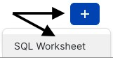
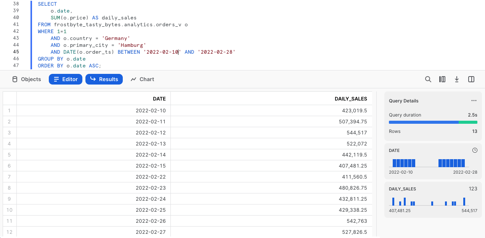
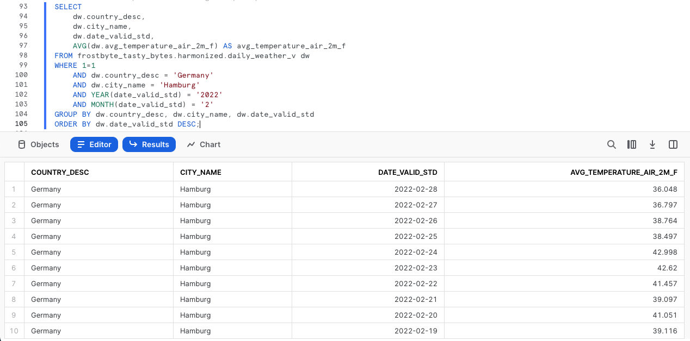
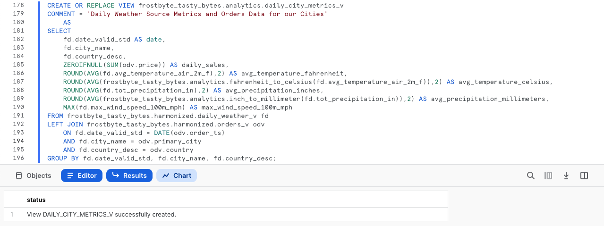

author: Jacob Kranzler
id: tasty_bytes_zero_to_snowflake_collaboration_it
summary: Quickstart Tasty Bytes - Da zero a Snowflake - Collaborazione
categories: Tasty-Bytes, Getting-Started, Featured
environments: web
status: Published
feedback link: https://github.com/Snowflake-Labs/sfguides/issues
tags: Getting Started, Tasty Bytes, Zero to Snowflake, it

# Tasty Bytes - Da zero a Snowflake - Collaborazione
<!-- ------------------------ -->

## Accesso diretto a dati di terze parti tramite il Marketplace Snowflake
Duration: 1 

### Panoramica
Questo quickstart Tasty Bytes - Da zero a Snowflake è dedicato alla collaborazione. In questo quickstart ti mostreremo come puoi arricchire i tuoi dati di prima parte con dati meteorologici utilizzando il Marketplace Snowflake. Il Marketplace Snowflake è il luogo in cui puoi trovare, provare e acquistare app e dati di terze parti, senza bisogno di configurare ETL, pipeline di dati o integrazioni.


### Prerequisiti
- Prima di iniziare, assicurati di avere completato il [**quickstart Introduzione a Tasty Bytes**](/guide/tasty_bytes_introduction_it/index.html), che spiega nei dettagli come configurare un account di prova e implementare l’ambiente base di Tasty Bytes necessario per completare questo quickstart.

### Cosa imparerai
- Come accedere al Marketplace Snowflake
- Come acquisire dati di Weather Source in tempo reale nel tuo account
- Come creare una vista
- Come creare una funzione SQL
- Come utilizzare i grafici Snowsight per esplorare insight visivi

### Cosa realizzerai
- Armonizzazione di dati interni sulle vendite e dati meteorologici di terze parti
- Convertibilità immediata da Fahrenheit a Celsius
- Convertibilità immediata da pollici a millimetri
- Sbloccare ulteriori insight tramite il Marketplace Snowflake

## Creare un foglio di lavoro e copiare il codice SQL
Duration: 1

### Panoramica
In questo quickstart seguiremo la storia del cliente Tasty Bytes attraverso un foglio di lavoro SQL di Snowsight, utilizzando questa pagina come guida completa di commenti aggiuntivi, immagini e link alla documentazione.

In questa sezione vedremo nei dettagli come accedere a Snowflake, creare un nuovo foglio di lavoro, rinominarlo, copiare da GitHub il codice SQL che utilizzeremo in questo quickstart e incollarlo nel foglio di lavoro.

### Passaggio 1 - Accedere a Snowflake tramite URL
- Apri una finestra del browser e inserisci l’URL del tuo account Snowflake 

### Passaggio 2 - Effettuare l’accesso a Snowflake
- Accedi al tuo account Snowflake.
    - 

### Passaggio 3 - Accedere ai fogli di lavoro
- Fai clic sulla scheda Worksheets nella barra di navigazione sulla sinistra.
    - 

### Passaggio 4 - Creare un foglio di lavoro
- Nella scheda Worksheets, fai clic sul pulsante “+” nell’angolo superiore destro di Snowsight e scegli “SQL Worksheet”
    - 

### Passaggio 5 - Rinominare un foglio di lavoro
- Rinomina il foglio di lavoro facendo clic sul nome generato automaticamente (data e ora) e inserendo “Tasty Bytes - Collaboration”
    - 

### Passaggio 6 - Accedere al codice SQL di questo quickstart in GitHub
- Fai clic sul pulsante qui sotto, che ti porterà al file SQL di Tasty Bytes archiviato su GitHub.

<button>[tb_zts_collaboration.sql](https://github.com/Snowflake-Labs/sf-samples/blob/main/samples/tasty_bytes/tb_zts_collaboration.sql)</button>

### Passaggio 7 - Copiare la configurazione SQL da GitHub
- In GitHub, vai sul lato destro e fai clic su “Copy raw contents”. Tutto il codice SQL necessario verrà copiato nei tuoi Appunti.
    - 

### Passaggio 8 - Incollare la configurazione SQL da GitHub nel tuo foglio di lavoro Snowflake
- Torna a Snowsight e al foglio di lavoro che hai appena creato e incolla (*CMD + V per Mac o CTRL + V per Windows*) il codice che abbiamo appena copiato da GitHub.

### Passaggio 9 - Fai clic su Next -->

## Investigare i giorni con zero vendite nei dati interni
Duration: 1

### Panoramica
Gli analisti finanziari di Tasty Bytes ci hanno fatto notare che, eseguendo un’analisi su base annuale, ci sono giorni in cui le vendite dei food truck in varie città scendono inspiegabilmente a 0. Ci hanno fornito un esempio riferito ad Amburgo, in Germania, nel mese di febbraio 2022.


### Passaggio 1 - Interrogare i dati dei punti vendita alla ricerca di tendenze
Per iniziare, eseguiamo le tre query di questo passaggio per impostare il contesto del ruolo e del warehouse su `tasty_data_engineer` e `tasty_de_wh`. Dopo avere impostato il contesto, interrogheremo la vista analitica `orders_v` per fornire un set di risultati relativo alle vendite di Amburgo nel 2022.

``` 
USE ROLE tasty_data_engineer; 
USE WAREHOUSE tasty_de_wh;

SELECT 
    o.date, 
    SUM(o.price) AS daily_sales 
FROM frostbyte_tasty_bytes.analytics.orders_v o 
WHERE 1=1 
    AND o.country = 'Germany' 
    AND o.primary_city = 'Hamburg' 
    AND DATE(o.order_ts) BETWEEN '2022-02-10' 
    AND '2022-02-28' 
GROUP BY o.date 
ORDER BY o.date ASC; 
```



Osservando questa schermata vediamo che effettivamente non sono registrate vendite giornaliere per alcuni giorni di febbraio, proprio come avevano detto i nostri analisti. Nella prossima sezione cercheremo di indagare più a fondo per scoprire il motivo di questa situazione.

### Passaggio 2 - Fai clic su Next -->

## Utilizzare dati di Weather Source dal Marketplace Snowflake
Duration: 2

### Panoramica
Come abbiamo visto nella sezione precedente, sembra che ad Amburgo non siano state effettuate vendite dal 16 al 21 febbraio. I nostri dati di prima parte non contengono molte altre informazioni utili, ma deve esserci stato qualche motivo di più ampia portata. 
        
Un’idea che possiamo immediatamente esplorare utilizzando il [Marketplace Snowflake](https://www.snowflake.com/it/data-cloud/marketplace/) sono le condizioni meteorologiche estreme, con un data product pubblico e gratuito fornito da Weather Source.

### Passaggio 1 - Acquisire Weather Source LLC: frostbyte dal Marketplace Snowflake
Il Marketplace Snowflake è il luogo migliore per trovare, provare e acquistare i dati e le applicazioni che ti servono per le tue soluzioni aziendali innovative. In questo passaggio accederemo al data product [Weather Source LLC: frostbyte](https://app.snowflake.com/marketplace/listing/GZSOZ1LLEL/weather-source-llc-weather-source-llc-frostbyte) per indagare ulteriormente sul calo delle vendite ad Amburgo.

Segui i passaggi e il video qui di seguito per acquisire questo prodotto in catalogo nel tuo account Snowflake.

- Fai clic su -> Home
- Fai clic su -> Marketplace
- Cerca -> frostbyte
- Fai clic su -> Weather Source LLC: frostbyte
- Fai clic su -> Get
- Rinomina il database -> FROSTBYTE_WEATHERSOURCE (tutte maiuscole)
- Consenti l’accesso ad altri ruoli -> PUBLIC


>aside positive
Weather Source è un fornitore leader di dati meteorologici e climatici globali e la sua suite di prodotti OnPoint fornisce alle aziende i dati meteorologici e climatici necessari per generare rapidamente insight pratici e significativi per un’ampia gamma di casi d’uso in tutti i settori.
>

### Passaggio 2 - Armonizzare i dati interni ed esterni
Dopo avere predisposto il database condiviso `frostbyte_weathersource`, esegui la query di questo passaggio per creare una vista `harmonized.daily_weather_v` mettendo in join due tabelle di Weather Source con la nostra tabella “country” in base ai Paesi e alle città in cui operano i food truck di Tasty Bytes.

```
CREATE OR REPLACE VIEW frostbyte_tasty_bytes.harmonized.daily_weather_v
    AS
SELECT 
    hd.*,
    TO_VARCHAR(hd.date_valid_std, 'YYYY-MM') AS yyyy_mm,
    pc.city_name AS city,
    c.country AS country_desc
FROM frostbyte_weathersource.onpoint_id.history_day hd
JOIN frostbyte_weathersource.onpoint_id.postal_codes pc
    ON pc.postal_code = hd.postal_code
    AND pc.country = hd.country
JOIN frostbyte_tasty_bytes.raw_pos.country c
    ON c.iso_country = hd.country
    AND c.city = hd.city_name;
```


Come si vede nella definizione della vista riportata sopra, abbiamo messo in join due delle tabelle di `frostbyte_weathersource` all’interno dello schema `onpoint_id` e poi le abbiamo armonizzate con la tabella `country` proveniente dal database `frostbyte_tasty_bytes` e dallo schema `raw_pos`. 

Questo è il tipo di operazione che viene tipicamente svolto nel layer armonizzato, che altri potrebbero definire “zona Silver”.

### Passaggio 3 - Visualizzare le temperature giornaliere
Una volta creata la vista `daily_weather_v` nel nostro schema armonizzato, diamo un’occhiata alla temperatura media giornaliera di Amburgo a febbraio 2022 eseguendo la prossima query.

Nel fare ciò, utilizzeremo le funzioni [AVG](https://docs.snowflake.com/en/sql-reference/functions/avg), [YEAR](https://docs.snowflake.com/en/sql-reference/functions/year) e [MONTH](https://docs.snowflake.com/en/sql-reference/functions/year).

```
SELECT 
    dw.country_desc,
    dw.city_name,
    dw.date_valid_std,
    AVG(dw.avg_temperature_air_2m_f) AS avg_temperature_air_2m_f
FROM frostbyte_tasty_bytes.harmonized.daily_weather_v dw
WHERE 1=1
    AND dw.country_desc = 'Germany'
    AND dw.city_name = 'Hamburg'
    AND YEAR(date_valid_std) = '2022'
    AND MONTH(date_valid_std) = '2'
GROUP BY dw.country_desc, dw.city_name, dw.date_valid_std
ORDER BY dw.date_valid_std DESC;
```



Per indagare ulteriormente le tendenze, utilizziamo i grafici Snowsight per visualizzare la temperatura media nel tempo in un grafico a linee.


In tutto ciò che abbiamo visto fin qui, non è ancora evidente un motivo per le giornate di vendite zero dei nostri food truck. Nel prossimo passaggio cercheremo di trovare qualcos’altro che possa spiegare la situazione.

### Passaggio 4 - Inserire i dati sul vento
Come abbiamo visto nel passaggio precedente, la temperatura media giornaliera non sembra spiegare le giornate di vendite zero ad Amburgo. Per fortuna Weather Source fornisce anche altre metriche meteorologiche che possiamo esaminare. 

Ora esegui la prossima query, in cui utilizzeremo la nostra vista armonizzata per inserire i dati sul vento. In questa query vedremo l’utilizzo della funzione [MAX](https://docs.snowflake.com/en/sql-reference/functions/min).

```
SELECT 
    dw.country_desc,
    dw.city_name,
    dw.date_valid_std,
    MAX(dw.max_wind_speed_100m_mph) AS max_wind_speed_100m_mph
FROM frostbyte_tasty_bytes.harmonized.daily_weather_v dw
WHERE 1=1
    AND dw.country_desc IN ('Germany')
    AND dw.city_name = 'Hamburg'
    AND YEAR(date_valid_std) = '2022'
    AND MONTH(date_valid_std) = '2'
GROUP BY dw.country_desc, dw.city_name, dw.date_valid_std
ORDER BY dw.date_valid_std DESC;
```


Di nuovo, le tendenze in questo genere di dati potrebbero essere evidenziate meglio creando rapidamente un grafico Snowsight. Segui le frecce nelle schermate illustrate sotto per passare dai risultati ai grafici.


**Ah-ha!** Nei giorni senza vendite, il vento raggiungeva livelli da uragano. Questo sembra spiegare meglio il fatto che i nostri food truck non siano riusciti a vendere nulla in quei giorni. Tuttavia, poiché abbiamo eseguito questa analisi nel layer armonizzato, ora iniziamo il percorso per renderla disponibile nel layer analitico, in cui i nostri analisti potranno accedere autonomamente a questi insight.

### Passaggio 5 - Fai clic su Next -->

## Democratizzare gli insight sui dati
Duration: 3

### Panoramica
A questo punto abbiamo stabilito che il vento a livelli da uragano può probabilmente spiegare le giornate con zero vendite che gli analisti finanziari ci hanno fatto notare.

Ora mettiamo questo tipo di ricerca a disposizione di tutta la nostra organizzazione distribuendo una vista analitica a cui possono accedere tutti i dipendenti di Tasty Bytes.

### Passaggio 1 - Creare funzioni SQL
Poiché siamo un’azienda globale, iniziamo il processo creando prima di tutto due funzioni SQL per convertire Fahrenheit in Celsius e pollici in millimetri. 

Esegui le due query di questo passaggio una alla volta per creare le funzioni `fahrenheit_to_celsius` e `inch_to_millimeter`, che utilizzano il comando [CREATE FUNCTION](https://docs.snowflake.com/en/sql-reference/sql/create-function).


```
CREATE OR REPLACE FUNCTION frostbyte_tasty_bytes.analytics.fahrenheit_to_celsius(temp_f NUMBER(35,4))
RETURNS NUMBER(35,4)
AS
$$
    (temp_f - 32) * (5/9)
$$;
```


```
CREATE OR REPLACE FUNCTION frostbyte_tasty_bytes.analytics.inch_to_millimeter(inch NUMBER(35,4))
RETURNS NUMBER(35,4)
    AS
$$
    inch * 25.4
$$;
```


>aside positive
quando si crea una UDF, si specifica un gestore il cui codice è scritto in uno dei linguaggi supportati. A seconda del linguaggio del gestore, puoi includerne il codice sorgente in linea con l’istruzione CREATE FUNCTION o fare riferimento alla sua posizione da CREATE FUNCTION, in cui il gestore è precompilato o codice sorgente in uno stage.
>

### Passaggio 2 - Creare il codice SQL per la vista
Prima di distribuire la nostra vista analitica, creiamo il codice SQL che utilizzeremo nella vista per combinare insieme le vendite giornaliere e i dati meteorologici, sfruttando anche le funzioni di conversione SQL. 

Esegui la prossima query, in cui filtriamo per Amburgo, Germania e utilizziamo alcune funzioni che non abbiamo ancora visto, ossia [ZEROIFNULL](https://docs.snowflake.com/en/sql-reference/functions/zeroifnull), [ROUND](https://docs.snowflake.com/en/sql-reference/functions/round) e [DATE](https://docs.snowflake.com/en/sql-reference/functions/to_date).

```
SELECT 
    fd.date_valid_std AS date,
    fd.city_name,
    fd.country_desc,
    ZEROIFNULL(SUM(odv.price)) AS daily_sales,
    ROUND(AVG(fd.avg_temperature_air_2m_f),2) AS avg_temperature_fahrenheit,
    ROUND(AVG(frostbyte_tasty_bytes.analytics.fahrenheit_to_celsius(fd.avg_temperature_air_2m_f)),2) AS avg_temperature_celsius,
    ROUND(AVG(fd.tot_precipitation_in),2) AS avg_precipitation_inches,
    ROUND(AVG(frostbyte_tasty_bytes.analytics.inch_to_millimeter(fd.tot_precipitation_in)),2) AS avg_precipitation_millimeters,
    MAX(fd.max_wind_speed_100m_mph) AS max_wind_speed_100m_mph
FROM frostbyte_tasty_bytes.harmonized.daily_weather_v fd
LEFT JOIN frostbyte_tasty_bytes.harmonized.orders_v odv
    ON fd.date_valid_std = DATE(odv.order_ts)
    AND fd.city_name = odv.primary_city
    AND fd.country_desc = odv.country
WHERE 1=1
    AND fd.country_desc = 'Germany'
    AND fd.city = 'Hamburg'
    AND fd.yyyy_mm = '2022-02'
GROUP BY fd.date_valid_std, fd.city_name, fd.country_desc
ORDER BY fd.date_valid_std ASC;
```


I risultati che abbiamo ricevuto sembrano ottimi. Nel prossimo passaggio, possiamo incapsulare questo codice SQL in una vista.

### Passaggio 3 - Distribuire la vista analitica
Utilizzando la stessa query che abbiamo appena esplorato, dobbiamo rimuovere i filtri nella clausola WHERE, aggiungere un [COMMENT](https://docs.snowflake.com/en/sql-reference/sql/comment) e promuoverla nel nostro schema `analytics` come vista `daily_city_metrics_v`.

Per farlo, esegui l’ultima query di questa sezione.

```
CREATE OR REPLACE VIEW frostbyte_tasty_bytes.analytics.daily_city_metrics_v
COMMENT = 'Daily Weather Source Metrics and Orders Data for our Cities'
    AS
SELECT 
    fd.date_valid_std AS date,
    fd.city_name,
    fd.country_desc,
    ZEROIFNULL(SUM(odv.price)) AS daily_sales,
    ROUND(AVG(fd.avg_temperature_air_2m_f),2) AS avg_temperature_fahrenheit,
    ROUND(AVG(frostbyte_tasty_bytes.analytics.fahrenheit_to_celsius(fd.avg_temperature_air_2m_f)),2) AS avg_temperature_celsius,
    ROUND(AVG(fd.tot_precipitation_in),2) AS avg_precipitation_inches,
    ROUND(AVG(frostbyte_tasty_bytes.analytics.inch_to_millimeter(fd.tot_precipitation_in)),2) AS avg_precipitation_millimeters,
    MAX(fd.max_wind_speed_100m_mph) AS max_wind_speed_100m_mph
FROM frostbyte_tasty_bytes.harmonized.daily_weather_v fd
LEFT JOIN frostbyte_tasty_bytes.harmonized.orders_v odv
    ON fd.date_valid_std = DATE(odv.order_ts)
    AND fd.city_name = odv.primary_city
    AND fd.country_desc = odv.country
WHERE 1=1
GROUP BY fd.date_valid_std, fd.city_name, fd.country_desc;
```



Fantastico! Ora abbiamo democratizzato questo tipo di insight per l’organizzazione Tasty Bytes. Nella prossima sezione metteremo insieme e verificheremo tutto ciò che abbiamo fatto finora.

### Passaggio 4 - Fai clic su Next -->

## Ricavare insight dai dati sulle vendite e dai dati meteorologici del Marketplace
Duration: 1

### Panoramica
Con i dati meteorologici e sulle vendite disponibili per tutte le città in cui operano i nostri food truck, vediamo ora come abbiamo abbreviato il time-to-insight per i nostri analisti finanziari.

### Passaggio 1 - Semplificare l’analisi
Prima abbiamo dovuto fare il join manuale dei dati dei punti vendita e di Weather Source per investigare sulle vendite di Amburgo, ma ora abbiamo un processo molto più semplice grazie alla vista `analytics.daily_city_metrics_v`. 

Esegui la prossima query, che mostra quanto abbiamo semplificato questa analisi trasformandola in una semplice istruzione Select da un’unica vista.

```
SELECT 
    dcm.date,
    dcm.city_name,
    dcm.country_desc,
    dcm.daily_sales,
    dcm.avg_temperature_fahrenheit,
    dcm.avg_temperature_celsius,
    dcm.avg_precipitation_inches,
    dcm.avg_precipitation_millimeters,
    dcm.max_wind_speed_100m_mph
FROM frostbyte_tasty_bytes.analytics.daily_city_metrics_v dcm
WHERE 1=1
    AND dcm.country_desc = 'Germany'
    AND dcm.city_name = 'Hamburg'
    AND dcm.date BETWEEN '2022-02-01' AND '2022-02-26'
ORDER BY date DESC;
```


**Fantastico!** Se questo codice fosse stato disponibile quando gli analisti finanziari stavano svolgendo la loro ricerca originale, non avrebbero avuto bisogno di rivolgersi ai nostri esperti di dati, perché gli insight sono subito a portata di mano. 

Completando questo quickstart abbiamo visto la rapidità con cui il nostro lavoro può produrre valore aziendale in situazioni reali e la facilità con cui possiamo utilizzare il Marketplace Snowflake per sbloccare ulteriori insight basati sui dati.

### Passaggio 2 - Fai clic su Next -->

## Conclusione e fasi successive
Duration: 1

### Conclusione
Ottimo lavoro! Hai completato il quickstart Tasty Bytes - Da zero a Snowflake - Collaborazione. 

In questo quickstart hai:
- Effettuato l’accesso al Marketplace Snowflake
- Acquisito i dati di Live Weather Source nel tuo account
- Creato una vista
- Creato una funzione SQL
- Utilizzato i grafici Snowsight per esplorare insight visivi

Se desideri ripetere questo quickstart, usa gli script di ripristino alla fine del foglio di lavoro associato.

### Fasi successive
Per continuare il tuo percorso nel Data Cloud di Snowflake, visita il link qui sotto per vedere tutti gli altri quickstart Powered by Tasty Bytes disponibili.

- ### [Quickstart Powered by Tasty Bytes - Sommario](/guide/tasty_bytes_introduction_it/index.html#3)


