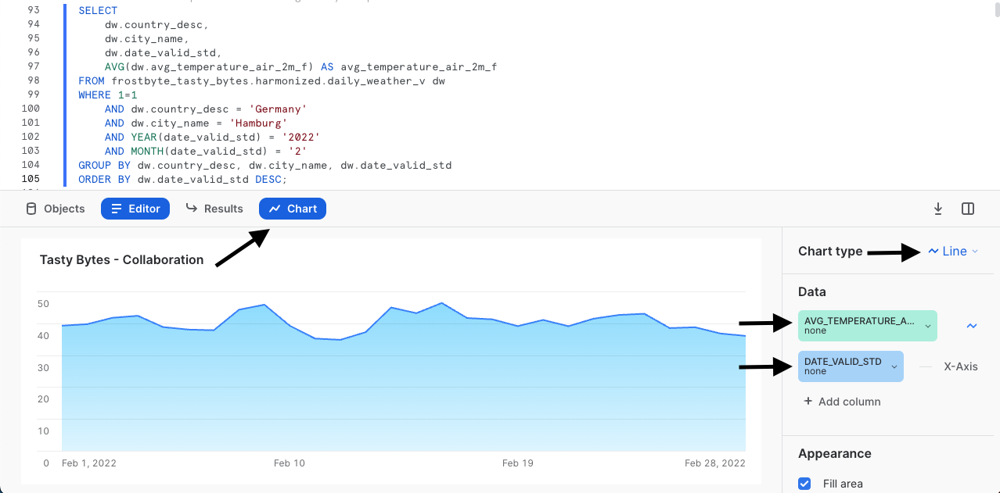
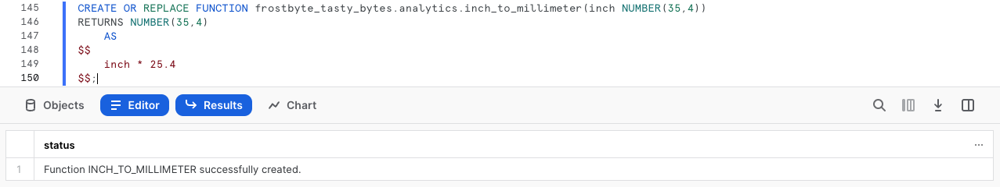
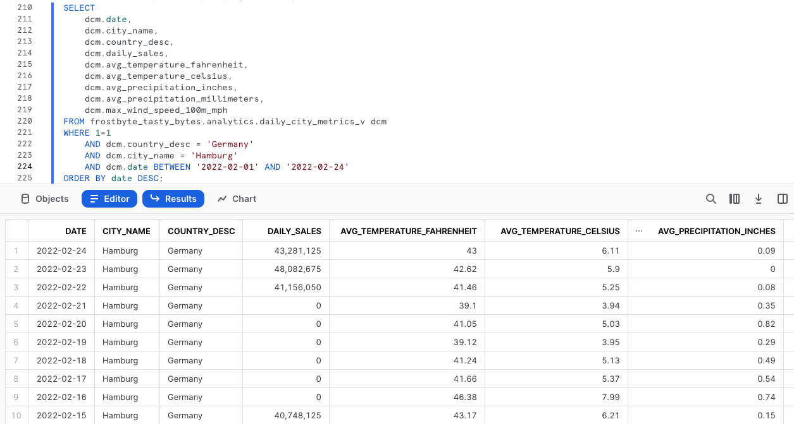

author: Jacob Kranzler
id: tasty_bytes_zero_to_snowflake_collaboration_ja
summary: Tasty Bytes - ゼロからのSnowflake - コラボレーションクイックスタート
categories: Tasty-Bytes, Getting-Started, Featured
environments: web
status: Published
feedback link: https://github.com/Snowflake-Labs/sfguides/issues
tags: Getting Started, Tasty Bytes, Zero to Snowflake, ja


# Tasty Bytes - ゼロからのSnowflake - コラボレーション
<!-- ------------------------ -->

## Snowflakeマーケットプレイスを使用したサードパーティデータへの直接アクセス
Duration: 1


### 概要
Tasty Bytes - ゼロからのSnowflakeクイックスタートへようこそ。今回はコラボレーションを中心的に取り上げます。このクイックスタートでは、Snowflakeマーケットプライスにある気象データで皆さんのファーストパーティデータをエンリッチする方法をご紹介します。Snowflakeマーケットプレイスでは、サードパーティデータおよびアプリを検索し、試し、購入することができます。このとき、ETL、データパイプライン、統合を設定する必要はありません。


### 前提条件
- 開始する前に、本クイックスタートを完了するために必要なトライアルアカウントのセットアップとTasty Bytes基盤の展開について説明している[**Tasty Bytesの紹介クイックスタート**](https://quickstarts.snowflake.com/guide/tasty_bytes_introduction/index.html)を完了しておくようにしてください。

### 学習する内容
- Snowflakeマーケットプレイスへのアクセス方法
- 自分のアカウントでWeather Sourceのリアルタイムデータを取得する方法
- ビューの作成方法
- SQL関数の作成方法
- Snowsightチャートを活用して視覚的インサイトを探る方法

### 構築するもの
- ファーストパーティの売上データとサードパーティの気象データの整合
- 華氏から摂氏へのシームレスな変換性
- インチからミリメートルへのシームレスな変換性
- Snowflakeマーケットプレイスで追加のインサイトを引き出す方法の理解

## ワークシートの作成とSQLのコピー
Duration: 1

### 概要
このクイックスタートでは、Snowsight SQLワークシートを使ってTasty Bytesをテーマとしたストーリーを追っていきます。このページには、横に置いて活用できるよう、追加の解説、画像、ドキュメントリンクが掲載されています。

本セクションでは、Snowflakeへのログイン、新しいワークシートの作成、ワークシートの名前の変更、GitHubからのSQLのコピー、このクイックスタートで利用するSQLの貼り付けについて説明します。

### ステップ1 - URLでSnowflakeにアクセスする
- ブラウザウィンドウを開き、SnowflakeアカウントのURLを入力します

### ステップ2 - Snowflakeにログインする
- Snowflakeアカウントにログインします。
  - 

### ステップ3 - ワークシートに移動する
- 左側のナビゲーションバーにある「ワークシート」タブをクリックします。
  - 

### ステップ4 - ワークシートを作成する
- ワークシート内で、Snowsightの右上にある「+」ボタンをクリックし、「SQLワークシート」を選択します。
  - 

### ステップ5 - ワークシートの名前を変更する
- 自動生成されたタイムスタンプ名をクリックし、「Tasty Bytes - コラボレーション」と入力してワークシートの名前を変更します。
  - 

### ステップ6 - GitHubでQuickstart SQLにアクセスする
- 下のボタンをクリックすると、GitHubでホストされているTasty BytesのSQLファイルに移動します。

<button>[tb_zts_collaboration.sql](https://github.com/Snowflake-Labs/sf-samples/blob/main/samples/tasty_bytes/tb_zts_collaboration.sql)</button>

### ステップ7 - GitHubからSetup SQLをコピーする
- GitHub内で右側に移動し、「未加工コンテンツをコピー」をクリックします。これで、必要なSQLがすべてクリップボードにコピーされます。
  - 

### ステップ8 - GitHubからSnowflakeワークシートにSetup SQLを貼り付ける
- Snowsightと新しく作成したワークシートに戻り、先ほどGitHubからコピーしたものを貼り付けます（*Macの場合はCMD + V、Windowsの場合はCTRL + V*）。

### ステップ9 - 「Next」をクリックする

## ファーストパーティデータにおける売上ゼロ日の調査
Duration: 1

### 概要
Tasty Bytesの財務アナリストは、前年比分析を行う中で、さまざまな都市でキッチンカーの売上がゼロとなっている説明のつかない日があることを指摘しました。その一例として挙げられたのが2022年2月のドイツ、ハンブルグのケースです。


### ステップ1 - 販売時点データのトレンドをクエリする
では早速始めましょう。このステップでは、3つのクエリを実行してロールとウェアハウスのコンテキストを`tasty_data_engineer`と`tasty_de_wh`に設定します。コンテキストを設定した状態で、分析`orders_v`ビューをクエリし、2022年のドイツ、ハンブルグの売上の結果セットを提供します。

```
USE ROLE tasty_data_engineer;
USE WAREHOUSE tasty_de_wh;

SELECT 
    o.date,
    SUM(o.price) AS daily_sales
FROM frostbyte_tasty_bytes.analytics.orders_v o
WHERE 1=1
    AND o.country = 'Germany'
    AND o.primary_city = 'Hamburg'
    AND DATE(o.order_ts) BETWEEN '2022-02-10' AND '2022-02-28'
GROUP BY o.date
ORDER BY o.date ASC;
```


上記のデータに基づくと、2月の数日間、日次売上記録がないというアナリストの指摘は、間違いなく正しいものであるということが分かります。なぜこのようなことが起こったのか、次のセクションでさらに掘り下げてみましょう。

### ステップ2 - 「Next」をクリックする

## SnowflakeマーケットプレイスのWeather Sourceデータの活用
Duration: 2

### 概要
前のセクションで見た内容から、ハンブルグでは2月16日から2月21日までの売上がないように見えます。  ファーストパーティデータの中には、これを調査するために利用できるものは他にあまりありませんが、何か大きなことがここで起こっていたはずです。

[Snowflakeマーケットプレイス](https://www.snowflake.com/en/data-cloud/marketplace/)を活用してすぐに調査できるアイデアの1つは、異常気象と、Weather Sourceが提供している無料の公開リストです。

### ステップ1 - Weather Source LLC: frostbyte Snowflakeマーケットプレイスのリスティングを取得する
Snowflakeマーケットプレイスは、革新的なビジネスソリューションを推進するために必要なデータやアプリケーションを検索、試用、購入できるすばらしい場所です。このステップでは、[Weather Source LLC: frostbyte](https://app.snowflake.com/marketplace/listing/GZSOZ1LLEL/weather-source-llc-weather-source-llc-frostbyte)リスティングにアクセスし、ハンブルグの売上不振に関する追加の分析に役立てていきます。

以下の手順とビデオに従って、Snowflakeアカウントからこのリストを取得してください。

- 「ホーム」をクリック
- マーケットプレイスをクリック
- frostbyteを検索
- 「Weather Source LLC: frostbyte」をクリック
- 「Get（取得）」をクリック
- データベースの名称をFROSTBYTE_WEATHERSOURCE（すべて大文字）に変更
- 追加ロールへの付与 -> 「PUBLIC（公開）」


>aside positive
> Weather Sourceは、世界の気象および気候データを提供するリーディングプロバイダーであり、同社のOnPoint Product Suiteは、企業がさまざまな業界の広範なユースケースに適用できる有意義で実用的なインサイトを迅速に生成するために必要な気象および気候データを提供しています。
>

### ステップ2 - ファーストパーティデータとサードパーティデータをハーモナイズする
共有の`frostbyte_weathersource`データベースが配置された状態で、このステップのクエリを実行し、2つのWeather Sourceテーブルを、Tasty Bytesのキッチンカーが営業している国と都市に関する国テーブルに結合する`harmonized.daily_weather_v`ビューを作成してください。

```
CREATE OR REPLACE VIEW frostbyte_tasty_bytes.harmonized.daily_weather_v
    AS
SELECT 
    hd.*,
    TO_VARCHAR(hd.date_valid_std, 'YYYY-MM') AS yyyy_mm,
    pc.city_name AS city,
    c.country AS country_desc
FROM frostbyte_weathersource.onpoint_id.history_day hd
JOIN frostbyte_weathersource.onpoint_id.postal_codes pc
    ON pc.postal_code = hd.postal_code
    AND pc.country = hd.country
JOIN frostbyte_tasty_bytes.raw_pos.country c
    ON c.iso_country = hd.country
    AND c.city = hd.city_name;
```


上のビューの定義にもあるように、私たちは`onpoint_id`スキーマ内の2つの`frostbyte_weathersource`テーブルを結合し、`frostbyte_tasty_bytes`データベースと`raw_pos`スキーマの`country`テーブルと整合させようとしています。

このような操作は、一般的に整合レイヤー、あるいはシルバーゾーンと呼ばれるレイヤーで行われます。

### ステップ3 - 毎日の気温を可視化する
整合スキーマの`daily_weather_v`ビューが得られたところで、次のクエリを実行して、2022年2月のハンブルグの毎日の平均気温を見てみましょう。

ここでは、[AVG](https://docs.snowflake.com/en/sql-reference/functions/avg)、[YEAR](https://docs.snowflake.com/en/sql-reference/functions/year)、[MONTH](https://docs.snowflake.com/en/sql-reference/functions/year)という関数を利用します。

```
SELECT 
    dw.country_desc,
    dw.city_name,
    dw.date_valid_std,
    AVG(dw.avg_temperature_air_2m_f) AS avg_temperature_air_2m_f
FROM frostbyte_tasty_bytes.harmonized.daily_weather_v dw
WHERE 1=1
    AND dw.country_desc = 'Germany'
    AND dw.city_name = 'Hamburg'
    AND YEAR(date_valid_std) = '2022'
    AND MONTH(date_valid_std) = '2'
GROUP BY dw.country_desc, dw.city_name, dw.date_valid_std
ORDER BY dw.date_valid_std DESC;
```


傾向をさらに詳しく調査するために、Snowsight Chartingを使って平均気温の経時的変化を折れ線グラフにしてみましょう。



これまでの内容から、私たちのキッチンカーで売上ゼロの日がある明らかな理由として際立っているものはまだありません。次のステップでは、他に説明のつきそうなものがまだあるか見てみることにしましょう。

### ステップ4 - 風データを取り込む
前のステップで見たように、1日の平均気温はハンブルグでの売上ゼロの日の原因ではないようです、ありがたいことに、Weather Sourceは私たちが詳しく調査できるその他の気象メトリックも提供しています。

次のクエリを実行し、整合ビューを活用して風のメトリックを取り込んでください。このクエリでは、[MAX](https://docs.snowflake.com/en/sql-reference/functions/min)関数を使用していきます。

```
SELECT 
    dw.country_desc,
    dw.city_name,
    dw.date_valid_std,
    MAX(dw.max_wind_speed_100m_mph) AS max_wind_speed_100m_mph
FROM frostbyte_tasty_bytes.harmonized.daily_weather_v dw
WHERE 1=1
    AND dw.country_desc IN ('Germany')
    AND dw.city_name = 'Hamburg'
    AND YEAR(date_valid_std) = '2022'
    AND MONTH(date_valid_std) = '2'
GROUP BY dw.country_desc, dw.city_name, dw.date_valid_std
ORDER BY dw.date_valid_std DESC;
```


このようなデータも、簡易的なSnowsightチャートで表示した方が傾向が分かりやすいかもしれません。以下のスクリーンショットの矢印に従って、結果からチャートへ移動してください。


**なんと！** 売上ゼロの日の風はハリケーン並みでした。キッチンカーのその日の売上がゼロだったのは、これがもっともらしい理由のようです。しかし、この分析は整合ビューで実行したものであるため、この先は、アナリスト自身がこれらのインサイトにアクセスできるよう、分析ビューでアクセスできるようにしていくことにしましょう。

### ステップ5 - 「Next」をクリックする

## データインサイトの民主化
Duration: 3

### 概要
私たちは、財務アナリストが指摘した売上ゼロの日について、おそらくハリケーン級の強風が原因になっているだろうと判断することができました。

次は、Tasty Bytesの全従業員がアクセスできる分析ビューを展開することにより、このような調査を組織内の誰でも利用できるようにしていきましょう。

### ステップ1：SQL関数を作成する
グローバル企業として、まずは華氏を摂氏に、インチをミリメートルに変換する2つのSQL関数を作成することから始めましょう。

このステップでは2つのクエリを1つずつ実行し、`fahrenheit_to_celsius`関数と`inch_to_millimeter`関数を作成してください。ここでは[CREATE FUNCTION](https://docs.snowflake.com/en/sql-reference/sql/create-function)コマンドを利用します。


```
CREATE OR REPLACE FUNCTION frostbyte_tasty_bytes.analytics.fahrenheit_to_celsius(temp_f NUMBER(35,4))
RETURNS NUMBER(35,4)
AS
$$
    (temp_f - 32) * (5/9)
$$;
```


```
CREATE OR REPLACE FUNCTION frostbyte_tasty_bytes.analytics.inch_to_millimeter(inch NUMBER(35,4))
RETURNS NUMBER(35,4)
    AS
$$
    inch * 25.4
$$;
```



>aside positive
> UDFの作成時には、サポートされている言語のいずれかでコードが記述されたハンドラーを指定します。ハンドラーの言語に応じて、ハンドラーのソースコードをCREATE FUNCTION文にインラインで含めるか、ハンドラーがプリコンパイルされている、あるいはステージにソースコードがあるCREATE FUNCTIONからハンドラーのロケーションを参照します。
>

### ステップ2 - ビュー用のSQLを作成する
分析ビューを展開する前に、ビューで使用するSQLを作成して日次売上と気象を組み合わせ、さらに、SQL変換関数も活用しましょう。

次のクエリを実行し、ドイツのハンブルグをフィルタリングしてください。まだ登場していない[ZEROIFNULL](https://docs.snowflake.com/en/sql-reference/functions/zeroifnull)、[ROUND](https://docs.snowflake.com/en/sql-reference/functions/round)、[DATE](https://docs.snowflake.com/en/sql-reference/functions/to_date)といった関数も活用してください。

```
SELECT 
    fd.date_valid_std AS date,
    fd.city_name,
    fd.country_desc,
    ZEROIFNULL(SUM(odv.price)) AS daily_sales,
    ROUND(AVG(fd.avg_temperature_air_2m_f),2) AS avg_temperature_fahrenheit,
    ROUND(AVG(frostbyte_tasty_bytes.analytics.fahrenheit_to_celsius(fd.avg_temperature_air_2m_f)),2) AS avg_temperature_celsius,
    ROUND(AVG(fd.tot_precipitation_in),2) AS avg_precipitation_inches,
    ROUND(AVG(frostbyte_tasty_bytes.analytics.inch_to_millimeter(fd.tot_precipitation_in)),2) AS avg_precipitation_millimeters,
    MAX(fd.max_wind_speed_100m_mph) AS max_wind_speed_100m_mph
FROM frostbyte_tasty_bytes.harmonized.daily_weather_v fd
LEFT JOIN frostbyte_tasty_bytes.harmonized.orders_v odv
    ON fd.date_valid_std = DATE(odv.order_ts)
    AND fd.city_name = odv.primary_city
    AND fd.country_desc = odv.country
WHERE 1=1
    AND fd.country_desc = 'Germany'
    AND fd.city = 'Hamburg'
    AND fd.yyyy_mm = '2022-02'
GROUP BY fd.date_valid_std, fd.city_name, fd.country_desc
ORDER BY fd.date_valid_std ASC;
```


ここではすばらしい結果が得られました。これで、次のステップでこのSQLをビュー内でまとめることができるようになります。

### ステップ3 - 分析ビューを展開する
先ほど考察したものと同じクエリを使用します。WHERE句のフィルターを削除し、[COMMENT](https://docs.snowflake.com/en/sql-reference/sql/comment)を追加して、これを`daily_city_metrics_v`ビューとして`analytics`スキーマに昇格させる必要があります。

これを行うために、ここでこのセクションの最後のクエリを実行してください。

```
CREATE OR REPLACE VIEW frostbyte_tasty_bytes.analytics.daily_city_metrics_v
COMMENT = 'Daily Weather Source Metrics and Orders Data for our Cities'
    AS
SELECT 
    fd.date_valid_std AS date,
    fd.city_name,
    fd.country_desc,
    ZEROIFNULL(SUM(odv.price)) AS daily_sales,
    ROUND(AVG(fd.avg_temperature_air_2m_f),2) AS avg_temperature_fahrenheit,
    ROUND(AVG(frostbyte_tasty_bytes.analytics.fahrenheit_to_celsius(fd.avg_temperature_air_2m_f)),2) AS avg_temperature_celsius,
    ROUND(AVG(fd.tot_precipitation_in),2) AS avg_precipitation_inches,
    ROUND(AVG(frostbyte_tasty_bytes.analytics.inch_to_millimeter(fd.tot_precipitation_in)),2) AS avg_precipitation_millimeters,
    MAX(fd.max_wind_speed_100m_mph) AS max_wind_speed_100m_mph
FROM frostbyte_tasty_bytes.harmonized.daily_weather_v fd
LEFT JOIN frostbyte_tasty_bytes.harmonized.orders_v odv
    ON fd.date_valid_std = DATE(odv.order_ts)
    AND fd.city_name = odv.primary_city
    AND fd.country_desc = odv.country
WHERE 1=1
GROUP BY fd.date_valid_std, fd.city_name, fd.country_desc;
```


これで、この種のインサイトをTasty Bytesの組織に対して民主化することができました。次のセクションではこれらをすべてまとめ、私たちの作業を検証してみましょう。

### ステップ4 - 「Next」をクリックする

## 売上とマーケットプレイスの気象データからのインサイトの抽出
Duration: 1

### 概要
キッチンカーが営業している全都市の売上と気象データを利用できるようになったところで、次は、私たちが財務アナリストのインサイトを得るまでの時間を短縮した方法に目を向けてみましょう。

### ステップ1 - 分析を簡素化する
以前は、ハンブルグでの売上に関する問題を調査するために、POSとWeather Sourceのデータを手動で結合する必要がありましたが、`analytics.daily_city_metrics_v`ビューを使用することでこのプロセスが大幅に簡素化されました。

クエリを開始し、単一のビューからシンプルなSELECT構文を作成することにより、この分析がどれだけ簡単になったかを確認してください。

```
SELECT 
    dcm.date,
    dcm.city_name,
    dcm.country_desc,
    dcm.daily_sales,
    dcm.avg_temperature_fahrenheit,
    dcm.avg_temperature_celsius,
    dcm.avg_precipitation_inches,
    dcm.avg_precipitation_millimeters,
    dcm.max_wind_speed_100m_mph
FROM frostbyte_tasty_bytes.analytics.daily_city_metrics_v dcm
WHERE 1=1
    AND dcm.country_desc = 'Germany'
    AND dcm.city_name = 'Hamburg'
    AND dcm.date BETWEEN '2022-02-01' AND '2022-02-26'
ORDER BY date DESC;
```



**できました！** もし、財務アナリストが最初に調査に乗り出したときにこれが利用できていれば、データチームに問い合わせるまでもなく、すぐにインサイトを得ることができたでしょう。

このクイックスタートを完了することにより、私たちの作業によって実世界のビジネス価値をいかに早く引き出すことができるか、また、Snowflakeマーケットプレイスを使用することで、追加のデータインサイトをいかに簡単に活用できるようになるかが分かりました。

### ステップ2 - 「Next」をクリックする

## まとめと次のステップ
Duration: 1

### まとめ
すばらしい出来です！これで、Tasty Bytes - ゼロからのSnowflake - コラボレーションクイックスタートが無事完了しました。

これにより、次のことができるようになりました。
- Snowflakeマーケットプレイスにアクセスする
- 自分のアカウントでWeather Sourceのリアルタイムデータを取得する
- ビューを作成する
- SQL関数を作成する
- Snowsightチャートを活用して視覚的インサイトを探る

このクイックスタートを再実行したい場合は、関連するワークシートの下部にあるリセットスクリプトを利用してください。

### 次のステップ
引き続きSnowflakeデータクラウドについて学習するには、以下のリンクから利用可能なその他すべてのPowered by Taste Bytes - クイックスタートをご覧ください。

- ### [Powered by Tasty Bytes - クイックスタート目次](https://quickstarts.snowflake.com/guide/tasty_bytes_introduction/index.html#3)