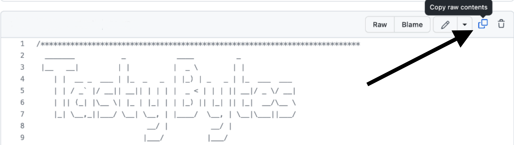

author: Jacob Kranzler
id: tasty_bytes_zero_to_snowflake_data_governance
summary: Tasty Bytes - Zero to Snowflake - Data Governance Quickstart
categories: Tasty-Bytes, Getting-Started, Featured
environments: web
status: Published 
feedback link: https://github.com/Snowflake-Labs/sfguides/issues
tags: Getting Started, Tasty Bytes, Zero to Snowflake, Data Governance


# Tasty Bytes - Zero to Snowflake - Data Governance
<!-- ------------------------ -->

## Data Governance in Snowflake 
Duration: 1


### Overview
Welcome to the Powered by Tasty Bytes - Zero to Snowflake Quickstart focused on Data Governance! 

Within this Quickstart we will learn about Snowflake Roles, Role Based Access Control and deploy both Column and Row Level Security that can scale with your business.

### Prerequisites
- Before beginning, please make sure you have completed the [**Introduction to Tasty Bytes Quickstart**](https://quickstarts.snowflake.com/guide/tasty_bytes_introduction/index.html) which provides a walkthrough on setting up a trial account and deploying the Tasty Bytes Foundation required to complete this Quickstart.

### What You Will Learn
- What System Defined Roles Exist in Snowflake Accounts
- How to Create a Role
- How to Grant Privileges to a Role
- How to Create a Tag
- How to Create a Masking Policy
- How to Deploy a Tag Based Masking Policy
- How to a Create Row Access Policiy using a Mapping Table

### What You Will Build
- Complete Role Based Access Control for a Test Role
- A Robust Data Governance Foundation Including Row and Column Security

## Creating a Worksheet and Copying in our SQL
Duration: 1

### Overview
Within this Quickstart we will follow a Tasty Bytes themed story via a Snowsight SQL Worksheet with this page serving as a side by side guide complete with additional commentary, images and documentation links.

This section will walk you through logging into Snowflake, Creating a New Worksheet, Renaming the Worksheet, Copying SQL from GitHub, and Pasting the SQL we will be leveraging within this Quickstart.

### Step 1 - Accessing Snowflake via URL
- Open a browser window and enter the URL of your Snowflake Account 

### Step 2 - Logging into Snowflake
- Log into your Snowflake account.
    - 

### Step 3 - Navigating to Worksheets
- Click on the Worksheets Tab in the left-hand navigation bar.
    - 

### Step 4 - Creating a Worksheet
- Within Worksheets, click the "+" button in the top-right corner of Snowsight and choose "SQL Worksheet"
    - 

### Step 5 - Renaming a Worksheet
- Rename the Worksheet by clicking on the auto-generated Timestamp name and inputting "Tasty Bytes - Data Governance"
    - 

### Step 6 - Accessing Quickstart SQL in GitHub
- Click the button below which will direct you to our Tasty Bytes SQL file that is hosted on GitHub.
<button>[tb_zts_data_governance.sql](https://github.com/Snowflake-Labs/sf-samples/blob/main/samples/tasty_bytes/tb_zts_data_governance.sql)</button>

### Step 7 - Copying Setup SQL from GitHub
- Within GitHub navigate to the right side and click "Copy raw contents". This will copy all of the required SQL into your clipboard.
    - 

### Step 8 - Pasting Setup SQL from GitHub into your Snowflake Worksheet
- Path back to Snowsight and your newly created Worksheet and Paste (*CMD + V for Mac or CTRL + V for Windows*) what we just copied from GitHub.

### Step 9 - Click Next -->

## Exploring Available Roles
Duration: 1

### Overview
Our Tasty Bytes Adminstrator has been tasked with learning the process of deploying Role Based Access Control (RBAC) and proper Data Governance across our Snowflake Account. 

To begin, let's first dive into the Snowflake System Defined Roles provided by default in all accounts and learn a bit more on their privileges.

### Step 1 - Setting our Context
Before we can begin executing queries within the Snowflake Snowsight interface we must first set our context by running [USE ROLE](https://docs.snowflake.com/en/sql-reference/sql/use-role) and [USE WAREHOUSE](https://docs.snowflake.com/en/sql-reference/sql/use-warehouse) commands or manually setting these in the top-right corner.

For this step, we will do this by executing our first two queries by highlighting them both and clicking the "▶ Run" button. 

Once complete our results pane will result in a `Statement Executed Successfully` message.

```
USE ROLE accountadmin;
USE WAREHOUSE tasty_dev_wh;
```

Once the above queries are executed we can see in the top-right corner the exact role and warehouse we instructed Snowflake to use.


With our context set, we can continue on our learning journey.

### Step 2 - Exploring All Roles in our Account
Now let's run the next query which leverages [SHOW ROLES](https://docs.snowflake.com/en/sql-reference/sql/show-roles) to provide a result set consisting of all roles currently deployed in our account.

```
SHOW ROLES;
```


If you are operating in a trial account with only Tasty Bytes deployed your result set may match the above screenshot closely, however if you are using an existing Snowflake account your list may be more extensive. 

Thankfully we can filter down this result set which we will cover in the next step.

###  Step 3 - Using Result Scan to Filter our Result
To filter on just the Snowflake System Defined Roles from our previous output please execute the next query which utilizes [RESULT_SCAN](https://docs.snowflake.com/en/sql-reference/functions/result_scan) and [LAST_QUERY_ID](https://docs.snowflake.com/en/sql-reference/functions/last_query_id) to query our previous SHOW ROLES results as if they were a table giving us the ability to add a WHERE clause.

```
SELECT 
    "name",
    "comment"
FROM TABLE(RESULT_SCAN(LAST_QUERY_ID()))
WHERE "name" IN ('ORGADMIN','ACCOUNTADMIN','SYSADMIN','USERADMIN','SECURITYADMIN','PUBLIC');
```


In our result set we can see the high-level descriptions of what these Snowflake System Defined Roles have privileges to do. 

>aside positive
>**Note:** For additional details on these, please the [Snowflake System Defined Roles](https://docs.snowflake.com/en/user-guide/security-access-control-overview#system-defined-roles) documentation.
>

## Creating a Role and Granting Privileges
Duration: 1

### Overview
Now that we understand these System Defined roles, let's begin leveraging them to create a test role and grant it access to the Customer Loyalty data we will deploy our initial Data Governance features against and also providing the ability to use our `tasty_dev_wh` Warehouse.

### Step 1 - Using the Useradmin Role to Create our Test Role
As we saw, a `useradmin` can create and manage users and roles. Please kick off the next two queries with the first assuming that `useradmin` role and the second leveraging a [CREATE ROLE](https://docs.snowflake.com/en/sql-reference/sql/create-role) command to generate a new `tasty_test_role` we will use throughout this Quickstart.

```
USE ROLE useradmin;

CREATE OR REPLACE ROLE tasty_test_role
    COMMENT = 'test role for tasty bytes';
```


### Step 2 - Using the Securityadmin Role to Grant Warehouse Privileges
With our `tasty_test_role` in place, we can now begin to use [GRANT](https://docs.snowflake.com/en/sql-reference/sql/grant-privilege) statements to give access privileges to required Database objects and our `tasty_dev_wh` Warehouse.

To begin, please run the next two queries which will first assume the `securityadmin` role that we learned can manage security aspects in our account and second grant OPERATE and USAGE on our `tasty_dev_wh` to our `tasty_test_role`. 

When completed we will recieve a `Statement executed successfully.` message.

```
GRANT OPERATE, USAGE ON WAREHOUSE tasty_dev_wh TO ROLE tasty_test_role;
```

For more on Snowflake Warehouse Privilege Grants please see below:
>aside positive
>**MODIFY:** Enables altering any properties of a warehouse, including changing its size.
> 
>**MONITOR:** Enables viewing current and past queries executed on a warehouse as well as usage statistics on that warehouse.
>
>**OPERATE:** Enables changing the state of a warehouse (stop, start, suspend, resume). In addition, enables viewing current and past queries executed on a warehouse and aborting any executing queries.
>
>**USAGE:** Enables using a virtual warehouse and, as a result, executing queries on the warehouse. If the warehouse is configured to auto-resume when a SQL statement is submitted to it, the warehouse resumes automatically and executes the statement.
>
>**ALL:** Grants all privileges, except OWNERSHIP, on the warehouse.
>

### Step 3 - Using the Securityadmin Role to Grant Database and Schema Privileges
With the Warehouse privileges in place, please execute the next two queries which will provide the `tasty_test_role` with the USAGE privilege on the `frostbyte_tasty_bytes` database and all schemas within.

Once again when completed we will recieve a `Statement executed successfully. X objects affected.` message.

```
GRANT USAGE ON DATABASE frostbyte_tasty_bytes TO ROLE tasty_test_role;
GRANT USAGE ON ALL SCHEMAS IN DATABASE frostbyte_tasty_bytes TO ROLE tasty_test_role;
```

For more on Snowflake Database and Schema Grants please see below:
>aside positive
> **MODIFY:** Enables altering any settings of a database.
>
> **MONITOR:** Enables performing the DESCRIBE command on the database.
>
> **USAGE:** Enables using a database, including returning the database details in the SHOW DATABASES command output. Additional privileges are required to view or take actions on objects in a database.
> 
> **ALL:** Grants all privileges, except OWNERSHIP, on a database.
>

### Step 4 - Using the Securityadmin Role to Grant Table and View Privileges
As we will be testing several Data Governance features as our `tasty_test_role` let's ensure it can run SELECT statements across our entire Data Model. 

Please now execute the next three queries of this section which will once again result in a `Statement executed successfully. X objects affected.` message.

```
GRANT SELECT ON ALL TABLES IN SCHEMA frostbyte_tasty_bytes.raw_customer TO ROLE tasty_test_role;
GRANT SELECT ON ALL TABLES IN SCHEMA frostbyte_tasty_bytes.raw_pos TO ROLE tasty_test_role;
GRANT SELECT ON ALL VIEWS IN SCHEMA frostbyte_tasty_bytes.analytics TO ROLE tasty_test_role;
```

For more on Snowflake View and Table Privilege Grants please see below:
> aside positive
> **SELECT:** Enables executing a SELECT statement on a table/view. Note that this privilege is sufficient to query a view.
>
> **INSERT:** Enables executing an INSERT command on a table.
>
> **UPDATE:** Enables executing an UPDATE command on a table.
>
> **TRUNCATE:** Enables executing a TRUNCATE TABLE command on a table.
>
> **DELETE:** Enables executing a DELETE command on a table.
>

### Step 5 - Using the Securityadmin Role to Grant our Role to our User
With our `tasty_test_role` properly privileged, let's now execute the last two queries of this section. Here we will first [SET](https://docs.snowflake.com/en/sql-reference/sql/set) a SQL Variable called `my_user_var` equal to our [CURRENT_USER](https://docs.snowflake.com/en/sql-reference/functions/current_user). 

The second query will then grant our role to our user we are logged in as which has been stored in our `$my_user_var`. 

As we've seen before, our query will result in a `Statement executed successfully` message.

```
SET my_user_var  = CURRENT_USER();
GRANT ROLE tasty_test_role TO USER identifier($my_user_var);
```

**Awesome!** We now have a `tasty_test_role` with required Database Object and Warehouse privileges and our user is able to leverage it.

### Step 6 - Click Next -->


## Creating and Attaching Tags to our PII Columns
Duration: 2

### Overview
The first Data Governance feature set we want to deploy and test will be Snowflake Tag Based Dynamic Data Masking. This feature will allow us to mask PII data in  columns at query run time from our test role but leave it exposed to more privileged roles.

Before we can begin masking data, let's first explore what PII exists in our Customer Loyalty data.

### Step 1 - Finding our PII Columns
Thanks to our last step, we can now officially use our `tasty_test_role` Role and leverage the `tasty_dev_wh` Warehouse from that role. 

Please execute the next three queries which will first handle setting that context. With the context in place the third query will explore our `raw_customer.customer_loyalty` which we ingest from the Tasty Bytes Customer Loyalty Program provider.

```
USE ROLE tasty_test_role;
USE WAREHOUSE tasty_dev_wh;

SELECT 
    cl.customer_id,
    cl.first_name,
    cl.last_name,
    cl.e_mail,
    cl.phone_number,
    cl.city,
    cl.country
FROM frostbyte_tasty_bytes.raw_customer.customer_loyalty cl;
```


**Woah!!** there is a lot of PII we need to take care before our users can touch this data. Luckily we can use Snowflakes native Tag-Based Masking functionality to do just this.

> aside positive
> A [Tag-based Masking Policy](https://docs.snowflake.com/en/user-guide/tag-based-masking-policies) combines the object tagging and masking policy features to allow a masking policy to be set on a tag using an ALTER TAG command. When the data type in the masking policy signature and the data type of the column match, the tagged column is automatically protected by the conditions in the masking policy.
>

### Step 2 - Creating Tags
To begin our masking process, please run this steps three [CREATE TAG](https://docs.snowflake.com/en/sql-reference/sql/create-tag) queries. 

Within these queries we are creating: 

- A `pii_name_tag` for attaching to our `first_name` and `last_name` columns.
- A `pii_phone_number_tag` for attaching to our `phone_number` column.
- A `pii_email_tag` for attaching to our `e_mail` column.

```
USE ROLE accountadmin;

CREATE OR REPLACE TAG frostbyte_tasty_bytes.raw_customer.pii_name_tag
    COMMENT = 'PII Tag for Name Columns';
```


```
CREATE OR REPLACE TAG frostbyte_tasty_bytes.raw_customer.pii_phone_number_tag
    COMMENT = 'PII Tag for Phone Number Columns';
```


```
CREATE OR REPLACE TAG frostbyte_tasty_bytes.raw_customer.pii_email_tag
    COMMENT = 'PII Tag for E-mail Columns';
```


>aside positive
>Tags enable data stewards to track sensitive data for compliance, discovery, protection, and resource usage use cases through either a centralized or decentralized data governance management approach.
>

### Step 3 - Applying Tags
With the Tags in place, let's now execute the next four queries one by one which use [ALTER TABLE... MODIFY COLUMN](https://docs.snowflake.com/en/sql-reference/sql/alter-table-column) to set our tags to each respective column.

Each of these queries will result in a `Statement executed successfully.` message.

```
ALTER TABLE frostbyte_tasty_bytes.raw_customer.customer_loyalty 
    MODIFY COLUMN first_name 
        SET TAG frostbyte_tasty_bytes.raw_customer.pii_name_tag = 'First Name';

ALTER TABLE frostbyte_tasty_bytes.raw_customer.customer_loyalty 
    MODIFY COLUMN last_name 
        SET TAG frostbyte_tasty_bytes.raw_customer.pii_name_tag = 'Last Name';

ALTER TABLE frostbyte_tasty_bytes.raw_customer.customer_loyalty 
    MODIFY COLUMN phone_number 
        SET TAG frostbyte_tasty_bytes.raw_customer.pii_phone_number_tag = 'Phone Number';

ALTER TABLE frostbyte_tasty_bytes.raw_customer.customer_loyalty 
    MODIFY COLUMN e_mail
        SET TAG frostbyte_tasty_bytes.raw_customer.pii_email_tag = 'E-mail Address';
```

### Step 4 - Exploring Tags on a Table
With our Tags created and applied to Columns, please kick off the next query where we leverage the [TAG_REFERENCES_ALL_COLUMNS](https://docs.snowflake.com/en/sql-reference/functions/tag_references_all_columns) function to validate the work we just completed.

```
SELECT 
    tag_database,
    tag_schema,
    tag_name,
    column_name,
    tag_value 
FROM TABLE(frostbyte_tasty_bytes.information_schema.tag_references_all_columns
    ('frostbyte_tasty_bytes.raw_customer.customer_loyalty','table'));
```


**Perfect!** Just as desired, we see all of our created tags are associated to the PII columns we will look to mask in the next section.

### Step 5 - Click Next -->

## Creating Masking Policies and Applying to Tags
Duration: 3

### Overview
With our Tag foundation in place, we can now begin to develop Dynamic Masking 
Policies to support different masking requirements for our name, phone number
and e-mail columns.

### Step 1 - Creating Masking Policies
For the three different column types we are looking to mask, we want to address the following:
- **Names:** Complete masking for any role that is not `accountadmin` or `sysadmin`
- **Phone Numbers**: Partial masking with only the first three numbers exposed to any role that is not `accountadmin` or `sysadmin`.
- **E-mail Addresses**: Partial masking with only the email provider information available to any role that is not `accountadmin` or `sysadmin`.

Please now execute the four queries in this step one by one, which will first set our `sysadmin` Role context and then create the three Masking Policies necessary to address the masking requirements above. 

Along the way we will see the use of [CREATE MASKING POLICY](https://docs.snowflake.com/en/sql-reference/sql/create-masking-policy) as well as the other Snowflake feature functions required to complete the partial masking including [CURRENT_ROLE](https://docs.snowflake.com/en/sql-reference/functions/current_role), [CONCAT](https://docs.snowflake.com/en/sql-reference/functions/concat), [LEFT](https://docs.snowflake.com/en/sql-reference/functions/left), and [SPLIT_PART](https://docs.snowflake.com/en/sql-reference/functions/split_part).

```
USE ROLE sysadmin;

CREATE OR REPLACE MASKING POLICY frostbyte_tasty_bytes.raw_customer.name_mask AS (val STRING) RETURNS STRING ->
    CASE 
        WHEN CURRENT_ROLE() IN ('SYSADMIN', 'ACCOUNTADMIN') THEN val
    ELSE '**~MASKED~**'
END;
```


```
CREATE OR REPLACE MASKING POLICY frostbyte_tasty_bytes.raw_customer.phone_mask AS (val STRING) RETURNS STRING ->
    CASE
        WHEN CURRENT_ROLE() IN ('SYSADMIN', 'ACCOUNTADMIN') THEN val
    ELSE CONCAT(LEFT(val,3), '-***-****')
END;
```


```
CREATE OR REPLACE MASKING POLICY frostbyte_tasty_bytes.raw_customer.email_mask AS (val STRING) RETURNS STRING ->
    CASE 
        WHEN CURRENT_ROLE() IN ('SYSADMIN', 'ACCOUNTADMIN') THEN val
    ELSE CONCAT('**~MASKED~**','@', SPLIT_PART(val, '@', -1))
END;
```


### Step 2 - Applying Masking Policies to Tags
With each Tag now having a Masking Policy let's apply those Masking Policies to our Tags which have already been applied to our PII columns. 

Please now execute the four queries in this step which sets the `accountadmin` Role context and applies each Masking Policy to the appropriate Tag using [ALTER TAG... SET MASKING POLICY](https://docs.snowflake.com/en/sql-reference/sql/alter-tag) command.

With each query we will recieve a `Statement executed successfully.` message indicating the association is successful.

```
USE ROLE accountadmin;

ALTER TAG frostbyte_tasty_bytes.raw_customer.pii_name_tag 
    SET MASKING POLICY frostbyte_tasty_bytes.raw_customer.name_mask;
    
ALTER TAG frostbyte_tasty_bytes.raw_customer.pii_phone_number_tag
    SET MASKING POLICY frostbyte_tasty_bytes.raw_customer.phone_mask;
    
ALTER TAG frostbyte_tasty_bytes.raw_customer.pii_email_tag
    SET MASKING POLICY frostbyte_tasty_bytes.raw_customer.email_mask;
```

We can now officially say we have deployed Tag Based Masking Policies. Let's move on to the next step where we will validate our work.

### Step 3 - Click Next -->

## Testing our Tag Based Masking Policies
Duration: 2

### Overview
With deployment of our Tag Based Masking Policies in place let's validate what we have conducted so far to confirm we were successful in meeting Tasty Bytes Customer Loyalty PII Data Masking requirements.

### Step 1 - Testing our Masking Policy in a non-Admin Role
Putting together what we have done so far, let's once again assume our `tasty_test_role` Role, leverage the `tasty_test_wh` Warehouse and query the `raw_customer.customer_loyalty` Table directly. 

Go ahead and kick off the next three queries to complete this.

```
USE ROLE tasty_test_role;
USE WAREHOUSE tasty_dev_wh;

SELECT 
    cl.customer_id,
    cl.first_name,
    cl.last_name,
    cl.phone_number,
    cl.e_mail,
    cl.city,
    cl.country
FROM frostbyte_tasty_bytes.raw_customer.customer_loyalty cl
WHERE cl.country IN ('United States','Canada','Brazil');
```


**Amazing work!** Exactly as we have been tasked to do, we have successfully dynamically masked our PII from our `tasty_test_role`. 

### Step 2 - Testing our Masking Policy Downstream
Since we reference this `raw_customer.customer_loyalty` Table in downstream Views let's see if this Masking Policy impacts us there as well.

Please kick off the next query which calculates our Customer Loyalty members `lifetime_sales_usd` totals and sorts them in descending order by this amount.

```
SELECT TOP 10
    clm.customer_id,
    clm.first_name,
    clm.last_name,
    clm.phone_number,
    clm.e_mail,
    SUM(clm.total_sales) AS lifetime_sales_usd
FROM frostbyte_tasty_bytes.analytics.customer_loyalty_metrics_v clm
WHERE clm.city = 'San Mateo'
GROUP BY clm.customer_id, clm.first_name, clm.last_name, clm.phone_number, clm.e_mail
ORDER BY lifetime_sales_usd DESC;
```


**Awesome!** Exactly as we expected these Masking Policies are truly dynamic and scalable.

### Step 3 - Testing our Masking Policy in an Admin Role
To finish our testing, let's now kick off the next two queries which will run the same query as above but this time as our most privileged `accountadmin` Role.

```
USE ROLE accountadmin;

SELECT TOP 10
    clm.customer_id,
    clm.first_name,
    clm.last_name,
    clm.phone_number,
    clm.e_mail,
    SUM(clm.total_sales) AS lifetime_sales_usd
FROM frostbyte_tasty_bytes.analytics.customer_loyalty_metrics_v clm
WHERE 1=1
    AND clm.city = 'San Mateo'
GROUP BY clm.customer_id, clm.first_name, clm.last_name, clm.phone_number, clm.e_mail
ORDER BY lifetime_sales_usd DESC;
```


**Yay!** Once again this is working as exactly as desired. Our Admin Roles have access to PII but nobody else in the company will ever be able to see this data in its raw form. 

### Step 4 - Click Next -->

## Deploying and Testing Row Level Security
Duration: 3

### Overview
Happy with our Tag Based Dynamic Masking controlling masking at the Column level,
we will now look to restrict access at the Row level for our Test Role. 

Within our Customer Loyalty table, our Test Role should only see Customers who are
based in Tokyo. Thankfully, Snowflake has another powerful native Data Governance
feature that can handle this at scale called [Row Access Policies](https://docs.snowflake.com/en/user-guide/security-row-intro). 

For our use case, we will leverage the mapping table approach.

>aside positive
> Snowflake supports row-level security through the use of Row Access Policies to determine which rows to return in the query result. The row access policy can be relatively simple to allow one particular role to view rows, or be more complex to include a mapping table in the policy definition to determine access to rows in the query result.
>

### Step 1 - Creating a Mapping Table
To begin our Row Level Security journey we will start by creating a `row_policy_map` table that will serve as our Mapping Table which a Row Access Policy condition can reference to filter the query result set. 

Let's now kick off the first two queries in this section which will assume the `sysadmin` Role and create our Mapping Table that will accept Roles and the City they should have permission to see.

```
USE ROLE sysadmin;

CREATE OR REPLACE TABLE frostbyte_tasty_bytes.public.row_policy_map
    (role STRING, city_permissions STRING);
```


### Step 2 - Inserting Mapping Records
With our `row_policy_map` in place, please kick off the next query which will [INSERT](https://docs.snowflake.com/en/sql-reference/sql/insert) a record that maps our `tasty_test_role` to Tokyo.

```
INSERT INTO frostbyte_tasty_bytes.public.row_policy_map
    VALUES ('TASTY_TEST_ROLE','Tokyo');
```


### Step 3 - Creating a Row Access Policy
Now that we have a record in our `row_policy_map` Table, we can kick off our next query to create our Row Access Policy.

Within this query we are using [CREATE ROW ACCESS POLICY](https://docs.snowflake.com/en/sql-reference/sql/create-row-access-policy) that will allow our Admin and Tasty Workload Roles to see all rows but if a user is using a Role that is seen in our Mapping Table they will only be allowed to see the rows relevant to the City they are mapped to.

```
CREATE OR REPLACE ROW ACCESS POLICY frostbyte_tasty_bytes.public.customer_city_row_policy
    AS (city STRING) RETURNS BOOLEAN ->
       CURRENT_ROLE() IN 
       (
           'ACCOUNTADMIN','SYSADMIN', 'TASTY_ADMIN', 'TASTY_DATA_ENGINEER', 
           'TASTY_DATA_APP','TASTY_BI','TASTY_DATA_SCIENTIST','TASTY_DEV'
       ) 
        OR EXISTS 
            (
            SELECT rp.role 
                FROM frostbyte_tasty_bytes.public.row_policy_map rp
            WHERE 1=1
                AND rp.role = CURRENT_ROLE()
                AND rp.city_permissions = city
            );
```


### Step 4 - Applying a Row Access Policy to a Table
Please kick off the next query which will associate our Row Access Policy to our `city` Column within the `customer_loyalty` table.

Once complete we will recieve a `Statement executed successfully.` message indicating our policy is applied.

```
ALTER TABLE frostbyte_tasty_bytes.raw_customer.customer_loyalty
    ADD ROW ACCESS POLICY frostbyte_tasty_bytes.public.customer_city_row_policy ON (city);
```

### Step 5 - Testing our Row Access Policy in a Non-Privileged Role
With everything in place, we can begin to test that our Row Access Policy is operating as expected. Please now kick off the next two queries which set our `tasty_test_role` Role context and query the `customer_loyalty` table to return a list of our Customer Loyalty members including a calculated `age` Column that leverages [DATEDIFF](https://docs.snowflake.com/en/sql-reference/functions/datediff) and [CURRENT_DATE](https://docs.snowflake.com/en/sql-reference/functions/current_date) functions.

```
USE ROLE tasty_test_role;

SELECT 
    cl.customer_id,
    cl.first_name,
    cl.last_name,
    cl.city,
    cl.marital_status,
    DATEDIFF(year, cl.birthday_date, CURRENT_DATE()) AS age
FROM frostbyte_tasty_bytes.raw_customer.customer_loyalty cl
GROUP BY cl.customer_id, cl.first_name, cl.last_name, cl.city, cl.marital_status, age;
```


**Yay!** Our Row Access Policy is working as expected and we are also seeing our masking in place since we are using the `tasty_test_role`. 

One cool Snowsight feature is the query stats pane which will automatically appear when clicking within a Column. In the screenshot above you can see how this was leveraged to confirm 100% of the records returned were for Tokyo.


### Step 6 - Testing our Row Access Policy Downstream
As we did previously, let's now confirm our Row Access Policy is in effect when we query our downstream Analytics `customer_loyalty_metrics_v` View by running the next query.

```
SELECT 
    clm.city,
    SUM(clm.total_sales) AS total_sales_usd
FROM frostbyte_tasty_bytes.analytics.customer_loyalty_metrics_v clm
GROUP BY clm.city;
```


Just as expected, our Data Governance features are seen downstream despite only having to define them once and apply them to the Raw Tables our Analytics Views retrieve query results from.

### Step 7 - Testing our Row Access Policy in a Privileged Role
To conclude things, let's make sure a privileged user is once again able to see all records. 

Please kick off the next two queries which switches our Role context back to `sysadmin` and runs the same SQL we saw filtered down only to Tokyo for our `tasty_test_role` earlier.

```
USE ROLE sysadmin;

SELECT 
    cl.customer_id,
    cl.first_name,
    cl.last_name,
    cl.city,
    cl.marital_status,
    DATEDIFF(year, cl.birthday_date, CURRENT_DATE()) AS age
FROM frostbyte_tasty_bytes.raw_customer.customer_loyalty cl
GROUP BY cl.customer_id, cl.first_name, cl.last_name, cl.city, cl.marital_status, age;
```


**Remarkable!** We have now successfully learned what an end to end Data Governance workflow can look like in Snowflake showcasing the ease of use and scalability our Column Masking and Row Level Security functionality can provide.

### Step 8 - Click Next -->

## Conclusion and Next Steps
Duration: 1

### Conclusion
Fantastic work! You have successfully completed the Tasty Bytes - Zero to Snowflake - Data Governance Quickstart. 

By doing so you have now:
- Learned System Defined Roles Exist in Snowflake Accounts
- Created a Role
- Granted Privileges to a Role
- Create a Tag
- Created a Masking Policy
- Deployed a Tag Based Masking Policy
- Created a Row Access Policy using a Mapping Table

If you would like to re-run this Quickstart please leverage the Reset scripts in the bottom of your associated Worksheet.

### Next Steps
To continue your journey in the Snowflake Data Cloud, please now visit the link below to see all other Powered by Taste Bytes - Quickstarts available to you.

- ### [Powered by Tasty Bytes - Quickstarts Table of Contents](https://quickstarts.snowflake.com/guide/tasty_bytes_introduction/#3)


