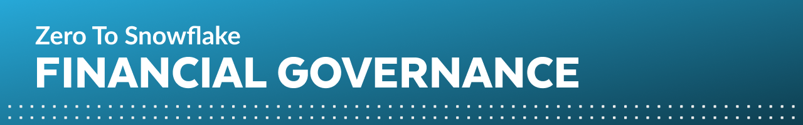

author: Jacob Kranzler
id: tasty_bytes_zero_to_snowflake_financial_governance
summary: Tasty Bytes - Zero to Snowflake - Financial Governance Quickstart
categories: Getting-Started
environments: web
status: Published 
feedback link: https://github.com/Snowflake-Labs/sfguides/issues
tags: Getting Started, Data Engineering, Data Warehouse

# Tasty Bytes - Zero to Snowflake - Financial Governance
<!-- ------------------------ -->

## Financial Governance Overview 
Duration: 1

## 1 
Duration: 0

## 2
Duration: 0

## 3
