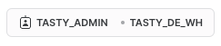

author: Jacob Kranzler
id: tasty_bytes_zero_to_snowflake_financial_governance
summary: Tasty Bytes - Zero to Snowflake - Financial Governance Quickstart
categories: Tasty-Bytes, Getting-Started, Featured
environments: web
status: Published 
feedback link: https://github.com/Snowflake-Labs/sfguides/issues
tags: Getting Started, Data Engineering, Data Warehouse

# Tasty Bytes - Zero to Snowflake - Financial Governance
<!-- ------------------------ -->

## Financial Governance in Snowflake
Duration: 1


### Overview
Welcome to the Powered by Tasty Bytes - Zero to Snowflake Quickstart focused on Financial Governance!

Within this Quickstart, we will learn about Financial Governance in Snowflake by diving into Snowflake Warehouses and their configurabilities, Resource Monitors, and Account and Warehouse Level Timeout Parameters.

For more detail on Financial Governance in Snowflake please visit the [Financial Governance Overview documentation](https://docs.snowflake.com/guides-overview-cost#financial-governance-overview).

### Prerequisites
- Before beginning, please make sure you have completed the [**Introduction to Tasty Bytes Quickstart**](https://quickstarts.snowflake.com/guide/tasty_bytes_introduction/) which provides a walkthrough on setting up a trial account and deploying the Tasty Bytes Foundation required to complete this Quickstart.

### What You Will Learn
- How to Create and Configure a Snowflake Warehouse
- How to Scale a Snowflake Warehouse Up and Down
- How to Suspend a Snowflake Warehouse
- How to Create, Configure and Apply a Resource Monitor
- How to set Query Timeout and Queue Timeout Parameters on a Snowflake Warehouse and Snowflake Account.

### What You Will Build
- A Snowflake Warehouse
- A Resource Monitor

## Creating a Worksheet and Copying in our SQL
Duration: 0
Within this Quickstart we will follow a Tasty Bytes themed story via a Snowsight SQL Worksheet with this page serving as a side by side guide complete with additional commentary, images and documentation links.

## Creating a Warehouse 
Duration: 0

### Context
As a Tasty Bytes Snowflake Administrator we have been tasked with gaining an understanding of the features Snowflake provides to help ensure proper Financial Governance is in place before we begin querying and analyzing data.

### Step 1 - Role and Warehouse Context
Before we create a Warehouse, let's first set our Role and Warehouse context. 

The queries below will assume the role of `tasty_admin` via [USE ROLE](https://docs.snowflake.com/en/sql-reference/sql/use-role.html) and leverage the `tasty_de_wh` warehouse via [USE WAREHOUSE](https://docs.snowflake.com/en/sql-reference/sql/use-warehouse.html). 
- To run the queries, please highlight the two queries in your created Worksheet that match what you see below and click the "► Run" button in the top-right hand corner. 
- Once these are executed you will a `Statement executed successfully.` result and notice the Worksheet context reflect the Role and Warehouse as shown in the screenshot below.
```
USE ROLE tasty_admin;
USE WAREHOUSE tasty_de_wh;
```
 

### Step 2 - Creating and Configuring a Warehouse
Within Snowflake, Warehouses are highly configurable to meet your compute demands. This can range from scaling up and down to scale compute sizes and scaling out to handle high concurrency. 

The next query which will create our first Warehouse named `tasty_test_wh`.
```
CREATE OR REPLACE WAREHOUSE tasty_test_wh WITH
COMMENT = 'test warehouse for tasty bytes'
    WAREHOUSE_TYPE = 'standard'
    WAREHOUSE_SIZE = 'xsmall' 
    MIN_CLUSTER_COUNT = 1 
    MAX_CLUSTER_COUNT = 2 
    SCALING_POLICY = 'standard'
    AUTO_SUSPEND = 60
    AUTO_RESUME = true
    INITIALLY_SUSPENDED = true;
```

Based on the query we ran, please see the details below on what each configuration handles within our [CREATE WAREHOUSE](https://docs.snowflake.com/en/sql-reference/sql/create-warehouse) statement.
> aside positive
>1. Warehouse Type = Standard
    - Warehouses are required for queries, as well as all DML operations, including loading data into tables. Snowflake supports Standard (most-common) or Snowpark-optimized Warehouse Types.
>2. Warehouse Size = X-Small
>    - Size specifies the amount of compute resources available per cluster in a warehouse. Snowflake supports X-Small through 6X-Large sizes.
>3. Minimum Cluster Count = 1
>4. Maximum Cluster Count = 2
>    - With multi-cluster warehouses, Snowflake supports allocating, either statically or dynamically, additional clusters to make a larger pool of compute resources available. 
>    - A multi-cluster warehouse is defined by specifying the following properties:
>        - MIN_CLUSTER_COUNT: Minimum number of clusters, equal to or less than the maximum (up to 10). 
>        - MAX_CLUSTER_COUNT: Maximum number of clusters, greater than 1 (up to 10). 
>5. Scaling Policy = Standard
    - Specifies the policy for automatically starting and shutting down clusters in a multi-cluster warehouse running in Auto-scale mode.
>6. Auto Suspend = 60 Seconds
>    - By default, Auto-Suspend is enabled. Snowflake automatically suspends the warehouse if it is inactive for the specified period of time, in our case 60 seconds.
>7. Auto Resume = True
>    - By default, auto-resume is enabled. Snowflake automatically resumes the > > warehouse when any statement that requires a warehouse is submitted and the warehouse is the current warehouse for the session.
>8. Initially Suspended = True
>    - Specifies whether the warehouse is created initially in the ‘Suspended’ state.
>Note: For further information on Snowflake Warehouses please visit the [Snowflake Warehouse Documentation](https://docs.snowflake.com/en/user-guide/warehouses)
>


## Creating a Resource Monitor and Applying it to our Warehouse
Duration: 0

## Protecting our Warehouse from Long Running Queries
Duration: 0

## Protecting our Account from Long Running Queries
Duration: 0

## Leveraging, Scaling and Suspending our Warehouse
Duration: 0

## Resetting our Account
Duration: 0
