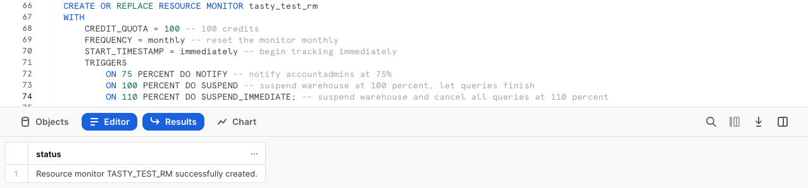
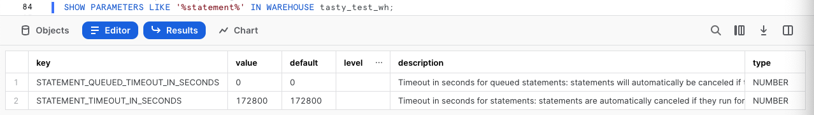
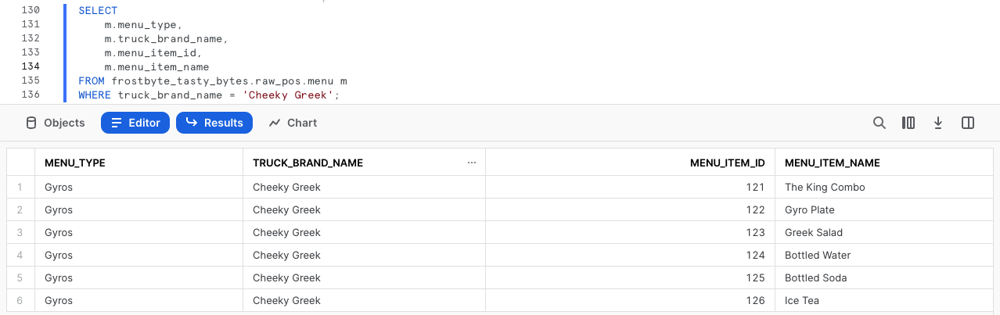

author: Jacob Kranzler
id: tasty_bytes_zero_to_snowflake_financial_governance
summary: Tasty Bytes - Zero to Snowflake - Financial Governance Quickstart
categories: Tasty-Bytes, Getting-Started, Featured
environments: web
status: Published 
feedback link: https://github.com/Snowflake-Labs/sfguides/issues
tags: Getting Started, Tasty Bytes, Zero to Snowflake, Financial Governance

# Tasty Bytes - Zero to Snowflake - Financial Governance
<!-- ------------------------ -->

## Financial Governance in Snowflake
Duration: 1


### Overview
Welcome to the Powered by Tasty Bytes - Zero to Snowflake Quickstart focused on Financial Governance!

Within this Quickstart, we will learn about Financial Governance in Snowflake by diving into Snowflake Warehouses and their configurabilities, Resource Monitors, and Account and Warehouse Level Timeout Parameters.

For more detail on Financial Governance in Snowflake please visit the [Financial Governance Overview documentation](https://docs.snowflake.com/guides-overview-cost#financial-governance-overview).

### Prerequisites
- Before beginning, please make sure you have completed the [**Introduction to Tasty Bytes Quickstart**](https://quickstarts.snowflake.com/guide/tasty_bytes_introduction/) which provides a walkthrough on setting up a trial account and deploying the Tasty Bytes Foundation required to complete this Quickstart.

### What You Will Learn
- How to Create and Configure a Snowflake Warehouse
- How to Scale a Snowflake Warehouse Up and Down
- How to Suspend a Snowflake Warehouse
- How to Create, Configure and Apply a Resource Monitor
- How to Set Statement Timeout and Statement Queue Timeout Parameters on a Snowflake Warehouse and Snowflake Account.

### What You Will Build
- A Snowflake Warehouse
- A Resource Monitor
- A Baseline for a Financial Governed Snowflake Account

## Creating a Worksheet and Copying in our SQL
Duration: 1

### Overview
Within this Quickstart we will follow a Tasty Bytes themed story via a Snowsight SQL Worksheet with this page serving as a side by side guide complete with additional commentary, images and documentation links.

This section will walk you through logging into Snowflake, Creating a New Worksheet, Renaming the Worksheet, Copying SQL from GitHub, and Pasting the SQL we will be leveraging within this Quickstart.

### Step 1 - Accessing Snowflake via URL
- Open a browser window and enter the URL of your Snowflake Account 

### Step 2 - Logging into Snowflake
- Log into your Snowflake account.
    - 

### Step 3 - Navigating to Worksheets
- Click on the Worksheets Tab in the left-hand navigation bar.
    - 

### Step 4 - Creating a Worksheet
- Within Worksheets, click the "+" button in the top-right corner of Snowsight and choose "SQL Worksheet"
    - 

### Step 5 - Renaming a Worksheet
- Rename the Worksheet by clicking on the auto-generated Timestamp name and inputting "Tasty Bytes - Setup"
    - 

### Step 6 - Accessing Quickstart SQL in GitHub
- Click the button below which will direct you to our Tasty Bytes SQL file that is hosted on GitHub.
<button>[tb_zts_financial_governance.sql](https://github.com/Snowflake-Labs/sfquickstarts/blob/master/site/sfguides/src/tasty_bytes_zero_to_snowflake_financial_governance/assets/tb_zts_financial_governance.sql)</button>


### Step 7 - Copying Setup SQL from GitHub
- Within GitHub navigate to the right side and click "Copy raw contents". This will copy all of the required SQL into your clipboard.
    - 

### Step 8 - Pasting Setup SQL from GitHub into your Snowflake Worksheet
- Path back to Snowsight and your newly created Worksheet and Paste (*CMD + V for Mac or CTRL + V for Windows*) what we just copied from GitHub.

### Step 9 - Click Next -->

## Creating a Warehouse 
Duration: 2

### Overview
As a Tasty Bytes Snowflake Administrator we have been tasked with gaining an understanding of the features Snowflake provides to help ensure proper Financial Governance is in place before we begin querying and analyzing data.

> aside positive
> A virtual warehouse, often referred to simply as a “warehouse”, is a cluster of compute resources in Snowflake.
>

### Step 1 - Role and Warehouse Context
Before we create a Warehouse, let's first set our Role and Warehouse context. 

The queries below will assume the role of `tasty_admin` via [USE ROLE](https://docs.snowflake.com/en/sql-reference/sql/use-role.html) and leverage the `tasty_de_wh` warehouse via [USE WAREHOUSE](https://docs.snowflake.com/en/sql-reference/sql/use-warehouse.html). 
- To run the queries, please highlight the two queries in your created Worksheet that match what you see below and click the "► Run" button in the top-right hand corner. 
- Once these are executed you will a `Statement executed successfully.` result and notice the Worksheet context reflect the Role and Warehouse as shown in the screenshot below.
```
USE ROLE tasty_admin;
USE WAREHOUSE tasty_de_wh;
```
 

### Step 2 - Creating and Configuring a Warehouse
Within Snowflake, Warehouses are highly configurable to meet your compute demands. This can range from scaling up and down to meet compute needs or scaling out to meet concurrency needs. 

The next query which will create our first Warehouse named `tasty_test_wh`. Please execute this query now which result in another `Statement executed successfully.` message.
```
CREATE OR REPLACE WAREHOUSE tasty_test_wh WITH
COMMENT = 'test warehouse for tasty bytes'
    WAREHOUSE_TYPE = 'standard'
    WAREHOUSE_SIZE = 'xsmall' 
    MIN_CLUSTER_COUNT = 1 
    MAX_CLUSTER_COUNT = 2 
    SCALING_POLICY = 'standard'
    AUTO_SUSPEND = 60
    AUTO_RESUME = true
    INITIALLY_SUSPENDED = true;
```

Based on the query we ran, please see the details below on what each configuration handles within our [CREATE WAREHOUSE](https://docs.snowflake.com/en/sql-reference/sql/create-warehouse) statement.
> aside positive
>**Warehouse Type**: Warehouses are required for queries, as well as all DML operations, including loading data into tables. Snowflake supports Standard (most-common) or Snowpark-optimized Warehouse Types.
>
>**Warehouse Size**: Size specifies the amount of compute resources available per cluster in a warehouse. Snowflake supports X-Small through 6X-Large sizes.
>
>**Minimum and Maximum Cluster Count**: With multi-cluster warehouses, Snowflake supports allocating, either statically or dynamically, additional clusters to make a larger pool of compute resources available. 
>
>**Scaling Policy**: Specifies the policy for automatically starting and shutting down clusters in a multi-cluster warehouse running in Auto-scale mode.
>
> **Auto Suspend**: By default, Auto-Suspend is enabled. Snowflake automatically suspends the warehouse if it is inactive for the specified period of time, in our case 60 seconds.
>
>**Auto Resume**: By default, auto-resume is enabled. Snowflake automatically resumes the warehouse when any statement that requires a warehouse is submitted and the warehouse is the current warehouse for the session.
>
>**Initially Suspended**: Specifies whether the warehouse is created initially in the ‘Suspended’ state.
> 
> 
> *For further information on Snowflake Warehouses please visit the* [*Snowflake Warehouse Documentation*](https://docs.snowflake.com/en/user-guide/warehouses)
>

### Step 4 - Click Next -->

## Creating a Resource Monitor and Applying it to our Warehouse
Duration: 2

### Overview
With a Warehouse in place, let's now leverage Snowflakes Resource Monitors to ensure the Warehouse has a monthly quota that will allow our admins to track it's consumed credits and ensure it is suspended if it exceeds its assigned quota.

> aside positive
> A resource monitor can be used to monitor credit usage by virtual warehouses and the cloud services needed to support those warehouses. 
> 

### Step 1 - Creating a Resource Monitor
To begin, lets assume our `accountadmin` role and then create our first Resource Monitor using [CREATE RESOURCE MONITOR](https://docs.snowflake.com/en/sql-reference/sql/create-resource-monitor) by executing the next set of queries.

```
USE ROLE accountadmin;
CREATE OR REPLACE RESOURCE MONITOR tasty_test_rm
WITH 
    CREDIT_QUOTA = 100 -- 100 credits
    FREQUENCY = monthly -- reset the monitor monthly
    START_TIMESTAMP = immediately -- begin tracking immediately
    TRIGGERS 
        ON 75 PERCENT DO NOTIFY -- notify accountadmins at 75%
        ON 100 PERCENT DO SUSPEND -- suspend warehouse at 100 percent, let queries finish
        ON 110 PERCENT DO SUSPEND_IMMEDIATE;
```
 

For additional detail on what each configuration handles in our statement above please see below:
> aside positive
> **Credit Quota**: Credit quota specifies the number of Snowflake credits allocated to the monitor for the specified frequency interval. Any number can be specified.
>
> **Frequency**: The interval at which the used credits reset relative to the specified start date.
>
> **Start Timestamp**: Date and time (i.e. timestamp) when the resource monitor starts monitoring the assigned warehouses.
>
> **Notify**: Perform no action, but send an alert notification (to all account administrators with notifications enabled).
>
> **Notify & Suspend**: Send a notification (to all account administrators with notifications enabled) and suspend all assigned warehouses after all statements being executed by the warehouse(s) have completed.
>
> **Notify & Suspend Immediate**: Send a notification (to all account administrators with notifications enabled) and suspend all assigned warehouses immediately, which cancels any statements being executed by the warehouses at the time.
>
> *For further information on Snowflake Warehouses please visit the* [Working with Resource Monitors](https://docs.snowflake.com/en/user-guide/resource-monitors)

 
### Step 2 - Applying our Resource Monitor to our Warehouse
With our Resource Monitor successfully created, let's now apply it to our created Warehouse using [ALTER WAREHOUSE ... SET RESOURCE_MONITOR](https://docs.snowflake.com/en/sql-reference/sql/alter-warehouse#properties-parameters). 

Please execute the final query of this step which will result in a `Statement executed successfully.` message. 

```
ALTER WAREHOUSE tasty_test_wh SET RESOURCE_MONITOR = tasty_test_rm;
```

### Step 3 - Click Next --->

## Protecting our Warehouse from Long Running Queries
Duration: 1

### Overview
With monitoring in place, let's now make sure we are protecting ourselves from bad long running queries ensuring timeout parameters are adjusted on the Warehouse.

### Step 1 - Exploring Warehouse Statement Parameters
To begin, let's run the next query to find all Warehouse Parameters related to Statements using the [SHOW PARAMETERS](https://docs.snowflake.com/en/sql-reference/sql/show-parameters) command.

```
SHOW PARAMETERS LIKE '%statement%' IN WAREHOUSE tasty_test_wh;
```


 
### Step 2 - Adjusting Warehouse Statement Timeout Parameter
Having seen the two available Warehouse Statement Parameters, let's first adjust `statement_timeout_in_seconds` to 30 minutes by running the next query. 

Since this parameter is in seconds we will set it equal to 1800 (30 minutes x 60 seconds). Once executed we will receive another `Statement executed successfully.` result.
```
ALTER WAREHOUSE tasty_test_wh SET statement_timeout_in_seconds = 1800;
```

>aside positive
> **[STATEMENT_TIMEOUT_IN_SECONDS](https://docs.snowflake.com/en/sql-reference/parameters#statement-timeout-in-seconds):** Timeout in **seconds** for statements. Statements are automatically canceled if they run for longer; if set to zero, max value (604800) is enforced.
>

### Step 3 - Adjusting Warehouse Statement Queued Timeout Parameter
Next, we will adjust `statement_queued_timeout_in_seconds` to 10 minutes by running the next query. 

Since this parameter is also in seconds we will set it equal to 600 (10 minutes x 60 seconds). Once executed we will receive another `Statement executed successfully.` result.
```
ALTER WAREHOUSE tasty_test_wh SET statement_queued_timeout_in_seconds = 600;
```

>aside positive
> **[STATEMENT_QUEUED_TIMEOUT_IN_SECONDS](https://docs.snowflake.com/en/sql-reference/parameters#statement-queued-timeout-in-seconds):** Timeout in **seconds** for queued statements. Statements will automatically be canceled if they are queued on a warehouse for longer than this amount of time; disabled if set to zero.
>

### Step 4 - Click Next -->

## Protecting our Account from Long Running Queries
Duration: 1

### Overview
These timeout parameters are also available at the Account, User and Session level. As we do not expect any extremely long running queries let's also adjust these parameters on our Account. 

Moving forward we will plan to monitor these as our Snowflake Workloads and Usage
grow to ensure they are continuing to protect our account from unneccesary consumption but also not cancelling longer jobs we expect to be running.

#### Step 1 - Adjusting the Account Statement Timeout Parameter
To begin, our Account level Statement Parameter changes let's adjust `statement_timeout_in_seconds` to 5 hours by running the next query. 

Since this parameter is in seconds we will set it equal to 18000 ([5 hours x 60 minutes] x 60 seconds). Once executed we will receive another `Statement executed successfully.` result.

```
ALTER ACCOUNT SET statement_timeout_in_seconds = 18000; 
```

>aside positive
> **[STATEMENT_TIMEOUT_IN_SECONDS](https://docs.snowflake.com/en/sql-reference/parameters#statement-timeout-in-seconds):** Timeout in **seconds** for statements. Statements are automatically canceled if they run for longer; if set to zero, max value (604800) is enforced.
>

### Step 2 - Adjusting the Account Statement Queued Timeout Parameter
As we did with our Warehouse, let's now adjust `statement_queued_timeout_in_seconds` to 1 hour by running the next query.

Since this parameter is also in seconds we will set it equal to 3600 ([1 hour x 60 minutes] x 60 seconds). Once executed we will receive another `Statement executed successfully.` result.

```
ALTER ACCOUNT SET statement_queued_timeout_in_seconds = 3600;
```

>aside positive
> **[STATEMENT_QUEUED_TIMEOUT_IN_SECONDS](https://docs.snowflake.com/en/sql-reference/parameters#statement-queued-timeout-in-seconds):** Timeout in **seconds** for queued statements. Statements will automatically be canceled if they are queued on a warehouse for longer than this amount of time; disabled if set to zero.
>

### Step 3 - Click Next -->

## Leveraging, Scaling and Suspending our Warehouse
Duration: 1

### Overview
With Financial Governance building blocks in place, let's now leverage the Snowflake Warehouse we created to execute queries. Along the way, let's Scale this Warehouse up and back down as well as test manually suspending it.

### Step 1 - Use our Warehouse to Run a Simple Query
To begin, let's run the next three queries. The first two will set our `tasty_admin` role and `tasty_test_wh` context and the final one will query our `raw_pos.menu` table to find all food items sold at our Cheeky Greek branded trucks.

```
USE ROLE tasty_admin;
USE WAREHOUSE tasty_test_wh; 

SELECT 
    m.menu_type,
    m.truck_brand_name,
    m.menu_item_id,
    m.menu_item_name
FROM frostbyte_tasty_bytes.raw_pos.menu m
WHERE truck_brand_name = 'Cheeky Greek';
```


### Step 2 - Scale our Warehouse Up
After completing a basic query against one of our dimension tables, let's now get ready to query our much larger orders data. 

Let's now instantly scale our `tasty_test_wh` up by executing our next query leveraging [ALTER WAREHOUSE... SET warehouse_size](https://docs.snowflake.com/en/sql-reference/sql/alter-warehouse#properties-parameters). Upon completion we will recieve another `Statement executed successfully` result.

```
ALTER WAREHOUSE tasty_test_wh SET warehouse_size = 'XLarge';
```

### Step 3 - Run an Aggregation Query Against a Large Data Set
With our Warehouse scaled up, let's now run our next query which uses [CONCAT](https://docs.snowflake.com/en/sql-reference/functions/concat), [COUNT](https://docs.snowflake.com/en/sql-reference/functions/count) and [SUM](https://docs.snowflake.com/en/sql-reference/functions/sum) to calculate orders and total sales for Tasty Bytes customer loyalty members.

```
SELECT 
    o.customer_id,
    CONCAT(clm.first_name, ' ', clm.last_name) AS name,
    COUNT(DISTINCT o.order_id) AS order_count,
    SUM(o.price) AS total_sales
FROM frostbyte_tasty_bytes.analytics.orders_v o
JOIN frostbyte_tasty_bytes.analytics.customer_loyalty_metrics_v clm
    ON o.customer_id = clm.customer_id
GROUP BY o.customer_id, name
ORDER BY order_count DESC;
```


### Step 4 - Scale our Warehouse Down
Having seen the instant upward scalability of our Snowflake Warehouse and how it can aggregate large result sets with ease, let's now instantly scale our `tasty_test_wh` back down by running the next query. Upon completion we will recieve another `Statement executed successfully` result.

```
ALTER WAREHOUSE tasty_test_wh SET warehouse_size = 'XSmall';
```

### Step 5 - Suspend our Warehouse
To cap things off, we previously set the `auto_suspend` to 60 seconds on our `tasty_test_wh` but let's also take a look at how to manually suspend a warehouse by executing our final query.

```
ALTER WAREHOUSE tasty_test_wh SUSPEND;
```

**Note**: Depending on how fast you have ran through these last statements you will receive of the two following results:
1. **Statement executed successfully**: This means you were very fast in executing the steps in this section and have beat the `auto_suspend` Warehouse setting we configured to 60 seconds.
2. **Invalid state. Warehouse 'TASTY_TEST_WH' cannot be suspended**: This means that the amazing `auto_suspend` Warehouse setting we configured to 60 seconds has won the Warehouse suspension race.

### Step 6 - Click Next -->

## Conclusion and Next Steps
Duration: 1

### Conclusion
Fantastic work! You have successfully completed the Tasty Bytes - Zero to Snowflake - Financial Governance Quickstart. 

By doing so you have now:
- Created and Configured a Snowflake Warehouse
- Scaled a Snowflake Warehouse Up and Down
- Suspended a Snowflake Warehouse
- Created, Configured and Applied a Resource Monitor
- Set Statement Timeout and Statement Queue Timeout Parameters on a Snowflake Warehouse and Snowflake Account.

### Next Steps
If you would like to re-run this Quickstart please leverage the Reset scripts in the bottom of your associated Worksheet.

To continue your journey in the Snowflake Data Cloud, please now visit the link below to see all other Powered by Taste Bytes - Quickstarts available to you.

- ### [Powered by Tasty Bytes - Quickstarts Table of Contents](https://quickstarts.snowflake.com/guide/tasty_bytes_introduction/#3)

