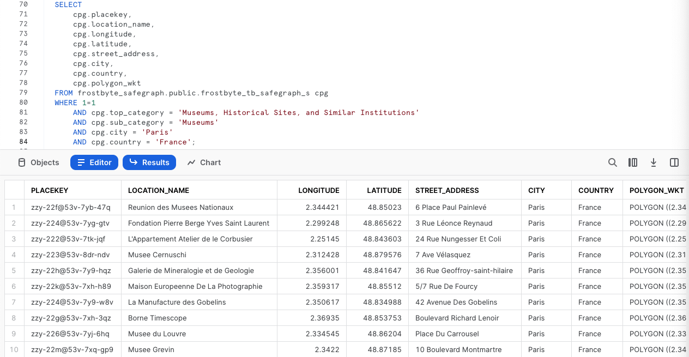
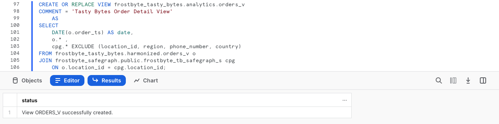
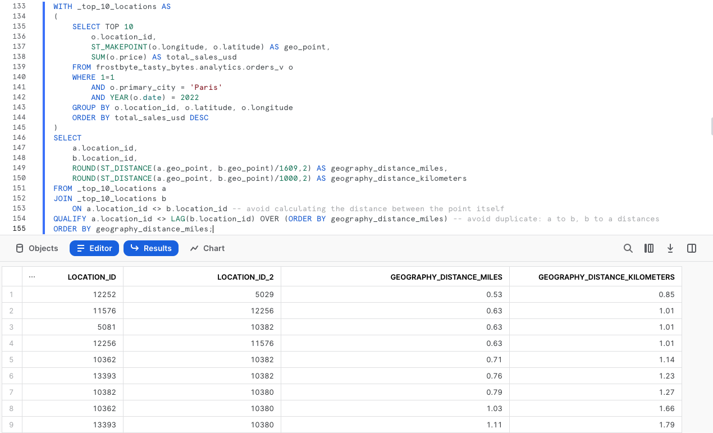
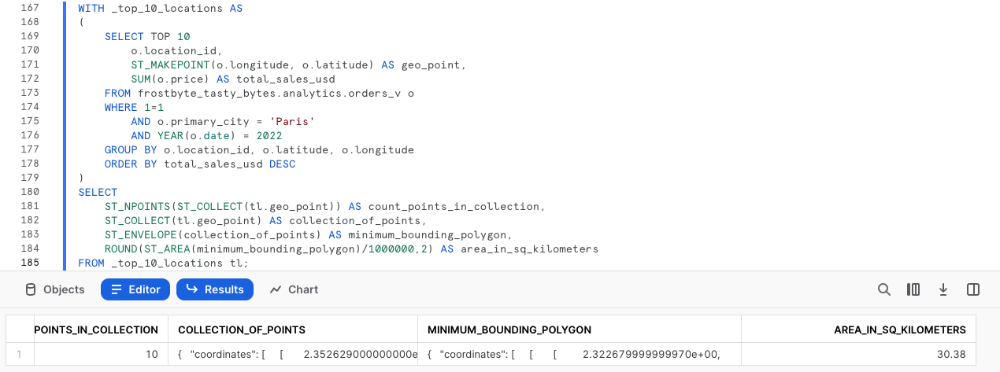
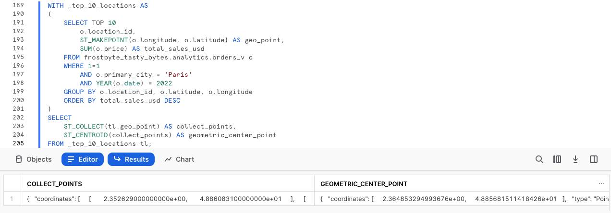

author: Jacob Kranzler
id: tasty_bytes_zero_to_snowflake_geospatial
summary: Tasty Bytes - Zero to Snowflake - Geospatial Quickstart
categories: Tasty-Bytes, Getting-Started, Featured
environments: web
status: Published 
feedback link: https://github.com/Snowflake-Labs/sfguides/issues
tags: Getting Started, Tasty Bytes, Zero to Snowflake, Geospatial

# Tasty Bytes - Zero to Snowflake - Geospatial
<!-- ------------------------ -->

## Geospatial Analysis in Snowflake
Duration: 1


###  Overview 
Welcome to the Powered by Tasty Bytes - Zero to Snowflake Quickstart focused on Geospatial Analysis!

### Prerequisites
- Before beginning, please make sure you have completed the [**Introduction to Tasty Bytes Quickstart**](https://quickstarts.snowflake.com/guide/tasty_bytes_introduction/) which provides a walkthrough on setting up a trial account and deploying the Tasty Bytes Foundation required to complete this Quickstart.

### What You Will Learn
- A

### What You Will Build
- B

## Creating a Worksheet and Copying in our SQL
Duration: 1

### Overview
Within this Quickstart we will follow a Tasty Bytes themed story via a Snowsight SQL Worksheet with this page serving as a side by side guide complete with additional commentary, images and documentation links.

This section will walk you through logging into Snowflake, Creating a New Worksheet, Renaming the Worksheet, Copying SQL from GitHub, and Pasting the SQL we will be leveraging within this Quickstart.

### Step 1 - Accessing Snowflake via URL
- Open a browser window and enter the URL of your Snowflake Account 

### Step 2 - Logging into Snowflake
- Log into your Snowflake account.
    - 

### Step 3 - Navigating to Worksheets
- Click on the Worksheets Tab in the left-hand navigation bar.
    - 

### Step 4 - Creating a Worksheet
- Within Worksheets, click the "+" button in the top-right corner of Snowsight and choose "SQL Worksheet"
    - 

### Step 5 - Renaming a Worksheet
- Rename the Worksheet by clicking on the auto-generated Timestamp name and inputting "Tasty Bytes - Setup"
    - 

### Step 6 - Accessing Quickstart SQL in GitHub
- Click the button below which will direct you to our Tasty Bytes SQL file that is hosted on GitHub.
<button>[tb_zts_financial_governance.sql](https://github.com/Snowflake-Labs/sfquickstarts/blob/master/site/sfguides/src/tasty_bytes_zero_to_snowflake_financial_governance/assets/tb_zts_financial_governance.sql)</button>

### Step 7 - Copying Setup SQL from GitHub
- Within GitHub navigate to the right side and click "Copy raw contents". This will copy all of the required SQL into your clipboard.
    - 

### Step 8 - Pasting Setup SQL from GitHub into your Snowflake Worksheet
- Path back to Snowsight and your newly created Worksheet and Paste (*CMD + V for Mac or CTRL + V for Windows*) what we just copied from GitHub.

### Step 9 - Click Next -->


## Acquiring Safegraph POI Data from the Snowflake Marketplace
Duration: 1

### Overview
Tasty Bytes operates Food Trucks in numerous cities and countries across the globe with each truck having the ability to choose two different selling locations per day.  One important item that our Executives are interested in is to learn more about how these locations relate to each other as well as if there are any locations we currently serve that are potentially too far away from hot selling city centers.

Unfortunately what we have seen so far is our first party data does not give us the building blocks required to complete this sort of Geospatial analysis. Thankfully, the Snowflake Marketplace has great listings from Safegraph that can assist us here.


## Step 1 - Using First Party Data to Find Top Selling Locations
Before we leverage the Snowflake Marketplace to grab Safegraph data, please execute our 
first three queries which will set our Role and Warehouse context to `tasty_data_engineer` and `tasty_de_wh` and find the Top 10 Selling Locations for Paris in 2022.

In this the 3rd query we will see the usage of [TOP](https://docs.snowflake.com/en/sql-reference/constructs/top_n), [SUM](https://docs.snowflake.com/en/sql-reference/functions/sum) and [YEAR](https://docs.snowflake.com/en/sql-reference/functions/year) functions.

```
USE ROLE tasty_data_engineer;
USE WAREHOUSE tasty_de_wh;

SELECT TOP 10
    o.location_id,
    SUM(o.price) AS total_sales_usd
FROM frostbyte_tasty_bytes.analytics.orders_v o
WHERE 1=1
    AND o.primary_city = 'Paris'
    AND YEAR(o.date) = 2022
GROUP BY o.location_id
ORDER BY total_sales_usd DESC;
```


While it is great to get these top selling locations for Paris, we need more Point of Interest data to really conduct rich analysis.

## Step 2 - Acquiring Safegraph POI Data from the Snowflake Marketplace 
Please follow the steps and video below to access this listing in your Snowflake Account.

- Click -> Home Icon
- Click -> Marketplace
- Search -> frostbyte
- Click -> SafeGraph: frostbyte
- Click -> Get
- Rename Database -> FROSTBYTE_SAFEGRAPH (all capital letters)
- Grant to Additional Roles -> PUBLIC


>aside positive
>SafeGraph’s Places data provides detailed information about physical places. Our data is fresh, cleaned and provided in a format that empowers the user. With POI data for countries around the world, you can gain insights about any location that a person can visit aside from private residences. 
>

### Step 3 - Evaluating Safegraph POI Data
Now that we have the `frostbyte_safegraph` database live in our account, let's run to the next query to initially see what sort of data they have for Paris.

```
SELECT 
    cpg.placekey,
    cpg.location_name,
    cpg.longitude,
    cpg.latitude,
    cpg.street_address,
    cpg.city,
    cpg.country,
    cpg.polygon_wkt
FROM frostbyte_safegraph.public.frostbyte_tb_safegraph_s cpg
WHERE 1=1
    AND cpg.top_category = 'Museums, Historical Sites, and Similar Institutions'
    AND cpg.sub_category = 'Museums'
    AND cpg.city = 'Paris'
    AND cpg.country = 'France';
```



Amazing! These sort of metric will be immensely valuable in conduction Geospatial analysis to assist our Executives in making data driven location decisions. Let's get this harmonized with our Sales data in the next section.

### Step 4 - Click Next -->

## Harmonizing and Promoting First and Third Party Data
Duration: 2

### Overview
To make our Geospatial analysis seamless, let's make sure to get Safegraph POI data included in the `analytics.orders_v` so all of our downstream users can also access it.

### Step 1 - Enriching our Analytics View
Please execute this steps two queries which will set our Role context to `sysadmin` and recreate our `analytics.orders_v` now with all available Safegraph POI metrics.

Within this [CREATE VIEW] statement, you will see [COMMENT](https://docs.snowflake.com/en/sql-reference/sql/comment), [DATE](https://docs.snowflake.com/en/sql-reference/functions/to_date) and [SELECT * EXCLUDE ..](https://docs.snowflake.com/en/sql-reference/sql/select#parameters) functionality leveraged. 

To highlight what our EXCLUDE is doing we are using it to vastly simplify the SQL required to SELECT all of the available Safegraph columns but not the ones we already have seen in the `harmonized.orders_v`.

```
CREATE OR REPLACE VIEW frostbyte_tasty_bytes.analytics.orders_v
COMMENT = 'Tasty Bytes Order Detail View'
    AS
SELECT 
    DATE(o.order_ts) AS date,
    o.* ,
    cpg.* EXCLUDE (location_id, region, phone_number, country)
FROM frostbyte_tasty_bytes.harmonized.orders_v o
JOIN frostbyte_safegraph.public.frostbyte_tb_safegraph_s cpg
    ON o.location_id = cpg.location_id;
```



>aside negative
> **Note:** For demonstrating purposes the Safegraph listing already has the Tasty Bytes location_id's included within. In a real-world scenario the mapping would leverage public [Placekeys](https://www.placekey.io/) which [Safegraph is a founding partner of](https://www.safegraph.com/blogs/safegraph-joins-placekey-initiative-as-a-founding-partner).
>

### Step 2 - Click Next -->

## Conducting Geospatial Analysis - Part 1
Duration: 2

### Overview
With Point of Interest metrics now readily available from the Snowflake Marketplace without any ETL required, let's start on our Geospatial analysis journey.

### Step 1 - Creating a Geography Point
Latitude and Longitude are two building block POI metrics we now have access to thanks for Safegraph. Please execute the next two queries to re-assume to `tasty_data_engineer` role and create our Geography Point leveraging the [ST_MAKEPOINT/ST_POINT](https://docs.snowflake.com/en/sql-reference/functions/st_makepoint) function.

>aside positive
> **ST_MAKEPOINT/ST_POINT:** Constructs a GEOGRAPHY object that represents a point with the specified longitude and latitude.
>

```
USE ROLE tasty_date_engineer;

SELECT TOP 10 
    o.location_id,
    ST_MAKEPOINT(o.longitude, o.latitude) AS geo_point,
    SUM(o.price) AS total_sales_usd
FROM frostbyte_tasty_bytes.analytics.orders_v o
WHERE 1=1
    AND o.primary_city = 'Paris'
    AND YEAR(o.date) = 2022
GROUP BY o.location_id, o.latitude, o.longitude
ORDER BY total_sales_usd DESC;
```


While it isn't the prettiest result set we have ever seen, the results we see in the `geo_point` column are going to be essential for everything else we do moving forward. One thing to note here is despite typically hearing Latitude then Longitude this function requires these values to be input in the Longitude, Latitude order.

### Step 2 - Calculating Distance Between Locations
Starting with our Geographic Point, we can now begin to dive into some of the powerful Geospatial functions Snowflake offers natively. 

Let's first start with calculating the distances in Miles and Kilometersbetween those top selling locations we generated previously by executing our next query which leverages the powerful [ST_DISTANCE](https://docs.snowflake.com/en/sql-reference/functions/st_distance) function.

>aside positive
>**ST_DISTANCE:** Returns the minimum geodesic distance between two GEOGRAPHY or the minimum Euclidean distance between two GEOMETRY objects.
>

Within this query we also leverage a [Common Table Expression or CTE](https://docs.snowflake.com/en/user-guide/queries-cte), [QUALIFY](https://docs.snowflake.com/en/sql-reference/constructs/qualify) and [LAG](https://docs.snowflake.com/en/sql-reference/functions/lag)

```
WITH _top_10_locations AS 
(
    SELECT TOP 10
        o.location_id,
        ST_MAKEPOINT(o.longitude, o.latitude) AS geo_point,
        SUM(o.price) AS total_sales_usd
    FROM frostbyte_tasty_bytes.analytics.orders_v o
    WHERE 1=1
        AND o.primary_city = 'Paris'
        AND YEAR(o.date) = 2022
    GROUP BY o.location_id, o.latitude, o.longitude
    ORDER BY total_sales_usd DESC
)
SELECT
    a.location_id,
    b.location_id,
    ROUND(ST_DISTANCE(a.geo_point, b.geo_point)/1609,2) AS geography_distance_miles,
    ROUND(ST_DISTANCE(a.geo_point, b.geo_point)/1000,2) AS geography_distance_kilometers
FROM _top_10_locations a  
JOIN _top_10_locations b
    ON a.location_id <> b.location_id
QUALIFY a.location_id <> LAG(b.location_id) OVER (ORDER BY geography_distance_miles)
ORDER BY geography_distance_miles;
```



Wow! Look at how far we have already came in so little time. Let's keep diving deeper into what geospatial insights we can derive in our next section.

### Step 3 - Click Next -->

## Conducting Geospatial Analysis - Part 2
Duration: 4

### Overview
Now that we understand how to create points, and calculate distance, we will now pile on a large set additional Snowflake Geospatial functionality to further our analysis.

## Step 1 - Collecting Points, Drawing a Minimum Bounding Polygon and Calculating Area
Please execute the next query which will take the building blocks from the previous section and now collect all of our Geography Points and build a Minimum Bounding Polygon from them.

Within this query we will see the usage of [ST_NPOINTS](https://docs.snowflake.com/en/sql-reference/functions/st_npoints), [ST_COLLECT](https://docs.snowflake.com/en/sql-reference/functions/st_collect), [ST_ENVELOPE](https://docs.snowflake.com/en/sql-reference/functions/st_envelope) and [ST_AREA](https://docs.snowflake.com/en/sql-reference/functions/st_area).

>aside positive
>**ST_NPOINTS/ST_NUMPOINTS:** Returns the number of points in a GEOGRAPHY or GEOGRAPHY object.
>
>**ST_COLLECT:** This function combines all the GEOGRAPHY objects in a column into one GEOGRAPHY object.
>
>**ST_ENVELOPE:** Returns the minimum bounding box (a rectangular “envelope”) that encloses a specified GEOMETRY object.
>
>**ST_AREA:** Returns the area of the Polygon(s) in a GEOGRAPHY or GEOMETRY object.
>

```
WITH _top_10_locations AS 
(
    SELECT TOP 10
        o.location_id,
        ST_MAKEPOINT(o.longitude, o.latitude) AS geo_point,
        SUM(o.price) AS total_sales_usd
    FROM frostbyte_tasty_bytes.analytics.orders_v o
    WHERE 1=1
        AND o.primary_city = 'Paris'
        AND YEAR(o.date) = 2022
    GROUP BY o.location_id, o.latitude, o.longitude
    ORDER BY total_sales_usd DESC
)
SELECT
    ST_NPOINTS(ST_COLLECT(tl.geo_point)) AS count_points_in_collection,
    ST_COLLECT(tl.geo_point) AS collection_of_points,
    ST_ENVELOPE(collection_of_points) AS minimum_bounding_polygon,
    ROUND(ST_AREA(minimum_bounding_polygon)/1000000,2) AS area_in_sq_kilometers
FROM _top_10_locations tl;
```



Holy Cow! Look at how much we accomplished within a single SQL query. However we can't stop yet let's keep seeing what else we can do.

## Step 2 - Finding our Top Selling Locations Center Point


[ST_CENTROID](https://docs.snowflake.com/en/sql-reference/functions/st_centroid)

>aside positive
>**ST_CENTROID:** Returns the Point representing the geometric center of a GEOGRAPHY or GEOMETRY object.
>

```
WITH _top_10_locations AS 
(
    SELECT TOP 10
        o.location_id,
        ST_MAKEPOINT(o.longitude, o.latitude) AS geo_point,
        SUM(o.price) AS total_sales_usd
    FROM frostbyte_tasty_bytes.analytics.orders_v o
    WHERE 1=1
        AND o.primary_city = 'Paris'
        AND YEAR(o.date) = 2022
    GROUP BY o.location_id, o.latitude, o.longitude
    ORDER BY total_sales_usd DESC
)
SELECT  
    ST_COLLECT(tl.geo_point) AS collect_points,
    ST_CENTROID(collect_points) AS geometric_center_point
FROM _top_10_locations tl;
```


