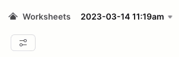
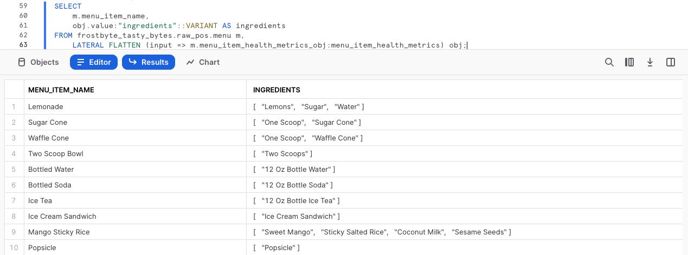
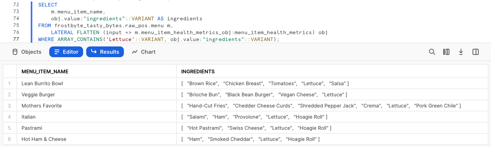
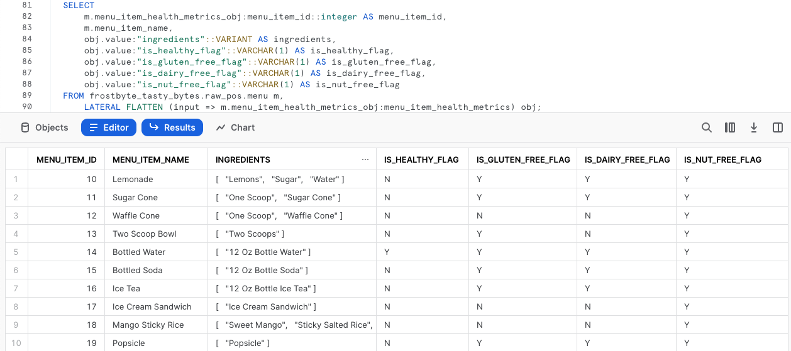
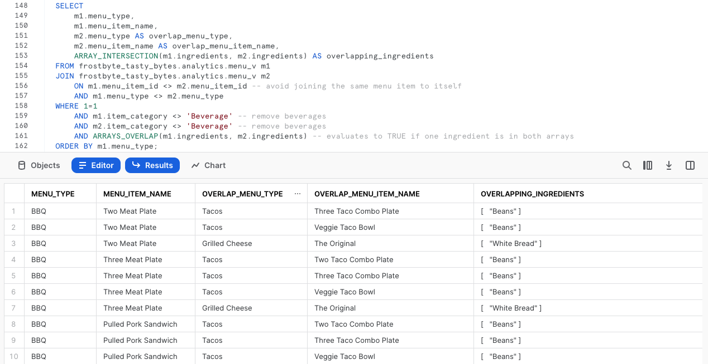
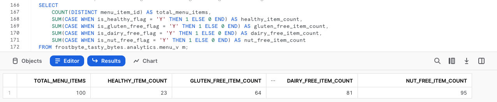

author: Jacob Kranzler
id: tasty_bytes_zero_to_snowflake_semi_structured_data
summary: Tasty Bytes - Zero to Snowflake - Semi-Structured Data Quickstart
categories: Tasty-Bytes, Getting-Started, Featured
environments: web
status: Published 
feedback link: https://github.com/Snowflake-Labs/sfguides/issues
tags: Getting Started, Data Engineering, Data Warehouse

# Tasty Bytes - Zero to Snowflake - Semi-Structured Data
<!-- ------------------------ -->

## Semi-Structured Data Processing in Snowflake
Duration: 1


### Overview
Welcome to the Powered by Tasty Bytes - Zero to Snowflake Quickstart focused on Semi-Structured Data Processing!

Within this Quickstart, we will learn about processing Semi-Structured Data in Snowflake by diving into the VARIANT Data Type, Semi-Structured Data Processing combinging Dot Notation and Lateral Flattening as well as View Creation and Snowsight Charting.

For more detail on Semi-Structured Data in Snowflake please visit the [Semi-Structured Data Overview documentation](https://docs.snowflake.com/en/user-guide/semistructured-concepts)

### Prerequisites
- Before beginning, please make sure you have completed the [**Introduction to Tasty Bytes Quickstart**](https://quickstarts.snowflake.com/guide/tasty_bytes_introduction/index.html) which provides a walkthrough on setting up a trial account and deploying the Tasty Bytes Foundation required to complete this Quickstart.

### What You Will Learn
- What a Variant Data Type is
- How to Use Dot Notation to Query Semi-Structured Data
- How to Flatten Semi-Structured Data
- How to Analyze Arrays
- How to Create a View
- How to Build a Chart from a Result Set in Snowsight

### What You Will Build
- An End to End Semi-Structured Data Process
- A Harmonized (Silver) and Analytics (Gold) View
- An Executive Worthy Bar Chart

## Creating a Worksheet and Copying in our SQL
Duration: 1

### Overview
Within this Quickstart we will follow a Tasty Bytes themed story via a Snowsight SQL Worksheet with this page serving as a side by side guide complete with additional commentary, images and documentation links.

This section will walk you through logging into Snowflake, Creating a New Worksheet, Renaming the Worksheet, Copying SQL from GitHub, and Pasting the SQL we will be leveraging within this Quickstart.

### Step 1 - Accessing Snowflake via URL
- Open a browser window and enter the URL of your Snowflake Account 

### Step 2 - Logging into Snowflake
- Log into your Snowflake account.
    - 

### Step 3 - Navigating to Worksheets
- Click on the Worksheets Tab in the left-hand navigation bar.
    - 

### Step 4 - Creating a Worksheet
- Within Worksheets, click the "+" button in the top-right corner of Snowsight and choose "SQL Worksheet"
    - 

### Step 5 - Renaming a Worksheet
- Rename the Worksheet by clicking on the auto-generated Timestamp name and inputting "Tasty Bytes - Semi-Structured Data"
    - 

### Step 6 - Accessing Quickstart SQL in GitHub
- Click the button below which will direct you to our Tasty Bytes SQL file that is hosted on GitHub.
<button>[tb_zts_semi_structured_data.sql](https://github.com/Snowflake-Labs/sf-samples/blob/main/samples/tasty_bytes/tb_zts_semi_structured_data.sql)</button>

### Step 7 - Copying Setup SQL from GitHub
- Within GitHub navigate to the right side and click "Copy raw contents". This will copy all of the required SQL into your clipboard.
    - 

### Step 8 - Pasting Setup SQL from GitHub into your Snowflake Worksheet
- Path back to Snowsight and your newly created Worksheet and Paste (*CMD + V for Mac or CTRL + V for Windows*) what we just copied from GitHub.

### Step 9 - Click Next -->

## Profiling our Semi-Structured Menu Data
Duration: 1

### Overview
As a Tasty Bytes Data Engineer, we have been tasked with profiling our Menu data that includes a Semi-Structured Data column. From this menu table we need to produce an Analytics layer View that exposes Dietary and Ingredient data to our end users.

### Step 1 - Setting our Context and Querying our Table
To begin, let's execute the first three queries together which will:
- Set the Role context to `tasty_data_engineer`
- Set the Warehouse context to `tasty_de_wh`
- Produce a [TOP](https://docs.snowflake.com/en/sql-reference/constructs/top_n) 10 Result Set of our `raw_pos.menu` table

```
USE ROLE tasty_data_engineer;
USE WAREHOUSE tasty_de_wh;

SELECT TOP 10
    m.truck_brand_name,
    m.menu_type,
    m.menu_item_name,
    m.menu_item_health_metrics_obj
FROM frostbyte_tasty_bytes.raw_pos.menu m;
```


Within our output, we can see that the `menu_item_health_metrics_obj` must be the Semi-Structured Data we were told contained the metrics we need to provide downstream. 

By clicking into one of the cells in this column, we will see Snowsight automatically expand the stats pane to give us a better view of what is inside.


### Step 2 - Exploring our Semi-Structured Column
To dive deeper into how this column in defined in Snowflake, please run the next query where we leverage [SHOW COLUMNS](https://docs.snowflake.com/en/sql-reference/sql/show-columns) to explore the Data Types present in our `menu` table.

```
SHOW COLUMNS IN frostbyte_tasty_bytes.raw_pos.menu;
```


Looking at our result set, we see the `menu_item_health_metrics_obj` is a [VARIANT](https://docs.snowflake.com/en/sql-reference/data-types-semistructured) Data Type.

>aside positive
>For data that is mostly regular and uses only data types that are native to the semi-structured format you are using (e.g. strings and integers for JSON format), the storage requirements and query performance for operations on relational data and data in a VARIANT column is very similar.
>

### Step 3 - Traversing Semi-Structured Data using Dot Notation
Within our `menu_item_health_metrics_obj` column, we saw that `menu_item_id` was included alongside the more nested Ingredients and Dietary Restriction data we need to access. 

Please execute the next query where we begin to leverage [Dot Notation](https://docs.snowflake.com/en/user-guide/querying-semistructured#dot-notation) to traverse our Semi-Structured data.

```
SELECT 
    m.menu_item_health_metrics_obj:menu_item_id AS menu_item_id,
    m.menu_item_health_metrics_obj:menu_item_health_metrics AS menu_item_health_metrics
FROM frostbyte_tasty_bytes.raw_pos.menu m;
```


Using Dot Notation we were able to successfully extract `menu_item_id` in full, but look to still be left with additional semi-structured objects in the `menu_item_health_metrics` column output. 

Once again let's click into one of the cells within this column to take a further look.


**We are making progress!** Let's see how we can further process `menu_item_health_metrics` in the next section by using additional Snowflake functions.

### Step 4 - Click Next -->

## Flattening Semi-Structured Data
Duration: 2

### Overview
Having seen how we can easily query Semi-Structured Data as it exists in a Variant column using Dot Notation, our Tasty Data Engineer is well on the way to providing their internal stakeholders with the data they have requested.

Within this section, we will conduct additional Semi-Structured Data processing to meet requirements.

### Step 1 - Introduction to Lateral Flatten
To further extract the data our downstream users are asking for from our `menu_item_health_metrics_obj` column. Please execute the next query which utilizes the Dot Notation functionality we just explored alongside Snowflakes [FLATTEN](https://docs.snowflake.com/en/sql-reference/functions/flatten) function and [LATERAL JOIN](https://docs.snowflake.com/en/sql-reference/constructs/join-lateral) capability to provide us with the first `ingredient` Array we have been asked for.

>aside positive
> **Flatten:** is a table function that takes a VARIANT, OBJECT, or ARRAY column and produces a lateral view. Flatten can be used to convert semi-structured data to a relational representation.
>
>**Lateral Join:** Unlike the output of a non-lateral join, the output from a lateral join includes only the rows generated from the inline view. The rows on the left-hand side do not need to be joined to the right hand side because the rows on the left-hand side have already been taken into account by being passed into the inline view. 
>

```
SELECT 
    m.menu_item_name,
    obj.value:"ingredients"::VARIANT AS ingredients
FROM frostbyte_tasty_bytes.raw_pos.menu m,
    LATERAL FLATTEN (input => m.menu_item_health_metrics_obj:menu_item_health_metrics) obj;
```



### Step 2 - Exploring an Array Function
Before we extract the requested Dietary data, please kick off the next query which highlights a Snowflake Array Functions, which will explore the `ingredients` column for any `menu_item_name` that includes Lettuce by leveraging [ARRAY_CONTAINS](https://docs.snowflake.com/en/sql-reference/functions/array_contains).

```
SELECT 
    m.menu_item_name,
    obj.value:"ingredients"::VARIANT AS ingredients
FROM frostbyte_tasty_bytes.raw_pos.menu m,
    LATERAL FLATTEN (input => m.menu_item_health_metrics_obj:menu_item_health_metrics) obj
WHERE ARRAY_CONTAINS('Lettuce'::VARIANT, obj.value:"ingredients"::VARIANT);
```



Based on our output, we see that quite a few of our Menu Items include Lettuce. This sort of analysis would be extremely valuable for our Supply Chain Procurement Managers in the event of any food related recalls in the cities and countries we support.

### Step 3 - Structuring Semi-Structured Data at Scale
Having just seen the sort of value we can provide to our organization already, let's now execute the last query of this section. 

This query will use the Dot Notation, and our combined Lateral Join plus Flatten Table Function to provide the result set we were initially tasked to generate.

```
SELECT 
    m.menu_item_health_metrics_obj:menu_item_id::integer AS menu_item_id,
    m.menu_item_name,
    obj.value:"ingredients"::VARIANT AS ingredients,
    obj.value:"is_healthy_flag"::VARCHAR(1) AS is_healthy_flag,
    obj.value:"is_gluten_free_flag"::VARCHAR(1) AS is_gluten_free_flag,
    obj.value:"is_dairy_free_flag"::VARCHAR(1) AS is_dairy_free_flag,
    obj.value:"is_nut_free_flag"::VARCHAR(1) AS is_nut_free_flag
FROM frostbyte_tasty_bytes.raw_pos.menu m,
    LATERAL FLATTEN (input => m.menu_item_health_metrics_obj:menu_item_health_metrics) obj;
```



**Great!** That output looks to meet the exact requirements our stakeholders have requested. In the next section we will explore how we can promote this to our Analytics layer where they have the ability to access it.

### Step 4 - Click Next -->

## Creating Structured Views Over Semi-Structured Data
Duration: 2

### Overview
In the last section, we constructed a query that provides the exact output our end users require using a suite of Snowflake Semi-Structured Data functionality along the way. Next we will follow the process of promoting this query against our Raw layer through Harmonized and eventually to Analytics where our end users are privileged to read from.

**Note:** For those more familiar with Bronze, Silver, and Gold Data Models we can think of Raw as Bronze, Harmonized as Silver and Analytics as Gold.

### Step 1 - Creating our Harmonized View Using our Semi-Structured Flattening SQL
Taking the exact query we ended our last section with please now execute the next query which contains this SQL plus all additional already structured `menu` Table Columns. 

Within this query we use [CREATE VIEW](https://docs.snowflake.com/en/sql-reference/sql/create-view) in our Harmonized schema to encapsulate the Semi-Structured processing logic and additional Columns as a Table.

>aside positive
> A view allows the result of a query to be accessed as if it were a table.  Views serve a variety of purposes, including combining, segregating, and protecting data. 
>

```
CREATE OR REPLACE VIEW frostbyte_tasty_bytes.harmonized.menu_v
    AS
SELECT 
    m.menu_id,
    m.menu_type_id,
    m.menu_type,
    m.truck_brand_name,
    m.menu_item_health_metrics_obj:menu_item_id::integer AS menu_item_id,
    m.menu_item_name,
    m.item_category,
    m.item_subcategory,
    m.cost_of_goods_usd,
    m.sale_price_usd,
    obj.value:"ingredients"::VARIANT AS ingredients,
    obj.value:"is_healthy_flag"::VARCHAR(1) AS is_healthy_flag,
    obj.value:"is_gluten_free_flag"::VARCHAR(1) AS is_gluten_free_flag,
    obj.value:"is_dairy_free_flag"::VARCHAR(1) AS is_dairy_free_flag,
    obj.value:"is_nut_free_flag"::VARCHAR(1) AS is_nut_free_flag
FROM frostbyte_tasty_bytes.raw_pos.menu m,
    LATERAL FLATTEN (input => m.menu_item_health_metrics_obj:menu_item_health_metrics) obj;
```


With the `harmonized.menu_v` view created, we could now query it directly without having leverage the more complex SQL we used within. However, since the Analytics layer is where our stakeholders access data, let's take the next step to land this there.

### Step 2 - Promoting from Harmonized to Analytics with Ease
Referencing our `harmonized.menu_v` please now execute the next query which will create our `analytics.menu_v` that will begin delivering value downstream immediately. 

Within this query we see a few new functions we have not yet covered. First off we are adding a [COMMENT](https://docs.snowflake.com/en/sql-reference/sql/comment) which can be seen within [SHOW VIEWS](https://docs.snowflake.com/en/sql-reference/sql/show) commands or within the Snowsight interface to document what a user may see when querying this view.

We are also utilizing [SELECT * EXCLUDE and RENAME](https://docs.snowflake.com/en/sql-reference/sql/select#parameters) parameters which can make the lives of SQL developers much easier by reducing query or View definition complexity.

>aside positive
> **Exclude:** When you select all columns (SELECT * or SELECT table_name.*), EXCLUDE specifies the columns that should be excluded from the results.
>
> **Rename:** When you select all columns (SELECT * or SELECT table_name.*), specifies the column aliases that should be used in the results.
>


### Step 3 - Click Next -->

## Analyzing Processed Semi-Structured Data in Snowsight
Duration: 2

### Overview
With our Menu View available in our Analytics layer, let's execute a few queries against it that we will provide to our end users showcasing how Snowflake powers a relational query experience over Semi-Structured data without having to make additional copies or conduct any complex processing.

### Step 1 - Analyzing Arrays
We saw the `ingredients` Column as a result of a query in our previous section, but this is now available without any Dot Notation requirements in our `analytics.menu_v` View. 

With this, please now execute the next query that leverages two additional Snowflake Array Functions [ARRAY_INTERSECTION](https://docs.snowflake.com/en/sql-reference/functions/array_intersection) and [ARRAYS_OVERLAP](https://docs.snowflake.com/en/sql-reference/functions/arrays_overlap) to see which of our non-beverage Menu Items overlap for each of our Food Truck Brands Menus.

```
SELECT 
    m1.menu_type,
    m1.menu_item_name,
    m2.menu_type AS overlap_menu_type,
    m2.menu_item_name AS overlap_menu_item_name,
    ARRAY_INTERSECTION(m1.ingredients, m2.ingredients) AS overlapping_ingredients
FROM frostbyte_tasty_bytes.analytics.menu_v m1
JOIN frostbyte_tasty_bytes.analytics.menu_v m2
    ON m1.menu_item_id <> m2.menu_item_id -- avoid joining the same menu item to itself
    AND m1.menu_type <> m2.menu_type 
WHERE 1=1
    AND m1.item_category <> 'Beverage' -- remove beverages
    AND m2.item_category <> 'Beverage' -- remove beverages
    AND ARRAYS_OVERLAP(m1.ingredients, m2.ingredients) -- evaluates to TRUE if one ingredient is in both arrays
ORDER BY m1.menu_type;
```



Once again, using exactly the View we have built this sort of query could provide real world business value to our Food Truck operators as they work will Procurement to predict and order their ingredient needs each week.

### Step 2 - Providing Metrics to Executives
Now let's take a look at assisting our Tasty Bytes Executives make data driven Menu decisions by providing high-level metrics surrounding the dietary restrictions we are currently addressing across our brands.

Please execute the next query which utilizes [COUNT](https://docs.snowflake.com/en/sql-reference/functions/count), [SUM](https://docs.snowflake.com/en/sql-reference/functions/sum) and conditional [CASE](https://docs.snowflake.com/en/sql-reference/functions/case) statements to aggregate the required metrics from our `analytics.menu_v`.

```
SELECT
    COUNT(DISTINCT menu_item_id) AS total_menu_items,
    SUM(CASE WHEN is_healthy_flag = 'Y' THEN 1 ELSE 0 END) AS healthy_item_count,
    SUM(CASE WHEN is_gluten_free_flag = 'Y' THEN 1 ELSE 0 END) AS gluten_free_item_count,
    SUM(CASE WHEN is_dairy_free_flag = 'Y' THEN 1 ELSE 0 END) AS dairy_free_item_count,
    SUM(CASE WHEN is_nut_free_flag = 'Y' THEN 1 ELSE 0 END) AS nut_free_item_count
FROM frostbyte_tasty_bytes.analytics.menu_v m;
```



With the output we just recieved we have successfully went from a Raw table containing Semi-Structured Data to a single, aggregate row that can easily be accessed by anyone in our organization to empower Tasty Bytes to be more data driven. 


### Step 3 - Turning Results to Charts
As some of our Tasty Bytes Executives prefer visual representations of data, let's now look at how easy it is to turn tabular results into easy to digest visual charts within Snowsight. 

Please execute the next query now which adds filters on three of our Truck Brands Names to the SQL we ran previously.

```
SELECT
    m.brand_name,
    SUM(CASE WHEN is_gluten_free_flag = 'Y' THEN 1 ELSE 0 END) AS gluten_free_item_count,
    SUM(CASE WHEN is_dairy_free_flag = 'Y' THEN 1 ELSE 0 END) AS dairy_free_item_count,
    SUM(CASE WHEN is_nut_free_flag = 'Y' THEN 1 ELSE 0 END) AS nut_free_item_count
FROM frostbyte_tasty_bytes.analytics.menu_v m
WHERE m.brand_name IN  ('Plant Palace', 'Peking Truck','Revenge of the Curds')
GROUP BY m.brand_name;
```


By default, Snowsight returns our query results in tabular form. However one powerful Snowsight feature we have not covered yet is [Using Charts](https://docs.snowflake.com/en/user-guide/ui-snowsight-visualizations#using-charts)

Please now follow the arrows in the screenshot below to create your own Bar Graph showing how these different Food Truck Brands compare when it comes to items on their menu that address certain dietary restrictions.


To finish off this Quickstart, we must point out how easy a Tasty Bytes Executive could do this sort of analysis on their own without ever needing to know about the Semi-Structured Data Processing we have encapsulated in the Views we built. With all of this we can rest assured that we are assisting in driving the democratization of data in our Tasty Bytes Organization.

### Step 4 - Click Next -->

## Conclusion and Next Steps
Duration: 1

### Conclusion
Fantastic work! You have successfully completed the Tasty Bytes - Zero to Snowflake - Semi-Structured Data Quickstart. 

By doing so you have now:
- Learned what a Variant Data Type is
- Used Dot Notation to Query Semi-Structured Data
- Flattened Semi-Structured Data
- Analyzed Arrays
- Created Two Views
- Built a Chart from a Result Set in Snowsight

If you would like to re-run this Quickstart please leverage the Reset scripts in the bottom of your associated Worksheet.

### Next Steps
To continue your journey in the Snowflake Data Cloud, please now visit the link below to see all other Powered by Taste Bytes - Quickstarts available to you.

- ### [Powered by Tasty Bytes - Quickstarts Table of Contents](https://quickstarts.snowflake.com/guide/tasty_bytes_introduction/index.html#3)
