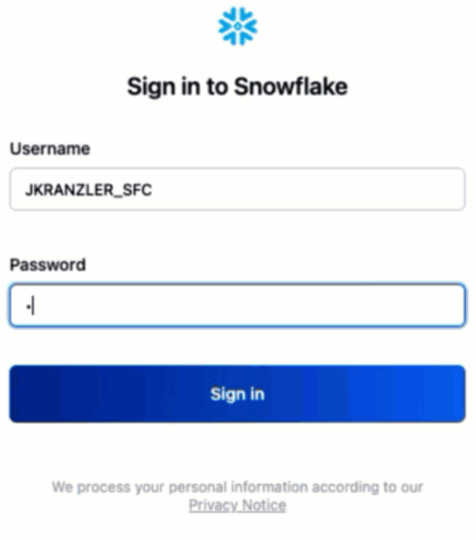
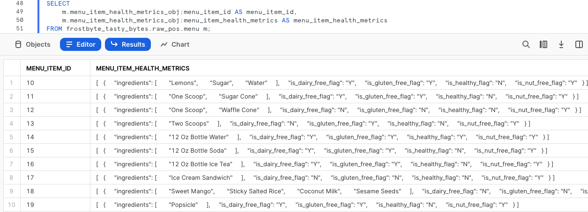
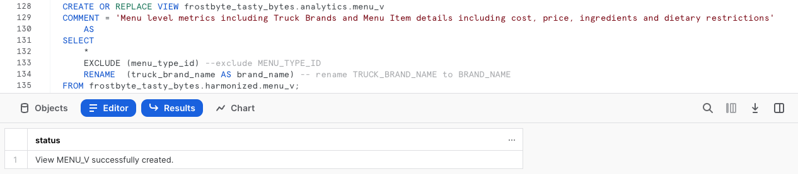

author: Jacob Kranzler
id: tasty_bytes_zero_to_snowflake_semi_structured_data_fr
summary: Tasty Bytes – Débuter avec Snowflake – Données semi-structurées
categories: Tasty-Bytes, Getting-Started, Featured
environments: web
status: Published 
feedback link: https://github.com/Snowflake-Labs/sfguides/issues
tags: Premiers pas, Getting Started, Data Engineering, Data Warehouse, fr

# Tasty Bytes – Débuter avec Snowflake – Données semi-structurées
<!-- ------------------------ -->

## Traitement de données semi-structurées dans Snowflake
Duration: 1 

### Présentation
Bienvenue dans le guide Quickstart Powered by Tasty Bytes Débuter avec Snowflake sur le traitement des données semi-structurées !

Dans ce guide Quickstart, vous allez apprendre à traiter des données semi-structurées dans Snowflake. Vous allez notamment découvrir le type de données VARIANT, comment traiter des données semi-structurées via la notation par points et la fonction d’aplatissement avec vue latérale, comment créer des vues et comment utiliser des graphiques Snowsight.

Pour plus d’informations au sujet des données semi-structurées dans Snowflake, consultez l’article de documentation intitulé [Données semi-structurées](https://docs.snowflake.com/fr/user-guide/semistructured-concepts).

### Conditions préalables
- Avant de commencer, assurez-vous de suivre l’intégralité du guide Quickstart [**Présentation de Tasty Bytes**](https://quickstarts.snowflake.com/guide/tasty_bytes_introduction_fr/index.html), qui explique comment configurer un compte d’essai et déployer les éléments de base de Tasty Bytes requis pour suivre ce guide Quickstart.

### Vous allez apprendre :
- Qu’est-ce que le type de données VARIANT
- Comment utiliser la notation par points pour interroger des données semi-structurées
- Comment aplatir des données semi-structurées
- Comment analyser des tableaux (ARRAY)
- Comment créer une vue
- Comment créer un graphique à partir d’un jeu de résultats dans Snowsight

### Vous allez créer :
- Un processus de données semi-structurées de bout en bout
- Une vue harmonisée (Silver) et d’analyse (Gold)
- Un graphique à barres digne d’un cadre

## Créer une feuille de calcul et la copier dans un fichier SQL
Duration: 1

### Présentation
Dans ce guide Quickstart, vous allez suivre une histoire de Tasty Bytes via une feuille de calcul SQL Snowsight. Cette page, qui fait office de guide étape par étape, comprend également des commentaires, des images et des liens vers de la documentation.

Cette section vous explique comment vous connecter à Snowflake, comment créer une nouvelle feuille de calcul et la renommer, mais aussi comment copier le fichier SQL que nous allons utiliser dans ce guide Quickstart depuis GitHub et le coller.

### Étape 1 – Accéder à Snowflake via une URL
- Ouvrez une fenêtre de votre navigateur et saisissez l’URL de votre compte Snowflake. 

### Étape 2 – Se connecter à Snowflake
- Connectez-vous à votre compte Snowflake.
    - 

### Étape 3 – Accéder aux feuilles de calcul
- Cliquez sur l’onglet Worksheets (Feuilles de calcul) dans la barre de navigation de gauche.
    - 

### Étape 4 – Créer une feuille de calcul
- Sous l’onglet Worksheets (Feuilles de calcul), cliquez sur le bouton « + » dans le coin supérieur droit de Snowsight, puis sélectionnez « SQL Worksheet » (Feuille de calcul SQL).
    - 

### Étape 5 – Renommer une feuille de calcul
- Renommez la feuille de calcul en cliquant sur le nom généré automatiquement (horodatage), puis en saisissant « Tasty Bytes – Données semi-structurées ».
    - 

### Étape 6 – Accéder au fichier SQL de ce guide Quickstart dans GitHub
- Cliquez sur le bouton ci-dessous pour être redirigé vers votre fichier SQL Tasty Bytes hébergé sur GitHub. <button>[tb_zts_semi_structured_data.sql](https://github.com/Snowflake-Labs/sf-samples/blob/main/samples/tasty_bytes/tb_zts_semi_structured_data.sql)</button>

### Étape 7 – Copier le fichier de configuration SQL depuis GitHub
- Dans GitHub, à droite, cliquez sur « Copy raw contents » (Copier le contenu brut). L’ensemble du fichier SQL requis est copié dans votre presse-papiers.
    - 

### Étape 8 – Coller le fichier de configuration SQL depuis GitHub dans une feuille de calcul Snowflake
- Revenez dans Snowsight et dans votre nouvelle feuille de calcul, puis collez (*CMD + V pour Mac ou CTRL + V pour Windows*) ce que vous venez de copier dans GitHub.

### Étape 9 – Cliquer sur Next (Suivant) -->

## Établir le profil des données de menu semi-structurées
Duration: 1

### Présentation
En tant que data engineers de Tasty Bytes, il nous a été demandé d’établir le profil de nos données de menu, qui doit inclure une colonne pour les données semi-structurées. Depuis cette table de menu, nous devons créer une vue de couche d’analyse qui affiche les données relatives aux ingrédients et aux restrictions alimentaires pour nos utilisateurs finaux.

### Étape 1 – Définir le contexte et interroger la table
Commençons par exécuter en même temps les trois premières requêtes qui permettront de : – Définir le contexte du rôle sur `tasty_data_engineer` – Définir le contexte de l’entrepôt sur `tasty_de_wh` – Produire un jeu de résultats avec une requête [TOP](https://docs.snowflake.com/fr/sql-reference/constructs/top_n) 10 de notre table `raw_pos.menu`

``` 
USE ROLE tasty_data_engineer; 
USE WAREHOUSE tasty_de_wh;

SELECT TOP 10
    m.truck_brand_name, 
    m.menu_type, m.menu_item_name, 
    m.menu_item_health_metrics_obj 
FROM frostbyte_tasty_bytes.raw_pos.menu m; 
```


Les résultats renvoyés nous montrent que `menu_item_health_metrics_obj` doit correspondre aux données semi-structurées censées contenir les indicateurs que nous devons fournir en aval. 

Si vous cliquez sur l’une des cellules de cette colonne, Snowsight développera automatiquement le volet des statistiques pour vous en donner un meilleur aperçu.


### Étape 2 – Explorer la colonne de données semi-structurées
Pour examiner de plus près comment cette colonne est définie dans Snowflake, exécutez la requête suivante, qui nous permet d’exploiter la commande [SHOW COLUMNS](https://docs.snowflake.com/fr/sql-reference/sql/show-columns) pour explorer les types de données figurant dans notre table `menu`.

```
SHOW COLUMNS IN frostbyte_tasty_bytes.raw_pos.menu;
```


Dans notre jeu de résultats, nous constatons que `menu_item_health_metrics_obj` est un type de données [VARIANT](https://docs.snowflake.com/fr/sql-reference/data-types-semistructured).

>aside positive Pour les données qui sont le plus souvent régulières et n’utilisent que des types de données natifs pour le format semi-structuré que vous utilisez (chaînes et entiers pour le format JSON), les exigences de stockage et les performances de requête pour les opérations sur les données relationnelles et les données dans une colonne VARIANT sont très similaires.
>

### Étape 3 – Parcourir des données semi-structurées à l’aide de la notation par points
Dans notre colonne `menu_item_health_metrics_obj`, nous avons vu que `menu_item_id` était inclus avec les données relatives aux ingrédients et aux restrictions alimentaires les plus imbriquées auxquelles nous devons accéder. 

Exécutez la requête suivante, qui nous permet de commencer à utiliser la [notation par points](https://docs.snowflake.com/fr/user-guide/querying-semistructured#dot-notation) pour parcourir nos données semi-structurées.

```
SELECT 
    m.menu_item_health_metrics_obj:menu_item_id AS menu_item_id,
    m.menu_item_health_metrics_obj:menu_item_health_metrics AS menu_item_health_metrics
FROM frostbyte_tasty_bytes.raw_pos.menu m;
```



Grâce à la notation par points, nous avons pu extraire complètement `menu_item_id`, mais il semble qu’il reste encore des objets semi-structurés supplémentaires dans la sortie de la colonne `menu_item_health_metrics`. 

Cliquons de nouveau sur l’une des cellules de cette colonne pour en examiner le contenu plus en détail.


**Nous progressons !** Dans la prochaine section, voyons comment nous pouvons aller plus loin dans le traitement de `menu_item_health_metrics` en utilisant d’autres fonctions Snowflake.

### Étape 4 – Cliquer sur Next (Suivant) -->

## Aplatir des données semi-structurées
Duration: 2

### Présentation
Après avoir vu comment nous pouvons facilement interroger des données semi-structurées qui figurent dans une colonne VARIANT à l’aide de la notation par points, en tant que data engineer chez Tasty Bytes, vous êtes bien parti pour fournir aux parties prenantes internes les données qu’elles vous ont demandées.

Dans cette section, nous allons procéder à un traitement plus poussé des données semi-structurées afin de répondre à certains besoins.

### Étape 1 – Découvrir la fonction d’aplatissement avec vue latérale
Cette fonction permet d’extraire de notre colonne `menu_item_health_metrics_obj` davantage de données demandées par nos utilisateurs en aval. Exécutez la requête suivante, qui utilise la fonctionnalité de notation par points dont nous venons de parler, avec les fonctions d’aplatissement ([FLATTEN](https://docs.snowflake.com/fr/sql-reference/functions/flatten)) et de jointure latérale ([LATERAL JOIN](https://docs.snowflake.com/fr/sql-reference/constructs/join-lateral)) de Snowflake pour nous fournir le premier ARRAY `ingredient` qu’on nous a demandé.

>aside positive **FLATTEN :** fonction de table qui prend une colonne VARIANT, OBJECT ou ARRAY et produit une vue latérale. La fonction FLATTEN peut être utilisée pour convertir des données semi-structurées en une représentation relationnelle.
>
>**LATERAL JOIN :** contrairement à la sortie d’une jointure non latérale, la sortie d’une jointure latérale ne comprend que les lignes générées à partir de la vue en ligne. Les lignes du côté gauche n’ont pas besoin d’être reliées au côté droit, car les lignes du côté gauche ont déjà été prises en compte en étant passées dans la vue en ligne. 
>

```
SELECT 
    m.menu_item_name,
    obj.value:"ingredients"::VARIANT AS ingredients
FROM frostbyte_tasty_bytes.raw_pos.menu m,
    LATERAL FLATTEN (input => m.menu_item_health_metrics_obj:menu_item_health_metrics) obj;
```


### Étape 2 – Explorer une fonction de tableau (ARRAY)
Avant que nous procédions à l’extraction des données requises relatives aux restrictions alimentaires, exécutez la requête suivante, à l’aide de la fonction de tableau Snowflake [ARRAY_CONTAINS](https://docs.snowflake.com/fr/sql-reference/functions/array_contains), qui vous permettra d’explorer la colonne `ingredients` pour tout `menu_item_name` qui contient de la laitue.

```
SELECT 
    m.menu_item_name,
    obj.value:"ingredients"::VARIANT AS ingredients
FROM frostbyte_tasty_bytes.raw_pos.menu m,
    LATERAL FLATTEN (input => m.menu_item_health_metrics_obj:menu_item_health_metrics) obj
WHERE ARRAY_CONTAINS('Lettuce'::VARIANT, obj.value:"ingredients"::VARIANT);
```


Les résultats renvoyés nous montrent que plusieurs de nos éléments de menu incluent de la laitue. Ce type d’analyse serait très utile aux Procurement Managers de notre chaîne d’approvisionnement en cas de rappels d’aliments dans les villes et pays dans lesquels nous intervenons.

### Étape 3 – Structurer des données semi-structurées à grande échelle
Après avoir vu le type de valeur ajoutée que nous pouvons déjà apporter à notre organisation, nous pouvons maintenant exécuter la dernière requête de cette section. 

Cette requête utilisera la notation par points, ainsi que notre double fonction de table LATERAL JOIN et FLATTEN, pour fournir le jeu de résultats que l’on nous a initialement demandé de générer.

```
SELECT 
    m.menu_item_health_metrics_obj:menu_item_id::integer AS menu_item_id,
    m.menu_item_name,
    obj.value:"ingredients"::VARIANT AS ingredients,
    obj.value:"is_healthy_flag"::VARCHAR(1) AS is_healthy_flag,
    obj.value:"is_gluten_free_flag"::VARCHAR(1) AS is_gluten_free_flag,
    obj.value:"is_dairy_free_flag"::VARCHAR(1) AS is_dairy_free_flag,
    obj.value:"is_nut_free_flag"::VARCHAR(1) AS is_nut_free_flag
FROM frostbyte_tasty_bytes.raw_pos.menu m,
    LATERAL FLATTEN (input => m.menu_item_health_metrics_obj:menu_item_health_metrics) obj;
```


**Parfait !** Ces résultats semblent être conformes aux besoins exacts de nos parties prenantes. Dans la section suivante, nous allons voir comment nous pouvons mettre à profit ces résultats dans notre couche d’analyse, où ils peuvent être consultés par nos parties prenantes.

### Étape 4 – Cliquer sur Next (Suivant) -->

## Créer des vues structurées à partir de données semi-structurées
Duration: 2

### Présentation
Dans la section précédente, nous avons créé une requête qui fournit les résultats exacts requis par nos utilisateurs finaux à l’aide d’une suite de fonctionnalités de données semi-structurées Snowflake. Nous allons poursuivre le processus qui consiste à mettre à profit cette requête qui se trouve dans notre couche brute vers la couche harmonisée, puis dans la couche d’analyse, d’où nos utilisateurs finaux sont autorisés à lire des données.

**Remarque :** pour les habitués des modèles de données Bronze, Silver et Gold, ces derniers correspondent, respectivement, aux couches brute, harmonisée et d’analyse.

### Étape 1 – Créer une vue harmonisée à l’aide de la requête SQL d’aplatissement des données semi-structurées
En reprenant la requête exacte de la fin de la section précédente, exécutez la requête suivante, qui contient cette requête SQL ainsi que toutes les autres colonnes de la table `menu` déjà structurées. 

Dans cette requête, nous utilisons la commande [CREATE VIEW](https://docs.snowflake.com/fr/sql-reference/sql/create-view) dans notre schéma harmonisé pour encapsuler la logique de traitement des données semi-structurées et d’autres colonnes sous forme de table.

>aside positive Une vue permet de consulter le résultat d’une requête comme s’il s’agissait d’une table. Les vues servent à diverses fins, notamment à combiner, séparer ou protéger des données. 
>

```
CREATE OR REPLACE VIEW frostbyte_tasty_bytes.harmonized.menu_v
    AS
SELECT 
    m.menu_id,
    m.menu_type_id,
    m.menu_type,
    m.truck_brand_name,
    m.menu_item_health_metrics_obj:menu_item_id::integer AS menu_item_id,
    m.menu_item_name,
    m.item_category,
    m.item_subcategory,
    m.cost_of_goods_usd,
    m.sale_price_usd,
    obj.value:"ingredients"::VARIANT AS ingredients,
    obj.value:"is_healthy_flag"::VARCHAR(1) AS is_healthy_flag,
    obj.value:"is_gluten_free_flag"::VARCHAR(1) AS is_gluten_free_flag,
    obj.value:"is_dairy_free_flag"::VARCHAR(1) AS is_dairy_free_flag,
    obj.value:"is_nut_free_flag"::VARCHAR(1) AS is_nut_free_flag
FROM frostbyte_tasty_bytes.raw_pos.menu m,
    LATERAL FLATTEN (input => m.menu_item_health_metrics_obj:menu_item_health_metrics) obj;
```


La vue `harmonized.menu_v` étant créée, nous pourrions désormais l’interroger directement sans avoir à exploiter la requête SQL plus complexe que nous avons utilisée pour la créer. Toutefois, étant donné que la couche d’analyse est celle où nos parties prenantes consultent des données, passons à l’étape suivante pour insérer la requête dans cette couche.

### Étape 2 – Utiliser la requête de la couche harmonisée dans la couche d’analyse en toute simplicité
À partir de la vue `harmonized.menu_v`, exécutez la requête suivante pour créer notre vue `analytics.menu_v`, qui commencera immédiatement à créer de la valeur en aval. 

Dans cette requête, nous voyons de nouvelles fonctions dont nous n’avons pas encore parlé. Nous ajoutons tout d’abord une fonction [COMMENT](https://docs.snowflake.com/fr/sql-reference/sql/comment), visible dans les commandes de [SHOW VIEWS](https://docs.snowflake.com/fr/sql-reference/sql/show) ou dans l’interface Snowsight, pour documenter ce qu’un utilisateur peut voir lorsqu’il interroge cette vue.

Nous utilisons également les paramètres [SELECT * EXCLUDE et RENAME](https://docs.snowflake.com/fr/sql-reference/sql/select#parameters), qui peuvent faciliter la vie des développeurs SQL en simplifiant la définition de la requête ou de la vue.

>aside positive **EXCLUDE :** lorsque vous sélectionnez toutes les colonnes (SELECT * ou SELECT table_name.\*), EXCLUDE spécifie les colonnes à exclure des résultats.
>
> **RENAME :** lorsque vous sélectionnez toutes les colonnes (SELECT * ou SELECT table_name.\*), RENAME spécifie les alias de colonnes qui doivent être utilisés dans les résultats.
>



### Étape 3 – Cliquer sur Next (Suivant) -->

## Analyser des données semi-structurées traitées dans Snowsight
Duration: 2

### Présentation
Notre vue de menu étant disponible dans notre couche d’analyse, interrogeons-la en exécutant plusieurs requêtes qui montreront à nos utilisateurs finaux comment Snowflake crée une expérience de requête relationnelle à partir de données semi-structurées sans avoir à en faire des copies supplémentaires ou à les traiter de manière complexe.

### Étape 1 – Analyser des tableaux (ARRAY)
La requête de la section précédente a renvoyé la colonne `ingredients`, mais celle-ci est désormais disponible sans aucune exigence en matière de notation par points dans notre vue `analytics.menu_v`. 

Avec cette vue, vous devez désormais exécuter la requête suivante, qui exploite deux autres fonctions de tableau Snowflake, [ARRAY_INTERSECTION](https://docs.snowflake.com/fr/sql-reference/functions/array_intersection) et [ARRAYS_OVERLAP](https://docs.snowflake.com/fr/sql-reference/functions/arrays_overlap), pour voir quels éléments de menu hors boissons se chevauchent pour chacun des menus de nos marques de food trucks.

```
SELECT 
    m1.menu_type,
    m1.menu_item_name,
    m2.menu_type AS overlap_menu_type,
    m2.menu_item_name AS overlap_menu_item_name,
    ARRAY_INTERSECTION(m1.ingredients, m2.ingredients) AS overlapping_ingredients
FROM frostbyte_tasty_bytes.analytics.menu_v m1
JOIN frostbyte_tasty_bytes.analytics.menu_v m2
    ON m1.menu_item_id <> m2.menu_item_id -- avoid joining the same menu item to itself
    AND m1.menu_type <> m2.menu_type 
WHERE 1=1
    AND m1.item_category <> 'Beverage' -- remove beverages
    AND m2.item_category <> 'Beverage' -- remove beverages
    AND ARRAYS_OVERLAP(m1.ingredients, m2.ingredients) -- evaluates to TRUE if one ingredient is in both arrays
ORDER BY m1.menu_type;
```


De nouveau, en utilisant exactement la vue que nous avons créée, ce type de requête pourrait apporter une véritable valeur commerciale aux opérateurs de nos food trucks, en les aidant à prévoir et commander les ingrédients dont ils ont besoin chaque semaine.

### Étape 2 – Fournir des indicateurs aux dirigeants
Essayons maintenant d’aider les dirigeants de Tasty Bytes à prendre des décisions au sujet des menus basées sur les données, en leur fournissant des indicateurs globaux relatifs aux restrictions alimentaires que nous gérons actuellement dans l’ensemble de nos marques.

Exécutez la requête suivante, qui utilise les fonctions [COUNT](https://docs.snowflake.com/fr/sql-reference/functions/count), [SUM](https://docs.snowflake.com/fr/sql-reference/functions/sum) et [CASE](https://docs.snowflake.com/fr/sql-reference/functions/case) (conditionnelle) pour agréger les indicateurs requis depuis notre vue `analytics.menu_v`.

```
SELECT
    COUNT(DISTINCT menu_item_id) AS total_menu_items,
    SUM(CASE WHEN is_healthy_flag = 'Y' THEN 1 ELSE 0 END) AS healthy_item_count,
    SUM(CASE WHEN is_gluten_free_flag = 'Y' THEN 1 ELSE 0 END) AS gluten_free_item_count,
    SUM(CASE WHEN is_dairy_free_flag = 'Y' THEN 1 ELSE 0 END) AS dairy_free_item_count,
    SUM(CASE WHEN is_nut_free_flag = 'Y' THEN 1 ELSE 0 END) AS nut_free_item_count
FROM frostbyte_tasty_bytes.analytics.menu_v m;
```


Les résultats que nous venons de recevoir prouvent que nous sommes parvenus à passer d’une table brute contenant des données semi-structurées à une seule ligne agrégée, à laquelle tous les membres de notre organisation peuvent accéder afin d’aider Tasty Bytes à adopter un modèle davantage axé sur les données. 


### Étape 3 – Convertir des résultats en graphiques
Certains des dirigeants de Tasty Bytes préfèrent des représentations visuelles des données. Voyons à quel point il est facile de convertir des résultats renvoyés sous forme de tableau en graphiques visuels faciles à assimiler dans Snowsight. 

Avec la requête SQL que nous avons précédemment utilisée, exécutez la requête suivante, qui ajoute des filtres sur trois noms de nos marques de camionnettes.

```
SELECT
    m.brand_name,
    SUM(CASE WHEN is_gluten_free_flag = 'Y' THEN 1 ELSE 0 END) AS gluten_free_item_count,
    SUM(CASE WHEN is_dairy_free_flag = 'Y' THEN 1 ELSE 0 END) AS dairy_free_item_count,
    SUM(CASE WHEN is_nut_free_flag = 'Y' THEN 1 ELSE 0 END) AS nut_free_item_count
FROM frostbyte_tasty_bytes.analytics.menu_v m
WHERE m.brand_name IN  ('Plant Palace', 'Peking Truck','Revenge of the Curds')
GROUP BY m.brand_name;
```


Par défaut, Snowsight renvoie les résultats des requêtes sous forme de tableau. Cependant, Snowsight contient une fonctionnalité efficace dont nous n’avons pas encore parlé, l’[utilisation des graphiques](https://docs.snowflake.com/fr/user-guide/ui-snowsight-visualizations#using-charts).

Suivez les flèches figurant sur la capture d’écran ci-dessous pour créer un graphique à barres qui compare les éléments de menu de ces différentes marques de food truck concernant certaines restrictions alimentaires.


Pour terminer ce guide Quickstart, nous devons préciser à quel point il serait facile pour un dirigeant de Tasty Bytes de réaliser lui-même ce type d’analyse sans avoir à connaître la logique de traitement des données semi-structurées que nous avons encapsulée dans les vues que nous avons créées. Nous sommes ainsi sûrs de participer au développement de la démocratisation des données au sein de l’organisation Tasty Bytes.

### Étape 4 – Cliquer sur Next (Suivant) -->

## Conclusion et étapes suivantes
Duration: 1

### Conclusion
Beau travail ! Vous avez terminé le guide Quickstart Tasty Bytes Débuter avec Snowflake sur les données semi-structurées. 

Vous avez : - Découvert ce qu’est le type de données VARIANT - Utilisé la notation par points pour interroger des données semi-structurées - Aplati des données semi-structurées - Analysé des tableaux (ARRAY) - Créé deux vues - Créé un graphique à partir d’un jeu de résultats dans Snowsight

Si vous voulez recommencer ce guide Quickstart, utilisez les scripts de réinitialisation en bas de votre feuille de calcul associée.

### Prochaines étapes
Pour continuer à découvrir le Data Cloud Snowflake, cliquez sur le lien ci-dessous pour voir tous les autres guides Quickstart Powered by Tasty Bytes à votre disposition.

- ### [Table des matières des guides Quickstart Powered by Tasty Bytes](/guide/tasty_bytes_introduction_fr/index.html#3)
