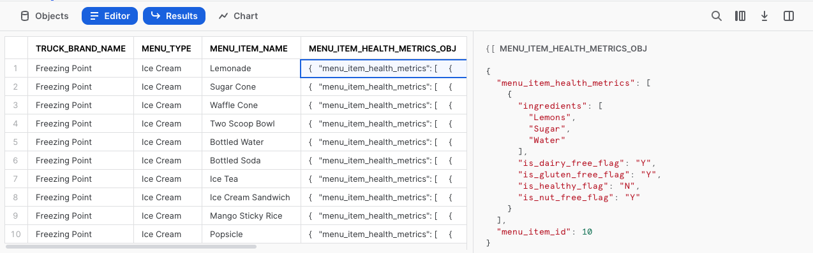
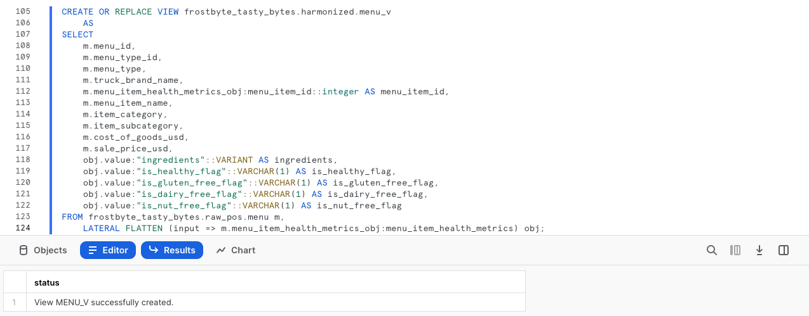
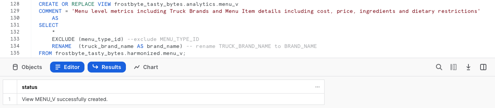
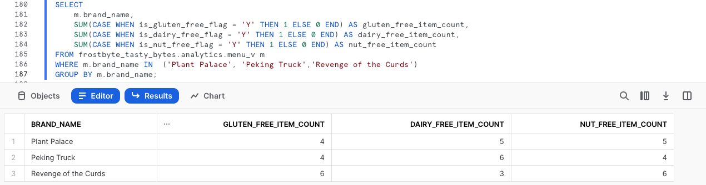

author: Jacob Kranzler
id: tasty_bytes_zero_to_snowflake_semi_structured_data_it
summary: Quickstart Tasty Bytes - Da zero a Snowflake - Dati semi-strutturati categorie: Tasty-Bytes, Guida-introduttiva, In-evidenza
categories: Tasty-Bytes, Getting-Started, Featured
environments: web
status: Published 
feedback link: https://github.com/Snowflake-Labs/sfguides/issues
tags: Guida introduttiva, Getting Started, Data Engineering, Data Warehouse, it

# Tasty Bytes - Da zero a Snowflake - Dati semi-strutturati
<!-- ------------------------ -->

## Elaborazione dei dati semi-strutturati in Snowflake
Duration: 1 

### Panoramica
Questo quickstart Powered by Tasty Bytes - Da zero a Snowflake è dedicato all’elaborazione dei dati semi-strutturati.

Nel corso del quickstart impareremo come elaborare i dati semi-strutturati in Snowflake esaminando il tipo di dati VARIANT, come elaborare i dati semi-strutturati con una combinazione di notazione punto e appiattimento laterale e come creare viste e grafici in Snowsight.

Per maggiori dettagli sui dati semi-strutturati in Snowflake, consulta la [documentazione introduttiva sui dati semi-strutturati](https://docs.snowflake.com/en/user-guide/semistructured-concepts)

### Prerequisiti
- Prima di iniziare, assicurati di avere completato il [**quickstart Introduzione a Tasty Bytes**](https://quickstarts.snowflake.com/guide/tasty_bytes_introduction/index.html), che spiega nei dettagli come configurare un account di prova e implementare l’ambiente base di Tasty Bytes necessario per completare questo quickstart.

### Cosa imparerai
- Che cos’è il tipo di dati VARIANT
- Come utilizzare la notazione punto per interrogare i dati semi-strutturati
- Come appiattire i dati semi-strutturati
- Come analizzare gli array
- Come creare una vista
- Come creare un grafico a partire da un set di risultati in Snowsight

### Cosa realizzerai
- Un processo di gestione dei dati semi-strutturati end-to-end
- Una vista armonizzata (Silver) e analitica (Gold)
- Un grafico a barre utile per i dirigenti

## Creare un foglio di lavoro e copiare il codice SQL
Duration: 1

### Panoramica
In questo quickstart seguiremo la storia del cliente Tasty Bytes attraverso un foglio di lavoro SQL di Snowsight, utilizzando questa pagina come guida completa di commenti aggiuntivi, immagini e link alla documentazione.

In questa sezione vedremo nei dettagli come accedere a Snowflake, creare un nuovo foglio di lavoro, rinominarlo, copiare da GitHub il codice SQL che utilizzeremo in questo quickstart e incollarlo nel foglio di lavoro.

### Passaggio 1 - Accedere a Snowflake tramite URL
- Apri una finestra del browser e inserisci l’URL del tuo account Snowflake 

### Passaggio 2 - Effettuare l’accesso a Snowflake
- Accedi al tuo account Snowflake.
    - 

### Passaggio 3 - Accedere ai fogli di lavoro
- Fai clic sulla scheda Worksheets nella barra di navigazione sulla sinistra.
    - 

### Passaggio 4 - Creare un foglio di lavoro
- Nella scheda Worksheets, fai clic sul pulsante “+” nell’angolo superiore destro di Snowsight e scegli “SQL Worksheet”
    - 

### Passaggio 5 - Rinominare un foglio di lavoro
- Rinomina il foglio di lavoro facendo clic sul nome generato automaticamente (data e ora) e inserendo “Tasty Bytes - Semi-Structured Data”
    - 

### Passaggio 6 - Accedere al codice SQL di questo quickstart in GitHub
- Fai clic sul pulsante qui sotto, che ti porterà al file SQL di Tasty Bytes archiviato su GitHub. <button>[tb_zts_semi_structured_data.sql](https://github.com/Snowflake-Labs/sf-samples/blob/main/samples/tasty_bytes/tb_zts_semi_structured_data.sql)</button>

### Passaggio 7 - Copiare la configurazione SQL da GitHub
- In GitHub, vai sul lato destro e fai clic su “Copy raw contents”. Tutto il codice SQL necessario verrà copiato nei tuoi Appunti.
    - 

### Passaggio 8 - Incollare la configurazione SQL da GitHub nel tuo foglio di lavoro Snowflake
- Torna a Snowsight e al foglio di lavoro che hai appena creato e incolla (*CMD + V per Mac o CTRL + V per Windows*) il codice che abbiamo appena copiato da GitHub.

### Passaggio 9 - Fai clic su Next -->

## Profilare i dati semi-strutturati dei menu
Duration: 1

### Panoramica
Nel ruolo di data engineer di Tasty Bytes, siamo stati incaricati di profilare i dati dei nostri menu, che includono una colonna di dati semi-strutturati. Da questa tabella dei menu dobbiamo produrre una vista del layer analitico che metta a disposizione dei nostri utenti finali i dati relativi alle restrizioni dietetiche e agli ingredienti.

### Passaggio 1 - Impostare il contesto ed eseguire query sulla tabella
Per iniziare, eseguiamo insieme le prime tre query per:
- Impostare il contesto del ruolo su `tasty_data_engineer`
- Impostare il contesto del warehouse su `tasty_de_wh`
- Produrre un set di risultati [TOP](https://docs.snowflake.com/en/sql-reference/constructs/top_n) 10 dalla tabella `raw_pos.menu`

``` 
USE ROLE tasty_data_engineer; 
USE WAREHOUSE tasty_de_wh;

SELECT TOP 10 m.truck_brand_name, m.menu_type, m.menu_item_name, m.menu_item_health_metrics_obj FROM frostbyte_tasty_bytes.raw_pos.menu m; 
```


Nell’output ottenuto, vediamo che la colonna `menu_item_health_metrics_obj` riporta i dati semi-strutturati che contengono le metriche che dobbiamo fornire a valle. 

Facendo clic in una delle celle di questa colonna, vedremo che Snowsight espande automaticamente il pannello delle statistiche per fornirci una visuale migliore del contenuto.



### Passaggio 2 - Esplorare la colonna di dati semi-strutturati
Per approfondire il modo in cui questa colonna è definita in Snowflake, esegui la prossima query, in cui utilizziamo [SHOW COLUMNS](https://docs.snowflake.com/en/sql-reference/sql/show-columns) per esplorare i tipi di dati contenuti nella tabella `menu`.

```
SHOW COLUMNS IN frostbyte_tasty_bytes.raw_pos.menu;
```


Esaminando il set di risultati, vediamo che i dati in `menu_item_health_metrics_obj` sono di tipo [VARIANT](https://docs.snowflake.com/en/sql-reference/data-types-semistructured).

>aside positive
Per dati generalmente regolari che utilizzano solo tipi di dati nativi del formato semi-strutturato in uso (ad es. string e integer per il formato JSON), i requisiti di storage e le prestazioni delle query per le operazioni sui dati relazionali e sui dati in una colonna VARIANT sono molto simili.
>

### Passaggio 3 - Attraversare i dati semi-strutturati utilizzando la notazione punto
Abbiamo visto che la colonna `menu_item_health_metrics_obj` includeva `menu_item_id` insieme ai dati più nidificati degli ingredienti e delle restrizioni dietetiche che ci servono. 

Esegui la prossima query, in cui iniziamo a utilizzare la [notazione punto](https://docs.snowflake.com/en/user-guide/querying-semistructured#dot-notation) per attraversare i dati semi-strutturati.

```
SELECT 
    m.menu_item_health_metrics_obj:menu_item_id AS menu_item_id,
    m.menu_item_health_metrics_obj:menu_item_health_metrics AS menu_item_health_metrics
FROM frostbyte_tasty_bytes.raw_pos.menu m;
```


Utilizzando la notazione punto siamo riusciti a estrarre completamente `menu_item_id`, ma a quanto pare rimangono ancora altri oggetti semi-strutturati nell’output della colonna `menu_item_health_metrics`. 

Facciamo nuovamente clic in una delle celle di questa colonna per esaminarla nei dettagli.


**Stiamo facendo progressi!** Nella prossima sezione vedremo come possiamo elaborare ulteriormente `menu_item_health_metrics` utilizzando altre funzioni di Snowflake.

### Passaggio 4 - Fai clic su Next -->

## Appiattire i dati semi-strutturati
Duration: 2

### Panoramica
Dopo avere visto come interrogare facilmente i dati semi-strutturati contenuti in una colonna Variant utilizzando la notazione punto, il nostro data engineer di Tasty Bytes è sulla buona strada per fornire ai suoi stakeholder interni i dati che hanno richiesto.

In questa sezione elaboreremo ulteriormente i dati semi-strutturati per soddisfare i requisiti.

### Passaggio 1 - Introduzione all’appiattimento laterale
Per estrarre dalla colonna `menu_item_health_metrics_obj` i dati richiesti dagli utenti a valle, esegui la prossima query, che utilizza la funzionalità di notazione punto che abbiamo appena visto insieme alle funzioni [FLATTEN](https://docs.snowflake.com/en/sql-reference/functions/flatten) e [LATERAL JOIN](https://docs.snowflake.com/en/sql-reference/constructs/join-lateral) di Snowflake per fornirci il primo array`ingredient` che ci è stato richiesto.

>aside positive
**Flatten:** una funzione per tabelle che produce una vista laterale a partire da una colonna VARIANT, OBJECT o ARRAY. La funzione Flatten può essere utilizzata per convertire dati semi-strutturati in una rappresentazione relazionale.
>
>**Lateral Join:** a differenza dell’output di un join non laterale, l’output di un join laterale include solo le righe generate dalla vista in linea. Non è necessario fare il join delle righe sul lato sinistro con quelle sul lato destro, poiché le righe sul lato sinistro sono già state incluse passandole alla vista in linea. 
>

```
SELECT 
    m.menu_item_name,
    obj.value:"ingredients"::VARIANT AS ingredients
FROM frostbyte_tasty_bytes.raw_pos.menu m,
    LATERAL FLATTEN (input => m.menu_item_health_metrics_obj:menu_item_health_metrics) obj;
```


### Passaggio 2 - Esplorare una funzione per array
Prima di estrarre i dati sulle restrizioni dietetiche richiesti, esegui la prossima query, in cui viene evidenziata una funzione per array di Snowflake che esplora la colonna `ingredients` alla ricerca di qualsiasi `menu_item_name` che contiene “Lettuce” utilizzando [ARRAY_CONTAINS](https://docs.snowflake.com/en/sql-reference/functions/array_contains).

```
SELECT 
    m.menu_item_name,
    obj.value:"ingredients"::VARIANT AS ingredients
FROM frostbyte_tasty_bytes.raw_pos.menu m,
    LATERAL FLATTEN (input => m.menu_item_health_metrics_obj:menu_item_health_metrics) obj
WHERE ARRAY_CONTAINS('Lettuce'::VARIANT, obj.value:"ingredients"::VARIANT);
```


Osservando l’output, vediamo che numerose voci di menu contengono “Lettuce”. Questo tipo di analisi potrebbe essere molto utile ai responsabili degli acquisti in caso di richiami di prodotti alimentari nelle città e nei Paesi che supportiamo.

### Passaggio 3 - Strutturare i dati semi-strutturati su larga scala
Ora che abbiamo visto che tipo di valore possiamo già offrire alla nostra organizzazione, eseguiamo l’ultima query di questa sezione. 

Questa query utilizza la notazione punto e la combinazione delle funzioni Lateral Join e Flatten Table per fornire il risultato che ci era stato chiesto di produrre.

```
SELECT 
    m.menu_item_health_metrics_obj:menu_item_id::integer AS menu_item_id,
    m.menu_item_name,
    obj.value:"ingredients"::VARIANT AS ingredients,
    obj.value:"is_healthy_flag"::VARCHAR(1) AS is_healthy_flag,
    obj.value:"is_gluten_free_flag"::VARCHAR(1) AS is_gluten_free_flag,
    obj.value:"is_dairy_free_flag"::VARCHAR(1) AS is_dairy_free_flag,
    obj.value:"is_nut_free_flag"::VARCHAR(1) AS is_nut_free_flag
FROM frostbyte_tasty_bytes.raw_pos.menu m,
    LATERAL FLATTEN (input => m.menu_item_health_metrics_obj:menu_item_health_metrics) obj;
```


**Fantastico!** Questo output soddisfa esattamente i requisiti dei nostri stakeholder. Nella prossima sezione vedremo come promuovere questa query al layer analitico in cui potranno accedervi.

### Passaggio 4 - Fai clic su Next -->

## Creare viste strutturate dei dati semi-strutturati
Duration: 2

### Panoramica
Nella sezione precedente abbiamo creato una query che fornisce esattamente l’output richiesto dai nostri utenti finali utilizzando una serie di funzionalità di Snowflake per i dati semi-strutturati. Ora vedremo il processo da seguire per promuovere questa query dal layer dei dati grezzi a quello armonizzato e infine a quello analitico, in cui gli utenti finali dispongono dei privilegi necessari per leggere i risultati.

**Nota:** per chi ha più familiarità con i modelli Bronze, Silver e Gold, il layer dei dati grezzi corrisponde a Bronze, il layer armonizzato a Silver e il layer analitico a Gold.

### Passaggio 1 - Creare la vista armonizzata utilizzando il codice SQL per l’appiattimento dei dati semi-strutturati
Partendo dalla stessa query con cui abbiamo concluso la sezione precedente, esegui la prossima query, che contiene questo codice SQL più tutte le altre colonne della tabella `menu` già strutturate. 

In questa query utilizziamo [CREATE VIEW](https://docs.snowflake.com/en/sql-reference/sql/create-view) nello schema armonizzato per incapsulare la logica di elaborazione dei dati semi-strutturati e le colonne aggiuntive in una tabella.

>aside positive
Una vista consente di accedere al risultato di una query come se fosse una tabella. Le viste possono essere utilizzate per vari scopi, tra cui combinare, separare e proteggere i dati. 
>

```
CREATE OR REPLACE VIEW frostbyte_tasty_bytes.harmonized.menu_v
    AS
SELECT 
    m.menu_id,
    m.menu_type_id,
    m.menu_type,
    m.truck_brand_name,
    m.menu_item_health_metrics_obj:menu_item_id::integer AS menu_item_id,
    m.menu_item_name,
    m.item_category,
    m.item_subcategory,
    m.cost_of_goods_usd,
    m.sale_price_usd,
    obj.value:"ingredients"::VARIANT AS ingredients,
    obj.value:"is_healthy_flag"::VARCHAR(1) AS is_healthy_flag,
    obj.value:"is_gluten_free_flag"::VARCHAR(1) AS is_gluten_free_flag,
    obj.value:"is_dairy_free_flag"::VARCHAR(1) AS is_dairy_free_flag,
    obj.value:"is_nut_free_flag"::VARCHAR(1) AS is_nut_free_flag
FROM frostbyte_tasty_bytes.raw_pos.menu m,
    LATERAL FLATTEN (input => m.menu_item_health_metrics_obj:menu_item_health_metrics) obj;
```



Ora che abbiamo creato la vista `harmonized.menu_v`, possiamo interrogarla direttamente senza ricorrere al codice SQL più complesso che abbiamo utilizzato al suo interno. Tuttavia, poiché i nostri stakeholder accedono ai dati dal layer analitico, eseguiamo il prossimo passaggio per trasferire la vista a tale layer.

### Passaggio 2 - Promuovere facilmente dal layer armonizzato al layer analitico
Facendo riferimento a `harmonized.menu_v`, ora esegui la prossima query per creare la vista `analytics.menu_v`, che inizierà immediatamente a fornire valore a valle. 

In questa query vediamo alcune nuove funzioni che non abbiamo ancora trattato. Per prima cosa aggiungiamo un commento ([COMMENT](https://docs.snowflake.com/en/sql-reference/sql/comment)), che può essere visualizzato nei comandi [SHOW VIEWS](https://docs.snowflake.com/en/sql-reference/sql/show) o nell’interfaccia Snowsight per documentare ciò che un utente potrebbe vedere quando interroga questa vista.

Utilizziamo inoltre i parametri [SELECT * EXCLUDE e RENAME](https://docs.snowflake.com/en/sql-reference/sql/select#parameters), che possono facilitare molto il compito degli sviluppatori SQL riducendo la complessità della definizione di una query o di una vista.

>aside positive
**Exclude:** quando si selezionano tutte le colonne (SELECT * o SELECT nome_tabella.\*), EXCLUDE specifica le colonne da escludere dai risultati.
>
> **Rename:** quando si selezionano tutte le colonne (SELECT * o SELECT nome_tabella.\*), specifica gli alias delle colonne da utilizzare nei risultati.
>



### Passaggio 3 - Fai clic su Next -->

## Analizzare dati semi-strutturati elaborati in Snowsight
Duration: 2

### Panoramica
Con la vista menu disponibile nel layer analitico, eseguiamo alcune query su questa vista che forniremo ai nostri utenti finali e che mostrano come Snowflake consente di ottenere l’esperienza di una query relazionale su dati semi-strutturati senza dover creare copie aggiuntive o eseguire elaborazioni complesse.

### Passaggio 1 - Analizzare gli array
Nella sezione precedente abbiamo visto la colonna `ingredients` come risultato di una query, ma ora è disponibile senza bisogno di utilizzare la notazione punto nella vista `analytics.menu_v`. 

Con questa vista, ora esegui la prossima query, che sfrutta altre due funzioni per array di Snowflake, [ARRAY_INTERSECTION](https://docs.snowflake.com/en/sql-reference/functions/array_intersection) e [ARRAYS_OVERLAP](https://docs.snowflake.com/en/sql-reference/functions/arrays_overlap), per vedere quali delle voci di menu che non sono bevande si sovrappongono per ciascuno dei menu dei vari marchi dei food truck.

```
SELECT 
    m1.menu_type,
    m1.menu_item_name,
    m2.menu_type AS overlap_menu_type,
    m2.menu_item_name AS overlap_menu_item_name,
    ARRAY_INTERSECTION(m1.ingredients, m2.ingredients) AS overlapping_ingredients
FROM frostbyte_tasty_bytes.analytics.menu_v m1
JOIN frostbyte_tasty_bytes.analytics.menu_v m2
    ON m1.menu_item_id <> m2.menu_item_id -- avoid joining the same menu item to itself
    AND m1.menu_type <> m2.menu_type 
WHERE 1=1
    AND m1.item_category <> 'Beverage' -- remove beverages
    AND m2.item_category <> 'Beverage' -- remove beverages
    AND ARRAYS_OVERLAP(m1.ingredients, m2.ingredients) -- evaluates to TRUE if one ingredient is in both arrays
ORDER BY m1.menu_type;
```


Di nuovo, utilizzando esattamente la vista che abbiamo creato, questo tipo di query potrebbe fornire valore ai nostri operatori di food truck in situazioni reali quando lavorano con il reparto acquisti per prevedere e ordinare gli ingredienti necessari ogni settimana.

### Passaggio 2 - Fornire metriche ai dirigenti
Ora vediamo come aiutare i dirigenti di Tasty Bytes a prendere decisioni sui menu basate sui dati con metriche di alto livello sulle restrizioni dietetiche attualmente utilizzate per i nostri diversi marchi.

Esegui la prossima query, che utilizza istruzioni [COUNT](https://docs.snowflake.com/en/sql-reference/functions/count) e [SUM](https://docs.snowflake.com/en/sql-reference/functions/sum) e istruzioni [CASE](https://docs.snowflake.com/en/sql-reference/functions/case) condizionali per aggregare le metriche richieste provenienti dalla vista `analytics.menu_v`.

```
SELECT
    COUNT(DISTINCT menu_item_id) AS total_menu_items,
    SUM(CASE WHEN is_healthy_flag = 'Y' THEN 1 ELSE 0 END) AS healthy_item_count,
    SUM(CASE WHEN is_gluten_free_flag = 'Y' THEN 1 ELSE 0 END) AS gluten_free_item_count,
    SUM(CASE WHEN is_dairy_free_flag = 'Y' THEN 1 ELSE 0 END) AS dairy_free_item_count,
    SUM(CASE WHEN is_nut_free_flag = 'Y' THEN 1 ELSE 0 END) AS nut_free_item_count
FROM frostbyte_tasty_bytes.analytics.menu_v m;
```


Con l’output che abbiamo appena ricevuto, siamo passati da una tabella grezza contenente dati semi-strutturati a un’unica riga aggregata a cui chiunque nella nostra organizzazione può accedere facilmente, per potenziare Tasty Bytes e renderla più orientata ai dati. 


### Passaggio 3 - Trasformare i risultati in grafici
Dato che alcuni dei nostri dirigenti di Tasty Bytes preferiscono rappresentazioni visive dei dati, vediamo ora come è facile trasformare i risultati tabellari in grafici visivi facili da comprendere all’interno di Snowsight. 

Esegui la prossima query, che aggiunge filtri per tre dei nostri marchi al codice SQL che abbiamo eseguito in precedenza.

```
SELECT
    m.brand_name,
    SUM(CASE WHEN is_gluten_free_flag = 'Y' THEN 1 ELSE 0 END) AS gluten_free_item_count,
    SUM(CASE WHEN is_dairy_free_flag = 'Y' THEN 1 ELSE 0 END) AS dairy_free_item_count,
    SUM(CASE WHEN is_nut_free_flag = 'Y' THEN 1 ELSE 0 END) AS nut_free_item_count
FROM frostbyte_tasty_bytes.analytics.menu_v m
WHERE m.brand_name IN  ('Plant Palace', 'Peking Truck','Revenge of the Curds')
GROUP BY m.brand_name;
```



Di default, Snowsight restituisce i risultati delle query sotto forma di tabelle. Tuttavia, una potente funzionalità di Snowsight che non abbiamo ancora trattato è l’[utilizzo dei grafici](https://docs.snowflake.com/en/user-guide/ui-snowsight-visualizations#using-charts)

Ora segui le frecce nella schermata qui sotto per creare un grafico a barre che mette a confronto le voci di menu per determinate restrizioni dietetiche dei diversi marchi di food truck.


Per completare questo quickstart, dobbiamo evidenziare la facilità con cui un dirigente di Tasty Bytes potrebbe svolgere questo tipo di analisi autonomamente, senza bisogno di sapere nulla dell’elaborazione dei dati semi-strutturati che abbiamo incapsulato nelle nostre viste. In questo modo possiamo essere sicuri di avere contribuito alla democratizzazione dei dati all’interno di Tasty Bytes.

### Passaggio 4 - Fai clic su Next -->

## Conclusione e fasi successive
Duration: 1

### Conclusione
Ottimo lavoro! Hai completato il quickstart Tasty Bytes - Da zero a Snowflake - Dati semi-strutturati. 

In questo quickstart hai:
- Imparato che cos’è il tipo di dati VARIANT
- Utilizzato la notazione punto per interrogare i dati semi-strutturati
- Appiattito dati semi-strutturati
- Analizzato array
- Creato due viste
- Creato un grafico a partire da un set di risultati in Snowsight

Se desideri ripetere questo quickstart, usa gli script di ripristino alla fine del foglio di lavoro associato.

### Fasi successive
Per continuare il tuo percorso nel Data Cloud di Snowflake, visita il link qui sotto per vedere tutti gli altri quickstart Powered by Tasty Bytes disponibili.

- ### [Quickstart Powered by Tasty Bytes - Sommario](/guide/tasty_bytes_introduction_it/index.html#3)
