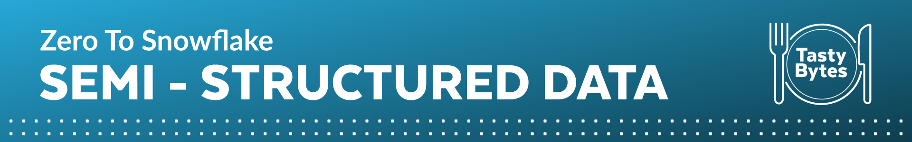
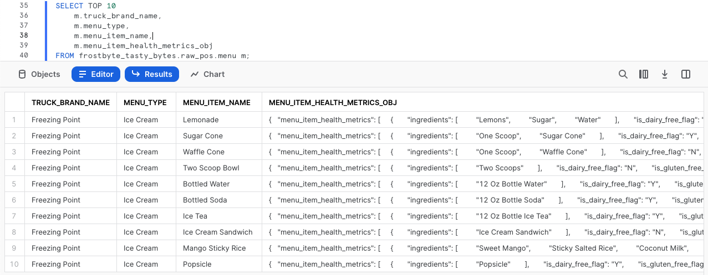
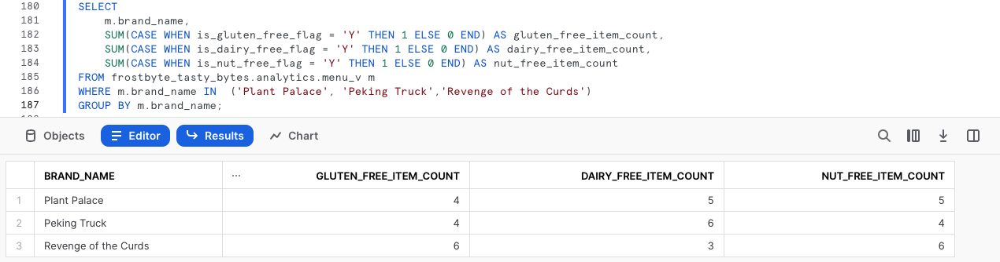
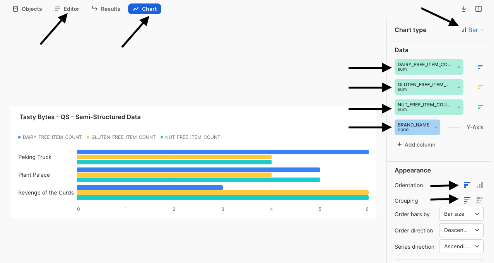

author: Jacob Kranzler
id: tasty_bytes_zero_to_snowflake_semi_structured_data_ja
summary: Tasty Bytes - ゼロからのSnowflake - 半構造化データクックスタート
categories: Tasty-Bytes, Getting-Started, Featured
environments: web
status: Published 
feedback link: https://github.com/Snowflake-Labs/sfguides/issues
tags: Getting Started, Data Engineering, Data Warehouse, ja

# Tasty Bytes - ゼロからのSnowflake - 半構造化データ

<!-- ------------------------ -->
## Snowflakeにおける半構造化データ処理
Duration: 1


### 概要
Powered by Tasty Bytes - ゼロからのSnowflakeクイックスタートへようこそ。今回は半構造化データ処理を中心的に取り上げます。

このクイックスタートでは、VARIANTデータ型、ドット表記とラテラルフラット化を組み合わせた半構造化データ処理、ビューの作成、Snowsightチャートを詳しく調べることにより、Snowflakeにおける半構造化データの処理について学習します。

Snowflakeにおける半構造化データの詳細については、[半構造化データの概要ドキュメンテーション](https://docs.snowflake.com/en/user-guide/semistructured-concepts)を参照してください。

### 前提条件
- 開始する前に、本クイックスタートを完了するために必要なトライアルアカウントのセットアップとTasty Bytes基盤の展開について説明している[**Tasty Bytesの紹介クイックスタート**](https://quickstarts.snowflake.com/guide/tasty_bytes_introduction/index.html)を完了しておくようにしてください。

### 学習する内容
- バリアントデータ型について
- ドット表記を使用して半構造化データをクエリする方法
- 半構造化データをフラット化する方法
- 配列の分析方法
- ビューの作成方法
- Snowsightで結果セットからチャートを構築する方法

### 構築するもの
- エンドツーエンドの半構造化データプロセス
- 整合（シルバー）と分析（ゴールド）のビュー
- 幹部にふさわしい棒チャート

## ワークシートの作成とSQLのコピー
Duration: 1

### 概要
このクイックスタートでは、Snowsight SQLワークシートを使ってTasty Bytesをテーマとしたストーリーを追っていきます。このページには、横に置いて活用できるよう、追加の解説、画像、ドキュメントリンクが掲載されています。

本セクションでは、Snowflakeへのログイン、新しいワークシートの作成、ワークシートの名前の変更、GitHubからのSQLのコピー、このクイックスタートで利用するSQLの貼り付けについて説明します。

### ステップ1 - URLでSnowflakeにアクセスする
- ブラウザウィンドウを開き、SnowflakeアカウントのURLを入力します

### ステップ2 - Snowflakeにログインする
- Snowflakeアカウントにログインします。
  - 

### ステップ3 - ワークシートに移動する
- 左側のナビゲーションバーにある「ワークシート」タブをクリックします。
  - 

### ステップ4 - ワークシートを作成する
- ワークシート内で、Snowsightの右上にある「+」ボタンをクリックし、「SQLワークシート」を選択します。
  - 

### ステップ5 - ワークシートの名前を変更する
- 自動生成されたタイムスタンプ名をクリックし、「Tasty Bytes - 半構造化データ」と入力してワークシートの名前を変更します。
  - 

### ステップ6 - GitHubでQuickstart SQLにアクセスする
- 下のボタンをクリックすると、GitHubでホストされているTasty BytesのSQLファイルに移動します。
<button>[tb_zts_semi_structured_data.sql](https://github.com/Snowflake-Labs/sf-samples/blob/main/samples/tasty_bytes/tb_zts_semi_structured_data.sql)</button>

### ステップ7 - GitHubからSetup SQLをコピーする
- GitHub内で右側に移動し、「未加工コンテンツをコピー」をクリックします。これで、必要なSQLがすべてクリップボードにコピーされます。
  - 

### ステップ8 - GitHubからSnowflakeワークシートにSetup SQLを貼り付ける
- Snowsightと新しく作成したワークシートに戻り、先ほどGitHubからコピーしたものを貼り付けます（*Macの場合はCMD + V、Windowsの場合はCTRL + V*）。

### ステップ9 - 「Next」クリックする

## 半構造化メニューデータのプロファイリング
Duration: 1

### 概要
Tasty Bytesのデータエンジニアとして、私たちは半構造化データ列を含むメニューデータのプロファイリングを任されました。このメニューテーブルから、食事と成分のデータをエンドユーザーに公開する分析レイヤービューを作成する必要があります。

### ステップ1 - コンテキストを設定しテーブルをクエリする
はじめに、最初の3つのクエリを一緒に実行してみましょう。これらのクエリによって以下が実行されます。
- ロールコンテキストを`tasty_data_engineer`に設定する
- ウェアハウスコンテキストを`tasty_de_wh`に設定する
- `raw_pos.menu`テーブルの [TOP](https://docs.snowflake.com/en/sql-reference/constructs/top_n) 10の結果セットを生成する

```
USE ROLE tasty_data_engineer;
USE WAREHOUSE tasty_de_wh;

SELECT TOP 10
    m.truck_brand_name,
    m.menu_type,
    m.menu_item_name,
    m.menu_item_health_metrics_obj
FROM frostbyte_tasty_bytes.raw_pos.menu m;
```



出力の中で、`menu_item_health_metrics_obj`が、私たちがダウンストリームに提供する必要があるメトリックが含まれていると伝えられていた半構造化データであることがわかります。

この列のセルをクリックすると、Snowsightによって統計ペインが自動的に展開され、内容がわかりやすい形式で表示されます。


### ステップ2 - 半構造化列を調査する
この列がSnowflakeでどのように定義されているかを詳しく調べるには、次のクエリを実行し、[SHOW COLUMNS](https://docs.snowflake.com/en/sql-reference/sql/show-columns)を活用して`menu`テーブルに存在するデータ型を調べてください。

```
SHOW COLUMNS IN frostbyte_tasty_bytes.raw_pos.menu;
```


結果セットを見ると、`menu_item_health_metrics_obj`は[VARIANT](https://docs.snowflake.com/en/sql-reference/data-types-semistructured)データ型であることが分かります。

>aside positive
> ほとんどが規則的でネイティブから半構造化形式のデータ型（例：JSON形式用の文字列と整数）のみを使用するデータの場合、リレーショナルデータとVARIANT列のデータに対するストレージ要件とクエリパフォーマンスは非常に似ています。
>

### ステップ3 - ドット表記を使用して半構造化データを走査する
`menu_item_health_metrics_obj`列には、`menu_item_id`が、より深くネストされた原材料および食事制限データと一緒に含まれています。私たちはこれらのデータにアクセスする必要があります。

次のクエリを実行し、[ドット表記](https://docs.snowflake.com/en/user-guide/querying-semistructured#dot-notation)を活用して半構造化データを走査してください。

```
SELECT 
    m.menu_item_health_metrics_obj:menu_item_id AS menu_item_id,
    m.menu_item_health_metrics_obj:menu_item_health_metrics AS menu_item_health_metrics
FROM frostbyte_tasty_bytes.raw_pos.menu m;
```


ドット表記を使用することで、`menu_item_id`を完全に抽出することには成功しましたが、`menu_item_health_metrics`列の出力には追加の半構造化オブジェクトがまだ残っているようです。

もう1度、この列のセルをクリックして、さらに詳しく見てみましょう。


**しっかり進んでいますね！** 次のセクションでは、追加のSnowflake関数を使って`menu_item_health_metrics`の処理を進める方法を見ていきましょう。

### ステップ4 - 「Next」クリックする

## 半構造化データのフラット化
Duration: 2

### 概要
ドット表記を使用して、Variant列に存在する半構造化データを簡単にクエリできる方法が分かりました。社内のステークホルダーに要求されたデータを提供するというTastyのデータエンジニアのタスクは順調に進んでいます。

このセクションでは、要件を満たすために追加の半構造化データ処理を実行します。

### ステップ1 - Lateral Flattenへの導入
下流ユーザーが求めているデータを`menu_item_health_metrics_obj`列から抽出するために、次のクエリを実行してください。ここでは、先ほど説明したドット表記機能とともに、Snowflakesの[FLATTEN](https://docs.snowflake.com/en/sql-reference/functions/flatten)関数と[LATERAL JOIN](https://docs.snowflake.com/en/sql-reference/constructs/join-lateral)機能を利用して、求められている最初の`ingredient`配列を取得します。

>aside positive
> **フラット化：** VARIANT、OBJECT、またはARRAY列を受け取り、ラテラルビューを生成するテーブル関数です。フラット化は、半構造化データをリレーショナル表現に変換するために使用できます。
> 
> **ラテラル結合：** 非ラテラル結合の出力とは異なり、ラテラル結合の出力には、インラインビューから生成された行のみが含まれます。左側の行は、インラインビューに渡されることで既に考慮されているため、左側の行を右側に結合する必要はありません。
>

```
SELECT 
    m.menu_item_name,
    obj.value:"ingredients"::VARIANT AS ingredients
FROM frostbyte_tasty_bytes.raw_pos.menu m,
    LATERAL FLATTEN (input => m.menu_item_health_metrics_obj:menu_item_health_metrics) obj;
```


### ステップ2 - 配列関数を調査する
求められた食事データを抽出する前に、次のクエリを開始してください。ここでは、Snowflake配列関数に着目し、[ARRAY_CONTAINS](https://docs.snowflake.com/en/sql-reference/functions/array_contains)を活用してレタスを含む`menu_item_name`の`ingredients`列を探っていきます。

```
SELECT 
    m.menu_item_name,
    obj.value:"ingredients"::VARIANT AS ingredients
FROM frostbyte_tasty_bytes.raw_pos.menu m,
    LATERAL FLATTEN (input => m.menu_item_health_metrics_obj:menu_item_health_metrics) obj
WHERE ARRAY_CONTAINS('Lettuce'::VARIANT, obj.value:"ingredients"::VARIANT);
```


出力を見ると、相当数のメニューにレタスが含まれていることが分かります。このような分析は、私たちがサポートする都市や国で食品関連のリコールが発生した場合に、サプライチェーン調達マネージャーにとって非常に価値のあるものとなります。

### ステップ3 - 半構造化データを大規模に構造化する
組織に対してどのような価値を提供できるかを確認したところで、次に、このセクションの最後のクエリを実行しましょう。

このクエリでは、ドット表記、ならびにラテラル結合とフラット化を組み合わせたテーブル関数を使用して、最初に生成するように指示された結果セットを提供します。

```
SELECT 
    m.menu_item_health_metrics_obj:menu_item_id::integer AS menu_item_id,
    m.menu_item_name,
    obj.value:"ingredients"::VARIANT AS ingredients,
    obj.value:"is_healthy_flag"::VARCHAR(1) AS is_healthy_flag,
    obj.value:"is_gluten_free_flag"::VARCHAR(1) AS is_gluten_free_flag,
    obj.value:"is_dairy_free_flag"::VARCHAR(1) AS is_dairy_free_flag,
    obj.value:"is_nut_free_flag"::VARCHAR(1) AS is_nut_free_flag
FROM frostbyte_tasty_bytes.raw_pos.menu m,
    LATERAL FLATTEN (input => m.menu_item_health_metrics_obj:menu_item_health_metrics) obj;
```


**すばらしい！** この出力は、ステークホルダーが要求した要件を正確に満たしていると言えるでしょう。次のセクションでは、この出力をどのように分析レイヤーに昇格させ、ステークホルダーがアクセスできるようにするかを検討していきます。

### ステップ4 - 「Next」をクリックする

## 半構造化データに対する構造化ビューの作成
Duration: 2

### 概要
前のセクションでは、一連のSnowflakeの半構造化データ機能を使用して、エンドユーザーが必要とする正確な出力を提供するクエリを構築しました。次に、このクエリを未加工レイヤーから整合レイヤーを経て最終的にはエンドユーザーが読み取ることができる分析レイヤーに昇格させるプロセスを追います。

**注意：** ブロンズ、シルバー、ゴールドのデータモデルに馴染みのある人は、未加工をブロンズ、整合をシルバー、分析をゴールドと捉えることができます。

### ステップ1 - 半構造化のフラット化SQLを使用してハーモナイズビューを作成する
前セクションの最後に出てきたクエリをそのまま利用し、次のクエリを実行してください。ここには、このSQLの他に、既に構造化された追加の`menu`テーブルの列がすべて含まれています。

このクエリでは、整合スキーマで[CREATE VIEW](https://docs.snowflake.com/en/sql-reference/sql/create-view)を使用し、半構造化処理ロジックと追加の列をテーブルとしてカプセル化します。

>aside positive
> ビューを使用すると、クエリの結果にテーブルのようにアクセスできます。  ビューは、データの結合、分離、保護など、さまざまな目的に役立ちます。
>

```
CREATE OR REPLACE VIEW frostbyte_tasty_bytes.harmonized.menu_v
    AS
SELECT 
    m.menu_id,
    m.menu_type_id,
    m.menu_type,
    m.truck_brand_name,
    m.menu_item_health_metrics_obj:menu_item_id::integer AS menu_item_id,
    m.menu_item_name,
    m.item_category,
    m.item_subcategory,
    m.cost_of_goods_usd,
    m.sale_price_usd,
    obj.value:"ingredients"::VARIANT AS ingredients,
    obj.value:"is_healthy_flag"::VARCHAR(1) AS is_healthy_flag,
    obj.value:"is_gluten_free_flag"::VARCHAR(1) AS is_gluten_free_flag,
    obj.value:"is_dairy_free_flag"::VARCHAR(1) AS is_dairy_free_flag,
    obj.value:"is_nut_free_flag"::VARCHAR(1) AS is_nut_free_flag
FROM frostbyte_tasty_bytes.raw_pos.menu m,
    LATERAL FLATTEN (input => m.menu_item_health_metrics_obj:menu_item_health_metrics) obj;
```


`harmonized.menu_v`ビューが作成されたことにより、ビュー内で使用した複雑なSQLを活用することなく、直接ビューにクエリを実行できるようになりました。しかし、ステークホルダーがデータにアクセスする場所は分析レイヤーであるため、次のステップを実行してこれを作成しましょう。

### ステップ2 - ハーモナイズから簡単に分析へ昇格させる
`harmonized.menu_v`を参照しながら、次のクエリを実行してください。このクエリは、ダウンストリームに即座に価値を提供し始める`analytics.menu_v`を作成します。

このクエリには、まだ説明していない新しい関数がいくつか含まれています。まず、[SHOW VIEWS](https://docs.snowflake.com/en/sql-reference/sql/show)コマンドまたはSnowsightインターフェイス内で見られる[COMMENT](https://docs.snowflake.com/en/sql-reference/sql/comment)を追加しを追加しています。これは、ユーザーがこのビューをクエリしたときに表示される内容を文書化する関数です。

また、[SELECT * EXCLUDEおよびRENAME](https://docs.snowflake.com/en/sql-reference/sql/select#parameters)パラメータを利用し、クエリやビュー定義の複雑さを軽減することで、SQL開発者の作業を大幅に簡略化することもできます。

>aside positive
> **除外：** すべての列を選択する場合（SELECT \*またはSELECT table_name.\*）、EXCLUDEは、結果から除外する列を指定します。
> 
> **名前を変更：** すべての列を選択する場合（SELECT \*またはSELECT table_name.\*）、結果で使用すべき列エイリアスを指定します。
>


### ステップ3 - 「Next」をクリックする

## Snowsightで処理された半構造化データの分析
Duration: 2

### 概要
分析レイヤーでメニュービューが利用できるようになりました。次に、私たちがエンドユーザーに提供するいくつかのクエリを実行することで、Snowflakeでは追加のコピーや複雑な処理を行うことなく、半構造化データに対して強力なリレーショナルクエリを実行できることを示しましょう。

### ステップ 1 - 配列を分析する
前のセクションでは、`ingredients`列がクエリ結果として表示されましたが、ここでは、ドット表記なしで`analytics.menu_v`ビューで利用できるようになりました。

ここで、次のクエリを実行してください、ここでは、[ARRAY_INTERSECTION](https://docs.snowflake.com/en/sql-reference/functions/array_intersection)と[ARRAYS_OVERLAP](https://docs.snowflake.com/en/sql-reference/functions/arrays_overlap)という2つの追加のSnowflake配列関数を活用し、キッチンカーブランドの各メニューで重複している飲料以外のメニュー項目を確認します。

```
SELECT 
    m1.menu_type,
    m1.menu_item_name,
    m2.menu_type AS overlap_menu_type,
    m2.menu_item_name AS overlap_menu_item_name,
    ARRAY_INTERSECTION(m1.ingredients, m2.ingredients) AS overlapping_ingredients
FROM frostbyte_tasty_bytes.analytics.menu_v m1
JOIN frostbyte_tasty_bytes.analytics.menu_v m2
    ON m1.menu_item_id <> m2.menu_item_id -- avoid joining the same menu item to itself
    AND m1.menu_type <> m2.menu_type 
WHERE 1=1
    AND m1.item_category <> 'Beverage' -- remove beverages
    AND m2.item_category <> 'Beverage' -- remove beverages
    AND ARRAYS_OVERLAP(m1.ingredients, m2.ingredients) -- evaluates to TRUE if one ingredient is in both arrays
ORDER BY m1.menu_type;
```


ここでもまた、私たちが構築したビューをそのまま使用することで、この種のクエリからキッチンカー事業者に実際のビジネス価値がもたらされます。毎週の調達業務の際に必要な食材を予測して注文できるようになるからです。

### ステップ2 - 幹部にメトリックを提供する
次に、私たちがブランド全体で現在取り組んでいる食事制限に関する高レベルのメトリックを提供することで、Tasty Bytesの幹部がメニューについてデータドリブンな意思決定を下せるようにしましょう。

次のクエリを実行してください。ここでは、[COUNT](https://docs.snowflake.com/en/sql-reference/functions/count)、[SUM](https://docs.snowflake.com/en/sql-reference/functions/sum)、および条件付き[CASE](https://docs.snowflake.com/en/sql-reference/functions/case)ステートメントを利用して`analytics.menu_v`から必要なメトリックを集約します。

```
SELECT
    COUNT(DISTINCT menu_item_id) AS total_menu_items,
    SUM(CASE WHEN is_healthy_flag = 'Y' THEN 1 ELSE 0 END) AS healthy_item_count,
    SUM(CASE WHEN is_gluten_free_flag = 'Y' THEN 1 ELSE 0 END) AS gluten_free_item_count,
    SUM(CASE WHEN is_dairy_free_flag = 'Y' THEN 1 ELSE 0 END) AS dairy_free_item_count,
    SUM(CASE WHEN is_nut_free_flag = 'Y' THEN 1 ELSE 0 END) AS nut_free_item_count
FROM frostbyte_tasty_bytes.analytics.menu_v m;
```


ここで得られた出力により、半構造化データを含む未加工テーブルから、組織内の誰でも簡単にアクセスでき、Tasty Bytesがさらにデータドリブンになるのに役立つ単一の集計行が得られました。


### ステップ3 - 結果をチャート化する
Tasty Bytesの幹部の中にはデータの視覚的表示を望む人もいるため、Snowsight内で表形式の結果を理解しやすい視覚的チャートに変換するのが、どれほど簡単かを見ていきましょう。

次のクエリを実行してください。ここでは、前回実行したSQLに3つのキッチンカーブランド名のフィルターを追加します。

```
SELECT
    m.brand_name,
    SUM(CASE WHEN is_gluten_free_flag = 'Y' THEN 1 ELSE 0 END) AS gluten_free_item_count,
    SUM(CASE WHEN is_dairy_free_flag = 'Y' THEN 1 ELSE 0 END) AS dairy_free_item_count,
    SUM(CASE WHEN is_nut_free_flag = 'Y' THEN 1 ELSE 0 END) AS nut_free_item_count
FROM frostbyte_tasty_bytes.analytics.menu_v m
WHERE m.brand_name IN  ('Plant Palace', 'Peking Truck','Revenge of the Curds')
GROUP BY m.brand_name;
```



デフォルトでは、Snowsightはクエリ結果を表形式で返します。しかし、まだ紹介していませんでしたが、Snowsightの強力な機能の1つに[チャートの使用](https://docs.snowflake.com/en/user-guide/ui-snowsight-visualizations#using-charts)があります。

次のスクリーンショットの矢印に従って、特定の食事制限に対応するメニュー項目についての、これらの各種キッチンカーブランド間の比較を示す棒グラフを作成してください。



このクイックスタートの締めくくりとして、Tasty Bytesの幹部が、私たちが構築したビューでカプセル化された半構造化データ処理について知らなくても、このような分析を自力で簡単に実行できるということを指摘しておく必要があります。これにより、私たちはTasty Bytesの組織においてデータの民主化の推進に貢献しているということに確信を持てます。

### ステップ4 - 「Next」をクリックする

## まとめと次のステップ
Duration: 1

### まとめ
すばらしい出来です！これで、Tasty Bytes - ゼロからのSnowflake - 半構造化データクイックスタートが無事完了しました。

これにより、次のことができるようになりました。
- バリアントデータ型について知る
- ドット表記を使用して半構造化データをクエリする
- 半構造化データをフラット化する
- 配列を分析する
- 2つのビューを作成する
- Snowsightで結果セットからチャートを構築する

このクイックスタートを再実行したい場合は、関連するワークシートの下部にあるリセットスクリプトを利用してください。

### 次のステップ

引き続きSnowflakeデータクラウドについて学習するには、以下のリンクから利用可能なその他すべてのPowered by Taste Bytes - クイックスタートをご覧ください。

- ### [Powered by Tasty Bytes - クイックスタート目次](https://quickstarts.snowflake.com/guide/tasty_bytes_introduction/index.html#3)