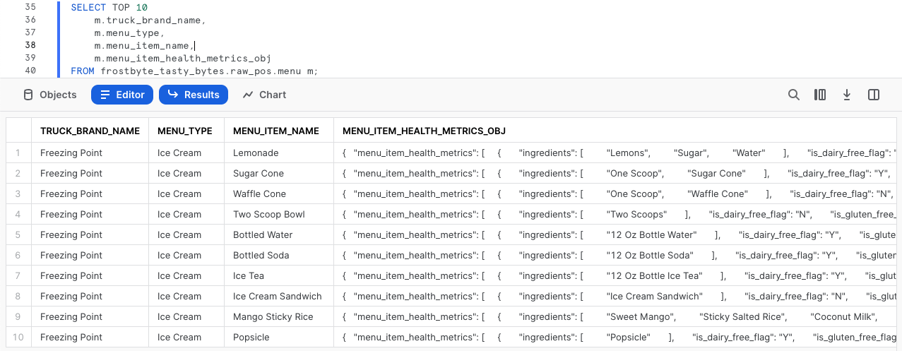
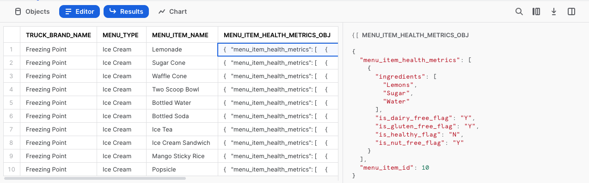
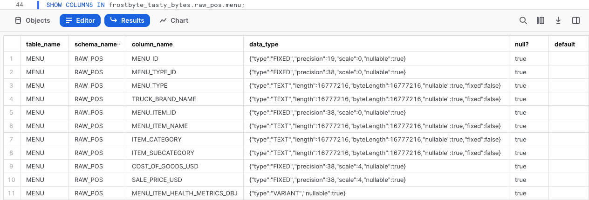
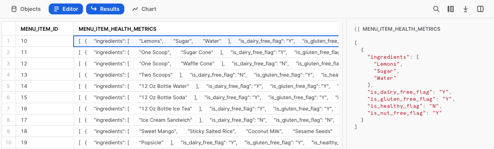

author: Jacob Kranzler
id: tasty_bytes_zero_to_snowflake_semi_structured_data_kr
summary: Tasty Bytes - Zero to Snowflake - Semi-Structured Data Quickstart
categories: Tasty-Bytes, Getting-Started, Featured
environments: web
status: Published 
feedback link: https://github.com/Snowflake-Labs/sfguides/issues
tags: Getting Started, Data Engineering, Data Warehouse, kr

# Tasty Bytes - 제로부터 Snowflake까지 - 반정형 데이터

<!-- ------------------------ -->
## Snowflake에서 반정형 데이터 처리

Duration: 1 

### 개요

반정형 데이터 처리를 집중적으로 다루는 Tasty Bytes 사용 - 제로부터 Snowflake까지 Quickstart에 오신 것을 환영합니다!

이 Quickstart에서는 VARIANT 데이터 유형, 점표기법과 래터럴 평면화를 결합하는 반정형 데이터 처리, 뷰 생성 및 Snowsight 그래프 생성으로 나눠 Snowflake에서 반정형 데이터를 처리하는 것에 대해 알아보겠습니다.

Snowflake의 반정형 데이터에 대한 상세 정보는 [반정형 데이터 개요 설명서](https://docs.snowflake.com/ko/user-guide/semistructured-concepts)에서 확인하십시오.

### 사전 필요 조건 및 지식

- 시작하기 전에 평가판 계정 설정과 이 Quickstart를 완료하기 위해 필요한 Tasty Bytes 기초를 배포하는 것을 안내하는 [**Tasty Bytes 소개 Quickstart**](/guide/tasty_bytes_introduction_kr/index.html)를 완료하십시오.

### 알아볼 내용

- VARIANT 데이터 유형의 정의
- 반정형 데이터를 쿼리하기 위해 점표기법 사용하기
- 반정형 데이터 평면화하기
- 배열 분석하기
- 뷰 생성하기
- Snowsight의 결과 세트에서 그래프 구축하기

### 구축할 것

- 엔드 투 엔드 반정형 데이터 처리
- 조정(실버) 및 분석(골드) 뷰
- 경영진을 위한 막대형 그래프

## 워크시트 생성 및 SQL 복사

Duration: 1

### 개요

이 Quickstart에서는 Snowsight SQL 워크시트를 통해 테마가 Tasty Bytes인 스토리를 따라갈 것입니다. 이 페이지에는 추가 해설, 이미지 및 설명서 링크가 포함되어 있으며 나란히 사용할 수 있는 가이드입니다.

이 섹션은 Snowflake에 로그인하고, 새로운 워크시트를 생성하고, 워크시트의 이름을 바꾸고, SQL을 GitHub에서 복사하고, 이 Quickstart에서 활용할 SQL을 붙여넣는 방법을 안내합니다.

### 1단계 - URL을 통해 Snowflake에 액세스

- 브라우저 창을 열고 Snowflake 계정 URL을 입력합니다.

### 2단계 - Snowflake에 로그인

- Snowflake 계정에 로그인합니다.
  - 


### 3단계 - Worksheets로 이동

- 왼쪽 탐색 메뉴에 있는 Worksheets 탭을 클릭합니다.
  - 


### 4단계 - 워크시트 생성

- Worksheets 내에서 Snowsight 오른쪽 상단 모서리에 있는 ‘+’ 버튼을 클릭하고 ‘SQL Worksheet’를 선택합니다.
  - 


### 5단계 - 워크시트 이름 바꾸기

- 자동으로 생성된 Timestamp 이름을 클릭하고 ‘Tasty Bytes - Semi-Structured Data’를 입력하여 워크시트의 이름을 바꿉니다.
  - 


### 6단계 - GitHub에서 Quickstart SQL에 액세스

- GitHub에서 호스팅된 Tasty Bytes SQL 파일과 연결된 아래 버튼을 클릭합니다. <button>[tb_zts_semi_structured_data.sql](https://github.com/Snowflake-Labs/sf-samples/blob/main/samples/tasty_bytes/tb_zts_semi_structured_data.sql)</button>

### 7단계 - GitHub에서 설정 SQL 복사

- GitHub 내에서 오른쪽으로 이동하여 ‘Copy raw contents’를 클릭합니다. 이렇게 하면 모든 필수 SQL이 클립보드로 복사됩니다.
  - 


### 8단계 - 설정 SQL을 GitHub에서 Snowflake 워크시트로 붙여넣기

- Snowsight 및 새롭게 생성한 워크시트로 되돌아가 방금 GitHub에서 복사한 것을 붙여넣습니다(*Mac 바로 가기 키 CMD + V, Windows 바로 가기 키 CTRL + V*).

### 9단계 - 다음 클릭 -->

## 반정형 메뉴 데이터 프로파일링

Duration: 1

### 개요

Tasty Bytes 데이터 엔지니어는 반정형 데이터 열이 포함된 메뉴 데이터를 프로파일링해야 합니다. 이 메뉴 테이블에서 최종 사용자에게 식사 및 재료 데이터를 노출하는 분석 계층 뷰를 생성해야 합니다.

### 1단계 - 콘텍스트 설정 및 테이블 쿼리

우선 다음 작업을 수행할 첫 3개의 쿼리를 함께 실행하겠습니다.

- 역할 콘텍스트를 `tasty_data_engineer`로 설정
- 웨어하우스 콘텍스트를 `tasty_de_wh`로 설정
- `raw_pos.menu` 테이블의 [TOP](https://docs.snowflake.com/ko/sql-reference/constructs/top_n) 10개 결과 세트 생성

```
USE ROLE tasty_data_engineer;
USE WAREHOUSE tasty_de_wh;

SELECT TOP 10
    m.truck_brand_name,
    m.menu_type,
    m.menu_item_name,
    m.menu_item_health_metrics_obj
FROM frostbyte_tasty_bytes.raw_pos.menu m;
```



출력 내에서 `menu_item_health_metrics_obj`는 다운스트림을 제공해야 하는 지표가 포함되어 있다고 알려진 반정형 데이터여야 합니다.

이 열에서 셀 하나를 클릭하면 Snowsight는 통계 창을 자동으로 확장하여 내부 정보를 더 잘 보여줍니다.



### 2단계 - 반정형 열 탐색

Snowflake에 정의된 이 열을 심층적으로 알아보기 위해 `menu` 테이블에 있는 데이터 유형을 탐색하는 데 [SHOW COLUMNS](https://docs.snowflake.com/ko/sql-reference/sql/show-columns)를 활용하는 다음 쿼리를 실행하십시오.

```
SHOW COLUMNS IN frostbyte_tasty_bytes.raw_pos.menu;
```



결과 세트에서는 `menu_item_health_metrics_obj`가 [VARIANT](https://docs.snowflake.com/ko/sql-reference/data-types-semistructured) 데이터 유형임을 확인할 수 있습니다.

> aside positive 대부분이 일반적이고 사용 중인 반정형 형식의 기본 데이터 유형만 사용하는 데이터의 경우(예: JSON 형식의 경우 문자열 및 정수), VARIANT 열의 관계형 데이터 및 데이터 작업에 대한 스토리지 요구 사항 및 쿼리 성능은 매우 유사합니다.

### 3단계 - 점표기법을 사용하여 반정형 데이터 순회

`menu_item_health_metrics_obj` 열에 `menu_item_id`가 액세스해야 하는 더 중첩된 재료 및 식사 제한 데이터와 포함되어 있는 모습을 확인했습니다.

반정형 데이터를 순회하기 위해 [점표기법](https://docs.snowflake.com/ko/user-guide/querying-semistructured#dot-notation)을 활용하기 시작하는 다음 쿼리를 실행하십시오.

```
SELECT 
    m.menu_item_health_metrics_obj:menu_item_id AS menu_item_id,
    m.menu_item_health_metrics_obj:menu_item_health_metrics AS menu_item_health_metrics
FROM frostbyte_tasty_bytes.raw_pos.menu m;
```


점표기법을 사용하면 `menu_item_id`를 완벽하게 성공적으로 추출할 수 있었지만, `menu_item_health_metrics` 열 출력에는 추가적인 반정형 객체가 아직 남아 있습니다.

또다시 자세히 살펴보기 위해 이 열에 있는 셀 하나를 클릭하겠습니다.



**잘 진행하고 있습니다!** 추가적인 Snowflake 함수를 사용하여 다음 섹션에서 `menu_item_health_metrics`를 추가적으로 처리하는 방법을 알아보겠습니다.

### 4단계 - 다음 클릭 -->

## 반정형 데이터 평면화

Duration: 2

### 개요

점표기법을 사용하여 Variant 열에 있는 반정형 데이터를 얼마나 쉽게 쿼리할 수 있는지 확인했으니 Tasty Bytes 데이터 엔지니어는 내부 이해관계자가 요청한 데이터를 이들에게 제공할 수 있을 것입니다.

이 섹션에서는 요구 사항을 충족하기 위해 추가적인 반정형 데이터 처리를 수행하겠습니다.

### 1단계 - 래터럴 평면화 소개

다운스트림 사용자가 `menu_item_health_metrics_obj` 열에서 요구하는 데이터를 추가적으로 추출하려면 요청받은 첫 번째 `ingredient` 배열을 제공하기 위해 방금 탐색한 점표기법 기능과 Snowflakes [FLATTEN](https://docs.snowflake.com/ko/sql-reference/functions/flatten) 함수 및 [LATERAL JOIN](https://docs.snowflake.com/ko/sql-reference/constructs/join-lateral) 기능을 활용하는 다음 쿼리를 실행하십시오.

> aside positive **평면화:** VARIANT, OBJECT 또는 ARRAY 열을 사용하는 테이블 함수이며 래터럴 뷰를 생성합니다. 평면화는 반정형 데이터를 관계형 표현으로 변환하는 데 사용할 수 있습니다.
> 
> **래터럴 조인:** 래터럴이 아닌 조인의 출력과 달리, 래터럴 조인의 출력에는 인라인 뷰에서 생성된 행만 포함됩니다. 왼쪽의 행은 오른쪽과 결합될 필요가 없습니다. 왼쪽의 행은 인라인 뷰로 전달되어 이미 고려되었기 때문입니다.

```
SELECT 
    m.menu_item_name,
    obj.value:"ingredients"::VARIANT AS ingredients
FROM frostbyte_tasty_bytes.raw_pos.menu m,
    LATERAL FLATTEN (input => m.menu_item_health_metrics_obj:menu_item_health_metrics) obj;
```


### 2단계 - 배열 함수 탐색

요청받은 식사 데이터를 추출하기 전에 Snowflake 배열 함수를 중점적으로 다루는 다음 쿼리를 실행하십시오. 이 함수는 [ARRAY_CONTAINS](https://docs.snowflake.com/ko/sql-reference/functions/array_contains)를 활용하여 상추가 포함된 모든 `menu_item_name`을 위해 `ingredients` 열을 탐색합니다.

```
SELECT 
    m.menu_item_name,
    obj.value:"ingredients"::VARIANT AS ingredients
FROM frostbyte_tasty_bytes.raw_pos.menu m,
    LATERAL FLATTEN (input => m.menu_item_health_metrics_obj:menu_item_health_metrics) obj
WHERE ARRAY_CONTAINS('Lettuce'::VARIANT, obj.value:"ingredients"::VARIANT);
```


출력에 따르면 상추가 포함된 메뉴 항목이 꽤 많습니다. 이러한 분석은 서비스를 제공하는 도시와 국가에서 음식을 회수해야 하는 상황에 공급망 조달 관리자에게 매우 유용할 것입니다.

### 3단계 - 대규모로 반정형 데이터 구조화

이미 조직에 제공할 수 있는 가치를 확인했으니 이제 이 섹션의 마지막 쿼리를 실행하겠습니다.

이 쿼리는 점표기법, 결합된 래터럴 조인 및 평면화 테이블 함수를 사용하여 처음에 생성해 달라고 요청받았던 결과 세트를 제공합니다.

```
SELECT 
    m.menu_item_health_metrics_obj:menu_item_id::integer AS menu_item_id,
    m.menu_item_name,
    obj.value:"ingredients"::VARIANT AS ingredients,
    obj.value:"is_healthy_flag"::VARCHAR(1) AS is_healthy_flag,
    obj.value:"is_gluten_free_flag"::VARCHAR(1) AS is_gluten_free_flag,
    obj.value:"is_dairy_free_flag"::VARCHAR(1) AS is_dairy_free_flag,
    obj.value:"is_nut_free_flag"::VARCHAR(1) AS is_nut_free_flag
FROM frostbyte_tasty_bytes.raw_pos.menu m,
    LATERAL FLATTEN (input => m.menu_item_health_metrics_obj:menu_item_health_metrics) obj;
```


**좋습니다!** 출력이 이해관계자가 요청한 요구 사항을 정확히 충족하는 것 같습니다. 다음 섹션에서는 이 출력에 액세스할 수 있는 분석 계층으로 이를 전달하는 방법을 알아보겠습니다.

### 4단계 - 다음 클릭 -->

## 반정형 데이터에 대한 정형 뷰 생성

Duration: 2

### 개요

마지막 섹션에서는 작업을 진행하는 동안 Snowflake 반정형 데이터 기능 세트를 사용하여 최종 사용자가 요구하는 출력을 정확히 제공하는 쿼리를 만들었습니다. 다음으로 조정을 통해 가공 전 계층으로 이 쿼리를 전달하는 프로세스를 진행하겠습니다. 결과적으로 이는 최종 사용자가 읽기 권한을 보유하고 있는 분석 계층으로 전달됩니다.

**참고:** 브론즈, 실버 및 골드 데이터 모델에 익숙한 사람이라면 가공 전을 브론즈, 조정을 실버, 분석을 골드로 생각하면 됩니다.

### 1단계 - 반정형 평면화 SQL을 사용하여 조정 뷰 생성

마지막 섹션을 끝낼 때 사용한 것과 동일한 쿼리를 사용하여 이제 이 SQL과 이미 구조화된 모든 `menu` 테이블 열을 포함한 다음 쿼리를 실행하십시오.

이 쿼리에서는 조정 스키마에서 [CREATE VIEW](https://docs.snowflake.com/ko/sql-reference/sql/create-view)를 사용하여 반정형 처리 로직과 추가 열을 테이블로 캡슐화합니다.

> aside positive 뷰를 사용하면 이것이 테이블인 것처럼 쿼리 결과에 액세스할 수 있습니다.  뷰는 데이터 결합, 분리 및 보호 등의 다양한 용도로 사용됩니다.

```
CREATE OR REPLACE VIEW frostbyte_tasty_bytes.harmonized.menu_v
    AS
SELECT 
    m.menu_id,
    m.menu_type_id,
    m.menu_type,
    m.truck_brand_name,
    m.menu_item_health_metrics_obj:menu_item_id::integer AS menu_item_id,
    m.menu_item_name,
    m.item_category,
    m.item_subcategory,
    m.cost_of_goods_usd,
    m.sale_price_usd,
    obj.value:"ingredients"::VARIANT AS ingredients,
    obj.value:"is_healthy_flag"::VARCHAR(1) AS is_healthy_flag,
    obj.value:"is_gluten_free_flag"::VARCHAR(1) AS is_gluten_free_flag,
    obj.value:"is_dairy_free_flag"::VARCHAR(1) AS is_dairy_free_flag,
    obj.value:"is_nut_free_flag"::VARCHAR(1) AS is_nut_free_flag
FROM frostbyte_tasty_bytes.raw_pos.menu m,
    LATERAL FLATTEN (input => m.menu_item_health_metrics_obj:menu_item_health_metrics) obj;
```


`harmonized.menu_v` 뷰가 생성되었으니 이제 여기에서 사용한 더 복잡한 SQL을 활용하지 않고도 이를 바로 쿼리할 수 있습니다. 하지만 이해관계자는 분석 계층에서 데이터에 액세스하기에 다음 단계에서 이를 분석 계층에 배치하겠습니다.

### 2단계 - 조정에서 분석으로 쉽게 전달

`harmonized.menu_v`를 참조하여 이제 값을 즉시 다운스트림으로 전달하기 시작하는 `analytics.menu_v`를 생성할 다음 쿼리를 실행하십시오.

이 쿼리에서는 아직 다루지 않은 몇 개의 새로운 함수가 등장합니다. 우선 [COMMENT](https://docs.snowflake.com/ko/sql-reference/sql/comment)를 추가합니다. 이는 [SHOW VIEWS](https://docs.snowflake.com/ko/sql-reference/sql/show) 명령이나 이 뷰를 쿼리할 때 사용자가 보게 될 것을 기록하기 위한 Snowsight 인터페이스에서 확인할 수 있습니다.

또한, 쿼리 또는 뷰 정의의 복잡성을 줄여 SQL 개발자의 삶을 훨씬 더 쉽게 만들 수 있는 [SELECT * EXCLUDE 및 RENAME](https://docs.snowflake.com/ko/sql-reference/sql/select#parameters) 매개변수를 활용합니다.

> aside positive **제외:** 모든 열(SELECT \* 또는 SELECT table_name.\*)을 선택할 때 EXCLUDE는 결과에서 제외해야 하는 열을 지정합니다.
> 
> **이름 바꾸기:** 모든 열(SELECT \* 또는 SELECT table_name.\*)을 선택할 때 결과에 사용해야 하는 열 별칭을 지정합니다.


### 3단계 - 다음 클릭 -->

## Snowsight에서 처리된 반정형 데이터 분석

Duration: 2

### 개요

분석 계층에서 사용할 수 있는 메뉴 뷰를 통해 추가 사본을 만들거나 그 어떠한 복잡한 처리도 수행하지 않고 Snowflake가 반정형 데이터에 대한 관계형 쿼리 경험을 지원하는 방법을 보여주는 최종 사용자에게 제공할 것에 대해 몇 개의 쿼리를 실행하겠습니다.

### 1단계 - 배열 분석

이전 섹션에서 쿼리 결과로 `ingredients` 열을 확인했지만, 이는 이제 `analytics.menu_v` 뷰에서 그 어떠한 점표기법 요구 사항도 없이 제공됩니다.

이를 통해 이제 2개의 추가 Snowflake 배열 함수인 [ARRAY_INTERSECTION](https://docs.snowflake.com/ko/sql-reference/functions/array_intersection) 및 [ARRAYS_OVERLAP](https://docs.snowflake.com/ko/sql-reference/functions/arrays_overlap)을 활용하는 다음 쿼리를 실행하여 각 푸드 트럭 브랜드 메뉴와 겹치는 음료가 아닌 메뉴 항목이 무엇인지 확인하십시오.

```
SELECT 
    m1.menu_type,
    m1.menu_item_name,
    m2.menu_type AS overlap_menu_type,
    m2.menu_item_name AS overlap_menu_item_name,
    ARRAY_INTERSECTION(m1.ingredients, m2.ingredients) AS overlapping_ingredients
FROM frostbyte_tasty_bytes.analytics.menu_v m1
JOIN frostbyte_tasty_bytes.analytics.menu_v m2
    ON m1.menu_item_id <> m2.menu_item_id -- avoid joining the same menu item to itself
    AND m1.menu_type <> m2.menu_type 
WHERE 1=1
    AND m1.item_category <> 'Beverage' -- remove beverages
    AND m2.item_category <> 'Beverage' -- remove beverages
    AND ARRAYS_OVERLAP(m1.ingredients, m2.ingredients) -- evaluates to TRUE if one ingredient is in both arrays
ORDER BY m1.menu_type;
```


또다시 이러한 쿼리를 구축한 동일한 뷰를 사용하면 푸드 트럭 운영자가 매주 필요한 재료를 예측 및 주문하기 위한 조달 작업을 수행함에 따라 실제 비즈니스 가치를 제공할 수 있습니다.

### 2단계 - 경영진에 지표 제공

Tasty Bytes의 여러 브랜드에 걸쳐 현재 해결하고 있는 식사 제한에 관한 개괄적인 지표를 제공하여 Tasty Bytes 경영진이 데이터를 기반으로 메뉴에 대한 결정을 내리는 것을 돕는 방법을 알아보겠습니다.

`analytics.menu_v`에서 필수 지표를 집계하기 위해 [COUNT](https://docs.snowflake.com/ko/sql-reference/functions/count), [SUM](https://docs.snowflake.com/ko/sql-reference/functions/sum) 및 조건 [CASE](https://docs.snowflake.com/ko/sql-reference/functions/case) 문을 활용하는 다음 문을 실행하십시오.

```
SELECT
    COUNT(DISTINCT menu_item_id) AS total_menu_items,
    SUM(CASE WHEN is_healthy_flag = 'Y' THEN 1 ELSE 0 END) AS healthy_item_count,
    SUM(CASE WHEN is_gluten_free_flag = 'Y' THEN 1 ELSE 0 END) AS gluten_free_item_count,
    SUM(CASE WHEN is_dairy_free_flag = 'Y' THEN 1 ELSE 0 END) AS dairy_free_item_count,
    SUM(CASE WHEN is_nut_free_flag = 'Y' THEN 1 ELSE 0 END) AS nut_free_item_count
FROM frostbyte_tasty_bytes.analytics.menu_v m;
```


방금 수신한 출력을 통해 반정형 데이터가 포함된 가공 전 테이블에서 단일 집계 행으로 성공적으로 변환했습니다. 이 행은 더 많은 데이터를 기반으로 한 결정을 내릴 수 있도록 Tasty Bytes를 지원하기 위해 조직 내 모두가 쉽게 액세스할 수 있습니다.

### 3단계 - 결과를 그래프로 변환

일부 Tasty Bytes 경영진은 데이터의 시각적 표현을 선호하기에 이제 표 기반 결과를 Snowsight 내에서 이해하기 쉬운 시각적 그래프로 얼마나 쉽게 만들 수 있는지 알아보겠습니다.

앞서 실행한 SQL에 트럭 브랜드 이름 3개에 대한 필터를 추가하는 다음 쿼리를 실행하십시오.

```
SELECT
    m.brand_name,
    SUM(CASE WHEN is_gluten_free_flag = 'Y' THEN 1 ELSE 0 END) AS gluten_free_item_count,
    SUM(CASE WHEN is_dairy_free_flag = 'Y' THEN 1 ELSE 0 END) AS dairy_free_item_count,
    SUM(CASE WHEN is_nut_free_flag = 'Y' THEN 1 ELSE 0 END) AS nut_free_item_count
FROM frostbyte_tasty_bytes.analytics.menu_v m
WHERE m.brand_name IN  ('Plant Palace', 'Peking Truck','Revenge of the Curds')
GROUP BY m.brand_name;
```


기본값으로 Snowsight는 쿼리 결과를 표 기반 형식으로 반환합니다. 하지만 아직 다루지 않은 Snowsight의 강력한 기능인 [그래프 사용](https://docs.snowflake.com/ko/user-guide/ui-snowsight-visualizations#using-charts)이 있습니다.

이제 아래 스크린샷에 있는 화살표를 따라 각기 다른 푸드 트럭 브랜드가 특정 식사 제한을 해결하기 위해 제공하는 메뉴 항목을 비교하는 막대형 그래프를 생성하십시오.


이 Quickstart를 완료하면서 Tasty Bytes 경영진이 스스로 이러한 분석을 수행하는 것이 얼마나 쉬운지 강조하고 싶습니다. 경영진은 구축한 뷰에 캡슐화한 반정형 데이터 처리에 대해 아무것도 알 필요가 없습니다. 이렇게 Tasty Bytes 조직에서 데이터 민주화를 촉진하는 것을 도왔습니다.

### 4단계 - 다음 클릭 -->

## 종료 및 다음 단계

Duration: 1

### 결론

훌륭합니다! Tasty Bytes - 제로부터 Snowflake까지 - 반정형 데이터 Quickstart를 성공적으로 완료하셨습니다.

이를 완료하면서 진행한 내용은 다음과 같습니다.

- VARIANT 데이터 유형의 정의 학습
- 반정형 데이터를 쿼리하기 위해 점표기법 사용
- 반정형 데이터 평면화
- 배열 분석
- 2개의 뷰 생성
- Snowsight의 결과 세트에서 그래프 구축

이 Quickstart를 다시 실행하려면 관련 워크시트 하단에 있는 초기화 스크립트를 활용하십시오.

### 다음 단계

Snowflake 데이터 클라우드에서의 여정을 계속하려면 이제 아래 링크를 방문하여 사용 가능한 모든 Tasty Bytes 활용 - Quickstart를 확인하십시오.

- ### [Tasty Bytes 사용 - Quickstarts 목차](/guide/tasty_bytes_introduction_kr/index.html#3)
