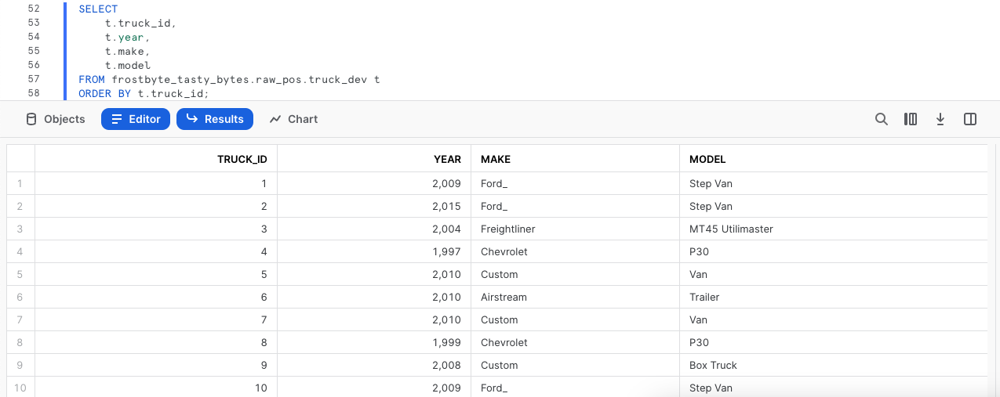
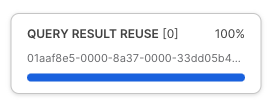
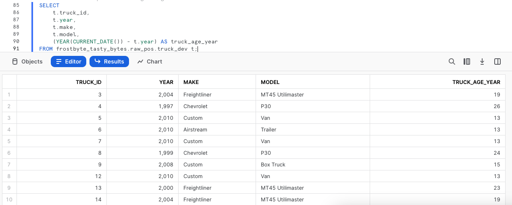
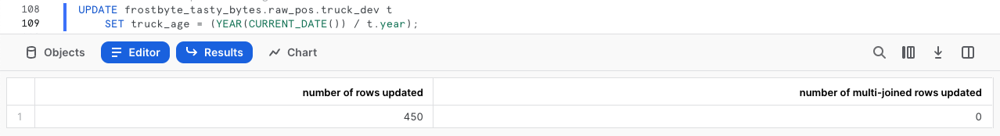

author: Jacob Kranzler
id: tasty_bytes_zero_to_snowflake_transformation
summary: Tasty Bytes - Zero to Snowflake - Transformation Quickstart
categories: Tasty-Bytes, Getting-Started, Featured
environments: web
status: Published 
feedback link: https://github.com/Snowflake-Labs/sfguides/issues
tags: Getting Started, Data Engineering, Data Warehouse

# Tasty Bytes - Zero to Snowflake - Transformation
<!-- ------------------------ -->

## Transformation in Snowflake
Duration: 1


### Overview
Welcome to the Powered by Tasty Bytes - Zero to Snowflake Quickstart focused on Transformation!

### Prerequisites
- Before beginning, please make sure you have completed the [**Introduction to Tasty Bytes Quickstart**](https://quickstarts.snowflake.com/guide/tasty_bytes_introduction/) which provides a walkthrough on setting up a trial account and deploying the Tasty Bytes Foundation required to complete this Quickstart.

### What You Will Learn
- A

### What You Will Build
- B

## Creating a Worksheet and Copying in our SQL
Duration: 1

### Overview
Within this Quickstart we will follow a Tasty Bytes themed story via a Snowsight SQL Worksheet with this page serving as a side by side guide complete with additional commentary, images and documentation links.

This section will walk you through logging into Snowflake, Creating a New Worksheet, Renaming the Worksheet, Copying SQL from GitHub, and Pasting the SQL we will be leveraging within this Quickstart.

### Step 1 - Accessing Snowflake via URL
- Open a browser window and enter the URL of your Snowflake Account 

### Step 2 - Logging into Snowflake
- Log into your Snowflake account.
    - 

### Step 3 - Navigating to Worksheets
- Click on the Worksheets Tab in the left-hand navigation bar.
    - 

### Step 4 - Creating a Worksheet
- Within Worksheets, click the "+" button in the top-right corner of Snowsight and choose "SQL Worksheet"
    - 

### Step 5 - Renaming a Worksheet
- Rename the Worksheet by clicking on the auto-generated Timestamp name and inputting "Tasty Bytes - Transformation"
    - 

### Step 6 - Accessing Quickstart SQL in GitHub
- Click the button below which will direct you to our Tasty Bytes SQL file that is hosted on GitHub.
<button>[tb_zts_transformation](https://github.com/Snowflake-Labs/sfquickstarts/blob/master/site/sfguides/src/tasty_bytes_zero_to_snowflake_transformation/assets/tb_zts_transformation)</button>

### Step 7 - Copying Setup SQL from GitHub
- Within GitHub navigate to the right side and click "Copy raw contents". This will copy all of the required SQL into your clipboard.
    - 

### Step 8 - Pasting Setup SQL from GitHub into your Snowflake Worksheet
- Path back to Snowsight and your newly created Worksheet and Paste (*CMD + V for Mac or CTRL + V for Windows*) what we just copied from GitHub.

### Step 9 - Click Next -->

## Instantly Clone Production Table for Development
Duration: 1

### Overview
As part of Tasty Bytes truck fleet analysis, our developer has been tasked with 
adding a calculated truck age column to our Truck table. 
 
Being a great developer, we know we cannot develop against a Production table, so we first need to create a Development environment that mimics Production.

### Step 1 - Create a Clone of Production
Thanks to Snowflakes unique architecture, we can instantly create a snapshot of our production `raw_pos.truck` using [CLONE](https://docs.snowflake.com/en/sql-reference/sql/create-clone) functionality and name it `raw_pos.truck_dev`.

Let's now run our next set our queries to set our `tasty_dev` role context and create the table clone noting here that we do not need to set warehouse context since cloning does not require one.

```
USE ROLE tasty_dev;

CREATE OR REPLACE TABLE frostbyte_tasty_bytes.raw_pos.truck_dev 
    CLONE frostbyte_tasty_bytes.raw_pos.truck;
```


> aside positive
> **Zero Copy Cloning**: Creates a copy of a database, schema or table. A snapshot of data present in the source object is taken when the clone is created and is made available to the cloned object. 
>The cloned object is writable and is independent of the clone source. That is, changes made to either the source object or the clone object are not part of the other. 
>

### Step 2 - Click Next -->

## Testing Snowflakes Query Result Set Cache
Duration: 1

### Overview
With our Zero Copy Clone instantly available we can now begin to develop against it without any fear of impacting production. However, before we make any changes let's first run some simple queries against it and test out Snowflakes Result Set Cache.

### Step 1 - Querying our Cloned Table
Now that we are going to query our table, we will need to use our `tasty_dev_wh`. Let's kick off the next two queries with the second statement producing an result set consisting of our trucks, their years, make and models while making sure we [ORDER BY](https://docs.snowflake.com/en/sql-reference/constructs/order-by) our `truck_id` column.

```
USE WAREHOUSE tasty_dev_wh;

SELECT
    t.truck_id,
    t.year,
    t.make,
    t.model
FROM frostbyte_tasty_bytes.raw_pos.truck_dev t
ORDER BY t.truck_id;
```


### Step 2 - Re-Running our Query
To test Snowflakes [Result Set Cache](https://docs.snowflake.com/en/user-guide/querying-persisted-results), the next query we run will be identical to what we just ran. However, we will now take things a step further and access the Query Profile showcasing this query returned results instantly as the the results came from our Result Set Cache.

After executing the below query, follow the steps in the screenshot to access the [Query Profile](https://docs.snowflake.com/en/user-guide/ui-query-profile). From the Query Profile we will see a single node noting `QUERY RESULT REUSE`.

```
SELECT
    t.truck_id,
    t.year,
    t.make,
    t.model
FROM frostbyte_tasty_bytes.raw_pos.truck_dev t
ORDER BY t.truck_id;
```



>aside positive
> If a user repeats a query that has already been run, and the data in the table(s) hasn’t changed since the last time that the query was run, then the result of the query is the same. Instead of running the query again, Snowflake simply returns the same result that it returned previously. 
>         
>This can substantially reduce query time because Snowflake bypasses query execution and, instead,retrieves the result directly from the cache.
>

### Step 3 - Click Next -->

## Updating Data and Calculating Food Truck Ages
Duration: 1

### Overview
Based on our output above we first need to address those **Ford_** records in our `make` column and correct them to be **Ford**. From there, we can begin to work on our calculation that will provide us with the age of each truck.

### Step 1 - Updating Incorrect Values in a Column
To begin this section, let's make sure we correct the typo by executing our next query which leverages [UPDATE](https://docs.snowflake.com/en/sql-reference/sql/update) to change rows in our `truck_dev` [WHERE](https://docs.snowflake.com/en/sql-reference/constructs/where) `make` is equal to Ford_.

```
UPDATE frostbyte_tasty_bytes.raw_pos.truck_dev 
SET make = 'Ford' 
WHERE make = 'Ford_';
```


### Step 2 - Building an Age Calculation
With the typo handled, we can now calculate the age in years of the trucks within our fleet. Please execute the next query where we will see [YEAR](https://docs.snowflake.com/en/sql-reference/functions/year) and [CURRENT_DATE](https://docs.snowflake.com/en/sql-reference/functions/current_date) leveraged to assist.

```
SELECT
    t.truck_id,
    t.year,
    t.make,
    t.model,
    (YEAR(CURRENT_DATE()) - t.year) AS truck_age_year
FROM frostbyte_tasty_bytes.raw_pos.truck_dev t;
```


### Step 3 - Click Next -->

## Adding a Column and Updating it
Duration: 0

### Overview
With our Truck Age in Years calculation done and dusted, let's now add a new column to our cloned table to support it and finish things off by updating the column to reflect the calculated values.

### Step 1 - Adding a Column to a Table
To start, please execute the next query which uses [ALTER TABLE... ADD COLUMN](https://docs.snowflake.com/en/sql-reference/sql/alter-table-column) to
create an empty `truck_age` column of [Data Type NUMBER](https://docs.snowflake.com/en/sql-reference/data-types-numeric) to our `truck_dev` table. This query will provide a `Statement executed successfully` result.
```
ALTER TABLE frostbyte_tasty_bytes.raw_pos.truck_dev
    ADD COLUMN truck_age NUMBER(4);
```

### Step 2 - Adding Calculate Values to our Column
With the column in place, we can kick off the next query which will [UPDATE](https://docs.snowflake.com/en/sql-reference/sql/update) the new, empty `truck_age` column using the Truck Age calculation we built in the previous section.
```
UPDATE frostbyte_tasty_bytes.raw_pos.truck_dev t
    SET truck_age = (YEAR(CURRENT_DATE()) / t.year);
```


### Step 3 - Click Next -->

## Leveraging Query History and Setting a SQL Variable
Duration: 0

### Overview

## Utilizing Time Travel for Data Disaster Recovery
Duration: 0

### Overview

## Swapping Development Table with Production
Duration: 0

### Overview

## Dropping and Undropping
Duration: 0

### Overview

## Conclusion and Next Steps
Duration: 0

### Overview
