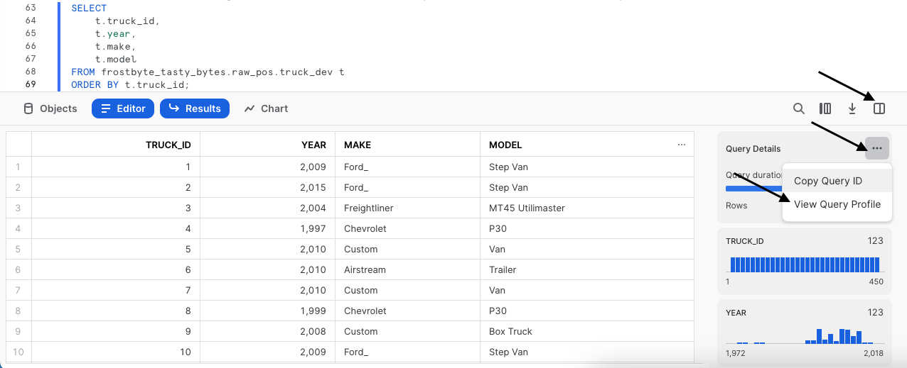
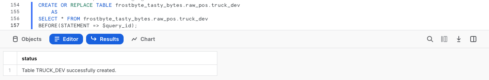
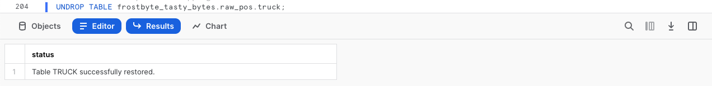

author: Jacob Kranzler
id: tasty_bytes_zero_to_snowflake_transformation_fr
summary: Tasty Bytes – Débuter avec Snowflake – Transformation
categories: Tasty-Bytes, Getting-Started, Featured
environments: web
status: Published 
feedback link: https://github.com/Snowflake-Labs/sfguides/issues
tags: Premiers pas, Getting Started, Data Engineering, Data Warehouse, fr  

# Tasty Bytes – Débuter avec Snowflake – Transformation
<!-- ------------------------ -->

## Transformation dans Snowflake
Duration: 1 

### Présentation
Bienvenue dans le guide Quickstart Powered by Tasty Bytes Débuter avec Snowflake sur la transformation !

Ce guide présente un large éventail de fonctionnalités Snowflake clés (clonage zéro copie et Time Travel, par exemple) qui permettent de répondre aux besoins de Tasty Bytes.

### Conditions préalables
- Avant de commencer, assurez-vous de suivre l’intégralité du guide Quickstart [**Présentation de Tasty Bytes**](/guide/tasty_bytes_introduction/index.html), qui explique comment configurer un compte d’essai et déployer les éléments de base de Tasty Bytes requis pour suivre ce guide Quickstart.

### Vous allez apprendre :
- Comment cloner une table
- Comment utiliser le cache de jeux de résultats de Snowflake
- Comment ajouter une colonne à une table
- Comment mettre à jour les données d’une colonne
- Comment utiliser la fonctionnalité Time Travel
- Comment échanger, supprimer et restaurer une table

### Vous allez :
- Découvrir la principale fonctionnalité de transformation Snowflake 
- Créer le clone d’une table de production pour créer une table de développement
- Ajouter une colonne à une table renseignant l’âge calculé, en années, des food trucks


## Créer une feuille de calcul et la copier dans un fichier SQL
Duration: 1

### Présentation
Dans ce guide Quickstart, vous allez suivre une histoire de Tasty Bytes via une feuille de calcul SQL Snowsight. Cette page, qui fait office de guide étape par étape, comprend également des commentaires, des images et des liens vers de la documentation.

Cette section vous explique comment vous connecter à Snowflake, comment créer une nouvelle feuille de calcul et la renommer, mais aussi comment copier le fichier SQL que nous allons utiliser dans ce guide Quickstart depuis GitHub et le coller.

### Étape 1 – Accéder à Snowflake via une URL
- Ouvrez une fenêtre de votre navigateur et saisissez l’URL de votre compte Snowflake. 

### Étape 2 – Se connecter à Snowflake
- Connectez-vous à votre compte Snowflake.
    - 

### Étape 3 – Accéder aux feuilles de calcul
- Cliquez sur l’onglet Worksheets (Feuilles de calcul) dans la barre de navigation de gauche.
    - 

### Étape 4 – Créer une feuille de calcul
- Sous l’onglet Worksheets (Feuilles de calcul), cliquez sur le bouton « + » dans le coin supérieur droit de Snowsight, puis sélectionnez « SQL Worksheet » (Feuille de calcul SQL).
    - 

### Étape 5 – Renommer une feuille de calcul
- Renommez la feuille de calcul en cliquant sur le nom généré automatiquement (horodatage), puis en saisissant « Tasty Bytes – Transformation ».
    - 

### Étape 6 – Accéder au fichier SQL de ce guide Quickstart dans GitHub
- Cliquez sur le bouton ci-dessous pour être redirigé vers notre fichier SQL Tasty Bytes hébergé sur GitHub. <button>[tb_zts_transformation](https://github.com/Snowflake-Labs/sf-samples/blob/main/samples/tasty_bytes/tb_zts_transformation.sql)</button>

### Étape 7 – Copier le fichier de configuration SQL depuis GitHub
- Dans GitHub, à droite, cliquez sur « Copy raw contents » (Copier le contenu brut). L’ensemble du fichier SQL requis est copié dans votre presse-papiers.
    - 

### Étape 8 – Coller le fichier de configuration SQL depuis GitHub dans une feuille de calcul Snowflake
- Revenez dans Snowsight et dans votre nouvelle feuille de calcul, puis collez (*CMD + V pour Mac ou CTRL + V pour Windows*) ce que vous venez de copier dans GitHub.

### Étape 9 – Cliquer sur Next (Suivant) -->

## Cloner instantanément une table de production pour créer une table de développement
Duration: 1

### Présentation
Dans le cadre de l’analyse de la flotte de camionnettes de Tasty Bytes, il vous a été demandé, en tant que développeur, d’ajouter une colonne Âge calculé des camionnettes dans notre table Camionnette. 
 
Experts en la matière, nous savons que nous ne pouvons pas développer une table de production. Nous devons donc commencer par créer un environnement de développement semblable à un environnement de production.

### Étape 1 – Créer le clone d’une table de production
Grâce à l’architecture unique de Snowflake, nous pouvons créer un instantané de notre table de production `raw_pos.truck` à l’aide de la fonctionnalité [CLONE](https://docs.snowflake.com/fr/sql-reference/sql/create-clone) et le nommer `raw_pos.truck_dev`.

Exécutons notre prochain ensemble de requêtes pour définir notre contexte de rôle `tasty_dev` et créer le clone de la table. Notons que nous n’avons pas besoin de définir de contexte d’entrepôt, car le clonage n’en nécessite aucun.

``` 
USE ROLE tasty_dev;

CREATE OR REPLACE TABLE frostbyte_tasty_bytes.raw_pos.truck_dev 
    CLONE frostbyte_tasty_bytes.raw_pos.truck; 
``` 


> aside positive **Clonage zéro copie** : permet de créer une copie d’une base de données, d’un schéma ou d’une table. Un instantané des données figurant dans l’objet source est créé au moment de la création du clone, puis est mis à la disposition de l’objet cloné. L’objet cloné est accessible en écriture et est indépendant de la source du clone. Autrement dit, aucune modification apportée à l’objet source n’est reproduite sur le clone, et vice-versa. 
>

### Étape 2 – Cliquer sur Next (Suivant) -->

## Tester le cache de jeux de résultats des requêtes de Snowflake
Duration: 1

### Présentation
Notre clone zéro copie étant disponible instantanément, nous pouvons commencer à le développer sans craindre d’affecter la table de production. Toutefois, avant d’y apporter des modifications, interrogeons-le en exécutant des requêtes simples pour tester le cache de jeux de résultats de Snowflake.

### Étape 1 – Interroger la table clonée
Pour interroger la table, nous allons devoir utiliser l’entrepôt `tasty_dev_wh`. 

Exécutons les deux requêtes suivantes avec la deuxième instruction pour produire un jeu de résultats composé de nos camionnettes, ainsi que de leurs âge, marque et modèle, tout en nous assurant de trier notre colonne `truck_id` avec la requête [ORDER BY](https://docs.snowflake.com/fr/sql-reference/constructs/order-by).

``` 
USE WAREHOUSE tasty_dev_wh;

SELECT 
    t.truck_id, 
    t.year, 
    t.make, 
    t.model 
FROM frostbyte_tasty_bytes.raw_pos.truck_dev t 
ORDER BY t.truck_id; 
```


### Étape 2 – Exécuter de nouveau la requête
Pour tester le [cache de jeux de résultats](https://docs.snowflake.com/fr/user-guide/querying-persisted-results) Snowflake, nous allons exécuter la même requête que la précédente. Nous allons aller plus loin et accéder au profil de requête, qui montre les résultats renvoyés instantanément par cette requête, ces derniers provenant de notre cache de jeux de résultats.

Après avoir exécuté la requête ci-dessous, suivez les étapes indiquées sur la capture d’écran pour accéder au [profil de requête](https://docs.snowflake.com/fr/user-guide/ui-query-profile). Dans le profil de requête, un seul nœud nommé `QUERY RESULT REUSE` apparaît.

```
SELECT
    t.truck_id,
    t.year,
    t.make,
    t.model
FROM frostbyte_tasty_bytes.raw_pos.truck_dev t
ORDER BY t.truck_id;
```

 

>aside positive Si un utilisateur répète une requête qui a déjà été exécutée et que les données de la ou des tables n’ont pas changé depuis la dernière fois que la requête a été exécutée, alors le résultat de la requête sera le même. Au lieu d’exécuter à nouveau la requête, Snowflake peut simplement renvoyer le même résultat que précédemment. 
>         
>Cette procédure permet de réduire considérablement le temps de requête, car Snowflake contourne l’exécution de la requête et, à la place, récupère le résultat directement dans le cache.
>

### Étape 3 – Cliquer sur Next (Suivant) -->

## Mettre à jour les données et calculer l’âge des food trucks
Duration: 1

### Présentation
Les résultats de la section ci-dessus montrent que nous devons tout d’abord corriger les fautes de frappe des enregistrements Ford_ figurant dans notre colonne `make`. Nous pourrons ensuite commencer notre calcul qui nous donnera l’âge de chaque camionnette.

### Étape 1 – Mettre à jour les valeurs incorrectes d’une colonne
Pour commencer cette section, assurons-nous de corriger les fautes de frappe en exécutant la requête suivante, qui utilise l’instruction [UPDATE](https://docs.snowflake.com/fr/sql-reference/sql/update) pour modifier les lignes de notre clause `truck_dev` [WHERE](https://docs.snowflake.com/fr/sql-reference/constructs/where) make = ’Ford_’.

```
UPDATE frostbyte_tasty_bytes.raw_pos.truck_dev 
SET make = 'Ford' 
WHERE make = 'Ford_';
```


### Étape 2 – Calculer l’âge
Une fois les fautes de frappe corrigées, nous pouvons calculer l’âge, en années, des camionnettes de notre flotte. Exécutez la requête suivante, où les fonctions [YEAR](https://docs.snowflake.com/fr/sql-reference/functions/year) et [CURRENT_DATE](https://docs.snowflake.com/fr/sql-reference/functions/current_date) seront utilisées pour le calcul.

```
SELECT
    t.truck_id,
    t.year,
    t.make,
    t.model,
    (YEAR(CURRENT_DATE()) - t.year) AS truck_age_year
FROM frostbyte_tasty_bytes.raw_pos.truck_dev t;
```


### Étape 3 – Cliquer sur Next (Suivant) -->

## Ajouter une colonne et la mettre à jour
Duration: 1

### Présentation
Une fois l’âge, en années, des camionnettes calculé et mis à jour, ajoutons une nouvelle colonne à notre table clonée en conséquence, puis mettons-la à jour avec les valeurs calculées.

### Étape 1 – Ajouter une colonne à une table
Pour commencer, exécutez la requête suivante, qui utilise la clause [ALTER TABLE... ADD COLUMN](https://docs.snowflake.com/fr/sql-reference/sql/alter-table-column) pour créer une colonne `truck_age` vide de [type de données numériques](https://docs.snowflake.com/fr/sql-reference/data-types-numeric) dans notre table `truck_dev`. 

Cette requête va renvoyer un résultat `Statement executed successfully`.

```
ALTER TABLE frostbyte_tasty_bytes.raw_pos.truck_dev
    ADD COLUMN truck_age NUMBER(4);
```

### Étape 2 – Ajouter des valeurs calculées dans une colonne
Une fois la colonne ajoutée, nous pouvons exécuter la requête [UPDATE](https://docs.snowflake.com/fr/sql-reference/sql/update), qui va mettre à jour la nouvelle colonne `truck_age` vide avec l’âge des camionnettes que nous avons calculé à la section précédente. 
```
UPDATE frostbyte_tasty_bytes.raw_pos.truck_dev t
    SET truck_age = (YEAR(CURRENT_DATE()) / t.year);
``` 


### Étape 3 – Interroger la nouvelle colonne
Une fois les données mises à jour, interrogeons la table en exécutant une requête rapide pour voir à quoi ressemble notre colonne `truck_age`. 
```
SELECT
    t.truck_id,
    t.year,
    t.truck_age
FROM frostbyte_tasty_bytes.raw_pos.truck_dev t;
``` 


**Oups !** Heureusement, nous avons eu la finesse d’esprit de ne pas réaliser ce processus à l’aveugle dans la table de production. 

Il semble que nous avons commis une erreur dans le calcul `truck_age`, en faisant une division au lieu d’une soustraction. Nous allons devoir corriger cela dans la section suivante.

### Étape 4 – Cliquer sur Next (Suivant) -->

## Utiliser la fonctionnalité Time Travel à des fins de récupération de données après sinistre
Duration: 1

### Présentation
Même si nous avons commis une erreur, Snowflake compte de nombreuses fonctionnalités pour y remédier. Le processus consiste à utiliser l’historique des requêtes, des variables SQL et Time Travel pour restaurer notre table `truck_dev` telle qu’elle était avant l’exécution de cette instruction de mise à jour incorrecte.

>aside positive La fonction Time Travel permet d’accéder à des données historiques (données qui ont été modifiées ou supprimées) à n’importe quel moment d’une période définie.
>

### Étape 1 – Exploiter l’historique des requêtes
Pour commencer notre processus de récupération, exécutons la requête suivante, qui utilisera la fonction [QUERY_HISTORY](https://docs.snowflake.com/fr/sql-reference/functions/query_history) de Snowflake pour récupérer la liste de toutes les instructions de mise à jour que nous avons exécutées sur notre table `truck_dev`. 
```
SELECT 
    query_id,
    query_text,
    user_name,
    query_type,
    start_time
FROM TABLE(frostbyte_tasty_bytes.information_schema.query_history())
WHERE 1=1
    AND query_type = 'UPDATE'
    AND query_text LIKE '%frostbyte_tasty_bytes.raw_pos.truck_dev%'
ORDER BY start_time DESC;
``` 


### Étape 2 – Définir une variable SQL
Comme prévu, nous voyons que nos fautes de frappe ont été corrigées et que notre calcul incorrect et les instructions query_id qui y sont associées ont été mis à jour. Exécutez la requête suivante, qui créé une variable SQL `query_id` que nous utiliserons pour annuler nos modifications via la fonction Time Travel lors de l’étape suivante. 

Cette requête va renvoyer un résultat `Statement executed successfully`. 
```
SET query_id = 
(
    SELECT TOP 1 query_id
    FROM TABLE(frostbyte_tasty_bytes.information_schema.query_history())
    WHERE 1=1
        AND query_type = 'UPDATE'
        AND query_text LIKE '%SET truck_age = (YEAR(CURRENT_DATE()) / t.year);'
    ORDER BY start_time DESC
);
```

### Étape 3 – Utiliser la fonction Time Travel pour restaurer une table
Étant donné que notre instruction query_id incorrecte est stockée en tant que variable, nous pouvons exécuter la requête suivante, qui restaurera notre table `truck_dev` telle qu’elle était avant (clause [BEFORE](https://docs.snowflake.com/fr/sql-reference/constructs/at-before)) l’exécution de l’instruction query_id incorrecte, et ce à l’aide de la fonction Time Travel. 

``` 
CREATE OR REPLACE TABLE frostbyte_tasty_bytes.raw_pos.truck_dev 
    AS 
SELECT * FROM frostbyte_tasty_bytes.raw_pos.truck_dev 
BEFORE(STATEMENT => $query_id); 
``` 


Pour connaître les autres options d’instruction Time Travel disponibles, consultez la liste ci-dessous.
>aside positive **AT :** le mot clé AT spécifie que la requête inclut tous les changements apportés par une instruction ou une transaction dont l’horodatage est égal au paramètre spécifié.
>
>**BEFORE :** le mot clé BEFORE spécifie que la requête se réfère à un point précédant immédiatement le paramètre spécifié.
>
>**TIMESTAMP :** spécifie une date et une heure exactes à utiliser pour Time Travel.
>
>**OFFSET :** spécifie le décalage, en secondes, par rapport à l’heure et la date actuelles pour utiliser Time Travel.
>
>**STATEMENT :** spécifie l’ID de requête d’une instruction à utiliser comme point de référence pour Time Travel.
>

### Étape 4 – Cliquer sur Next (Suivant) -->

## Basculer la table de développement en table de production
Duration: 1

### Présentation
Notre table `truck_dev` étant restaurée telle qu’elle était avant l’exécution de notre instruction de mise à jour incorrecte, nous pouvons désormais nous assurer que la colonne est correctement mise à jour. Nous allons basculer notre table, contenant le bon calcul, en table de production afin de réaliser la tâche qui nous a été attribuée.

### Étape 1 – Ajouter des valeurs correctement calculées dans une colonne
À l’aide du même processus, exécutez la requête suivante en vérifiant que nous utilisons bien une soustraction, et non une division.

```
UPDATE frostbyte_tasty_bytes.raw_pos.truck_dev t
SET truck_age = (YEAR(CURRENT_DATE()) - t.year);
```


### Étape 2 – Basculer la table de développement en table de production
Une fois que tout est terminé dans `truck_dev`, exécutez les deux requêtes suivantes, pour lesquelles nous supposons que le rôle privilégié est `sysadmin`. En tant que `sysadmin`, la deuxième requête utilise la clause [ALTER TABLE... SWAP WITH](https://docs.snowflake.com/en/sql-reference/sql/alter-table) pour modifier notre table `truck_dev` en `truck`, et vice versa.

Cette requête va renvoyer un résultat `Statement executed successfully.`.

``` 
USE ROLE sysadmin;

ALTER TABLE frostbyte_tasty_bytes.raw_pos.truck_dev 
    SWAP WITH frostbyte_tasty_bytes.raw_pos.truck; 
```

### Étape 3 – Valider la table de production
Pour confirmer la réussite du processus, jetons un œil à notre table de production `truck` pour pouvoir la valider et vérifier que les résultats `truck_age` sont valides.

``` 
SELECT 
    t.truck_id, 
    t.year, 
    t.truck_age FROM 
frostbyte_tasty_bytes.raw_pos.truck t 
WHERE t.make = 'Ford';
```


### Étape 4 – Cliquer sur Next (Suivant) -->

## Supprimer et restaurer des tables
Duration: 1

### Présentation
Nous pouvons officiellement dire que la tâche de développement qui nous avait été attribuée est achevée. La colonne `truck_age` étant ajoutée et ses valeurs correctement calculées, le `sysadmin` n’a plus qu’à nettoyer la table restante.

### Étape 1 – Supprimer une table
Pour supprimer la table de notre base de données, exécutez la requête suivante, qui utilise la clause [DROP TABLE](https://docs.snowflake.com/fr/sql-reference/sql/drop-table).

```
DROP TABLE frostbyte_tasty_bytes.raw_pos.truck;
```


**Oups !** Ce jeu de résultats montre que même le `sysadmin` peut commettre des erreurs. Nous avons supprimé par erreur la table de production `truck` au lieu de la table de développement `truck_dev` ! Heureusement, la fonction Time Travel de Snowflake peut de nouveau y remédier.

### Étape 2 – Restaurer une table
Avant que les systèmes ne soient impactés, empressez-vous d’exécuter la requête suivante ([UNDROP](https://docs.snowflake.com/fr/sql-reference/sql/undrop-table)), qui restaurera la table `truck`.

```
UNDROP TABLE frostbyte_tasty_bytes.raw_pos.truck;
```



### Étape 3 – Supprimer la bonne table
Finissons-en officiellement en exécutant la dernière requête afin de supprimer correctement la table `truck_dev`.

```
DROP TABLE frostbyte_tasty_bytes.raw_pos.truck_dev;
```


### Étape 4 – Cliquer sur Next (Suivant) -->

## Conclusion et étapes suivantes
Duration: 1

### Conclusion
Beau travail ! Vous avez terminé le guide Quickstart Tasty Bytes Débuter avec Snowflake sur la transformation. 

Vous avez : - Cloné une table - Utilisé le cache de jeux de résultats de Snowflake - Ajouté une colonne à une table - Mis à jour les données d’une colonne - Utilisé la fonction Time Travel à des fins de récupération de données après sinistre - Échangé, supprimé et restauré une table

Si vous voulez recommencer ce guide Quickstart, utilisez les scripts de réinitialisation en bas de votre feuille de calcul associée.

### Prochaines étapes
Pour continuer à découvrir le Data Cloud Snowflake, cliquez sur le lien ci-dessous pour voir tous les autres guides Quickstart Powered by Tasty Bytes à votre disposition.

- ### [Table des matières des guides Quickstart Powered by Tasty Bytes](/guide/tasty_bytes_introduction_fr/index.html#3)
